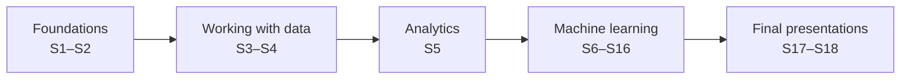

# Statistical Programming: Data Analytics and Machine Learning in Python

Learning hub for the MPMD elective **WP 5 Statistical Programming** at HTW Berlin, winter semester 2026/27. 5 ECTS · 18 weekly sessions of 3 × 45 minutes.

The course takes you from Python and SQL through data preparation and applied statistics to machine learning, from regression to language models, and to deploying what you build. Every method is practised on one running case study and then applied in your team project.



## Sessions

Each session folder contains a **README** (plan, materials, preparation), **theory** pages used in class, **workbooks** (Jupyter notebooks) or a **workspace** (a small Python project), and **source.md** with the origin and licence of every third-party file.

| | Session | Topics |
|---|---|---|
| 📍 1 | [Introduction: data careers, Python for analysis and for software engineering](sessions/01-careers-and-python/) | Data roles; uv, Jupyter, VS Code; pandas; from notebook to module; first classes |
| 📍 2 | [Software engineering for data work](sessions/02-software-engineering/) | Object-oriented programming, testing, APIs, Git and GitHub, continuous integration |
| 📍 3 | [Relational databases, SQL and Polars](sessions/03-sql-and-polars/) | Relational model, SQL queries, joins, window functions, PostgreSQL from Python, Polars |
| 📍 4 | [Data quality and preparation](sessions/04-data-quality/) | Quality checks as code, missing values and imputation, outliers, transformations |
| 📍 5 | [Exploratory analysis and statistics recap](sessions/05-eda-and-statistics/) | Descriptive statistics, chart design, tests, contingency tables, A/B tests, correlation |
| 📍 6 | [Introduction to machine learning with regression](sessions/06-regression/) | ML lifecycle, linear and logistic regression, underfitting and overfitting, robust regression |
| 📍 7 | [Validation and hyperparameter tuning](sessions/07-validation-and-tuning/) | Data splits, cross-validation, bootstrap, regularisation, tuning, leakage |
| 📍 8 | [Classification and evaluation metrics](sessions/08-classification-and-metrics/) | Preprocessing pipelines, k-NN, confusion matrix, ROC and PR curves, thresholds, calibration |
| 📍 9 | [Advanced feature engineering and imbalanced data](sessions/09-feature-engineering-and-imbalance/) | Date and interaction features, target encoding, leakage, undersampling, oversampling, SMOTE |
| 📍 10 | [Tree-based models](sessions/10-tree-based-models/) | Decision trees, random forests, gradient boosting, interpretation |
| 📍 11 | [Unsupervised learning](sessions/11-unsupervised-learning/) | Clustering, PCA, t-SNE and UMAP, anomaly detection |
| 📍 12 | [Time series forecasting](sessions/12-time-series/) | Baselines, exponential smoothing, lag features, backtesting |
| 📍 13 | [Classical NLP](sessions/13-classical-nlp/) | Bag-of-words, TF-IDF, text classification, error analysis |
| 📍 14 | [Large language models I: transformers and embeddings](sessions/14-llms-and-embeddings/) | Encoder and decoder models, embeddings, semantic search, LLMs for classification |
| 📍 15 | [Large language models II: retrieval-augmented generation and agents](sessions/15-rag-and-agents/) | RAG with pgvector, evaluation, tool calling, agents |
| 📍 16 | [Deployment, monitoring and maintenance](sessions/16-deployment-and-monitoring/) | FastAPI service, Docker, CI/CD, drift, retraining, model card |
| 📍 17–18 | [Final project presentations](sessions/17-18-final-presentations/) | Presentations of the seven team projects (graded) |

## Datasets and leaderboard

- **Sessions 1–12** use the Berlin listings of **Inside Airbnb** (prices, districts, availability, reviews) together with Berlin weather from the **Open-Meteo** API, and the **IBM Telco** churn data for classification.
- **Sessions 13–16** use decisions from the EU's **European Binding Tariff Information (EBTI)** database: customs authorities state how a described product is classified in the customs tariff. The task is to predict the four-digit HS heading from the description of goods, written in one of 23 EU languages. In these sessions your team submits predictions to the class leaderboard, scored on decisions from 2024–2026 that you have not seen; this task is also the final project.

Details, downloads and scoring: [case-study/README.md](case-study/README.md).

## Final project

All teams work on the same project: the EBTI leaderboard task, predicting the customs heading of a decision from its description as accurately as possible on the hidden test set. Teams present their final solution in Sessions 17–18; it is the only graded part of the module, assessed on how the problem is framed, handled, solved and explained. Brief, milestones, rules and criteria: [final-project.md](sessions/17-18-final-presentations/final-project.md).

## Setup

You need [uv](https://docs.astral.sh/uv/getting-started/installation/), Git and VS Code (or another editor). Then, in the repository folder:

```bash
uv sync                                   # creates .venv with the course packages
uv run python case-study/prepare_airbnb.py  # Inside Airbnb Berlin and Berlin weather (about 100 MB, once; Sessions 1–12)
uv run python case-study/prepare_data.py    # EBTI customs decisions (about 400 MB, once; Sessions 13–16)
uv run jupyter lab                        # opens the notebooks
```

- **macOS:** XGBoost and LightGBM (Sessions 10 and 12) need OpenMP: `brew install libomp`.
- Sessions 14–15 use embedding models, which need PyTorch: `uv sync --group embeddings`.
- A few third-party notebooks need extra packages, named in the session README: `uv sync --group extras` installs all of them; the ISLP labs need `uv sync --group islp`.
- Sessions 3 and 15 use PostgreSQL. The simplest way is Docker: `docker run --name course-db -e POSTGRES_PASSWORD=course -p 5432:5432 -d pgvector/pgvector:pg17`.
- Language-model sessions work with a local model through [Ollama](https://ollama.com/) or with any OpenAI-compatible API; see the session READMEs.
- Workspaces are separate small projects; run their tests with `cd sessions/<session>/workspace && uv run pytest`.

> [!TIP]
> If something does not install on your laptop, use GitHub Codespaces: the course environment is the same there.

## Using AI coding assistants

AI assistants are allowed in this course. Use them to explain, not to replace your understanding: you must be able to explain and test every line you submit, and you document their use with the HTW declaration. Session 1 gives practical tips.

## Licences and attribution

Third-party notebooks keep their original licences; each session's `source.md` lists the source, licence and any change. Some sources are licensed for non-commercial use only (CC BY-NC) or may only be shared unchanged (CC BY-NC-ND); this is noted per file. Course-written material (theory pages, own notebooks, workspaces) is licensed under CC BY 4.0. The case-study data come from the European Commission's EBTI database (reuse with acknowledgement of the source) and from Inside Airbnb (CC BY 4.0); each student downloads them with the provided scripts.

## Repository layout

```
sessions/NN-<topic>/
  README.md        session plan, materials, preparation
  theory/          pages used in class
  workbooks/       Jupyter notebooks (and data/ where needed)
  workspace/       small Python project (software-engineering sessions)
  source.md        origin and licence of third-party material
case-study/        data preparation and scoring for the running case study
pyproject.toml     course environment (uv sync)
proposal/          course proposal for the programme director (premise and curriculum plan)
```
