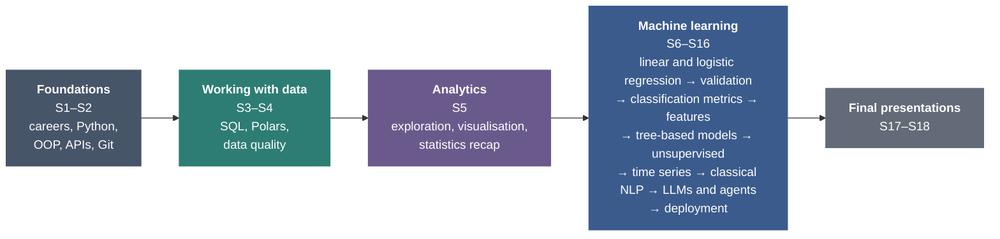
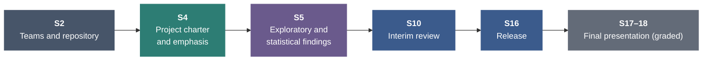
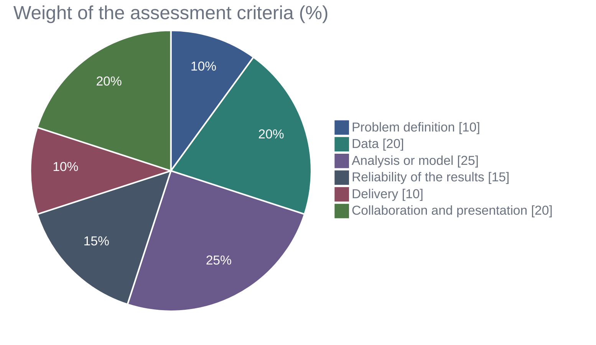

# Statistical Programming: Data Analytics and Machine Learning in Python

**Course proposal · MPMD elective WP 5 · HTW Berlin · Winter semester 2026/27 · Part 2 of 2: curriculum**

The course prepares students for the analyst and the data science track of data work. All students first learn the shared foundations: Python, collaborative development, SQL and the preparation of data. They then learn to explore, report and test data as analysts do, and finally to build, validate and deploy machine learning models, from regression to language models. Every topic is introduced from its foundations; no prior knowledge of machine learning or NLP is assumed. Methods are practised on one established NLP dataset with a class leaderboard and applied in a team project with an analytics or a machine learning emphasis.

The analysis behind these decisions (curriculum, labour market, comparable courses, dataset and assessment) is in Part 1, [PREMISE.md](PREMISE.md).

| Item | Proposal |
|---|---|
| Module | Statistical Programming (elective WP 5), 5 ECTS; proposed subtitle *Data Analytics and Machine Learning in Python* |
| Recommended semester | Semester 2 (elective slot 2.4), alongside 2.2 Data Mining; semester 3 remains possible |
| Teaching time | 54 UE in 18 weekly sessions of 3 UE (3 × 45 minutes with two 15-minute breaks) |
| Workload | 5 ECTS = 135 h: 40.5 h contact time (54 UE) and about 94.5 h self-study and project work (about 5 h per week) |
| Participants | 22 students in seven teams (six of three, one of four) |
| Structure | Foundations (2 sessions), working with data (2), analytics (1), machine learning (11), final presentations (2) |
| Running case study | EU customs decisions (European Binding Tariff Information): predict the HS heading of a product from its description, with a leaderboard on a hidden, time-based test set |
| Assessment | Final project with an analytics or machine learning emphasis, graded in its presentation (100 %) |

## Contents

- [1. Overview](#1-overview)
- [2. Module learning outcomes](#2-module-learning-outcomes)
- [3. Session overview](#3-session-overview)
- [4. Sessions](#4-sessions)
- [5. Running case study and leaderboard](#5-running-case-study-and-leaderboard)
- [6. Final project](#6-final-project)
- [7. Assessment](#7-assessment)

## 1. Overview

Data roles share a common base and then divide: analysts work mainly with SQL, Python for reporting, visualisation and statistical tests; data scientists and ML engineers build, validate and operate models ([Premise, Section 3](PREMISE.md#3-labour-market-requirements)). The course follows this structure.

- **Shared base (Sessions 1–4).** Every role needs Python, both for analysis in notebooks and for building applications (object-oriented programming, APIs), collaborative development with Git, SQL, Polars for large tables and the preparation of data.
- **Analytics (Session 5).** Exploration and visualisation together with the statistics recap of the module description: descriptive statistics, tests, contingency tables and correlation, applied in Python. Correlation leads directly into regression, the first model of the next part.
- **Machine learning (Sessions 6–16).** Built up from the simplest model to the most complex: linear and logistic regression, validation and tuning, classification and its evaluation metrics, feature engineering, tree-based models, unsupervised learning, forecasting, classical NLP, two sessions on large language models (from transformer and embedding models to RAG and agents) and deployment. The ML lifecycle is introduced at the start of this part.
- **One running case study and one project.** Every method is practised on the same dataset of EU customs decisions, with a class leaderboard from Session 8. Teams then apply the methods in a project with an analytics or a machine learning emphasis, graded in its presentation.

## 2. Module learning outcomes

After completing the module, students are able to

| # | Learning outcome | Sessions | Assessed in criterion |
|---|---|---|---|
| LO1 | write well-structured Python code for data tasks, check it with automated tests, and develop it in a team using Git, code review and continuous integration | S1–S2, used throughout | Collaboration and presentation |
| LO2 | load, query and prepare data from relational databases, APIs and larger files reproducibly, with SQL, pandas or Polars, and document its quality | S2–S4 | Data |
| LO3 | describe and compare data with suitable statistical methods and charts and report results with their uncertainty | S5, S7 | Analysis or model; uncertainty and validation |
| LO4 | build, validate and tune supervised and unsupervised models, from regression to tree-based models, without leakage | S6–S12 | Analysis or model; uncertainty and validation |
| LO5 | represent text for machine learning, use embedding and language models, including retrieval and agents, and evaluate them against baselines | S13–S15 | Analysis or model; uncertainty and validation |
| LO6 | deploy, monitor and document a model or a dashboard | S16 | Delivery |
| LO7 | define a data problem with a stakeholder, and present and defend the results individually | S1, S6, S17–S18 | Problem definition; collaboration and presentation |

Every learning outcome is assessed in at least one criterion of the final project ([Assessment](#7-assessment)).

## 3. Session overview

<picture>
  <source media="(prefers-color-scheme: dark)" srcset="assets/course-structure-timeline-dark.svg">
  
</picture>

| Week | Session | Part | Main roles |
|---|---|---|---|
| 1 | **S1** Introduction: data science careers, Python for analysis and Python for software engineering | Foundations | All |
| 2 | **S2** Software engineering for data work: object-oriented programming, APIs, testing, Git and continuous integration | Foundations | All |
| 3 | **S3** Relational databases, SQL and Polars | Working with data | All |
| 4 | **S4** Data quality and preparation: validation, missing values, outliers and transformations | Working with data | All |
| 5 | **S5** Exploratory analysis and statistics recap: descriptive statistics, visualisation, tests, contingency tables and correlation | Analytics | Analysts; all |
| 6 | **S6** Introduction to machine learning with regression: linear and logistic regression, underfitting and overfitting | Machine learning | Data scientists |
| 7 | **S7** Validation and hyperparameter tuning: data splits, cross-validation, bootstrap and leakage | Machine learning | Data scientists |
| 8 | **S8** Classification and evaluation metrics: preprocessing pipelines, k-nearest neighbours, confusion matrix, ROC curves and decision thresholds | Machine learning | Data scientists |
| 9 | **S9** Advanced feature engineering and imbalanced data | Machine learning | Data scientists |
| 10 | **S10** Tree-based models: decision trees, random forests and gradient boosting | Machine learning | Data scientists |
| 11 | **S11** Unsupervised learning: clustering, dimensionality reduction and anomaly detection | Machine learning | Data scientists; analysts for segmentation |
| 12 | **S12** Time series forecasting | Machine learning | Data scientists |
| 13 | **S13** Classical NLP: bag-of-words, TF-IDF and text classification | Machine learning | Data scientists |
| 14 | **S14** Large language models I: transformer models, embeddings and their applications | Machine learning | Data scientists, AI engineers |
| 15 | **S15** Large language models II: retrieval-augmented generation and agents | Machine learning | Data scientists, AI engineers |
| 16 | **S16** Deployment, monitoring and maintenance | Machine learning | ML engineers, data scientists; analysts for dashboards |
| 17 | **S17** Final project presentations I | Final presentations |  |
| 18 | **S18** Final project presentations II and course conclusion | Final presentations |  |

## 4. Sessions

For each session: the guiding question, the learning outcomes and the session plan. Each session has three teaching blocks of 45 minutes (0:00–0:45, 1:00–1:45, 2:00–2:45) with 15-minute breaks in between; each block combines a short input with live coding and an exercise.

### Foundations (Sessions 1–2)

#### 📍 Session 1 · Introduction: data science careers, Python for analysis and Python for software engineering

**Guiding question.** What do data professionals do, and how does Python for analysis differ from Python for building applications?

**Learning outcomes.** Students are able to

- describe the main data roles, their tasks and the skills they require
- set up a reproducible Python environment and analyse tabular data in a notebook
- explain the difference between analysis code in notebooks and application code in modules and classes

**Session plan**

**0:00–0:45**

- Data roles: data analyst, data scientist, ML and AI engineer, data engineer
- Tasks, skills and entry routes of each role
- Course organisation, assessment, the running case study and the leaderboard

*Practice:* Compare three job advertisements (analyst, data scientist, ML engineer) and list the skills they share and those that differ

**1:00–1:45**

- Python for analysis and its working environment (uv, Jupyter, VS Code)
- A refresher of the fundamentals (types, lists and dictionaries, conditions, loops, functions)
- Tabular data with pandas in a notebook
- Tips for using AI coding assistants

*Practice:* Case study: download the review data with the provided script and answer five questions about the reviews in a notebook

**2:00–2:45**

- Python for software engineering: from notebook to application
- Scripts, modules and packages
- Project structure
- A first introduction to object-oriented programming (classes, objects, attributes, methods)
- When to use a notebook and when an application

*Practice:* Turn the notebook analysis into a module with a small class that loads and summarises the reviews

**Team project until the next session.** Teams of three are formed and shortlist three project topics.

#### 📍 Session 2 · Software engineering for data work: object-oriented programming, APIs, testing, Git and continuous integration

**Guiding question.** How do we write data code that others can use, connect it to other systems, and develop it together without breaking it?

**Learning outcomes.** Students are able to

- design and use classes for data tasks and handle errors explicitly
- request data from a web API and write automated tests for the code that processes it
- work with Git branches and pull requests and set up a CI workflow that runs the tests

**Session plan**

**0:00–0:45**

- Object-oriented programming in practice: classes, methods, composition and inheritance, dataclasses
- Type hints and docstrings
- Exceptions and error handling
- Automated tests with pytest

*Practice:* Write and test a class that validates and cleans a review record

**1:00–1:45**

- What an API is and how web APIs work
- HTTP requests and responses, JSON, authentication, pagination and rate limits
- Requesting data with httpx
- A minimal API of one's own with FastAPI (developed further in Session 16)

*Practice:* Request records from a public open-data API, parse them into the validated class from the first block and test the parsing

**2:00–2:45**

- Git and GitHub: commits, branches, merging and merge conflicts
- Pull requests and code review
- Continuous integration with GitHub Actions (ruff and pytest on every pull request)

*Practice:* Case study: contribute a tested module of simple text features through a reviewed pull request; teams set up their repository with CI

**Team project until the next session.** Team repository from the template, with branch protection and CI.

### Working with data (Sessions 3–4)

#### 📍 Session 3 · Relational databases, SQL and Polars

**Guiding question.** How do we store, query and combine data reliably, and how do we process large tables efficiently in Python?

**Learning outcomes.** Students are able to

- describe a relational schema with primary and foreign keys and write SQL queries that filter, join and aggregate data
- load data reproducibly into PostgreSQL and continue the analysis in Python
- process large tables efficiently with Polars and choose between SQL, pandas and Polars

**Session plan**

**0:00–0:45**

- The relational model: tables, primary and foreign keys, relationships
- PostgreSQL as the course database
- Basic queries: SELECT, WHERE, ORDER BY, LIMIT
- Aggregation with GROUP BY and HAVING
- INNER and LEFT JOIN; NULL values in joins and aggregates

*Practice:* Answer first questions about the reviews in SQL; average rating per store; join reviews with product prices and count products without a price

**1:00–1:45**

- Common table expressions and window functions
- Access from Python with SQLAlchemy and pandas
- Loading data reproducibly with an ingestion script and constraints
- Documenting a dataset (data card)

*Practice:* Case study: load reviews and products into PostgreSQL with the provided script; rank products by reviews per year with a window function; write a short data card

**2:00–2:45**

- Limits of pandas: memory, single-threaded execution, eager evaluation
- Polars: expressions, lazy queries and the query optimiser, streaming of larger-than-memory data, Parquet files
- The same query in SQL, pandas and Polars
- Choosing a tool: SQL database, pandas or Polars, depending on data size and task

*Practice:* Case study: run the same aggregation on all 494,121 reviews in pandas and Polars and compare code, runtime and memory use

**Team project until the next session.** Identify the project's data sources and load a first extract into the team database.

#### 📍 Session 4 · Data quality and preparation: validation, missing values, outliers and transformations

**Guiding question.** Can we trust the data, and how do we prepare it for analysis?

**Learning outcomes.** Students are able to

- check data quality systematically and express the checks as code
- analyse missing values and choose an imputation method
- detect and treat outliers and apply suitable transformations, documenting each decision

**Session plan**

**0:00–0:45**

- Dimensions of data quality
- Checks for types, ranges, duplicates and consistency
- Validation rules as tests

*Practice:* Write a data quality report for the review data

**1:00–1:45**

- Missing data mechanisms (MCAR, MAR, MNAR)
- Simple, KNN and iterative imputation
- Missing-value indicators
- Univariate outliers (IQR rule, z-score, median absolute deviation)

*Practice:* Is a missing product price related to the number of reviews? Compare imputation methods

**2:00–2:45**

- Multivariate outliers with the Mahalanobis distance (model-based detection follows in Session 11)
- Transformations (logarithm, Box–Cox, Yeo–Johnson, scaling)
- A documented cleaning pipeline

*Practice:* Case study: produce the cleaned review table with a log of the cleaning decisions

**Team project until the next session.** Project charter: question, stakeholder, emphasis (analytics or machine learning), metric, baseline, data loaded.

### Analytics (Session 5)

#### 📍 Session 5 · Exploratory analysis and statistics recap: descriptive statistics, visualisation, tests, contingency tables and correlation

**Guiding question.** What is in the data, which differences and relationships are real, and how do we show them?

**Learning outcomes.** Students are able to

- describe data by variable type with descriptive statistics and well-designed charts
- apply statistical tests and contingency tables in Python and report confidence intervals and effect sizes
- compute and interpret correlations as the starting point for regression

**Session plan**

**0:00–0:45**

- Describing data by variable type: distributions, centre and spread, robust summaries, frequency tables
- Choosing and designing charts with matplotlib, seaborn and Plotly (perception, colour, accessibility, annotation)

*Practice:* Rating distribution and number of reviews per month; improve a poorly designed chart

**1:00–1:45**

- Comparing groups: t-test and Mann–Whitney test with confidence intervals and effect sizes
- Categorical data: contingency tables, chi-square test and Cramér's V
- A/B tests as an application
- Choosing a test from a decision table

*Practice:* Do verified purchases rate differently? Label × verified purchase: significant but negligible

**2:00–2:45**

- Relationships between numerical variables: scatter plots, Pearson and Spearman correlation, confounding and Simpson's paradox
- From correlation to the regression line (the bridge to Session 6)
- Communicating findings in a short report or a Streamlit dashboard

*Practice:* Case study: correlation of text length and helpful votes; a one-page report or dashboard for a product manager

**Team project until the next session.** Exploratory and statistical findings of the project, presented in a short team review.

### Machine learning (Sessions 6–16)

#### 📍 Session 6 · Introduction to machine learning with regression: linear and logistic regression, underfitting and overfitting

**Guiding question.** How does a model learn from data, and how do we know whether it has learned too little or too much?

**Learning outcomes.** Students are able to

- describe the ten steps of the ML lifecycle and relate them to the earlier sessions
- split data into training and test sets and fit, interpret and evaluate a linear regression
- recognise underfitting and overfitting and use robust regression for data with outliers
- fit and interpret a logistic regression for a binary outcome

<picture>
  <source media="(prefers-color-scheme: dark)" srcset="assets/ml-lifecycle-ten-steps-dark.svg">
  
</picture>

**Session plan**

**0:00–0:45**

- The ML lifecycle in ten steps, from problem definition (target, metric, baseline) to maintenance, and how Sessions 3–5 already covered data collection, cleaning and exploration
- Supervised learning: features, target, training, prediction
- The data split into training and test sets
- Simple and multiple linear regression (least squares, coefficients, residuals)
- Regression metrics (MAE, RMSE, R²)

*Practice:* Map the review-sentiment task to the ten steps; split the data and model the number of helpful votes with linear regression

**1:00–1:45**

- Underfitting and overfitting: model complexity (polynomial degree), training versus test error, the bias–variance trade-off
- Robust regression (Huber, quantile regression) for data with outliers

*Practice:* Compare training and test error for increasing model complexity; compare least squares and robust regression on helpful votes

**2:00–2:45**

- Logistic regression: from a linear model to probabilities (sigmoid), log-odds and the interpretation of coefficients
- Fitting with statsmodels and scikit-learn
- A first look at predicted classes

*Practice:* Case study: predict churn probability for the IBM Telco customers with logistic regression and interpret the coefficients

**Team project until the next session.** Machine learning teams fit a first model; analytics teams complete their statistical analysis.

#### 📍 Session 7 · Validation and hyperparameter tuning: data splits, cross-validation, bootstrap and leakage

**Guiding question.** How well will a model perform on data it has never seen, and how do we choose its settings?

**Learning outcomes.** Students are able to

- split data into training, validation and test sets and estimate performance with cross-validation
- diagnose underfitting and overfitting with validation and learning curves
- control model complexity with regularisation, tune hyperparameters with grid and randomised search and prevent data leakage

**Session plan**

**0:00–0:45**

- Training, validation and test data and their roles
- Why a single split is unreliable
- k-fold and stratified cross-validation
- Grouped and time-series splits
- Bootstrap confidence interval of a metric

*Practice:* Cross-validate the regression and logistic models of Session 6 and report the scores with confidence intervals

**1:00–1:45**

- Parameters and hyperparameters
- Regularisation with ridge and lasso, and the penalty as a hyperparameter
- Validation curves and learning curves to diagnose underfitting and overfitting
- Hyperparameter tuning with GridSearchCV and RandomizedSearchCV

*Practice:* Tune the ridge penalty and the regularisation of logistic regression; compare random and time-based validation on the reviews

**2:00–2:45**

- Data leakage: preprocessing outside the cross-validation, target leakage
- Preprocessing inside a Pipeline
- Nested cross-validation
- The final test on held-out data

*Practice:* Demonstrate a leaking workflow, then fix it with a Pipeline and compare the scores

**Team project until the next session.** Validation plan for the project model (machine learning teams); uncertainty of key results (analytics teams).

#### 📍 Session 8 · Classification and evaluation metrics: preprocessing pipelines, k-nearest neighbours, confusion matrix, ROC curves and decision thresholds

**Guiding question.** Which customers will cancel, and how do we measure whether a classifier is good enough?

**Learning outcomes.** Students are able to

- prepare mixed numerical and categorical inputs in a preprocessing pipeline
- build classification models and compare them with baselines
- evaluate classifiers with the confusion matrix, precision, recall, F1, macro-F1, ROC curves and AUC, and set a decision threshold from the costs of errors

**Session plan**

**0:00–0:45**

- Classification tasks: predicting a category; baselines (majority class, hand-made rule)
- Preparing inputs: one-hot and ordinal encoding of categories, scaling of numerical features
- Pipeline and ColumnTransformer, so that preprocessing is fitted on the training data only
- k-nearest neighbours and the decision boundary; underfitting and overfitting with the number of neighbours

*Practice:* Build a preprocessing pipeline for the IBM Telco data and compare a churn rule, k-NN and logistic regression

**1:00–1:45**

- Evaluation metrics for classification: confusion matrix, accuracy, precision, recall, F1 and macro-F1
- The ROC curve and AUC
- The precision–recall curve

*Practice:* Evaluate the churn models with confusion matrices and ROC curves and explain which metric fits the business question

**2:00–2:45**

- Decision thresholds from the costs of errors
- Calibration of predicted probabilities

*Practice:* Case study: first leaderboard submission, a logistic regression on the simple text features of Session 2

**Team project until the next session.** Baseline and first validated model.

#### 📍 Session 9 · Advanced feature engineering and imbalanced data

**Guiding question.** Which additional inputs make a model better, how do we build them without leakage, and what do we do when one class is rare?

**Learning outcomes.** Students are able to

- construct features from dates, interactions, high-cardinality categories and joined tables
- implement feature construction in pipelines without leakage
- handle class imbalance with undersampling, oversampling and class weights, applied only to the training data

**Session plan**

**0:00–0:45**

- Features from dates and times; interactions between features
- High-cardinality categories: grouping rare categories, target encoding and its leakage risk
- Custom transformers in scikit-learn pipelines

*Practice:* Build date, interaction and target-encoded store features for the reviews

**1:00–1:45**

- Aggregates from joined tables, computed only from past data
- Target leakage through aggregates
- Simple text statistics as features

*Practice:* Case study: detect a leaking product-rating feature (it contains the review's own rating) and replace it with the mean of earlier reviews of the same product

**2:00–2:45**

- Class imbalance and why accuracy misleads
- Random undersampling and oversampling
- Synthetic oversampling (SMOTE)
- Class weights as an alternative
- Resampling inside the cross-validation only, never on validation or test data
- Pipelines with imbalanced-learn

*Practice:* Case study: compare undersampling, oversampling, SMOTE and class weights for the rare neutral class of the reviews by macro-F1

**Team project until the next session.** Feature set for the project model, documented in the repository.

#### 📍 Session 10 · Tree-based models: decision trees, random forests and gradient boosting

**Guiding question.** Can a more flexible model do better, and what does it cost?

**Learning outcomes.** Students are able to

- explain how decision trees, random forests and gradient boosting predict
- train, tune and compare XGBoost, LightGBM and CatBoost
- interpret a tree ensemble

**Session plan**

**0:00–0:45**

- Decision trees: splits, Gini impurity computed by hand
- Tree depth as a hyperparameter, overfitting of deep trees and pruning

*Practice:* Fit and visualise a decision tree on the churn data

**1:00–1:45**

- Bagging and random forests
- Gradient boosting
- XGBoost, LightGBM and CatBoost
- Categorical features, class weights, early stopping and tuning

*Practice:* Train and tune gradient boosting models on the churn data and compare them

**2:00–2:45**

- Interpretation of tree-based models with feature importance, permutation importance and SHAP values
- Comparing a challenger with the current model

*Practice:* Case study: leaderboard submission with gradient boosting on the features of Session 9

**Team project until the next session.** Interim review (10 minutes per team): model or dashboard, validation, plan to the end.

#### 📍 Session 11 · Unsupervised learning: clustering, dimensionality reduction and anomaly detection

**Guiding question.** What structure is in the data when there is no target to predict?

**Learning outcomes.** Students are able to

- distinguish unsupervised from supervised learning and explain why its evaluation is harder
- apply and evaluate k-means, hierarchical and density-based clustering
- reduce dimensionality with PCA, visualise high-dimensional data and detect anomalies

**Session plan**

**0:00–0:45**

- Supervised and unsupervised learning
- Distance, similarity and scaling
- k-means computed by hand on a small example
- Choosing the number of clusters (elbow method, silhouette)

*Practice:* Segment the churn customers with k-means and describe the segments

**1:00–1:45**

- Hierarchical clustering and dendrograms
- Density-based clustering (DBSCAN)
- Evaluating and interpreting clusters (silhouette, stability, cluster profiles)

*Practice:* Compare k-means, hierarchical clustering and DBSCAN on product-level features

**2:00–2:45**

- Dimensionality reduction: principal component analysis (explained variance, loadings)
- t-SNE and UMAP for visualisation
- Model-based anomaly detection with Isolation Forest and local outlier factor, continuing the outliers of Session 4
- Clusters and components as features

*Practice:* Case study: cluster products by their review statistics, visualise them with PCA and test whether cluster membership improves the tree-based model of Session 10

**Team project until the next session.** Segmentation or anomaly detection where it supports the project.

#### 📍 Session 12 · Time series forecasting

**Guiding question.** How much will happen next month, and how certain is the forecast?

**Learning outcomes.** Students are able to

- describe a time series and produce baseline forecasts
- fit an exponential smoothing model and a lag-feature model
- evaluate forecasts with backtesting and report prediction intervals

**Session plan**

**0:00–0:45**

- Time series: trend, seasonality, autocorrelation
- Aggregating to regular time intervals with pandas
- Baselines (naive, seasonal naive, moving average)

*Practice:* Compute the monthly number of reviews and its baseline forecasts

**1:00–1:45**

- Exponential smoothing with prediction intervals
- ARIMA as an outlook

*Practice:* Fit exponential smoothing and compare it with the baselines

**2:00–2:45**

- Machine learning with lag features (using the tree-based models of Session 10)
- Rolling-origin backtesting
- Forecast metrics: MAE and MASE

*Practice:* Case study: backtest the models and recommend one with its prediction interval

**Team project until the next session.** Forecasting component where the project needs one; otherwise model improvement.

#### 📍 Session 13 · Classical NLP: bag-of-words, TF-IDF and text classification

**Guiding question.** What can a model learn from the words themselves?

**Learning outcomes.** Students are able to

- represent text as word counts and TF-IDF vectors
- train and evaluate a text classifier on high-dimensional data
- analyse the errors of a text model

**Session plan**

**0:00–0:45**

- Documents, tokens and vocabulary
- Preprocessing (lower-casing, stop words, stemming and lemmatisation)
- Bag-of-words computed by hand
- Sparse, high-dimensional matrices

*Practice:* Build the vocabulary of the reviews and inspect the document-term matrix

**1:00–1:45**

- TF-IDF and n-grams
- Linear models for text classification
- Per-class metrics

*Practice:* Case study: leaderboard submission with a TF-IDF classifier

**2:00–2:45**

- Error analysis of text models
- The most informative n-grams per class
- Dimensionality reduction with truncated SVD
- Limits of word counts (word order, synonyms) as the motivation for language models

*Practice:* Analyse 20 misclassified reviews and improve the classifier

**Team project until the next session.** Text features where the project uses text; otherwise model improvement.

#### 📍 Session 14 · Large language models I: transformer models, embeddings and their applications

**Guiding question.** How do language models represent and generate text, and what can we use them for?

**Learning outcomes.** Students are able to

- explain the transformer idea and the difference between encoder, decoder and encoder–decoder models
- use embedding models for semantic search, clustering and as features for classification
- use a generative model through an API for classification with structured output and compare it with a trained model

**Session plan**

**0:00–0:45**

- From words to vectors: tokens, embeddings, attention and pre-training at a conceptual level
- Encoder models (BERT type), decoder models (GPT type) and encoder–decoder models
- Embedding models (sentence-transformers)

*Practice:* Tokenise reviews and compare token counts; compute semantic similarity between review sentences

**1:00–1:45**

- Applications of embedding models: semantic search, clustering (with the methods of Session 11) and classification features compared with TF-IDF

*Practice:* Embedding features versus TF-IDF on a subsample; nearest-neighbour search over reviews

**2:00–2:45**

- Applications of generative models: prompts, temperature, context window and costs
- Zero-shot and few-shot classification with structured output
- Comparison with a trained model on quality, cost, latency and data protection

*Practice:* Case study: compare an LLM with the trained classifier on 200 reviews

**Team project until the next session.** Decide with evidence whether a language-model component improves the project.

#### 📍 Session 15 · Large language models II: retrieval-augmented generation and agents

**Guiding question.** How do we let a language model answer from our own data and use tools, and how do we evaluate the result?

**Learning outcomes.** Students are able to

- build a retrieval-augmented generation pipeline over a document collection
- evaluate retrieval and answers with a labelled test set
- build a simple agent with tool calling and assess its risks

**Session plan**

**0:00–0:45**

- Why retrieval: knowledge cut-off, hallucination, sources
- The components of RAG: chunking, embedding, vector search in PostgreSQL with pgvector, prompt assembly, answers with citations

*Practice:* Build semantic search over the reviews in PostgreSQL

**1:00–1:45**

- Evaluating RAG: a test set of questions, recall@k, groundedness and human ratings
- Improving retrieval (chunk size, hybrid search, re-ranking)

*Practice:* Case study: a RAG prototype that answers questions about products from their reviews, with recall@5 on ten labelled questions

**2:00–2:45**

- Agents: tool calling, the loop of planning, acting and observing, function schemas
- Risks (error propagation, costs, prompt injection) and guardrails

*Practice:* Build a small agent with two tools (an SQL query and the review search) and evaluate it on ten tasks

**Team project until the next session.** Language-model component of the project, where chosen, with its evaluation.

#### 📍 Session 16 · Deployment, monitoring and maintenance

**Guiding question.** How does a model or dashboard reach its users, and how does it stay useful?

**Learning outcomes.** Students are able to

- serve a model as a tested web API in a container, released with CI/CD
- monitor a deployed model for data drift and label shift
- decide on retraining and document a model in a model card

**Session plan**

**0:00–0:45**

- From notebook to service: saving pipelines, versioning, pinned dependencies
- The prediction API with FastAPI and pydantic, building on Session 2
- Tests for the service

*Practice:* Build and test version 1 of the sentiment service

**1:00–1:45**

- Containers with Docker
- Continuous delivery with GitHub Actions
- Publishing a dashboard

*Practice:* Release the service in a container through the CI/CD workflow

**2:00–2:45**

- Monitoring: data drift (KS test, population stability index), label shift
- Retraining triggers and versioning
- Documenting a model in a model card

*Practice:* Case study: the 2022 labels are released as feedback data; detect the shift (negative share 19 % → 26 %), retrain and make the final leaderboard submission, ranked on the 2023 reviews

**Team project until the next session.** Release: dashboard or deployed model, repository and documentation complete.

### Final presentations (Sessions 17–18)

#### 📍 Session 17 · Final project presentations I

**Session plan**

| Time | Activity |
|---|---|
| 0:00–0:05 | Opening: order of presentations, assessment criteria, rules for questions |
| 0:05–0:30 | Team 1: 15 minutes presentation with live demonstration, 10 minutes of questions, including individual questions to each member |
| 0:30–0:55 | Team 2: same format |
| 0:55–1:10 | Break (placed between teams, so that no presentation is interrupted); written peer feedback on Teams 1–2 |
| 1:10–1:35 | Team 3: same format |
| 1:35–2:00 | Team 4: same format |
| 2:00–2:15 | Break; peer feedback on Teams 3–4 |
| 2:15–2:45 | Common observations from the four presentations; organisation of Session 18 |

#### 📍 Session 18 · Final project presentations II and course conclusion

**Session plan**

| Time | Activity |
|---|---|
| 0:00–0:05 | Opening: order of Teams 5–7 and assessment criteria |
| 0:05–0:30 | Team 5: 15 minutes presentation with live demonstration, 10 minutes of questions, including individual questions to each member |
| 0:30–0:45 | Written peer feedback on Team 5; Team 6 prepares its demonstration |
| 0:45–1:00 | Break |
| 1:00–1:25 | Team 6: same format |
| 1:25–1:45 | Leaderboard results on the 2025–2026 decisions: the leading teams explain features, model and validation |
| 1:45–2:00 | Break |
| 2:00–2:25 | Team 7: same format |
| 2:25–2:45 | Course review; course evaluation (anonymous, in class) |

## 5. Running case study and leaderboard

The running case study uses decisions from the European Commission's **European Binding Tariff Information (EBTI)** database. A trader asks the customs authority of a member state how a product is classified in the customs tariff; the authority states the code in a binding decision, and the Commission publishes all decisions. The course task is to predict the four-digit HS heading of a decision from its description of goods. Why this dataset was chosen is set out in [Premise, Section 6](PREMISE.md#6-choice-of-the-course-dataset).

The prepared data contain 309,529 training decisions (2017–2023) and 113,188 test decisions (2024–2026), with 1,114 headings in the training data. Descriptions are written in the language of the issuing country: 57 % German, 16 % French and the rest in 20 other EU languages; each training decision also carries English keywords. A second table holds the HS nomenclature (sections, chapters, headings) in English, and a third the monthly number of decisions since 2004.

| Part | Use of the dataset |
|---|---|
| Foundations and data | Loading with pandas and into PostgreSQL; SQL across decisions and nomenclature; Polars on the full export of 1.05 million decisions; data-quality checks (impossible dates, duplicates, code formats); cleaned table |
| Analytics | Decisions by country, language and chapter; description length across languages; country × section contingency tables; a dashboard of decisions over time |
| Machine learning | Regression and robust regression on decision durations; validation with time-based splits; a classifier for 1,000+ headings with accuracy, macro-F1 and abstention; features without leakage and the long tail of rare headings; tree-based models; clusters and unusual decisions; forecast of monthly decision counts (Brexit, COVID); multilingual TF-IDF; multilingual embeddings and LLMs; a retrieval-based classification assistant; deployed service, drift and retraining |

### Leaderboard

- **Task:** predict the heading of each test decision from its description, issuing country, language and date.
- **Split:** decisions of 2024 form the public leaderboard, decisions of 2025–2026 the private leaderboard. Test decisions whose description repeats a training description are removed.
- **Metric:** accuracy, with macro-F1 reported alongside. Reference values on the public leaderboard: always the most frequent heading 4 %; logistic regression on simple features 8 %; word TF-IDF with a linear model 81 % (50,000-decision sample) and 87 % (full training set); character TF-IDF 88 %. On the private years the same models score about three points lower, an effect of drift that Session 16 takes up.
- **Rounds:** L1 simple features (Session 8), L2 tree-based models (10), L3 TF-IDF models (13), L4 final model after retraining with the released 2024 labels (16). The final ranking is presented in Session 18.
- **Platform:** Codabench (free, open source, operated by Université Paris-Saclay; submission of a CSV file; hidden solution; public and private leaderboard). Students register with a pseudonym; alternatively the lecturer submits on behalf of a team.

> [!NOTE]
> **Licence and fairness.** The Commission permits reuse of the EBTI data with acknowledgement of the source; each student downloads them with the provided script. Because decisions can be looked up in the public database, the leaderboard is deliberately not graded.

**Secondary dataset.** Tabular classification, including the churn prediction named in the module description, is taught on the IBM Telco customer churn sample data (7,043 customers, 26.5 % churn), which is small enough for live computation in class.

## 6. Final project

Teams of three choose a topic from the list below, or propose their own of comparable scope. In the project charter (Session 4) each team chooses an emphasis.

- **Analytics emphasis** (typical roles: data or business analyst): the project answers a decision question with exploratory findings, statistical tests or an A/B-test design, and delivers a dashboard or automated report for the stakeholder.
- **Machine learning emphasis** (typical roles: data scientist, ML engineer): the project predicts an outcome with a validated model compared with a baseline, and delivers a deployed model service with a monitoring plan and a model card.

Every project shares the same base: a problem defined with a stakeholder, public data loaded and cleaned by a reproducible script, documented data quality, a Git repository with reviewed pull requests and CI, and a presentation.

### Project topics

The list contains 17 topics on Berlin and German public data in four domains; most can be worked on with either emphasis. Each topic names a stakeholder, the data sources and their quality issues, and the expected statistics, models and delivery.

| Topic | Domain | Methods | Level |
|---|---|---|---|
| Short-term rentals in Berlin under EU Regulation 2024/1028 | Housing | NLP, Time series, Spatial | Standard |
| A rent checker based on the Berlin Mietspiegel 2026 | Housing | Spatial | Standard |
| Screening for displacement pressure in Berlin planning areas | Housing | Spatial | Advanced |
| Residential construction in Berlin: from building permits to completions | Housing | Time series | Standard |
| A searchable database of answers to written questions in the Berlin parliament | Housing | NLP | Advanced |
| Language requirements in Berlin job advertisements | Migration | NLP, Time series | Standard |
| Availability of Berlin's public-service information in English | Migration | NLP | Standard |
| A validated database of BAMF asylum statistics | Migration | Time series | Standard |
| Integration courses in Berlin after the 2026 budget cuts | Migration | Time series, Spatial | Advanced |
| Heat and health in Berlin: effects and short-term forecasts | Health | Time series | Standard |
| Ambulance response times and social disadvantage in Berlin | Health | Time series, Spatial | Standard |
| Wastewater surveillance as an early indicator of respiratory infection waves | Health | Time series | Standard |
| Reconstructing the history of drug shortages in Germany | Health | NLP, Time series | Advanced |
| Heat vulnerability and access to cool rooms in Berlin | Environment | Spatial | Standard |
| Volunteer watering and street-tree survival in Berlin | Environment | Spatial, Time series | Standard |
| Air quality after the partial withdrawal of Tempo 30 zones in Berlin | Environment | Time series | Advanced |
| Progress towards Berlin's heat-planning and solar targets by district | Environment | Time series, Spatial | Standard |
| Student-proposed topic (including company or NGO partners) | Open | NLP, Time series, Spatial | Standard |

**Own topics.** Teams may propose their own topic, including one with a company or NGO partner, if it has a named stakeholder, uses data that may legally be used and meets the requirements of the shared base and of its emphasis. Kaggle and other prepared datasets with a predefined target variable are excluded. Company data require written permission and a data-protection review; personal data may not leave the company.

## 7. Assessment

**Final project with presentation · 100 % · Sessions 17 and 18**

> [!NOTE]
> The module is assessed by one examination component: the final project, graded in its presentation. Weekly exercises and the leaderboard are not graded; they prepare the project. The module page currently lists a quiz (30 %), a take-home coding assignment (40 %) and an oral examination in the form of a job-interview simulation (30 %). The change to a single graded project presentation must be approved and announced at the start of the semester (RStPO §§ 9–14); the reasons are set out in [Premise, Section 7](PREMISE.md#7-choice-of-the-assessment-format).

**What is assessed**

- **Repository**, frozen with a release tag the day before Session 17: code, a README that lets a reader rerun the work from raw data to result, documentation of data and decisions, and the history of reviewed pull requests.
- **Presentation**: 15 minutes per team with a live demonstration, followed by 10 minutes of questions. Every member presents a part and answers individual questions.

**How the grade is formed**

- The first five criteria (80 %) are assessed per team. *Collaboration and presentation* (20 %) is assessed per member, from the member's presented part, the answers to individual questions and the member's pull requests.
- The criteria are the same for both emphases; three of them are read according to the emphasis.
- The individual questions are recorded in a short protocol, so that individual grades can be justified.
- Use of AI tools is permitted and documented with the HTW declaration; members must be able to explain any part of the code they submitted.

**Assessment criteria**

| Criterion | Weight | Evidence | Expected for a very good grade |
|---|---|---|---|
| Problem definition | 10 % | Charter, presentation | A clear question and stakeholder; the metric and the baseline are justified by the decision the result supports |
| Data | 20 % | Repository | Sources documented with origin and licence; loading and cleaning reproducible by a script that anyone can rerun from the raw data; quality checked, with every cleaning decision recorded |
| Analysis or model | 25 % | Repository, presentation | Analytics: sound exploration and correct, well-chosen statistical methods. Machine learning: suitable models compared fairly with the baseline |
| Reliability of the results | 15 % | Repository, questions | Analytics: confidence intervals, effect sizes and stated limitations. Machine learning: validation without leakage, error analysis and a held-out test |
| Delivery | 10 % | Live demonstration | Analytics: a dashboard or automated report the stakeholder can use. Machine learning: a deployed service with a monitoring plan and a model card |
| Collaboration and presentation (per member) | 20 % | Pull requests, presentation, questions | Own reviewed pull requests with passing CI; a clear presented part; correct and confident answers to individual questions |

