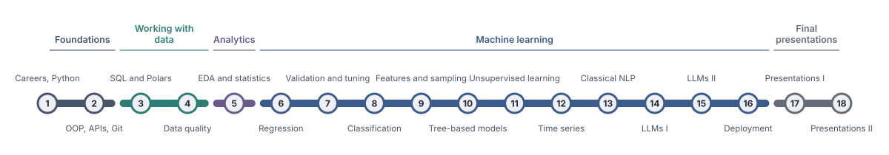
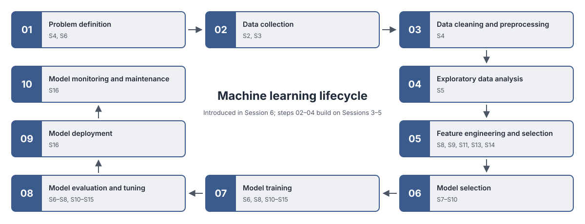
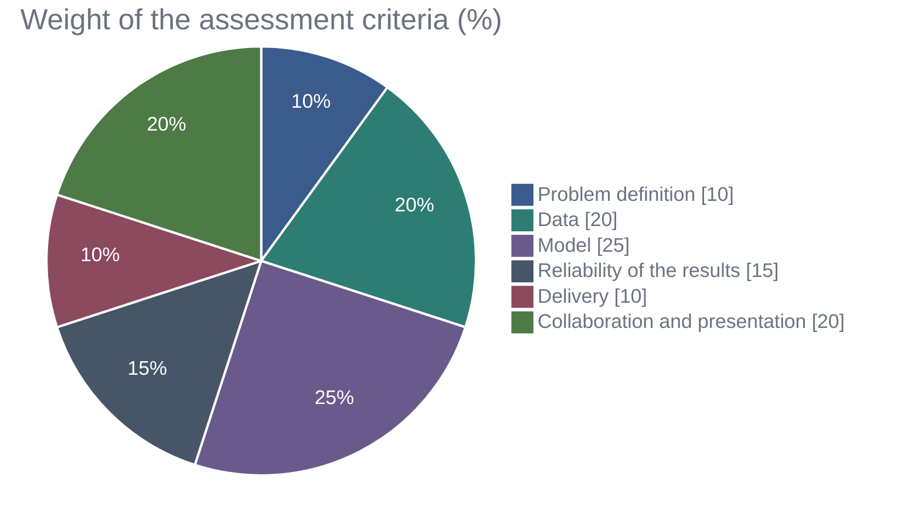
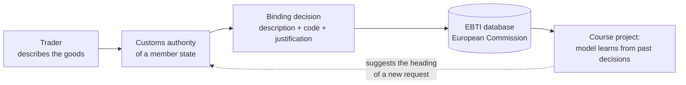
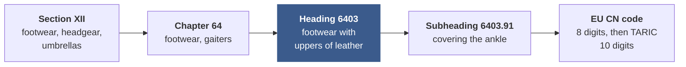
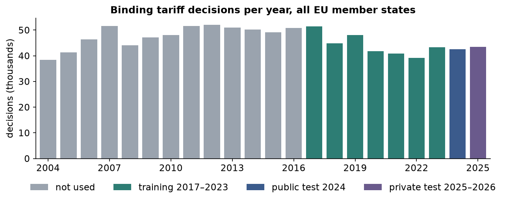
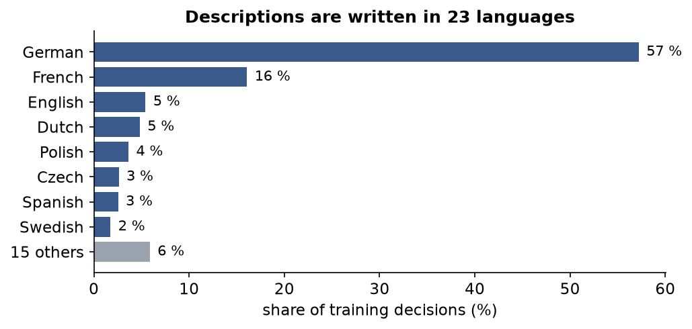
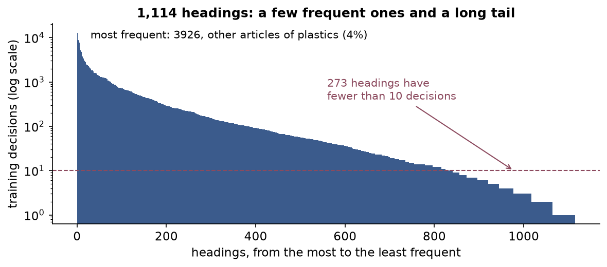
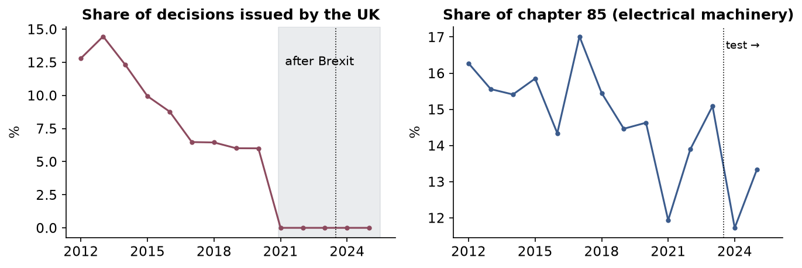

# Statistical Programming: Data Analytics and Machine Learning in Python

**Course proposal · MPMD elective WP 5 · HTW Berlin · Winter semester 2026/27 · Part 2 of 2: curriculum**

The course prepares students for the analyst and the data science track of data work. All students first learn the shared foundations: Python, collaborative development, SQL and the preparation of data. They then learn to explore, report and test data as analysts do, and finally to build, validate and deploy machine learning models, from regression to language models. No prior knowledge of machine learning or NLP is assumed. All methods are practised on public, real-world datasets ([Section 4](#4-datasets-and-leaderboard)).

The analysis behind these decisions (curriculum, labour market, comparable courses, datasets and assessment) is in Part 1, [PREMISE.md](PREMISE.md).

| Item | Proposal |
|---|---|
| Module | Statistical Programming (elective WP 5), 5 ECTS; proposed subtitle *Data Analytics and Machine Learning in Python* |
| Recommended semester | Semester 2 (elective slot 2.4), alongside 2.2 Data Mining; semester 3 remains possible |
| Teaching time | 54 UE in 18 weekly sessions of 3 UE (3 × 45 minutes with two 15-minute breaks) |
| Workload | 5 ECTS = 135 h: 40.5 h contact time (54 UE) and about 94.5 h self-study and project work (about 5 h per week) |
| Participants | 22 students in seven teams (six of three, one of four) |
| Structure | Foundations (2 sessions), working with data (2), analytics (1), machine learning (11), final presentations (2) |
| Datasets | Inside Airbnb Berlin with the Open-Meteo weather API, IBM Telco customer churn, and EU customs decisions (EBTI); their use by session is listed in [Section 4](#4-datasets-and-leaderboard) |
| Leaderboard | In Sessions 13–16, teams submit predictions for a held-out test set whose correct answers stay hidden, so the ranking shows how well a model works on new data; the leaderboard task is also the final project |
| Assessment | One final project for all teams on the leaderboard task, graded in its presentation (100 %) |

## Contents

- [1. Overview](#1-overview)
- [2. Module learning outcomes](#2-module-learning-outcomes)
- [3. Sessions](#3-sessions)
- [4. Datasets and leaderboard](#4-datasets-and-leaderboard)
- [5. Final project](#5-final-project)
- [6. Assessment](#6-assessment)
- [Appendix. The final project at a glance](#appendix-the-final-project-at-a-glance)

## 1. Overview

Data roles share a common base and then divide: analysts work mainly with SQL, Python for reporting, visualisation and statistical tests; data scientists and ML engineers build, validate and operate models ([Premise, Section 3](PREMISE.md#3-labour-market-requirements)). The course follows this structure.

**Learning through practice.** The course is oriented towards professional practice. Statistical and data concepts that students have met in earlier modules are revisited where a task requires them, but the emphasis lies on their implementation in Python and on their application to realistic problems. Each teaching block combines a short conceptual input with live coding and an exercise on real data, so that every method is learned by using it. Formal derivations are presented only as far as they are needed to apply a method correctly and to interpret its results; the theory page of each session and the further reading it lists provide the full background for students who wish to study a topic in depth.

- **Shared base (Sessions 1–4).** Every role needs Python, both for analysis in notebooks and for building applications (object-oriented programming, APIs), collaborative development with Git, SQL, Polars for large tables and the preparation of data.
- **Analytics (Session 5).** Exploration and visualisation together with the statistics recap of the module description: descriptive statistics, tests, contingency tables and correlation, applied in Python. Correlation leads directly into regression, the first model of the next part.
- **Machine learning (Sessions 6–16).** Built up from the simplest model to the most complex: linear and logistic regression, validation and tuning, classification and its evaluation metrics, feature engineering, tree-based models, unsupervised learning, forecasting, classical NLP, two sessions on large language models (from transformer and embedding models to RAG and agents) and deployment. The machine learning lifecycle is introduced at the start of this part.
- **One project.** All teams work on the same project, the leaderboard task, so that they can follow, compare and discuss each other's solutions. Teams apply the general steps of each session to the project data from Session 3 onwards and build the text models from Session 13. The project is graded in its presentation ([Section 5](#5-final-project)); the weekly exercises are not graded.

<picture>
  <source media="(prefers-color-scheme: dark)" srcset="assets/course-structure-timeline-dark.svg">
  
</picture>

| Week | Session | Part | Roles that require these skills |
|---|---|---|---|
| 1 | **S1** Introduction: data science careers, Python for analysis and Python for software engineering | Foundations | All |
| 2 | **S2** Software engineering for data work: object-oriented programming, APIs, testing, Git and continuous integration | Foundations | All |
| 3 | **S3** Relational databases, SQL and Polars | Working with data | All |
| 4 | **S4** Data quality and preparation: validation, missing values, outliers and transformations | Working with data | All |
| 5 | **S5** Exploratory analysis and statistics recap: descriptive statistics, visualisation, tests, contingency tables and correlation | Analytics | Analysts; all |
| 6 | **S6** Introduction to machine learning with regression: linear and logistic regression, underfitting and overfitting | Machine learning | Data scientists |
| 7 | **S7** Validation and hyperparameter tuning: data splits, cross-validation, bootstrap and leakage | Machine learning | Data scientists |
| 8 | **S8** Classification and evaluation metrics: preprocessing pipelines, k-nearest neighbours, confusion matrix, ROC curves and decision thresholds | Machine learning | Data scientists |
| 9 | **S9** Advanced feature engineering and imbalanced data | Machine learning | Data scientists |
| 10 | **S10** Tree-based models: decision trees, random forests and gradient boosting | Machine learning | Data scientists |
| 11 | **S11** Unsupervised learning: clustering, dimensionality reduction and anomaly detection | Machine learning | Data scientists; analysts for segmentation |
| 12 | **S12** Time series forecasting | Machine learning | Data scientists |
| 13 | **S13** Classical NLP: bag-of-words, TF-IDF and text classification | Machine learning | Data scientists |
| 14 | **S14** Large language models I: transformer models, embeddings and their applications | Machine learning | Data scientists, AI engineers |
| 15 | **S15** Large language models II: retrieval-augmented generation and agents | Machine learning | Data scientists, AI engineers |
| 16 | **S16** Deployment, monitoring and maintenance | Machine learning | ML engineers, data scientists; analysts for dashboards |
| 17 | **S17** Final project presentations I | Final presentations |  |
| 18 | **S18** Final project presentations II and course conclusion | Final presentations |  |

## 2. Module learning outcomes

After completing the module, students are able to

| Sessions | Learning outcome |
|---|---|
| **S1–S2** Foundations: Python, software engineering, APIs and Git | write well-structured Python code for data tasks, check it with automated tests, and develop it in a team using Git, code review and continuous integration |
| **S3–S4** Working with data: SQL, Polars and data quality | load, query and prepare data from relational databases, APIs and larger files reproducibly, with SQL, pandas or Polars, and document its quality |
| **S5** Exploratory analysis and statistics recap | describe and compare data with suitable statistical methods and charts and report results with their uncertainty |
| **S6–S12** Machine learning: from regression to time series forecasting | build, validate and tune supervised and unsupervised models, from regression to tree-based models, without leakage |
| **S13–S15** Classical NLP and large language models | represent text for machine learning, use embedding and language models, including retrieval and agents, and evaluate them against baselines |
| **S16** Deployment, monitoring and maintenance | serve a model in a container, explain how a data application is deployed in the cloud, and monitor and document the model |
| **S17–S18** Final presentations, prepared in the team project throughout the course | define a data problem with a stakeholder, and present and defend the results individually |

## 3. Sessions

For each session: the guiding question, the learning outcomes and the session plan. Each session has three teaching blocks of 45 minutes (0:00–0:45, 1:00–1:45, 2:00–2:45) with 15-minute breaks in between; each block combines a short conceptual input with live coding and an exercise on real data (*Practice*).

### Foundations (Sessions 1–2)

#### 📍 Session 1 · Introduction: data science careers, Python for analysis and Python for software engineering

**Guiding question.** What do data professionals do, and how does Python for analysis differ from Python for building applications?

**Learning outcomes.** Students are able to

- describe the main data roles, their tasks and the skills they require
- set up a reproducible Python environment and analyse tabular data in a notebook
- explain the difference between analysis code in notebooks and application code in modules and classes

**Session plan**

**0:00–0:45**

- Data roles (data analyst, data scientist, ML and AI engineer, data engineer): tasks, skills and entry routes
- Course organisation and assessment
- The final project: the EBTI challenge and its leaderboard (15 minutes)

*Practice:* Compare three job advertisements (analyst, data scientist, ML engineer) and list the skills they share and those that differ

**1:00–1:45**

- Python for analysis and its working environment (uv, Jupyter, VS Code)
- A refresher of the fundamentals (types, lists and dictionaries, conditions, loops, functions)
- Tabular data with pandas in a notebook
- Tips for using AI coding assistants

*Practice:* Case study: download the Berlin Airbnb listings with the provided script and answer five questions about them in a notebook (how many listings, where, of what type, at what price, with how many reviews)

**2:00–2:45**

- Python for software engineering: from notebook to application
- Scripts, modules and packages
- Project structure
- A first introduction to object-oriented programming (classes, objects, attributes, methods)
- When to use a notebook and when an application

*Practice:* Turn the notebook analysis into a module with a small class that loads and summarises the listings

**Team project until the next session.** Teams of three are formed and read the project brief and the leaderboard rules.

#### 📍 Session 2 · Software engineering for data work: object-oriented programming, APIs, testing, Git and continuous integration

**Guiding question.** How do we write data code that others can use, connect it to other systems, and develop it together without breaking it?

**Learning outcomes.** Students are able to

- design and use classes for data tasks and handle errors explicitly
- request data from a web API and write automated tests for the code that processes it
- work with Git branches and pull requests and set up a CI workflow that runs the tests

**Session plan**

**0:00–0:45**

- Object-oriented programming in practice: classes, methods, composition and inheritance, dataclasses
- Type hints and docstrings
- Exceptions and error handling
- Automated tests with pytest

*Practice:* Write and test a class that validates and cleans one listing (price stored as text, coordinates inside Berlin, valid room type)

**1:00–1:45**

- Why analysts need APIs: data that change every day and are not offered as a file, such as weather for a demand forecast
- What an API is and how web APIs work
- HTTP requests and responses, JSON, authentication, pagination and rate limits
- Requesting data with httpx
- A minimal API of one's own with FastAPI (developed further in Session 16)

*Practice:* Does the weather explain how busy Berlin's Airbnb market is? Fetch daily Berlin weather from the Open-Meteo API, parse it into a validated class and test the parsing offline; the data are reused in the forecast of Session 12

**2:00–2:45**

- Git and GitHub: commits, branches, merging and merge conflicts
- Pull requests and code review
- Continuous integration with GitHub Actions (ruff and pytest on every pull request)

*Practice:* Case study: contribute a tested module of simple features of listing titles through a reviewed pull request; teams set up their repository with CI

**Team project until the next session.** Team repository from the template, with branch protection and CI.

### Working with data (Sessions 3–4)

#### 📍 Session 3 · Relational databases, SQL and Polars

**Guiding question.** How do we store, query and combine data reliably, and how do we process large tables efficiently in Python?

**Learning outcomes.** Students are able to

- describe a relational schema with primary and foreign keys and write SQL queries that filter, join and aggregate data
- load data reproducibly into PostgreSQL and continue the analysis in Python
- process large tables efficiently with Polars and choose between SQL, pandas and Polars

**Session plan**

**0:00–0:45**

- The relational model: tables, primary and foreign keys, relationships
- PostgreSQL as the course database
- Basic queries: SELECT, WHERE, ORDER BY, LIMIT
- Aggregation with GROUP BY and HAVING
- INNER and LEFT JOIN; NULL values in joins and aggregates

*Practice:* Answer first questions about the listings in SQL; listings and median price per district; join listings with their reviews and availability; find listings without any review

**1:00–1:45**

- Common table expressions and window functions
- Access from Python with SQLAlchemy and pandas

*Practice:* Case study: load listings, calendar and monthly reviews into PostgreSQL with the provided script; rank districts by price and compute running totals of reviews with window functions

**2:00–2:45**

- Limits of pandas: memory, single-threaded execution, eager evaluation
- Polars: expressions, lazy queries and the query optimiser, streaming of larger-than-memory data, Parquet files
- The same query in SQL, pandas and Polars
- Choosing a tool: SQL database, pandas or Polars, depending on data size and task

*Practice:* Case study: run the same aggregation on the availability calendar (4.7 million rows) in SQL, pandas and Polars and compare code, runtime and memory use

**Team project until the next session.** Download the customs decisions with the provided script, load them into the team database and count them per year, language and member state in SQL.

#### 📍 Session 4 · Data quality and preparation: validation, missing values, outliers and transformations

**Guiding question.** Can we trust the data, and how do we prepare it for analysis?

**Learning outcomes.** Students are able to

- check data quality systematically and express the checks as code
- analyse missing values and choose an imputation method
- detect and treat outliers and apply suitable transformations, documenting each decision

**Session plan**

**0:00–0:45**

- Dimensions of data quality: completeness, validity, uniqueness, consistency, accuracy and timeliness
- Checks for types, ranges, duplicates and consistency
- Validation rules written as automated tests (pytest, pandera) that stop the pipeline when new data break a rule

*Practice:* Write a data quality report for the listings (prices stored as text, placeholder values, impossible minimum stays, names in the registration field, duplicates)

**1:00–1:45**

- Missing data mechanisms (MCAR, MAR, MNAR)
- Simple, KNN and iterative imputation
- Univariate outliers (IQR rule, z-score, median absolute deviation)

*Practice:* A third of the Berlin Airbnb listings show no price. Is a missing price related to reviews or availability? Recover hidden bedroom counts with several imputers; find outliers in price and minimum stay

**2:00–2:45**

- Multivariate outliers with the Mahalanobis distance (model-based detection follows in Session 11)
- Transformations (logarithm, Box–Cox, Yeo–Johnson, scaling)
- A documented cleaning pipeline

*Practice:* Case study: produce the cleaned table of Berlin listings with a log of every cleaning decision

**Team project until the next session.** Data quality report of the decisions and project charter: use of the suggestions, metric, baseline, validation by time, inputs that may not be used.

### Analytics (Session 5)

#### 📍 Session 5 · Exploratory analysis and statistics recap: descriptive statistics, visualisation, tests, contingency tables and correlation

**Guiding question.** What is in the data, which differences and relationships are real, and how do we show them?

**Learning outcomes.** Students are able to

- describe data by variable type with descriptive statistics and well-designed charts
- apply statistical tests and contingency tables in Python and report confidence intervals and effect sizes
- compute and interpret correlations as the starting point for regression

**Session plan**

**0:00–0:45**

- Describing data by variable type: distributions, centre and spread, robust summaries, frequency tables
- Choosing and designing charts with matplotlib, seaborn and Plotly (perception, colour, accessibility, annotation)

*Practice:* What does a night in Berlin cost, and where? Price by room type and district, reviews per month; improve a poorly designed chart

**1:00–1:45**

- Comparing groups: t-test and Mann–Whitney test with confidence intervals and effect sizes
- Categorical data: contingency tables, chi-square test and Cramér's V
- A/B tests as an application
- Choosing a test from a decision table

*Practice:* How much more does an entire home cost than a private room, and Mitte than Neukölln (tests, confidence intervals, effect sizes)? Do hosts with several listings show a registration number more often (chi-square, Cramér's V)?

**2:00–2:45**

- Relationships between numerical variables: scatter plots, Pearson and Spearman correlation, confounding and Simpson's paradox
- From correlation to the regression line (the bridge to Session 6)
- Communicating findings in a short report or a Streamlit dashboard

*Practice:* Case study: how strongly does the price rise with the number of guests? Do district price differences survive once room type and size are held fixed? A one-page report or a dashboard of prices by district

**Team project until the next session.** Exploratory findings: decisions per heading, language, member state and year, and the long tail of rare headings, presented in a short team review.

### Machine learning (Sessions 6–16)

#### 📍 Session 6 · Introduction to machine learning with regression: linear and logistic regression, underfitting and overfitting

**Guiding question.** How does a model learn from data, and how do we know whether it has learned too little or too much?

**Learning outcomes.** Students are able to

- describe the stages of the machine learning lifecycle, from problem definition to monitoring, and relate them to the earlier sessions
- split data into training and test sets and fit, interpret and evaluate a linear regression
- recognise underfitting and overfitting and use robust regression for data with outliers
- fit and interpret a logistic regression for a binary outcome

<picture>
  <source media="(prefers-color-scheme: dark)" srcset="assets/ml-lifecycle-ten-steps-dark.svg">
  
</picture>

**Session plan**

**0:00–0:45**

- The machine learning lifecycle, from problem definition (target, metric, baseline) to monitoring and maintenance, and how Sessions 3–5 already covered data collection, cleaning and exploration
- Supervised learning: features, target, training, prediction
- The data split into training and test sets
- Simple and multiple linear regression (least squares, coefficients, residuals)
- Regression metrics (MAE, RMSE, R²)

*Practice:* What drives nightly prices in Berlin? Map a pricing aid for hosts to the stages of the lifecycle; fit and interpret a price model (guests, room type, distance to the centre, district) and report its error in euros

**1:00–1:45**

- Underfitting and overfitting: model complexity (polynomial degree), training versus test error, the bias–variance trade-off
- Robust regression (Huber, quantile regression) for data with outliers

*Practice:* Compare training and test error for increasing model complexity; compare least squares with Huber and quantile regression on prices with extreme asking prices

**2:00–2:45**

- Logistic regression: from a linear model to probabilities (sigmoid), log-odds and the interpretation of coefficients
- Fitting with statsmodels and scikit-learn
- A first look at predicted classes

*Practice:* Case study: predict churn probability for the IBM Telco customers with logistic regression and interpret the coefficients

**Team project until the next session.** Baselines on the project data: the most frequent heading and a simple rule.

#### 📍 Session 7 · Validation and hyperparameter tuning: data splits, cross-validation, bootstrap and leakage

**Guiding question.** How well will a model perform on data it has never seen, and how do we choose its settings?

**Learning outcomes.** Students are able to

- split data into training, validation and test sets and estimate performance with cross-validation
- diagnose underfitting and overfitting with validation and learning curves
- control model complexity with regularisation, tune hyperparameters with grid and randomised search and prevent data leakage

**Session plan**

**0:00–0:45**

- Training, validation and test data and their roles
- Why a single split is unreliable
- k-fold and stratified cross-validation
- Grouped and time-series splits
- Bootstrap confidence interval of a metric

*Practice:* How well would a price model work for a host listing a first flat in Berlin? Cross-validate the Airbnb price model with random and host-grouped folds and report the error in euros with a bootstrap interval

**1:00–1:45**

- Parameters and hyperparameters
- Regularisation with ridge and lasso, and the penalty as a hyperparameter
- Validation curves and learning curves to diagnose underfitting and overfitting
- Hyperparameter tuning with GridSearchCV and RandomizedSearchCV

*Practice:* Tune the ridge and lasso penalties of the price model and read its validation and learning curves

**2:00–2:45**

- Data leakage: preprocessing outside the cross-validation, target leakage
- Preprocessing inside a Pipeline
- Nested cross-validation
- The final test on held-out data

*Practice:* Demonstrate two leaking workflows on the price model (preprocessing fitted outside the cross-validation; the same host in training and test), then fix them with a Pipeline and grouped folds and compare the scores

**Team project until the next session.** Validation plan: split by time, metrics, uncertainty of the scores, inputs that may not be used.

#### 📍 Session 8 · Classification and evaluation metrics: preprocessing pipelines, k-nearest neighbours, confusion matrix, ROC curves and decision thresholds

**Guiding question.** Which customers will cancel, and how do we measure whether a classifier is good enough?

**Learning outcomes.** Students are able to

- prepare mixed numerical and categorical inputs in a preprocessing pipeline
- build classification models and compare them with baselines
- evaluate classifiers with the confusion matrix, precision, recall, F1, macro-F1, ROC curves and AUC, and set a decision threshold from the costs of errors

**Session plan**

**0:00–0:45**

- Classification tasks: predicting a category; baselines (majority class, hand-made rule)
- Preparing inputs: one-hot and ordinal encoding of categories, scaling of numerical features
- Pipeline and ColumnTransformer, so that preprocessing is fitted on the training data only
- k-nearest neighbours and the decision boundary; underfitting and overfitting with the number of neighbours

*Practice:* Build a preprocessing pipeline for the IBM Telco data and compare a churn rule, k-NN and logistic regression

**1:00–1:45**

- Evaluation metrics for classification: confusion matrix, accuracy, precision, recall, F1 and macro-F1
- The ROC curve and AUC
- The precision–recall curve

*Practice:* Evaluate the churn models with confusion matrices and ROC curves and explain which metric fits the business question

**2:00–2:45**

- Decision thresholds from the costs of errors
- Calibration of predicted probabilities

*Practice:* Case study: choose the churn threshold from the cost of a retention offer against the value of a lost customer, and check whether the predicted probabilities can be trusted

**Team project until the next session.** A first classifier on simple features (language, member state, description length) in a pipeline, evaluated with accuracy and macro-F1 against the baselines.

#### 📍 Session 9 · Advanced feature engineering and imbalanced data

**Guiding question.** Which additional inputs make a model better, how do we build them without leakage, and what do we do when one class is rare?

**Learning outcomes.** Students are able to

- construct features from dates, interactions, high-cardinality categories and related tables
- implement feature construction in pipelines without leakage
- handle class imbalance with undersampling, oversampling and class weights, applied only to the training data

**Session plan**

**0:00–0:45**

- Features from dates and times; interactions between features
- High-cardinality categories: grouping rare categories, target encoding and its leakage risk
- Custom transformers in scikit-learn pipelines

*Practice:* Which constructed features help the Berlin price model? Build distance, amenity, date and interaction features and a target-encoded neighbourhood, and measure each one

**1:00–1:45**

- Aggregation features from related tables
- Target leakage
- Simple text statistics as features

*Practice:* Case study: which listings will be busy next year? Build past-only demand features from the monthly reviews and detect the columns that leak the target, such as the revenue estimate

**2:00–2:45**

- Class imbalance and why accuracy misleads
- Random undersampling and oversampling
- Synthetic oversampling (SMOTE)
- Class weights as an alternative
- Resampling inside the cross-validation only, never on validation or test data
- Pipelines with imbalanced-learn

*Practice:* Case study: compare undersampling, oversampling, SMOTE, class weights and a tuned threshold for catching Telco churners

**Team project until the next session.** How the team will deal with rare headings; inputs documented with the moment at which each is known.

#### 📍 Session 10 · Tree-based models: decision trees, random forests and gradient boosting

**Guiding question.** Can a more flexible model do better, and what does it cost?

**Learning outcomes.** Students are able to

- explain how decision trees, random forests and gradient boosting predict
- train, tune and compare XGBoost, LightGBM and CatBoost
- interpret a tree ensemble

**Session plan**

**0:00–0:45**

- Decision trees: splits, Gini impurity computed by hand
- Tree depth as a hyperparameter, overfitting of deep trees and pruning

*Practice:* Fit and visualise a decision tree on the churn data

**1:00–1:45**

- Bagging and random forests
- Gradient boosting
- XGBoost, LightGBM and CatBoost
- Categorical features, class weights, early stopping and tuning

*Practice:* Train and tune gradient boosting models on the churn data and compare them

**2:00–2:45**

- Interpretation of tree-based models with feature importance, permutation importance and SHAP values
- Comparing the performance of models

*Practice:* Case study: is a tree ensemble worth replacing the linear price model of Session 6? Compare a random forest and gradient boosting with it on host-grouped folds and interpret the winner

**Team project until the next session.** Interim review (10 minutes per team): data, validation plan, baselines, plan for Sessions 13–16.

#### 📍 Session 11 · Unsupervised learning: clustering, dimensionality reduction and anomaly detection

**Guiding question.** What structure is in the data when there is no target to predict?

**Learning outcomes.** Students are able to

- distinguish unsupervised from supervised learning and explain why its evaluation is harder
- apply and evaluate k-means, hierarchical and density-based clustering
- reduce dimensionality with PCA, visualise high-dimensional data and detect anomalies

**Session plan**

**0:00–0:45**

- Supervised and unsupervised learning
- Distance, similarity and scaling
- k-means computed by hand on a small example
- Choosing the number of clusters (elbow method, silhouette)

*Practice:* Segment the churn customers with k-means and describe the segments

**1:00–1:45**

- Hierarchical clustering and dendrograms
- Density-based clustering (DBSCAN)
- Evaluating and interpreting clusters (silhouette, stability, cluster profiles)

*Practice:* What kinds of Airbnb offers exist in Berlin? Compare k-means, hierarchical clustering and DBSCAN on the listings and find the hot spots of listings on the map

**2:00–2:45**

- Dimensionality reduction: principal component analysis (explained variance, loadings)
- t-SNE and UMAP for visualisation
- Model-based anomaly detection with Isolation Forest and local outlier factor, continuing the outliers of Session 4
- Clusters and components as features

*Practice:* Case study: summarise the listings' amenities with PCA and rank implausible listings (Isolation Forest, local outlier factor, price far from what size and location suggest)

**Team project until the next session.** Open points from the interim review.

#### 📍 Session 12 · Time series forecasting

**Guiding question.** How much will happen next month, and how certain is the forecast?

**Learning outcomes.** Students are able to

- describe a time series and produce baseline forecasts
- fit an exponential smoothing model and a lag-feature model
- evaluate forecasts with backtesting and report prediction intervals

**Session plan**

**0:00–0:45**

- Time series: trend, seasonality, autocorrelation
- Aggregating to regular time intervals with pandas
- Baselines (naive, seasonal naive, moving average)

*Practice:* How busy is Airbnb in Berlin month by month? Build the monthly number of guest reviews, check its quality and compute the baseline forecasts

**1:00–1:45**

- Exponential smoothing with prediction intervals
- ARIMA as an outlook

*Practice:* Fit exponential smoothing, decide how to treat the pandemic months and compare with the baselines

**2:00–2:45**

- Machine learning with lag features (using the tree-based models of Session 10)
- Rolling-origin backtesting
- Forecast metrics: MAE and MASE

*Practice:* Case study: how many Airbnb stays should Berlin expect next year? Backtest the models, test whether the Berlin weather from Session 2 adds anything, and recommend one with its 12-month forecast and prediction interval

**Team project until the next session.** Open points from the interim review.

#### 📍 Session 13 · Classical NLP: bag-of-words, TF-IDF and text classification

**Guiding question.** What can a model learn from the words themselves?

**Learning outcomes.** Students are able to

- represent text as word counts and TF-IDF vectors
- train and evaluate a text classifier on high-dimensional data
- analyse the errors of a text model

**Session plan**

**0:00–0:45**

- Documents, tokens and vocabulary
- Preprocessing (lower-casing, stop words, stemming and lemmatisation)
- Bag-of-words computed by hand
- Sparse, high-dimensional matrices

*Practice:* Build the vocabulary of the descriptions of goods across languages and inspect the document-term matrix

**1:00–1:45**

- The EBTI task: predict the customs heading of a product from its description, in 23 languages
- TF-IDF and n-grams; linear models for text classification
- Metrics for more than 1,000 classes: accuracy and macro-F1, rare headings, validation by time

*Practice:* Case study: first leaderboard submission (L1) with a TF-IDF classifier

**2:00–2:45**

- Error analysis of text models
- Leakage through the customs' justification, a text that exists only after the decision
- The most informative n-grams per class
- Dimensionality reduction with truncated SVD
- Limits of word counts (word order, synonyms) as the motivation for language models

*Practice:* Analyse 20 misclassified decisions with their English keywords and heading texts, and improve the classifier

**Team project until the next session.** TF-IDF classifier on the team's validation scheme, error analysis, leaderboard round L1.

#### 📍 Session 14 · Large language models I: transformer models, embeddings and their applications

**Guiding question.** How do language models represent and generate text, and what can we use them for?

**Learning outcomes.** Students are able to

- explain the transformer idea and the difference between encoder, decoder and encoder–decoder models
- use embedding models for semantic search, clustering and as features for classification
- use a generative model through an API for classification with structured output and compare it with a trained model

**Session plan**

**0:00–0:45**

- From words to vectors: tokens, embeddings, attention and pre-training at a conceptual level
- Encoder models (BERT type), decoder models (GPT type) and encoder–decoder models
- Embedding models (sentence-transformers)

*Practice:* Tokenise descriptions and compare token counts across languages; compute semantic similarity between descriptions of the same goods in different languages

**1:00–1:45**

- Applications of embedding models: semantic search, clustering (with the methods of Session 11) and classification features compared with TF-IDF

*Practice:* Embedding features versus TF-IDF on a subsample; nearest-neighbour search over decisions in several languages

**2:00–2:45**

- Applications of generative models: prompts, temperature, context window and costs
- Zero-shot and few-shot classification with structured output
- Comparison with a trained model on quality, cost, latency and data protection
- Abstention: route unsure cases to a customs officer

*Practice:* Case study: compare an LLM, choosing among ten candidate headings, with the trained classifier on 200 decisions; second leaderboard submission (L2)

**Team project until the next session.** Decide with evidence whether embeddings or a language model improve the model; leaderboard round L2.

#### 📍 Session 15 · Large language models II: retrieval-augmented generation and agents

**Guiding question.** How do we let a language model answer from our own data and use tools, and how do we evaluate the result?

**Learning outcomes.** Students are able to

- build a retrieval-augmented generation pipeline over a document collection
- evaluate retrieval and answers with a labelled test set
- build a simple agent with tool calling and assess its risks

**Session plan**

**0:00–0:45**

- Why retrieval: knowledge cut-off, hallucination, sources
- The components of RAG: chunking, embedding, vector search in PostgreSQL with pgvector, prompt assembly, answers with citations

*Practice:* Build semantic search over past decisions in PostgreSQL

**1:00–1:45**

- Evaluating RAG: a test set of questions, recall@k, groundedness and human ratings
- Improving retrieval (chunk size, hybrid search, re-ranking)

*Practice:* Case study: a RAG classification assistant that proposes a heading from similar past decisions with cited BTI references, evaluated with heading hit@5 on labelled requests

**2:00–2:45**

- Agents: tool calling, the loop of planning, acting and observing, function schemas
- Risks (error propagation, costs, prompt injection) and guardrails

*Practice:* Build a small agent with three tools (an SQL query, the similar-decision search, a nomenclature look-up) and evaluate it on ten tasks

**Team project until the next session.** Optional language-model component (for example a classification assistant with retrieval), with its evaluation.

#### 📍 Session 16 · Deployment, monitoring and maintenance

**Guiding question.** How does a model or dashboard reach its users, and how does it stay useful?

**Learning outcomes.** Students are able to

- serve a model as a tested web API in a container, released with CI/CD
- describe the architecture of a data application (front end, back end, database) and the cloud services used to deploy it
- monitor a deployed model for data drift and label shift, decide on retraining and document the model in a model card

**Session plan**

**0:00–0:45**

- From notebook to service: saving pipelines, versioning, pinned dependencies
- The prediction API with FastAPI and pydantic, building on Session 2
- Tests for the service

*Practice:* Build and test version 1 of the heading service (top three headings with scores)

**1:00–1:45**

- Containers with Docker
- Continuous delivery with GitHub Actions
- Introduction to system design and cloud architecture: a data application as front end (dashboard), back end (model API) and database, illustrated with examples
- Cloud services for such an application on AWS, by example: container registry (ECR), container hosting (ECS with Fargate), managed database (RDS for PostgreSQL), file storage (S3) and monitoring (CloudWatch)

*Practice:* Run the service, a dashboard and PostgreSQL together in containers with Docker Compose and release the service through the CI/CD workflow; sketch the cloud architecture of the team project on AWS

**2:00–2:45**

- Monitoring: data drift (KS test, population stability index), label shift
- Retraining triggers and versioning
- Documenting a model in a model card

*Practice:* Case study: the 2024 labels are released as feedback data; detect the shifts (no decisions from the United Kingdom after Brexit, a lower share of chapter 85, a few unseen headings), retrain and make the final leaderboard submission (L3), ranked on the 2025–2026 decisions

**Team project until the next session.** Release: tested service, monitoring plan and model card; retraining with the 2024 labels and final leaderboard round L3; repository tagged.

### Final presentations (Sessions 17–18)

#### 📍 Session 17 · Final project presentations I

**Session plan**

| Time | Activity |
|---|---|
| 0:00–0:05 | Opening: order of presentations, assessment criteria, rules for questions |
| 0:05–0:30 | Team 1: 15 minutes presentation with live demonstration, 10 minutes of questions, including individual questions to each member |
| 0:30–0:55 | Team 2: same format |
| 0:55–1:10 | Break (placed between teams, so that no presentation is interrupted); written peer feedback on Teams 1–2 |
| 1:10–1:35 | Team 3: same format |
| 1:35–2:00 | Team 4: same format |
| 2:00–2:15 | Break; peer feedback on Teams 3–4 |
| 2:15–2:45 | Common observations from the four presentations; organisation of Session 18 |

#### 📍 Session 18 · Final project presentations II and course conclusion

**Session plan**

| Time | Activity |
|---|---|
| 0:00–0:05 | Opening: order of Teams 5–7 and assessment criteria |
| 0:05–0:30 | Team 5: 15 minutes presentation with live demonstration, 10 minutes of questions, including individual questions to each member |
| 0:30–0:45 | Written peer feedback on Team 5; Team 6 prepares its demonstration |
| 0:45–1:00 | Break |
| 1:00–1:25 | Team 6: same format |
| 1:25–1:45 | Leaderboard results on the 2025–2026 decisions: the leading teams explain features, model and validation |
| 1:45–2:00 | Break |
| 2:00–2:25 | Team 7: same format |
| 2:25–2:45 | Course review; course evaluation (anonymous, in class) |

## 4. Datasets and leaderboard

The course works with the following public datasets. Each session uses the one that fits its topic best.

| Dataset | What it is | Used for |
|---|---|---|
| **Inside Airbnb, Berlin** | About 12,800 Berlin listings with price, district, size, ratings, availability and registration number, the availability calendar and the number of reviews per month since 2009 | Sessions 1–12: Python, classes, SQL and Polars, data quality, statistics, regression, validation, features, tree-based models, clustering, time series |
| **Open-Meteo** (weather API) | Daily Berlin weather since 2016, fetched through a web API | Session 2 (working with APIs) and Session 12 (weather as a factor in demand) |
| **IBM Telco churn** | 7,043 telecom customers and whether they cancelled their contract | Churn prediction (named in the module description): logistic regression, classification metrics and thresholds, imbalance, trees, segments |
| **EBTI** (EU customs decisions) | Binding tariff decisions published by the European Commission; the task is to predict the four-digit HS heading of a product from its description, written in 23 languages | Sessions 13–16: text classification, language models, retrieval, deployment; the leaderboard and the final project |

**Datasets by session**

| Session | Dataset | Topic it supports |
|---|---|---|
| 1 | Airbnb | First analysis in pandas; a class that loads and summarises the listings |
| 2 | Airbnb, Open-Meteo | A class that checks one listing; fetching Berlin weather from a web API; simple title features added through a pull request |
| 3 | Airbnb | SQL across listings, calendar and reviews; Polars on the 4.7-million-row calendar |
| 4 | Airbnb | Quality checks; missing values, outliers and transformations; a cleaned listings table |
| 5 | Airbnb | Prices by district and room type: tests, effect sizes, contingency tables, a dashboard |
| 6 | Airbnb, Telco | What drives nightly prices (linear, robust and quantile regression); churn with logistic regression |
| 7 | Airbnb | Validation for new hosts, regularisation and tuning of the price model, two leakage examples |
| 8 | Telco | Classification metrics, ROC and PR curves, a threshold chosen from the costs of errors |
| 9 | Airbnb, Telco | Features for the price model and leaking columns; imbalanced classes in churn |
| 10 | Telco, Airbnb | Decision trees on churn; random forests, gradient boosting and their interpretation for price prediction |
| 11 | Telco, Airbnb | Customer segments; kinds of Airbnb offers and implausible listings |
| 12 | Airbnb, Open-Meteo | Forecasting monthly demand, with seasons, the COVID break and the weather |
| 13 | EBTI | Text classification across languages, metrics for many classes, leakage, first leaderboard round |
| 14 | EBTI | Multilingual embeddings, search across languages, a language model choosing among candidate headings, abstention, second leaderboard round |
| 15 | EBTI | A classification assistant that cites similar past decisions; an agent with tools |
| 16 | EBTI | A service that suggests headings, drift and retraining, final leaderboard round |

**EBTI.** A trader asks the customs authority of a member state how a product is classified in the customs tariff; the authority states the code in a binding decision, and the Commission publishes all decisions. The prepared data contain 309,529 training decisions (2017–2023) and 113,188 test decisions (2024–2026), with 1,114 headings in the training data. Descriptions are written in the language of the issuing country: 57 % German, 16 % French and the rest in more than 20 other EU languages; each training decision also carries English keywords. Further tables hold the HS nomenclature in English and the monthly number of decisions since 2004. Why these datasets were chosen is set out in [Premise, Section 6](PREMISE.md#6-choice-of-the-course-dataset).

### Leaderboard

- **Task:** predict the heading of each test decision from its description, issuing country, language and date.
- **Split:** decisions of 2024 form the public leaderboard, decisions of 2025–2026 the private leaderboard. Test decisions whose description repeats a training description are removed.
- **Metric:** accuracy, with macro-F1 reported alongside. Reference values on the public leaderboard: always the most frequent heading 4 %; logistic regression on simple features 8 %; word TF-IDF with a linear model 81 % (50,000-decision sample) and 87 % (full training set); character TF-IDF 88 %. On the private years the same models score about three points lower, an effect of drift that Session 16 takes up.
- **Rounds:** L1 TF-IDF models (Session 13), L2 embeddings or language models (14), L3 final model after retraining with the released 2024 labels (16). The final ranking is presented in Session 18; the L3 submission is the team's final project solution.
- **Platform:** Codabench (free, open source, operated by Université Paris-Saclay; submission of a CSV file; hidden solution; public and private leaderboard). Students register with a pseudonym; alternatively the lecturer submits on behalf of a team.

> [!NOTE]
> **Licence and fairness.** The Commission permits reuse of the EBTI data with acknowledgement of the source; each student downloads them with the provided script. Because decisions can be looked up in the public database, the leaderboard score is not converted into marks; the final project is graded on the criteria of Section 6, and its submission must be reproducible from the team's repository.

## 5. Final project

All teams work on the same project: the leaderboard task of [Section 4](#4-datasets-and-leaderboard), predicting the four-digit customs heading of a binding tariff decision from its description of goods, as accurately as possible on the hidden test set. A single project lets teams follow and discuss each other's solutions, gives all of them the same workload, and makes the results comparable. Teams present their final solution in Sessions 17 and 18.

- **Task:** a model that suggests the heading of a new request to a customs officer, using only what exists when the request arrives (description, member state, language, date).
- **Deliverables:** a repository that reruns from the official export to the submission; a validated model compared with baselines; error analysis; a tested service that returns the top-3 headings, with a monitoring plan and a model card; the presentation.
- **Accuracy and grade:** teams aim for the highest accuracy they can reach, but the score is not converted into marks. The grade rewards how a team frames the problem, handles the data, builds and validates the model and explains the results ([Section 6](#6-assessment)).

**Timeline.** The challenge is introduced in Session 1. Teams first load, check and explore the data and set up baselines and a validation plan (Sessions 3–9), then build the text models in Sessions 13–16.

**Rules.** The final submission must be reproducible from the tagged repository; a submission that the repository cannot reproduce is not assessed. Looking up test decisions in the public EBTI database is not allowed. Columns that customs write with or after the decision (justification, keywords, CN code, chapter, status, end date, invalidation reason) must not be model inputs.

## 6. Assessment

**Final project with presentation · 100 % · Sessions 17 and 18**

> [!NOTE]
> The module is assessed by one examination component: the final project, graded in its presentation. Weekly exercises are not graded, and the leaderboard score is not converted into marks. The module page currently lists a quiz (30 %), a take-home coding assignment (40 %) and an oral examination in the form of a job-interview simulation (30 %). The change to a single graded project presentation must be approved and announced at the start of the semester (RStPO §§ 9–14); the reasons are set out in [Premise, Section 7](PREMISE.md#7-choice-of-the-assessment-format).

**What is assessed**

- **Repository**, frozen with a release tag the day before Session 17: code, a README that lets a reader rerun the work from the official export to the submitted file, documentation of data and decisions, and the history of reviewed pull requests.
- **Presentation**: 15 minutes per team with a live demonstration, followed by 10 minutes of questions. Every member presents a part and answers individual questions.

**How the grade is formed**

- The first five criteria (80 %) are assessed per team. *Collaboration and presentation* (20 %) is assessed per member, from the member's presented part, the answers to individual questions and the member's pull requests.
- Leaderboard accuracy is evidence for the criteria *Model* and *Reliability of the results*, not a grade in itself: a lower score that is well validated and well explained can earn a better grade than a higher score that the team cannot explain.
- The individual questions are recorded in a short protocol, so that individual grades can be justified.
- Use of AI tools is permitted and documented with the HTW declaration; members must be able to explain any part of the code they submitted.

**Assessment criteria**

| Criterion | Weight | Evidence | Expected for a very good grade |
|---|---|---|---|
| Problem definition | 10 % | Charter, presentation | The use of the suggestions is clear; metric, baseline and, if used, abstention are justified by that use |
| Data | 20 % | Repository | A pipeline that reruns from the official export to the submission; quality checked, with every cleaning decision recorded; inputs limited to what exists when a request arrives |
| Model | 25 % | Repository, presentation | Several approaches compared fairly with the baseline and with each other on the same validation scheme; the final choice justified |
| Reliability of the results | 15 % | Repository, questions | Validation by time without leakage; uncertainty of the differences between models; error analysis by language, heading frequency and chapter; validation and leaderboard scores compared and differences explained |
| Delivery | 10 % | Live demonstration | A tested service that returns the top-3 headings, with a monitoring plan and a model card |
| Collaboration and presentation (per member) | 20 % | Pull requests, presentation, questions | Own reviewed pull requests with passing CI; a clear presented part; correct and confident answers to individual questions |

## Appendix. The final project at a glance

This appendix gives a short overview of the final project: the task, the data, how hard it is, and why it is a suitable way to close the module.

### The task

Container Terminal Tollerort, Hamburg. Photo: Matti Blume, [CC BY-SA 4.0](https://creativecommons.org/licenses/by-sa/4.0/), via [Wikimedia Commons](https://commons.wikimedia.org/wiki/File:Container_Terminal_Tollerort,_Vorhafen,_Hamburg_(P1080405).jpg).

Every product that enters or leaves the EU needs a tariff code. The code determines the customs duty, import restrictions and trade statistics. When a trader is unsure about the code, they can ask the customs authority of a member state for a **Binding Tariff Information (BTI)** decision. The authority describes the goods, states the code and explains why. The decision binds all EU customs authorities for three years. The European Commission publishes all decisions in the **EBTI database**: about 40,000 to 50,000 per year.

The project asks: **given the description of goods, which four-digit heading will customs assign?** A model that answers this well can suggest headings to customs officers and help traders prepare their requests.

### What a heading is

The code follows the **Harmonized System (HS)** of the World Customs Organization, used by more than 200 countries. Each level refines the one above it. The project predicts the four-digit heading.

Small differences in the goods lead to a different heading: the same boot with **textile** uppers belongs to heading **6404**, not 6403. The model must learn such distinctions from the text.

### One decision

| Field | Example | Role in the project |
|---|---|---|
| Description of goods | *Botte de sécurité couvrant la cheville jusqu'à mi-mollet, comportant un dessus en cuir, une semelle extérieure en matière plastique (polyuréthane) …* | **Input** |
| Issuing country, language, date | France, French, January 2017 | **Input** |
| Heading | **6403**: footwear with outer soles of rubber, plastics or leather and uppers of leather | **Target** |
| Keywords, justification, CN code | *half boots, of leather, outer soles, protective toe caps …* | Written with the decision: **not allowed as input** |

The last row is the course's main leakage example (Session 13). Customs writes the justification together with the decision, and it names the heading in about 70 % of cases. A model that uses it scores 0.96 in a careless validation but only 0.71 on new requests, which have a description only.

### The data in four charts

**Size and split.** 309,529 decisions from 2017–2023 are used for training. The 113,188 decisions of 2024–2026 form the hidden test set: 2024 for the public leaderboard, 2025–2026 for the private one. Training on the past and testing on the future is how the model would be used.

**Many languages.** Each authority writes in its own language. German and French dominate, and many languages have only a few thousand decisions.

**Many classes and a long tail.** 1,114 headings occur in the training data. The most frequent one covers only 4 % of the decisions, while a quarter of the headings have fewer than ten examples. This is why the leaderboard reports macro-F1 next to accuracy.

**The data change over time.** After Brexit the United Kingdom issues no more decisions, and the share of electrical machinery (chapter 85) varies from year to year. Session 16 uses these shifts to teach monitoring and retraining.

### How hard it is

The reference results leave room for every method of the course. A trivial model is almost always wrong. Simple text models already reach about 80 %, and better features and more data push this towards 90 %. The last points are hard to gain, and each team must show with validation that a gain is real.

TF-IDF is only the starting point. Teams are free to try other approaches, for example a fine-tuned multilingual encoder model (BERT type), nearest past decisions in an embedding space, a two-step model that predicts the chapter first, a language model that chooses among candidate headings, retrieval of similar decisions, an ensemble, or other designs. How well these work on this task is open; finding out is part of the project.

![Horizontal bar chart of public-leaderboard accuracy. Measured: most frequent heading 4 %, simple features 8 %, word TF-IDF on a sample of 50,000 decisions 81 %, character TF-IDF on the sample 82 %, TF-IDF plus embeddings on the sample 82 %, word TF-IDF on all 309,529 decisions 87 %, character TF-IDF on all decisions 88 %. Below, marked with a question mark as open for the teams: fine-tuned multilingual encoder, embeddings with nearest past decisions, chapter first then heading, language model choosing among candidates, retrieval of similar decisions, ensemble, and other designs](assets/final-project/reference-accuracy.png)

### A project in one picture

### Why this project closes the module

The project uses almost every part of the course on one realistic problem:

| Course part | Used in the project for |
|---|---|
| Python, testing, Git and CI (S1–S2) | A team repository with reviewed pull requests and a pipeline that anyone can rerun |
| SQL, Polars and data quality (S3–S4) | Loading about 420,000 decisions; placeholder dates, duplicates, columns that exist only after the decision |
| Exploration and statistics (S5) | Distributions over languages, member states and headings; uncertainty of the scores |
| Validation and metrics (S7–S8) | Validation by time; accuracy and macro-F1 for more than 1,000 classes; bootstrap intervals of the differences between models |
| Feature engineering and imbalance (S9) | Rare headings and target leakage |
| Classical NLP (S13) | TF-IDF models, error analysis, the first leaderboard round |
| Language models (S14–S15) | Multilingual embeddings, a language model that chooses among candidate headings, retrieval of similar past decisions |
| Deployment and monitoring (S16) | A service that suggests the top three headings; drift, retraining with new labels, a model card |

Further reasons for the choice:

- **A real task.** Customs authorities classify goods every day, and errors have legal and financial consequences.
- **Public and reusable.** The decisions are published by the European Commission and may be reused with acknowledgement of the source (Commission Decision 2011/833/EU). Each student downloads them with a script.
- **A fair, honest test.** The hidden test years show how well a model works on new data. Because the score is not converted into marks, teams gain nothing by gaming it.
- **Leakage and drift are built in.** Both are real features of the data, not constructed exercises.
- **One task for all teams.** Students can compare and discuss approaches, and the final ranking in Session 18 shows which ideas worked.

Figures: course team, computed from the EBTI data (European Commission) with [`assets/final-project/make_figures.py`](assets/final-project/make_figures.py).
