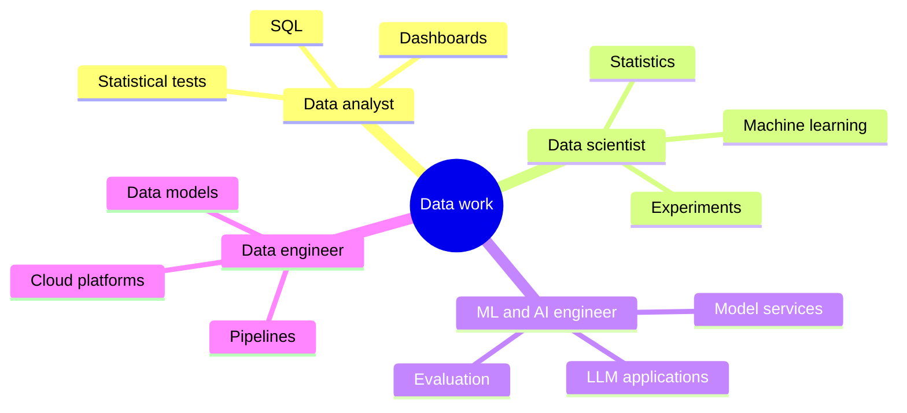
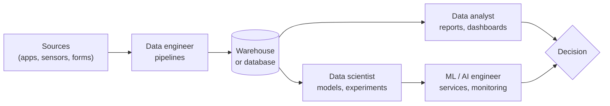
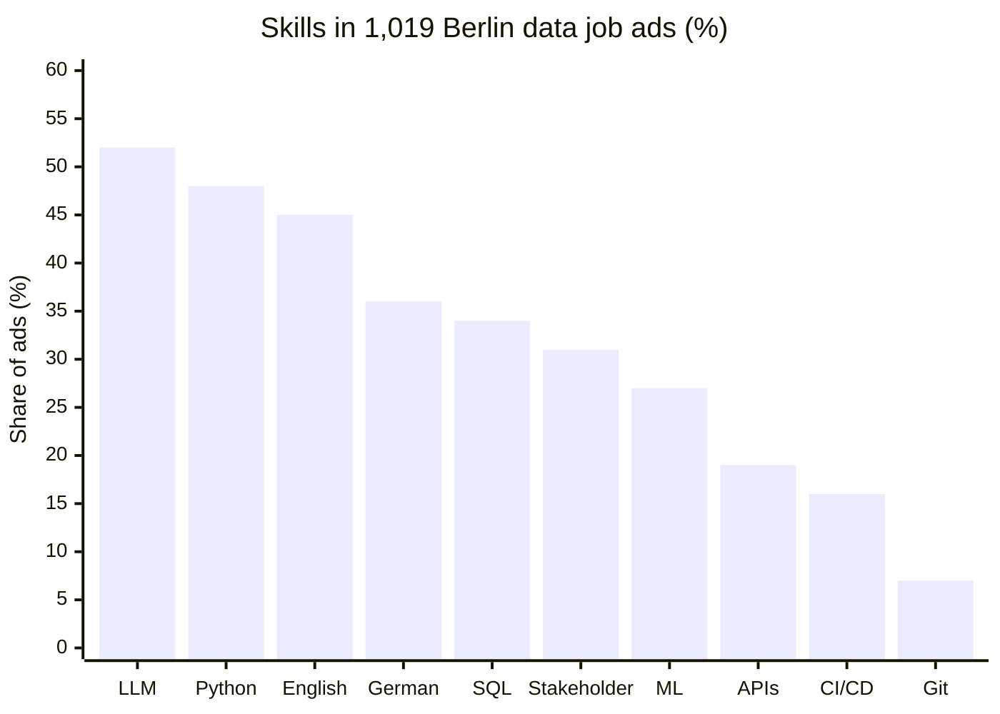
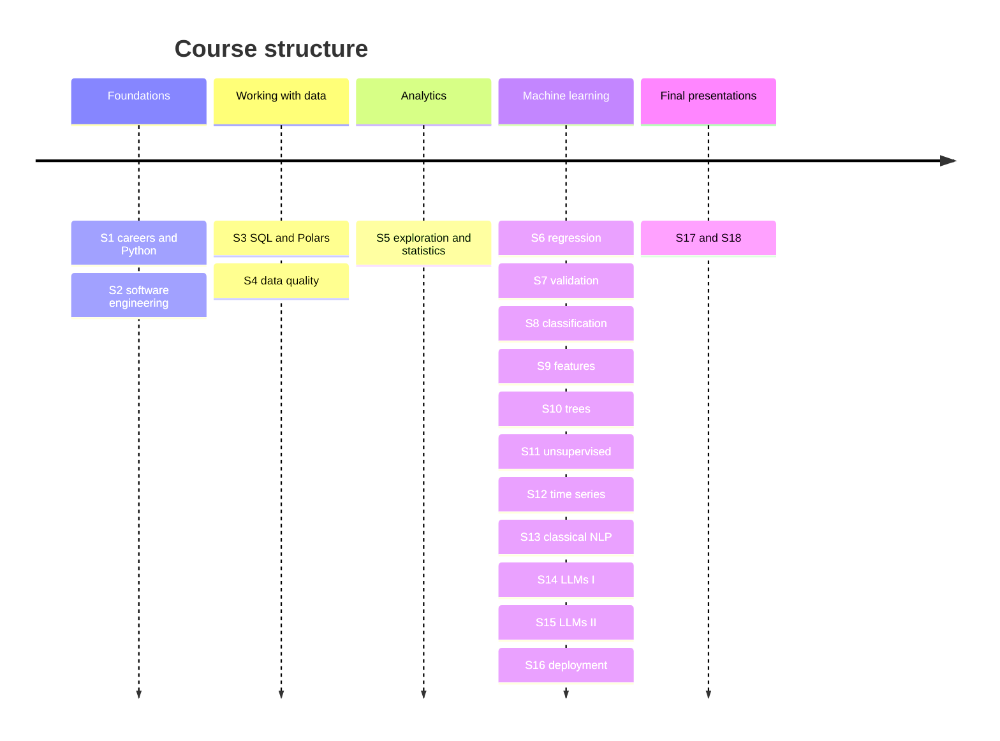

# Data careers and the course

This page covers the first block of the course. It describes the main roles in data work (data analyst, data scientist, machine learning and AI engineer, data engineer), what people in these roles do, which skills employers ask for and how graduates enter them. It then explains how the course is organised: the 18 sessions, the assessment by a final project, the running case study and the class leaderboard. The aim is that every student can place the course content on a map of real jobs and knows from the first day what is expected.



## Data roles

### Concept

A **role** is a bundle of recurring tasks, not a job title. Job titles differ between companies; the tasks behind them are surprisingly stable. Four roles cover most data jobs:

| Role | Main question | Typical output |
|---|---|---|
| **Data analyst** | What happened, and why? | SQL queries, reports, dashboards, statistical comparisons |
| **Data scientist** | What will happen, and what should we do? | Predictive models, experiments (A/B tests), analyses with uncertainty |
| **Machine learning (ML) engineer** and **AI engineer** | How does a model work reliably for real users? | Model services, pipelines for training and monitoring; for AI engineers, applications built on large language models (LLMs) |
| **Data engineer** | How do the right data arrive, correct and on time? | Data pipelines, data models, data warehouses |

The roles form a chain. A data engineer makes data available; an analyst describes it; a data scientist builds a model; an ML engineer runs that model as a service. In small organisations one person covers several links of the chain. A further role sits between analyst and engineer: the **analytics engineer**, who models data in the warehouse (often with SQL and dbt) so that analysts can use it.

A worked example: a holiday-rental platform such as Airbnb lists thousands of flats in Berlin. The **data engineer** loads every new listing, booking and review into the warehouse each night. The **analyst** counts listings and bookings per district and month and shows them in a dashboard for the city team. The **data scientist** trains a model that suggests a price per night from the size, location and reviews of a flat. The **ML engineer** deploys that model so that a suggestion appears within seconds when a host creates a listing, and monitors whether its error grows, for example after a change in the city's rules on holiday rentals.



### Why it matters

Students who know the roles can choose which skills to deepen and can read job advertisements critically. The course mirrors the chain: Sessions 3–4 cover the data-engineering side (SQL, data quality), Session 5 the analyst side (exploration, statistics), Sessions 6–15 the data-science side (models) and Session 16 the engineering side (deployment and monitoring).

### In practice

- **Airbnb** split its data science job family into three tracks, *Analytics*, *Algorithms* and *Inference*, because one title covered very different work (Grewal 2018, "One Data Science Job Doesn't Fit All").
- The term **data engineer** as a separate role was described by Maxime Beauchemin, the author of Apache Airflow, in "The Rise of the Data Engineer" (2017).
- The **AI engineer**, who builds products on top of language models rather than training them, was named as a role in "The Rise of the AI Engineer" (swyx, Latent Space, 2023). In LinkedIn's *Jobs on the Rise 2026* for Germany, AI engineer is the second fastest-growing title.

> [!NOTE]
> Titles are unreliable. A "Data Scientist" advertisement may describe analyst work (SQL and dashboards), and a "Data Analyst" advertisement may ask for machine learning. Read the task list, not the title.

## Tasks, skills and entry routes

### Concept

Each role combines **technical skills** (languages and tools), **methodological skills** (statistics, modelling, evaluation) and **domain and communication skills** (understanding the business question, explaining results to a stakeholder). A **stakeholder** is the person or group who uses the result to make a decision, for example a product manager or a public authority.

| Role | Core technical skills | Core methods | What employers add |
|---|---|---|---|
| Data analyst | SQL, Python or R, one BI tool (Power BI, Tableau, Looker) | Descriptive statistics, tests, A/B test analysis | Stakeholder communication, domain knowledge |
| Data scientist | Python, SQL, scikit-learn | Regression, classification, validation, experiments | Product sense, explaining uncertainty |
| ML / AI engineer | Python, APIs, Docker, cloud, Git and CI | Evaluation, monitoring, retrieval and LLM tools | Software engineering, reliability |
| Data engineer | SQL, Python, orchestration (Airflow, dbt), cloud | Data modelling, data quality | Operations, cost awareness |

An **entry route** is the path into a first job. In Germany the realistic routes for master's graduates are working-student positions (*Werkstudent*) during the degree, internships, a master's thesis with a company, and junior or trainee positions. A **portfolio** is a set of public projects (for example on GitHub) that shows what you can do.

### Why it matters

The entry-level market for data roles in Germany shrank sharply after 2023, while demand for specialists remained. Graduates who can show working, tested and explained projects have an advantage over those with certificates alone. The final project of this course is designed to be such a portfolio piece.

### How it works in Python

The practice task of this block compares job advertisements. Sets are the natural Python type for "which skills appear in both": the intersection `&` keeps shared elements, the difference `-` keeps those of one side only. The advertisement texts below are short invented examples.

```python
ads = {
    "analyst": "SQL, Python, Power BI, statistics, stakeholder communication, German",
    "scientist": "Python, SQL, machine learning, statistics, A/B testing, Git",
    "ml_engineer": "Python, Docker, Git, CI/CD, cloud, machine learning, APIs",
}

# split each text at commas, strip spaces and lower-case: one set of skills per ad
skills = {role: {s.strip().lower() for s in text.split(",")} for role, text in ads.items()}

shared_by_all = skills["analyst"] & skills["scientist"] & skills["ml_engineer"]
print(sorted(shared_by_all))                       # ['python']

only_engineer = skills["ml_engineer"] - skills["analyst"] - skills["scientist"]
print(sorted(only_engineer))                       # ['apis', 'ci/cd', 'cloud', 'docker']

print(sorted(skills["analyst"] & skills["scientist"]))   # ['python', 'sql', 'statistics']
```

### In practice

- An analysis of 1,019 live data and AI job advertisements on the Data Berlin board (24 September 2026) found LLMs in 52 %, Python in 48 %, English in 45 %, German in 36 %, SQL in 34 % and stakeholder management in 31 % of the advertisements (Data Berlin, *Skills*).



- In the same sample, intern and working-student positions made up 9–12 % of advertisements, junior positions only 1–2 %: working-student roles are the main entry route.
- Indeed Hiring Lab reported in September 2026 that entry-level job postings in Germany were 46 % below their 2019 level, with the largest declines in software development. Bitkom counted 79,000 open IT positions in 2026, fewer than in 2023, while 78 % of firms still reported a shortage of specialists.

> [!WARNING]
> Skill shares from one job board in one week are indicative, not representative. Boards differ in the companies they attract; the Data Berlin board leans towards start-ups and generative AI. Compare several sources before drawing conclusions.

> [!TIP]
> German at level B1–B2 roughly doubles the number of positions open to you in Berlin: consultancies, the public sector and many medium-sized companies (*Mittelstand*) require it.

## Course organisation, assessment, case study and leaderboard

### Concept

The course has 18 weekly sessions of three blocks of 45 minutes. Each block combines a short input from a theory page, live coding and an exercise. The parts follow the chain of roles:



**Assessment.** The module is assessed by one final project, graded in its presentation (100 %). Teams of three choose a topic, mostly based on Berlin and German public data, with an *analytics* emphasis (a decision question answered with SQL, exploration and statistical tests, delivered as a dashboard or report) or a *machine learning* emphasis (a validated model delivered as a service). Six criteria are assessed:

| Criterion | Weight |
|---|---|
| Problem definition | 10 % |
| Data | 20 % |
| Analysis or model | 25 % |
| Uncertainty and validation | 15 % |
| Delivery | 10 % |
| Collaboration and presentation (per member) | 20 % |

**Running case study.** Methods are practised on real data that stay the same over many weeks, so that each new method changes the answer to familiar questions. Each session uses the dataset that fits its topic best:

| Dataset | What it is | Sessions |
|---|---|---|
| **Inside Airbnb, Berlin** | 12,776 Berlin listings (snapshot of 26 June 2026) with district, room type, size, price per night, minimum stay, ratings and registration number; the availability calendar for the next 365 days; the number of reviews per listing and month since 2009 as a measure of demand | 1–12 |
| **Open-Meteo** (web API) | Daily Berlin weather (temperature, rain, sunshine) since 2016, fetched from a web API | 2 and 12 |
| **IBM Telco churn** | 7,043 customers of a telecom provider and whether they cancelled their contract | 6, 8–11 |
| **EBTI** (EU customs decisions) | 309,529 binding decisions in 23 languages in which customs states the four-digit tariff heading of a product, for example `9503` (toys); the task is to predict the heading from the description of the goods | 13–16 |

The Airbnb data carry the first twelve sessions: SQL across listings, calendar and reviews (S3), data quality (S4), statistics on prices by district (S5), price models (S6, S7, S9, S10), kinds of offers (S11) and monthly demand with the weather (S12). Telco is the classic churn task for classification. EBTI is a text task across many languages and more than 1,000 classes, which is what Sessions 13–16 need for text models, language models and deployment.

**Leaderboard.** In Sessions 13–16, teams predict the heading of 113,188 customs decisions from 2024 to 2026 whose headings are hidden; 2024 forms the public leaderboard, 2025–2026 the private one. The score is **accuracy** (the share of correct headings), reported together with **macro-F1**, the average F1 score over all headings, in which a rare heading counts as much as a frequent one. The training data contain 1,114 different headings, so the two numbers tell different stories (Session 13). The leaderboard is not graded; it gives every method the same, comparable test.

| Round | Session | Model |
|---|---|---|
| L1 | 13 | TF-IDF text classifier |
| L2 | 14 | Embeddings or a language model, any method of the session |
| L3 | 16 | Final submission after retraining with the released 2024 labels, any method |

### Why it matters

Staying with one dataset for twelve weeks means that students do not spend each week learning a new table; they see how each new method changes the answer to the same questions, for example what drives the price of a night in Berlin: first as a median per district (S5), then as a regression (S6), a validated and tuned model (S7), and a gradient-boosted model with explanations (S10). The leaderboard of Sessions 13–16 makes a comparison concrete in the same way: a reference model that always predicts the most frequent heading (3926, other articles of plastics) is right for 4.1 % of the 2024 decisions; a linear model on TF-IDF features of the description reaches about 88 %.

### How it works in Python

The data are not distributed with the course material. Each student downloads them from the original source with the provided script, run once from the repository root (about 100 MB download, plus the weather from the Open-Meteo archive):

```bash
uv run python case-study/prepare_airbnb.py
```

The EBTI data for Sessions 13–16 are prepared in the same way later (`case-study/prepare_data.py`). A first look confirms that the listings are in place:

```python
import pandas as pd

listings = pd.read_parquet("case-study/data/airbnb/listings.parquet")
print(listings.shape)                                   # (12776, 42)
print(listings["district"].nunique())                   # 12 districts
print(listings["room_type"].value_counts().to_dict())
# {'Entire home/apt': 8846, 'Private room': 3754, 'Hotel room': 89, 'Shared room': 87}
```

### In practice

- Inside Airbnb, an independent project, publishes the listings of more than 100 cities every quarter so that cities, researchers and journalists can see how holiday rentals affect housing. Berlin has restricted holiday rentals since 2014 (*Zweckentfremdungsverbot*) and has required a registration number for every listing since 2018; the registration field of the data shows how well this works.
- Shared benchmark tasks with hidden test sets are standard in research and industry: Kaggle competitions and the open-source platform Codabench (Université Paris-Saclay), which the course uses for the leaderboard, work the same way.
- The leaderboard's time-based split (train 2017–2023, test 2024–2026) mirrors deployment: a model is always trained on the past and used on the future.

> [!IMPORTANT]
> Inside Airbnb and Open-Meteo publish their data under CC BY 4.0: reuse is allowed with attribution. The listings were collected from public web pages, so the preparation script removes host names, profile texts, photos and review texts, and names that hosts typed into the registration field. Report results in aggregate and never try to identify a host. Each student downloads the data with the script, and data files never go into a Git repository.

> [!CAUTION]
> Every decision of the leaderboard's test set can be looked up in the public EBTI database. A high leaderboard rank therefore earns no marks; what counts is that methods are applied and compared correctly.

**AI tools.** Using AI coding assistants is permitted. Students remain responsible for all code they submit, must be able to explain and test it, and declare the tools they used (HTW declaration; in team repositories a file `AI_USE.md`). [Page 2](02-python-for-analysis.md#tips-for-using-ai-coding-assistants) gives practical rules.

## Practice: compare three job advertisements

Find three current advertisements in Berlin or Germany: one for a data analyst, one for a data scientist and one for an ML or AI engineer (for example on LinkedIn, Indeed, StepStone or the Data Berlin board).

1. List the skills each advertisement asks for, separated into technical, methodological and communication skills.
2. Mark the skills shared by all three and those unique to one. Optionally, use the set code above.
3. Note the seniority, the language requirement and whether a degree or experience is required.
4. Discuss in pairs: which session of this course addresses each skill, and which skills the course does not cover?

## Team project until the next session

Teams of three are formed and shortlist three project topics from the [project list](../../17-18-final-presentations/final-project.md#topics) or of their own.

## Check your understanding

1. A job advertisement titled "Data Scientist" asks for SQL, Power BI and stakeholder reporting, but not for machine learning. Which role does it describe?
2. Name one task in the holiday-rental example that belongs to the data engineer and one that belongs to the ML engineer.
3. Why are working-student positions a more realistic entry route than junior positions in Berlin in 2026?
4. In the leaderboard of Sessions 13–16, the most frequent heading covers only 4 % of the decisions, yet 1,114 headings occur. Why does the leaderboard report macro-F1 next to accuracy?
5. The Airbnb data are licensed CC BY 4.0. Why should they still not be committed to a public repository, and why are host names removed?

## Further reading

- Grewal, E. (2018). *One Data Science Job Doesn't Fit All*. Airbnb Tech Blog. https://www.linkedin.com/pulse/one-data-science-job-doesnt-fit-all-elena-grewal/
- Beauchemin, M. (2017). *The Rise of the Data Engineer*. freeCodeCamp. https://www.freecodecamp.org/news/the-rise-of-the-data-engineer-91be18f1e603/
- swyx (2023). *The Rise of the AI Engineer*. Latent Space. https://www.latent.space/p/ai-engineer
- Inside Airbnb (2026). *About Inside Airbnb*; *Get the data*. https://insideairbnb.com/about/
