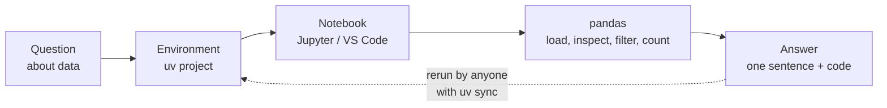
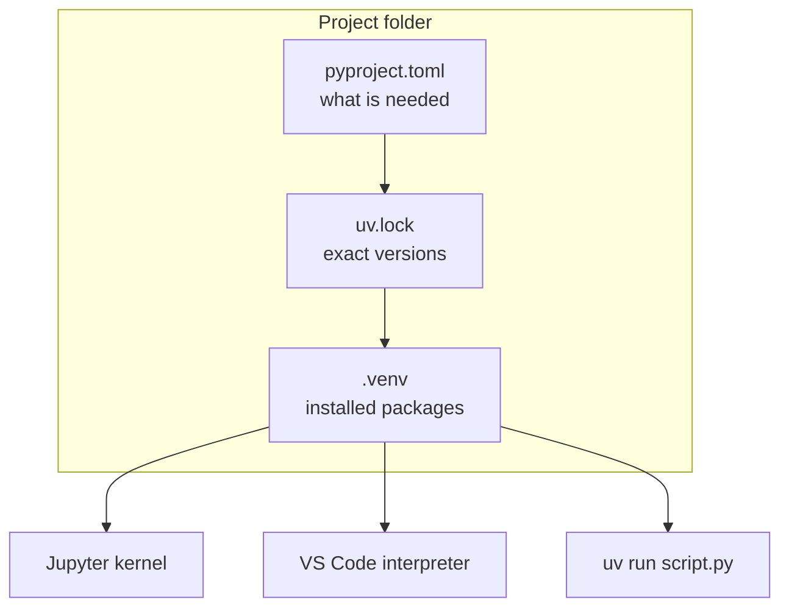
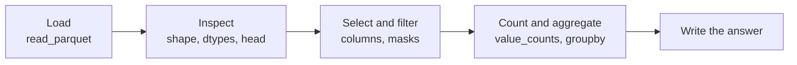
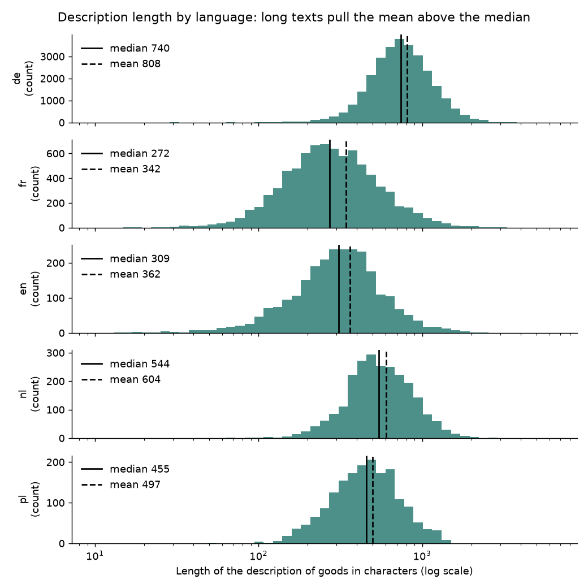
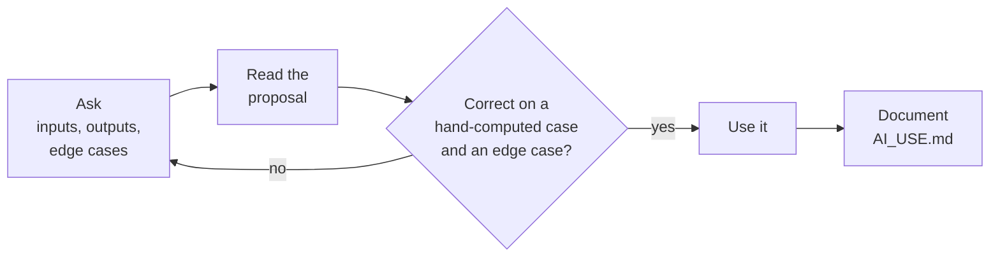

# Python for analysis

This page covers the second block. It sets up the working environment of the course (uv for environments, Jupyter notebooks and the editor VS Code), recaps the Python fundamentals from the first semester (types, lists and dictionaries, conditions, loops and functions), introduces tables with pandas and ends with rules for using AI coding assistants. The thread through the page is one practical question: how do I get from a question about data to an answer that someone else can reproduce on their own computer?



## Python for analysis and its working environment

### Concept

**Python for analysis** means using Python interactively to answer questions about data: load a table, look at it, compute a number, draw a chart, write down the answer. Three tools support this.

- A **package** is installable code that others wrote, such as pandas. A **virtual environment** is a folder (`.venv`) with its own Python interpreter and its own installed packages, separate from the rest of the computer, so that two projects can use different versions without conflict.
- **uv** manages Python versions, environments and packages with one tool. `uv init` creates a **project**: a folder with `pyproject.toml` (name, Python version, dependencies) and `.python-version`. `uv add pandas` installs pandas into `.venv` and records it; the exact versions of every package go into the **lockfile** `uv.lock`. `uv run` runs a command inside the environment; `uv sync` recreates the environment from the lockfile on another computer. `uv run --with pandas ...` runs a single command with extra packages, without changing the project.
- A **Jupyter notebook** (`.ipynb`) mixes code cells, their outputs (tables, charts) and text. The **kernel** is the Python process that runs the cells; it must use the project's `.venv`. **VS Code** is an editor for scripts (`.py` files) and notebooks, with a debugger and Git integration. A plain script with `# %%` markers can be run cell by cell like a notebook in VS Code.



### Why it matters

Results must be reproducible by teammates, reviewers and the lecturer. A committed `pyproject.toml` and `uv.lock` turn "works on my machine" into "works on every machine after `uv sync`". The team repositories and the continuous-integration workflow of Session 2 rely on this.

### How it works in Python

Setting up a project is done in the terminal:

```bash
uv init spp-tariff             # Initialized project `spp-tariff`
cd spp-tariff
uv add pandas pyarrow          # creates .venv; records pandas and pyarrow in pyproject.toml and uv.lock
uv add --dev jupyterlab        # a development tool, not needed to run the code
uv run jupyter lab             # opens JupyterLab; the kernel uses the project's .venv
code .                         # opens the folder in VS Code; choose .venv/bin/python as interpreter
uv sync                        # a teammate recreates exactly the same environment
```

For this course repository, notebooks are started from the repository root with the packages they need, for example:

```bash
uv run --with pandas --with pyarrow --with jupyterlab jupyter lab
```

Inside Python, you can check which environment is running:

```python
import sys

print(sys.version_info >= (3, 11))   # True: the course uses Python 3.11 or newer
print(sys.prefix)                    # the folder of the active environment, e.g. .../.venv
```

### In practice

- Research journals and funders increasingly expect code and a description of the computational environment together with published results; Project Jupyter is widely used to publish notebooks alongside papers.
- Industry data teams pin exact package versions in lockfiles so that a model trained today can be retrained and audited later with the same library versions.

> [!WARNING]
> Notebook cells can run in any order. The state of the kernel can differ from what you see from top to bottom: a variable may still exist although the cell that created it was deleted. Before you share a notebook, choose *Restart Kernel and Run All Cells* and check that it still works.

> [!TIP]
> Never install packages into the system Python with `pip install` outside an environment. If something breaks, delete `.venv` and run `uv sync`; the lockfile restores the working state.

## A refresher of the fundamentals

### Concept

The first-semester module introduced Python scripting. The following summary uses a small customs example that can be checked by hand. A tariff **heading** is a four-digit code such as `9503` (toys); its first two digits are the **chapter** (`95`, toys, games and sports requisites).

- A **value** is a single piece of data, such as `2023`, `0.573` or `"9503"`. Every value has a **type**: `int` (whole numbers), `float` (numbers with decimals), `str` (text), `bool` (`True` or `False`) and `None` (no value). A **variable** is a name that refers to a value.
- A **list** is an ordered, changeable collection: `["9503", "3926", "0901"]`. Indices start at 0; `headings[-1]` is the last element. A **dictionary** (`dict`) maps **keys** to values: `{"language": "de", "heading": "9503"}`. A list of dictionaries with the same keys is already a small table; this is how records arrive from a web API as JSON (Session 2).
- A **condition** (`if … elif … else`) runs a block only when an expression is true. A **for loop** repeats a block once per element. Python marks blocks by **indentation** (four spaces).
- A **function** (`def`) gives a name to a sequence of steps. **Parameters** are its inputs; `return` sends back the result. **Type hints** such as `heading: str` and `-> str` document the expected types; the **docstring** explains what the function does.

### Why it matters

A rule written once as a function can be applied to one decision or to 300,000, and it can be tested. The chapter rule below groups the 1,114 headings of the training data into 97 chapters, a coarser view that Session 8 uses to analyse errors.

### How it works in Python

```python
heading = "9503"                 # str: codes are text, not numbers
year = 2023                      # int
share_german = 0.573             # float
valid = False                    # bool
print(type(share_german).__name__)   # float
print(0.1 + 0.2)                 # 0.30000000000000004: floats are approximations
print(f"heading {heading}, decided in {year}")   # heading 9503, decided in 2023
print(int("0901"))               # 901: stored as a number, coffee loses its leading zero

headings = ["9503", "3926", "0901", "9503", "6307", "8517"]
print(headings[0], headings[-1], headings[1:3])   # 9503 8517 ['3926', '0901']

decision = {"language": "de", "heading": "9503", "keywords": "TOYS,PLUSH"}
print(decision["heading"])                 # 9503
print(decision.get("cn_code", "unknown"))  # unknown: default for a missing key


def chapter_of(heading: str) -> str:
    """Return the two-digit HS chapter of a four-digit heading."""
    if len(heading) != 4 or not heading.isdigit():
        raise ValueError(f"not a four-digit heading: {heading!r}")
    return heading[:2]                     # "0901" -> "09": the leading zero survives in a str


chapters = [chapter_of(h) for h in headings]   # a list comprehension: one chapter per heading
print(chapters)                            # ['95', '39', '09', '95', '63', '85']

counts = {}
for ch in chapters:                        # count with a dictionary
    counts[ch] = counts.get(ch, 0) + 1
print(counts)                              # {'95': 2, '39': 1, '09': 1, '63': 1, '85': 1}
```

### In practice

- The EBTI export of the European Commission arrives as one CSV file per year. The preparation script of the course reads every column as text (`dtype=str`) so that codes such as `0901` keep their leading zero, and converts the dates (`dd/mm/yyyy`) explicitly.
- German postcodes such as 01067 (Dresden) look like numbers but must be stored as text; stored as `int`, the leading zero disappears. Many data errors are type errors of this kind.

> [!CAUTION]
> Types are not converted silently: `"Year: " + 2023` raises a `TypeError`. Convert explicitly with `str()`, `int()` or `float()`, or use an f-string. Do not store money as `float` in accounting code: `0.1 + 0.2` is not exactly `0.3`.

The workbooks [02](../workbooks/02-python-variables.ipynb) to [07](../workbooks/07-python-errors-and-exceptions.ipynb) (Whirlwind Tour of Python) repeat these topics with exercises.

## Tabular data with pandas in a notebook

### Concept

**pandas** is the standard Python library for tables. A **DataFrame** is a table with named columns; each column is a **Series**, a one-dimensional array with one type (`int64`, `float64`, `str`, `bool`, `datetime64`). The **index** labels the rows, by default 0, 1, 2, …

The typical sequence of an analysis has four steps:

1. **Load**: `pd.read_parquet` reads a Parquet file, a compressed column-wise format that also stores the column types (`pd.read_csv` reads text files).
2. **Inspect**: `shape` (rows, columns), `dtypes`, `head()`.
3. **Select and filter**: `df["language"]` selects one column; a comparison such as `df["language"] == "de"` returns a **boolean mask** (one `True`/`False` per row), and `df[mask]` keeps the rows where it is `True`. Conditions are combined with `&` (and), `|` (or), `~` (not), each in parentheses.
4. **Count and aggregate**: `value_counts()` counts values; `groupby("language")["x"].median()` computes a median per group (split, apply, combine).

A small example by hand: for languages `["de", "fr", "de"]`, the mask `language == "de"` is `[True, False, True]`; its sum is 2 (two German decisions) and its mean 2/3 (the share).



### Why it matters

Most descriptive questions in practice are a filter followed by a count or a mean. Inspecting size, columns and types before any analysis prevents most later errors: a wrong type, an unexpected number of rows or a missing column is found in the first minute rather than in the final result.

### How it works in Python

Run from the repository root after preparing the data:

```python
import pandas as pd

decisions = pd.read_parquet("case-study/data/train_sample.parquet")
print(decisions.shape)                        # (50000, 14): rows, columns
print(decisions.dtypes["start_date"])         # datetime64[ns]
print(decisions.loc[0, "keywords"][:44])      # AMPOULES,AS LIQUID,FOOD SUPPLEMENTS,IN AMPOU

# Filter and count
print(decisions["language"].value_counts(normalize=True).head(4).round(3).to_dict())
# {'de': 0.573, 'fr': 0.162, 'en': 0.052, 'nl': 0.048}
is_german = decisions["language"] == "de"     # boolean mask, one value per row
print(is_german.sum())                        # 28656: True counts as 1
toys_2020 = decisions[(decisions["heading"] == "9503") & (decisions["start_date"].dt.year == 2020)]
print(len(toys_2020))                         # 233

# Text columns have string methods under .str
masks = decisions["keywords"].str.contains("FACE MASK", case=False, na=False)
print(decisions.loc[masks, "heading"].value_counts().head(3).to_dict())   # {'6307': 16, '3304': 8, '3824': 2}

# Group and aggregate: split by language, apply the median, combine
lengths = decisions["description"].str.len()
print(lengths.groupby(decisions["language"]).median()[["de", "fr", "en"]].to_dict())
# {'de': 740.0, 'fr': 272.0, 'en': 309.0}
print(round(lengths.mean(), 1), lengths.median())   # 644.1 587.0: the mean is pulled up by long texts
```

The last line shows why the median is the better summary of text length. The distribution is skewed: most descriptions are a few hundred characters long, a few run to several thousand. The keyword filter also shows why the English `keywords` column helps: it lets you find face masks (heading 6307, made-up textile articles) without reading German, French or Polish. Keywords are assigned by customs together with the decision, so they help you *read* the data but are not available as model input (Session 9).



### In practice

- Trade-compliance teams filter the public EBTI database by keyword and heading in the same way, to see how similar products were classified before they file a request of their own.
- Public statistics offices such as Destatis publish tables that analysts load and aggregate with pandas or R; the GENESIS database offers downloads as CSV.

> [!WARNING]
> `df[df["heading"] == "9503" & df["language"] == "de"]` without parentheses fails or gives wrong results, because `&` binds more strongly than `==`. Put each condition in its own parentheses.

> [!NOTE]
> pandas 3 changes two defaults. Since version 3.0, text columns have their own `str` type and *Copy-on-Write* is always on: a selection never changes the original DataFrame. Older tutorials that use `inplace=True` or chained assignment (`df["a"][0] = 1`) may behave differently.

The workbooks [08](../workbooks/08-pandas-introduction.ipynb) to [11](../workbooks/11-pandas-groupby.ipynb) cover selection, merging and grouping in more depth.

## Tips for using AI coding assistants

### Concept

An **AI coding assistant** is a language model, used as a chat or as an editor extension, that generates code from a description. The code is a **proposal**, not a result: it can be correct, subtly wrong, or fail silently on cases that were not mentioned. The course rule has three steps.

1. **Ask precisely.** State the input (types, column names), the expected output and edge cases (empty input, missing values).
2. **Verify.** Test the proposal on a case you can compute by hand and on an edge case before using it on real data. Read every line; ask the assistant to explain lines you do not understand.
3. **Document.** Record the tool, the prompt, what you accepted and how you checked it. In team repositories this goes into `AI_USE.md`; HTW Berlin requires that AI tools used in assessed work are declared.



### Why it matters

Assistants speed up routine code, but only a person who can read and test the code can take responsibility for it. In the final presentation every team member answers questions about the code individually. The habit of checking with hand-computed cases is also the start of automated testing in Session 2.

### How it works in Python

```python
# Asked an assistant: "function for the share of texts that contain the placeholder <CODE>"
def share_with_code(texts: list[str]) -> float:
    return sum("<CODE>" in t for t in texts) / len(texts)


# 1. Verify on a case you can compute by hand
assert share_with_code(["see <CODE>", "toy", "<CODE>, plastic", "bag"]) == 0.5

# 2. Probe an edge case the suggestion did not mention
try:
    share_with_code([])
except ZeroDivisionError as err:
    print("empty input:", err)        # empty input: division by zero

# 3. Only then apply it to the real data
import pandas as pd

decisions = pd.read_parquet("case-study/data/train_sample.parquet")
print(round(share_with_code(decisions["description"].tolist()), 3))   # 0.068

# 4. Document, e.g. one line in AI_USE.md:
# 2026-10-08 | assistant: <tool> | prompt: share of texts with <CODE> |
# accepted: share_with_code | checked: hand case; fails on [] (guarded by caller)
```

### In practice

- In the Stack Overflow Developer Survey 2025, 84 % of respondents used or planned to use AI tools, but only 29 % said they trusted their accuracy; the most common frustration was answers that are "almost right".
- Meta introduced interviews in which candidates may use an AI assistant; they are assessed on problem solving, code quality, verification and communication. Verification is part of the skill, not an extra.

> [!CAUTION]
> Do not paste personal data, passwords, API keys or confidential company data into an online assistant. The EBTI export does not name the holders of decisions, but descriptions can contain brand and product names; treat a company's own, unpublished product data as confidential.

> [!TIP]
> Ask the assistant for tests as well as code, then check that the tests would actually fail on a wrong answer: change one expected value and run them.

## Practice: five questions about the decisions

Download the data with the provided script (once, from the repository root):

```bash
uv run python case-study/prepare_data.py
```

Then open [workbooks/12-case-study-five-questions.ipynb](../workbooks/12-case-study-five-questions.ipynb) and answer, each in one sentence below the code:

1. How many decisions are there per year and issuing country, and which period do the start dates cover?
2. What share of decisions is written in each language?
3. Which five headings are most frequent, and what are their English names (join `nomenclature.parquet`)?
4. What is the median length of the description in characters for each language?
5. What share of decisions is still valid, and why does it depend so strongly on the start year?

## Check your understanding

1. What is the difference between `pyproject.toml` and `uv.lock`, and which command uses the lockfile?
2. A notebook works on your laptop but fails for a teammate with `NameError`. What is a likely cause, and how do you check for it?
3. What does `(decisions["language"] == "de").mean()` compute, and why does it work?
4. Why must the heading `0901` be stored as text and not as an integer?
5. An assistant proposes a function that passes the example in your prompt. Name two further checks before you use it.

## Further reading

- VanderPlas, J. (2016). *A Whirlwind Tour of Python*. O'Reilly, CC0. https://jakevdp.github.io/WhirlwindTourOfPython/
- McKinney, W. (2022). *Python for Data Analysis*, 3rd edition, chapters 2–5. Open access. https://wesmckinney.com/book/
- Astral (2026). *uv documentation: Working on projects*. https://docs.astral.sh/uv/guides/projects/
- pandas development team (2026). *Getting started tutorials*. https://pandas.pydata.org/docs/getting_started/intro_tutorials/index.html
