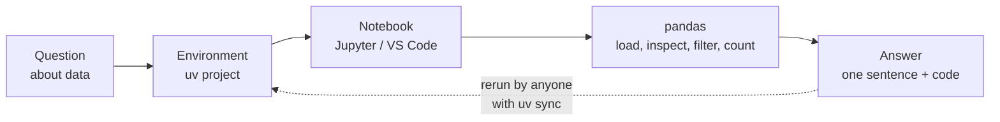
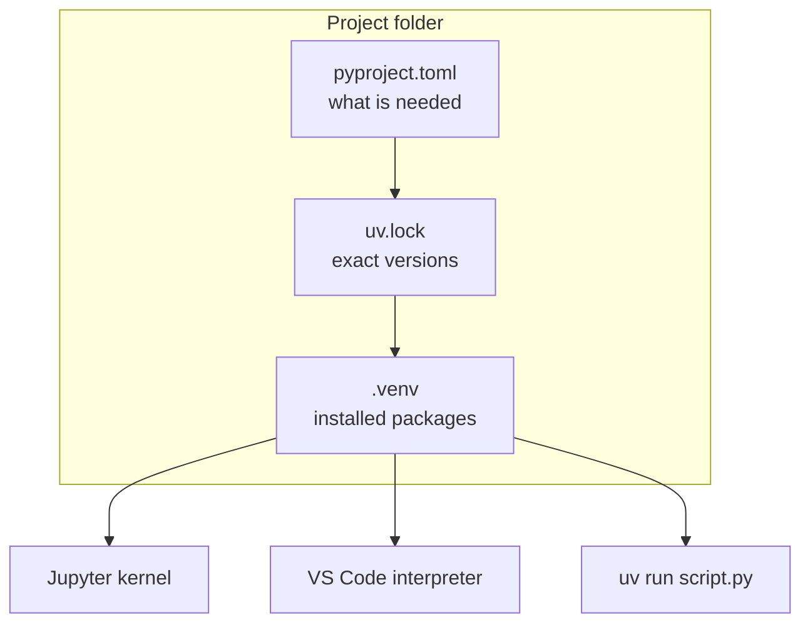
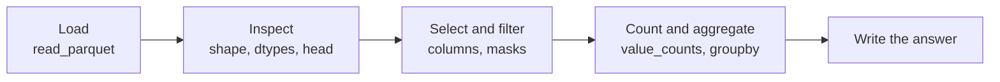
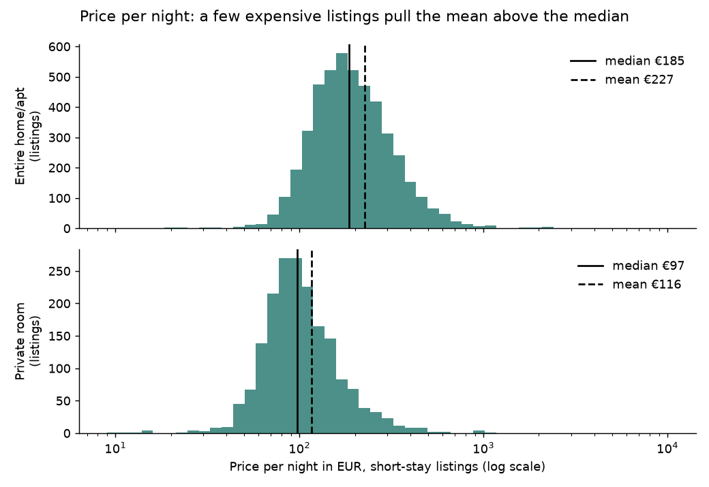
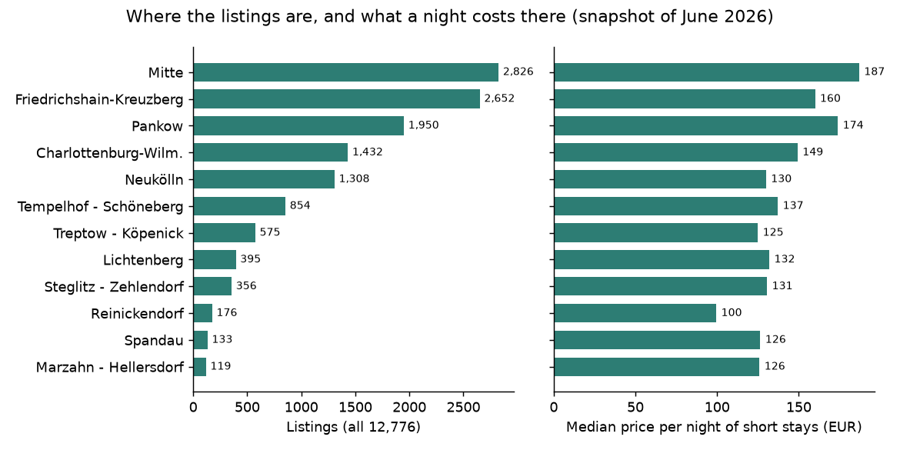
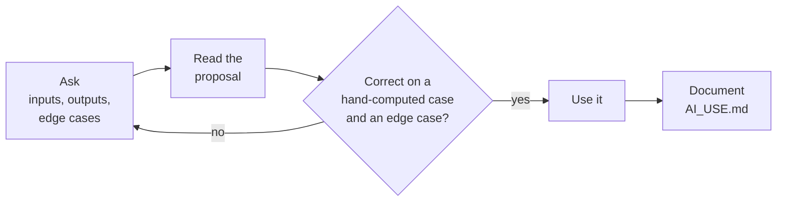

# Python for analysis

This page covers the second block. It sets up the working environment of the course (uv for environments, Jupyter notebooks and the editor VS Code), recaps the Python fundamentals from the first semester (types, lists and dictionaries, conditions, loops and functions), introduces tables with pandas and ends with rules for using AI coding assistants. The thread through the page is one practical question: how do I get from a question about data to an answer that someone else can reproduce on their own computer?



## Python for analysis and its working environment

### Concept

**Python for analysis** means using Python interactively to answer questions about data: load a table, look at it, compute a number, draw a chart, write down the answer. Three tools support this.

- A **package** is installable code that others wrote, such as pandas. A **virtual environment** is a folder (`.venv`) with its own Python interpreter and its own installed packages, separate from the rest of the computer, so that two projects can use different versions without conflict.
- **uv** manages Python versions, environments and packages with one tool. `uv init` creates a **project**: a folder with `pyproject.toml` (name, Python version, dependencies) and `.python-version`. `uv add pandas` installs pandas into `.venv` and records it; the exact versions of every package go into the **lockfile** `uv.lock`. `uv run` runs a command inside the environment; `uv sync` recreates the environment from the lockfile on another computer. `uv run --with pandas ...` runs a single command with extra packages, without changing the project.
- A **Jupyter notebook** (`.ipynb`) mixes code cells, their outputs (tables, charts) and text. The **kernel** is the Python process that runs the cells; it must use the project's `.venv`. **VS Code** is an editor for scripts (`.py` files) and notebooks, with a debugger and Git integration. A plain script with `# %%` markers can be run cell by cell like a notebook in VS Code.



### Why it matters

Results must be reproducible by teammates, reviewers and the lecturer. A committed `pyproject.toml` and `uv.lock` turn "works on my machine" into "works on every machine after `uv sync`". The team repositories and the continuous-integration workflow of Session 2 rely on this.

### How it works in Python

Setting up a project is done in the terminal:

```bash
uv init spp-listings           # Initialized project `spp-listings`
cd spp-listings
uv add pandas pyarrow          # creates .venv; records pandas and pyarrow in pyproject.toml and uv.lock
uv add --dev jupyterlab        # a development tool, not needed to run the code
uv run jupyter lab             # opens JupyterLab; the kernel uses the project's .venv
code .                         # opens the folder in VS Code; choose .venv/bin/python as interpreter
uv sync                        # a teammate recreates exactly the same environment
```

For this course repository, notebooks are started from the repository root with the packages they need, for example:

```bash
uv run --with pandas --with pyarrow --with jupyterlab jupyter lab
```

Inside Python, you can check which environment is running:

```python
import sys

print(sys.version_info >= (3, 11))   # True: the course uses Python 3.11 or newer
print(sys.prefix)                    # the folder of the active environment, e.g. .../.venv
```

### In practice

- Research journals and funders increasingly expect code and a description of the computational environment together with published results; Project Jupyter is widely used to publish notebooks alongside papers.
- Industry data teams pin exact package versions in lockfiles so that a model trained today can be retrained and audited later with the same library versions.

> [!WARNING]
> Notebook cells can run in any order. The state of the kernel can differ from what you see from top to bottom: a variable may still exist although the cell that created it was deleted. Before you share a notebook, choose *Restart Kernel and Run All Cells* and check that it still works.

> [!TIP]
> Never install packages into the system Python with `pip install` outside an environment. If something breaks, delete `.venv` and run `uv sync`; the lockfile restores the working state.

## A refresher of the fundamentals

### Concept

The first-semester module introduced Python scripting. The following summary uses a small example from the case study that can be checked by hand: one Airbnb listing, its room type, its size and its price per night. In the raw file of Inside Airbnb the price is stored as **text** such as `"$1,083.00"`, with a dollar sign (used for every city; Berlin prices are in euros) and a thousands separator.

- A **value** is a single piece of data, such as `4`, `160.71` or `"Entire home/apt"`. Every value has a **type**: `int` (whole numbers), `float` (numbers with decimals), `str` (text), `bool` (`True` or `False`) and `None` (no value). A **variable** is a name that refers to a value.
- A **list** is an ordered, changeable collection: `[160.71, 193.33, 85.0]`. Indices start at 0; `prices[-1]` is the last element. A **dictionary** (`dict`) maps **keys** to values: `{"district": "Pankow", "room_type": "Private room"}`. A list of dictionaries with the same keys is already a small table; this is how records arrive from a web API as JSON (Session 2).
- A **condition** (`if … elif … else`) runs a block only when an expression is true. A **for loop** repeats a block once per element. Python marks blocks by **indentation** (four spaces).
- A **function** (`def`) gives a name to a sequence of steps. **Parameters** are its inputs; `return` sends back the result. **Type hints** such as `text: str` and `-> float` document the expected types; the **docstring** explains what the function does.

### Why it matters

A rule written once as a function can be applied to one listing or to all 12,776, and it can be tested. The price rule below is exactly the conversion that the preparation script applies to the raw file; Session 2 turns it into a class that checks a whole listing.

### How it works in Python

```python
room_type = "Entire home/apt"    # str
accommodates = 4                 # int
price = 160.71                   # float
instant_bookable = False         # bool
print(type(price).__name__)      # float
print(0.1 + 0.2)                 # 0.30000000000000004: floats are approximations
print(f"{room_type} for {accommodates} guests, {price} EUR per night")
# Entire home/apt for 4 guests, 160.71 EUR per night
print(int("01067"))              # 1067: stored as a number, the postcode of Dresden loses its leading zero

prices = [160.71, 193.33, 85.0, 372.67, 243.5, 49.0]
print(prices[0], prices[-1], prices[1:3])        # 160.71 49.0 [193.33, 85.0]

listing = {"district": "Pankow", "room_type": "Private room", "price": "$97.33"}
print(listing["district"])                       # Pankow
print(listing.get("license", "unknown"))         # unknown: default for a missing key


def price_to_number(text: str) -> float:
    """Convert a price as written in the raw file, such as "$1,083.00", to a number."""
    cleaned = text.strip().lstrip("$€").replace(",", "")
    if not cleaned.replace(".", "", 1).isdigit():
        raise ValueError(f"not a price: {text!r}")
    return float(cleaned)


raw = ["$160.71", "$1,083.00", "$97.33", "$49.00"]
numbers = [price_to_number(p) for p in raw]      # a list comprehension: one number per text
print(numbers)                                   # [160.71, 1083.0, 97.33, 49.0]


def price_band(price: float) -> str:
    """Group a price per night into three bands."""
    if price < 100:
        return "budget"
    elif price < 250:
        return "mid-range"
    else:
        return "upper"


counts = {}
for band in [price_band(p) for p in numbers]:   # count with a dictionary
    counts[band] = counts.get(band, 0) + 1
print(counts)                                    # {'mid-range': 1, 'upper': 1, 'budget': 2}
```

### In practice

- Inside Airbnb publishes its files as CSV, a text format without types: prices, percentages (`"98%"`) and true/false values (`"t"`, `"f"`) arrive as text. The preparation script of the course converts each of them explicitly before writing typed Parquet files.
- German postcodes such as 01067 (Dresden) look like numbers but must be stored as text; stored as `int`, the leading zero disappears. Many data errors are type errors of this kind.

> [!CAUTION]
> Types are not converted silently: `"Price: " + 160.71` raises a `TypeError`. Convert explicitly with `str()`, `int()` or `float()`, or use an f-string. Do not store money as `float` in accounting code: `0.1 + 0.2` is not exactly `0.3`.

The workbooks [02](../workbooks/02-python-variables.ipynb) to [07](../workbooks/07-python-errors-and-exceptions.ipynb) (Whirlwind Tour of Python) repeat these topics with exercises.

## Tabular data with pandas in a notebook

### Concept

**pandas** is the standard Python library for tables. A **DataFrame** is a table with named columns; each column is a **Series**, a one-dimensional array with one type (`int64`, `float64`, `str`, `bool`, `datetime64`). The **index** labels the rows, by default 0, 1, 2, …

The typical sequence of an analysis has four steps:

1. **Load**: `pd.read_parquet` reads a Parquet file, a compressed column-wise format that also stores the column types (`pd.read_csv` reads text files).
2. **Inspect**: `shape` (rows, columns), `dtypes`, `head()`.
3. **Select and filter**: `df["district"]` selects one column; a comparison such as `df["district"] == "Mitte"` returns a **boolean mask** (one `True`/`False` per row), and `df[mask]` keeps the rows where it is `True`. Conditions are combined with `&` (and), `|` (or), `~` (not), each in parentheses.
4. **Count and aggregate**: `value_counts()` counts values; `groupby("room_type")["price"].median()` computes a median per group (split, apply, combine).

A small example by hand: for districts `["Mitte", "Pankow", "Mitte"]`, the mask `district == "Mitte"` is `[True, False, True]`; its sum is 2 (two listings in Mitte) and its mean 2/3 (the share).



### Why it matters

Most descriptive questions in practice are a filter followed by a count or a mean. Inspecting size, columns and types before any analysis prevents most later errors: a wrong type, an unexpected number of rows or a missing column is found in the first minute rather than in the final result.

### How it works in Python

Run from the repository root after preparing the data:

```python
import pandas as pd

listings = pd.read_parquet("case-study/data/airbnb/listings.parquet")
print(listings.shape)                          # (12776, 42): rows, columns
print(listings.dtypes["last_review"])          # datetime64[ns]
print(listings.loc[0, "name"])                 # Fabulous Flat in great Location

# Filter and count
print(listings["room_type"].value_counts(normalize=True).round(3).to_dict())
# {'Entire home/apt': 0.692, 'Private room': 0.294, 'Hotel room': 0.007, 'Shared room': 0.007}
in_mitte = listings["district"] == "Mitte"     # boolean mask, one value per row
print(in_mitte.sum())                          # 2826: True counts as 1

# Prices are only comparable for short stays: a price present and a minimum stay below 28 nights
short = listings[listings["price"].notna() & (listings["minimum_nights"] < 28)]
print(len(short))                              # 6701
cheap = short[(short["district"] == "Friedrichshain-Kreuzberg")
              & (short["room_type"] == "Entire home/apt") & (short["price"] < 100)]
print(len(cheap))                              # 37 entire homes under 100 EUR in Friedrichshain-Kreuzberg

# Text columns have string methods under .str
balcony = listings["name"].str.contains("balcony|balkon", case=False, na=False)
print(round(balcony.mean(), 3))                # 0.056: titles that mention a balcony, in English or German

# Group and aggregate: split by room type, apply the median, combine
print(short.groupby("room_type")["price"].median().round(1).to_dict())
# {'Entire home/apt': 185.2, 'Hotel room': 174.0, 'Private room': 97.3, 'Shared room': 49.2}
print(round(short["price"].mean(), 1), short["price"].median())   # 193.7 157.0: the mean is pulled up
```

The last line shows why the median is the better summary of prices. The distribution is skewed: half of the short stays cost between €107 and €232 a night, but a few ask for more than €1,000 (one even €10,025), and they pull the mean up. The 28-night rule matters as well: 4,480 listings can only be booked for a month or longer (most for 92 nights), and their price field is not comparable with that of a weekend stay. Session 4 examines both problems.





### In practice

- City and district housing offices filter listing data by district and minimum stay in the same way, to estimate how many flats are let to tourists instead of residents.
- Public statistics offices such as Destatis publish tables that analysts load and aggregate with pandas or R; the GENESIS database offers downloads as CSV.

> [!WARNING]
> `df[df["district"] == "Mitte" & df["price"] < 100]` without parentheses fails or gives wrong results, because `&` binds more strongly than `==`. Put each condition in its own parentheses.

> [!NOTE]
> pandas 3 changes two defaults. Since version 3.0, text columns have their own `str` type and *Copy-on-Write* is always on: a selection never changes the original DataFrame. Older tutorials that use `inplace=True` or chained assignment (`df["a"][0] = 1`) may behave differently.

The workbooks [08](../workbooks/08-pandas-introduction.ipynb) to [11](../workbooks/11-pandas-groupby.ipynb) cover selection, merging and grouping in more depth.

## Tips for using AI coding assistants

### Concept

An **AI coding assistant** is a language model, used as a chat or as an editor extension, that generates code from a description. The code is a **proposal**, not a result: it can be correct, subtly wrong, or fail silently on cases that were not mentioned. The course rule has three steps.

1. **Ask precisely.** State the input (types, column names), the expected output and edge cases (empty input, missing values).
2. **Verify.** Test the proposal on a case you can compute by hand and on an edge case before using it on real data. Read every line; ask the assistant to explain lines you do not understand.
3. **Document.** Record the tool, the prompt, what you accepted and how you checked it. In team repositories this goes into `AI_USE.md`; HTW Berlin requires that AI tools used in assessed work are declared.



### Why it matters

Assistants speed up routine code, but only a person who can read and test the code can take responsibility for it. In the final presentation every team member answers questions about the code individually. The habit of checking with hand-computed cases is also the start of automated testing in Session 2.

### How it works in Python

```python
# Asked an assistant: "function for the share of listing titles that mention a word"
def share_mentioning(titles: list[str], word: str) -> float:
    return sum(word in t.lower() for t in titles) / len(titles)


# 1. Verify on a case you can compute by hand
assert share_mentioning(["Flat with balcony", "Room", "BALCONY view", "Loft"], "balcony") == 0.5

# 2. Probe an edge case the suggestion did not mention
try:
    share_mentioning([], "balcony")
except ZeroDivisionError as err:
    print("empty input:", err)        # empty input: division by zero

# 3. Only then apply it to the real data, and check that the result answers the question
import pandas as pd

titles = pd.read_parquet("case-study/data/airbnb/listings.parquet")["name"].tolist()
print(round(share_mentioning(titles, "balcony"), 3))   # 0.04
print(round(share_mentioning(titles, "balkon"), 3))    # 0.016: German titles were missed

# 4. Document, e.g. one line in AI_USE.md:
# 2026-10-08 | assistant: <tool> | prompt: share of titles with a word |
# accepted: share_mentioning | checked: hand case; fails on [] (guarded by caller); English only
```

The function was correct for the case in the prompt and still answered a narrower question than intended: many Berlin hosts write their titles in German, so "balcony" alone finds only 4.0 % instead of 5.6 % of the listings.

### In practice

- In the Stack Overflow Developer Survey 2025, 84 % of respondents used or planned to use AI tools, but only 29 % said they trusted their accuracy; the most common frustration was answers that are "almost right".
- Meta introduced interviews in which candidates may use an AI assistant; they are assessed on problem solving, code quality, verification and communication. Verification is part of the skill, not an extra.

> [!CAUTION]
> Do not paste personal data, passwords, API keys or confidential company data into an online assistant. The course data contain no host names, but a listing's title and exact coordinates can still point to a flat; treat a company's own, unpublished customer data as confidential.

> [!TIP]
> Ask the assistant for tests as well as code, then check that the tests would actually fail on a wrong answer: change one expected value and run them.

## Practice: five questions about the listings

Download the data with the provided script (once, from the repository root, about 100 MB):

```bash
uv run python case-study/prepare_airbnb.py
```

Then open [workbooks/12-case-study-five-questions.ipynb](../workbooks/12-case-study-five-questions.ipynb) and answer, each in one sentence below the code:

1. **How many?** How many listings and hosts are there, and how many listings belong to hosts with more than one?
2. **Where?** How many listings are there in each district?
3. **What type?** What share are entire homes, private rooms, shared rooms and hotel rooms?
4. **What price?** What does a night cost by room type and district, and why do we compare only short stays?
5. **How many reviews?** How many reviews does a typical listing have, and what share has none?

## Check your understanding

1. What is the difference between `pyproject.toml` and `uv.lock`, and which command uses the lockfile?
2. A notebook works on your laptop but fails for a teammate with `NameError`. What is a likely cause, and how do you check for it?
3. What does `(listings["district"] == "Mitte").mean()` compute, and why does it work?
4. Why must the postcode `01067` be stored as text and not as an integer, and why must the raw price `"$1,083.00"` be converted before you compute a median?
5. An assistant proposes a function that passes the example in your prompt. Name two further checks before you use it.

## Further reading

- VanderPlas, J. (2016). *A Whirlwind Tour of Python*. O'Reilly, CC0. https://jakevdp.github.io/WhirlwindTourOfPython/
- McKinney, W. (2022). *Python for Data Analysis*, 3rd edition, chapters 2–5. Open access. https://wesmckinney.com/book/
- Astral (2026). *uv documentation: Working on projects*. https://docs.astral.sh/uv/guides/projects/
- pandas development team (2026). *Getting started tutorials*. https://pandas.pydata.org/docs/getting_started/intro_tutorials/index.html
