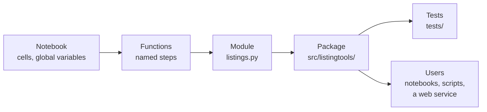
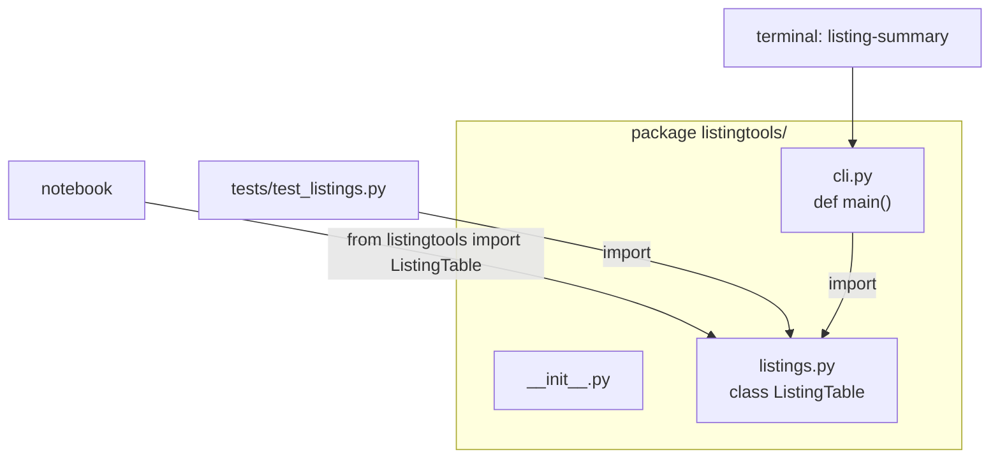
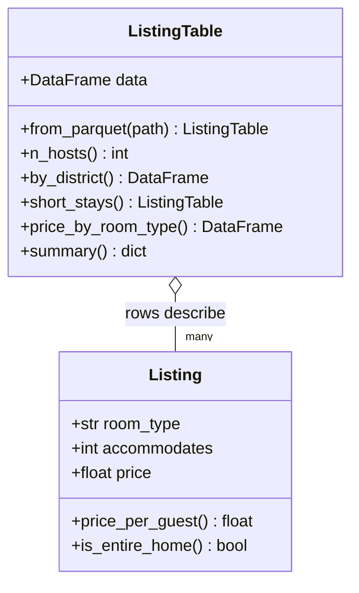
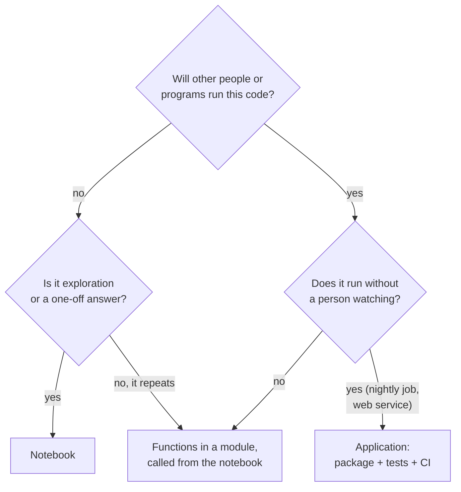

# From notebook to application

This page covers the third block. Analysis code in a notebook answers a question once; application code is reused, imported, tested and run by other people and other programs. The page explains the difference, introduces scripts, modules and packages, shows the project structure used throughout the course, gives a first introduction to object-oriented programming (classes, objects, attributes and methods) and ends with a rule of thumb for when to use a notebook and when an application. Session 2 builds on this with tests, APIs and Git.



## Python for software engineering: from notebook to application

### Concept

**Software engineering** is the discipline of building programs that keep working when they are changed, used by others and run in new situations. Python serves both purposes of this course:

| | Python for analysis | Python for applications |
|---|---|---|
| Goal | Answer a question | Provide a function others rely on |
| Typical file | Notebook (`.ipynb`) | Module (`.py`) in a package |
| Run by | The author, cell by cell | Other code, a scheduler, a web server |
| State | Global variables in the kernel | Inputs and outputs of functions and objects |
| Checked by | Looking at the output | Automated tests |
| Lifetime | Days to weeks | Months to years |

An **application** here means any code that others run without reading it first: a command-line tool, a module imported by notebooks, a scheduled data pipeline, a web service. Moving from notebook to application happens in small steps: repeated cells become **functions**; related functions move into a **module**; modules are grouped into a **package**; tests check the package.

### Why it matters

Notebooks invite copying: the same cleaning code is pasted into five notebooks, one copy is fixed, four keep the bug. When several people work on one project, or when a model must run every night, the logic has to live in one place that can be imported, reviewed and tested. In the final project, teams deliver a dashboard or a model service; both are applications.

### How it works in Python

The first step is to replace notebook cells that depend on global variables by a function with explicit inputs and outputs:

```python
import pandas as pd

# Notebook style: depends on a global variable `df` and a hard-coded column
df = pd.DataFrame({"room_type": ["Entire home/apt", "Private room", "Entire home/apt", "Shared room"]})
print(df["room_type"].value_counts(normalize=True)["Entire home/apt"])   # 0.5


# Application style: explicit inputs, a documented result, no hidden state
def share_of(values: pd.Series, value: str) -> float:
    """Share of entries in `values` that equal `value` (0.0 for an empty Series)."""
    if len(values) == 0:
        return 0.0
    return float((values == value).mean())


print(share_of(df["room_type"], "Entire home/apt"))          # 0.5
print(share_of(pd.Series([], dtype=str), "Entire home/apt"))  # 0.0
```

### In practice

- Netflix described how it uses notebooks for exploration and scheduled notebook runs with the tool Papermill, while shared logic lives in libraries ("Beyond Interactive: Notebook Innovation at Netflix", Netflix Technology Blog, 2018).
- Joel Grus's talk "I don't like notebooks" (JupyterCon 2018) listed hidden state and out-of-order execution as the main risks of notebooks for software work; the talk is widely cited in discussions about when to leave the notebook.

> [!NOTE]
> Notebooks are not "bad code". They are the right tool for exploring, explaining and presenting. The problem is using them for code that others depend on.

## Scripts, modules and packages

### Concept

- A **script** is a `.py` file that is run from top to bottom: `python summarise.py`. It always starts from a clean state, which makes it reproducible.
- A **module** is a `.py` file whose functions and classes can be **imported** by other code. `import listings` runs the file once and gives access to its names as `listings.name`. The block `if __name__ == "__main__":` contains code that runs only when the file is executed as a script, not when it is imported.
- A **package** is a folder of modules with an `__init__.py` file. `from listingtools.listings import ListingTable` looks for the package `listingtools`, the module `listings` inside it and the name `ListingTable` in the module.
- Python finds modules on its **search path** (`sys.path`): the folder of the script, the installed packages of the environment, and folders added explicitly. Installing your own package into the environment (uv does this in *editable* mode) makes it importable everywhere, and changes to the code take effect without reinstalling.



### Why it matters

A module shared by the whole team replaces diverging copies. A bug is fixed once; tests and reviews apply to the code that everyone uses. Importable code can also be used by a web service (Session 16) without change.

### How it works in Python

This example writes a tiny module to a temporary folder, imports it and uses it, which is what happens when you save a `.py` file next to your notebook:

```python
import sys
import tempfile
from pathlib import Path

folder = Path(tempfile.mkdtemp())
(folder / "prices.py").write_text(
    '"""Helpers for prices in the raw Inside Airbnb files."""\n'
    "\n"
    "def price_to_number(text: str) -> float:\n"
    '    return float(text.lstrip("$").replace(",", ""))\n'
    "\n"
    'if __name__ == "__main__":\n'
    '    print("run as a script")\n'
)
sys.path.insert(0, str(folder))     # normally not needed: the module sits next to your code

import prices                       # runs prices.py once; the __main__ block is skipped

print(prices.price_to_number("$160.71"), prices.price_to_number("$1,083.00"))   # 160.71 1083.0
print(prices.__doc__)               # Helpers for prices in the raw Inside Airbnb files.
```

### In practice

- Most Python libraries on PyPI, including pandas and scikit-learn, are packages of many modules; `import sklearn.linear_model` imports one module of the `sklearn` package.
- Data teams keep shared cleaning and feature code in an internal package that both notebooks and scheduled pipelines import, so that a model in production computes exactly the same features as in development.

> [!WARNING]
> Do not name your own module like a library you use. A file `pandas.py` or `test.py` in your folder hides the real package of that name, and `import pandas` then imports your file.

> [!CAUTION]
> Avoid `from module import *`. It hides where a name comes from and can silently replace names you already defined.

The workbook [13-python-modules-and-packages.ipynb](../workbooks/13-python-modules-and-packages.ipynb) (Whirlwind Tour of Python) shows the import forms and the standard library.

## Project structure

### Concept

A **project structure** is the agreed layout of folders and files, so that every team member and every tool knows where things are. The course uses the **src layout**, which `uv init --package` creates:

```
listingtools/                project folder (= Git repository)
├── pyproject.toml           name, Python version, dependencies, tool settings
├── uv.lock                  exact versions (generated, committed)
├── README.md                what the project does and how to run it
├── .gitignore               files never committed: .venv/, data/, secrets
├── src/listingtools/        the package: importable code only
│   ├── __init__.py
│   └── listings.py
├── tests/                   automated tests (Session 2)
│   └── test_listings.py
├── notebooks/               exploration that imports the package
└── data/                    local data, ignored by Git
```

The package lives in `src/`, separate from tests, notebooks and data. `pyproject.toml` describes the project in the standard format of the Python packaging community (PEP 621).

### Why it matters

A fixed layout removes questions ("where is the cleaning code?") and lets tools work without configuration: pytest finds `tests/`, uv installs the package from `src/`, the CI workflow of Session 2 runs both. The src layout also ensures that tests run against the installed package, not against files that happen to be in the current folder.

### How it works in Python

```bash
uv init --package listingtools     # creates pyproject.toml, src/listingtools/__init__.py, README.md
cd listingtools
uv add pandas pyarrow
uv add --dev pytest ruff
mkdir tests notebooks
uv run python -c "import listingtools; print(listingtools.__file__)"
# .../listingtools/src/listingtools/__init__.py: the package is installed in editable mode
```

The Session 1 [workspace](../workspace/) is a finished example of this layout.

### In practice

- Wilson et al. (2017), "Good enough practices in scientific computing", recommend a similar layout for research projects: separate folders for raw data, source code, results and documentation, and a README at the top.
- The Python Packaging User Guide and the Scientific Python Development Guide both recommend the src layout for new projects.

> [!IMPORTANT]
> Data files, `.env` files with passwords or API keys, and the `.venv` folder never go into the repository. List them in `.gitignore` before the first commit.

## A first introduction to object-oriented programming

### Concept

**Object-oriented programming** (OOP) groups data and the functions that work on them into one unit.

- A **class** is a blueprint: it defines what data an object holds and what it can do. By convention, class names use `CamelCase`.
- An **object** (or **instance**) is one thing built from the class: `ListingTable(data)` creates an object.
- **Attributes** are the data stored in an object, accessed with a dot: `table.data`.
- **Methods** are functions defined inside the class; they receive the object itself as the first parameter, called `self`: `table.room_type_shares()`.
- `__init__` is the special method that runs when an object is created; it stores the attributes. `__repr__` defines how the object is shown; `__len__` makes `len(table)` work.

Python's built-in types are classes too: a `str` object has the method `.lower()`, a DataFrame has the attribute `.shape` and the method `.head()`. Writing your own class means creating such a type for your domain.

A worked example by hand: `Listing(room_type="Entire home/apt", accommodates=4, price=160.0)` creates one object. Its attribute `price` is `160.0`; its method `price_per_guest()` applies the rule "price divided by the number of guests" and returns `40.0`.



### Why it matters

A class keeps data and behaviour together, so the user of `ListingTable` does not need to know column names, pandas details or the 28-night rule: `table.summary()` is enough. The class can check its input once (in `__init__`) instead of every function checking it again. Session 2 extends this to dataclasses, inheritance and validation.

### How it works in Python

```python
class Listing:
    """One Airbnb listing: its room type, how many guests it sleeps and its price per night."""

    def __init__(self, room_type: str, accommodates: int, price: float) -> None:
        self.room_type = room_type      # attributes: data stored in the object
        self.accommodates = accommodates
        self.price = price

    def price_per_guest(self) -> float:   # a method: a function that uses self
        return self.price / self.accommodates

    def is_entire_home(self) -> bool:
        return self.room_type == "Entire home/apt"

    def __repr__(self) -> str:
        return f"Listing({self.room_type!r}, accommodates={self.accommodates}, price={self.price})"


flat = Listing(room_type="Entire home/apt", accommodates=4, price=160.0)   # an instance
print(flat)            # Listing('Entire home/apt', accommodates=4, price=160.0)
print(flat.price, flat.price_per_guest(), flat.is_entire_home())   # 160.0 40.0 True

offers = [Listing("Private room", 2, 97.0), Listing("Shared room", 1, 49.0), flat]
print([x.price_per_guest() for x in offers])     # [48.5, 49.0, 40.0]
```

The workspace class wraps a whole DataFrame. Run from the repository root:

```python
import sys

sys.path.insert(0, "sessions/01-careers-and-python/workspace/src")   # uv run --project does this for you
from listingtools import ListingTable

table = ListingTable.from_parquet("case-study/data/airbnb/listings.parquet")
print(table)                                   # ListingTable(12776 listings)
print(table.n_hosts())                         # 8182
print(table.by_district()["n_listings"].head(3).to_dict())
# {'Mitte': 2826, 'Friedrichshain-Kreuzberg': 2652, 'Pankow': 1950}
print(table.short_stays())                     # ListingTable(6701 listings): a method can return a new object
print(table.price_by_room_type()["median_price"].to_dict())
# {'Entire home/apt': 185.25, 'Hotel room': 174.0, 'Private room': 97.33, 'Shared room': 49.2}
```

### In practice

- scikit-learn models are objects: `LogisticRegression()` creates an object, `.fit()` is a method that stores learned coefficients as attributes (`.coef_`), `.predict()` uses them. From Session 6 on you use this pattern every week.
- pandas itself is object-oriented: `DataFrame` and `Series` are classes, and every `df.groupby(...)` returns a `DataFrameGroupBy` object with its own methods.

> [!WARNING]
> Forgetting `self` is the most common error with first classes. A method defined as `def price_per_guest():` raises `TypeError: Listing.price_per_guest() takes 0 positional arguments but 1 was given`, because Python always passes the object as the first argument.

> [!TIP]
> Start with functions. Introduce a class when several functions share the same data (here: the listings DataFrame) or when you need several objects of the same kind.

The workbooks [14-classes-and-functions.ipynb](../workbooks/14-classes-and-functions.ipynb) and [15-classes-and-methods.ipynb](../workbooks/15-classes-and-methods.ipynb) (*Think Python*, 3rd edition) introduce classes step by step with exercises.

## When to use a notebook and when an application

### Concept

The choice depends on who runs the code, how often, and whether others rely on its result.



| Use a notebook for | Use a module or application for |
|---|---|
| Exploring a new dataset | Cleaning and feature code used in several places |
| Explaining an analysis step by step | Anything a scheduler or web service runs |
| Presenting results with charts and text | Code that must be tested and reviewed |
| Trying out a method quickly | Code shared by the team |

### Why it matters

Both extremes cause problems: a team that does everything in notebooks ends up with diverging copies and untested logic; a team that writes an application before understanding the data builds the wrong thing. The usual path is: explore in a notebook, move what repeats into a module, keep the notebook as a thin layer of calls and results.

### How it works in Python

After the move, the notebook contains only calls and their results, while the logic lives in the module:

```python
import sys

sys.path.insert(0, "sessions/01-careers-and-python/workspace/src")
from listingtools import ListingTable

summary = ListingTable.from_parquet("case-study/data/airbnb/listings.parquet").summary()
print(summary["n_listings"], summary["n_short_stays"], summary["median_short_stay_price"])   # 12776 6701 157.0
```

### In practice

- Many data teams use notebooks for exploration and reporting but require that code feeding dashboards or models lives in reviewed modules; the Netflix example above is one documented case.
- Tools such as Jupytext and marimo store notebooks as plain `.py` files, which makes them easier to review in Git; the workspace file `notebooks/explore_listings.py` uses the same `# %%` cell format.

> [!CAUTION]
> Notebooks with outputs are large and change on every run, which makes Git conflicts likely (Session 2). Clear outputs before committing, or keep notebooks small and let them import the package.

## Practice: turn the notebook into a module with a class

Work in the Session 1 [workspace](../workspace/README.md):

1. Compare `notebooks/explore_listings.py` (notebook style) with `src/listingtools/listings.py` (the class `ListingTable`, which loads and summarises the listings).
2. Implement the two missing methods `median_price_by_district` and `review_summary` (questions 4 and 5 of the case-study notebook).
3. Activate their tests and run `uv run pytest -q` in the workspace folder.
4. Add the results to `summary()` and run `listing-summary` on the listings.

## Check your understanding

1. Name two properties of notebook code that make it hard for others to reuse.
2. What is the difference between a module and a package, and what does `if __name__ == "__main__":` do?
3. Why does the course put the package in `src/` rather than next to the tests?
4. In `table.room_type_shares()`, what is the object, what is the method, and what does `self` refer to inside the method?
5. A colleague needs your cleaning code in a nightly job. Notebook or module? Why?

## Further reading

- Wilson, G., Bryan, J., Cranston, K., Kitzes, J., Nederbragt, L., & Teal, T. K. (2017). Good enough practices in scientific computing. *PLOS Computational Biology*, 13(6), e1005510. https://doi.org/10.1371/journal.pcbi.1005510
- Downey, A. B. (2024). *Think Python*, 3rd edition, chapters 14–15. O'Reilly; free online, CC BY-NC-SA 4.0. https://allendowney.github.io/ThinkPython/
- Python Packaging Authority (2026). *src layout vs flat layout*. https://packaging.python.org/en/latest/discussions/src-layout-vs-flat-layout/
- Python Software Foundation (2026). *The Python Tutorial: Modules; Classes*. https://docs.python.org/3/tutorial/modules.html
