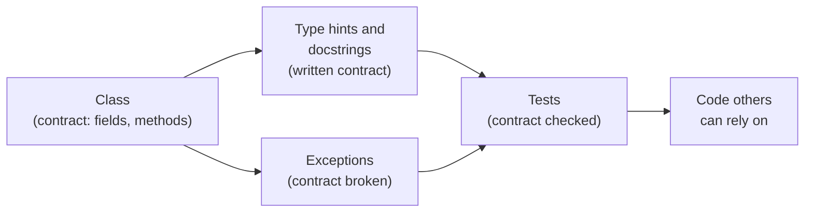
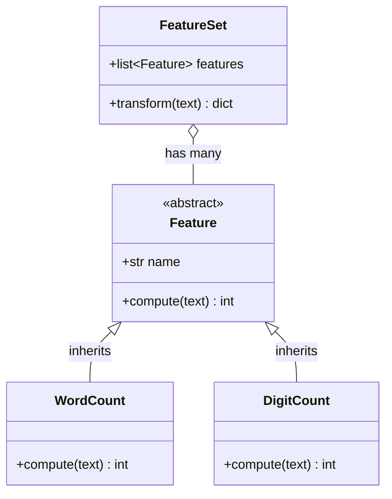
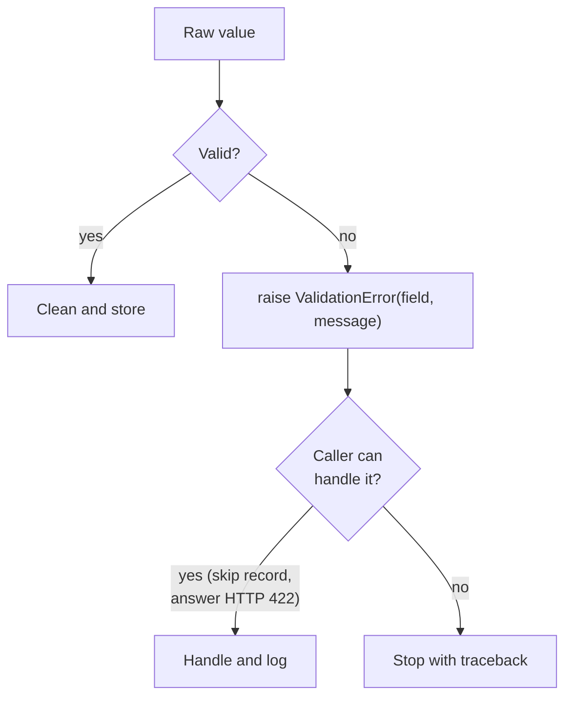
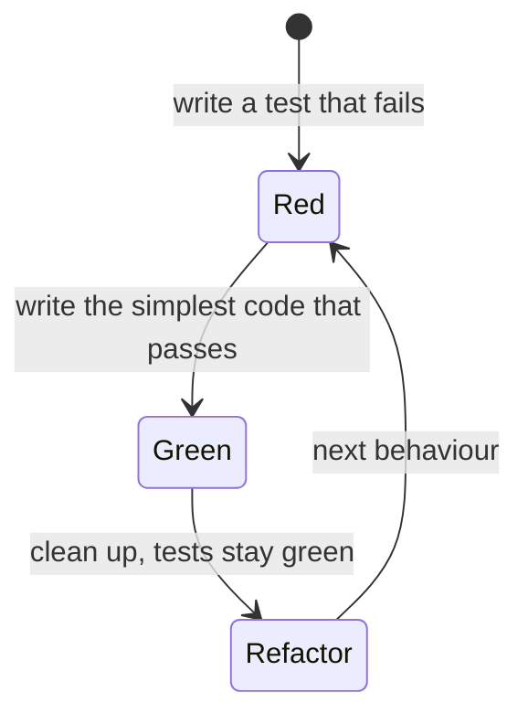

# Object-oriented programming, errors and tests

This page covers the first block of Session 2. Session 1 introduced classes, objects, attributes and methods. Here we use them in practice: how classes are combined (composition and inheritance), how dataclasses remove boilerplate, how type hints and docstrings document a contract, how exceptions report broken contracts, and how automated tests with pytest check that the code keeps its promises. The running example is a class that validates and cleans one Airbnb listing of the course case study, `ListingRecord`, in the [workspace](../workspace/README.md). The raw file of Inside Airbnb stores the price as text (`"$1,083.00"`), and nothing stops a row from having coordinates outside Berlin or an unknown room type; a class that checks every listing once, when it is created, protects all code that uses it.



## Object-oriented programming in practice

### Concept

A **class** bundles data (**attributes**) and behaviour (**methods**). Two ways of building larger classes from smaller ones:

- **Composition** ("has a"): an object holds other objects as attributes and delegates work to them. A `FeatureSet` *has* a list of features; the weather client of the workspace *has* an HTTP client.
- **Inheritance** ("is a"): a **subclass** takes over all attributes and methods of its **base class** (or parent) and adds or replaces some. `DigitCount` *is a* `Feature`. Replacing a method of the parent is called **overriding**. Code that works with `Feature` objects works with every subclass: this is **polymorphism**.

A **dataclass** is a class whose main purpose is to hold data. The decorator `@dataclass` reads the annotated class attributes (the **fields**) and writes `__init__`, `__repr__` and `__eq__` automatically. The special method `__post_init__` runs right after `__init__` and is the place to check and clean the fields. `frozen=True` makes the objects read-only.

A small example by hand: `FeatureSet([WordCount(), DigitCount()])` applied to the listing title `"Cosy flat, 45 m²"` asks each feature in turn: four words, two digits (the ² is not a digit), so the result is `{"n_words": 4, "n_digits": 2}`.



### Why it matters

Composition keeps classes small and replaceable: the HTTP client inside the weather client can be swapped for a fake one in tests. Inheritance lets many classes share one interface, so that the code that uses them does not need to know which one it has. Dataclasses make data-holding classes short enough to read at a glance. Used carelessly, deep inheritance trees become hard to follow; a common rule is *prefer composition, inherit only for a true "is a" relation*.

### How it works in Python

```python
from abc import ABC, abstractmethod
from dataclasses import dataclass, field


class Feature(ABC):
    """Base class: a feature turns one text into one number."""

    name = "feature"

    @abstractmethod
    def compute(self, text: str) -> int:   # every subclass must implement this
        ...


class WordCount(Feature):                  # inheritance: WordCount is a Feature
    name = "n_words"

    def compute(self, text: str) -> int:   # overrides the abstract method
        return len(text.split())


class DigitCount(Feature):
    name = "n_digits"

    def compute(self, text: str) -> int:
        return sum(c in "0123456789" for c in text)


@dataclass
class FeatureSet:                          # composition: a FeatureSet has features
    features: list[Feature] = field(default_factory=list)

    def transform(self, text: str) -> dict[str, int]:
        return {f.name: f.compute(text) for f in self.features}   # polymorphism


features = FeatureSet([WordCount(), DigitCount()])
print(features.transform("Cosy flat, 45 m²"))  # {'n_words': 4, 'n_digits': 2}
print(isinstance(WordCount(), Feature))        # True
try:
    Feature()                                  # an abstract class cannot be instantiated
except TypeError as err:
    print("TypeError:", str(err).split(" with")[0])   # TypeError: Can't instantiate abstract class Feature


@dataclass
class Listing:
    """A dataclass: __init__, __repr__ and __eq__ are generated from the fields."""

    id: int
    room_type: str
    name: str = ""

    def __post_init__(self) -> None:           # runs after the generated __init__
        self.name = " ".join(self.name.split())


flat = Listing(3176, "Entire home/apt", "  Fabulous   Flat ")
print(flat)                                    # Listing(id=3176, room_type='Entire home/apt', name='Fabulous Flat')
print(flat == Listing(3176, "Entire home/apt", "Fabulous Flat"))   # True: fields are compared
```

### In practice

- scikit-learn builds every model on the base class `BaseEstimator` and small "mixin" classes (`ClassifierMixin`, `TransformerMixin`). Because all models share `fit` and `predict`, a `Pipeline` can combine any of them: composition and inheritance together.
- Python's `dataclasses` module (PEP 557, Python 3.7) is widely used for configuration and record types; the library pydantic, used by FastAPI, extends the same idea with automatic type conversion and validation.

> [!WARNING]
> A mutable default such as `features: list = []` in a dataclass raises `ValueError` (in a normal function default it would be silently shared between all calls). Use `field(default_factory=list)`.

> [!TIP]
> Before you write a subclass, ask whether "B is an A" is true in the domain. A `ListingTable` *has* listings; it is not a kind of listing. When in doubt, use composition.

The workbooks [01-classes-and-objects.ipynb](../workbooks/01-classes-and-objects.ipynb) (composition, equivalence, copying) and [02-inheritance.ipynb](../workbooks/02-inheritance.ipynb) (*Think Python*) practise both patterns with exercises.

## Type hints and docstrings

### Concept

A function or class is a **contract**: given inputs of a stated kind, it returns an output with a stated meaning. The contract is written down in two places.

- **Type hints** state the types of parameters, return values and fields: `def n_words(text: str) -> int`. Common forms: `list[str]`, `dict[str, int]`, `tuple[int, int]`, `str | None` (text or nothing), `Callable[[float], None]`. Python does **not** check them when the code runs. Editors use them for completion and warnings; **type checkers** such as mypy or ty check them without running the code.
- A **docstring** is the string literal on the first line of a module, class or function. It explains what the code does, its arguments, its result, the exceptions it raises and an example. `help(function)` and editors display it; documentation generators build web pages from it. The workspace uses the *Google style* (`Args:`, `Returns:`, `Raises:`).

### Why it matters

Hints and docstrings tell a teammate (and an AI assistant) how to call the code without reading its body. Type checkers catch a class of bugs before any test runs, for example passing a whole DataFrame where one title is expected. In code review, a missing or wrong docstring is as much a defect as a wrong line.

### How it works in Python

```python
def share_with(texts: list[str], char: str = "!") -> float | None:
    """Share of texts that contain ``char``.

    Args:
        texts: listing titles.
        char: the character to look for.

    Returns:
        A share between 0 and 1, or None if ``texts`` is empty.
    """
    if not texts:
        return None
    return sum(char in t for t in texts) / len(texts)


print(share_with(["Best view!", "Quiet room"]))   # 0.5
print(share_with([]))                          # None
print(share_with.__annotations__["return"])    # float | None
print(share_with.__doc__.splitlines()[0])      # Share of texts that contain ``char``.
try:
    share_with(["Best view!"], char=5)         # the hint says str; Python does not stop the call
except TypeError as err:
    print("TypeError:", err)                   # TypeError: 'in <string>' requires string as left operand, not int
```

Checking the hints statically, without running the code:

```bash
uvx ty check src/          # or: uvx mypy src/
```

### In practice

- pandas, NumPy and scikit-learn document every public function in the *NumPy docstring style*; their online API reference is generated from these docstrings.
- Dropbox added type hints to about four million lines of Python and checks them with mypy; the company described the migration in "Our journey to type checking 4 million lines of Python" (2019).

> [!NOTE]
> `from __future__ import annotations` at the top of a module (used in the workspace) stores hints as text and allows the newer syntax such as `str | None` on older Python versions.

> [!CAUTION]
> A hint is a promise, not a check. `price: float` does not stop someone from passing the text `"$85"` from the raw file; `price + 10` then raises a `TypeError`, and `price * 2` silently gives `"$85$85"`. Values that come from outside (files, forms, APIs) must be checked explicitly, which is the job of the validation in `__post_init__`.

## Exceptions and error handling

### Concept

An **exception** is Python's signal that an operation cannot be completed. Built-in examples: `ValueError` (right type, wrong value), `TypeError` (wrong type), `KeyError` (missing key), `FileNotFoundError`. If nothing handles an exception, the program stops and prints a **traceback**: the chain of calls that led to the error. Read it from the bottom: the last line names the exception and its message.

- `raise ValueError("message")` signals a broken contract deliberately.
- `try: … except ValueError as err: …` **handles** an expected exception; `else:` runs if no exception occurred; `finally:` always runs (for example to close a file).
- Exceptions are classes and form a hierarchy. Defining your own subclasses, such as `ValidationError(ListingToolsError, ValueError)`, lets callers catch exactly what they can handle.
- `raise NewError(...) from err` keeps the original cause in the traceback.

Two styles: *Look before you leap* (LBYL) checks first (`if key in d:`); *Easier to ask forgiveness than permission* (EAFP) tries and handles the exception. Python code often uses EAFP for conversions such as `int(value)`.



### Why it matters

A clear error at the place where the problem occurs saves hours compared with a wrong number found weeks later in a chart. Silent failures are worse than crashes because they produce plausible results. Catching every exception with a bare `except:` hides programming errors.

### How it works in Python

```python
class ListingToolsError(Exception):
    """Base class of the package's errors."""


class ValidationError(ListingToolsError, ValueError):
    """A record breaks a rule; also a ValueError for callers that expect one."""

    def __init__(self, field: str, message: str) -> None:
        self.field = field
        super().__init__(f"{field}: {message}")


def parse_price(value: object) -> float:
    """Parse a price as written in the raw Inside Airbnb file: "$1,083.00"."""
    text = str(value).strip().lstrip("$").replace(",", "")
    try:
        price = float(text)                                         # EAFP
    except ValueError as err:
        raise ValidationError("price", f"expected a price such as $85.00, got {value!r}") from err
    if not price > 0:
        raise ValidationError("price", f"must be above 0, got {price}")
    return price


good, bad = [], []
for raw in ["$160.71", "85 EUR", "$1,083.00", "$0.00", "$97.33"]:
    try:
        price = parse_price(raw)
    except ValidationError as err:               # handle only the error we expect
        bad.append((err.field, str(err)))
    else:
        good.append(price)

print(good)        # [160.71, 1083.0, 97.33]
print(bad[0])      # ('price', "price: expected a price such as $85.00, got '85 EUR'")
print(bad[1])      # ('price', 'price: must be above 0, got 0.0')
```

### In practice

- In 2020, Public Health England failed to report about 16,000 positive COVID-19 test results because a data pipeline stored them in the old Excel format (`.xls`), whose limit of 65,536 rows silently cut the data. A pipeline that raised an error on truncation would have stopped instead of under-reporting.
- scikit-learn raises `ValueError: Input X contains NaN` instead of fitting a model on missing values; the message names the problem and the fix.

> [!WARNING]
> Never write `except: pass` or `except Exception: pass`. It hides typing mistakes (`NameError`) together with the error you meant to catch. Catch specific exceptions and do something meaningful: skip and count the record, log it, or re-raise with a clearer message.

## Automated tests with pytest

### Concept

A **unit test** is a small function that calls the code with a known input and asserts the expected output. **pytest** finds files named `test_*.py`, runs every function whose name starts with `test_`, and reports each as passed, failed or skipped.

- `assert expression` fails the test if the expression is false; pytest shows the values involved.
- `@pytest.mark.parametrize("x, expected", [...])` runs one test for many cases, each reported separately.
- A **fixture** (`@pytest.fixture`) prepares data for tests; a test receives it by naming it as a parameter. Fixtures in `conftest.py` are available to all test files. `tmp_path` is a built-in fixture giving a fresh temporary folder.
- `with pytest.raises(ValidationError):` checks that the code raises the expected exception.
- `@pytest.mark.skip` skips a test (the workspace uses it for exercises).

Good tests are **small** (one behaviour each), **independent** (no shared state, any order), **fast** and **deterministic** (no network, no randomness without a seed). They cover normal cases, **edge cases** (empty text, a price with a thousands separator, a listing exactly on the city boundary) and invalid input.



This cycle is called **test-driven development** (TDD). You do not have to follow it strictly, but writing the test first makes you decide what "correct" means before you write the code.

### Why it matters

Tests turn "it worked when I tried it" into a check that runs on every change, on every computer and, with continuous integration (block 3), on every pull request. They make it safe to change shared code, and they document the expected behaviour by example.

### How it works in Python

Save as `test_price.py` and run `uv run --with pytest pytest -q test_price.py`, or run the file directly with Python (the last two lines start pytest):

```python
import pytest


def price_to_number(text: str) -> float:
    if not isinstance(text, str):
        raise ValueError(f"expected a price as text, got {text!r}")
    try:
        return float(text.strip().lstrip("$").replace(",", ""))
    except ValueError:
        raise ValueError(f"expected a price as text, got {text!r}") from None


@pytest.fixture
def raw_prices() -> list[str]:
    return ["$160.71", "$1,083.00", "$49.00"]


def test_prices_of_fixture(raw_prices):
    assert [price_to_number(p) for p in raw_prices] == [160.71, 1083.0, 49.0]


@pytest.mark.parametrize(("text", "expected"), [("$0.50", 0.5), (" $85 ", 85.0), ("$10,025.00", 10025.0)])
def test_edge_cases(text, expected):
    assert price_to_number(text) == expected


@pytest.mark.parametrize("text", ["", "abc", "85 EUR", None, 85])
def test_malformed_price_raises(text):
    with pytest.raises(ValueError, match="expected a price"):
        price_to_number(text)


if __name__ == "__main__":
    raise SystemExit(pytest.main([__file__, "-q"]))   # 9 passed
```

In the workspace, tests live in `tests/` and import the package: `from listingtools import ListingRecord`. Run them with `uv run pytest -q` in the workspace folder.

### In practice

- NumPy, pandas and scikit-learn use pytest; their test suites run in continuous integration on every pull request before a maintainer merges it.
- In 2013, a reproduction by Herndon, Ash and Pollin found a spreadsheet formula error in an influential economics paper (Reinhart and Rogoff 2010) that had excluded several countries from an average. Automated checks of the computation against hand-computed cases are designed to catch exactly this kind of error.

> [!CAUTION]
> A test that never fails is worthless. After writing a test, break the code on purpose (or change the expected value) and check that the test fails.

> [!TIP]
> When you fix a bug, first write a test that reproduces it. The test fails, you fix the code, the test passes, and the bug can never come back unnoticed (a **regression test**).

## Practice: a class that validates and cleans one listing

Work in the [workspace](../workspace/README.md), exercises 1 and 2:

1. Read `src/listingtools/records.py`: which fields does `ListingRecord` have, which rules does `__post_init__` apply (price stored as text becomes a number, coordinates inside Berlin's bounding box, room type one of the four known values, `accommodates` at least 1), and what does `from_dict` add?
2. Run `uv run pytest -q tests/test_records.py` and read one parametrized test.
3. Complete the TODO: `maximum_nights` is optional, but if present it must not be smaller than `minimum_nights`; the raw file's sentinel 2,147,483,647 means "no limit". Activate the two tests of `maximum_nights`.
4. Add two tests of your own for rules that are not yet tested.

```python
import sys

sys.path.insert(0, "sessions/02-software-engineering/workspace/src")   # uv run in the workspace does this
from listingtools import ListingRecord, ValidationError

raw = {"id": "3176", "name": " Fabulous  Flat ", "neighbourhood_group_cleansed": "Pankow",
       "latitude": "52.53574", "longitude": 13.41734, "room_type": "entire home/apt",
       "accommodates": 2, "price": "$1,160.50", "minimum_nights": "2"}
record = ListingRecord.from_dict(raw)
print(record.id, record.name, record.district, record.room_type)
# 3176 Fabulous Flat Pankow Entire home/apt
print(record.price, record.price_per_guest, record.is_short_stay)   # 1160.5 580.25 True
try:
    ListingRecord.from_dict({**raw, "latitude": 48.137})            # Munich
except ValidationError as err:
    print(err.field, "|", err)   # latitude | latitude: 48.137 lies outside Berlin (52.33 to 52.68)
```

## Check your understanding

1. The weather client holds an `httpx.Client` as an attribute. Is this composition or inheritance, and why does it make testing easier?
2. What does `@dataclass` generate, and what is `__post_init__` for?
3. A function has the hint `price: float`. What happens when it is called with the text `"$85.00"`?
4. Why does `ValidationError` inherit from both `ListingToolsError` and `ValueError`?
5. Name three kinds of cases a good set of tests for `parse_price` should contain.

## Further reading

- Downey, A. B. (2024). *Think Python*, 3rd edition, chapters 16–17 (classes and objects, inheritance). Free online, CC BY-NC-SA 4.0. https://allendowney.github.io/ThinkPython/
- The Carpentries Incubator (2024). *Intermediate Research Software Development in Python*, section 2 (testing) and section 3 (software design). CC-BY 4.0. https://carpentries-incubator.github.io/python-intermediate-development/
- Python Software Foundation (2026). *dataclasses — Data Classes*. https://docs.python.org/3/library/dataclasses.html
- pytest developers (2026). *Get started*; *How to parametrize fixtures and test functions*. https://docs.pytest.org/en/stable/getting-started.html
