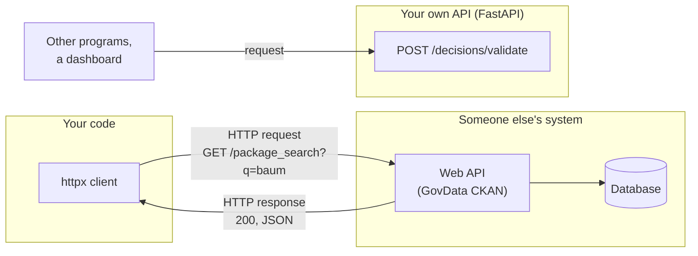
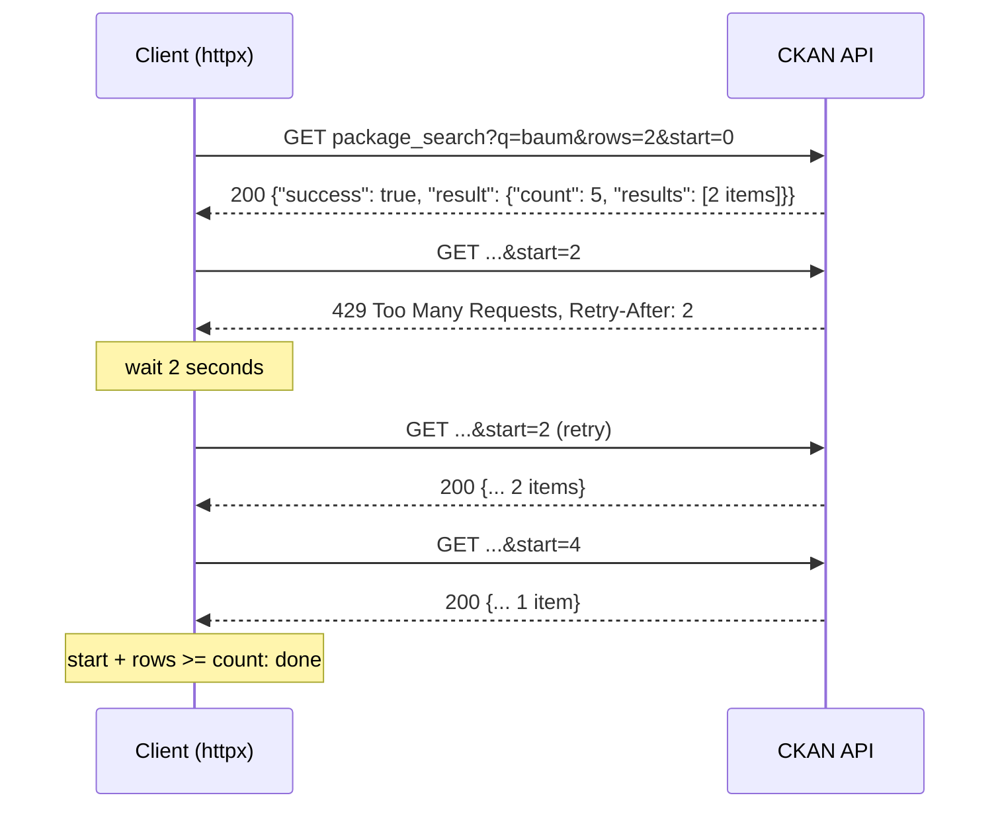
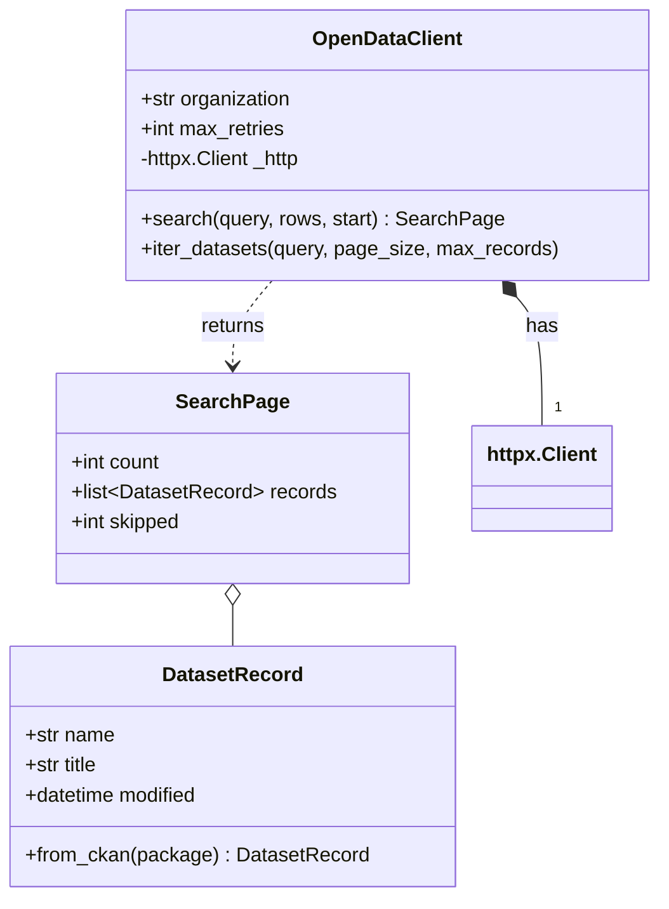
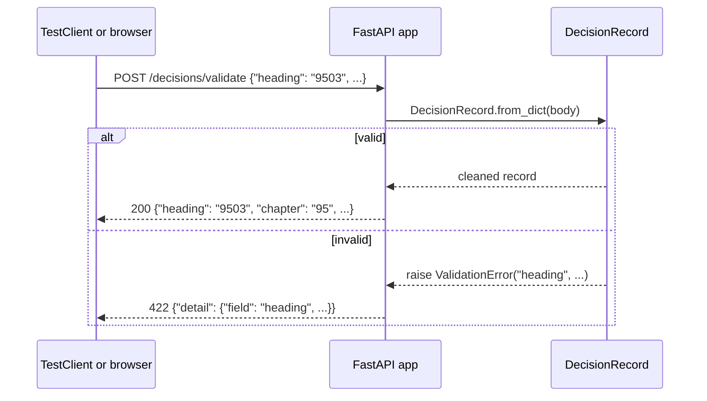

# Web APIs: requesting data and serving it

This page covers the second block of Session 2. Much of the data used in practice does not come as a file but from another system, through an interface. The page explains what an API is and how web APIs work, the parts of an HTTP request and response, the JSON format, authentication, pagination and rate limits. It then shows how to request data with the library httpx, how to test such code without a network, and how to build a minimal API of one's own with FastAPI. Session 16 turns that API into a model service. The running example is the open-data client of the [workspace](../workspace/README.md), which requests dataset descriptions from GovData, the German national open-data portal.



## What an API is and how web APIs work

### Concept

An **API** (application programming interface) is a defined way for one program to use another: which requests are possible, what they must contain and what comes back. You already use APIs: `pd.read_parquet` is part of the pandas API. A **web API** is an API that is used over the network with **HTTP**, the protocol of the web.

- The program that asks is the **client**; the program that answers is the **server**.
- Each operation has an **endpoint**: a URL such as `https://ckan.govdata.de/api/3/action/package_search`.
- Most data APIs follow the **REST** style: URLs name resources (`/datasets/42`), HTTP methods name actions (`GET` reads, `POST` creates or submits), and responses are usually **JSON**.
- An API is a **contract**: the provider documents it, and clients rely on it not changing without notice. Changes are announced with a new **version** (`/api/3/`).

### Why it matters

APIs give access to data that is current and too large or too changing to download as a file: public statistics, weather, transport, prices, a company's own systems. Data roles in Berlin job advertisements list APIs in about one in five postings. On the other side, an API is how a model or an analysis becomes usable by other software (Session 16).

### In practice

- **GovData** and the **Berlin open-data portal** run CKAN, an open-source data catalogue whose *Action API* answers every request with JSON. The project topics of this course (for example on street trees, construction or air quality) start from such portals.
- **Open-Meteo** offers weather forecasts and history as a JSON API without a key; the German Weather Service (DWD) publishes its open data through an API used by many apps.
- Nearly every SaaS product used in companies (CRM, ticketing, payment) exposes a REST API, which analysts use to pull data into reports.

> [!NOTE]
> Not every website is an API. Pages written for people return HTML and may block scripts; a documented API returns structured data and states its terms of use. The Berlin portal `daten.berlin.de` currently answers scripts with a browser check, which is why the workspace uses the GovData copy of the same catalogue.

## HTTP requests and responses, JSON, authentication, pagination and rate limits

### Concept

An **HTTP request** has a **method** (`GET`, `POST`, `PUT`, `DELETE`), a **URL** with optional **query parameters** after `?` (`?q=baum&rows=2`), **headers** (metadata such as `User-Agent`, `Accept: application/json`, `Authorization`) and, for `POST`, a **body**. An **HTTP response** has a **status code**, headers and a body.

| Status | Meaning | Typical reaction of the client |
|---|---|---|
| 200 OK | Success | Parse the body |
| 201 Created | Resource created | Read its id |
| 400 Bad Request, 422 Unprocessable | Request invalid | Fix the request; do not retry |
| 401 Unauthorized, 403 Forbidden | Missing or insufficient credentials | Check the key |
| 404 Not Found | Wrong URL or resource | Check the endpoint |
| 429 Too Many Requests | Rate limit reached | Wait (`Retry-After`), then retry |
| 500, 502, 503 | Server error | Retry later, with a limit |

**JSON** (JavaScript Object Notation) is the text format of most APIs. It has objects `{"key": value}`, arrays `[...]`, strings, numbers, `true`/`false` and `null`; Python's `json` module turns them into `dict`, `list`, `str`, `int`/`float`, `bool` and `None`.

**Authentication** proves who is asking. Common forms: an **API key** sent in a header (`Authorization: <key>` or `X-API-Key: <key>`) or as a parameter; a **bearer token** obtained by a login flow (OAuth 2.0), sent as `Authorization: Bearer <token>`. Public open data usually needs none.

**Pagination** splits a long result into pages. CKAN uses *offset pagination*: `rows` is the page size and `start` the offset of the first result; the response states the total `count`. Other APIs use page numbers (`page=3`) or a *cursor* (an opaque token for "the next page").

A **rate limit** caps the number of requests per time window. If it is exceeded, the server answers `429` and often a `Retry-After` header with the number of seconds to wait.



A worked example by hand: with `count = 57` matching datasets and `rows = 20`, the client needs pages with `start = 0, 20, 40`; the last page has 17 results; three requests in total.

### Why it matters

Each part has its failure mode. Ignoring status codes means parsing an error page as data. Ignoring pagination means analysing only the first 10 results of 57 without noticing. Ignoring rate limits gets a script blocked. Keys committed to Git are found by automated scanners within minutes.

### How it works in Python

```python
import json
import math

# A CKAN response, shortened. json.loads turns text into dicts and lists.
text = """{"success": true,
           "result": {"count": 57,
                      "results": [{"name": "baumkataster", "title": "Baumkataster",
                                   "num_resources": 2, "tags": [{"name": "bäume"}]}]}}"""
payload = json.loads(text)
print(type(payload).__name__, payload["success"])           # dict True
first = payload["result"]["results"][0]
print(first["title"], [t["name"] for t in first["tags"]])   # Baumkataster ['bäume']

# Pagination: how many requests for all results?
count, rows = payload["result"]["count"], 20
starts = list(range(0, count, rows))
print(starts, math.ceil(count / rows))                     # [0, 20, 40] 3

# Authentication: read keys from the environment, never write them into code
import os

token = os.environ.get("CKAN_API_TOKEN")                   # None if not set
headers = {"User-Agent": "htw-course-example/0.1"}
if token:
    headers["Authorization"] = token
print(sorted(headers))                                     # ['User-Agent']
```

### In practice

- The **GitHub REST API** allows 60 requests per hour without authentication and 5,000 with a token, and reports the remaining quota in the headers `x-ratelimit-remaining` and `x-ratelimit-reset`.
- **Wikimedia** asks every client to send a descriptive `User-Agent` with contact information and may block clients that do not.
- The **Deutsche Bahn API Marketplace** issues a client id and an API key per application; requests without them are rejected with `401`.

> [!CAUTION]
> Never put API keys, tokens or passwords into code, notebooks or Git. Store them in environment variables or in a `.env` file that is listed in `.gitignore`. A key that was committed once must be revoked, even if the commit is deleted later.

> [!WARNING]
> Retry only what can succeed later (`429`, `5xx`, timeouts), with a maximum number of attempts and a growing wait (*exponential backoff*). Retrying `400` or `404` in a loop only adds load.

## Requesting data with httpx

### Concept

**httpx** is a Python library for HTTP. `httpx.get(url, params=...)` sends one request; an `httpx.Client` keeps settings (base URL, headers, timeout) and reuses connections across many requests. `response.status_code`, `response.headers`, `response.json()` and `response.raise_for_status()` read the response. A **timeout** limits how long to wait; httpx uses 5 seconds by default.

For tests, a **transport** decides how requests are sent. `httpx.MockTransport(handler)` replaces the network with a Python function that receives the request and returns a prepared response. Tests then run offline, fast and deterministically, and can simulate errors (500, 429) that are hard to provoke on a real server.

The workspace wraps this in a class, `OpenDataClient`, that *has* an `httpx.Client` (composition) and adds CKAN-specific work: building parameters, retrying after `429`, raising `APIError` for error responses and parsing each result into a validated `DatasetRecord`.



### Why it matters

A small client class keeps the details of one API in one place; the analysis code only calls `client.search("baum")`. Mocked tests check the parsing and error handling on every change without depending on the server being up, which is also what continuous integration needs.

### How it works in Python

A live request (requires internet access):

```python
import httpx

# requires internet access
response = httpx.get(
    "https://ckan.govdata.de/api/3/action/package_search",
    params={"q": "baum", "rows": 2, "fq": "organization:berlin-open-data"},
    headers={"User-Agent": "htw-course-example/0.1"},
    timeout=10,
)
response.raise_for_status()                       # raises httpx.HTTPStatusError for 4xx/5xx
print(response.status_code, response.headers["content-type"])   # 200 application/json...
result = response.json()["result"]
print(result["count"], [p["title"] for p in result["results"]])
```

The same logic, tested offline with a mock transport:

```python
import httpx


def handler(request: httpx.Request) -> httpx.Response:
    """Plays the server: answers 429 once, then one page of results."""
    handler.calls += 1
    if handler.calls == 1:
        return httpx.Response(429, headers={"Retry-After": "0"})
    rows, start = int(request.url.params["rows"]), int(request.url.params["start"])
    names = [f"d{i}" for i in range(5)][start : start + rows]
    return httpx.Response(200, json={"success": True, "result": {"count": 5, "results": names}})


handler.calls = 0
client = httpx.Client(base_url="https://example.org/api/3/action/",
                      transport=httpx.MockTransport(handler))

collected, start = [], 0
while True:
    response = client.get("package_search", params={"rows": 2, "start": start})
    if response.status_code == 429:               # rate limit: wait Retry-After seconds, retry
        continue
    result = response.json()["result"]
    collected += result["results"]
    start += 2
    if start >= result["count"]:
        break

print(collected)          # ['d0', 'd1', 'd2', 'd3', 'd4']
print(handler.calls)      # 4: one 429 and three pages
```

With the workspace class, the whole search is one call (run from the repository root; requires internet access):

```python
import sys

sys.path.insert(0, "sessions/02-software-engineering/workspace/src")
from btitools.opendata import OpenDataClient

# requires internet access
with OpenDataClient() as client:                  # Berlin datasets on GovData, no key needed
    page = client.search("baum", rows=5)
print(page.count, len(page.records), page.skipped)
print(page.records[0].title, page.records[0].modified.date())
```

### In practice

- The **Python Package Index** (PyPI) offers a JSON API (`https://pypi.org/pypi/<name>/json`) that tools such as uv use to find package versions.
- httpx is used by the OpenAI and Anthropic Python SDKs as their HTTP layer, so the same timeout and transport concepts apply when calling language models (Sessions 14–15).

> [!WARNING]
> Always set a timeout and check the status before parsing. `response.json()` on an HTML error page raises an exception that hides the real cause (the status code).

> [!NOTE]
> FastAPI's `TestClient` (see below) uses **httpx2** in recent Starlette versions, a continuation of httpx maintained by the Pydantic team with the same interface. The workspace lists it as a development dependency; your own client code can keep using `httpx`.

The workbook [03-case-study-open-data-api.ipynb](../workbooks/03-case-study-open-data-api.ipynb) walks through a live request, pagination and parsing step by step.

## A minimal API of one's own with FastAPI

### Concept

**FastAPI** is a Python library for building web APIs. A function becomes an endpoint with a **decorator** such as `@app.get("/health")`. Function parameters become **path parameters** (`/headings/{heading}`), **query parameters** (`/features?text=...`) or the request **body**; their type hints are used to convert and validate the input automatically (with the library pydantic) and to generate interactive documentation at `/docs` (OpenAPI). Returned dictionaries are sent as JSON.

A web **server** such as **uvicorn** runs the app and listens for requests: `uv run uvicorn btitools.api:app --reload`. In tests, `fastapi.testclient.TestClient(app)` calls the app directly, without a server.



### Why it matters

An API turns code into a service that any program can use, in any language, without installing Python packages: a dashboard, a mobile app, a colleague's script. The same validation class used in the notebook now protects the service from bad input. Session 16 adds a prediction endpoint and deploys it.

### How it works in Python

```python
from typing import Annotated

from fastapi import FastAPI, HTTPException, Path
from fastapi.testclient import TestClient

app = FastAPI(title="Mini tariff API")
HEADINGS = {"9503": "Toys, scale models, puzzles", "6404": "Footwear with textile uppers"}


@app.get("/health")
def health() -> dict[str, str]:
    return {"status": "ok"}


@app.get("/headings/{heading}")
def heading(heading: Annotated[str, Path(pattern=r"^\d{4}$")]) -> dict[str, str]:
    if heading not in HEADINGS:
        raise HTTPException(status_code=404, detail=f"unknown heading {heading}")
    return {"heading": heading, "chapter": heading[:2], "description": HEADINGS[heading]}


@app.post("/decisions")
def submit(decision: dict) -> dict[str, object]:
    if not str(decision.get("description", "")).strip():
        raise HTTPException(status_code=422, detail="description must not be empty")
    return {"accepted": True, "n_words": len(decision["description"].split())}


client = TestClient(app)                          # no server needed
print(client.get("/health").json())               # {'status': 'ok'}
print(client.get("/headings/9503").json())
# {'heading': '9503', 'chapter': '95', 'description': 'Toys, scale models, puzzles'}
print(client.get("/headings/1234").status_code)   # 404: well-formed, but not known
print(client.get("/headings/95").status_code)     # 422: rejected by the pattern of four digits
print(client.post("/decisions", json={"description": "Plush toy"}).json())   # {'accepted': True, 'n_words': 2}
print(client.post("/decisions", json={"description": " "}).status_code)      # 422
```

Run this example with `uv run --with fastapi --with httpx python example.py`. The workspace app in `src/btitools/api.py` has the endpoints `/health`, `/headings`, `/headings/{heading}` (from a small extract of the nomenclature), `POST /decisions/validate` and `/features`; its tests are in `tests/test_api.py`.

### In practice

- FastAPI is used for internal and public services by companies such as Microsoft, Uber and Netflix, according to the testimonials collected in its documentation; its automatic OpenAPI documentation is a main reason.
- ML model serving frameworks such as BentoML and many cloud tutorials for deploying scikit-learn models use FastAPI or a similar HTTP layer: the model is loaded once, and each request to `/predict` returns a prediction as JSON.

> [!WARNING]
> `--reload` restarts the server on every code change and is for development only. Do not start a server inside a notebook cell or a test; use `TestClient` in tests.

> [!TIP]
> Open `http://127.0.0.1:8000/docs` while the server runs: FastAPI lists every endpoint with its parameters and lets you send test requests from the browser.

## Practice: request open data, parse it into a validated class, test the parsing

Work in the [workspace](../workspace/README.md), exercises 3 to 5:

1. Request `package_search` with httpx in a Python console and inspect status, headers and the JSON structure.
2. Read `DatasetRecord.from_ckan` and `tests/test_opendata.py`: which broken inputs are tested, and how does `MockTransport` replace the server?
3. Implement pagination in `OpenDataClient.iter_datasets` and activate its test.
4. Start the FastAPI app, try `/docs`, and add a test for a decision without `description`.

## Check your understanding

1. Name the parts of an HTTP request and of a response.
2. An API returns `429` with `Retry-After: 30`. What should a client do, and what should it not do?
3. A search reports `count = 57`; the page size is 25. Which values of `start` are requested?
4. Why do the workspace tests use `httpx.MockTransport` instead of the real portal?
5. In the FastAPI app, where does the validation of a decision happen, and what does the client receive when it fails? Why does `/headings/1234` answer 404 but `/headings/95` 422?

## Further reading

- Encode / httpx contributors (2026). *HTTPX documentation: Quickstart; Transports (MockTransport)*. https://www.python-httpx.org/
- Ramírez, S. (2026). *FastAPI tutorial: First steps; Testing*. https://fastapi.tiangolo.com/tutorial/
- CKAN Association (2026). *CKAN API guide*. https://docs.ckan.org/en/latest/api/
- Mozilla (2026). *MDN Web Docs: An overview of HTTP; HTTP response status codes*. https://developer.mozilla.org/en-US/docs/Web/HTTP
