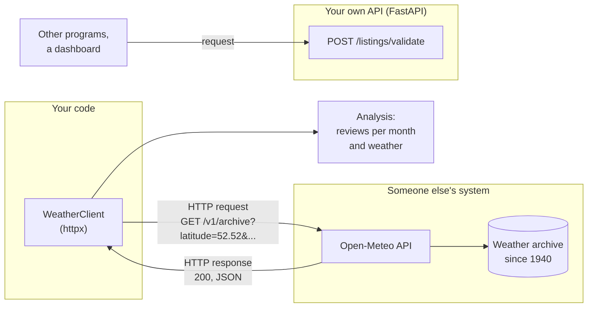
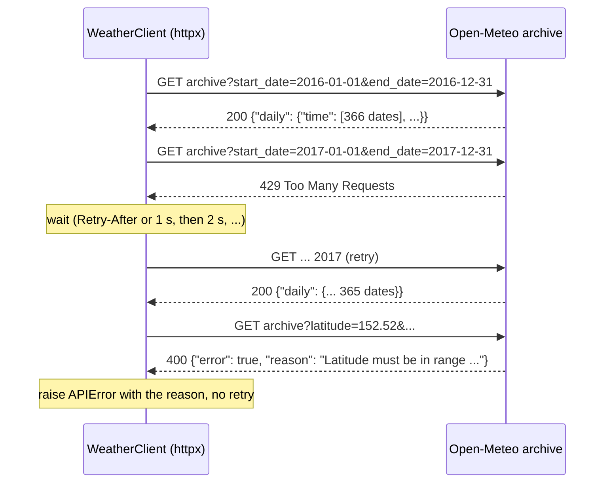
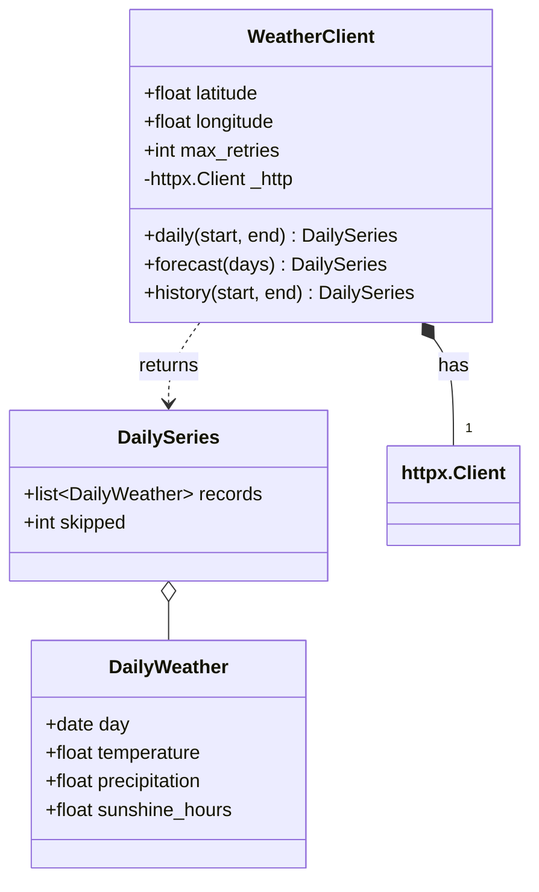
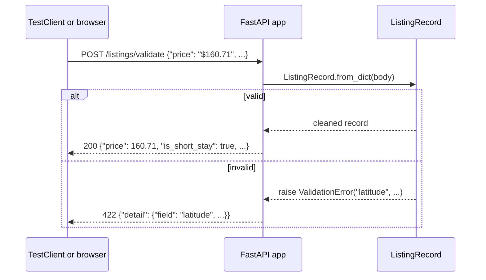

# Web APIs: requesting data and serving it

This page covers the second block of Session 2. It starts with a practical question: **does the weather explain how busy Berlin's Airbnb market is?** The listings and their reviews come as files, but the weather changes every day and is not shipped as a file; the provider Open-Meteo offers it through a web API. The page explains why analysts need APIs, what an API is and how web APIs work, the parts of an HTTP request and response, the JSON format, authentication, pagination, rate limits, timeouts and retries. It then shows how to request data with the library httpx, how to test such code without a network, and how to build a minimal API of one's own with FastAPI. Session 12 uses the same weather data in the demand forecast; Session 16 turns the API of one's own into a model service. The running example is the weather client of the [workspace](../workspace/README.md).



## Why analysts need APIs

### Concept

Some data arrive as files: the Inside Airbnb snapshot is a set of CSV files, published every quarter. Other data change every day or every minute, depend on what you ask for, or are too large to download as a whole. Their providers do not publish files; they answer questions. Weather is a typical case: Open-Meteo holds hourly values for every point on Earth since 1940, and nobody wants that as one file. You ask for exactly the days, the place and the variables you need, for example the daily mean temperature, rain and sunshine in Berlin from 2016 to today.

The question of the session is a real one for anyone who plans with demand: hosts, Airbnb itself, the city's tourism office. Do guests book (and later review) more in warm, sunny months, and does rain keep them away? To answer it, the monthly reviews of the listings (the course's measure of demand) must be put next to the weather of the same months. The weather has to be fetched.

### Why it matters

Without an API, an analyst copies numbers by hand from a website, which is slow, error-prone and impossible to repeat next month. With an API, the same small program fetches today's data tomorrow again, and the analysis can be rerun at any time. Data roles in Berlin job advertisements list APIs in about one in five postings (Session 1).

### In practice

- **Open-Meteo** (open-source, operated from Switzerland) provides weather forecasts and history for any location as a JSON API without a key for non-commercial use; the German Weather Service (DWD) publishes its open data in the same way.
- Retail and travel companies add weather to their demand forecasts: rain on a Saturday changes what people buy and where they go. Session 12 tests whether it helps for Berlin's Airbnb demand.
- **VBB**, Berlin's public transport association, publishes departures and delays; a community-run API (`v6.vbb.transport.rest`) makes them available as JSON. The [workbook](../workbooks/03-case-study-weather-api.ipynb) uses it as an optional extra.

## What an API is and how web APIs work

### Concept

An **API** (application programming interface) is a defined way for one program to use another: which requests are possible, what they must contain and what comes back. You already use APIs: `pd.read_parquet` is part of the pandas API. A **web API** is an API that is used over the network with **HTTP**, the protocol of the web.

- The program that asks is the **client**; the program that answers is the **server**.
- Each operation has an **endpoint**: a URL such as `https://archive-api.open-meteo.com/v1/archive` (past days) or `https://api.open-meteo.com/v1/forecast` (the next days).
- Most data APIs follow the **REST** style: URLs name resources (`/listings/42`), HTTP methods name actions (`GET` reads, `POST` creates or submits), and responses are usually **JSON**.
- An API is a **contract**: the provider documents it, and clients rely on it not changing without notice. Changes are announced with a new **version** (`/v1/`).

A worked example: the request for the first three days of July 2024 in Berlin is one URL. Everything after `?` are **query parameters**, pairs of name and value separated by `&`:

```
https://archive-api.open-meteo.com/v1/archive?latitude=52.52&longitude=13.41
  &start_date=2024-07-01&end_date=2024-07-03
  &daily=temperature_2m_mean,precipitation_sum,sunshine_duration&timezone=Europe%2FBerlin
```

The answer contains three dates and, for each variable, three values: 17.6, 15.1 and 15.1 °C; 7.9, 0.6 and 0.5 mm of rain; 33,379, 20,363 and 32,385 seconds of sunshine (9.3, 5.7 and 9.0 hours).

### Why it matters

An API gives access to data that are current and too large or too changing to download as a file: weather, public statistics, transport, prices, a company's own systems. On the other side, an API is how a model or an analysis becomes usable by other software (Session 16).

### In practice

- The **Python Package Index** (PyPI) offers a JSON API (`https://pypi.org/pypi/<name>/json`) that tools such as uv use to find package versions.
- Nearly every SaaS product used in companies (CRM, ticketing, payment) exposes a REST API, which analysts use to pull data into reports.
- Open-data portals such as **GovData** and the Berlin open-data portal run the catalogue software CKAN, whose API lists the datasets of the portal; data projects often start there.

> [!NOTE]
> Not every website is an API. Pages written for people return HTML and may block scripts; a documented API returns structured data and states its terms of use. Collecting data from pages written for people (*scraping*) is how Inside Airbnb builds its files; it needs care with terms of use and personal data, which is why the course uses its published, cleaned files instead.

## HTTP requests and responses, JSON, authentication, pagination and rate limits

### Concept

An **HTTP request** has a **method** (`GET`, `POST`, `PUT`, `DELETE`), a **URL** with optional query parameters, **headers** (metadata such as `User-Agent`, `Accept: application/json`, `Authorization`) and, for `POST`, a **body**. An **HTTP response** has a **status code**, headers and a body.

| Status | Meaning | Typical reaction of the client |
|---|---|---|
| 200 OK | Success | Parse the body |
| 201 Created | Resource created | Read its id |
| 400 Bad Request, 422 Unprocessable | Request invalid (Open-Meteo: a latitude of 152.52, an end date in the future) | Read the error message, fix the request; do not retry |
| 401 Unauthorized, 403 Forbidden | Missing or insufficient credentials | Check the key |
| 404 Not Found | Wrong URL or resource | Check the endpoint |
| 429 Too Many Requests | Rate limit reached | Wait (`Retry-After`), then retry |
| 500, 502, 503 | Server error | Retry later, with a limit |

**JSON** (JavaScript Object Notation) is the text format of most APIs. It has objects `{"key": value}`, arrays `[...]`, strings, numbers, `true`/`false` and `null`; Python's `json` module turns them into `dict`, `list`, `str`, `int`/`float`, `bool` and `None`. Open-Meteo returns a table *by column*: one array of dates and one array per variable, all of the same length. Errors come as JSON too: `{"error": true, "reason": "Latitude must be in range of -90 to 90°. Given: 152.52."}` with status 400.

**Authentication** proves who is asking. Common forms: an **API key** sent in a header (`Authorization: <key>` or `X-API-Key: <key>`) or as a parameter; a **bearer token** obtained by a login flow (OAuth 2.0), sent as `Authorization: Bearer <token>`. Open-Meteo needs no key for non-commercial use; commercial customers use the server `customer-api.open-meteo.com` and add `&apikey=<key>` to the same requests.

**Pagination** splits a long result into pages. Some APIs use an offset (`start=40&rows=20`), page numbers (`page=3`) or a *cursor* (an opaque token for "the next page"). Open-Meteo has no pages, but the same idea applies: a client splits ten years into ten requests of one year each, so that each answer is small, progress is visible and a failure costs one year, not ten.

A **rate limit** caps the number of requests per time window. Open-Meteo's free API allows fewer than 600 calls per minute, 5,000 per hour and 10,000 per day, and counts a request for more than two weeks of data as several calls: one year of three daily variables counts as about 26 calls. If a limit is exceeded, a server answers `429` and often sends a `Retry-After` header with the number of seconds to wait.

A **timeout** limits how long the client waits for an answer. Without it, a program can hang forever on a server that never responds. A **retry** repeats a request that failed for a reason that may pass (`429`, `5xx`, a timeout), with a maximum number of attempts and a growing wait (*exponential backoff*: 1, 2, 4 seconds).



A worked example by hand: the period from 1 November 2023 to 28 February 2025 splits into three calendar-year requests: 1 November to 31 December 2023 (61 days), all of 2024 (366 days, a leap year) and 1 January to 28 February 2025 (59 days), 486 days in total.

### Why it matters

Each part has its failure mode. Ignoring status codes means parsing an error message as data. Requesting ten years at once and losing the connection after nine means starting again. Ignoring rate limits gets a script blocked for a day. Keys committed to Git are found by automated scanners within minutes.

### How it works in Python

```python
import json
import os

# An Open-Meteo response, shortened. json.loads turns text into dicts and lists.
text = """{"latitude": 52.548, "longitude": 13.408, "timezone": "Europe/Berlin",
           "daily_units": {"time": "iso8601", "temperature_2m_mean": "°C", "sunshine_duration": "s"},
           "daily": {"time": ["2024-07-01", "2024-07-02", "2024-07-03"],
                     "temperature_2m_mean": [17.6, 15.1, 15.1],
                     "precipitation_sum": [7.9, 0.6, 0.5],
                     "sunshine_duration": [33378.58, 20362.5, 32384.95]}}"""
payload = json.loads(text)
daily = payload["daily"]
print(type(payload).__name__, payload["daily_units"]["sunshine_duration"])   # dict s

# Columns to rows: one dictionary per day, sunshine in hours
rows = [
    {"date": d, "temperature": t, "rain": r, "sunshine_hours": round(s / 3600, 1)}
    for d, t, r, s in zip(daily["time"], daily["temperature_2m_mean"],
                          daily["precipitation_sum"], daily["sunshine_duration"], strict=True)
]
print(rows[0])   # {'date': '2024-07-01', 'temperature': 17.6, 'rain': 7.9, 'sunshine_hours': 9.3}

# Error responses are JSON as well
error = json.loads('{"error": true, "reason": "Latitude must be in range of -90 to 90°. Given: 152.52."}')
print(error["error"], error["reason"].split(".")[0])   # True Latitude must be in range of -90 to 90°

# Authentication: read keys from the environment, never write them into code
key = os.environ.get("OPEN_METEO_API_KEY")    # None if not set: use the free API
params = {"latitude": 52.52, "longitude": 13.41}
if key:
    params["apikey"] = key
print(sorted(params))                         # ['latitude', 'longitude']
```

### In practice

- The **GitHub REST API** allows 60 requests per hour without authentication and 5,000 with a token, and reports the remaining quota in the headers `x-ratelimit-remaining` and `x-ratelimit-reset`.
- **Wikimedia** asks every client to send a descriptive `User-Agent` with contact information and may block clients that do not. The workspace client sends `htw-spp-course-listingtools/0.2 (teaching example)`.
- The community-run **VBB API** (`v6.vbb.transport.rest`) allows 100 requests per minute per IP address; its answers are nested JSON (a departure contains a stop, which contains a location), which is good practice for parsing.

> [!CAUTION]
> Never put API keys, tokens or passwords into code, notebooks or Git. Store them in environment variables or in a `.env` file that is listed in `.gitignore`. A key that was committed once must be revoked, even if the commit is deleted later.

> [!WARNING]
> Retry only what can succeed later (`429`, `5xx`, timeouts), with a maximum number of attempts and a growing wait. Retrying `400` or `404` in a loop only adds load: the request will be just as wrong the next time.

## Requesting data with httpx

### Concept

**httpx** is a Python library for HTTP. `httpx.get(url, params=...)` sends one request; an `httpx.Client` keeps settings (headers, timeout) and reuses connections across many requests. `response.status_code`, `response.headers`, `response.json()` and `response.raise_for_status()` read the response. httpx waits 5 seconds by default before it raises `httpx.TimeoutException`; set the timeout explicitly.

For tests, a **transport** decides how requests are sent. `httpx.MockTransport(handler)` replaces the network with a Python function that receives the request and returns a prepared response. Tests then run offline, fast and deterministically, and can simulate errors (400, 429, 503, a timeout) that are hard to provoke on a real server.

The workspace wraps this in a class, `WeatherClient`, that *has* an `httpx.Client` (composition) and adds the work specific to Open-Meteo: building parameters, retrying after `429`, `5xx` and timeouts, raising `APIError` with the server's reason for a bad request, and parsing each day into a validated `DailyWeather` record. Days with a missing value (`null`, for example the most recent days of the archive) are skipped and counted.



### Why it matters

A small client class keeps the details of one API in one place; the analysis code only calls `client.daily(start, end)`. Mocked tests check the parsing and error handling on every change without depending on the server being up, which is also what continuous integration needs.

### How it works in Python

A live request (requires internet access):

```python
import httpx

# requires internet access
response = httpx.get(
    "https://archive-api.open-meteo.com/v1/archive",
    params={"latitude": 52.52, "longitude": 13.41, "start_date": "2024-07-01",
            "end_date": "2024-07-03", "timezone": "Europe/Berlin",
            "daily": "temperature_2m_mean,precipitation_sum,sunshine_duration"},
    headers={"User-Agent": "htw-course-example/0.1"},
    timeout=10,
)
response.raise_for_status()                       # raises httpx.HTTPStatusError for 4xx/5xx
print(response.status_code, response.headers["content-type"])   # 200 application/json; charset=utf-8
print(response.json()["daily"]["temperature_2m_mean"])           # [17.6, 15.1, 15.1]
```

The same logic, tested offline with a mock transport. The fake server answers `429` once, then the data; the client waits and retries:

```python
import httpx


def handler(request: httpx.Request) -> httpx.Response:
    """Plays the server: answers 429 once, then one day of weather."""
    handler.calls += 1
    if handler.calls == 1:
        return httpx.Response(429, headers={"Retry-After": "0"})
    day = request.url.params["start_date"]
    return httpx.Response(200, json={"daily": {"time": [day], "temperature_2m_mean": [17.6]}})


handler.calls = 0
client = httpx.Client(transport=httpx.MockTransport(handler), timeout=10)

for attempt in range(3):                          # at most three attempts
    response = client.get("https://archive-api.open-meteo.com/v1/archive",
                          params={"start_date": "2024-07-01", "end_date": "2024-07-01"})
    if response.status_code != 429:               # rate limit: wait Retry-After seconds, retry
        break

print(response.json()["daily"])   # {'time': ['2024-07-01'], 'temperature_2m_mean': [17.6]}
print(handler.calls)              # 2: one 429 and one success
```

With the workspace class, a request is one call (run from the repository root; requires internet access):

```python
import sys
from datetime import date

sys.path.insert(0, "sessions/02-software-engineering/workspace/src")
from listingtools import WeatherClient

# requires internet access
with WeatherClient() as client:                   # Berlin by default, no key needed
    july = client.daily(date(2024, 7, 1), date(2024, 7, 31))
    week = client.forecast(days=7)
print(len(july), july.skipped)                    # 31 0
print(july.records[0])
# DailyWeather(day=datetime.date(2024, 7, 1), temperature=17.6, precipitation=7.9, sunshine_hours=9.271827777777778)
print(week.records[0].day)                        # today's date
```

### In practice

- httpx is used by the OpenAI and Anthropic Python SDKs as their HTTP layer, so the same timeout, retry and transport concepts apply when calling language models (Sessions 14–15).
- The course's preparation script `case-study/prepare_airbnb.py` fetches the Berlin weather from 2016 to the snapshot date once and stores it as `weather_daily.parquet` (3,830 days). Session 12 reads that file, so the forecast does not depend on the API being reachable during class; the data are the same that the client fetches.

> [!WARNING]
> Always set a timeout and check the status before parsing. `response.json()` on an HTML error page raises an exception that hides the real cause (the status code).

> [!NOTE]
> FastAPI's `TestClient` (see below) uses **httpx2** in recent Starlette versions, a continuation of httpx maintained by the Pydantic team with the same interface. The workspace lists it as a development dependency; your own client code can keep using `httpx`.

The workbook [03-case-study-weather-api.ipynb](../workbooks/03-case-study-weather-api.ipynb) walks through a live request, an error, paging by year, parsing and a first look at weather and demand step by step.

## A minimal API of one's own with FastAPI

### Concept

**FastAPI** is a Python library for building web APIs. A function becomes an endpoint with a **decorator** such as `@app.get("/health")`. Function parameters become **path parameters** (`/districts/{district}`), **query parameters** (`/features?title=...`) or the request **body**; their type hints are used to convert and validate the input automatically (with the library pydantic) and to generate interactive documentation at `/docs` (OpenAPI). Returned dictionaries are sent as JSON.

A web **server** such as **uvicorn** runs the app and listens for requests: `uv run uvicorn listingtools.api:app --reload`. In tests, `fastapi.testclient.TestClient(app)` calls the app directly, without a server.



### Why it matters

An API turns code into a service that any program can use, in any language, without installing Python packages: a dashboard, a mobile app, a colleague's script. The same validation class used in the notebook now protects the service from bad input. Session 16 adds a prediction endpoint and deploys it.

### How it works in Python

```python
from typing import Annotated

from fastapi import FastAPI, HTTPException, Path
from fastapi.testclient import TestClient

app = FastAPI(title="Mini listings API")
MEDIAN_PRICE = {"mitte": 187.0, "neukölln": 130.0}   # EUR per night, short stays


@app.get("/health")
def health() -> dict[str, str]:
    return {"status": "ok"}


@app.get("/districts/{district}")
def district(district: Annotated[str, Path(pattern=r"^[^0-9]+$")]) -> dict[str, object]:
    key = district.lower()
    if key not in MEDIAN_PRICE:
        raise HTTPException(status_code=404, detail=f"unknown district {district}")
    return {"district": key, "median_price": MEDIAN_PRICE[key]}


@app.post("/listings")
def submit(listing: dict) -> dict[str, object]:
    if not str(listing.get("name", "")).strip():
        raise HTTPException(status_code=422, detail="name must not be empty")
    return {"accepted": True, "n_words": len(listing["name"].split())}


client = TestClient(app)                          # no server needed
print(client.get("/health").json())               # {'status': 'ok'}
print(client.get("/districts/Mitte").json())      # {'district': 'mitte', 'median_price': 187.0}
print(client.get("/districts/atlantis").status_code)   # 404: well-formed, but not known
print(client.get("/districts/10115").status_code)      # 422: rejected by the pattern (no digits)
print(client.post("/listings", json={"name": "Cosy flat"}).json())   # {'accepted': True, 'n_words': 2}
print(client.post("/listings", json={"name": " "}).status_code)      # 422
```

Run this example with `uv run --with fastapi --with httpx python example.py`. The workspace app in `src/listingtools/api.py` has the endpoints `/health`, `/districts`, `/districts/{district}` (listings and median short-stay price per district, from a small fixture of the June 2026 snapshot), `POST /listings/validate` and `/features`; its tests are in `tests/test_api.py`.

### In practice

- FastAPI is used for internal and public services by companies such as Microsoft, Uber and Netflix, according to the testimonials collected in its documentation; its automatic OpenAPI documentation is a main reason.
- ML model serving frameworks such as BentoML and many cloud tutorials for deploying scikit-learn models use FastAPI or a similar HTTP layer: the model is loaded once, and each request to `/predict` returns a prediction as JSON.

> [!WARNING]
> `--reload` restarts the server on every code change and is for development only. Do not start a server inside a notebook cell or a test; use `TestClient` in tests.

> [!TIP]
> Open `http://127.0.0.1:8000/docs` while the server runs: FastAPI lists every endpoint with its parameters and lets you send test requests from the browser.

## Practice: fetch Berlin weather, parse it into a validated class, test the parsing offline

Does the weather explain how busy Berlin's Airbnb market is? Work through the [workbook](../workbooks/03-case-study-weather-api.ipynb) and the [workspace](../workspace/README.md), exercises 3 to 5:

1. Request one week of Berlin weather from the archive with httpx in a Python console and inspect status, headers and the JSON structure; then provoke a `400` with an impossible latitude and read the reason.
2. Read `DailyWeather`, `parse_daily` and `tests/test_weather.py`: which broken inputs are tested, and how does `MockTransport` replace the server?
3. Implement `yearly_chunks` and `WeatherClient.history` (paging by year), activate their tests and fetch 2016 to 2026.
4. In the workbook, put the monthly reviews next to the monthly weather. The same data are reused in the forecast of Session 12.
5. Start the FastAPI app, try `/docs`, and add tests for a listing without a price and one with an unknown room type.

## Check your understanding

1. Why does Open-Meteo offer its data through an API and not as a file? Name another kind of data for which the same holds.
2. Name the parts of an HTTP request and of a response.
3. An API returns `429` with `Retry-After: 30`. What should a client do, and what should it not do? What should it do after a `400`?
4. You need Berlin's daily weather from 2016-01-01 to 2026-06-26. Which requests does the yearly paging send, and why is that better than one request?
5. Why do the workspace tests use `httpx.MockTransport` instead of the real API? Why does `/districts/atlantis` answer 404 but `/districts/10115` 422?

## Further reading

- Open-Meteo (2026). *Historical Weather API*; *Terms of use*. CC BY 4.0. https://open-meteo.com/en/docs/historical-weather-api
- Encode / httpx contributors (2026). *HTTPX documentation: Quickstart; Timeouts; Transports (MockTransport)*. https://www.python-httpx.org/
- Ramírez, S. (2026). *FastAPI tutorial: First steps; Testing*. https://fastapi.tiangolo.com/tutorial/
- Mozilla (2026). *MDN Web Docs: An overview of HTTP; HTTP response status codes*. https://developer.mozilla.org/en-US/docs/Web/HTTP
