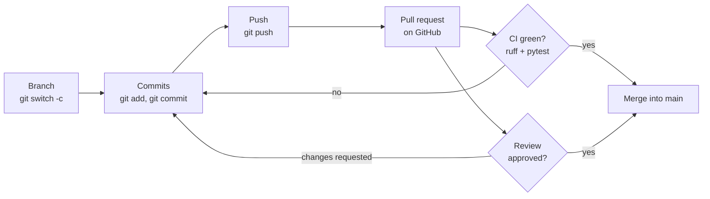
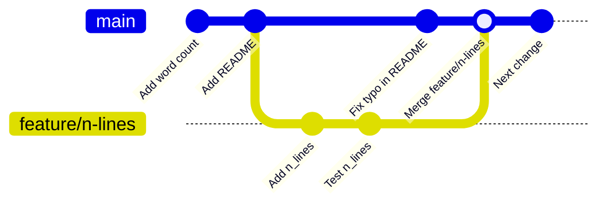
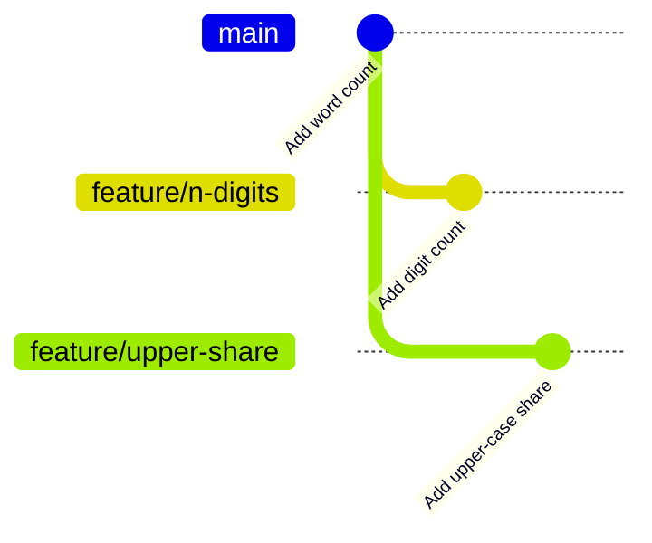
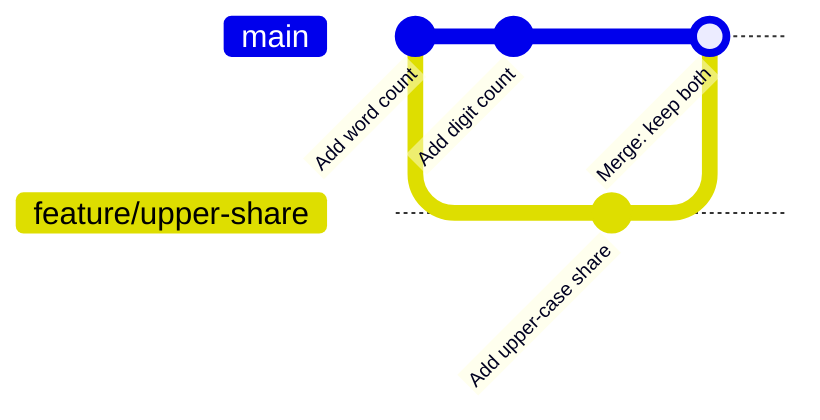
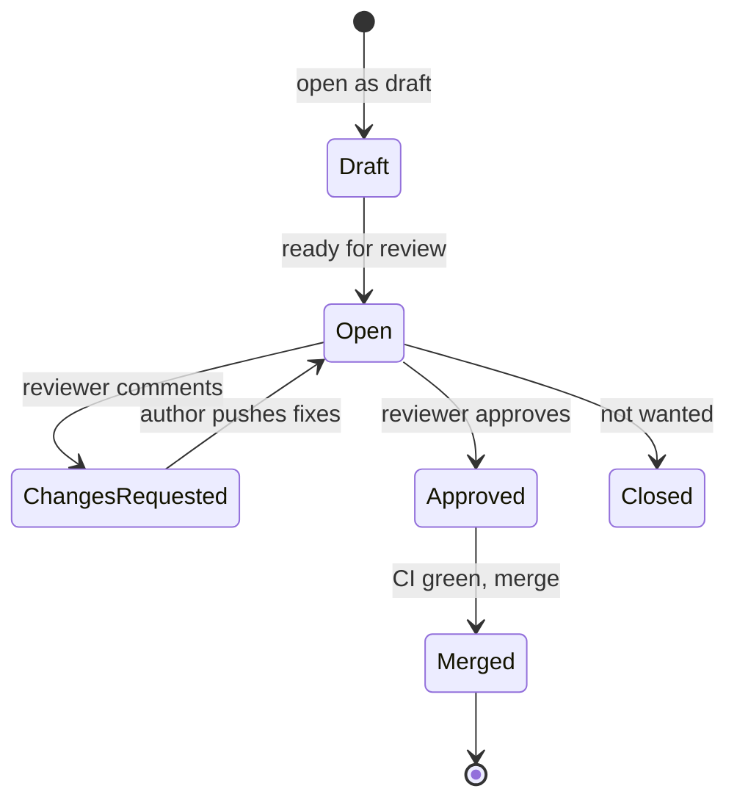
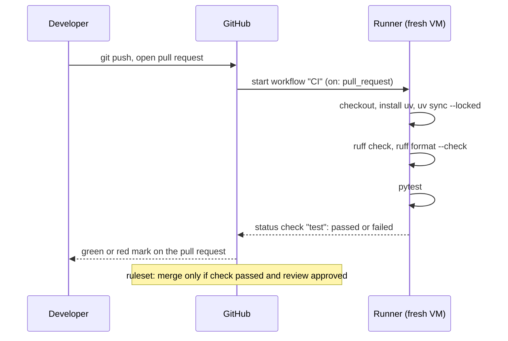

# Git, GitHub and continuous integration

This page covers the third block of Session 2. Data work is team work: several people change the same code, and nobody wants to break what the others rely on. The page introduces version control with Git (commits, branches, merging and merge conflicts), collaboration on GitHub with pull requests and code review, and continuous integration with GitHub Actions, which runs ruff and pytest on every pull request. It includes a step-by-step merge-conflict exercise. From Session 3 on, all team work is submitted as reviewed pull requests.



## Git and GitHub: commits, branches, merging and merge conflicts

### Concept

**Version control** records the history of a set of files so that any earlier state can be restored and compared. **Git** stores this history in a **repository**, the hidden `.git` folder of a project. **GitHub** is a web platform that hosts Git repositories and adds collaboration tools (pull requests, reviews, issues, Actions); GitLab and Codeberg offer the same.

- A **commit** is a snapshot of all tracked files with an author, a date, a message and a unique identifier (the **hash**, shown shortened to seven characters). Each commit points to its parent, so the commits form a history.
- Git distinguishes three places: the **working directory** (the files you edit), the **staging area** (the changes selected for the next commit, `git add`) and the repository (`git commit`).
- A **branch** is a movable name that points to a commit; new commits on the branch move it forward. `main` holds the agreed version. **HEAD** marks the branch you are on.
- `git merge <branch>` brings the commits of another branch into the current one. If the current branch has not moved since the other branch started, Git just moves it forward (**fast-forward**). If both have new commits, Git creates a **merge commit** with two parents.
- A **merge conflict** occurs when both branches changed the same lines differently. Git stops, writes both versions into the file between **conflict markers** and asks a person to decide.
- A **remote** is another copy of the repository, usually on GitHub, named `origin`. `git push` uploads commits; `git pull` downloads and merges new commits.

The history of a feature branch that is merged with a merge commit:



### Why it matters

A history with meaningful messages replaces numbered copies (`analysis_final_v3.ipynb`): it shows who changed what, when and why, and any state can be restored. Branches let each team member work on one task while `main` stays usable. Reproducing a reported result means checking out the commit that produced it.

### How it works in Python

Git is used from the terminal (or from the Git panel of VS Code). A first repository:

```bash
git config --global user.name "Ada Example"        # once per computer
git config --global user.email "ada@example.org"

git init -b main title-features && cd title-features
printf '.venv/\n__pycache__/\ndata/\n*.parquet\n.env\n' > .gitignore   # never commit these
echo "# Simple features of listing titles" > README.md
git status --short                  # ?? .gitignore   ?? README.md   (untracked)
git add .gitignore README.md        # stage
git commit -m "Add README and .gitignore"
git log --oneline                   # 1a2b3c4 (HEAD -> main) Add README and .gitignore

git switch -c feature/n-words       # create a branch and move to it
# ... edit files ...
git diff                            # what changed, line by line (+ added, - removed)
git add features.py
git commit -m "Add word-count feature"
git switch main
git merge feature/n-words           # Fast-forward
git branch -d feature/n-words       # delete the merged branch
```

Two commands that undo work safely:

```bash
git restore features.py             # discard unstaged changes in a file
git revert <hash>                   # new commit that undoes an earlier one (safe after push)
```

### In practice

- Linus Torvalds wrote Git in 2005 for the development of the Linux kernel, which today receives contributions from thousands of developers per release.
- The German public sector publishes open-source code in Git repositories on **openCode**, its own platform for open-source software of the administration.

> [!WARNING]
> Never commit data files, `.env` files, passwords or API keys. Git keeps every version: deleting a file in a later commit does not remove it from the history. Write the `.gitignore` before the first commit.

> [!TIP]
> Write commit messages in the imperative, as if completing the sentence "This commit will …": *Add digit count*, *Fix empty-text bug in n_words*. One logical change per commit.

## Exercise: a merge conflict step by step

This exercise runs on your own computer, without GitHub. It takes about 15 minutes. Two branches both add a feature and both change the same line, the list of feature names.

**Step 1 · Create a repository with one commit.**

```bash
git init -b main conflict-demo && cd conflict-demo
cat > features.py <<'PY'
FEATURE_NAMES = ["n_words"]


def n_words(text):
    return len(text.split())
PY
git add features.py
git commit -m "Add word count"
```

**Step 2 · Branch A adds `n_digits`.**

```bash
git switch -c feature/n-digits
```

Edit `features.py` in your editor: change the first line to `FEATURE_NAMES = ["n_words", "n_digits"]` and add at the end:

```python
def n_digits(text):
    return sum(c in "0123456789" for c in text)
```

```bash
git commit -am "Add digit count"    # -a stages all tracked, modified files
git switch main                           # features.py is back to the one-feature version
```

**Step 3 · Branch B adds `upper_share`, starting from the same `main`.**

```bash
git switch -c feature/upper-share
```

Edit `features.py`: change the first line to `FEATURE_NAMES = ["n_words", "upper_share"]` and add at the end:

```python
def upper_share(text):
    letters = [c for c in text if c.isalpha()]
    return sum(c.isupper() for c in letters) / len(letters) if letters else 0.0
```

```bash
git commit -am "Add upper-case share"
git switch main
```

The history now has two branches that start from the same commit:



**Step 4 · Merge A, then B.**

```bash
git merge feature/n-digits          # Fast-forward: main had not moved
git merge feature/upper-share         # CONFLICT (content): Merge conflict in features.py
                                          # Automatic merge failed; fix conflicts and then commit the result.
git status --short                        # UU features.py   (both modified: unmerged)
```

**Step 5 · Read the conflict.** `features.py` now contains both versions of each conflicting part:

```
<<<<<<< HEAD
FEATURE_NAMES = ["n_words", "n_digits"]
=======
FEATURE_NAMES = ["n_words", "upper_share"]
>>>>>>> feature/upper-share


def n_words(text):
    return len(text.split())


<<<<<<< HEAD
def n_digits(text):
    return sum(c in "0123456789" for c in text)
=======
def upper_share(text):
    letters = [c for c in text if c.isalpha()]
    return sum(c.isupper() for c in letters) / len(letters) if letters else 0.0
>>>>>>> feature/upper-share
```

Between `<<<<<<< HEAD` and `=======` is the version of the current branch (`main`, which already contains A); between `=======` and `>>>>>>>` the incoming version (B). The lines outside the markers merged without problems.

**Step 6 · Decide and edit.** Here both changes are wanted, so the result keeps both: one list with three names, and both functions. Delete all marker lines. VS Code offers buttons (*Accept Current*, *Accept Incoming*, *Accept Both*) above each conflict; check the result by eye anyway.

```python
FEATURE_NAMES = ["n_words", "n_digits", "upper_share"]


def n_words(text):
    return len(text.split())


def n_digits(text):
    return sum(c in "0123456789" for c in text)


def upper_share(text):
    letters = [c for c in text if c.isalpha()]
    return sum(c.isupper() for c in letters) / len(letters) if letters else 0.0
```

**Step 7 · Check, stage and commit.**

```bash
grep -n "<<<<<<<\|=======\|>>>>>>>" features.py    # no output: all markers are gone
python -c "import features; print(features.FEATURE_NAMES)"   # ['n_words', 'n_digits', 'upper_share']
git add features.py                        # marks the conflict as resolved
git commit -m "Merge feature/upper-share: keep both features"
git log --oneline --graph --all            # your hashes will differ
# *   5060f29 Merge feature/upper-share: keep both features
# |\
# | * e8173c8 Add upper-case share
# * | 53c385d Add digit count
# |/
# * 28165c7 Add word count
```

The final history:



> [!IMPORTANT]
> A conflict is a question for the people involved, not an error of Git. If the two changes disagree in substance (one sets a threshold to 2, the other to 5), talk to your teammate before choosing. If you get lost, `git merge --abort` returns to the state before the merge.

On GitHub the same conflict appears in the second pull request: *This branch has conflicts that must be resolved*. Resolve it locally (`git switch feature/upper-share`, `git merge main`, fix, commit, push) or with GitHub's web editor for simple cases.

## Pull requests and code review

### Concept

A **pull request** (PR) on GitHub proposes to merge a branch into `main`. It shows the **diff** (all changed lines), the results of automated checks and a discussion. In a **code review**, a teammate reads the change, comments on specific lines and either **approves** it or **requests changes**; the author pushes fixes to the same branch, and the PR updates. An **issue** describes a task or a bug; writing `Closes #4` in the PR description closes issue 4 when the PR is merged.

What a reviewer checks, in this order:

1. **Purpose.** Does the PR do what its description says, and only that?
2. **Correctness.** Edge cases, error handling, off-by-one errors, leakage of test data.
3. **Tests.** Is the new behaviour tested? Would the tests fail if the code were wrong?
4. **Readability.** Names, docstrings, type hints, no dead code.
5. **Safety.** No data files, keys or large notebooks with outputs.



### Why it matters

The pull request is the point where a second person checks correctness, readability and tests before code reaches `main`. It spreads knowledge in the team: at least two people know every part of the code. For the final project, the PRs and reviews of each member are part of the assessment of collaboration.

### How it works in Python

```bash
git switch -c feature/n-digits
# ... implement, test: uv run pytest -q; lint: uvx ruff check . ...
git add src/listingtools/text_features.py tests/test_text_features.py
git commit -m "Add n_digits with tests"
git push -u origin feature/n-digits   # -u: remember origin as upstream for this branch
# GitHub prints a link: open the pull request, describe what and why, request a reviewer
# after review: fix, commit, git push (the PR updates); merge when approved and CI is green
git switch main && git pull                 # update your local main
```

A short PR description that reviewers appreciate:

```markdown
## What
Adds `n_digits(text)` to `text_features.py` and to `FEATURE_NAMES`.

## Why
Hosts of large flats often write the size into the title; digits are a first, simple signal to test in the price model. Closes #4.

## How tested
Parametrized test with 4 cases incl. empty text; `uv run pytest -q` passes locally.
```

### In practice

- **Google's** engineering practices for code review recommend small changes and set the standard that a change should be approved once it improves the overall code health, even if it is not perfect; the guide is public.
- **CPython**, the reference implementation of Python, and **scikit-learn** accept changes only through pull requests reviewed by core developers and with passing CI.

> [!TIP]
> Keep pull requests small: one feature or fix, ideally under 200 changed lines. Large PRs get superficial reviews.

> [!CAUTION]
> Review the code, not the person. Write "This fails for an empty text; could we return 0?" rather than "You forgot the empty case". As an author, answer every comment, by a change or a short explanation.

## Continuous integration with GitHub Actions

### Concept

**Continuous integration** (CI) means that every proposed change is checked automatically in a clean environment. **GitHub Actions** runs **workflows** described in YAML files under `.github/workflows/` at the root of the repository.

- A workflow has **triggers** (`on:`), for example every pull request and every push to `main`.
- It has one or more **jobs**; each runs on a fresh virtual machine (`runs-on: ubuntu-latest`).
- A job consists of **steps**: either a ready-made **action** (`uses:`, such as `actions/checkout`) or a shell command (`run:`).
- If any step fails, the run is marked red on the pull request.

The course workflow checks out the code, installs uv, creates the environment from `uv.lock`, and runs `ruff check` (linting: likely errors and style rules), `ruff format --check` (consistent formatting) and `pytest`.

**Branch protection** (on GitHub: *Settings → Rules → Rulesets*) makes this mandatory for `main`: changes only through a pull request, at least one approving review, the CI job as a required **status check**, no force pushes.



### Why it matters

CI removes "it works on my machine": the checks run in the same way for every team member, on a machine that has only what the lockfile specifies. A linter finds some bugs before any test runs (an undefined name, an unused import). Combined with branch protection, broken code cannot reach `main`.

### How it works in Python

The workflow of the workspace, [`.github/workflows/ci.yml`](../workspace/.github/workflows/ci.yml):

```yaml
name: CI

on:
  pull_request:
  push:
    branches: [main]

jobs:
  test:                                   # job name = required status check
    runs-on: ubuntu-latest
    steps:
      - uses: actions/checkout@v7         # copy the repository onto the machine
      - uses: astral-sh/setup-uv@v10.2.0  # install uv; Python from .python-version
        with:
          enable-cache: true
      - name: Install the locked environment
        run: uv sync --locked             # fails if uv.lock does not match pyproject.toml
      - name: Lint
        run: uv run ruff check .
      - name: Check formatting
        run: uv run ruff format --check .
      - name: Run the tests
        run: uv run pytest -q
```

Run the same checks locally before you push, so that CI rarely surprises you:

```bash
uv run ruff check .            # e.g. F401 `os` imported but unused; ruff check --fix repairs many
uv run ruff format .           # rewrite files into the standard layout
uv run pytest -q
```

What ruff reports, on a small example (save as `draft.py`, run `uvx ruff check draft.py`):

```python
import os


def share(texts, flag="!"):
    hits = [t for t in texts if flag in t]
    return len(hits) / len(texts)


print(share(["a!", "b"]))   # 0.5; ruff reports: F401 `os` imported but unused
```

### In practice

- pandas, scikit-learn and FastAPI run their tests and ruff in GitHub Actions on every pull request; a red check blocks the merge.
- Research software guidelines, for example those of the Carpentries and of CodeRefinery, recommend automated testing on every change as a basic practice for reproducible research code.

> [!WARNING]
> YAML is indentation-sensitive and uses spaces, never tabs. A misplaced indent makes the workflow invalid; GitHub shows the error in the *Actions* tab. Workflows are only read from `.github/workflows/` at the root of the repository.

> [!NOTE]
> Notebooks with outputs cause large diffs and conflicts. Clear outputs before committing (in JupyterLab: *Edit → Clear Outputs of All Cells*), or use a tool such as `nbstripout` that does it automatically.

## Practice: a tested module through a reviewed pull request

Case study: contribute a tested module of simple features of listing titles (`text_features.py`: number of digits, share of upper-case letters) through a reviewed pull request. Hosts write titles such as "WOHNUNG IN BERLIN ★ MITTE" or "Loft 110 qm, Mauerpark"; capitals and digits are simple, measurable signals. Work in pairs, with the [workspace](../workspace/README.md) copied into a GitHub repository (exercises 6–8):

1. Person A implements `n_digits`, person B `upper_share` in `src/listingtools/text_features.py`, each on a branch, each with tests, each adding the name to `FEATURE_NAMES`.
2. Each opens a pull request; the partner reviews with at least one line comment; the author responds.
3. Merge the first PR when CI is green. The second PR now has a conflict in `FEATURE_NAMES`: resolve it as in the exercise above.
4. Teams set up their project repository from the template with `ci.yml` and a ruleset for `main` (PR required, one approval, check `test` required).

**Team project until the next session.** Team repository from the template, with branch protection and CI.

## Check your understanding

1. What is the difference between `git add` and `git commit`?
2. When does `git merge` produce a fast-forward, and when a merge commit?
3. You see `<<<<<<< HEAD` in a file. What do the parts above and below `=======` contain, and how do you finish the merge?
4. Name three things a reviewer should check in a pull request.
5. Why does the CI workflow use `uv sync --locked` instead of `uv add pytest ruff`?

## Further reading

- Chacon, S., & Straub, B. (2014). *Pro Git*, 2nd edition, chapters 2, 3 and 6. Apress; free online, CC BY-NC-SA 3.0. https://git-scm.com/book/en/v2
- Software Carpentry (2024). *Version Control with Git*. CC-BY 4.0. https://swcarpentry.github.io/git-novice/
- CodeRefinery (2025). *Collaborative distributed version control*. CC-BY 4.0. https://coderefinery.github.io/git-collaborative/
- MIT (2026). *The Missing Semester of Your CS Education: Version control (git)*. CC BY-NC-SA 4.0. https://missing.csail.mit.edu/2026/version-control/
