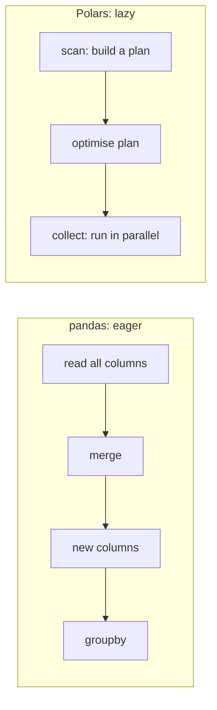
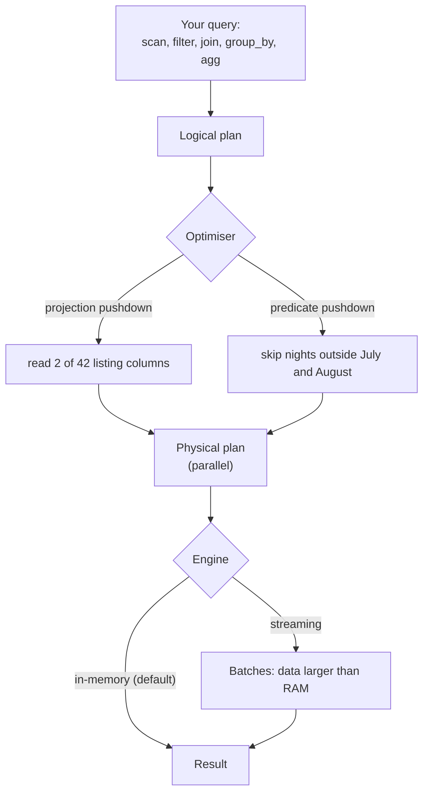
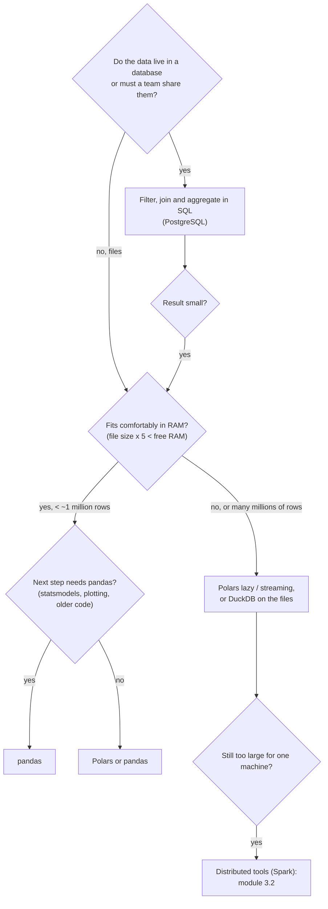

# Large tables in Python: Polars and choosing a tool

This page covers the third block. The availability calendar of the case study has 4.7 million rows, one per listing and night of the coming year, and the analyst wants monthly summaries of it by district. pandas is the default table library in Python and works well for most course data, but it reaches limits when tables grow: it holds everything in memory, uses one processor core for most operations and executes every step immediately. **Polars** is a newer DataFrame library that addresses these limits with expressions, lazy queries, a query optimiser and a streaming engine. We write the same query in SQL, pandas and Polars, and end with a guide for choosing between a database, pandas and Polars. Distributed systems such as Spark belong to the module on big-data technology and are only mentioned here.



## Limits of pandas: memory, single-threaded execution, eager evaluation

### Concept

Three properties of pandas matter when data grow:

1. **Memory.** A DataFrame lives completely in main memory (RAM). Intermediate results, such as the table after a `merge` or a new column, are additional copies. A common rule of thumb from the pandas author Wes McKinney was that pandas needed 5 to 10 times as much RAM as the size of the dataset. Text columns are especially costly: before pandas 3.0, each string was a separate Python object.
2. **Single-threaded execution.** Most pandas operations use one processor core, even when the laptop has 8 or 16.
3. **Eager evaluation.** Each line is executed immediately and completely. When you read a file with 42 columns and later use 3, pandas has already read all 42, unless you said so with `columns=`. pandas cannot look ahead at what you will do with the result.

A worked example with the case-study data: the calendar takes 2.3 MB as a Parquet file, because its sorted, repetitive columns compress extremely well. In memory, with proper types (integer, date, true/false), pandas needs 117 MB for the same 4.7 million rows. Read from the raw CSV file of Inside Airbnb, where every date and every `t`/`f` is text, it needs 624 MB, more than five times as much, and the aggregation of [workbook 14](../workbooks/14-case-study-pandas-vs-polars.ipynb) on that file reached a peak of about 1.5 GB above the starting point of the Python process.

### Why it matters

The limits rarely matter for tens of thousands of rows. They matter when a team project uses daily data for several years, many text columns or repeated experiments: the notebook becomes slow, the kernel crashes with an out-of-memory error, and people start to sample the data for technical rather than statistical reasons. Ten Inside Airbnb cities, or a calendar per quarter for five years, already give hundreds of millions of rows.

### How it works in Python

```python
import pandas as pd

calendar = pd.read_parquet("case-study/data/airbnb/calendar.parquet")
print(f"{calendar.memory_usage(deep=True).sum() / 1e6:.0f} MB in memory, typed")       # 117 MB in memory, typed
raw = pd.read_csv("case-study/data/raw/airbnb/calendar.csv.gz")       # the raw file: every value is text
print(f"{raw.memory_usage(deep=True).sum() / 1e6:.0f} MB in memory, as read from CSV")  # 624 MB in memory, as read from CSV
print(raw.memory_usage(deep=True).sort_values(ascending=False).head(3).div(1e6).round(0).to_dict())
# {'date': 277.0, 'available': 235.0, 'listing_id': 38.0}   <- the text columns dominate
# (exact values depend on the pandas version)
```

### In practice

- **pandas 3.0** (January 2026) stores text in a dedicated string type backed by Apache Arrow by default and made copy-on-write the only mode, both to reduce memory use and hidden copies.
- **Wes McKinney**, the creator of pandas, described these limits in his 2017 essay *Apache Arrow and the "10 Things I Hate About pandas"*, which motivated the Apache Arrow project on which Polars and DuckDB build.
- The **H2O.ai database-like ops benchmark** (continued by DuckDB Labs since 2023) compares group-by and join speed of DataFrame tools on tables from 10 million to 1 billion rows; pandas fails on the largest sizes on a single machine because of memory.

> [!TIP]
> The cheapest optimisation in pandas is to read only the columns you need (`columns=[...]`), to give columns their proper types (`parse_dates=`, `True`/`False` instead of `"t"`/`"f"`) and to use Parquet instead of CSV. Try it before switching tools.

## Polars: expressions, lazy queries and the query optimiser, streaming, Parquet

### Concept

**Polars** is a DataFrame library written in Rust with a Python interface (first released in 2020 by Ritchie Vink). It stores data in the **Apache Arrow** columnar format: each column is a contiguous block of memory, which is fast to scan and easy to share with other tools.

**Expressions.** In Polars you describe *what* to compute with expressions such as `pl.col("available").mean()`, and pass them to methods such as `select`, `with_columns`, `filter`, `group_by(...).agg(...)`. An expression is a recipe, not a result; Polars can run many expressions in parallel on several cores.

| Task | pandas | Polars |
|---|---|---|
| choose columns | `df[["a", "b"]]` | `df.select("a", "b")` |
| new column | `df.assign(c=df["a"] * 2)` | `df.with_columns(c=pl.col("a") * 2)` |
| filter rows | `df[df["a"] > 3]` or `df.query("a > 3")` | `df.filter(pl.col("a") > 3)` |
| group | `df.groupby("g").agg(m=("a", "mean"))` | `df.group_by("g").agg(m=pl.col("a").mean())` |
| row index | yes, central | none (no index) |

**Lazy queries and the optimiser.** `pl.scan_parquet(path)` returns a **LazyFrame**: nothing is read yet. Each method call adds a step to a **query plan**. On `.collect()`, the **query optimiser** rewrites the plan before running it, for example:

- **projection pushdown**: read only the columns the query uses;
- **predicate pushdown**: apply filters while reading, so that rows that are not needed are never loaded;
- **common subexpression elimination**: compute a repeated expression once.

`lf.explain()` prints the optimised plan. This is the same idea that a SQL database uses: you describe the result, the system chooses the steps.



**Streaming.** With `collect(engine="streaming")`, Polars processes the data in **batches** instead of loading the whole table, so queries can run on files larger than the available memory, as long as the *result* fits. `sink_parquet` writes a streaming result straight to a file.

**Parquet.** Parquet is a **columnar** file format: values of one column are stored together, compressed, with statistics (minimum, maximum) per block of rows. A reader can therefore read a few columns or skip blocks without reading the whole file. CSV, by contrast, must be parsed in full and carries no data types. Parquet was created in 2013 by engineers at Twitter and Cloudera and is now an Apache project.

### Why it matters

Lazy evaluation lets the library do what an experienced pandas user does by hand (read fewer columns, filter early) automatically and consistently. Parallel execution uses the cores you already have. Streaming removes the hard memory ceiling for many aggregations, without moving to a cluster.

### How it works in Python

How much of the summer is still free, per district?

```python
import polars as pl

listings = pl.scan_parquet("case-study/data/airbnb/listings.parquet")
calendar = pl.scan_parquet("case-study/data/airbnb/calendar.parquet")    # LazyFrame: nothing read yet
query = (
    calendar.filter(pl.col("date").is_between(pl.date(2026, 7, 1), pl.date(2026, 8, 31)))
    .join(listings.select("id", "district"), left_on="listing_id", right_on="id")
    .group_by("district")
    .agg(nights=pl.len(),
         listings=pl.col("listing_id").n_unique(),
         share_free=pl.col("available").mean())
    .sort("share_free")
)
print(query.explain())          # optimised plan: note "PROJECT 2/42 COLUMNS" and the pushed-down SELECTION
result = query.collect()        # now the work is done, on all cores
print(result.head(3))
# ┌──────────────────────────┬────────┬──────────┬────────────┐
# │ district                 ┆ nights ┆ listings ┆ share_free │
# │ Neukölln                 ┆ 79532  ┆ 1308     ┆ 0.256878   │
# │ Pankow                   ┆ 119050 ┆ 1950     ┆ 0.320311   │
# │ Friedrichshain-Kreuzberg ┆ 161730 ┆ 2652     ┆ 0.320918   │
# └──────────────────────────┴────────┴──────────┴────────────┘

streamed = query.collect(engine="streaming")   # batch-wise; same result
print(streamed.equals(result))                 # True
```

In the printed plan, the filter on the date appears as `SELECTION` inside the scan of the calendar, and the scan of the listings reads `PROJECT 2/42 COLUMNS`: the optimiser moved the filter to the file and dropped the 40 listing columns the query never uses. The result is the same as the SQL join of [block 1](01-relational-model-and-sql.md#how-it-works-in-python-4).

Expressions compose. A conditional column (`when/then/otherwise`) and a window expression (`.over()`, the Polars form of `OVER (PARTITION BY ...)`):

```python
import polars as pl

listings = pl.read_parquet("case-study/data/airbnb/listings.parquet")
out = (
    listings.filter(pl.col("minimum_nights") < 28, pl.col("price").is_not_null(),
                    pl.col("room_type") == "Entire home/apt")
    .with_columns(
        guests=pl.when(pl.col("accommodates") >= 4).then(pl.lit("4+")).otherwise(pl.lit("1-3")),
        district_median=pl.col("price").median().over("district"),     # window expression
    )
    .with_columns(expensive=pl.col("price") > 1.5 * pl.col("district_median"))
    .group_by("guests")
    .agg(n=pl.len(), median_price=pl.col("price").median(), share_expensive=pl.col("expensive").mean())
    .sort("guests")
)
print(out)
# guests 1-3: 2,043 entire homes, median €145.92, 5 % cost more than 1.5 times their district's median
# guests 4+:  2,645 entire homes, median €233.00, 33 % do
```

A third of the larger flats cost more than one and a half times the median of their district: "expensive for the district" is mostly "large". Session 5 asks whether district differences survive once size is held fixed.

### In practice

- **Berkeley's Data 100** course (University of California, Berkeley) switched its teaching from pandas to Polars in autumn 2026; workbook 11 is from its course notes.
- **Polars' published benchmarks** use the TPC-H queries of the Transaction Processing Performance Council, a standard benchmark for analytical databases, to compare Polars, pandas, DuckDB and other tools on the same hardware.
- **Parquet** is the default storage format of data-lake systems such as Delta Lake and Apache Iceberg, and of the data published by the Hugging Face Hub, which converts uploaded datasets to Parquet automatically.

> [!WARNING]
> Python functions inside Polars (`map_elements`, `map_batches` with a lambda) run row by row in Python, on one core, and the optimiser cannot see inside them. They are as slow as `apply` in pandas. Look for a built-in expression first (`str.*`, `dt.*`, `list.*`, `when/then`).

> [!CAUTION]
> Polars and pandas differ in details that change results: Polars has no index, `group_by` does not keep the group order unless `maintain_order=True`, missing values are `null` (not `NaN`), and a column such as `available` with the values `t` and `f` is read as text by pandas and Polars but can be read as true/false by DuckDB. A rule such as `available == True` then gives 0 % in two tools and a plausible share in the third (workbook 14). Compare results when you port code.

## The same query in SQL, pandas and Polars

### Concept

SQL, pandas and Polars describe the same operations with different words. Knowing the correspondence lets you move a step to the tool where it fits best and check one result against another.

| Operation | SQL | pandas | Polars |
|---|---|---|---|
| read | `FROM calendar` | `pd.read_parquet` | `pl.scan_parquet` |
| filter rows | `WHERE` | boolean mask, `query` | `filter` |
| join | `JOIN ... ON` | `merge(how="inner")` | `join(how="inner")` |
| group and aggregate | `GROUP BY` + `AVG(...)` | `groupby(...).agg(...)` | `group_by(...).agg(...)` |
| filter groups | `HAVING` | filter after `agg` | `filter` after `agg` |
| window | `RANK() OVER (PARTITION BY g)` | `groupby(g)[c].rank()` | `pl.col(c).rank().over(g)` |
| NULL group | kept | dropped unless `dropna=False` | kept |

### Why it matters

Teams rarely use one tool only. Data are extracted with SQL, prepared in pandas or Polars, and the final numbers are reconciled against the database. Translating between the three is a daily task, and differences in NULL handling, join type or ordering are a common source of disagreeing numbers.

### How it works in Python

The question: per district and room type, the number of calendar nights in July and August 2026 and the share still free, for groups with at least 10,000 nights.

```python
import duckdb
import pandas as pd
import polars as pl

CAL, LST = "case-study/data/airbnb/calendar.parquet", "case-study/data/airbnb/listings.parquet"

# 1. SQL (DuckDB on the files)
sql = duckdb.sql(f"""
    SELECT l.district, l.room_type, COUNT(*) AS nights, AVG(c.available::int) AS share_free
    FROM '{CAL}' AS c JOIN '{LST}' AS l ON l.id = c.listing_id
    WHERE c.date BETWEEN '2026-07-01' AND '2026-08-31'
    GROUP BY l.district, l.room_type
    HAVING COUNT(*) >= 10000
""").pl()

# 2. pandas
cal = pd.read_parquet(CAL)
lst = pd.read_parquet(LST, columns=["id", "district", "room_type"])
summer = cal[cal["date"].between("2026-07-01", "2026-08-31")]
pdf = (summer.merge(lst, left_on="listing_id", right_on="id")
       .groupby(["district", "room_type"], as_index=False)
       .agg(nights=("available", "size"), share_free=("available", "mean"))
       .query("nights >= 10000"))

# 3. Polars (lazy)
plf = (pl.scan_parquet(CAL)
       .filter(pl.col("date").is_between(pl.date(2026, 7, 1), pl.date(2026, 8, 31)))
       .join(pl.scan_parquet(LST).select("id", "district", "room_type"), left_on="listing_id", right_on="id")
       .group_by("district", "room_type")
       .agg(nights=pl.len(), share_free=pl.col("available").mean())
       .filter(pl.col("nights") >= 10000)
       .collect())

print(len(sql), len(pdf), len(plf))                      # 15 15 15
print(sorted(sql["nights"].to_list()) == sorted(plf["nights"].to_list()) == sorted(pdf["nights"].tolist()))  # True
print(plf.filter(pl.col("district") == "Neukölln").sort("room_type"))
# Neukölln | Entire home/apt | 48416 | 0.238454
# Neukölln | Private room    | 30682 | 0.278795
```

The case-study notebook runs a larger version of this query, with monthly groups, distinct listings and the share of nights with a minimum stay of 28 nights or more, on the **raw CSV file** of the calendar: 4,692,075 rows in 159 MB of text ([workbook 14](../workbooks/14-case-study-pandas-vs-polars.ipynb)).


On the course team's laptop (Apple silicon, 18 cores, busy with other work during the measurement), pandas needed about 2.2 seconds: it parses the file on one core and builds a merged copy of all rows before grouping. Polars in eager and lazy mode needed about 0.6 to 0.7 seconds, DuckDB and Polars streaming about 0.15 to 0.2 seconds, more than ten times faster than pandas. Memory followed the same order: about 1.5 GB above the baseline for pandas, 1.0 to 1.1 GB for Polars eager and lazy, about 0.5 GB for Polars streaming and 0.24 GB for DuckDB. The default lazy engine did not save memory compared with eager Polars, because it still holds the whole parsed table; the streaming engine did. On the typed Parquet file, the same query ran about twice as fast in pandas and in Polars lazy: the file format mattered as much as the library. A second run gave different absolute times but the same order. The honest summary for this table is "much faster and leaner, but all versions fit on a laptop".

### In practice

- **Data teams** often prototype a transformation in a notebook (pandas or Polars) and move it into SQL in the warehouse once it is stable, so that it runs next to the data.
- The **pandas documentation** maintains a page "Comparison with SQL", and the **Polars user guide** has migration pages for pandas and SQL users, both of which are standard references for translating code.
- **Reconciliation checks** in finance compare totals computed in the source database with totals computed in the analysis code before a report is released.

> [!WARNING]
> Benchmarks measure one query on one machine with one version of each library. Do not generalise from a single timing; repeat runs, compare ratios, and check that all versions return the same result before comparing speed.

## Choosing a tool: SQL database, pandas or Polars

### Concept

The choice depends on where the data live, how large they are, who else needs them and what happens next.



Rules of thumb:

- **SQL database**: the data are shared, updated, or larger than a laptop's memory; the work is filtering, joining and aggregating; constraints should protect the data. Bring only the result to Python.
- **pandas**: the data fit easily in memory; the next step uses libraries that expect pandas (statsmodels formulas, seaborn, many tutorials); interactive exploration.
- **Polars**: the data are large for pandas, the pipeline is long, speed matters, or the data are many Parquet files; also a clean expression syntax for new code. Convert with `pl.from_pandas` and `.to_pandas()` at the boundary.
- **DuckDB**: SQL on local files without a server; fast for analytical queries; returns pandas or Polars.

scikit-learn accepts both pandas and Polars DataFrames as input, and since version 1.4 can return Polars output with `set_output(transform="polars")`.

### Why it matters

Choosing the wrong tool costs time in both directions: a team that loads 5 GB of CSV into pandas on every run waits minutes and crashes kernels; a team that builds a database for a 2 MB spreadsheet spends a week on infrastructure. Mixing tools at clear boundaries is normal and good practice.

### How it works in Python

Moving between the tools is cheap because they share the Arrow format:

```python
import duckdb
import polars as pl

lf = pl.scan_parquet("case-study/data/airbnb/reviews_monthly.parquet")
by_year = lf.group_by(pl.col("month").dt.year().alias("year")).agg(n=pl.col("n_reviews").sum()).sort("year").collect()

pdf = by_year.to_pandas()          # Polars -> pandas (for statsmodels, seaborn, ...)
back = pl.from_pandas(pdf)         # pandas -> Polars
print(duckdb.sql("SELECT year, n FROM by_year WHERE year < 2026 ORDER BY n DESC LIMIT 1").fetchone())
# (2025, 130357): DuckDB reads the Polars frame by its variable name
```

### In practice

- **Berkeley Data 100** teaches Polars and SQL side by side, writing each step in both (workbook 11).
- **Analytics teams** at many companies keep the warehouse in SQL (for example with dbt) and use Python only for modelling and charts, so that numbers in dashboards and analyses come from one source.
- **Research groups** that publish large datasets increasingly use Parquet and recommend DuckDB or Polars for local analysis, for example the Hugging Face Hub, which offers a DuckDB query interface for every dataset.

> [!IMPORTANT]
> For this course, all tools are acceptable in the team project. What counts is that the choice is deliberate and written down: where the data live, which tool does which step, and why.

## Check your understanding

1. Name the three limits of pandas discussed on this page and one way to reduce each within pandas.
2. What is the difference between `pl.read_parquet` and `pl.scan_parquet`? When does Polars read the data in each case?
3. What do projection pushdown and predicate pushdown do? Find both in the output of `explain()` for the summer query above.
4. In workbook 14, the rule `available == True` gives 0 % free nights in pandas and Polars on the CSV file. Why, and how do you write a rule that all three tools evaluate the same way?
5. Your project data are the calendars of 30 European cities, one CSV file per city and quarter, updated every three months. Sketch a tool chain and justify each choice.

## Further reading

- Polars developers. *Polars user guide*: "Lazy API", "Streaming" and "Coming from pandas". https://docs.pola.rs/user-guide/
- Heavey, K. *Modern Polars*: a side-by-side comparison of pandas and Polars (CC-BY-4.0). https://kevinheavey.github.io/modern-polars/
- McKinney, W. (2017). *Apache Arrow and the "10 Things I Hate About pandas"*. https://wesmckinney.com/blog/apache-arrow-pandas-internals/
- Raasveldt, M., & Mühleisen, H. (2019). DuckDB: an embeddable analytical database. *Proceedings of SIGMOD 2019*, 1981–1984. https://doi.org/10.1145/3299869.3320212
