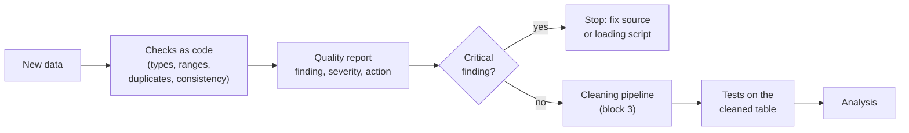
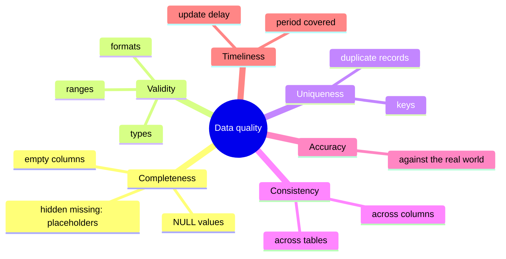

# Data quality: dimensions, checks and validation rules as tests

This page covers the first block of the session. Before any analysis, we need to know whether the data can be trusted: are values missing, out of range, duplicated or contradictory? A city analyst who reports "the median price of a night in Mitte" from a table in which prices are text, some stays last three years and some listings appear twice reports a number nobody can defend. We first name the **dimensions** of data quality, then write **checks** for types, ranges, duplicates and consistency as code, and finally turn the checks into **validation rules** that run automatically as tests. All examples use the Berlin snapshot of Inside Airbnb (26 June 2026): `listings` (12,776 listings), `calendar` (availability for the next 365 days) and `reviews_monthly` (reviews per listing and month). The practice task is a data quality report for the listings ([workbook 03](../workbooks/03-case-study-quality-report.ipynb)).



## Dimensions of data quality

### Concept

**Data quality** describes how well data fit their intended use. The same dataset can be good enough for one question and useless for another. Six **dimensions** are commonly used to structure the assessment (they appear, with small variations, in ISO/IEC 25012 and in the guidance of statistical offices such as the European Statistical System):

| Dimension | Question | Example in the Berlin listings |
|---|---|---|
| **Completeness** | Are required values present? | 34 % of the listings show no price; 12 columns of the snapshot are completely empty, among them `host_since` and `instant_bookable` |
| **Validity** | Do values have the right type, format and range? | the raw price is text (`"$160.71"`); 2 listings allow a maximum stay of 2,147,483,647 nights; 10 require a minimum stay of more than a year |
| **Uniqueness** | Is each real-world entity recorded once? | every `id` is unique, but 302 listings repeat another listing of the same host with the same title, room type and number of guests |
| **Consistency** | Do related values agree, within and across tables? | the minimum stay never exceeds the maximum; 47 listings have more bedrooms than guests; the calendar covers 79 listings that the listings table does not contain |
| **Accuracy** | Do values describe reality correctly? | the registration field should hold Berlin's registration number, but 1,685 hosts typed their own name and 2,602 the name of a company |
| **Timeliness** | Are data recent enough for the question? | the snapshot was scraped between 26 June and 3 July 2026; prices and availability change daily |

A worked example by hand. Five rows of a listings table (invented values):

| id | host_id | room_type | price | minimum_nights | maximum_nights |
|---|---|---|---|---|---|
| 101 | 7 | Entire home/apt | $95.00 | 2 | 30 |
| 102 | 7 | Entire home/apt | | 3 | 1125 |
| 103 | 8 | private room | $40.00 | 1 | 2147483647 |
| 101 | 7 | Entire home/apt | $95.00 | 2 | 30 |
| 104 | 9 | Private room | $1,250.00 | 400 | 365 |

Completeness: the price is missing in 1 of 5 rows (20 %). Validity: all prices are text with a currency sign and a thousands separator, `private room` is not one of the four room types (wrong case), and 2,147,483,647 is not a stay but a placeholder. Uniqueness: listing 101 appears twice. Consistency: listing 104 requires at least 400 nights but allows at most 365.



### Why it matters

Naming the dimension tells you how to look for a problem and what to do about it. Without a systematic list, checks depend on what the analyst happens to notice, and whole classes of problems (duplicates, contradictions between tables) go unseen. Data problems also propagate: a duplicated listing inflates every count derived from it, and a placeholder stay of two billion nights turns every average of `maximum_nights` into nonsense.

### How it works in Python

A first overview of completeness, including *hidden* missing values and columns that the snapshot left empty:

```python
import pandas as pd

listings = pd.read_parquet("case-study/data/airbnb/listings.parquet")
print(listings.isna().mean().sort_values(ascending=False).head(4).round(3).to_dict())
# {'bathrooms': 0.521, 'beds': 0.49, 'price': 0.339, 'estimated_revenue_l365d': 0.339}

# hidden missing values: placeholders that isna() does not see
print(listings["maximum_nights"].value_counts().head(3).to_dict())   # {1125.0: 4848, 365.0: 3141, 180.0: 464}
print((listings["maximum_nights"] == 2**31 - 1).sum())               # 2

# structural missingness: no review, no rating
print(pd.crosstab(listings["number_of_reviews"].eq(0), listings["review_scores_rating"].isna()))
# review_scores_rating  False  True
# number_of_reviews
# False                 10203      0
# True                      0   2573

# columns that the snapshot left completely empty
raw = pd.read_csv("case-study/data/raw/airbnb/listings.csv.gz")
empty = raw.columns[raw.isna().all()]
print(len(empty), list(empty[:5]))
# 12 ['neighborhood_overview', 'host_since', 'host_response_time', 'host_response_rate', 'host_acceptance_rate']
```

`maximum_nights` has no gaps worth mentioning, yet two of its values are not stays of the real world: 2,147,483,647 is the largest number a 32-bit integer can hold, a software default. The most frequent value, 1,125 nights, is the default that Airbnb fills in when a host does not set a maximum; it is a valid value, but it says "no limit chosen", not "a guest may stay three years". The missing review scores are a different case: a listing without reviews cannot have a rating. Such **structural missingness** is not a defect, but it must be documented, and it must not be imputed. The 12 empty columns are part of the Inside Airbnb file format but carry no value in this snapshot, so an analysis of "how long hosts have been active" (`host_since`) cannot be done with it at all; `prepare_airbnb.py` drops such columns.

### In practice

- **Public Health England** under-reported about 16,000 positive COVID-19 tests in October 2020 because files were processed with an old Excel format limited to 65,536 rows: a completeness failure that a simple row-count check would have revealed.
- **NASA's Mars Climate Orbiter** was lost in 1999 because one software component produced impulse values in pound-force seconds while another expected newton-seconds: a consistency failure between two systems.
- **Eurostat** publishes quality reports for European statistics that assess dimensions such as relevance, accuracy, timeliness, coherence and comparability, following the ESS Quality Assurance Framework.

> [!WARNING]
> Missing values hide in many forms: empty strings, `"n/a"`, `"-"`, `"unknown"`, `0` for an unknown price, `1900-01-01` for an unknown date, `-999` in survey data, `2147483647` for "no limit". Look at the most frequent and the largest values of each column (`value_counts().head()`, `max()`) before trusting `isna()`.

## Checks for types, ranges, duplicates and consistency

### Concept

A **check** is a rule that every row (or the table as a whole) should satisfy, written so that a program can evaluate it. Four groups of checks cover most problems:

- **Type checks**: each column has the expected data type (integer, decimal, text, date, true/false). A price stored as text (`"$1,250.00"`) or a date stored as text (`"05/06/2023"`) signals a loading problem: such a column cannot be averaged or compared.
- **Range and domain checks**: values lie in an allowed range (coordinates inside Berlin, at least one guest, a minimum stay of at most a year) or come from an allowed set (`room_type` is one of four values), and codes follow their format (a Berlin registration number looks like `01/Z/RA/123456-24`).
- **Uniqueness checks**: keys are unique (`id`), and real-world entities are not recorded twice. Exact duplicate rows, duplicate keys and *near* duplicates (same content, different id: a host who offers several identical rooms with the same title) are different problems.
- **Consistency checks**: rules that relate columns (minimum stay not above the maximum; the first review not after the last) or tables (every listing in the calendar exists in the listings table; the review count equals the sum of the monthly review counts).

Each finding gets a **severity**: *critical* (a key or hard rule is broken; the data cannot be used as they are), *major* (many rows or a central variable; must be handled before analysis), *minor* (document it; handle it when it matters).

### Why it matters

Checks written as code can be rerun after every data update (Inside Airbnb publishes a new snapshot every quarter), reviewed by colleagues and compared over time. A check that produces a count ("10 rows fail") is more useful than one that only says "fail": the count tells you whether the problem is an exception or a pattern.

### How it works in Python

Checks on the listings, each returning the number of failing rows:

```python
import pandas as pd

listings = pd.read_parquet("case-study/data/airbnb/listings.parquet")
calendar = pd.read_parquet("case-study/data/airbnb/calendar.parquet", columns=["listing_id"])
raw_price = pd.read_csv("case-study/data/raw/airbnb/listings.csv.gz", usecols=["price"])["price"]

ROOM_TYPES = {"Entire home/apt", "Private room", "Hotel room", "Shared room"}
LAT, LON = (52.33, 52.68), (13.08, 13.77)          # bounding box of neighbourhoods.geojson
same_offer = ["host_id", "name", "room_type", "accommodates"]

checks = {
    # validity: types, domains and ranges
    "raw price is not a number":           pd.to_numeric(raw_price, errors="coerce").isna().sum() - raw_price.isna().sum(),
    "room type not one of four":           (~listings["room_type"].isin(ROOM_TYPES)).sum(),
    "coordinates outside Berlin":          (~listings["latitude"].between(*LAT) | ~listings["longitude"].between(*LON)).sum(),
    "accommodates fewer than 1":           listings["accommodates"].lt(1).sum(),
    "maximum nights = 2,147,483,647":      listings["maximum_nights"].eq(2**31 - 1).sum(),
    "minimum stay above 365 nights":       listings["minimum_nights"].gt(365).sum(),
    # uniqueness
    "id duplicated":                       listings["id"].duplicated().sum(),
    "same host, title, room type, guests": listings.duplicated(same_offer).sum(),
    # consistency, within the table and across tables
    "minimum nights > maximum nights":     listings["minimum_nights"].gt(listings["maximum_nights"]).sum(),
    "more bedrooms than guests":           listings["bedrooms"].gt(listings["accommodates"]).sum(),
    "first review after last review":      listings["first_review"].gt(listings["last_review"]).sum(),
    "calendar listing unknown (FK)":       (~calendar["listing_id"].drop_duplicates().isin(listings["id"])).sum(),
}
print(pd.Series(checks, name="n_failed").to_string())
# raw price is not a number              8441
# room type not one of four                 0
# coordinates outside Berlin                0
# accommodates fewer than 1                 0
# maximum nights = 2,147,483,647            2
# minimum stay above 365 nights            10
# id duplicated                             0
# same host, title, room type, guests     302
# minimum nights > maximum nights           0
# more bedrooms than guests                47
# first review after last review            0
# calendar listing unknown (FK)            79
```

A check that passes is also a result: it belongs in the report, so that the next reader knows it was run. A count is the start of an investigation, not its end:

```python
import pandas as pd

raw_price = pd.read_csv("case-study/data/raw/airbnb/listings.csv.gz", usecols=["price"])["price"]
print(raw_price.dropna().head(3).tolist(), raw_price.str.contains(",", na=False).sum())
# ['$160.71', '$193.33', '$10.88'] 31
price = pd.to_numeric(raw_price.str.replace(r"[$,]", "", regex=True), errors="coerce")   # the explicit rule
print(price.notna().sum(), price.max())                                                # 8441 10025.0

listings = pd.read_parquet("case-study/data/airbnb/listings.parquet")
print(listings.loc[listings["minimum_nights"].gt(365), "minimum_nights"].value_counts().sort_index().to_dict())
# {500.0: 1, 720.0: 1, 1000.0: 7, 1125.0: 1}
groups = listings[listings.duplicated(["host_id", "name", "room_type", "accommodates"], keep=False)]
print(len(groups), groups["host_id"].nunique(), groups.groupby("host_id").size().max())   # 473 61 103
```

Every one of the 8,441 prices in the raw file is text: a currency sign, a thousands separator in 31 of them, and a decimal point. The sign is a dollar sign although Berlin prices are in euros; Inside Airbnb writes `$` for every city. The rule "remove `$` and `,`, then convert" parses all of them, and `prepare_airbnb.py` applies exactly this rule, so that the prepared table has a numeric price. Minimum stays of 1,000 nights or more are legal on the platform, but they are not holiday rentals; most likely they are hosts who keep a listing online without offering it, or who rent long-term through the platform. The 302 "near duplicates" are 473 listings of 61 hosts, one of them with 103 such listings: operators of serviced apartments or hostels who offer several identical units under one title. They are real, separate offers, so they are not deleted; but a model validated with some units of a block in training and others in the test set will look better than it is (grouped validation, Session 7).

### In practice

- **Statistical offices** run *editing rules* on survey returns, for example "age < 15 and marital status = married" or "turnover reported in euros instead of thousands of euros", before any estimate is published.
- **Amazon** described *Deequ*, its library for "unit tests for data", which computes completeness, uniqueness and range checks on large tables before they are used (Schelter et al., 2018).
- **Laboratory medicine** uses plausibility limits and *delta checks* (a large change from the patient's previous result) to hold back implausible results for review before they reach a physician.

> [!CAUTION]
> Do not "fix" a failing check by changing the data by hand in a spreadsheet. Every correction belongs in the cleaning code, with a reason (block 3). Otherwise the next snapshot brings the problem back and nobody knows why the numbers changed.

> [!TIP]
> Severity depends on the question. The 47 listings with more bedrooms than guests (37 of them private rooms) do not matter for a price comparison by district, but they matter for a model that uses bedrooms per guest. Record the finding once and decide per use.

### Personal data in the registration field

One finding is not a technical defect but a legal one. Berlin requires a registration number for short-term rentals, and Airbnb asks hosts to enter it in a free-text field. Many hosts typed something else:

```python
import pandas as pd

listings = pd.read_parquet("case-study/data/airbnb/listings.parquet")
print(listings["license_status"].value_counts().to_dict())
# {'registration number': 4480, 'missing': 3967, 'legal entity name': 2602, 'private host name': 1685, 'other': 42}
numbers = listings.loc[listings["license_status"].eq("registration number"), "license"]
official = numbers.str.fullmatch(r"\d{2}/[A-Z]/[A-Z]{2}/\d{6}-\d{2}")
print(len(numbers), official.sum(), (~official).sum())   # 4480 4449 31
```

In the original file, 1,685 entries contain the first and last name of a private host and 2,602 the name of a company. A name of a private person is **personal data** under the GDPR, even when it was published on a public page: redistributing it in a course dataset needs a purpose, and the analysis has none, since it needs only the *type* of entry. `prepare_airbnb.py` therefore replaces every entry that is not a registration number by its category and adds the column `license_status` (**data minimisation**). This is why the check above can be run without anyone seeing a name. Of the 4,480 numbers, 31 do not follow the official format exactly (a missing slash, lower-case letters): a validity finding of the minor kind.

> [!IMPORTANT]
> A quality check must not itself spread personal data. When you investigate a free-text field, count patterns (`str.match`, `str.startswith`) instead of printing values, and never copy raw rows of such a field into a report, an issue or a chat with a language model.

## Validation rules as tests

### Concept

A **validation rule** is a check that must pass before data are used; if it fails, the pipeline stops. Writing validation rules as **tests** reuses the tools of software engineering (Session 2): a test is a small function that **asserts** a condition, and a test runner such as **pytest** runs all tests and reports which fail.

Two styles are common:

1. **Plain pandas + pytest**: each rule is a test function with an `assert`. Known, accepted problems are marked as *expected failures* (`@pytest.mark.xfail(reason=...)`), which documents them without breaking the run.
2. **A schema library** such as **pandera**: the expected structure of a DataFrame (columns, types, checks per column, uniqueness of column combinations) is declared once as a **schema**. `schema.validate(df, lazy=True)` checks everything and returns a table of all failures.


Rules should be **specific** (one property per rule), **quantified** ("at most 1 % missing" rather than "few missing") and **versioned** with the code, so that a change of a rule is visible in the history.

### Why it matters

Data change: a new snapshot every quarter, a column that Inside Airbnb stops filling, a changed export format. Tests catch the change at the moment it happens rather than when a stakeholder asks why a number looks odd. They also make expectations explicit for the whole team: the test file is the written contract for what "valid data" means.

### How it works in Python

Rules as pytest tests (excerpt from [`workbooks/quality/test_listings_quality.py`](../workbooks/quality/test_listings_quality.py)). Run them with `uv run --with pytest pytest sessions/04-data-quality/workbooks/quality -v`:

```python
import pandas as pd
import pytest


@pytest.fixture(scope="module")
def listings():
    return pd.read_parquet("case-study/data/airbnb/listings.parquet")


def test_id_is_primary_key(listings):
    assert listings["id"].is_unique


def test_rating_missing_exactly_without_reviews(listings):
    assert (listings["review_scores_rating"].isna() == listings["number_of_reviews"].eq(0)).all()


@pytest.mark.xfail(strict=True, reason="known: 2 listings carry maximum_nights = 2,147,483,647, a software default")
def test_raw_no_sentinel_maximum_nights(listings):
    assert not listings["maximum_nights"].eq(2**31 - 1).any()

# pytest output: ..x  (2 passed, 1 xfailed)
```

The same kind of rules as a pandera schema; `lazy=True` collects all failures instead of stopping at the first:

```python
# pandera is part of the course environment (otherwise: uv run --with pandera python ...)
import pandas as pd
import pandera.pandas as pa

listings = pd.read_parquet("case-study/data/airbnb/listings.parquet")
schema = pa.DataFrameSchema(
    {
        "id": pa.Column(int, unique=True),
        "room_type": pa.Column(str, pa.Check.isin(["Entire home/apt", "Private room", "Hotel room", "Shared room"])),
        "latitude": pa.Column(float, pa.Check.in_range(52.33, 52.68)),
        "longitude": pa.Column(float, pa.Check.in_range(13.08, 13.77)),
        "accommodates": pa.Column(int, pa.Check.ge(1)),
        "price": pa.Column(float, pa.Check.in_range(10, 1000), nullable=True),
        "minimum_nights": pa.Column(float, pa.Check.le(365), nullable=True),
        "maximum_nights": pa.Column(float, pa.Check.lt(2**31 - 1, error="sentinel 2,147,483,647"), nullable=True),
        "license_status": pa.Column(str, pa.Check.isin(["registration number", "missing", "legal entity name",
                                                         "private host name", "other"])),
    },
    unique=["host_id", "name", "room_type", "accommodates"],     # the same offer twice?
)
try:
    schema.validate(listings, lazy=True)
except pa.errors.SchemaErrors as err:
    print(err.failure_cases.groupby(["column", "check"]).size().to_string())
# accommodates    multiple_fields_uniqueness    473
# host_id         multiple_fields_uniqueness    473
# maximum_nights  sentinel 2,147,483,647          2
# minimum_nights  less_than_or_equal_to(365)     10
# name            multiple_fields_uniqueness    473
# price           in_range(10, 1000)            136
# room_type       multiple_fields_uniqueness    473
```

The uniqueness rule reports 473 rows per column: all listings involved in the 171 groups with the same host, title, room type and number of guests, not only the 302 "extra" rows that `duplicated()` counts. The price rule flags 136 listings below €10 or above €1,000 a night; most of them are medium-term listings whose price field means something else (block 2), which is why the course compares prices of short stays only.

### In practice

- **Google** built TensorFlow Data Validation into its machine-learning platform after finding that data errors were a major cause of failures in production models; it infers a schema from training data and checks every new batch against it (Breck et al., 2019).
- **dbt**, a tool for SQL data pipelines used in many analytics teams, ships with `unique`, `not_null`, `accepted_values` and `relationships` tests that run after every transformation.
- **pandera** was presented at the SciPy conference in 2020 (Bantilan, 2020) and is used to validate DataFrames in scientific and industrial pipelines; workbook 01 is its official introduction notebook.

> [!IMPORTANT]
> A test suite that always passes because nobody runs it protects nothing. Run the data tests in the same place as the code tests: locally before committing, and in continuous integration (Session 2) when the data are small enough or a sample is available.

> [!WARNING]
> Use `xfail` only for documented, accepted problems, and with `strict=True`: then pytest also complains when the problem disappears (for example in the next snapshot), so that the test can be turned into a normal test.

## Check your understanding

1. Assign each finding to a dimension: (a) 4,335 listings show no price; (b) a host offers ten rooms with the same title and the same number of guests; (c) a listing has more bedrooms than guests; (d) the snapshot is from June 2026, but the city wants to know about the Christmas market season.
2. Why does `listings["maximum_nights"].isna().mean()` say almost nothing about the quality of the column?
3. Write a range check and a consistency check for the `minimum_nights` column.
4. What is the difference between a check that fails and a test marked `xfail`? When is `xfail` appropriate?
5. pandera reports 473 failing rows for the four-column uniqueness rule, while `duplicated()` counts 302. Explain the difference.
6. Why does the course dataset keep `license_status` but not the text that hosts typed into the registration field? What would you lose for the analysis?

## Further reading

- Schelter, S., Lange, D., Schmidt, P., Celikel, M., Biessmann, F., & Grafberger, A. (2018). Automating large-scale data quality verification. *Proceedings of the VLDB Endowment*, 11(12), 1781–1794. https://doi.org/10.14778/3229863.3229867
- Breck, E., Polyzotis, N., Roy, S., Whang, S. E., & Zinkevich, M. (2019). Data validation for machine learning. *Proceedings of MLSys 2019*. https://mlsys.org/Conferences/2019/doc/2019/167.pdf
- Bantilan, N. (2020). pandera: Statistical data validation of pandas dataframes. *Proceedings of the 19th Python in Science Conference*, 116–124. https://doi.org/10.25080/Majora-342d178e-010
- Inside Airbnb. *Data assumptions*. https://insideairbnb.com/data-assumptions/
- pandera documentation. https://pandera.readthedocs.io/
