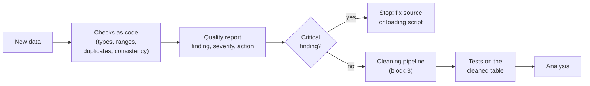
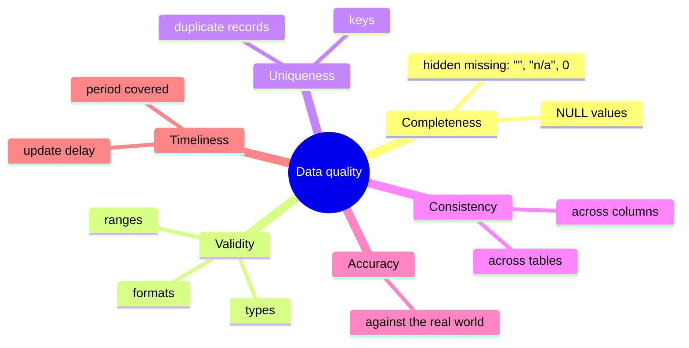

# Data quality: dimensions, checks and validation rules as tests

This page covers the first block of the session. Before any analysis, we need to know whether the data can be trusted: are values missing, out of range, duplicated or contradictory? We first name the **dimensions** of data quality, then write **checks** for types, ranges, duplicates and consistency as code, and finally turn the checks into **validation rules** that run automatically as tests. The practice task is a data quality report for the review data ([workbook 03](../workbooks/03-case-study-quality-report.ipynb)).



## Dimensions of data quality

### Concept

**Data quality** describes how well data fit their intended use. The same dataset can be good enough for one question and useless for another. Six **dimensions** are commonly used to structure the assessment (they appear, with small variations, in ISO/IEC 25012 and in the guidance of statistical offices such as the European Statistical System):

| Dimension | Question | Example in the review data |
|---|---|---|
| **Completeness** | Are required values present? | price missing for 82.5 % of products |
| **Validity** | Do values have the right type, format and range? | rating must be an integer from 1 to 5 |
| **Uniqueness** | Is each real-world entity recorded once? | 602 extra reviews by the same user for the same product |
| **Consistency** | Do related values agree, within and across tables? | `label` must match `rating`; `train_n_reviews` must equal the number of reviews |
| **Accuracy** | Do values describe reality correctly? | is the price the actual selling price? (needs an external source) |
| **Timeliness** | Are data recent enough for the question? | reviews end in December 2021 |

A worked example by hand. Five rows of a product table:

| parent_asin | price | store | n_reviews |
|---|---|---|---|
| A1 | 12.99 | VitaCo | 3 |
| A2 | | VitaCo | 1 |
| A3 | −4.00 | | 2 |
| A1 | 12.99 | VitaCo | 3 |
| A4 | 9.50 | PillBox | 0 |

Completeness: price missing in 1 of 5 rows (20 %), store in 1 of 5. Validity: −4.00 is not a valid price. Uniqueness: A1 appears twice. Consistency: if the review table has 2 reviews for A4, `n_reviews = 0` contradicts it.



### Why it matters

Naming the dimension tells you how to look for a problem and what to do about it. Without a systematic list, checks depend on what the analyst happens to notice, and whole classes of problems (duplicates, contradictions between tables) go unseen. Data problems also propagate: a duplicated record inflates every count derived from it, and a wrong unit distorts every model that uses the variable.

### How it works in Python

A first overview of completeness, including *hidden* missing values (empty strings), for the products:

```python
import pandas as pd

products = pd.read_parquet("case-study/data/products.parquet")
overview = pd.DataFrame({
    "null": products.isna().mean(),
    "empty_string": products.apply(lambda s: s.eq("").mean() if s.dtype == "str" else 0.0),
}).round(3)
print(overview[overview.sum(axis=1) > 0].sort_values("null", ascending=False))
#                    null  empty_string
# price             0.825         0.000
# train_avg_rating  0.082         0.000
# train_n_reviews   0.082         0.000
# store             0.039         0.000
# details           0.016         0.000
# features          0.000         0.741
# description       0.000         0.707
# categories        0.000         1.000
```

`categories` has no NULL values, yet it is empty for every product: `isna()` alone would report it as complete.

### In practice

- **Public Health England** under-reported about 16,000 positive COVID-19 tests in October 2020 because files were processed with an old Excel format limited to 65,536 rows: a completeness failure that a simple row-count check would have revealed.
- **NASA's Mars Climate Orbiter** was lost in 1999 because one software component produced impulse values in pound-force seconds while another expected newton-seconds: a consistency failure between two systems.
- **Eurostat** publishes quality reports for European statistics that assess dimensions such as relevance, accuracy, timeliness, coherence and comparability, following the ESS Quality Assurance Framework.

> [!WARNING]
> Missing values hide in many forms: empty strings, `"n/a"`, `"-"`, `"unknown"`, `0` for an unknown price, `1900-01-01` for an unknown date, `-999` in survey data. Look at the most frequent values of each column (`value_counts().head()`) before trusting `isna()`.

## Checks for types, ranges, duplicates and consistency

### Concept

A **check** is a rule that every row (or the table as a whole) should satisfy, written so that a program can evaluate it. Four groups of checks cover most problems:

- **Type checks**: each column has the expected data type (integer, text, date, boolean). A rating stored as text (`"5"`) or a date stored as a number of milliseconds signals a loading problem.
- **Range and domain checks**: values lie in an allowed range (`1 ≤ rating ≤ 5`, `price > 0`, dates within the collection period) or come from an allowed set (`label ∈ {neg, neu, pos}`).
- **Uniqueness checks**: keys are unique (`review_id`), and real-world entities are not recorded twice (the same user reviewing the same product twice). Exact duplicate rows, duplicate keys and *near* duplicates (same content, different id) are different problems.
- **Consistency checks**: rules that relate columns (`label` follows from `rating`) or tables (every `reviews.parent_asin` exists in `products`; the stored `train_avg_rating` equals the mean rating of the product's reviews).

Each finding gets a **severity**: *critical* (a key or hard rule is broken; the data cannot be used as they are), *major* (many rows or a central variable; must be handled before analysis), *minor* (document it; handle it when it matters).

### Why it matters

Checks written as code can be rerun after every data update, reviewed by colleagues and compared over time. A check that produces a count ("602 rows fail") is more useful than one that only says "fail": the count tells you whether the problem is an exception or a pattern.

### How it works in Python

Checks on the reviews, each returning the number of failing rows:

```python
import pandas as pd

reviews = pd.read_parquet("case-study/data/train.parquet")
products = pd.read_parquet("case-study/data/products.parquet")
expected_label = pd.cut(reviews["rating"], [0, 2, 3, 5], labels=["neg", "neu", "pos"]).astype(str)

checks = {
    # type
    "rating is an integer":            int(reviews["rating"].dtype.kind != "i"),
    # range and domain
    "rating outside 1..5":             (~reviews["rating"].between(1, 5)).sum(),
    "helpful_vote negative":           reviews["helpful_vote"].lt(0).sum(),
    "date outside 2001-2021":          (~reviews["date"].between("2001-01-01", "2021-12-31 23:59:59")).sum(),
    "text empty":                      reviews["text"].str.strip().eq("").sum(),
    # uniqueness
    "review_id duplicated":            reviews["review_id"].duplicated().sum(),
    "same user and product again":     reviews.duplicated(["user_id", "parent_asin"]).sum(),
    "text duplicated":                 reviews["text"].duplicated().sum(),
    # consistency
    "label does not match rating":     reviews["label"].ne(expected_label).sum(),
    "product unknown (foreign key)":   (~reviews["parent_asin"].isin(products["parent_asin"])).sum(),
}
print(pd.Series(checks, name="n_failed").to_string())
# rating is an integer                 0
# rating outside 1..5                  0
# helpful_vote negative                0
# date outside 2001-2021               0
# text empty                          95
# review_id duplicated                 0
# same user and product again        602
# text duplicated                  30859
# label does not match rating          0
# product unknown (foreign key)        0
```

The duplicated texts are mostly short and generic. Whether they are a problem depends on the question:

```python
import pandas as pd

reviews = pd.read_parquet("case-study/data/train.parquet", columns=["text"])
print(reviews["text"].value_counts().head(4).to_string())
# text
# Good             938
# Great product    863
# Great            832
# Works great      575
```

A consistency check across tables: is the stored product rating the mean of its reviews?

```python
import numpy as np
import pandas as pd

reviews = pd.read_parquet("case-study/data/train.parquet", columns=["parent_asin", "rating"])
products = pd.read_parquet("case-study/data/products.parquet")
recomputed = reviews.groupby("parent_asin")["rating"].mean().rename("recomputed")
joined = products.set_index("parent_asin").join(recomputed, how="inner")
print(len(joined), np.isclose(joined["train_avg_rating"], joined["recomputed"]).all())   # 55359 True
```

### In practice

- **Statistical offices** run *editing rules* on survey returns, for example "age < 15 and marital status = married" or "turnover reported in euros instead of thousands of euros", before any estimate is published.
- **Amazon** described *Deequ*, its library for "unit tests for data", which computes completeness, uniqueness and range checks on large tables before they are used (Schelter et al., 2018).
- **Laboratory medicine** uses plausibility limits and *delta checks* (a large change from the patient's previous result) to hold back implausible results for review before they reach a physician.

> [!CAUTION]
> Do not "fix" a failing check by changing the data by hand in a spreadsheet. Every correction belongs in the cleaning code, with a reason (block 3). Otherwise the next data update brings the problem back and nobody knows why the numbers changed.

> [!TIP]
> Severity depends on the question. 95 empty review texts are irrelevant for an analysis of ratings over time, but they matter for text classification. Record the finding once and decide per use.

## Validation rules as tests

### Concept

A **validation rule** is a check that must pass before data are used; if it fails, the pipeline stops. Writing validation rules as **tests** reuses the tools of software engineering (Session 2): a test is a small function that **asserts** a condition, and a test runner such as **pytest** runs all tests and reports which fail.

Two styles are common:

1. **Plain pandas + pytest**: each rule is a test function with an `assert`. Known, accepted problems are marked as *expected failures* (`@pytest.mark.xfail(reason=...)`), which documents them without breaking the run.
2. **A schema library** such as **pandera**: the expected structure of a DataFrame (columns, types, checks per column, uniqueness of column combinations) is declared once as a **schema**. `schema.validate(df, lazy=True)` checks everything and returns a table of all failures.


Rules should be **specific** (one property per rule), **quantified** ("at most 1 % missing" rather than "few missing") and **versioned** with the code, so that a change of a rule is visible in the history.

### Why it matters

Data change: a new download, a new year, a changed export format. Tests catch the change at the moment it happens rather than when a stakeholder asks why a number looks odd. They also make expectations explicit for the whole team: the test file is the written contract for what "valid data" means.

### How it works in Python

Rules as pytest tests (excerpt from [`workbooks/quality/test_review_quality.py`](../workbooks/quality/test_review_quality.py)). Run them with `uv run --with pytest pytest sessions/04-data-quality/workbooks/quality -v`:

```python
import pandas as pd
import pytest


@pytest.fixture(scope="module")
def reviews():
    return pd.read_parquet("case-study/data/train.parquet")


def test_review_id_is_primary_key(reviews):
    assert reviews["review_id"].is_unique


def test_rating_range(reviews):
    assert reviews["rating"].between(1, 5).all()


@pytest.mark.xfail(strict=True, reason="known: 95 reviews have an empty text")
def test_raw_text_not_empty(reviews):
    assert reviews["text"].str.strip().ne("").all()

# pytest output: ..x  (2 passed, 1 xfailed)
```

The same rules as a pandera schema; `lazy=True` collects all failures instead of stopping at the first:

```python
# requires pandera: uv run --with pandera python ...
import pandas as pd
import pandera.pandas as pa

reviews = pd.read_parquet("case-study/data/train.parquet")
schema = pa.DataFrameSchema(
    {
        "review_id": pa.Column(str, unique=True),
        "rating": pa.Column(int, pa.Check.in_range(1, 5)),
        "text": pa.Column(str, pa.Check(lambda s: s.str.strip().str.len() > 0, error="text is empty")),
        "label": pa.Column(str, pa.Check.isin(["neg", "neu", "pos"])),
        "helpful_vote": pa.Column(int, pa.Check.ge(0)),
    },
    unique=["user_id", "parent_asin"],   # one review per user and product
)
try:
    schema.validate(reviews, lazy=True)
except pa.errors.SchemaErrors as err:
    print(err.failure_cases.groupby(["column", "check"]).size())
# parent_asin  multiple_fields_uniqueness    1139
# text         text is empty                   95
# user_id      multiple_fields_uniqueness    1139
```

The uniqueness rule reports 1,139 rows: all rows involved in a repeated user–product pair (537 pairs), not only the 602 extra rows.

### In practice

- **Google** built TensorFlow Data Validation into its machine-learning platform after finding that data errors were a major cause of failures in production models; it infers a schema from training data and checks every new batch against it (Breck et al., 2019).
- **dbt**, a tool for SQL data pipelines used in many analytics teams, ships with `unique`, `not_null`, `accepted_values` and `relationships` tests that run after every transformation.
- **pandera** was presented at the SciPy conference in 2020 (Bantilan, 2020) and is used to validate DataFrames in scientific and industrial pipelines; workbook 01 is its official introduction notebook.

> [!IMPORTANT]
> A test suite that always passes because nobody runs it protects nothing. Run the data tests in the same place as the code tests: locally before committing, and in continuous integration (Session 2) when the data are small enough or a sample is available.

> [!WARNING]
> Use `xfail` only for documented, accepted problems, and with `strict=True`: then pytest also complains when the problem disappears, so that the test can be turned into a normal test.

## Check your understanding

1. Assign each finding to a dimension: (a) 74 % of products have an empty feature list; (b) the same user reviewed the same product twice on the same day; (c) a product's `train_n_reviews` differs from the number of its reviews; (d) reviews end in 2021 but the question concerns 2024.
2. Why does `products["categories"].isna().mean()` return 0, although the column contains no information?
3. Write a range check and a consistency check for the `date` column of the reviews.
4. What is the difference between a check that fails and a test marked `xfail`? When is `xfail` appropriate?
5. pandera reports 1,139 failing rows for the user–product uniqueness rule, while `duplicated()` counts 602. Explain the difference.

## Further reading

- Schelter, S., Lange, D., Schmidt, P., Celikel, M., Biessmann, F., & Grafberger, A. (2018). Automating large-scale data quality verification. *Proceedings of the VLDB Endowment*, 11(12), 1781–1794. https://doi.org/10.14778/3229863.3229867
- Breck, E., Polyzotis, N., Roy, S., Whang, S. E., & Zinkevich, M. (2019). Data validation for machine learning. *Proceedings of MLSys 2019*. https://mlsys.org/Conferences/2019/doc/2019/167.pdf
- Bantilan, N. (2020). pandera: Statistical data validation of pandas dataframes. *Proceedings of the 19th Python in Science Conference*, 116–124. https://doi.org/10.25080/Majora-342d178e-010
- pandera documentation. https://pandera.readthedocs.io/
