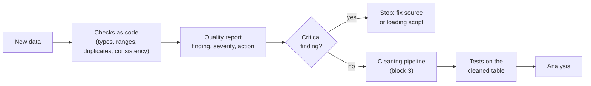
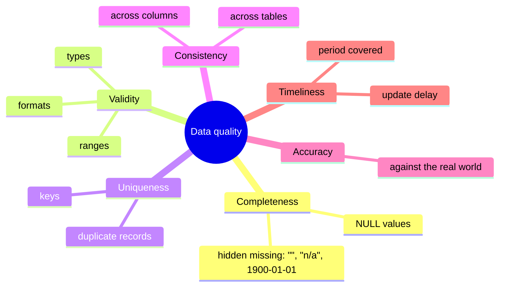
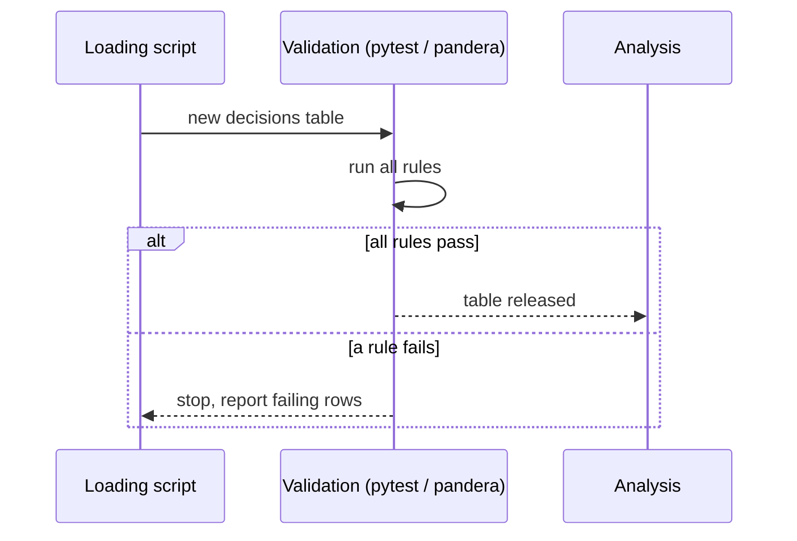

# Data quality: dimensions, checks and validation rules as tests

This page covers the first block of the session. Before any analysis, we need to know whether the data can be trusted: are values missing, out of range, duplicated or contradictory? We first name the **dimensions** of data quality, then write **checks** for types, ranges, duplicates and consistency as code, and finally turn the checks into **validation rules** that run automatically as tests. The practice task is a data quality report for the BTI decisions of the case study ([workbook 03](../workbooks/03-case-study-quality-report.ipynb)).



## Dimensions of data quality

### Concept

**Data quality** describes how well data fit their intended use. The same dataset can be good enough for one question and useless for another. Six **dimensions** are commonly used to structure the assessment (they appear, with small variations, in ISO/IEC 25012 and in the guidance of statistical offices such as the European Statistical System):

| Dimension | Question | Example in the BTI decisions |
|---|---|---|
| **Completeness** | Are required values present? | keywords missing for 0.4 % of decisions; 510 end dates are the placeholder 1900-01-01 |
| **Validity** | Do values have the right type, format and range? | a heading has four digits; 1,040 CN codes have only 4 or 6 instead of 8 |
| **Uniqueness** | Is each real-world entity recorded once? | 14,175 descriptions repeat an earlier one (ignoring case and spaces), mostly renewals |
| **Consistency** | Do related values agree, within and across tables? | the CN code starts with the heading; a valid decision has no invalidation reason; the heading exists in the nomenclature (51 decisions fail) |
| **Accuracy** | Do values describe reality correctly? | is the heading the correct classification? Customs later invalidated 4,487 training decisions as incorrectly classified (code 64) |
| **Timeliness** | Are data recent enough for the question? | training decisions end in December 2023; the nomenclature is the 2022 version |

A worked example by hand. Five rows of a decision table (invented references):

| bti_reference | heading | cn_code | language | end_date |
|---|---|---|---|---|
| DE-1 | 9503 | 95030075 | de | 2026-05-09 |
| DE-2 | 9503 | | de | 2026-06-01 |
| FR-1 | 6403 | 64041990 | fr | 2025-01-31 |
| DE-1 | 9503 | 95030075 | de | 2026-05-09 |
| PL-1 | 3926 | 39261000 | PL | 1900-01-01 |

Completeness: the CN code is missing in 1 of 5 rows (20 %), and the end date 1900-01-01 is a hidden missing value. Validity: `PL` is not a lower-case language code. Uniqueness: DE-1 appears twice. Consistency: FR-1 has heading 6403, but its CN code starts with 6404.



### Why it matters

Naming the dimension tells you how to look for a problem and what to do about it. Without a systematic list, checks depend on what the analyst happens to notice, and whole classes of problems (duplicates, contradictions between tables) go unseen. Data problems also propagate: a duplicated record inflates every count derived from it, and a wrong unit distorts every model that uses the variable.

### How it works in Python

A first overview of completeness, including *hidden* missing values (empty strings and placeholder dates), for the training decisions:

```python
import pandas as pd

decisions = pd.read_parquet("case-study/data/train.parquet")
overview = pd.DataFrame({
    "null": decisions.isna().mean(),
    "empty_string": decisions.apply(lambda s: s.eq("").mean() if s.dtype == object else 0.0),
}).round(4)
print(overview[overview.sum(axis=1) > 0])
#                        null  empty_string
# invalidation_reason  0.8539           0.0
# keywords             0.0041           0.0
print(decisions["end_date"].dt.year.value_counts().sort_index().head(3).to_dict())
# {1900: 510, 2017: 1192, 2018: 2081}: 510 decisions "end" in 1900
```

`end_date` has no NULL values, yet 510 of its values are not dates of the real world: `isna()` alone would report the column as complete. The 85 % missing invalidation reasons are a different case: a decision that is still valid or ran its normal three years has no reason. Such **structural missingness** is not a defect, but it must be documented, and it must not be imputed.

### In practice

- **Public Health England** under-reported about 16,000 positive COVID-19 tests in October 2020 because files were processed with an old Excel format limited to 65,536 rows: a completeness failure that a simple row-count check would have revealed.
- **NASA's Mars Climate Orbiter** was lost in 1999 because one software component produced impulse values in pound-force seconds while another expected newton-seconds: a consistency failure between two systems.
- **Eurostat** publishes quality reports for European statistics that assess dimensions such as relevance, accuracy, timeliness, coherence and comparability, following the ESS Quality Assurance Framework.

> [!WARNING]
> Missing values hide in many forms: empty strings, `"n/a"`, `"-"`, `"unknown"`, `0` for an unknown price, `1900-01-01` for an unknown date, `-999` in survey data. Look at the most frequent values of each column (`value_counts().head()`) before trusting `isna()`.

## Checks for types, ranges, duplicates and consistency

### Concept

A **check** is a rule that every row (or the table as a whole) should satisfy, written so that a program can evaluate it. Four groups of checks cover most problems:

- **Type checks**: each column has the expected data type (integer, text, date, boolean). A heading stored as a number (`901` instead of `"0901"`) or a date stored as text (`"05/06/2023"`) signals a loading problem.
- **Range and domain checks**: values lie in an allowed range (start dates within the collection period, end date not before the start date) or come from an allowed set (`status ∈ {VALID, INVALID}`), and codes follow their format (four digits for a heading).
- **Uniqueness checks**: keys are unique (`bti_reference`), and real-world entities are not recorded twice. Exact duplicate rows, duplicate keys and *near* duplicates (same content, different id: a renewed decision with the same description) are different problems.
- **Consistency checks**: rules that relate columns (`chapter` is the first two digits of `heading`; a valid decision has no invalidation reason) or tables (every `decisions.heading` exists in `nomenclature`).

Each finding gets a **severity**: *critical* (a key or hard rule is broken; the data cannot be used as they are), *major* (many rows or a central variable; must be handled before analysis), *minor* (document it; handle it when it matters).

### Why it matters

Checks written as code can be rerun after every data update, reviewed by colleagues and compared over time. A check that produces a count ("510 rows fail") is more useful than one that only says "fail": the count tells you whether the problem is an exception or a pattern.

### How it works in Python

Checks on the decisions, each returning the number of failing rows:

```python
import pandas as pd

decisions = pd.read_parquet("case-study/data/train.parquet")
nomenclature = pd.read_parquet("case-study/data/nomenclature.parquet")

checks = {
    # validity: formats and ranges
    "heading not four digits":             (~decisions["heading"].str.fullmatch(r"\d{4}")).sum(),
    "CN code not eight digits":            (~decisions["cn_code"].str.fullmatch(r"\d{8}")).sum(),
    "start date outside 2017-2023":        (~decisions["start_date"].between("2017-01-01", "2023-12-31")).sum(),
    "end date before start date":          (decisions["end_date"] < decisions["start_date"]).sum(),
    "description shorter than 20":         decisions["description"].str.len().lt(20).sum(),
    # uniqueness
    "bti_reference duplicated":            decisions["bti_reference"].duplicated().sum(),
    "description duplicated":              decisions["description"].duplicated().sum(),
    # consistency
    "CN code does not start with heading": (decisions["cn_code"].str[:4] != decisions["heading"]).sum(),
    "valid, but invalidation reason":      (decisions["status"].eq("VALID") & decisions["invalidation_reason"].notna()).sum(),
    "heading unknown (foreign key)":       (~decisions["heading"].isin(nomenclature["heading"])).sum(),
}
print(pd.Series(checks, name="n_failed").to_string())
# heading not four digits                    0
# CN code not eight digits                1040
# start date outside 2017-2023               0
# end date before start date               510
# description shorter than 20               69
# bti_reference duplicated                   0
# description duplicated                 11556
# CN code does not start with heading        0
# valid, but invalidation reason             0
# heading unknown (foreign key)             51
```

A count is the start of an investigation, not its end. The 510 decisions that "end before they start" turn out to be one pattern:

```python
import pandas as pd

decisions = pd.read_parquet("case-study/data/train.parquet")
early = decisions["end_date"] < decisions["start_date"]
print(decisions.loc[early, ["end_date", "invalidation_reason"]].value_counts().to_string())
# end_date    invalidation_reason
# 1900-01-01  55                     510
counts = decisions["description"].value_counts()
print(counts.head(3).rename(lambda t: t[:45].replace("\n", " ")).to_string())
# SQL{DECODE(NVL([NEU],0), 1, NVL('[WARENBESCHR    63
# Wendeschneidplatten  - nicht gefasste und unt    38
# Antragsangaben: Hundefutter in Aufmachung für    34
```

All of them are annulled decisions (invalidation code 55 in the Commission's BTI guidance) with the placeholder end date 1900-01-01: not typing errors but a convention of the database, so the right treatment is "set to missing", not "correct the year". The most frequent description is not a description at all but the text of a database template; with small variants it appears in 73 German decisions of 2017–2020, under 35 different headings. The next ones are renewals: the same product, decided again.

### In practice

- **Statistical offices** run *editing rules* on survey returns, for example "age < 15 and marital status = married" or "turnover reported in euros instead of thousands of euros", before any estimate is published.
- **Amazon** described *Deequ*, its library for "unit tests for data", which computes completeness, uniqueness and range checks on large tables before they are used (Schelter et al., 2018).
- **Laboratory medicine** uses plausibility limits and *delta checks* (a large change from the patient's previous result) to hold back implausible results for review before they reach a physician.

> [!CAUTION]
> Do not "fix" a failing check by changing the data by hand in a spreadsheet. Every correction belongs in the cleaning code, with a reason (block 3). Otherwise the next data update brings the problem back and nobody knows why the numbers changed.

> [!TIP]
> Severity depends on the question. 73 template descriptions are irrelevant for counting decisions per country, but they matter for text classification. Record the finding once and decide per use.

## Validation rules as tests

### Concept

A **validation rule** is a check that must pass before data are used; if it fails, the pipeline stops. Writing validation rules as **tests** reuses the tools of software engineering (Session 2): a test is a small function that **asserts** a condition, and a test runner such as **pytest** runs all tests and reports which fail.

Two styles are common:

1. **Plain pandas + pytest**: each rule is a test function with an `assert`. Known, accepted problems are marked as *expected failures* (`@pytest.mark.xfail(reason=...)`), which documents them without breaking the run.
2. **A schema library** such as **pandera**: the expected structure of a DataFrame (columns, types, checks per column, uniqueness of column combinations) is declared once as a **schema**. `schema.validate(df, lazy=True)` checks everything and returns a table of all failures.



Rules should be **specific** (one property per rule), **quantified** ("at most 1 % missing" rather than "few missing") and **versioned** with the code, so that a change of a rule is visible in the history.

### Why it matters

Data change: a new download, a new year, a changed export format. Tests catch the change at the moment it happens rather than when a stakeholder asks why a number looks odd. They also make expectations explicit for the whole team: the test file is the written contract for what "valid data" means.

### How it works in Python

Rules as pytest tests (excerpt from [`workbooks/quality/test_bti_quality.py`](../workbooks/quality/test_bti_quality.py)). Run them with `uv run --with pytest pytest sessions/04-data-quality/workbooks/quality -v`:

```python
import pandas as pd
import pytest


@pytest.fixture(scope="module")
def decisions():
    return pd.read_parquet("case-study/data/train.parquet")


def test_bti_reference_is_primary_key(decisions):
    assert decisions["bti_reference"].is_unique


def test_cn_code_starts_with_heading(decisions):
    assert (decisions["cn_code"].str[:4] == decisions["heading"]).all()


@pytest.mark.xfail(strict=True, reason="known: 510 annulled decisions carry the placeholder end date 1900-01-01")
def test_raw_end_not_before_start(decisions):
    assert (decisions["end_date"] >= decisions["start_date"]).all()

# pytest output: ..x  (2 passed, 1 xfailed)
```

The same kind of rules as a pandera schema; `lazy=True` collects all failures instead of stopping at the first:

```python
# pandera is part of the course environment (otherwise: uv run --with pandera python ...)
import pandas as pd
import pandera.pandas as pa

decisions = pd.read_parquet("case-study/data/train.parquet")
schema = pa.DataFrameSchema(
    {
        "bti_reference": pa.Column(str, unique=True),
        "heading": pa.Column(str, pa.Check.str_matches(r"^\d{4}$")),
        "cn_code": pa.Column(str, pa.Check.str_matches(r"^\d{8}$")),
        "status": pa.Column(str, pa.Check.isin(["VALID", "INVALID"])),
        "description": pa.Column(str, pa.Check(lambda s: ~s.str.upper().str.contains("SQL{", regex=False),
                                               error="database template")),
        "end_date": pa.Column("datetime64[ns]", pa.Check.ge(pd.Timestamp("2017-01-01"))),
    },
    unique=["description", "heading", "issuing_country", "start_date"],   # the same decision twice?
)
try:
    schema.validate(decisions, lazy=True)
except pa.errors.SchemaErrors as err:
    print(err.failure_cases.groupby(["column", "check"]).size())
# cn_code          str_matches('^\d{8}$')                            1040
# description      database template                                   73
#                  multiple_fields_uniqueness                       11151
# end_date         greater_than_or_equal_to(2017-01-01 00:00:00)      510
# heading          multiple_fields_uniqueness                       11151
# issuing_country  multiple_fields_uniqueness                       11151
# start_date       multiple_fields_uniqueness                       11151
```

The uniqueness rule reports 11,151 rows: all rows involved in 3,959 groups of decisions with the same description, heading, country and start date, not only the 7,192 "extra" rows that `duplicated()` counts. Such groups are typically one product filed in several variants (colours, sizes) on the same day.

### In practice

- **Google** built TensorFlow Data Validation into its machine-learning platform after finding that data errors were a major cause of failures in production models; it infers a schema from training data and checks every new batch against it (Breck et al., 2019).
- **dbt**, a tool for SQL data pipelines used in many analytics teams, ships with `unique`, `not_null`, `accepted_values` and `relationships` tests that run after every transformation.
- **pandera** was presented at the SciPy conference in 2020 (Bantilan, 2020) and is used to validate DataFrames in scientific and industrial pipelines; workbook 01 is its official introduction notebook.

> [!IMPORTANT]
> A test suite that always passes because nobody runs it protects nothing. Run the data tests in the same place as the code tests: locally before committing, and in continuous integration (Session 2) when the data are small enough or a sample is available.

> [!WARNING]
> Use `xfail` only for documented, accepted problems, and with `strict=True`: then pytest also complains when the problem disappears, so that the test can be turned into a normal test.

## Check your understanding

1. Assign each finding to a dimension: (a) 1,273 decisions have no keywords; (b) the same description was decided twice on the same day by the same country; (c) a decision's chapter differs from the first two digits of its heading; (d) the training decisions end in 2023 but the model must classify decisions of 2025.
2. Why does `decisions["end_date"].isna().mean()` return 0, although 510 end dates carry no information?
3. Write a range check and a consistency check for the `start_date` column of the decisions.
4. What is the difference between a check that fails and a test marked `xfail`? When is `xfail` appropriate?
5. pandera reports 11,151 failing rows for the four-column uniqueness rule, while `duplicated()` counts 7,192. Explain the difference.

## Further reading

- Schelter, S., Lange, D., Schmidt, P., Celikel, M., Biessmann, F., & Grafberger, A. (2018). Automating large-scale data quality verification. *Proceedings of the VLDB Endowment*, 11(12), 1781–1794. https://doi.org/10.14778/3229863.3229867
- Breck, E., Polyzotis, N., Roy, S., Whang, S. E., & Zinkevich, M. (2019). Data validation for machine learning. *Proceedings of MLSys 2019*. https://mlsys.org/Conferences/2019/doc/2019/167.pdf
- Bantilan, N. (2020). pandera: Statistical data validation of pandas dataframes. *Proceedings of the 19th Python in Science Conference*, 116–124. https://doi.org/10.25080/Majora-342d178e-010
- pandera documentation. https://pandera.readthedocs.io/
