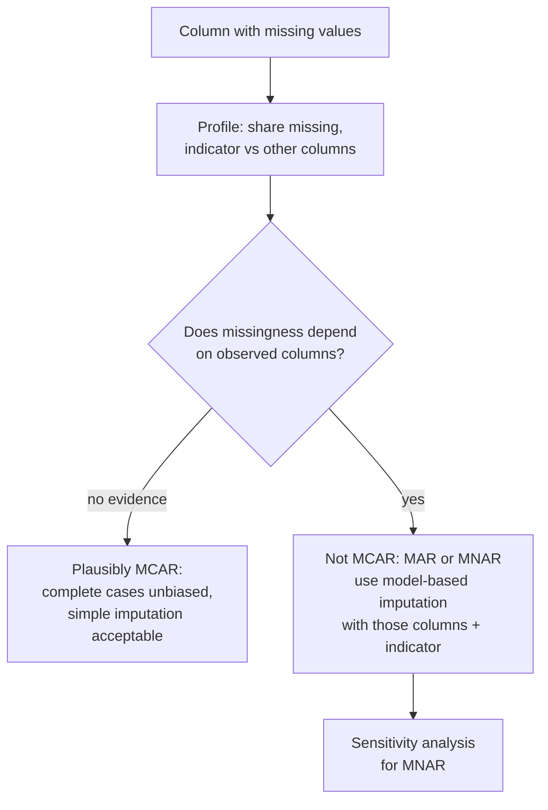
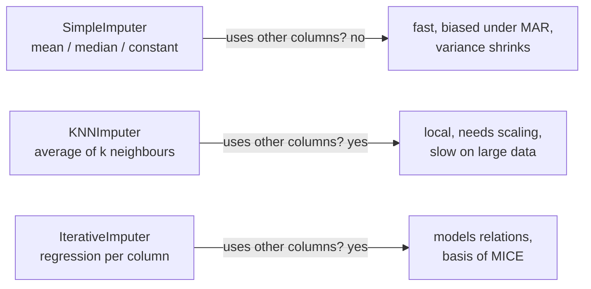

# Missing values and univariate outliers

This page covers the second block. Missing values are the most common data quality problem, and how to handle them depends on *why* they are missing. We introduce the three missing-data mechanisms (MCAR, MAR, MNAR), compare simple, KNN and iterative imputation, add missing-value indicators, and finish with three rules for detecting outliers in a single variable: the IQR rule, the z-score and the median absolute deviation. The statistical theory belongs to the statistics module; here we choose, run and interpret the methods. The examples use the second course dataset, the Berlin listings of Inside Airbnb (snapshot of 26 June 2026, CC BY 4.0; prepare it with `uv run python case-study/prepare_airbnb.py`), because missing prices, missing ratings and extreme prices are real and consequential there. The practice question is whether a missing price is related to the number of reviews, and how well imputation recovers hidden values ([workbook 08](../workbooks/08-case-study-airbnb-missing-and-outliers.ipynb)).



## Missing data mechanisms (MCAR, MAR, MNAR)

### Concept

Rubin (1976) classified the reasons for missing values into three **mechanisms**:

- **MCAR (missing completely at random):** whether a value is missing is unrelated to any variable, observed or not, like a coin flip. The rows with a value are a random subsample of all rows.
- **MAR (missing at random):** missingness depends only on variables we observe. Example: younger respondents skip the income question more often, and we know their age.
- **MNAR (missing not at random):** missingness depends on the missing value itself, or on something we do not observe. Example: people with high incomes skip the income question.

The consequences differ:

| Mechanism | Complete-case analysis (drop incomplete rows) | What helps |
|---|---|---|
| MCAR | unbiased, only fewer rows | any reasonable method |
| MAR | biased | imputation or weighting that uses the observed variables |
| MNAR | biased | assumptions or additional data; sensitivity analysis |

The data alone cannot prove MCAR or MAR. They can, however, show that MCAR is **implausible**: if the share of missing values differs between groups of an observed variable, missingness is not completely random.

A small example by hand. Five people, income missing for two:

| age | income |
|---|---|
| 25 | ? |
| 30 | ? |
| 45 | 4,000 |
| 50 | 4,200 |
| 60 | 4,500 |

The two missing values belong to the youngest people. If income rises with age, the mean of the observed incomes (4,233) overestimates the true mean: complete-case analysis is biased. Because age is observed, the pattern is consistent with MAR, and a model of income given age can correct the bias.

### Why it matters

The mechanism decides which treatment is valid. Dropping rows or filling in the mean is harmless under MCAR and misleading under MAR and MNAR, and in real data MCAR is the exception. Many published analyses report results on complete cases without asking who is missing.

### How it works in Python

A simulation with a known truth makes the three mechanisms visible:

```python
import numpy as np
import pandas as pd

rng = np.random.default_rng(1)
n = 10_000
age = rng.normal(45, 12, n)
income = 1_000 + 60 * age + rng.normal(0, 500, n)            # monthly income rises with age
sim = pd.DataFrame({"age": age, "income": income})
print(round(sim["income"].mean()))                            # 3686: the true mean

mcar = rng.random(n) < 0.3                                    # a coin flip for every row
mar = rng.random(n) < np.where(age < 40, 0.6, 0.1)            # depends on the observed age
mnar = rng.random(n) < np.where(income > 4000, 0.6, 0.1)      # depends on income itself

for name, miss in [("MCAR", mcar), ("MAR", mar), ("MNAR", mnar)]:
    observed = sim.loc[~miss]
    print(name, round(miss.mean(), 2), round(observed["income"].mean()), round(observed["age"].mean(), 1))
# MCAR 0.3  3681 44.8   <- unbiased, only fewer rows
# MAR  0.27 3877 47.9   <- biased, but the observed ages show why
# MNAR 0.28 3459 42.4   <- biased, and nothing observed explains it fully
```

On the Airbnb listings, a **missingness indicator** (1 = missing) compared across groups shows that missing prices are not MCAR:

```python
import pandas as pd

listings = pd.read_parquet("case-study/data/airbnb/listings.parquet")
listings["price_missing"] = listings["price"].isna()
print(round(listings["price_missing"].mean(), 3))                              # 0.339
recent = pd.cut(listings["number_of_reviews_ltm"], [-1, 0, 2, 10, 10_000], labels=["0", "1-2", "3-10", ">10"])
print(listings.groupby(recent, observed=True)["price_missing"].mean().round(3).to_dict())
# {'0': 0.601, '1-2': 0.218, '3-10': 0.16, '>10': 0.062}   <- reviews in the last 12 months

blocked = listings["availability_365"].eq(0)                                   # no free night in the next year
print(listings.groupby(blocked)["price_missing"].mean().round(3).to_dict())    # {False: 0.091, True: 0.999}
active = listings[~blocked]
print(active.groupby(active["number_of_reviews_ltm"].eq(0))["price_missing"].mean().round(3).to_dict())
# {False: 0.042, True: 0.2}   <- even among bookable listings, no recent reviews -> more missing prices
```


A third of the listings have no price, and listings without a review in the last twelve months lack one ten times as often as busy listings. Taken alone, this suggests "missing prices go with few reviews". The left panel shows the third variable behind it. Inside Airbnb reads the price from the listing page for a bookable date; a listing with **no free night** in the next year shows no price at all (99.9 % missing), and such listings also collect few reviews. Among listings that can be booked, the gap remains (20 % against 4 %): dormant listings often show no price. Availability and recent reviews are observed, so MAR given these variables is a reasonable working assumption; whether a dormant host would charge more or less than others (MNAR) cannot be decided from these data. The right panel shows the extreme case, **structural missingness**: the review score is missing exactly for the 2,573 listings without any review. There is no rating to recover; "no reviews yet" is information in itself. The same holds for the price of a blocked listing.

### In practice

- **Clinical trials**: patients who drop out because of side effects or lack of effect create MNAR data; the European Medicines Agency's *Guideline on missing data in confirmatory clinical trials* (2010) requires sensitivity analyses for this reason.
- **Household surveys**: income is among the items with the highest non-response; the US Census Bureau imputes missing income in the Current Population Survey with a *hot-deck* method that copies values from similar respondents.
- **Electronic health records**: a laboratory value is missing because the test was not ordered, and tests are ordered for patients the physician considers at risk; the fact that a value is missing is itself informative.

> [!CAUTION]
> "The data are missing at random" is an assumption, not a finding. You can show evidence *against* MCAR, but you cannot test MAR against MNAR with the observed data. State the assumption and, for important conclusions, check how results change under a plausible MNAR scenario.

## Simple, KNN and iterative imputation

### Concept

**Imputation** replaces missing values by estimates, so that methods that need complete data can run. scikit-learn offers three families:

- **`SimpleImputer`** fills each column with one number: the mean, the median, the most frequent value or a constant. Fast, but it ignores all other columns and shrinks the variance: every imputed row gets the same value.
- **`KNNImputer`** fills a value with the average of the *k* most similar rows (the **nearest neighbours**), measured on the columns that are observed. Variables must be on comparable scales, so standardise them first.
- **`IterativeImputer`** models each column with missing values as a regression on the other columns, fills the gaps with the predictions, and cycles through the columns until the estimates stabilise. This is the idea of **MICE** (multiple imputation by chained equations, van Buuren).

**Single** imputation produces one completed dataset and treats imputed values as if they were measured, which understates uncertainty. **Multiple imputation** creates several completed datasets with random variation, analyses each and combines the results with Rubin's rules; it is the standard for statistical inference (available in `statsmodels.imputation.mice`).



### Why it matters

Most scikit-learn models refuse missing values. Dropping incomplete rows throws away data and, under MAR, introduces bias. An imputer that uses the related variables can remove much of that bias, but only if the related variables carry information about the missing ones.

### How it works in Python

On the MAR simulation from above, where income depends on the observed age:

```python
import numpy as np
import pandas as pd
from sklearn.experimental import enable_iterative_imputer  # noqa: F401
from sklearn.impute import IterativeImputer, KNNImputer, SimpleImputer

rng = np.random.default_rng(1)
n = 10_000
age = rng.normal(45, 12, n)
income = 1_000 + 60 * age + rng.normal(0, 500, n)
rng.random(n)                                                # keep the random stream as above (MCAR draw)
mar = rng.random(n) < np.where(age < 40, 0.6, 0.1)
X = pd.DataFrame({"age": age, "income": income})
X.loc[mar, "income"] = np.nan

for imputer in [SimpleImputer(strategy="median"), KNNImputer(n_neighbors=10),
                IterativeImputer(random_state=0)]:
    filled = imputer.fit_transform(X)[:, 1]
    rmse = np.sqrt(np.mean((filled[mar] - income[mar]) ** 2))
    print(f"{type(imputer).__name__:17s} mean {filled.mean():.0f}  RMSE {rmse:.0f}")
# SimpleImputer     mean 3877  RMSE 1079   <- mean still biased, large error
# KNNImputer        mean 3691  RMSE 521
# IterativeImputer  mean 3690  RMSE 496    <- uses age; recovers the true mean (3686)
```

On the Airbnb listings, `bedrooms` is missing for 27 % of the listings. Workbook 08 takes the 8,081 entire homes with a known number of bedrooms, hides 30 % of the values and imputes them from the number of guests and the distance to the centre. The number of guests is strongly related to the number of bedrooms (r = 0.73), and the imputers that use it roughly halve the error: RMSE 0.87 bedrooms for the mean, 1.02 for the median, 0.62 for KNN, 0.59 for the iterative imputer, and 0.64 for a one-line domain rule (median bedrooms of homes for the same number of guests), which is easier to explain than the iterative imputer and almost as good. Imputation works here because a related variable carries the information; it cannot create information that the other variables do not contain.

### In practice

- **Official statistics**: census and survey offices impute item non-response, for example with hot-deck methods, and document the share of imputed values in their quality reports.
- **Epidemiology**: multiple imputation with chained equations is a standard way to handle missing covariates in cohort studies; Sterne et al. (2009, *BMJ*) give widely used guidance on reporting it.
- **Machine learning in production**: the imputer is fitted on the training data and stored with the model, so that new data are filled with the same values (Session 9 builds such pipelines).

> [!WARNING]
> Fit the imputer on the training data only, then apply it to validation and test data. Fitting it on all rows lets the test rows influence the imputed values, a form of data leakage (Session 7).

> [!CAUTION]
> Never impute the **target** variable of a model and then evaluate on it. And do not impute a value that is missing *by definition* (a review score for a listing without reviews, the price of a listing with no bookable night, a "date of death" for a living patient); use a category or an indicator instead.

> [!TIP]
> **Keep track of what was imputed.** Imputation hides the fact that a value was missing. `SimpleImputer(add_indicator=True)` (also `KNNImputer` and `IterativeImputer`) appends a 0/1 column that is 1 where the value was missing, so a model can still use that information. It helps when missingness is informative: in the listings, a missing rating means no reviews yet, and those listings have much longer minimum stays (median 92 nights against 2).
>
> ```python
> imp = SimpleImputer(strategy="median", add_indicator=True).fit(listings[["bedrooms", "review_scores_rating"]])
> print(imp.get_feature_names_out().tolist())
> # ['bedrooms', 'review_scores_rating', 'missingindicator_bedrooms', 'missingindicator_review_scores_rating']
> ```

## Univariate outliers (IQR rule, z-score, median absolute deviation)

### Concept

An **outlier** is an observation that lies far from the bulk of the data. A **univariate** rule looks at one variable at a time. Three rules are standard:

- **IQR rule (Tukey's fences):** flag values below Q1 − 1.5·IQR or above Q3 + 1.5·IQR, where Q1 and Q3 are the 25th and 75th percentiles and IQR = Q3 − Q1 is the **interquartile range**. This is the rule behind the whiskers of a boxplot.
- **z-score:** z = (x − mean) / SD measures the distance from the mean in standard deviations; |z| > 3 is a common cut-off.
- **Robust z-score with the median absolute deviation (MAD):** MAD = median(|x − median|), and z* = 0.6745·(x − median) / MAD. Iglewicz and Hoaglin (1993) suggest flagging |z*| > 3.5. The factor 0.6745 makes z* comparable with z for normally distributed data.

The z-score has a weakness called **masking**: the outliers inflate the mean and the SD that are used to detect them, so they can hide themselves. Median, quartiles and MAD are **robust**: a few extreme values barely move them.

A worked example by hand with the values 2, 3, 3, 4, 4, 5, 40:

- Q1 = 3, Q3 = 4.5, IQR = 1.5; upper fence 4.5 + 2.25 = 6.75 → 40 is flagged.
- mean = 8.7, SD = 13.8; z(40) = 2.3 → *not* flagged with |z| > 3 (masking).
- median = 4, MAD = median(2, 1, 1, 0, 0, 1, 36) = 1; z*(40) = 0.6745·36/1 = 24.3 → flagged.

All three rules assume one dense centre. For **skewed** variables such as prices, apply them on a log scale. For a variable with **two clusters** (the minimum stay of Airbnb listings: 1–3 nights or exactly 92 nights) or with **mostly identical values**, the MAD is tiny or 0 and the robust rule flags a whole cluster or breaks down.

### Why it matters

Extreme values change means, standard deviations, correlations and regression lines, and some models (linear models, k-nearest neighbours, PCA) are very sensitive to them. At the same time, extreme cases are often the interesting ones: the luxury flat, the hostel dormitory, the fraudulent transaction. A flag is a question, not a verdict: a **data error** (typo, unit mix-up, duplicated record) is corrected or removed; a **genuine extreme value** is kept and handled by the method (log transformation, robust statistics, an indicator).

### How it works in Python

```python
import numpy as np
import pandas as pd

listings = pd.read_parquet("case-study/data/airbnb/listings.parquet")
price = listings["price"].dropna()                     # EUR per night, 8,441 listings

q1, q3 = price.quantile([0.25, 0.75])
upper = q3 + 1.5 * (q3 - q1)
print(upper, round((price > upper).mean(), 3))         # 409.5 0.043  (IQR rule)

z = (price - price.mean()) / price.std()
print(round((z.abs() > 3).mean(), 3))                  # 0.006        (z-score: mean 161, SD 205)

mad = (price - price.median()).abs().median()
robust_z = 0.6745 * (price - price.median()) / mad
print(round((robust_z.abs() > 3.5).mean(), 3))         # 0.027        (MAD rule)

# on the log scale the rules flag both tails
log_p = np.log10(price)
q1, q3 = log_p.quantile([0.25, 0.75])
low, high = log_p < q1 - 1.5 * (q3 - q1), log_p > q3 + 1.5 * (q3 - q1)
print(low.sum(), high.sum())                           # 288 26: most flags are very LOW prices

# who are the low prices?
print(round((listings.loc[listings["price"] < 15, "minimum_nights"] >= 28).mean(), 2))   # 0.98: medium-term

nights = listings["minimum_nights"].dropna()           # minimum stay: two clusters
print(nights.median(), (nights - nights.median()).abs().median(), round((nights == 92).mean(), 3))
# 3.0 2.0 0.296: MAD = 2 nights, so every 92-night minimum gets a robust z of 29
print((listings["maximum_nights"] == 2**31 - 1).sum())  # 2: the largest 32-bit integer, a software default
```


On the raw scale, the IQR rule flags 4.3 % of the prices, all of them high: a consequence of the skewed distribution, not of errors. The z-score flags only 0.6 %, because the extreme prices inflate the standard deviation to €205 (masking). On the log scale, the picture turns around: most flags are very **low** prices, and the histogram has a second peak around €20. Looking at the flagged rows pays off. Almost all prices under €15 belong to listings with a minimum stay of at least 28 nights (most often exactly 92): an entire flat for about €23 a night is far below any holiday price in Berlin, so the price field of these **medium-term** listings is not comparable with short-stay prices. That is not an outlier to delete one by one but a different population, which later sessions analyse separately. At the top, a few listings ask several thousand euros a night (maximum €10,025 for a loft for seven guests), implausible for their size; they may be typing errors or prices that block bookings. Others are genuine: houseboats for 12 to 16 guests ask €1,800 to €4,500. For the minimum stay, a domain rule ("28 nights or more = medium-term") works better than any statistical fence, and in `maximum_nights` two listings carry 2,147,483,647, the largest 32-bit integer: a software default, not a stay.

### In practice

- **NIST/SEMATECH e-Handbook of Statistical Methods** recommends the modified z-score of Iglewicz and Hoaglin for outlier labelling, and describes formal tests such as Grubbs' test for normally distributed data.
- **Official statistics**: statistical offices run *selective editing*, in which survey returns with extreme values relative to the respondent's history are checked by staff before publication, because a single unit error can move an aggregate.
- **Web analytics**: sessions from bots produce page counts far above any human visitor; analytics providers filter known bots before conversion rates are computed.

> [!CAUTION]
> Do not delete outliers automatically. Look at the flagged rows first. Removing genuine extreme values makes the data look tidier and the conclusions wrong; for example, seven in ten listings above the IQR fence of €410 sleep six or more guests: removing them removes much of the market for families and groups.

> [!WARNING]
> With large samples, |z| > 3 is not rare: for 300,000 normally distributed values, about 810 would exceed it by chance. A flag rate tells you about the shape of the distribution as much as about errors.

## Check your understanding

1. In a customer survey, satisfaction is missing more often for customers who cancelled their contract. Which mechanism is plausible, and why can the data not settle it?
2. Why does mean imputation reduce the standard deviation of a variable? Which analyses are affected?
3. When is a missing-value indicator useful even if the imputed value itself is poor?
4. For the values 1, 2, 2, 3, 3, 3, 4, 50, compute the IQR fences and the robust z-score of 50. Which rule flags it?
5. Why does the MAD rule flag more than a third of all minimum stays, and what would you do instead?

## Further reading

- van Buuren, S. (2018). *Flexible Imputation of Missing Data* (2nd ed.). Chapman & Hall/CRC. Free online: https://stefvanbuuren.name/fimd/
- scikit-learn developers. *Imputation of missing values* (user guide, section 7.4). https://scikit-learn.org/stable/modules/impute.html
- NIST/SEMATECH. *e-Handbook of Statistical Methods*, section 1.3.5.17 "Detection of outliers". https://www.itl.nist.gov/div898/handbook/eda/section3/eda35h.htm
- Rubin, D. B. (1976). Inference and missing data. *Biometrika*, 63(3), 581–592. https://doi.org/10.1093/biomet/63.3.581
