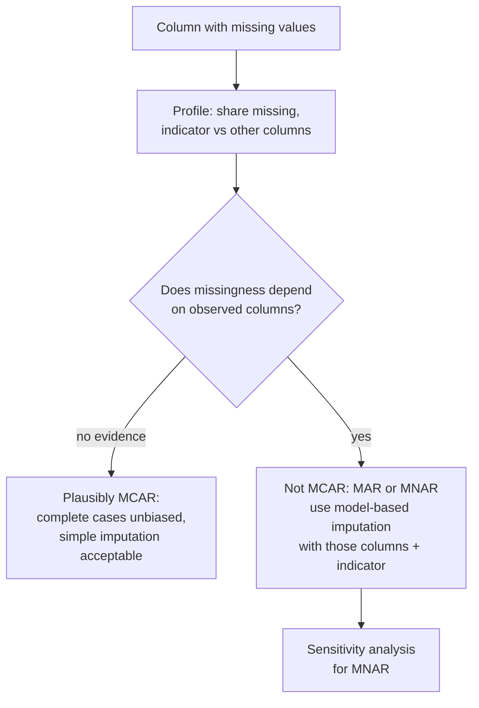
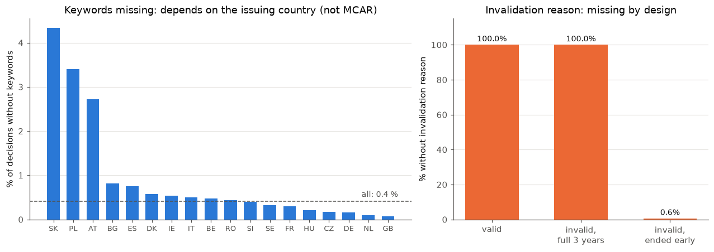
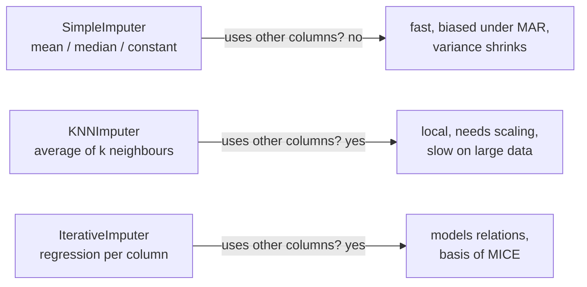
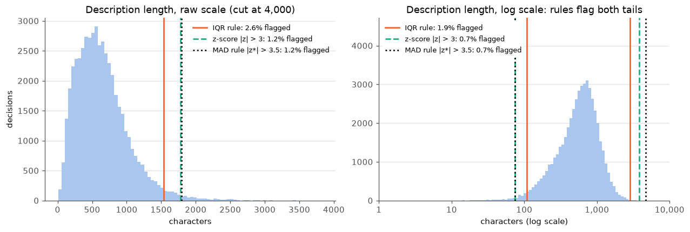

# Missing values and univariate outliers

This page covers the second block. Missing values are the most common data quality problem, and how to handle them depends on *why* they are missing. We introduce the three missing-data mechanisms (MCAR, MAR, MNAR), compare simple, KNN and iterative imputation, add missing-value indicators, and finish with three rules for detecting outliers in a single variable: the IQR rule, the z-score and the median absolute deviation. The statistical theory belongs to the statistics module; here we choose, run and interpret the methods. The practice question is whether a missing keyword list is related to the issuing country, the language or the year, and how well imputation recovers hidden values ([workbook 08](../workbooks/08-case-study-missing-keywords.ipynb)).



## Missing data mechanisms (MCAR, MAR, MNAR)

### Concept

Rubin (1976) classified the reasons for missing values into three **mechanisms**:

- **MCAR (missing completely at random):** whether a value is missing is unrelated to any variable, observed or not, like a coin flip. The rows with a value are a random subsample of all rows.
- **MAR (missing at random):** missingness depends only on variables we observe. Example: younger respondents skip the income question more often, and we know their age.
- **MNAR (missing not at random):** missingness depends on the missing value itself, or on something we do not observe. Example: people with high incomes skip the income question.

The consequences differ:

| Mechanism | Complete-case analysis (drop incomplete rows) | What helps |
|---|---|---|
| MCAR | unbiased, only fewer rows | any reasonable method |
| MAR | biased | imputation or weighting that uses the observed variables |
| MNAR | biased | assumptions or additional data; sensitivity analysis |

The data alone cannot prove MCAR or MAR. They can, however, show that MCAR is **implausible**: if the share of missing values differs between groups of an observed variable, missingness is not completely random.

A small example by hand. Five people, income missing for two:

| age | income |
|---|---|
| 25 | ? |
| 30 | ? |
| 45 | 4,000 |
| 50 | 4,200 |
| 60 | 4,500 |

The two missing values belong to the youngest people. If income rises with age, the mean of the observed incomes (4,233) overestimates the true mean: complete-case analysis is biased. Because age is observed, the pattern is consistent with MAR, and a model of income given age can correct the bias.

### Why it matters

The mechanism decides which treatment is valid. Dropping rows or filling in the mean is harmless under MCAR and misleading under MAR and MNAR, and in real data MCAR is the exception. Many published analyses report results on complete cases without asking who is missing.

### How it works in Python

A simulation with a known truth makes the three mechanisms visible:

```python
import numpy as np
import pandas as pd

rng = np.random.default_rng(1)
n = 10_000
age = rng.normal(45, 12, n)
income = 1_000 + 60 * age + rng.normal(0, 500, n)            # monthly income rises with age
sim = pd.DataFrame({"age": age, "income": income})
print(round(sim["income"].mean()))                            # 3686: the true mean

mcar = rng.random(n) < 0.3                                    # a coin flip for every row
mar = rng.random(n) < np.where(age < 40, 0.6, 0.1)            # depends on the observed age
mnar = rng.random(n) < np.where(income > 4000, 0.6, 0.1)      # depends on income itself

for name, miss in [("MCAR", mcar), ("MAR", mar), ("MNAR", mnar)]:
    observed = sim.loc[~miss]
    print(name, round(miss.mean(), 2), round(observed["income"].mean()), round(observed["age"].mean(), 1))
# MCAR 0.3  3681 44.8   <- unbiased, only fewer rows
# MAR  0.27 3877 47.9   <- biased, but the observed ages show why
# MNAR 0.28 3459 42.4   <- biased, and nothing observed explains it fully
```

On the case-study data, a **missingness indicator** (1 = missing) compared across groups shows that missing keyword lists are not MCAR:

```python
import pandas as pd

decisions = pd.read_parquet("case-study/data/train.parquet")
decisions["keywords_missing"] = decisions["keywords"].isna()
by_country = decisions.groupby("issuing_country")["keywords_missing"].agg(["mean", "size"])
print(by_country.query("size >= 1000").sort_values("mean", ascending=False)["mean"].head(4).round(4).to_string())
# issuing_country
# SK    0.0433
# PL    0.0340
# AT    0.0271
# BG    0.0081
print(by_country.loc[["DE", "FR"], "mean"].round(4).to_string())
# DE    0.0016
# FR    0.0029
print(decisions.groupby(decisions["start_date"].dt.year)["keywords_missing"].mean().round(4).to_dict())
# {2017: 0.0074, 2018: 0.0098, 2019: 0.0019, 2020: 0.0013, 2021: 0.0032, 2022: 0.0027, 2023: 0.0016}
```



Only 0.4 % of the keyword lists are missing, but a Slovak decision is 27 times as likely to have none as a German one, and 2017–2018 have more gaps than later years. The issuing office and its practice in a given year explain much of the pattern, which makes MAR a reasonable working assumption; whether a list is also missing *because of* the product (MNAR) cannot be decided from these data. The right panel shows a second kind of missing value. The invalidation reason is missing for 85 % of the decisions **by design**: valid decisions and decisions that ran their three years have none. This **structural missingness** is not a mechanism to correct; it is information in itself, for example as a variable "ended early".

### In practice

- **Clinical trials**: patients who drop out because of side effects or lack of effect create MNAR data; the European Medicines Agency's *Guideline on missing data in confirmatory clinical trials* (2010) requires sensitivity analyses for this reason.
- **Household surveys**: income is among the items with the highest non-response; the US Census Bureau imputes missing income in the Current Population Survey with a *hot-deck* method that copies values from similar respondents.
- **Electronic health records**: a laboratory value is missing because the test was not ordered, and tests are ordered for patients the physician considers at risk; the fact that a value is missing is itself informative.

> [!CAUTION]
> "The data are missing at random" is an assumption, not a finding. You can show evidence *against* MCAR, but you cannot test MAR against MNAR with the observed data. State the assumption and, for important conclusions, check how results change under a plausible MNAR scenario.

## Simple, KNN and iterative imputation

### Concept

**Imputation** replaces missing values by estimates, so that methods that need complete data can run. scikit-learn offers three families:

- **`SimpleImputer`** fills each column with one number: the mean, the median, the most frequent value or a constant. Fast, but it ignores all other columns and shrinks the variance: every imputed row gets the same value.
- **`KNNImputer`** fills a value with the average of the *k* most similar rows (the **nearest neighbours**), measured on the columns that are observed. Variables must be on comparable scales, so standardise them first.
- **`IterativeImputer`** models each column with missing values as a regression on the other columns, fills the gaps with the predictions, and cycles through the columns until the estimates stabilise. This is the idea of **MICE** (multiple imputation by chained equations, van Buuren).

**Single** imputation produces one completed dataset and treats imputed values as if they were measured, which understates uncertainty. **Multiple imputation** creates several completed datasets with random variation, analyses each and combines the results with Rubin's rules; it is the standard for statistical inference (available in `statsmodels.imputation.mice`).



### Why it matters

Most scikit-learn models refuse missing values. Dropping incomplete rows throws away data and, under MAR, introduces bias. An imputer that uses the related variables can remove much of that bias, but only if the related variables carry information about the missing ones.

### How it works in Python

On the MAR simulation from above, where income depends on the observed age:

```python
import numpy as np
import pandas as pd
from sklearn.experimental import enable_iterative_imputer  # noqa: F401
from sklearn.impute import IterativeImputer, KNNImputer, SimpleImputer

rng = np.random.default_rng(1)
n = 10_000
age = rng.normal(45, 12, n)
income = 1_000 + 60 * age + rng.normal(0, 500, n)
rng.random(n)                                                # keep the random stream as above (MCAR draw)
mar = rng.random(n) < np.where(age < 40, 0.6, 0.1)
X = pd.DataFrame({"age": age, "income": income})
X.loc[mar, "income"] = np.nan

for imputer in [SimpleImputer(strategy="median"), KNNImputer(n_neighbors=10),
                IterativeImputer(random_state=0)]:
    filled = imputer.fit_transform(X)[:, 1]
    rmse = np.sqrt(np.mean((filled[mar] - income[mar]) ** 2))
    print(f"{type(imputer).__name__:17s} mean {filled.mean():.0f}  RMSE {rmse:.0f}")
# SimpleImputer     mean 3877  RMSE 1079   <- mean still biased, large error
# KNNImputer        mean 3691  RMSE 521
# IterativeImputer  mean 3690  RMSE 496    <- uses age; recovers the true mean (3686)
```

On the case-study data, workbook 08 hides 30 % of the known numbers of keywords and imputes them from simple description features (length, digits, lines, German or not). The features say little about the number of keywords (correlations of 0.24 and below), and model-based imputers barely beat the mean: RMSE 2.29 keywords for the mean, 2.22 for KNN, 2.20 for the iterative imputer, and 2.15 for the median of decisions with the same heading. Imputation cannot create information that the other variables do not contain.

### In practice

- **Official statistics**: census and survey offices impute item non-response, for example with hot-deck methods, and document the share of imputed values in their quality reports.
- **Epidemiology**: multiple imputation with chained equations is a standard way to handle missing covariates in cohort studies; Sterne et al. (2009, *BMJ*) give widely used guidance on reporting it.
- **Machine learning in production**: the imputer is fitted on the training data and stored with the model, so that new data are filled with the same values (Session 9 builds such pipelines).

> [!WARNING]
> Fit the imputer on the training data only, then apply it to validation and test data. Fitting it on all rows lets the test rows influence the imputed values, a form of data leakage (Session 7).

> [!CAUTION]
> Never impute the **target** variable of a model and then evaluate on it. And do not impute a value that is missing *by definition* (an invalidation reason for a valid decision, a "date of death" for a living patient); use a category or an indicator instead.

## Missing-value indicators

### Concept

Imputation hides the fact that a value was missing. A **missing-value indicator** is an extra 0/1 column that records it: 1 where the original value was missing. In scikit-learn, `MissingIndicator` creates the indicators, and `SimpleImputer(add_indicator=True)` (also `KNNImputer` and `IterativeImputer`) appends them to the imputed columns.

By hand: numbers of keywords `[4, ?, 8]` with median imputation become `[4, 6, 8]` and the indicator `[0, 1, 0]`. A model can now learn "decisions without keywords behave differently", which the imputed 6 alone would hide.

### Why it matters

When missingness is informative (not MCAR), the indicator carries signal: in the case study, a missing keyword list goes with particular issuing countries and with shorter descriptions. For tree-based models (Session 10), an indicator, or simply leaving the value missing for models that support it, is often better than any imputed value.

### How it works in Python

```python
import numpy as np
import pandas as pd
from sklearn.impute import SimpleImputer

decisions = pd.read_parquet("case-study/data/train.parquet")
X = pd.DataFrame({
    "n_keywords": decisions["keywords"].str.split(",").str.len(),   # NaN where keywords are missing
    "log_chars": np.log(decisions["description"].str.len()),
})

imp = SimpleImputer(strategy="median", add_indicator=True).fit(X)
out = pd.DataFrame(imp.transform(X), columns=imp.get_feature_names_out())
print(out.columns.tolist())
# ['n_keywords', 'log_chars', 'missingindicator_n_keywords']
print(imp.statistics_.round(2), out["missingindicator_n_keywords"].mean().round(4))   # [6.   6.38] 0.0041

# does the indicator relate to the length of the description?
print(decisions.groupby(decisions["keywords"].isna())["description"].apply(lambda s: s.str.len().median()).to_string())
# keywords
# False    588.0
# True     479.0
```

### In practice

- **Credit scoring**: "no previous loan" or a missing income field is kept as its own category or indicator, because the absence of information carries risk information.
- **Clinical prediction models** that use routinely collected data often include indicators for tests that were not ordered; the decision not to test reflects the physician's assessment.
- **scikit-learn's gradient boosting** (`HistGradientBoostingClassifier`) handles missing values natively by learning on which side of a split they belong, which is an internal form of the indicator idea.

> [!TIP]
> Add indicators by default when missingness is not obviously MCAR. A model can ignore a useless indicator; it cannot recover information that imputation has removed.

## Univariate outliers (IQR rule, z-score, median absolute deviation)

### Concept

An **outlier** is an observation that lies far from the bulk of the data. A **univariate** rule looks at one variable at a time. Three rules are standard:

- **IQR rule (Tukey's fences):** flag values below Q1 − 1.5·IQR or above Q3 + 1.5·IQR, where Q1 and Q3 are the 25th and 75th percentiles and IQR = Q3 − Q1 is the **interquartile range**. This is the rule behind the whiskers of a boxplot.
- **z-score:** z = (x − mean) / SD measures the distance from the mean in standard deviations; |z| > 3 is a common cut-off.
- **Robust z-score with the median absolute deviation (MAD):** MAD = median(|x − median|), and z* = 0.6745·(x − median) / MAD. Iglewicz and Hoaglin (1993) suggest flagging |z*| > 3.5. The factor 0.6745 makes z* comparable with z for normally distributed data.

The z-score has a weakness called **masking**: the outliers inflate the mean and the SD that are used to detect them, so they can hide themselves. Median, quartiles and MAD are **robust**: a few extreme values barely move them.

A worked example by hand with the values 2, 3, 3, 4, 4, 5, 40:

- Q1 = 3, Q3 = 4.5, IQR = 1.5; upper fence 4.5 + 2.25 = 6.75 → 40 is flagged.
- mean = 8.7, SD = 13.8; z(40) = 2.3 → *not* flagged with |z| > 3 (masking).
- median = 4, MAD = median(2, 1, 1, 0, 0, 1, 36) = 1; z*(40) = 0.6745·36/1 = 24.3 → flagged.

All three rules assume one dense centre. For **skewed** variables such as text lengths, apply them on a log scale; for a variable where **most values are identical** (the validity of a BTI decision is three years for most decisions), the MAD is 0 and the robust rule breaks down.

### Why it matters

Extreme values change means, standard deviations, correlations and regression lines, and some models (linear models, k-nearest neighbours, PCA) are very sensitive to them. At the same time, extreme cases are often the interesting ones: the very long technical description, the decision revoked after a few days, the fraudulent transaction. A flag is a question, not a verdict: a **data error** (typo, unit mix-up, duplicated record) is corrected or removed; a **genuine extreme value** is kept and handled by the method (log transformation, robust statistics, an indicator).

### How it works in Python

```python
import numpy as np
import pandas as pd

decisions = pd.read_parquet("case-study/data/train_sample.parquet")
length = decisions["description"].str.len()          # characters per description

q1, q3 = length.quantile([0.25, 0.75])
upper = q3 + 1.5 * (q3 - q1)
print(upper, round((length > upper).mean(), 3))       # 1540.0 0.026  (IQR rule)

z = (length - length.mean()) / length.std()
print(round((z.abs() > 3).mean(), 3))                 # 0.012         (z-score)

mad = (length - length.median()).abs().median()
robust_z = 0.6745 * (length - length.median()) / mad
print(round((robust_z.abs() > 3.5).mean(), 3))        # 0.012         (MAD rule)

# on the log scale the rules flag both tails
log_len = np.log10(length)
q1, q3 = log_len.quantile([0.25, 0.75])
print(round(((log_len < q1 - 1.5 * (q3 - q1)) | (log_len > q3 + 1.5 * (q3 - q1))).mean(), 3))   # 0.019

days = (decisions["end_date"] - decisions["start_date"]).dt.days   # validity: mostly exactly 3 years
days = days[decisions["end_date"].dt.year > 1900]                  # without the placeholder dates
print((days - days.median()).abs().median(), days.quantile([0.01, 0.05, 0.5, 1.0]).tolist())
# 0.0 [53.0, 358.0, 1095.0, 1095.0]: the MAD is 0, the robust rule breaks down
```



On the raw scale, the IQR rule flags 2.6 % of the descriptions, all of them long ones: a consequence of the skewed distribution, not of errors. On the log scale, the rules flag between 0.7 % and 1.9 % in both tails: descriptions of a few characters and descriptions of several thousand. Looking at the flagged rows pays off: among the shortest are "TEST" (with the keyword TEST) and the Italian "prova" (*test*), test entries that reached the public database, while the longest are genuine technical descriptions of conveyor systems (workbook 08). For the validity duration, a rule from the domain works better than any statistical fence: a decision is valid for three years, so "shorter than 1,094 days" means "ended early", and an early end without an invalidation reason (274 decisions) is the real anomaly.

### In practice

- **NIST/SEMATECH e-Handbook of Statistical Methods** recommends the modified z-score of Iglewicz and Hoaglin for outlier labelling, and describes formal tests such as Grubbs' test for normally distributed data.
- **Official statistics**: statistical offices run *selective editing*, in which survey returns with extreme values relative to the respondent's history are checked by staff before publication, because a single unit error can move an aggregate.
- **Web analytics**: sessions from bots produce page counts far above any human visitor; analytics providers filter known bots before conversion rates are computed.

> [!CAUTION]
> Do not delete outliers automatically. Look at the flagged rows first. Removing genuine extreme values makes the data look tidier and the conclusions wrong; for example, removing very long descriptions removes many of the most detailed technical decisions, which are among the hardest to classify.

> [!WARNING]
> With large samples, |z| > 3 is not rare: for 309,529 normally distributed values, about 840 would exceed it by chance. A flag rate tells you about the shape of the distribution as much as about errors.

## Check your understanding

1. In a customer survey, satisfaction is missing more often for customers who cancelled their contract. Which mechanism is plausible, and why can the data not settle it?
2. Why does mean imputation reduce the standard deviation of a variable? Which analyses are affected?
3. When is a missing-value indicator useful even if the imputed value itself is poor?
4. For the values 1, 2, 2, 3, 3, 3, 4, 50, compute the IQR fences and the robust z-score of 50. Which rule flags it?
5. Why does the MAD rule fail for the validity duration of the decisions, and what would you do instead?

## Further reading

- van Buuren, S. (2018). *Flexible Imputation of Missing Data* (2nd ed.). Chapman & Hall/CRC. Free online: https://stefvanbuuren.name/fimd/
- scikit-learn developers. *Imputation of missing values* (user guide, section 7.4). https://scikit-learn.org/stable/modules/impute.html
- NIST/SEMATECH. *e-Handbook of Statistical Methods*, section 1.3.5.17 "Detection of outliers". https://www.itl.nist.gov/div898/handbook/eda/section3/eda35h.htm
- Rubin, D. B. (1976). Inference and missing data. *Biometrika*, 63(3), 581–592. https://doi.org/10.1093/biomet/63.3.581
