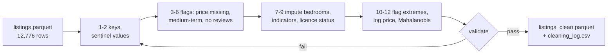
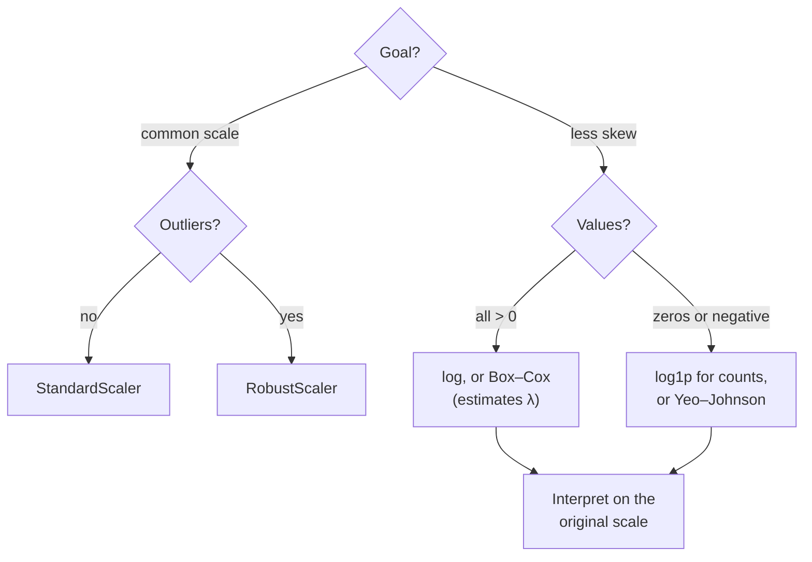
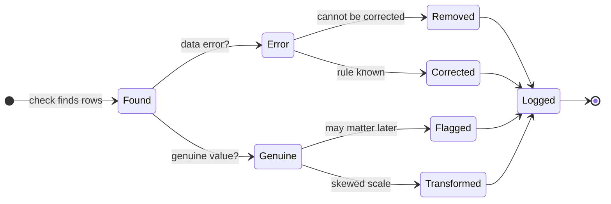

# Multivariate outliers, transformations and a documented cleaning pipeline

This page covers the third block. Some observations are unusual only in the *combination* of their values; the **Mahalanobis distance** finds them. Skewed variables are made more symmetric with the logarithm, Box–Cox or Yeo–Johnson transformations, and variables on different scales are brought to a common scale. Finally, all decisions are combined into a **cleaning pipeline** that is code, runs in one go and writes a log of every decision. The practice task produces the cleaned table of Berlin Airbnb listings with a log of every cleaning decision ([workbook 15](../workbooks/15-case-study-airbnb-cleaned-listings.ipynb)). Model-based outlier detection (Isolation Forest, local outlier factor) follows in Session 11.



## Multivariate outliers with the Mahalanobis distance

### Concept

A **multivariate outlier** is unusual in the combination of variables, not necessarily in any single one. A person who is 192 cm tall is not unusual, nor is a weight of 55 kg; a person who is both is.

The **Mahalanobis distance** measures how far a point x lies from the centre μ of the data, in units that take into account the spread of each variable and the correlation between them (the **covariance matrix** Σ):

d(x) = √((x − μ)ᵀ Σ⁻¹ (x − μ))

If the variables are uncorrelated and standardised, it is the ordinary (Euclidean) distance in standard deviations. If they are correlated, moving *along* the correlation is cheap and moving *against* it is expensive: the points of equal distance form an ellipse aligned with the data. For roughly normal data with p variables, d² follows a **chi-square distribution** with p degrees of freedom, which gives a cut-off: for p = 2 and a 99.9 % quantile, d² > 13.8.

The mean and covariance are themselves distorted by outliers (masking, as for the z-score). The **minimum covariance determinant** estimator (MCD, `sklearn.covariance.MinCovDet`, Rousseeuw 1984) estimates them from the most concentrated subset of about half the data, so that a group of outliers cannot pull the centre and stretch the ellipse towards itself.

A small example by hand with two standardised, uncorrelated variables: the point (2, 2) has Euclidean distance √8 = 2.83. If the variables have correlation 0.8, the same point lies *along* the correlation, and its Mahalanobis distance is √(8 / 1.8) = 2.11; the point (2, −2), *against* the correlation, has √(8 / 0.2) = 6.32.


### Why it matters

Many data errors and many interesting cases show up only in combinations: a plausible age with an implausible diagnosis, a normal transaction amount at an unusual time, a normal nightly price for a flat that sleeps sixteen. Univariate rules miss them. The robust version matters because real data often contain a *group* of anomalies (a batch of mis-coded records), which would otherwise widen the classical ellipse until it no longer flags them.

### How it works in Python

```python
import numpy as np
from scipy.stats import chi2
from sklearn.covariance import EmpiricalCovariance, MinCovDet

rng = np.random.default_rng(0)
height = rng.normal(172, 9, 500)                                 # cm
weight = 0.9 * height - 85 + rng.normal(0, 6, 500)               # kg, correlated with height
X = np.vstack([np.column_stack([height, weight]),
               [[192, 55]],                                       # row 500: tall and light
               np.column_stack([rng.normal(150, 3, 25), rng.normal(95, 4, 25)])])  # a contaminating group

z = (X[500] - X.mean(axis=0)) / X.std(axis=0)
print(z.round(1))                                                # [ 2.1 -1.4]: each variable alone |z| < 3

cut = chi2.ppf(0.999, df=2)                                      # 13.8
for est in [EmpiricalCovariance().fit(X), MinCovDet(random_state=0).fit(X)]:
    d2 = est.mahalanobis(X)                                      # squared distances
    print(f"{type(est).__name__:19s} d(row 500) = {np.sqrt(d2[500]):.1f}  "
          f"group flagged: {(d2[501:] > cut).sum()}/25  all flagged: {(d2 > cut).sum()}")
# EmpiricalCovariance d(row 500) = 3.2  group flagged: 17/25  all flagged: 17
# MinCovDet           d(row 500) = 6.4  group flagged: 25/25  all flagged: 28
```

With the classical estimate, the contaminating group pulls the centre and inflates the covariance: the tall, light person has d = 3.2, below the cut-off √13.8 = 3.7, and is not flagged, and 8 of the 25 group points also escape. With the MCD estimate, the person (d = 6.4) and the whole group are flagged, plus two ordinary points in the tails. The figure above shows the two ellipses.

On the Airbnb listings with a comparable short-stay price, workbook 15 computes the distance on the log price and the log number of guests. The classical estimate flags 62 listings, the robust one 94 (1.4 %). The flagged combinations are of two kinds: entire homes whose price is implausible for their size (a flat for one guest at €760, a house for five and a loft for seven guests at €8,000 and €10,025), and shared rooms for seven to sixteen guests at €25 to €46 a night, which are hostel dormitories and perfectly genuine. A multivariate flag is a question, not a verdict. The distance assumes one elliptical cloud. If a feature is bimodal, or two kinds of listings with different price levels are mixed, the robust estimate fits the larger group and can flag the whole smaller group as outliers; look at a scatter plot before you trust the flags.

### In practice

- **Industrial process monitoring** uses Hotelling's T² chart, a Mahalanobis distance from the in-control centre, to detect machine states where every sensor is within its limits but the combination is not.
- **Payment fraud detection** screens card transactions for combinations of amount, merchant type, place and time that are unusual for the cardholder; distance-based scores are one of the classical building blocks.
- **Chemometrics**: near-infrared spectroscopy calibrations in the food and pharmaceutical industries use Mahalanobis distances to detect samples that lie outside the calibration set before a prediction is trusted.

> [!WARNING]
> The Mahalanobis distance assumes one roughly elliptical cloud. With strongly skewed variables, transform them first (next section); with several clusters or many zeros, use the model-based methods of Session 11. With many variables relative to rows, the covariance estimate becomes unstable.

> [!CAUTION]
> MCD needs a covariance matrix that is not singular. A variable that is constant in more than half of the rows (for example `bedrooms` among entire homes, where 62 % have exactly one bedroom) makes MCD fail or give meaningless distances. Leave such variables out or transform them first.

## Transformations (logarithm, Box–Cox, Yeo–Johnson, scaling)

### Concept

A **transformation** applies the same function to every value of a variable. Two goals are common: making a skewed distribution more symmetric, and bringing variables to comparable scales.

**Logarithm.** log(x) turns multiplicative differences into additive ones: 10 → 100 → 1,000 become equally spaced. It compresses the long right tail of prices, incomes and text lengths. It requires x > 0; for counts with zeros, log(1 + x) (`np.log1p`) is used.

**Box–Cox** (Box and Cox, 1964) is a family of power transformations with a parameter λ, estimated from the data so that the result is as close to normal as possible:

y = (x^λ − 1) / λ for λ ≠ 0, and y = log(x) for λ = 0.

λ = 1 leaves the shape unchanged, λ = 0.5 is close to a square root, λ = 0 is the logarithm. Box–Cox requires x > 0.

**Yeo–Johnson** (Yeo and Johnson, 2000) extends the idea to zero and negative values, which suits counts and differences.

**Scaling** changes the unit but not the shape:

| Scaler | Formula | Use |
|---|---|---|
| `StandardScaler` | (x − mean) / SD | default for linear models, PCA, k-nearest neighbours |
| `MinMaxScaler` | (x − min) / (max − min) | bounded inputs, e.g. for neural networks |
| `RobustScaler` | (x − median) / IQR | data with outliers |

A worked example by hand: nightly prices of €50, €500 and €5,000. Their mean is €1,850, dominated by the most expensive. Their base-10 logarithms are 1.7, 2.7 and 3.7, with mean 2.7, corresponding to a typical price of 10^2.7 = €500 (the geometric mean).



### Why it matters

Many methods work better, or only as intended, with roughly symmetric variables on similar scales: linear regression assumes errors of constant spread (Session 6), distance-based methods treat one unit of each variable as equally important, and PCA (Session 11) is dominated by the variable with the largest variance. Outlier rules and the Mahalanobis distance also assume a symmetric centre. Transforming before analysing often turns "outliers" into ordinary tail values.

### How it works in Python

```python
import numpy as np
import pandas as pd
from scipy.stats import boxcox, skew
from sklearn.preprocessing import PowerTransformer, RobustScaler, StandardScaler

listings = pd.read_parquet("case-study/data/airbnb/listings.parquet")
price = listings["price"].dropna()                          # all > 0: Box-Cox is possible

transformed, lam = boxcox(price)
print(round(lam, 2), round(skew(price), 1), round(skew(np.log(price)), 2), round(skew(transformed), 2))
# 0.23 22.5 -0.68 0.04   <- the log over-corrects (skew to the left); Box-Cox finds lambda = 0.23

# the same with scikit-learn, which stores lambda for new data
pt = PowerTransformer(method="box-cox").fit(price.to_frame())
print(pt.lambdas_.round(2))                                  # [0.23]

reviews = listings[["number_of_reviews"]]                    # 20 % zeros: Yeo-Johnson or log1p
yj = PowerTransformer(method="yeo-johnson").fit(reviews)
print(round(skew(reviews["number_of_reviews"]), 1), round(skew(np.log1p(reviews["number_of_reviews"])), 2),
      round(skew(yj.transform(reviews).ravel()), 2))
# 5.4 0.17 0.04

X = listings.loc[price.index, ["price", "accommodates", "number_of_reviews"]]
print(StandardScaler().fit_transform(X).std(axis=0).round(2))   # [1. 1. 1.]
print(RobustScaler().fit(X).scale_)                             # IQR of each column: [135.   2.  80.]
```


The raw price has a skewness of 22.5, driven by a few prices in the thousands. The plain logarithm over-corrects (skewness −0.68), and Box–Cox with λ = 0.23, between the logarithm and a fourth root, brings the skewness to 0.04. The figure shows why a skewness near zero is not the end of the story: the transformed histogram has **two peaks**, and the Q–Q plot bends where they meet. The smaller peak is the medium-term listings of [page 2](02-missing-values-and-univariate-outliers.md#univariate-outliers-iqr-rule-z-score-median-absolute-deviation), a different population that no transformation can merge with the rest. For the number of reviews, with 20 % zeros, Yeo–Johnson and log1p both remove most of the skew.

### In practice

- **Economics**: wages, firm sizes and house prices are usually analysed on the log scale; a coefficient on log wages reads as an approximate percentage difference, which is the convention of the Mincer earnings equation.
- **Laboratory medicine**: reference intervals for skewed analytes, such as many hormone and enzyme concentrations, are often computed after a log or Box–Cox transformation, as described in the CLSI guideline EP28.
- **Machine-learning pipelines**: `PowerTransformer` and `StandardScaler` are fitted on training data inside a scikit-learn `Pipeline` and stored with the model (workbooks 10 and 11).

> [!WARNING]
> Fit transformations (λ, mean, SD, median, IQR) on the training data and apply them to the test data unchanged. Estimating λ on all data is a mild form of data leakage.

> [!CAUTION]
> Results on a transformed scale must be translated back for the reader. The back-transformed mean of log values is the geometric mean, not the arithmetic mean: exp(mean(log price)) is not the average price. Say which one you report.

## A documented cleaning pipeline

### Concept

A **cleaning pipeline** is a fixed sequence of steps that turns the raw table into the analysis table. It is **documented** when every step records:

- the **rule** (what was looked for),
- the **number of rows affected**,
- the **action** (remove, correct, flag, transform, impute, keep),
- the **reason** (why this action and not another).

The record of all steps is the **cleaning log**. Together with the code, it lets anyone reproduce the cleaned table from the raw data and understand every difference between them.

Typical decisions for the Airbnb listings, with the counts from workbook 15:

| Step | Rule | Rows | Action | Reason |
|---|---|---|---|---|
| 1 | duplicated listing id | 0 | remove | one row per listing |
| 2 | `maximum_nights` = 2,147,483,647 | 2 | set to missing | a software default, not a stay |
| 3 | price missing; no free night in the next year | 4,335 | keep missing, add indicators | structural; nothing to impute |
| 4 | minimum stay of 28 nights or more | 4,480 | flag `medium_term` | price not comparable with short stays |
| 5 | minimum stay above 365 nights | 10 | flag | not a holiday rental; inspect |
| 6 | review scores missing | 2,573 | keep missing, add indicator | structural: no reviews yet |
| 7 | bedrooms missing | 3,420 | impute (1 for rooms; median for the same number of guests), flag | rule as good as the iterative imputer |
| 8 | beds or bathrooms missing | 6,739 | keep missing, add indicators | too many gaps to impute credibly |
| 9 | licence field | 31 | keep `license_status`, flag registration numbers not in the official format, drop the raw field | the analysis needs only the status |
| 10–12 | extreme price for the room type; skewed price; unusual price for the number of guests | 67 / all / 94 | flag; add `log_price`; flag | inspect, do not delete |

Step 9 is a data-protection decision as much as a cleaning one. Inside Airbnb collects the data from public listing pages, and in the original file the licence field of many hosts contains their name or the name of their company; `prepare_airbnb.py` already replaces such entries by a category (`private host name`, `legal entity name`, `other`) and adds `license_status`. A registration number still identifies a flat, and the analysis needs only the status, so the raw field does not go into the cleaned table (data minimisation). Berlin requires a registration number for short-term rentals, and an EU regulation on short-term rental data (Regulation (EU) 2024/1028) applies from 20 May 2026; the legal details are not the topic here.



Good practice:

- **Raw data are never changed.** The pipeline reads raw files and writes new ones.
- **Flag rather than delete** when in doubt; a later analysis can filter on the flag.
- **One function per step**, chained with `DataFrame.pipe`, so that steps can be tested and reordered.
- **Validate the result** at the end with the rules of block 1, then save table and log together.

### Why it matters

Cleaning decisions change results. Removing duplicates changes counts; removing extreme prices changes average prices; imputing a value changes every statistic computed from it. If decisions are not recorded, results cannot be reproduced or defended, and different team members clean the same data differently. A documented pipeline is also what reviewers, supervisors and future colleagues ask for first.

### How it works in Python

The pattern of workbook 15, reduced to two steps:

```python
import numpy as np
import pandas as pd

raw = pd.read_parquet("case-study/data/airbnb/listings.parquet")
log = []


def record(step, rule, affected, action, reason, n_rows):
    log.append({"step": step, "rule": rule, "rows_affected": affected,
                "action": action, "reason": reason, "rows_after": n_rows})


def fix_sentinel_max_nights(df):
    out = df.copy()
    sentinel = out["maximum_nights"].eq(2**31 - 1)
    out.loc[sentinel, "maximum_nights"] = np.nan
    record("2", "maximum_nights = 2,147,483,647", int(sentinel.sum()), "set to missing",
           "the largest 32-bit integer is a software default, not a stay", len(out))
    return out


def flag_medium_term(df):
    out = df.copy()
    out["medium_term"] = out["minimum_nights"].ge(28)
    record("4", "minimum stay of 28 nights or more", int(out["medium_term"].sum()), "flag",
           "price not comparable with short stays; analyse separately", len(out))
    return out


clean = raw.pipe(fix_sentinel_max_nights).pipe(flag_medium_term)
assert not clean["maximum_nights"].eq(2**31 - 1).any()            # validate before saving
print(pd.DataFrame(log)[["step", "rows_affected", "action", "rows_after"]].to_string(index=False))
# step  rows_affected         action  rows_after
#    2              2 set to missing       12776
#    4           4480           flag       12776
```

### In practice

- **Clinical trials** keep a *data management plan* and an audit trail: every change to a trial database is logged with who, when and why, as required by good clinical practice (ICH E6).
- The **Reinhart–Rogoff** case (2010/2013) is a frequently cited example of undocumented spreadsheet processing: a replication by Herndon, Ash and Pollin found excluded rows and a spreadsheet error that changed a widely quoted result on public debt and growth.
- **Data engineering teams** keep cleaning steps in version-controlled code (for example dbt models or Python modules) and run the validation tests after each step, so that each published table has a known lineage.

> [!IMPORTANT]
> The cleaned table can be the input of later analyses. Keep the pipeline and the log in your project repository, and regenerate the table with the code rather than copying it around.

> [!TIP]
> Write the reason as if for a colleague who disagrees: "flag medium-term listings and keep them, because they are real offers; exclude them from price models, because their price field is not comparable" can be discussed; "removed outliers" cannot.

## Check your understanding

1. Why can a point be a Mahalanobis outlier although its z-score is below 3 in every variable?
2. Why does the robust (MCD) ellipse in the figure flag the contaminating group while the classical ellipse does not? Why are the flagged hostel dormitories not errors?
3. Box–Cox estimates λ = 0.23 for the price. What does that tell you about the transformation compared with the logarithm, and why can it not be applied to the number of reviews?
4. Which scaler would you choose for a variable with a few extreme values, and why?
5. For each of the following, decide between remove, correct, flag and keep, and write the log entry: (a) a loft for seven guests at €10,025 a night; (a2) a houseboat for 16 guests at €4,458; (b) a shared room for 16 guests at €46 a night; (c) a listing whose minimum stay is 1,125 nights; (d) a listing whose maximum stay is 2,147,483,647 nights.

## Further reading

- Rousseeuw, P. J., & Van Driessen, K. (1999). A fast algorithm for the minimum covariance determinant estimator. *Technometrics*, 41(3), 212–223. https://doi.org/10.1080/00401706.1999.10485670
- Box, G. E. P., & Cox, D. R. (1964). An analysis of transformations. *Journal of the Royal Statistical Society: Series B*, 26(2), 211–252. https://doi.org/10.1111/j.2517-6161.1964.tb00553.x
- Kuhn, M., & Johnson, K. (2019). *Feature Engineering and Selection*, chapter 6 "Engineering numeric predictors" and chapter 8 "Handling missing data". Free online: https://feat.engineering/
- scikit-learn developers. *Preprocessing data* (user guide, section 7.3). https://scikit-learn.org/stable/modules/preprocessing.html
