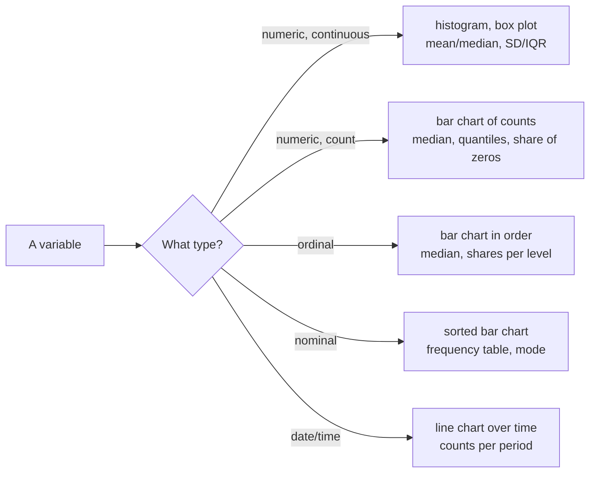

# Describing data by variable type

Exploratory data analysis (EDA) is the first look at a dataset before any test or model: which values occur, how often, and what looks wrong. This page recaps how to describe one variable at a time. The type of the variable decides which summaries and charts make sense, so we start there. Then we cover distributions, centre and spread, robust summaries for skewed data, and frequency tables. All examples use the 50,000-decision sample of the course case study: European Binding Tariff Information (EBTI) decisions, in which a customs authority states the four-digit HS heading of a product described by a trader (see [case-study/README.md](../../../case-study/README.md)). Chart design follows on the [next page](02-chart-design.md).



## Variable types

### Concept

A **variable** is one column of a table: one property measured for every observation (here: every decision). Its **type** decides what arithmetic makes sense.

| Type | Meaning | Case-study example | Sensible summaries |
|---|---|---|---|
| **Nominal** (categorical) | categories without order | `language`, `issuing_country`, `status`, `heading` (1,114 categories) | counts, shares, mode |
| **Ordinal** | categories with an order but no fixed distance | none in the case study; a survey answer from "poor" to "excellent" | counts, shares, median, quantiles |
| **Discrete numeric (count)** | whole numbers from counting | number of keywords, number of digits in the description | median, quantiles, share of zeros, mean with care |
| **Continuous numeric** | measurements on a continuous scale | description length in characters (approximately), validity in days | mean, median, SD, IQR |
| **Date/time** | a point in time | `start_date`, `date_of_issue` | range, counts per day/month |

The heading looks like a number (`3926`) but is a **code**: heading 3926 is not "larger" than heading 3924, and their mean means nothing. The codes are **hierarchical**: the first two digits give the chapter (39, plastics), and chapters belong to one of 21 sections.

A worked example on ordinal data: the mean of the survey answers 1, 5, 5 (1 = poor, 5 = excellent) is 3.67. That number assumes the step from 1 to 2 is as large as the step from 4 to 5. For an answer scale this is a convention, not a fact. The median (5) and the share of "excellent" answers (2 of 3) need no such assumption.

### Why it matters

Software computes a mean for any column of numbers, including postal codes and tariff codes. The type tells you whether the result means anything. It also decides the test you choose later (see the [test decision table](03-comparing-groups-and-tests.md#choosing-a-test-from-a-decision-table)) and how a feature enters a model (Session 6 onwards).

### How it works in Python

```python
import pandas as pd

decisions = pd.read_parquet("case-study/data/train_sample.parquet")
print(decisions[["issuing_country", "language", "start_date", "heading", "description"]].dtypes)
# issuing_country            object   -> nominal (29 countries)
# language                   object   -> nominal (23 languages)
# start_date         datetime64[ns]   -> date/time
# heading                    object   -> nominal code, stored as text: good
# description                object   -> free text; derive numeric variables from it

decisions["n_chars"] = decisions["description"].str.len()                       # continuous (approx.)
decisions["n_keywords"] = decisions["keywords"].str.split(",").str.len()        # count
print(decisions["heading"].nunique(), decisions["chapter"].nunique())          # 934 93 in the sample
```

### In practice

- Survey research distinguishes Likert items (ordinal) from scale scores; the European Social Survey documentation states the measurement level of every variable.
- Official statistics (Eurostat, Destatis) publish median rather than mean income because income is a skewed continuous variable.
- Foreign-trade statistics (Eurostat's Comext database) store the HS and CN product codes as text with leading zeros, because they are nominal codes, not quantities.

> [!WARNING]
> **Numbers that are not quantities.** IDs, postal codes, tariff codes and encoded categories (1 = Berlin, 2 = Hamburg) look like numbers but are nominal. Keep them as strings or `category`; read as integers, heading `0101` becomes `101` and `describe()` reports a meaningless mean.

## Distributions

### Concept

The **distribution** of a variable tells you which values occur and how often. Describe it by three properties:

- **centre**: a typical value (mean, median, mode);
- **spread**: how far values scatter around the centre (standard deviation, interquartile range);
- **shape**: symmetric or **skewed** (a long tail on one side), one peak (unimodal) or several (multimodal), gaps, spikes at round numbers.

A **histogram** cuts the value range into intervals (bins) and draws a bar for the number of observations in each. A **box plot** draws the quartiles as a box, the median as a line and points beyond 1.5 × IQR from the box as individual dots.


Description length is **right-skewed**: most descriptions have a few hundred characters, a few have several thousand. On a linear axis the long tail squeezes the bulk into the first bars. On a **logarithmic axis** equal distances stand for equal ratios (100, 1,000, 10,000 characters), and the shape becomes readable. On the log axis the distribution is slightly skewed the other way: a tail of very short descriptions, many of them in French and English, while German descriptions are long (the box plots in the code below show this).

### Why it matters

Very different datasets can share the same mean and standard deviation. Anscombe's quartet (1973) and the Datasaurus Dozen (Matejka & Fitzmaurice, 2017) are built to show this. A histogram also reveals data problems that summaries hide: impossible values, gaps, spikes at default values.

### How it works in Python

```python
import matplotlib.pyplot as plt
import pandas as pd
import seaborn as sns

decisions = pd.read_parquet("case-study/data/train_sample.parquet")
decisions["n_chars"] = decisions["description"].str.len()
main = decisions[decisions["language"].isin(["de", "fr", "en", "nl", "pl"])]

fig, (left, right) = plt.subplots(1, 2, figsize=(9, 3.5), layout="constrained")
sns.histplot(decisions, x="n_chars", log_scale=True, bins=40, ax=left)          # shape on a log axis
sns.boxplot(main, x="n_chars", y="language", log_scale=True, ax=right)          # one box per group
print(decisions["n_chars"].skew().round(2))         # 1.32: right skew (0 = symmetric)
print((decisions["n_chars"] < 20).sum())            # 12 descriptions under 20 characters: read them
```

### In practice

- Web performance teams (for example in Google's Web Vitals programme) look at the whole distribution of page-load times and report the 75th percentile, because the tail is what users notice.
- Hospital statistics show length of stay as a histogram: most patients leave within days, a few stay for months.
- Insurers study claim-size distributions, where a few large claims dominate the total.

> [!TIP]
> Plot before you summarise. Try two or three bin widths: too few bins hide structure, too many show noise.

## Centre and spread

### Concept

- The **mean** is the sum divided by the count: the balance point of the data. Every value pulls on it, so a long tail drags it towards the tail.
- The **median** is the middle value after sorting: half of the data lie below it.
- The **mode** is the most frequent value; it is the only centre for nominal data.
- The **standard deviation (SD)** is roughly the typical distance from the mean. It squares the distances, so large deviations dominate it.
- The **quartiles** Q1 and Q3 cut off the lowest and highest 25 %. The **interquartile range** IQR = Q3 − Q1 is the width of the middle half.

Worked example with five description lengths: 200, 400, 500, 600, 3,300 characters. The mean is 5,000 / 5 = 1,000, but four of five descriptions are shorter than 601 characters. The median is 500. Remove the 3,300-character description and the mean drops to 425, while the median moves only from 500 to 450.

### Why it matters

A summary that is pulled by a few extreme values misleads every decision built on it. For skewed variables, report the median and IQR (or several quantiles), and give the mean only with this caveat.

### How it works in Python

```python
import pandas as pd

decisions = pd.read_parquet("case-study/data/train_sample.parquet")
decisions["n_chars"] = decisions["description"].str.len()
decisions["n_keywords"] = decisions["keywords"].str.split(",").str.len()
decisions["validity_days"] = (decisions["end_date"] - decisions["start_date"]).dt.days

print(decisions["n_chars"].agg(["mean", "median", "std"]).round(1).to_dict())
# {'mean': 644.1, 'median': 587.0, 'std': 379.0}
q1, q3 = decisions["n_chars"].quantile([0.25, 0.75])
print(q1, q3, q3 - q1)                       # 370.0 838.0 468.0  -> IQR 468 characters
print(decisions[["n_chars", "n_keywords", "validity_days"]].describe().round(1).loc[["mean", "50%", "min", "max"]])
#       n_chars  n_keywords  validity_days
# mean    644.1         6.2          945.3
# 50%     587.0         6.0         1095.0
# min       7.0         1.0       -45175.0
# max    6403.0        39.0         1095.0
```

The validity column already shows a problem: a decision cannot end 45,175 days (124 years) before it starts. Session 4 traced such values to typing errors and placeholder dates.

### In practice

- The EU at-risk-of-poverty threshold is defined as 60 % of the national **median** equivalised income (Eurostat).
- Real-estate portals and statistical offices report median asking rents and house prices.
- Service-level agreements state percentiles (p50, p95, p99) of response times rather than means.

> [!CAUTION]
> **SD on data with errors or bounds.** The validity has mean 945 days and SD 1,782 days, although no decision can be valid for more than three years (1,095 days). "Mean ± 2 SD" would suggest validities from minus 7 to plus 12 years. For skewed, bounded or contaminated variables, describe spread with quantiles instead.

## Robust summaries

### Concept

A statistic is **robust** if a few extreme values cannot move it far. The **breakdown point** is the share of observations you can replace by arbitrary values before the statistic becomes arbitrary: 0 % for the mean (one huge value suffices), 50 % for the median.

Robust alternatives:

- **median** instead of mean;
- **IQR** or the **median absolute deviation (MAD)**, the median of |x − median|, instead of SD;
- the **trimmed mean**, which drops a fixed share (for example 10 %) at each end before averaging;
- **quantiles** (p1, p10, p90) to describe a tail directly.

### Why it matters

Real data contain recording errors, placeholder values and genuine extreme cases. Robust summaries describe the bulk of the data; comparing them with the classical ones shows how much the extremes matter. Session 4 used the same ideas to flag outliers; Session 6 applies them to regression.

### How it works in Python

```python
import pandas as pd
from scipy import stats

decisions = pd.read_parquet("case-study/data/train_sample.parquet")
days = (decisions["end_date"] - decisions["start_date"]).dt.days

print(round(days.mean(), 1), days.median())                 # 945.3 1095.0
print(round(stats.trim_mean(days, 0.1), 1))                 # 1085.4: 10 % cut at each end
print(stats.median_abs_deviation(days))                     # 0.0: most decisions run the full term
print(round((days == 1095).mean(), 3))                      # 0.723: share of the most common value
print(days.quantile([0.01, 0.1, 0.5]).round(1).to_dict())   # {0.01: 45.0, 0.1: 757.9, 0.5: 1095.0}
print((days < 0).sum())                                     # 77 impossible negative durations
```

In plain words: "Most decisions (72 %) run for the full three years; one in ten ends more than 337 days early; 77 of 50,000 have impossible negative durations." Three numbers and a data-quality flag describe the variable better than mean and SD.

### In practice

- Economic statistics use trimmed-mean inflation measures; the Federal Reserve Bank of Dallas publishes a trimmed-mean PCE inflation rate.
- Laboratory medicine derives reference intervals from central percentiles of healthy populations.
- Sports judging (for example in diving and figure skating) has long dropped the highest and lowest scores before averaging.

> [!WARNING]
> A MAD of 0 does not mean "no spread". It means more than half of the values are identical. Always look at the share of the most common value as well.

## Frequency tables

### Concept

For categorical and ordinal variables, the summary is a **frequency table**: the count and the share (relative frequency) of each category. A **cross-tabulation** counts combinations of two categorical variables; it is the starting point for the chi-square test on [page 3](03-comparing-groups-and-tests.md#categorical-data-contingency-tables-chi-square-and-cramérs-v).

Worked example: 28,656 of 50,000 decisions are written in German, a share of 28,656 / 50,000 = 57.3 %.

### Why it matters

Shares make groups of different size comparable; counts show whether a share rests on 10 or 10,000 observations. Report both. For a code such as the heading, add the meaning: a table of "3926, 9503, 6307" is unreadable without the English heading names from the nomenclature table.

### How it works in Python

```python
import pandas as pd

decisions = pd.read_parquet("case-study/data/train_sample.parquet")
nomenclature = pd.read_parquet("case-study/data/nomenclature.parquet")

counts = decisions["language"].value_counts()
shares = decisions["language"].value_counts(normalize=True)
print(pd.DataFrame({"n": counts, "share": shares.round(3)}).head(5))
#               n  share
# language
# de        28656  0.573
# fr         8082  0.162
# en         2615  0.052
# nl         2404  0.048
# pl         1796  0.036

# the five most frequent headings with their English names (join the nomenclature)
top = (decisions["heading"].value_counts().head(5).rename("n").reset_index()
       .merge(nomenclature[["heading", "heading_description"]], on="heading"))
top["heading_description"] = top["heading_description"].str[:45]
print(top.to_string(index=False))
# heading    n                           heading_description
#    3926 2009 Articles of plastics and articles of other ma
#    9503 1424 Tricycles, scooters, pedal cars and similar w
#    6307 1374 Textiles; made up articles n.e.c. in chapter
#    2106 1364 Food preparations not elsewhere specified or
#    4202 1269 Trunks; suit, camera, jewellery, cutlery case

# Cross-tabulation with row shares: language mix per year
decisions["year"] = decisions["start_date"].dt.year
print(pd.crosstab(decisions["year"], decisions["language"], normalize="index")[["de", "fr", "en"]].round(3).loc[[2017, 2020, 2023]])
# language     de     fr     en
# year
# 2017      0.574  0.129  0.085
# 2020      0.548  0.183  0.073
# 2023      0.598  0.167  0.013

# Counts per month (date/time variable)
monthly = decisions.set_index("start_date").resample("MS").size()
print(monthly.idxmax().date(), monthly.max())   # 2017-03-01 881
```

The English share falls from 8.5 % to 1.3 %: the United Kingdom issued decisions until the end of 2020 and none after Brexit.

### In practice

- Customer-satisfaction reports (for example the American Customer Satisfaction Index) publish the share of each response category.
- Election results are frequency tables of votes per party, with counts and percentages.
- Clinical trial publications begin with "Table 1": frequencies and shares of patient characteristics per study arm.

> [!TIP]
> The heading distribution has a **long tail**: the most frequent heading covers 4 % of the decisions, and hundreds of headings appear fewer than ten times. Show the top of such a table and say how many categories are in the tail; Session 8 shows why the tail matters for evaluation.

## Check your understanding

1. Classify `issuing_country`, `heading`, the number of keywords and `start_date` by type and name one sensible summary for each.
2. The mean description length is 644 characters and the median 587. What does this tell you about the shape of the distribution?
3. Why is the SD of the validity (1,782 days) a poor description of its spread? What would you report instead?
4. What is the breakdown point of the median, and what does it mean in plain words?
5. Why should a frequency table of headings include the heading names, and when should it show shares rather than counts?

## Further reading

- Downey, A. B. (2025). *Think Stats: Exploratory Data Analysis in Python* (3rd ed.), chapters 1–4. O'Reilly. Free online: <https://allendowney.github.io/ThinkStats/>
- Wilke, C. O. (2019). *Fundamentals of Data Visualization*, chapter 7 "Visualizing distributions: Histograms and density plots". O'Reilly. <https://clauswilke.com/dataviz/histograms-density-plots.html>
- Poldrack, R. A. (2023). *Statistical Thinking for the 21st Century*, chapter 4 "Summarizing data". <https://statsthinking21.github.io/statsthinking21-core-site/>
- World Customs Organization. *What is the Harmonized System (HS)?* <https://www.wcoomd.org/en/topics/nomenclature/overview/what-is-the-harmonized-system.aspx>
