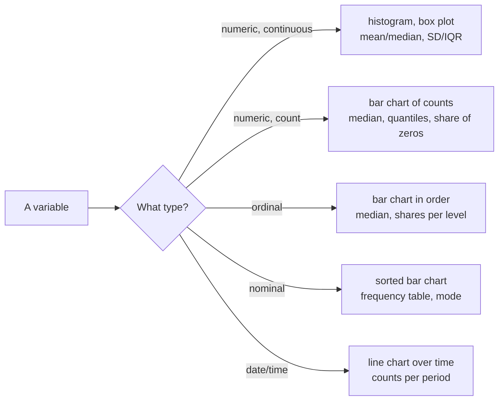

# Describing data by variable type

Exploratory data analysis (EDA) is the first look at a dataset before any test or model: which values occur, how often, and what looks wrong. This page recaps how to describe one variable at a time. The type of the variable decides which summaries and charts make sense, so we start there. Then we cover distributions, centre and spread, robust summaries for skewed data, and frequency tables. All examples use the 50,000-review sample of the course case study. Chart design follows on the [next page](02-chart-design.md).



## Variable types

### Concept

A **variable** is one column of a table: one property measured for every observation (here: every review). Its **type** decides what arithmetic makes sense.

| Type | Meaning | Case-study example | Sensible summaries |
|---|---|---|---|
| **Nominal** (categorical) | categories without order | `label` (neg, neu, pos), `verified_purchase` | counts, shares, mode |
| **Ordinal** | categories with an order but no fixed distance | `rating` (1–5 stars) | counts, shares, median, quantiles |
| **Discrete numeric (count)** | whole numbers from counting | `helpful_vote`, `n_images` | median, quantiles, share of zeros, mean with care |
| **Continuous numeric** | measurements on a continuous scale | price, text length (approximately) | mean, median, SD, IQR |
| **Date/time** | a point in time | `date` | range, counts per day/month |

A worked example: the mean of the ratings 1, 5, 5 is 3.67 stars. That number assumes the step from 1 to 2 stars is as large as the step from 4 to 5. For a star scale this is a convention, not a fact. The median (5 stars) and the share of 5-star reviews (2 of 3) need no such assumption.

### Why it matters

Software computes a mean for any column of numbers, including postal codes and product IDs. The type tells you whether the result means anything. It also decides the test you choose later (see the [test decision table](03-comparing-groups-and-tests.md#choosing-a-test-from-a-decision-table)) and how a feature enters a model (Session 6 onwards).

### How it works in Python

```python
import pandas as pd

reviews = pd.read_parquet("case-study/data/train_sample.parquet")
print(reviews.dtypes)
# rating                 int64   -> ordinal, although stored as integer
# helpful_vote           int64   -> count
# verified_purchase       bool   -> nominal (two categories)
# date          datetime64[ms]   -> date/time
# label                    str   -> nominal (ordered neg < neu < pos, so ordinal is also defensible)

# Make the order of an ordinal variable explicit
reviews["label"] = pd.Categorical(reviews["label"], categories=["neg", "neu", "pos"], ordered=True)
print(reviews["label"].min(), reviews["label"].max())   # neg pos
```

### In practice

- Survey research distinguishes Likert items (ordinal) from scale scores; the European Social Survey documentation states the measurement level of every variable.
- Official statistics (Eurostat, Destatis) publish median rather than mean income because income is a skewed continuous variable.
- Data catalogues such as Frictionless Data table schemas record a type for every column so that tools can validate them.

> [!WARNING]
> **Numbers that are not quantities.** IDs, postal codes and encoded categories (1 = Berlin, 2 = Hamburg) are stored as integers but are nominal. Convert them to strings or `category` before describing them, or `describe()` will report a meaningless mean.

## Distributions

### Concept

The **distribution** of a variable tells you which values occur and how often. Describe it by three properties:

- **centre**: a typical value (mean, median, mode);
- **spread**: how far values scatter around the centre (standard deviation, interquartile range);
- **shape**: symmetric or **skewed** (a long tail on one side), one peak (unimodal) or several (multimodal), gaps, spikes at round numbers.

A **histogram** cuts the value range into intervals (bins) and draws a bar for the number of observations in each. A **box plot** draws the quartiles as a box, the median as a line and points beyond 1.5 × IQR from the box as individual dots.


Review length is **right-skewed**: most reviews are short, a few are very long. On a linear axis the long tail squeezes the bulk into the first bars. On a **logarithmic axis** equal distances stand for equal ratios (10, 100, 1,000 words), and the shape becomes readable.

### Why it matters

Very different datasets can share the same mean and standard deviation. Anscombe's quartet (1973) and the Datasaurus Dozen (Matejka & Fitzmaurice, 2017) are built to show this. A histogram also reveals data problems that summaries hide: impossible values, gaps, spikes at default values.

### How it works in Python

```python
import matplotlib.pyplot as plt
import pandas as pd
import seaborn as sns

reviews = pd.read_parquet("case-study/data/train_sample.parquet")
reviews["n_words"] = reviews["text"].str.split().str.len()

fig, (left, right) = plt.subplots(1, 2, figsize=(9, 3.5), layout="constrained")
sns.histplot(reviews, x="n_words", log_scale=True, bins=30, ax=left)   # shape on a log axis
sns.boxplot(reviews, x="n_words", y="label", log_scale=True, ax=right)  # one box per group
print(reviews["n_words"].skew().round(2))   # 6.39: strong right skew (0 = symmetric)
print((reviews["n_words"] == 0).sum())       # 9 reviews with an empty text: check them
```

### In practice

- Web performance teams (for example in Google's Web Vitals programme) look at the whole distribution of page-load times and report the 75th percentile, because the tail is what users notice.
- Hospital statistics show length of stay as a histogram: most patients leave within days, a few stay for months.
- Insurers study claim-size distributions, where a few large claims dominate the total.

> [!TIP]
> Plot before you summarise. Try two or three bin widths: too few bins hide structure, too many show noise.

## Centre and spread

### Concept

- The **mean** is the sum divided by the count: the balance point of the data. Every value pulls on it, so a long tail drags it towards the tail.
- The **median** is the middle value after sorting: half of the data lie below it.
- The **mode** is the most frequent value; it is the only centre for nominal data.
- The **standard deviation (SD)** is roughly the typical distance from the mean. It squares the distances, so large deviations dominate it.
- The **quartiles** Q1 and Q3 cut off the lowest and highest 25 %. The **interquartile range** IQR = Q3 − Q1 is the width of the middle half.

Worked example with five review lengths: 4, 8, 10, 12, 166 words. The mean is 200 / 5 = 40, but four of five reviews are shorter than 13 words. The median is 10. Remove the 166-word review and the mean drops to 8.5, while the median moves only from 10 to 9.

### Why it matters

A summary that is pulled by a few extreme values misleads every decision built on it. For skewed variables, report the median and IQR (or several quantiles), and give the mean only with this caveat.

### How it works in Python

```python
import pandas as pd

reviews = pd.read_parquet("case-study/data/train_sample.parquet")
reviews["n_words"] = reviews["text"].str.split().str.len()

print(reviews["n_words"].agg(["mean", "median", "std"]).round(1).to_dict())
# {'mean': 35.3, 'median': 20.0, 'std': 51.1}
q1, q3 = reviews["n_words"].quantile([0.25, 0.75])
print(q1, q3, q3 - q1)                       # 8.0 43.0 35.0  -> IQR 35 words
print(reviews[["rating", "helpful_vote", "n_words"]].describe().round(1).loc[["mean", "50%", "max"]])
#       rating  helpful_vote  n_words
# mean     4.0           1.3     35.3
# 50%      5.0           0.0     20.0
# max      5.0        7326.0   1706.0
```

### In practice

- The EU at-risk-of-poverty threshold is defined as 60 % of the national **median** equivalised income (Eurostat).
- Real-estate portals and statistical offices report median asking rents and house prices.
- Service-level agreements state percentiles (p50, p95, p99) of response times rather than means.

> [!CAUTION]
> **SD on skewed data.** The helpful-vote count has mean 1.3 and SD 34.0. "Mean ± 2 SD" would suggest negative votes are common. For skewed or bounded variables, describe spread with quantiles instead.

## Robust summaries

### Concept

A statistic is **robust** if a few extreme values cannot move it far. The **breakdown point** is the share of observations you can replace by arbitrary values before the statistic becomes arbitrary: 0 % for the mean (one huge value suffices), 50 % for the median.

Robust alternatives:

- **median** instead of mean;
- **IQR** or the **median absolute deviation (MAD)**, the median of |x − median|, instead of SD;
- the **trimmed mean**, which drops a fixed share (for example 10 %) at each end before averaging;
- **quantiles** (p10, p90, p99) to describe a tail directly.

### Why it matters

Real data contain recording errors, bots and genuine extreme cases. Robust summaries describe the bulk of the data; comparing them with the classical ones shows how much the extremes matter. Session 4 used the same ideas to flag outliers; Session 6 applies them to regression.

### How it works in Python

```python
import pandas as pd
from scipy import stats

reviews = pd.read_parquet("case-study/data/train_sample.parquet")
votes = reviews["helpful_vote"]

print(round(votes.mean(), 2), votes.median())                # 1.32 0.0
print(round(stats.trim_mean(votes, 0.1), 2))                 # 0.29: 10 % cut at each end
print(stats.median_abs_deviation(votes))                     # 0.0: most reviews have no votes
print(round((votes == 0).mean(), 3))                         # 0.713: share of zeros
print(votes.quantile([0.5, 0.9, 0.99]).to_dict())            # {0.5: 0.0, 0.9: 2.0, 0.99: 17.0}
```

For a count like this, the best description is a few numbers in plain words: "71 % of reviews receive no helpful vote; 10 % receive more than 2; the maximum is 7,326."

### In practice

- Economic statistics use trimmed-mean inflation measures; the Federal Reserve Bank of Dallas publishes a trimmed-mean PCE inflation rate.
- Laboratory medicine derives reference intervals from central percentiles of healthy populations.
- Sports judging (for example in diving and figure skating) has long dropped the highest and lowest scores before averaging.

> [!WARNING]
> A MAD of 0 does not mean "no spread". It means more than half of the values are identical. Always look at the share of the most common value as well.

## Frequency tables

### Concept

For categorical and ordinal variables, the summary is a **frequency table**: the count and the share (relative frequency) of each category. A **cross-tabulation** counts combinations of two categorical variables; it is the starting point for the chi-square test on [page 3](03-comparing-groups-and-tests.md#categorical-data-contingency-tables-chi-square-and-cramérs-v).

Worked example: 6,669 of 50,000 reviews have one star, a share of 6,669 / 50,000 = 13.3 %.

### Why it matters

Shares make groups of different size comparable; counts show whether a share rests on 10 or 10,000 observations. Report both.

### How it works in Python

```python
import pandas as pd

reviews = pd.read_parquet("case-study/data/train_sample.parquet")

counts = reviews["rating"].value_counts().sort_index()          # keep the natural order
shares = reviews["rating"].value_counts(normalize=True).sort_index()
print(pd.DataFrame({"n": counts, "share": shares.round(3)}))
#            n  share
# rating
# 1       6669  0.133
# 2       2940  0.059
# 3       3739  0.075
# 4       5898  0.118
# 5      30754  0.615

# Cross-tabulation with row shares: rating distribution within each group
print(pd.crosstab(reviews["verified_purchase"], reviews["rating"], normalize="index").round(3))
# rating                 1      2      3      4      5
# verified_purchase
# False              0.128  0.051  0.071  0.145  0.605
# True               0.134  0.060  0.075  0.115  0.616

# Counts per month (date/time variable)
monthly = reviews.set_index("date").resample("MS").size()
print(monthly.idxmax().date(), monthly.max())                   # 2020-01-01 884
```

### In practice

- Customer-satisfaction reports (for example the American Customer Satisfaction Index) publish the share of each response category.
- Election results are frequency tables of votes per party, with counts and percentages.
- Clinical trial publications begin with "Table 1": frequencies and shares of patient characteristics per study arm.

> [!TIP]
> The star ratings are **J-shaped**: many 5s, some 1s, few in between. A mean of 4.0 describes almost nobody. For such distributions show the full frequency table or a bar chart.

## Check your understanding

1. Classify `rating`, `helpful_vote`, `verified_purchase` and `date` by type and name one sensible summary for each.
2. The mean review length is 35 words and the median 20. What does this tell you about the shape of the distribution?
3. Why is the SD of `helpful_vote` (34.0) a poor description of its spread? What would you report instead?
4. What is the breakdown point of the median, and what does it mean in plain words?
5. When should a frequency table show shares rather than counts, and when both?

## Further reading

- Downey, A. B. (2025). *Think Stats: Exploratory Data Analysis in Python* (3rd ed.), chapters 1–4. O'Reilly. Free online: <https://allendowney.github.io/ThinkStats/>
- Wilke, C. O. (2019). *Fundamentals of Data Visualization*, chapter 7 "Visualizing distributions: Histograms and density plots". O'Reilly. <https://clauswilke.com/dataviz/histograms-density-plots.html>
- Poldrack, R. A. (2023). *Statistical Thinking for the 21st Century*, chapter 4 "Summarizing data". <https://statsthinking21.github.io/statsthinking21-core-site/>
- Matejka, J., & Fitzmaurice, G. (2017). Same stats, different graphs. *Proceedings of CHI 2017*. <https://www.autodesk.com/research/publications/same-stats-different-graphs>
