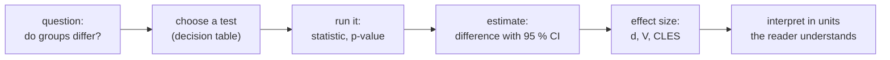
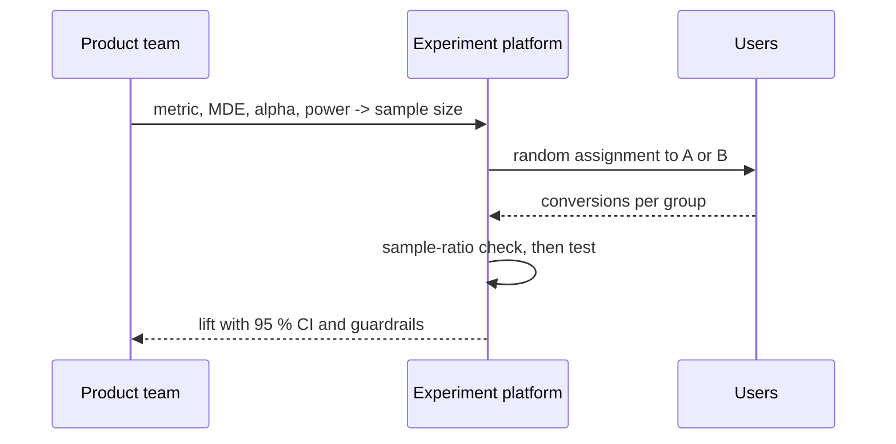
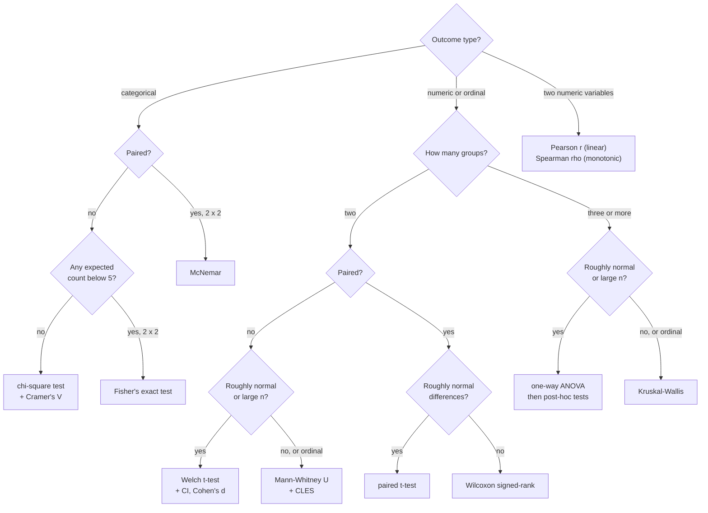

# Comparing groups and testing differences

Many analytical questions compare groups: do verified buyers rate differently from unverified ones, does a new checkout page convert better, is the share of negative reviews the same in every category? This page recaps the tests for such questions as tools to **choose, run and interpret**: the t-test and the Mann–Whitney test for numeric outcomes, the chi-square test and Cramér's V for categorical outcomes, and the A/B test as the main application. Every test result is reported with a **confidence interval** and an **effect size**, because with 50,000 reviews almost any difference becomes "significant". The theory behind the tests belongs to the statistics module; workbooks [10](../workbooks/10-hypothesis-testing.ipynb) and [11](../workbooks/11-hypothesis-testing-by-simulation.ipynb) recap it.



## Comparing groups: the logic of a test

### Concept

Every test follows the same recipe (Downey: "There is only one test"):

1. Choose a **test statistic** that measures the effect, such as the difference in means.
2. State the **null hypothesis H₀**: a world in which the effect does not exist.
3. Work out how the statistic varies in that world, by formula or by simulation.
4. The **p-value** is the probability, in that world, of a statistic at least as extreme as the observed one.

A p-value is **not** the probability that H₀ is true, and not a measure of how large the effect is. The threshold 0.05 (the **significance level α**) is a convention.

A **confidence interval (CI)** gives a range of plausible values for the effect. A 95 % CI is produced by a procedure that captures the true value in 95 % of repeated studies. If the 95 % CI for a difference excludes 0, the two-sided test at α = 0.05 rejects H₀; the CI tells you in addition how large the difference could be.

### Why it matters

The p-value answers only "could this be zero?". A stakeholder needs "how much, in units I understand, and how sure are we?". The American Statistical Association's statement on p-values (Wasserstein & Lazar, 2016) asks for estimates with intervals instead of a bare "significant / not significant".

### How it works in Python

A **permutation test** builds the null world directly: if verification status did not matter, shuffling the labels would not change the difference.

```python
import numpy as np
import pandas as pd
from scipy import stats

reviews = pd.read_parquet("case-study/data/train_sample.parquet")
reviews["n_words"] = reviews["text"].str.split().str.len()
v = reviews.loc[reviews["verified_purchase"], "n_words"].to_numpy()
u = reviews.loc[~reviews["verified_purchase"], "n_words"].to_numpy()
print(round(v.mean(), 1), round(u.mean(), 1))    # 31.1 74.8 words

res = stats.permutation_test((v, u), lambda a, b: a.mean() - b.mean(),
                             n_resamples=2_000, random_state=0)
print(round(res.statistic, 1), res.pvalue)       # -43.7 0.0009995: no shuffle came close
```

With 2,000 shuffles the smallest possible p-value is 1/2,001 ≈ 0.0005; "p < 0.001" is the honest report.

> [!CAUTION]
> **Significant is not important.** With large samples, tiny differences reach p < 0.05. With small samples, large differences may not. Always report the size of the effect next to the p-value.

## t-test and Mann–Whitney test with confidence intervals and effect sizes

### Concept

- **Welch's t-test** compares two **means** without assuming equal variances. Use it by default; the equal-variance "Student" version is rarely needed. It relies on the sample means being approximately normal, which holds for large samples even when the data are skewed (central limit theorem).
- The **Mann–Whitney U test** compares **ranks**: does a random value from one group tend to exceed a random value from the other? It is robust to outliers and suits ordinal data such as star ratings.
- If the same units are measured twice (before and after), use the **paired** versions: the paired t-test or the Wilcoxon signed-rank test.

Effect sizes:

- the **difference in means** with its CI, in real units (words, euros, stars): the most useful for readers;
- **Cohen's d** = difference in means / pooled SD. Rough guide: 0.2 small, 0.5 medium, 0.8 large;
- the **common-language effect size (CLES)** = U / (n₁ · n₂): the probability that a random observation from group 1 exceeds one from group 2 (ties count half). 0.5 means no effect.

Worked example: verified reviews have a mean of 31 words, unverified 75 words, pooled SD about 50 words. Then d ≈ (31 − 75) / 50 ≈ −0.88: a large difference.

### Why it matters

Two tests answer slightly different questions (means versus "tends to be larger"). Running both is a robustness check: when they agree, the conclusion does not depend on the choice. Effect sizes let you compare results across datasets of different size.

### How it works in Python

```python
import numpy as np
import pandas as pd
from scipy import stats

reviews = pd.read_parquet("case-study/data/train_sample.parquet")
reviews["n_words"] = reviews["text"].str.split().str.len()

def compare(df: pd.DataFrame, column: str) -> dict:
    """Welch t-test, Mann-Whitney U and effect sizes: verified vs not verified."""
    a = df.loc[df["verified_purchase"], column]
    b = df.loc[~df["verified_purchase"], column]
    t = stats.ttest_ind(a, b, equal_var=False)
    ci = t.confidence_interval()
    mw = stats.mannwhitneyu(a, b)
    pooled_sd = np.sqrt(((len(a) - 1) * a.var() + (len(b) - 1) * b.var()) / (len(a) + len(b) - 2))
    return {"diff": round(float(a.mean() - b.mean()), 3),
            "ci": (round(float(ci.low), 3), round(float(ci.high), 3)),
            "p_t": float(f"{t.pvalue:.2g}"), "p_mw": float(f"{mw.pvalue:.2g}"),
            "d": round(float((a.mean() - b.mean()) / pooled_sd), 3),
            "cles": round(float(mw.statistic / (len(a) * len(b))), 3)}

print(compare(reviews, "n_words"))
# {'diff': -43.714, 'ci': (-46.341, -41.087), 'p_t': 6.6e-212, 'p_mw': 0.0, 'd': -0.883, 'cles': 0.29}
print(compare(reviews, "rating"))
# {'diff': -0.03, 'ci': (-0.072, 0.013), 'p_t': 0.17, 'p_mw': 0.9, 'd': -0.02, 'cles': 0.5}
```

Reading the two results:

- **Length**: unverified reviews are 44 words longer on average (95 % CI 41 to 46 words); d = −0.88 is large; a random verified review is shorter than a random unverified one 71 % of the time (1 − 0.29).
- **Rating**: the difference is −0.03 stars, the CI includes 0, and d = −0.02. On the full training set (434,373 reviews) the same difference becomes significant (p = 0.02) with d = −0.01. The effect is negligible either way; only the sample size changed.

### In practice

- Clinical trials report the treatment effect in clinical units (for example mmHg of blood pressure) with a 95 % CI, as required by the CONSORT statement.
- Usability studies compare task-completion times of two interface designs; times are skewed, so the Mann–Whitney test or a log transformation is common.
- Paired t-tests are standard in before–after evaluations of training programmes.

> [!WARNING]
> **Ratings are ordinal.** A t-test on star ratings treats the scale as interval data. This is common and usually harmless with large samples, but the Mann–Whitney test and the share of 1–2 star reviews are more defensible. Report what the reader cares about.

## Categorical data: contingency tables, chi-square and Cramér's V

### Concept

A **contingency table** counts observations for every combination of two categorical variables. The **chi-square test of independence** compares the observed counts O with the counts E expected if the variables were unrelated:

E = row total × column total / grand total, and χ² = Σ (O − E)² / E.

Large gaps give a large χ² and a small p-value. **Cramér's V** = √(χ² / (n · (k − 1))), with k the smaller number of rows or columns, rescales χ² to a strength between 0 (no association) and 1 (perfect association). Rough guide for tables with k = 2: 0.1 small, 0.3 medium, 0.5 large.

Worked example (verified × label, sample): 8,751 verified reviews are negative. Expected under independence: 9,609 negative × 45,195 verified / 50,000 = 8,686. The observed count is 65 above expectation: about 0.7 %.

If any expected count is below about 5, use **Fisher's exact test** (2 × 2 tables) instead.

### Why it matters

Most business, health and social data are categorical: plan, country, device, diagnosis, yes/no. A 2 × 2 table (variant × converted) is exactly the shape of an A/B test on a conversion rate.

### How it works in Python

```python
import pandas as pd
from scipy import stats
from scipy.stats.contingency import association

reviews = pd.read_parquet("case-study/data/train_sample.parquet")
table = pd.crosstab(reviews["label"], reviews["verified_purchase"])
print(table)
# verified_purchase  False  True
# label
# neg                  858   8751
# neu                  340   3399
# pos                 3607  33045

res = stats.chi2_contingency(table)
print(round(res.statistic, 2), round(res.pvalue, 4), res.dof)   # 8.53 0.014 2
print(pd.DataFrame(res.expected_freq, index=table.index, columns=table.columns).round(0))
print(round(association(table, method="cramer"), 3))           # 0.013: negligible
print(pd.crosstab(reviews["label"], reviews["verified_purchase"], normalize="columns").round(3))
# verified_purchase  False   True
# neg                0.179  0.194   -> 1.5 percentage points more negative among verified
```

**Significant but negligible.** p = 0.014 says the shares are probably not exactly equal; V = 0.013 and a gap of 1.5 percentage points say the difference does not matter for any product decision.

### In practice

- Public-health reporting cross-tabulates vaccination status and hospitalisation.
- Churn analysis compares cancellation rates by subscription plan (Session 6 uses the IBM Telco data).
- Recruitment audits compare offer rates by applicant group with contingency tables; the Berkeley admissions case on [page 4](04-correlation-and-communication.md#confounding-and-simpsons-paradox) shows why such tables need a closer look.

> [!TIP]
> Always print the **row or column shares** next to the test. The test tells you whether the table differs from independence; the shares tell you how.

## A/B tests as an application

### Concept

An **A/B test** is a randomised controlled experiment. Users are randomly assigned to the current version (A, control) or the change (B, treatment). Randomisation makes the groups alike in everything else, so a difference in outcome is caused by the change.

Before launch, write down:

- **one primary metric** (for example the conversion rate) and **guardrail metrics** that must not get worse (load time, cancellations);
- the **minimum detectable effect (MDE)**: the smallest lift worth acting on;
- **α** (accepted false-positive rate, usually 5 %) and **power** (the chance to detect the MDE if it is real, usually 80 %).

Together these determine the **sample size**. After the test, analyse the 2 × 2 table (variant × converted) and give a CI for the lift.



### Why it matters

Experiments are where data roles use statistics most often. Product teams in e-commerce and software run tests continuously, and interviews for analyst roles routinely include an A/B-testing case. Two common errors invalidate results: **peeking** (checking every day and stopping at the first p < 0.05, which raises the false-positive rate far above 5 %) and a **sample-ratio mismatch** (the observed split differs from the planned one, a sign of broken assignment or logging).

### How it works in Python

```python
from scipy import stats
from statsmodels.stats.power import NormalIndPower
from statsmodels.stats.proportion import (confint_proportions_2indep, proportion_effectsize,
                                          proportions_ztest)

# Plan: baseline conversion 10 %, smallest lift worth acting on: 10 % -> 11 %
effect = proportion_effectsize(0.11, 0.10)
n = NormalIndPower().solve_power(effect_size=effect, alpha=0.05, power=0.8)
print(round(n))                                            # 14744 users per group

# Analyse after the planned sample is reached
conversions, users = [1_630, 1_480], [14_800, 14_750]      # B, A
z, p = proportions_ztest(conversions, users)
print(round(z, 2), round(p, 4))                            # 2.74 0.0061
low, high = confint_proportions_2indep(conversions[0], users[0], conversions[1], users[1])
print(round(low, 4), round(high, 4))                       # 0.0028 0.0168: +0.3 to +1.7 points

# Sample-ratio check: a planned 50/50 split
print(stats.chisquare(users).pvalue.round(3))              # 0.771: no mismatch
```

### In practice

- Kohavi, Tang and Xu (2020) describe experimentation at Microsoft (Bing), Google and LinkedIn, where thousands of controlled experiments run each year.
- The UK Behavioural Insights Team ran randomised trials of tax reminder letters with HM Revenue and Customs and found that social-norm messages ("most people pay on time") raised payment rates.
- Booking.com has described running about 1,000 concurrent experiments on its website (Thomke, 2020).

> [!WARNING]
> **Peeking.** If you must look at results before the planned sample size, use a method designed for repeated looks (sequential testing). Otherwise fix the sample size in advance and analyse once.

## Choosing a test from a decision table

### Concept

The choice depends on three things: the type of the **outcome**, the number of **groups**, and whether the groups are **independent** or **paired** (the same units measured twice).

| Outcome | Groups | Independent groups | Paired / repeated |
|---|---|---|---|
| numeric, roughly symmetric or large n | 2 | Welch t-test (`ttest_ind(equal_var=False)`) | paired t-test (`ttest_rel`) |
| numeric, skewed, small n, or ordinal | 2 | Mann–Whitney U (`mannwhitneyu`) | Wilcoxon signed-rank (`wilcoxon`) |
| numeric | 3 or more | one-way ANOVA (`f_oneway`) or Welch ANOVA | repeated-measures ANOVA |
| ordinal or skewed | 3 or more | Kruskal–Wallis (`kruskal`) | Friedman (`friedmanchisquare`) |
| categorical | 2 or more | chi-square (`chi2_contingency`); Fisher's exact for small 2 × 2 | McNemar (2 × 2, `statsmodels`) |
| proportion (A/B) | 2 | two-proportion z-test (`proportions_ztest`) | McNemar |
| two numeric variables | – | Pearson r (linear) or Spearman ρ (monotonic), [page 4](04-correlation-and-communication.md) | – |

The same choice as a decision flowchart:



### Why it matters

A wrong test can give a wrong answer: an independent-samples test on paired data ignores that each person is compared with themselves and loses power; a chi-square test on tiny counts gives unreliable p-values. A decision table makes the choice explicit and reviewable.

### How it works in Python

```python
import pandas as pd
from scipy import stats

reviews = pd.read_parquet("case-study/data/train_sample.parquet")
reviews["n_words"] = reviews["text"].str.split().str.len()

# Three or more groups, skewed outcome -> Kruskal-Wallis: does length differ by label?
groups = [g["n_words"] for _, g in reviews.groupby("label")]
print(stats.kruskal(*groups).pvalue < 0.001)                         # True
print(reviews.groupby("label")["n_words"].median().to_dict())       # {'neg': 23.0, 'neu': 26.0, 'pos': 19.0}

# Small 2 x 2 table -> Fisher's exact test
print(round(stats.fisher_exact([[8, 2], [1, 5]]).pvalue, 3))        # 0.035
```

### In practice

- Statistical analysis plans for clinical trials name the test for every endpoint before data collection.
- Journals such as *Nature* require authors to state the test used and whether it was one- or two-sided for every reported p-value.
- Experimentation platforms fix the test per metric type (proportion, mean, ratio) so that analysts do not choose after seeing the data.

> [!IMPORTANT]
> **Practice (block 2).** Do verified purchases rate differently? Run Welch's t-test and the Mann–Whitney test on `rating` by `verified_purchase`, report the difference with its CI and Cohen's d. Then test label × verified purchase with chi-square and Cramér's V and write one sentence that explains why the result is significant but negligible. Notebook: [18-case-study-verified-purchases-and-helpful-votes.ipynb](../workbooks/18-case-study-verified-purchases-and-helpful-votes.ipynb).

> [!CAUTION]
> **Many tests.** At α = 0.05, each test on pure noise has a 5 % chance of a false positive; with 20 tests the chance of at least one is 64 %. When you test many metrics or subgroups, correct with Holm or Benjamini–Hochberg (`statsmodels.stats.multitest.multipletests`).

## Check your understanding

1. A test gives p = 0.03. Which of these statements are correct: "H₀ is false with probability 97 %", "If H₀ were true, data this extreme would occur about 3 % of the time"?
2. Why can the rating difference be non-significant in the sample and significant in the full training set, with the same effect size?
3. When would you prefer the Mann–Whitney test over the t-test?
4. Compute the expected count of neutral unverified reviews under independence from the table above.
5. Name two things you must fix before an A/B test starts, and one error that invalidates it.

## Further reading

- Downey, A. B. (2025). *Think Stats* (3rd ed.), chapter 9 "Hypothesis testing". <https://allendowney.github.io/ThinkStats/chap09.html>
- Wasserstein, R. L., & Lazar, N. A. (2016). The ASA statement on p-values: Context, process, and purpose. *The American Statistician*, 70(2), 129–133. <https://doi.org/10.1080/00031305.2016.1154108>
- Kohavi, R., Tang, D., & Xu, Y. (2020). *Trustworthy Online Controlled Experiments: A Practical Guide to A/B Testing*. Cambridge University Press. <https://experimentguide.com/>
- Miller, E. (2010). *How not to run an A/B test*. <https://www.evanmiller.org/how-not-to-run-an-ab-test.html>
