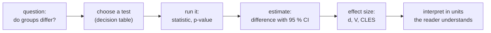
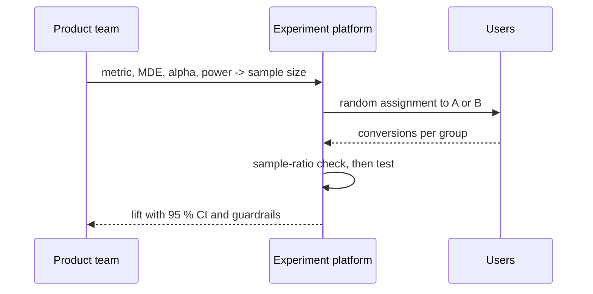
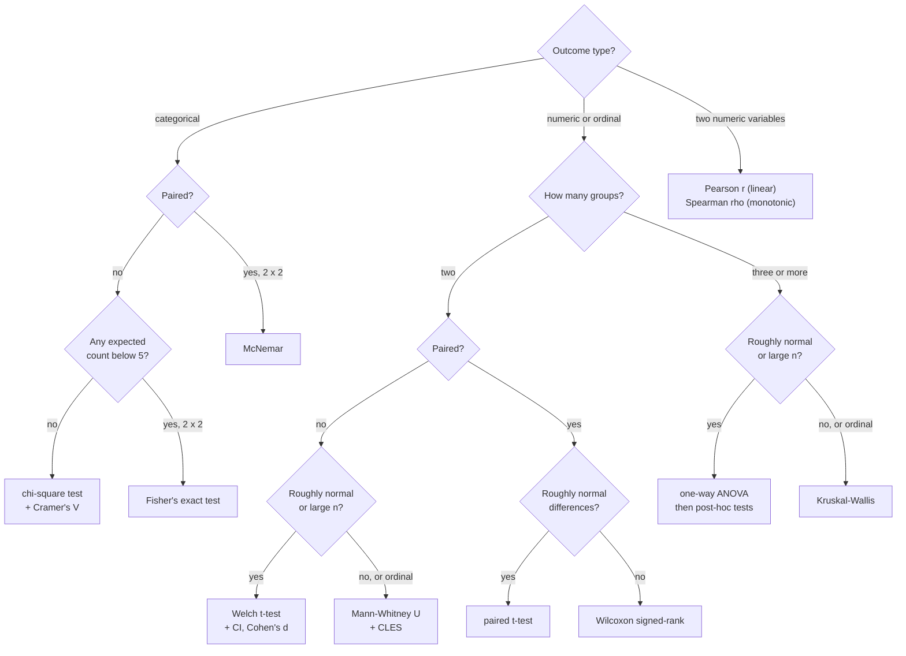

# Comparing groups and testing differences

Many analytical questions compare groups: do entire homes cost more than private rooms, is a night in Mitte more expensive than in Neukölln, do hosts with several listings fill in their registration details more often, does a new listing page lead to more bookings? This page recaps the tests for such questions as tools to **choose, run and interpret**: the t-test and the Mann–Whitney test for numeric outcomes, the chi-square test and Cramér's V for categorical outcomes, and the A/B test as the main application. Every test result is reported with a **confidence interval** and an **effect size**, because with thousands of listings almost any difference becomes "significant". The theory behind the tests belongs to the statistics module; workbooks [10](../workbooks/10-hypothesis-testing.ipynb) and [11](../workbooks/11-hypothesis-testing-by-simulation.ipynb) recap it.



## Comparing groups: the logic of a test

### Concept

Every test follows the same recipe (Downey: "There is only one test"):

1. Choose a **test statistic** that measures the effect, such as the difference in means.
2. State the **null hypothesis H₀**: a world in which the effect does not exist.
3. Work out how the statistic varies in that world, by formula or by simulation.
4. The **p-value** is the probability, in that world, of a statistic at least as extreme as the observed one.

A p-value is **not** the probability that H₀ is true, and not a measure of how large the effect is. The threshold 0.05 (the **significance level α**) is a convention.

A **confidence interval (CI)** gives a range of plausible values for the effect. A 95 % CI is produced by a procedure that captures the true value in 95 % of repeated studies. If the 95 % CI for a difference excludes 0, the two-sided test at α = 0.05 rejects H₀; the CI tells you in addition how large the difference could be.

### Why it matters

The p-value answers only "could this be zero?". A stakeholder needs "how much, in units I understand, and how sure are we?". The American Statistical Association's statement on p-values (Wasserstein & Lazar, 2016) asks for estimates with intervals instead of a bare "significant / not significant".

### How it works in Python

A **permutation test** builds the null world directly: if the district did not matter for the price, shuffling the district labels between Mitte and Neukölln listings would not change the difference in mean price.

```python
import pandas as pd
from scipy import stats

listings = pd.read_parquet("case-study/data/airbnb/listings.parquet")
short = listings[listings["price"].notna() & listings["minimum_nights"].lt(28)]   # comparable prices (Session 4)
mitte = short.loc[short["district"] == "Mitte", "price"].to_numpy()
neukoelln = short.loc[short["district"] == "Neukölln", "price"].to_numpy()
print(len(mitte), len(neukoelln), round(mitte.mean(), 1), round(neukoelln.mean(), 1))   # 1537 556 220.4 154.9

res = stats.permutation_test((mitte, neukoelln), lambda a, b: a.mean() - b.mean(),
                             n_resamples=2_000, random_state=0)
print(round(res.statistic, 1), res.pvalue)         # 65.5 0.0009995: no shuffle came close
```

With 2,000 shuffles the smallest possible p-value is 1/2,001 ≈ 0.0005; "p < 0.001" is the honest report.

> [!CAUTION]
> **Significant is not important.** With large samples, tiny differences reach p < 0.05. With small samples, large differences may not. Always report the size of the effect next to the p-value.

## t-test and Mann–Whitney test with confidence intervals and effect sizes

### Concept

- **Welch's t-test** compares two **means** without assuming equal variances. Use it by default; the equal-variance "Student" version is rarely needed. It relies on the sample means being approximately normal, which holds for large samples even when the data are skewed (central limit theorem).
- The **Mann–Whitney U test** compares **ranks**: does a random value from one group tend to exceed a random value from the other? It is robust to outliers and suits skewed data such as prices and ordinal data such as star ratings.
- If the same units are measured twice (before and after), use the **paired** versions: the paired t-test or the Wilcoxon signed-rank test.

Effect sizes:

- the **difference in means** with its CI, in real units (euros, nights, stars): the most useful for readers;
- **Cohen's d** = difference in means / pooled SD. Rough guide: 0.2 small, 0.5 medium, 0.8 large;
- the **common-language effect size (CLES)** = U / (n₁ · n₂): the probability that a random observation from group 1 exceeds one from group 2 (ties count half). 0.5 means no effect.

Worked example: short-stay entire homes cost €226 on average, private rooms €116, pooled SD about €212. Then d ≈ (226 − 116) / 212 ≈ 0.52: a "medium" difference by the rough guide. Yet a random entire home costs more than a random private room in 84 % of pairs (CLES 0.84). The two effect sizes disagree because a few prices in the thousands inflate the SD; on the log scale, d is 1.26. For skewed data, prefer the CLES or compute d on a sensible scale.

### Why it matters

Two tests answer slightly different questions (means versus "tends to be larger"). Running both is a robustness check: when they agree, the conclusion does not depend on the choice. Effect sizes let you compare results across datasets of different size.

### How it works in Python

```python
import numpy as np
import pandas as pd
from scipy import stats

listings = pd.read_parquet("case-study/data/airbnb/listings.parquet")
short = listings[listings["price"].notna() & listings["minimum_nights"].lt(28)]

def compare(df: pd.DataFrame, column: str, group: str, a_value, b_value) -> dict:
    """Welch t-test, Mann-Whitney U and effect sizes for two groups of one column."""
    a = df.loc[df[group] == a_value, column].dropna()
    b = df.loc[df[group] == b_value, column].dropna()
    t = stats.ttest_ind(a, b, equal_var=False)
    ci = t.confidence_interval()
    mw = stats.mannwhitneyu(a, b)
    pooled_sd = np.sqrt(((len(a) - 1) * a.var() + (len(b) - 1) * b.var()) / (len(a) + len(b) - 2))
    return {"diff": round(float(a.mean() - b.mean()), 2),
            "ci": (round(float(ci.low), 2), round(float(ci.high), 2)),
            "p_t": float(f"{t.pvalue:.2g}"), "p_mw": float(f"{mw.pvalue:.2g}"),
            "d": round(float((a.mean() - b.mean()) / pooled_sd), 2),
            "cles": round(float(mw.statistic / (len(a) * len(b))), 3)}

print(compare(short, "price", "room_type", "Entire home/apt", "Private room"))
# {'diff': 110.33, 'ci': (102.4, 118.26), 'p_t': 5.6e-155, 'p_mw': 0.0, 'd': 0.52, 'cles': 0.836}
print(compare(short, "price", "district", "Mitte", "Neukölln"))
# {'diff': 65.47, 'ci': (54.48, 76.46), 'p_t': 2.6e-30, 'p_mw': 7e-33, 'd': 0.47, 'cles': 0.671}
print(compare(short, "price", "host_is_superhost", True, False))
# {'diff': 7.88, 'ci': (-1.85, 17.62), 'p_t': 0.11, 'p_mw': 0.00012, 'd': 0.04, 'cles': 0.527}
print(compare(listings, "review_scores_rating", "host_is_superhost", True, False))
# {'diff': 0.14, 'ci': (0.13, 0.15), 'p_t': 3.7e-133, 'p_mw': 1.7e-40, 'd': 0.41, 'cles': 0.581}
```

Reading the four results:

- **Entire home vs private room**: entire homes cost €110 more per night on average (95 % CI €102 to €118). Both tests agree, and the CLES of 0.84 says the difference holds for most pairs of listings. The room type is the first thing any price comparison must take into account.
- **Mitte vs Neukölln**: €65 more in Mitte (CI €54 to €76), CLES 0.67: a clear but overlapping difference. The test cannot say *why*. Mitte has more entire homes and larger listings (page 4 asks how much of the gap remains when room type and size are held fixed).
- **Superhost vs other hosts, price**: the two tests disagree. The t-test finds no clear difference in means (p = 0.11, CI −€2 to €18), the Mann–Whitney test does (p = 0.0001). Both are right about their own question: superhost listings tend to be slightly more expensive (CLES 0.53), but the means are dominated by a few very expensive listings, which makes the t-test noisy. Either way the effect is negligible.
- **Superhost vs other hosts, rating**: superhosts are rated 0.14 stars higher (CI 0.13 to 0.15). Tiny p-values, a moderate d of 0.41, a CLES of 0.58. Whether 0.14 stars matters depends on how crowded the ratings are: with a median of 4.86, it is a noticeable step. Superhost status is itself awarded partly for high ratings, so this comparison is close to circular.

### In practice

- Clinical trials report the treatment effect in clinical units (for example mmHg of blood pressure) with a 95 % CI, as required by the CONSORT statement.
- Usability studies compare task-completion times of two interface designs; times are skewed, so the Mann–Whitney test or a log transformation is common.
- Paired t-tests are standard in before–after evaluations of training programmes.

> [!WARNING]
> **Counts and ordinal scales.** The review score is an average of star ratings, bounded at 5 and crowded near the top; a t-test treats it as interval data. This is common and usually harmless with large samples, but the Mann–Whitney test, or the share of listings rated below 4.5, is easier to defend. The same holds for small counts such as the number of guests. Report what the reader cares about.

## Categorical data: contingency tables, chi-square and Cramér's V

### Concept

A **contingency table** counts observations for every combination of two categorical variables. The **chi-square test of independence** compares the observed counts O with the counts E expected if the variables were unrelated:

E = row total × column total / grand total, and χ² = Σ (O − E)² / E.

Large gaps give a large χ² and a small p-value. **Cramér's V** = √(χ² / (n · (k − 1))), with k the smaller number of rows or columns, rescales χ² to a strength between 0 (no association) and 1 (perfect association). Rough guide for tables with k = 2: 0.1 small, 0.3 medium, 0.5 large.

Worked example (hosts with several listings × an entry in the licence field, all 12,776 listings): 4,737 listings of multi-listing hosts have an entry. Expected under independence: 5,886 listings of multi-listing hosts × 8,809 listings with an entry / 12,776 = 4,058. The observed count is 679 above expectation: about 17 %.

If any expected count is below about 5, use **Fisher's exact test** (2 × 2 tables) instead.

### Why it matters

Most business, health and social data are categorical: plan, country, device, diagnosis, yes/no. A 2 × 2 table (variant × converted) is exactly the shape of an A/B test on a conversion rate.

### How it works in Python

```python
import pandas as pd
from scipy import stats
from scipy.stats.contingency import association

listings = pd.read_parquet("case-study/data/airbnb/listings.parquet")
multi = listings["calculated_host_listings_count"].gt(1).rename("multi_listing_host")
entry = listings["license"].notna().rename("licence_entry")        # any entry in the licence field
table = pd.crosstab(multi, entry)
print(table)
# licence_entry       False  True
# multi_listing_host
# False                2818   4072
# True                 1149   4737

res = stats.chi2_contingency(table)
print(round(res.statistic, 1), f"{res.pvalue:.1e}", res.dof)   # 676.7 3.5e-149 1
print(pd.DataFrame(res.expected_freq, index=table.index, columns=table.columns).round(0))
print(round(association(table, method="cramer"), 3))          # 0.23: small to moderate
print(pd.crosstab(multi, entry, normalize="index").round(3))
# licence_entry       False   True
# multi_listing_host
# False               0.409  0.591
# True                0.195  0.805   -> 81 % against 59 %

# a larger table: 12 districts x 4 room types
big = pd.crosstab(listings["district"], listings["room_type"])
res = stats.chi2_contingency(big)
print(big.shape, res.dof, f"{res.pvalue:.1e}", round(association(big, method="cramer"), 3))   # (12, 4) 33 3.4e-42 0.086
print((res.expected_freq < 5).sum())                          # 12 cells expected below 5
```

**Two significant results of different weight.** Listings of hosts with several listings carry an entry in the licence field far more often (81 % against 59 %); V = 0.23 is a small-to-moderate association with a clear practical meaning: registration details are more complete among professional hosts. Berlin has required a registration number for holiday rentals for years, and an EU regulation on short-term rental data (Regulation (EU) 2024/1028) applies from 20 May 2026; the data cannot tell why private hosts leave the field empty more often. Note also what the field contains: for many multi-listing hosts it is the name of a legal entity rather than a registration number (`license_status`; Session 4, workbook 15), so "licence entry" is not the same as "registered". The district × room type table is also highly significant (p = 3.4e-42), but V = 0.086 is small: the room-type mix differs between districts (more private rooms in Neukölln and Reinickendorf), but not dramatically. Twelve of 48 cells, mostly hotel and shared rooms, have expected counts below 5, so that p-value is approximate; V is still a useful description.

### In practice

- Public-health reporting cross-tabulates vaccination status and hospitalisation.
- Churn analysis compares cancellation rates by subscription plan (Session 6 uses the IBM Telco data).
- Housing authorities cross-tabulate short-term rental listings by district and type to monitor where whole flats are withdrawn from the rental market.
- Recruitment audits compare offer rates by applicant group with contingency tables; the Berkeley admissions case on [page 4](04-correlation-and-communication.md#confounding-and-simpsons-paradox) shows why such tables need a closer look.

> [!TIP]
> Always print the **row or column shares** next to the test. The test tells you whether the table differs from independence; the shares tell you how.

## A/B tests as an application

### Concept

An **A/B test** is a randomised controlled experiment. Users are randomly assigned to the current version (A, control) or the change (B, treatment). Example used below: a booking platform tests a new photo gallery on its listing pages; the metric is the share of visitors who send a booking request. Randomisation makes the groups alike in everything else, so a difference in outcome is caused by the change.

Before launch, write down:

- **one primary metric** (for example the conversion rate) and **guardrail metrics** that must not get worse (load time, cancellations);
- the **minimum detectable effect (MDE)**: the smallest lift worth acting on;
- **α** (accepted false-positive rate, usually 5 %) and **power** (the chance to detect the MDE if it is real, usually 80 %).

Together these determine the **sample size**. After the test, analyse the 2 × 2 table (variant × converted) and give a CI for the lift.



### Why it matters

Experiments are where data roles use statistics most often. Product teams in e-commerce and software run tests continuously, and interviews for analyst roles routinely include an A/B-testing case. Two common errors invalidate results: **peeking** (checking every day and stopping at the first p < 0.05, which raises the false-positive rate far above 5 %) and a **sample-ratio mismatch** (the observed split differs from the planned one, a sign of broken assignment or logging).

### How it works in Python

```python
from scipy import stats
from statsmodels.stats.power import NormalIndPower
from statsmodels.stats.proportion import (confint_proportions_2indep, proportion_effectsize,
                                          proportions_ztest)

# Plan: baseline booking-request rate 10 %, smallest lift worth acting on: 10 % -> 11 %
effect = proportion_effectsize(0.11, 0.10)
n = NormalIndPower().solve_power(effect_size=effect, alpha=0.05, power=0.8)
print(round(n))                                            # 14744 users per group

# Analyse after the planned sample is reached
conversions, users = [1_630, 1_480], [14_800, 14_750]      # B (new gallery), A (current page); simulated
z, p = proportions_ztest(conversions, users)
print(round(z, 2), round(p, 4))                            # 2.74 0.0061
low, high = confint_proportions_2indep(conversions[0], users[0], conversions[1], users[1])
print(round(low, 4), round(high, 4))                       # 0.0028 0.0168: +0.3 to +1.7 points

# Sample-ratio check: a planned 50/50 split
print(stats.chisquare(users).pvalue.round(3))              # 0.771: no mismatch
```

### In practice

- Kohavi, Tang and Xu (2020) describe experimentation at Microsoft (Bing), Google and LinkedIn, where thousands of controlled experiments run each year.
- The UK Behavioural Insights Team ran randomised trials of tax reminder letters with HM Revenue and Customs and found that social-norm messages ("most people pay on time") raised payment rates.
- Booking.com has described running about 1,000 concurrent experiments on its website (Thomke, 2020); Airbnb's data science team described how stopping its search-page experiments at the first significant result would have produced false wins (Overgoor, 2014).

> [!WARNING]
> **Peeking.** If you must look at results before the planned sample size, use a method designed for repeated looks (sequential testing). Otherwise fix the sample size in advance and analyse once.

## Choosing a test from a decision table

### Concept

The choice depends on three things: the type of the **outcome**, the number of **groups**, and whether the groups are **independent** or **paired** (the same units measured twice).

| Outcome | Groups | Independent groups | Paired / repeated |
|---|---|---|---|
| numeric, roughly symmetric or large n | 2 | Welch t-test (`ttest_ind(equal_var=False)`) | paired t-test (`ttest_rel`) |
| numeric, skewed, small n, or ordinal | 2 | Mann–Whitney U (`mannwhitneyu`) | Wilcoxon signed-rank (`wilcoxon`) |
| numeric | 3 or more | one-way ANOVA (`f_oneway`) or Welch ANOVA | repeated-measures ANOVA |
| ordinal or skewed | 3 or more | Kruskal–Wallis (`kruskal`) | Friedman (`friedmanchisquare`) |
| categorical | 2 or more | chi-square (`chi2_contingency`); Fisher's exact for small 2 × 2 | McNemar (2 × 2, `statsmodels`) |
| proportion (A/B) | 2 | two-proportion z-test (`proportions_ztest`) | McNemar |
| two numeric variables | – | Pearson r (linear) or Spearman ρ (monotonic), [page 4](04-correlation-and-communication.md) | – |

The same choice as a decision flowchart:



### Why it matters

A wrong test can give a wrong answer: an independent-samples test on paired data ignores that each person is compared with themselves and loses power; a chi-square test on tiny counts gives unreliable p-values. A decision table makes the choice explicit and reviewable.

### How it works in Python

```python
import pandas as pd
from scipy import stats

listings = pd.read_parquet("case-study/data/airbnb/listings.parquet")
short = listings[listings["price"].notna() & listings["minimum_nights"].lt(28)]

# Three or more groups, skewed outcome -> Kruskal-Wallis: does the price differ by district?
groups = [g["price"] for _, g in short.groupby("district")]
print(stats.kruskal(*groups).pvalue < 0.001)                         # True
print(short.groupby("district")["price"].median().sort_values().iloc[[0, 1, -2, -1]].to_dict())
# {'Reinickendorf': 99.535, 'Treptow - Köpenick': 125.0, 'Pankow': 174.0, 'Mitte': 187.0}

# Small 2 x 2 table -> Fisher's exact test
print(round(stats.fisher_exact([[8, 2], [1, 5]]).pvalue, 3))        # 0.035
```

### In practice

- Statistical analysis plans for clinical trials name the test for every endpoint before data collection.
- Journals such as *Nature* require authors to state the test used and whether it was one- or two-sided for every reported p-value.
- Experimentation platforms fix the test per metric type (proportion, mean, ratio) so that analysts do not choose after seeing the data.

> [!IMPORTANT]
> **Practice (block 2).** How much more does a guest pay for an entire home than for a private room, and for Mitte than for Neukölln? Run Welch's t-test and the Mann–Whitney test, report the difference with its CI, Cohen's d and the CLES, and explain why d and the CLES disagree. Then test multi-listing host × licence entry and district × room type with chi-square and Cramér's V, and write one sentence each for a city housing analyst. Finally, simulate the photo-gallery A/B test with a sample-ratio check. Notebook: [18-case-study-airbnb-exploration.ipynb](../workbooks/18-case-study-airbnb-exploration.ipynb).

> [!CAUTION]
> **Many tests.** At α = 0.05, each test on pure noise has a 5 % chance of a false positive; with 20 tests the chance of at least one is 64 %. When you test many metrics or subgroups, correct with Holm or Benjamini–Hochberg (`statsmodels.stats.multitest.multipletests`).

## Check your understanding

1. A test gives p = 0.03. Which of these statements are correct: "H₀ is false with probability 97 %", "If H₀ were true, data this extreme would occur about 3 % of the time"?
2. For the superhost price comparison, the t-test gives p = 0.11 and the Mann–Whitney test p = 0.0001. How can both be right, and what would you report?
3. When would you prefer the Mann–Whitney test over the t-test?
4. Compute the expected number of listings of single-listing hosts **without** a licence entry under independence from the table above, and compare it with the observed 2,818.
5. Name two things you must fix before an A/B test starts, and one error that invalidates it.

## Further reading

- Downey, A. B. (2025). *Think Stats* (3rd ed.), chapter 9 "Hypothesis testing". <https://allendowney.github.io/ThinkStats/chap09.html>
- Wasserstein, R. L., & Lazar, N. A. (2016). The ASA statement on p-values: Context, process, and purpose. *The American Statistician*, 70(2), 129–133. <https://doi.org/10.1080/00031305.2016.1154108>
- Kohavi, R., Tang, D., & Xu, Y. (2020). *Trustworthy Online Controlled Experiments: A Practical Guide to A/B Testing*. Cambridge University Press. <https://experimentguide.com/>
- Miller, E. (2010). *How not to run an A/B test*. <https://www.evanmiller.org/how-not-to-run-an-ab-test.html>
