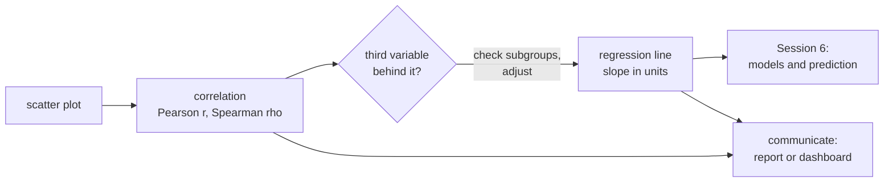
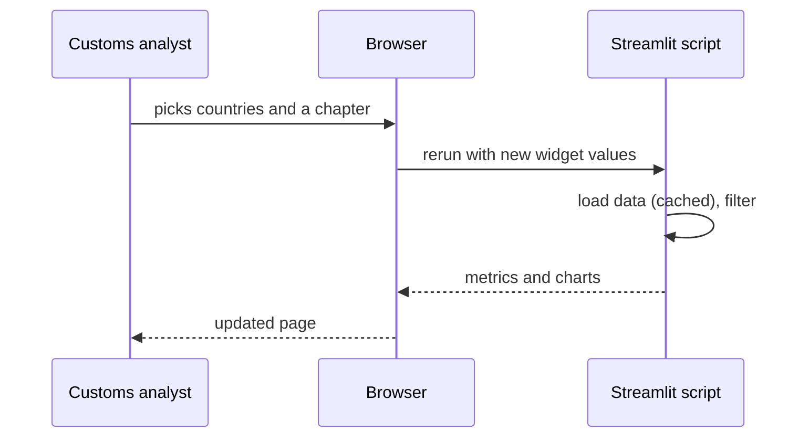

# Relationships, confounding and communicating findings

The last block moves from comparing groups to relationships between two numeric variables. We recap the scatter plot and two correlation coefficients (Pearson and Spearman), then look at **confounding**: a third variable that creates, hides or reverses a relationship, with Simpson's paradox as the extreme case. The least-squares line through a scatter plot is the bridge to regression in Session 6. The page ends with how to communicate findings to a non-technical reader: a one-page report or a small Streamlit dashboard.



## Scatter plots

### Concept

A **scatter plot** places one point per observation at (x, y). Read it for four things: **direction** (up, down, none), **form** (straight, curved, clusters), **strength** (how tightly points follow the form) and **unusual points** (outliers, points with extreme x).

With many observations, points overlap (**overplotting**) and the plot shows only the outline of the data. Remedies: transparency (`alpha`), a random subsample, small jitter for integer values, a 2D histogram or hexbin plot, and binned means.

### Why it matters

A correlation coefficient summarises a scatter plot in one number. Without looking at the plot you cannot tell whether that number describes a straight-line relationship, a curve or two outliers.

### How it works in Python

```python
import matplotlib.pyplot as plt
import numpy as np
import pandas as pd

decisions = pd.read_parquet("case-study/data/train_sample.parquet").dropna(subset=["keywords"])
x = np.log10(decisions["description"].str.len())        # log10 of characters: length is right-skewed
y = decisions["keywords"].str.split(",").str.len()       # number of keywords: a small count
rng = np.random.default_rng(0)

fig, (left, right) = plt.subplots(1, 2, figsize=(10, 3.8), layout="constrained")
left.scatter(x, y + rng.uniform(-0.3, 0.3, len(y)), s=3, alpha=0.1)   # jitter + transparency
hb = right.hexbin(x, y, gridsize=35, bins="log", cmap="viridis")      # counts per hexagon
fig.colorbar(hb, ax=right, label="decisions (log scale)")
for ax in (left, right):
    ax.set(xlabel="log10(characters in description)", ylabel="number of keywords")
print(y.value_counts().head(3).to_dict())   # {5: 15811, 6: 10738, 7: 6332}: integer values overlap
```

### In practice

- Gapminder's bubble charts of income against life expectancy (Hans Rosling) made the scatter plot a standard tool of public communication.
- Quality engineering plots process settings against defect rates to find operating windows.
- Real-estate analysts plot price against floor area before fitting any model.

> [!TIP]
> Put the variable you think of as the "cause" or predictor on the x-axis and the outcome on the y-axis. It does not prove anything, but it matches how readers read the plot and how regression is written.

## Pearson and Spearman correlation

### Concept

- **Pearson's r** measures how closely points follow a **straight line**, from −1 through 0 to +1. **r²** is the share of the variance of y that a straight line explains.
- **Spearman's ρ** (rho) is Pearson's r computed on the **ranks**. It captures any **monotonic** relationship (always up or always down, not necessarily straight) and resists outliers.

Worked example: for the points (1, 1), (2, 3), (3, 2), (4, 100), Pearson's r is about 0.78, driven by the last point. The ranks of y are 1, 3, 2, 4, and Spearman's ρ = 0.8. Change 100 to 1,000 and Pearson moves to 0.77 while Spearman stays at 0.8, because the ranks do not change.

r is not the slope. r = 0.9 can mean that y rises by 1 cent or by 1,000 euros per unit of x; the slope is regression's job. r also misses curves: a perfect U-shape has r ≈ 0.

### Why it matters

Correlation is the first screen for variables that move together: candidate features, KPI drivers worth investigating, redundant predictors. Choosing the wrong coefficient can make a clear relationship look weak.

### How it works in Python

```python
import numpy as np
import pandas as pd
from scipy import stats

decisions = pd.read_parquet("case-study/data/train_sample.parquet").dropna(subset=["keywords"])
chars = decisions["description"].str.len()
keywords = decisions["keywords"].str.split(",").str.len()

print(round(stats.pearsonr(chars, keywords).statistic, 3))     # 0.262
print(round(stats.spearmanr(chars, keywords).statistic, 3))    # 0.245
res = stats.pearsonr(np.log(chars), keywords)
ci = res.confidence_interval()
print(round(res.statistic, 3), round(ci.low, 3), round(ci.high, 3))   # 0.242 0.233 0.25

# Is Pearson driven by a few points here? Drop the 5 longest descriptions (up to 6,403 characters)
keep = ~chars.index.isin(chars.nlargest(5).index)
print(round(stats.pearsonr(chars[keep], keywords[keep]).statistic, 3))   # 0.262: unchanged
```

All three coefficients agree at about 0.25: longer descriptions tend to come with more keywords, a weak-to-moderate monotonic relationship. Unlike in the worked example, five extreme points change nothing, because 50,000 points and a bounded count (at most 39 keywords) leave no single point much leverage. Always check rather than assume.

### In practice

- Finance computes correlation matrices of asset returns for portfolio construction; analysts use rank correlation when returns have heavy tails.
- Psychometrics reports the correlation between two administrations of a test as its test–retest reliability.
- Marketing analysts correlate advertising spend with sales, where both follow the season (see confounding below).

> [!CAUTION]
> **Correlation is not causation.** Longer descriptions may come with more keywords because they describe more product properties, because some administrations write longer texts and assign more keywords, or because complex goods (machines, chemical mixtures) need both. The correlation alone cannot tell these apart.

## Confounding and Simpson's paradox

### Concept

A **confounder** is a third variable that is related to both variables of interest and creates or distorts the relationship between them. **Simpson's paradox** is the extreme case: a relationship in the pooled data vanishes or reverses inside every (or most) subgroups.

The classic real case is the 1973 graduate admissions at UC Berkeley (Bickel, Hammel & O'Connell, 1975). Pooled over the six largest departments, 45 % of men and 30 % of women were admitted. Department by department, women were admitted at a higher rate in four of six. Women had applied more often to the departments that rejected most applicants. The department was the confounder.


We searched the case-study data for a reversal of this kind (for example, description length by year within and across languages, and pairs of issuing countries within product sections) and found none that is clear and robust. What the data do show is a milder form of confounding. Within each of the large languages, longer descriptions come with more keywords. German descriptions, however, are much longer than French ones but carry about the same number of keywords (median 6 and 5). Pooling the languages therefore flattens the relationship: in the right panel the German and French lines are steeper than the pooled line (the English one is flatter). The language confounds the comparison.

### Why it matters

Before acting on any relationship, ask: what else differs between these groups? This question is the reason randomised experiments exist (A/B tests on [page 3](03-comparing-groups-and-tests.md#ab-tests-as-an-application)) and the reason regression adds control variables (Session 6).

### How it works in Python

```python
import numpy as np
import pandas as pd
import statsmodels.formula.api as smf
from scipy import stats

decisions = pd.read_parquet("case-study/data/train_sample.parquet").dropna(subset=["keywords"])
decisions = decisions[decisions["language"].isin(["de", "fr", "en", "nl", "pl"])].copy()
decisions["log_chars"] = np.log(decisions["description"].str.len())
decisions["n_keywords"] = decisions["keywords"].str.split(",").str.len()

print(decisions.groupby("language")[["log_chars", "n_keywords"]].median().round(2).T)
# language       de    en    fr    nl    pl
# log_chars    6.61  5.73  5.61  6.3   6.12
# n_keywords   6.00  6.00  5.00  6.0   5.00
print({lang: round(float(stats.spearmanr(g["log_chars"], g["n_keywords"]).statistic), 2)
       for lang, g in decisions.groupby("language")})
# {'de': 0.29, 'en': 0.26, 'fr': 0.24, 'nl': 0.15, 'pl': 0.07}

pooled = smf.ols("n_keywords ~ log_chars", data=decisions).fit()
within = smf.ols("n_keywords ~ log_chars + C(language)", data=decisions).fit()   # language held fixed
print(round(pooled.params["log_chars"], 2), round(within.params["log_chars"], 2))   # 0.9 1.31
```

The pooled slope (0.90 keywords per unit of log length) understates the slope within languages (1.31) by about a third. Neither number is "the" effect of length on keywords; the lesson is that a pooled comparison mixes the relationship within groups with the differences between groups.

### In practice

- Hospital league tables: a specialist hospital that treats sicker patients can have a higher raw mortality rate than a general hospital and still be better for every type of patient; risk adjustment addresses this.
- Kidney-stone treatment (Charig et al., 1986): treatment A had higher success rates for both small and large stones, but treatment B looked better pooled, because A was used more often for the harder large stones.
- Marketing attribution: a channel looks best in aggregate only because it runs in the strongest market.

> [!WARNING]
> Adjusting for a variable is not always right. Adjusting for a variable that is itself caused by the treatment (a **mediator** or a **collider**) can create bias. Draw the causal story before deciding what to control for.

## From correlation to the regression line

### Concept

The **least-squares line** ŷ = b₀ + b₁·x is the straight line that minimises the sum of squared vertical distances (**residuals** y − ŷ) between the points and the line. Its slope and intercept follow directly from the correlation:

b₁ = r · s_y / s_x and b₀ = ȳ − b₁ · x̄,

where s_x and s_y are the standard deviations. The line always passes through the point of means (x̄, ȳ). In simple regression, the **R²** of the line equals r².


Worked example: if r = 0.5, s_x = 2 and s_y = 10, then b₁ = 0.5 × 10 / 2 = 2.5: y rises by 2.5 units per unit of x. The correlation is symmetric in x and y; the slope is not.

### Why it matters

The regression line turns "these variables move together" into "how much y changes per unit of x", in the units of the data, and gives a prediction for new x values. Session 6 builds on it: several predictors, training and test data, error metrics.

### How it works in Python

```python
import numpy as np
import pandas as pd

decisions = pd.read_parquet("case-study/data/train_sample.parquet").dropna(subset=["keywords"])
x = np.log(decisions["description"].str.len())
y = decisions["keywords"].str.split(",").str.len()

r = np.corrcoef(x, y)[0, 1]
b1 = r * y.std() / x.std()            # slope from the correlation
b0 = y.mean() - b1 * x.mean()         # line through the point of means
print(round(r, 3), round(b1, 3), round(b0, 3))       # 0.242 0.853 0.831
print(np.polyfit(x, y, deg=1).round(3))              # [0.853 0.831]: numpy agrees
residuals = y - (b0 + b1 * x)
r2 = 1 - (residuals**2).sum() / ((y - y.mean())**2).sum()
print(round(r2, 3), round(r**2, 3))                  # 0.058 0.058: R² = r² in simple regression
```

With x on the natural-log scale, a slope of 0.85 means: a description twice as long has on average 0.85 × ln 2 ≈ 0.6 more keywords. R² = 0.06: length explains about 6 % of the variation in the number of keywords.

### In practice

- Galton (1886) introduced the term "regression" when he fitted a line to the heights of parents and their adult children and found that children of tall parents were, on average, less extreme ("regression towards the mean").
- Laboratory calibration curves map an instrument signal to a known concentration with a least-squares line.
- Hedonic price indices at statistical offices start from regressions of price on product characteristics.

> [!NOTE]
> Workbooks [16](../workbooks/16-correlation-and-simple-regression.ipynb) and [17](../workbooks/17-seaborn-regression.ipynb) show the same bridge in scipy, statsmodels and seaborn (`regplot`, `lmplot`, residual plots).

## Communicating findings: a short report or a Streamlit dashboard

### Concept

A finding for a non-technical reader follows a fixed order:

1. **the finding first**, as a full sentence ("Since 2021, almost no Binding Tariff Information decision has been written in English");
2. **one number with its context** (the English share fell from 8.5 % in 2017 to 1.3 % in 2023; the United Kingdom issued about 3,000 decisions a year until 2020 and none after);
3. **what it means for the reader's decision** (a classifier trained on 2017–2020 sees far more English text than it will meet in 2024);
4. **one limitation** (decisions of Ireland and Malta are still partly in English; the statement concerns the shares, not the quality of the decisions).

A **one-page report** puts three to five such findings on a page, each with one chart. A **dashboard** gives repeated access to the same analysis with the reader's own filters.

**Streamlit** turns a Python script into a web app. The script runs from top to bottom; widgets such as `st.slider` return the current user input, and `st.metric` or `st.plotly_chart` display results. Every time the user changes a widget, the whole script runs again. Expensive steps are therefore **cached** with `@st.cache_data`. The app is started with `streamlit run app.py` and opens at `http://localhost:8501`.



### Why it matters

Most analyses reach decision makers as one chart and a few sentences. A finding that is correct but not understood has no effect. A dashboard avoids repeated one-off requests ("can you rerun this for chapter 63?") and is one option for the user interface of a deployed model in Session 16.

### How it works in Python

The complete app is [`workbooks/dashboard_app.py`](../workbooks/dashboard_app.py). Its core:

```python
# dashboard core: start the full app with  streamlit run sessions/05-eda-and-statistics/workbooks/dashboard_app.py
import pandas as pd
import plotly.express as px
import streamlit as st

@st.cache_data                     # read the file once, not on every interaction
def load() -> pd.DataFrame:
    return pd.read_parquet("case-study/data/monthly_counts.parquet")

counts = load()
st.title("Binding Tariff Information decisions per month")
years = st.sidebar.slider("Years", 2004, 2025, (2015, 2025))
countries = st.sidebar.multiselect("Issuing countries", ["DE", "FR", "NL", "GB", "PL"], default=["DE", "FR", "GB"])

sel = counts[counts["month"].dt.year.between(*years) & counts["issuing_country"].isin(countries)]
st.metric("Decisions", f"{sel['n_decisions'].sum():,}")
per_month = sel.groupby(["month", "issuing_country"], as_index=False)["n_decisions"].sum()
st.plotly_chart(px.line(per_month, x="month", y="n_decisions", color="issuing_country"))
```

Run outside Streamlit, the script prints warnings and draws nothing; that is expected. Start it with `streamlit run`.

### In practice

- Snowflake acquired Streamlit in 2022 and offers it inside its data platform for internal data apps.
- Hugging Face Spaces hosts thousands of public Streamlit and Gradio demos of machine-learning models.
- The UK Office for National Statistics and Eurostat publish short statistical bulletins that follow the "main points first" structure.

> [!IMPORTANT]
> **Practice (block 3).** Compute the correlation of description length and number of keywords (Pearson, Spearman, log scale) as an exploratory finding, check whether the language confounds it, and write a one-page summary for a customs analyst or extend the dashboard of decisions per month by country and chapter. Notebook: [18-case-study-ebti-exploration.ipynb](../workbooks/18-case-study-ebti-exploration.ipynb).

> [!WARNING]
> **Dashboards spread mistakes.** A wrong filter or an unlabelled axis in a dashboard is seen by everyone who opens it, every day. Test the numbers against a notebook, label units, and show the data period and the number of observations on the page.

## Check your understanding

1. Pearson's r between description length and number of keywords is 0.26 with and without the five longest descriptions. Why can one point move Pearson's r in the worked example with four points, but not here?
2. Name two variables other than the language that could confound the relationship between description length and number of keywords.
3. In the Berkeley case, what was the confounder and how did it produce the pooled gap?
4. If r = −0.4, s_x = 5 and s_y = 2, what is the slope of the least-squares line?
5. Write the four-part summary (finding, number, meaning, limitation) for the comparison of German and French description lengths.

## Further reading

- Downey, A. B. (2025). *Think Stats* (3rd ed.), chapter 7 "Relationships between variables". <https://allendowney.github.io/ThinkStats/chap07.html>
- Bickel, P. J., Hammel, E. A., & O'Connell, J. W. (1975). Sex bias in graduate admissions: Data from Berkeley. *Science*, 187(4175), 398–404. <https://doi.org/10.1126/science.187.4175.398>
- Pearl, J., Glymour, M., & Jewell, N. P. (2016). *Causal Inference in Statistics: A Primer*, chapter 1 (Simpson's paradox). Wiley.
- Streamlit (2026). *Get started: tutorials*. <https://docs.streamlit.io/get-started/tutorials>
- European Commission. *Binding Tariff Information (BTI)*. <https://taxation-customs.ec.europa.eu/customs-4/calculation-customs-duties/customs-tariff/binding-tariff-information-bti_en>
