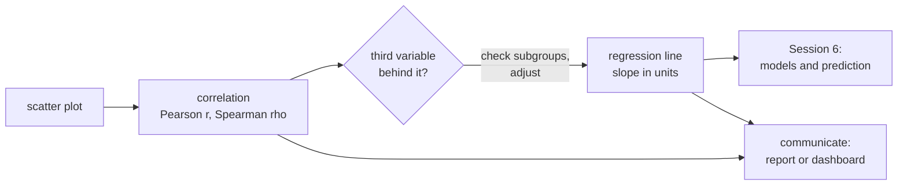
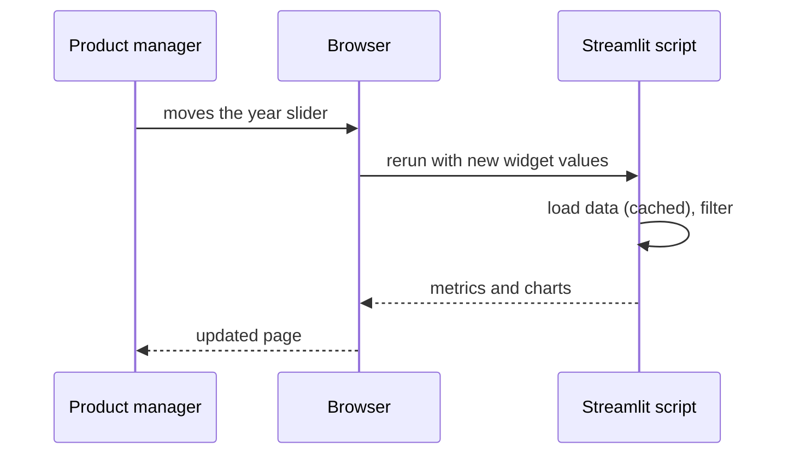

# Relationships, confounding and communicating findings

The last block moves from comparing groups to relationships between two numeric variables. We recap the scatter plot and two correlation coefficients (Pearson and Spearman), then look at **confounding**: a third variable that creates, hides or reverses a relationship, with Simpson's paradox as the extreme case. The least-squares line through a scatter plot is the bridge to regression in Session 6. The page ends with how to communicate findings to a non-technical reader: a one-page report or a small Streamlit dashboard.



## Scatter plots

### Concept

A **scatter plot** places one point per observation at (x, y). Read it for four things: **direction** (up, down, none), **form** (straight, curved, clusters), **strength** (how tightly points follow the form) and **unusual points** (outliers, points with extreme x).

With many observations, points overlap (**overplotting**) and the plot shows only the outline of the data. Remedies: transparency (`alpha`), a random subsample, small jitter for integer values, a 2D histogram or hexbin plot, and binned means.

### Why it matters

A correlation coefficient summarises a scatter plot in one number. Without looking at the plot you cannot tell whether that number describes a straight-line relationship, a curve or two outliers.

### How it works in Python

```python
import matplotlib.pyplot as plt
import numpy as np
import pandas as pd

reviews = pd.read_parquet("case-study/data/train_sample.parquet")
reviews["n_words"] = reviews["text"].str.split().str.len()
x = np.log1p(reviews["n_words"])          # log(1 + words): both variables are right-skewed
y = np.log1p(reviews["helpful_vote"])

fig, (left, right) = plt.subplots(1, 2, figsize=(10, 3.8), layout="constrained")
left.scatter(x, y, s=3, alpha=0.1)        # transparency against overplotting
hb = right.hexbin(x, y, gridsize=35, bins="log", cmap="viridis")   # counts per hexagon
fig.colorbar(hb, ax=right, label="reviews (log scale)")
for ax in (left, right):
    ax.set(xlabel="log(1 + words)", ylabel="log(1 + helpful votes)")
print(round((reviews["helpful_vote"] == 0).mean(), 2))   # 0.71: most points sit on y = 0
```

### In practice

- Gapminder's bubble charts of income against life expectancy (Hans Rosling) made the scatter plot a standard tool of public communication.
- Quality engineering plots process settings against defect rates to find operating windows.
- Real-estate analysts plot price against floor area before fitting any model.

> [!TIP]
> Put the variable you think of as the "cause" or predictor on the x-axis and the outcome on the y-axis. It does not prove anything, but it matches how readers read the plot and how regression is written.

## Pearson and Spearman correlation

### Concept

- **Pearson's r** measures how closely points follow a **straight line**, from −1 through 0 to +1. **r²** is the share of the variance of y that a straight line explains.
- **Spearman's ρ** (rho) is Pearson's r computed on the **ranks**. It captures any **monotonic** relationship (always up or always down, not necessarily straight) and resists outliers.

Worked example: for the points (1, 1), (2, 3), (3, 2), (4, 100), Pearson's r is about 0.78, driven by the last point. The ranks of y are 1, 3, 2, 4, and Spearman's ρ = 0.8. Change 100 to 1,000 and Pearson moves to 0.77 while Spearman stays at 0.8, because the ranks do not change.

r is not the slope. r = 0.9 can mean that y rises by 1 cent or by 1,000 euros per unit of x; the slope is regression's job. r also misses curves: a perfect U-shape has r ≈ 0.

### Why it matters

Correlation is the first screen for variables that move together: candidate features, KPI drivers worth investigating, redundant predictors. Choosing the wrong coefficient can make a clear relationship look weak.

### How it works in Python

```python
import numpy as np
import pandas as pd
from scipy import stats

reviews = pd.read_parquet("case-study/data/train_sample.parquet")
reviews["n_words"] = reviews["text"].str.split().str.len()
words, votes = reviews["n_words"], reviews["helpful_vote"]

print(round(stats.pearsonr(words, votes).statistic, 3))     # 0.071: weak?
print(round(stats.spearmanr(words, votes).statistic, 3))    # 0.312: clearly positive
res = stats.pearsonr(np.log1p(words), np.log1p(votes))
ci = res.confidence_interval()
print(round(res.statistic, 3), round(ci.low, 3), round(ci.high, 3))   # 0.324 0.316 0.332

# Pearson is fragile: drop the 5 reviews with the most votes (7,326, 1,179, 730, ...)
keep = ~votes.index.isin(votes.nlargest(5).index)
print(round(stats.pearsonr(words[keep], votes[keep]).statistic, 3))   # 0.201
```

Five of 50,000 reviews pull Pearson's r from 0.20 down to 0.07. Spearman's ρ (0.31) and Pearson's r on the log scale (0.32) agree: longer reviews tend to receive more helpful votes, with a moderate monotonic relationship.

### In practice

- Finance computes correlation matrices of asset returns for portfolio construction; analysts use rank correlation when returns have heavy tails.
- Psychometrics reports the correlation between two administrations of a test as its test–retest reliability.
- Marketing analysts correlate advertising spend with sales, where both follow the season (see confounding below).

> [!CAUTION]
> **Correlation is not causation.** Longer reviews may get more votes because they are more useful, because they are older and had more time to collect votes, or because they appear on popular products. The correlation alone cannot tell these apart.

## Confounding and Simpson's paradox

### Concept

A **confounder** is a third variable that is related to both variables of interest and creates or distorts the relationship between them. **Simpson's paradox** is the extreme case: a relationship in the pooled data vanishes or reverses inside every (or most) subgroups.

The classic real case is the 1973 graduate admissions at UC Berkeley (Bickel, Hammel & O'Connell, 1975). Pooled over the six largest departments, 45 % of men and 30 % of women were admitted. Department by department, women were admitted at a higher rate in four of six. Women had applied more often to the departments that rejected most applicants. The department was the confounder.


The case-study data show a milder version. Pooled over all years, verified purchases rate slightly lower than unverified ones (4.021 vs 4.038 on the full training set). Within 8 of the 10 years from 2012 to 2021, verified purchases rate higher. Unverified reviews were most common in 2015–2016, when ratings were high overall; Amazon banned incentivised reviews, a major source of unverified reviews, in October 2016. The year confounds the comparison.

### Why it matters

Before acting on any relationship, ask: what else differs between these groups? This question is the reason randomised experiments exist (A/B tests on [page 3](03-comparing-groups-and-tests.md#ab-tests-as-an-application)) and the reason regression adds control variables (Session 6).

### How it works in Python

```python
import numpy as np
import pandas as pd
import statsmodels.formula.api as smf

reviews = pd.read_parquet("case-study/data/train.parquet", columns=["rating", "verified_purchase", "date"])
reviews["year"] = reviews["date"].dt.year

pooled = reviews.groupby("verified_purchase")["rating"].mean()
print(round(pooled[True] - pooled[False], 3))                     # -0.017: verified lower

by_year = reviews.groupby(["year", "verified_purchase"])["rating"].mean().unstack().dropna()
diff = by_year[True] - by_year[False]
print(int((diff.loc[2012:] > 0).sum()), "of", len(diff.loc[2012:]))   # 8 of 10 years: verified higher
weights = reviews.groupby("year").size().loc[diff.index]
print(round(np.average(diff, weights=weights), 3))               # 0.027: verified higher within years

# Regression with year as a control variable (Session 6)
fit = smf.ols("rating ~ verified_purchase + C(year)", data=reviews).fit()
print(round(fit.params["verified_purchase[T.True]"], 3))        # -0.001: about zero once year is held fixed
```

The sign of the adjusted difference depends on how the years are weighted, but every version is a few hundredths of a star. The lesson is not that verified buyers rate higher; it is that the pooled comparison mixes the effect of verification with the effect of time.

### In practice

- Hospital league tables: a specialist hospital that treats sicker patients can have a higher raw mortality rate than a general hospital and still be better for every type of patient; risk adjustment addresses this.
- Kidney-stone treatment (Charig et al., 1986): treatment A had higher success rates for both small and large stones, but treatment B looked better pooled, because A was used more often for the harder large stones.
- Marketing attribution: a channel looks best in aggregate only because it runs in the strongest market.

> [!WARNING]
> Adjusting for a variable is not always right. Adjusting for a variable that is itself caused by the treatment (a **mediator** or a **collider**) can create bias. Draw the causal story before deciding what to control for.

## From correlation to the regression line

### Concept

The **least-squares line** ŷ = b₀ + b₁·x is the straight line that minimises the sum of squared vertical distances (**residuals** y − ŷ) between the points and the line. Its slope and intercept follow directly from the correlation:

b₁ = r · s_y / s_x and b₀ = ȳ − b₁ · x̄,

where s_x and s_y are the standard deviations. The line always passes through the point of means (x̄, ȳ). In simple regression, the **R²** of the line equals r².


Worked example: if r = 0.5, s_x = 2 and s_y = 10, then b₁ = 0.5 × 10 / 2 = 2.5: y rises by 2.5 units per unit of x. The correlation is symmetric in x and y; the slope is not.

### Why it matters

The regression line turns "these variables move together" into "how much y changes per unit of x", in the units of the data, and gives a prediction for new x values. Session 6 builds on it: several predictors, training and test data, error metrics.

### How it works in Python

```python
import numpy as np
import pandas as pd

reviews = pd.read_parquet("case-study/data/train_sample.parquet")
x = np.log1p(reviews["text"].str.split().str.len())
y = np.log1p(reviews["helpful_vote"])

r = np.corrcoef(x, y)[0, 1]
b1 = r * y.std() / x.std()            # slope from the correlation
b0 = y.mean() - b1 * x.mean()         # line through the point of means
print(round(r, 3), round(b1, 3), round(b0, 3))       # 0.324 0.192 -0.235
print(np.polyfit(x, y, deg=1).round(3))              # [ 0.192 -0.235]: numpy agrees
residuals = y - (b0 + b1 * x)
r2 = 1 - (residuals**2).sum() / ((y - y.mean())**2).sum()
print(round(r2, 3), round(r**2, 3))                  # 0.105 0.105: R² = r² in simple regression
```

On the log scales, a slope of 0.19 means: a review that is 10 % longer has roughly 0.19 × 10 % ≈ 2 % more (1 + helpful votes). R² = 0.10: length explains a tenth of the variation in votes.

### In practice

- Galton (1886) introduced the term "regression" when he fitted a line to the heights of parents and their adult children and found that children of tall parents were, on average, less extreme ("regression towards the mean").
- Laboratory calibration curves map an instrument signal to a known concentration with a least-squares line.
- Hedonic price indices at statistical offices start from regressions of price on product characteristics.

> [!NOTE]
> Workbooks [16](../workbooks/16-correlation-and-simple-regression.ipynb) and [17](../workbooks/17-seaborn-regression.ipynb) show the same bridge in scipy, statsmodels and seaborn (`regplot`, `lmplot`, residual plots).

## Communicating findings: a short report or a Streamlit dashboard

### Concept

A finding for a non-technical reader follows a fixed order:

1. **the finding first**, as a full sentence ("Longer reviews receive more helpful votes");
2. **one number with its context** (reviews of more than 100 words receive 7.4 helpful votes on average, reviews of up to 5 words 0.3; Spearman ρ = 0.31);
3. **what it means for the reader's decision** (prompt reviewers to add detail);
4. **one limitation** (observational data; older reviews had more time to collect votes).

A **one-page report** puts three to five such findings on a page, each with one chart. A **dashboard** gives repeated access to the same analysis with the reader's own filters.

**Streamlit** turns a Python script into a web app. The script runs from top to bottom; widgets such as `st.slider` return the current user input, and `st.metric` or `st.plotly_chart` display results. Every time the user changes a widget, the whole script runs again. Expensive steps are therefore **cached** with `@st.cache_data`. The app is started with `streamlit run app.py` and opens at `http://localhost:8501`.



### Why it matters

Most analyses reach decision makers as one chart and a few sentences. A finding that is correct but not understood has no effect. A dashboard avoids repeated one-off requests ("can you rerun this for 2020?") and is one option for the user interface of a deployed model in Session 16.

### How it works in Python

The complete app is [`workbooks/dashboard_app.py`](../workbooks/dashboard_app.py). Its core:

```python
# dashboard core: start the full app with  streamlit run sessions/05-eda-and-statistics/workbooks/dashboard_app.py
import pandas as pd
import plotly.express as px
import streamlit as st

@st.cache_data                     # read the file once, not on every interaction
def load() -> pd.DataFrame:
    df = pd.read_parquet("case-study/data/train_sample.parquet")
    df["year"] = df["date"].dt.year
    return df

reviews = load()
st.title("Amazon health product reviews")
years = st.sidebar.slider("Years", 2010, 2021, (2017, 2021))
verified = st.sidebar.checkbox("Verified purchases only", value=True)

sel = reviews[reviews["year"].between(*years)]
if verified:
    sel = sel[sel["verified_purchase"]]
left, right = st.columns(2)
left.metric("Reviews", f"{len(sel):,}")                                  # 33,013 with the defaults
right.metric("Share of 1–2 stars", f"{(sel['rating'] <= 2).mean():.1%}")  # 20.7%
left.plotly_chart(px.histogram(sel, x="rating", title="Rating distribution"))
```

Run outside Streamlit, the script prints warnings and draws nothing; that is expected. Start it with `streamlit run`.

### In practice

- Snowflake acquired Streamlit in 2022 and offers it inside its data platform for internal data apps.
- Hugging Face Spaces hosts thousands of public Streamlit and Gradio demos of machine-learning models.
- The UK Office for National Statistics and Eurostat publish short statistical bulletins that follow the "main points first" structure.

> [!IMPORTANT]
> **Practice (block 3).** Compute the correlation of text length and helpful votes (Pearson, Spearman, log scale), check whether review age confounds it, and write a one-page summary for a product manager or extend the dashboard. Notebook: [18-case-study-verified-purchases-and-helpful-votes.ipynb](../workbooks/18-case-study-verified-purchases-and-helpful-votes.ipynb).

> [!WARNING]
> **Dashboards spread mistakes.** A wrong filter or an unlabelled axis in a dashboard is seen by everyone who opens it, every day. Test the numbers against a notebook, label units, and show the data period and the number of observations on the page.

## Check your understanding

1. Pearson's r between length and votes is 0.07, Spearman's ρ is 0.31. Give two reasons why they differ.
2. Why does Pearson's r rise from 0.07 to 0.20 when five reviews are removed, and what does that say about the coefficient?
3. In the Berkeley case, what was the confounder and how did it produce the pooled gap?
4. If r = −0.4, s_x = 5 and s_y = 2, what is the slope of the least-squares line?
5. Write the four-part summary (finding, number, meaning, limitation) for the verified-purchase rating comparison.

## Further reading

- Downey, A. B. (2025). *Think Stats* (3rd ed.), chapter 7 "Relationships between variables". <https://allendowney.github.io/ThinkStats/chap07.html>
- Bickel, P. J., Hammel, E. A., & O'Connell, J. W. (1975). Sex bias in graduate admissions: Data from Berkeley. *Science*, 187(4175), 398–404. <https://doi.org/10.1126/science.187.4175.398>
- Pearl, J., Glymour, M., & Jewell, N. P. (2016). *Causal Inference in Statistics: A Primer*, chapter 1 (Simpson's paradox). Wiley.
- Streamlit (2026). *Get started: tutorials*. <https://docs.streamlit.io/get-started/tutorials>
