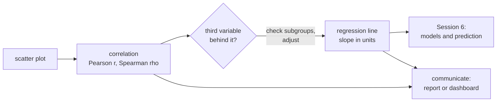
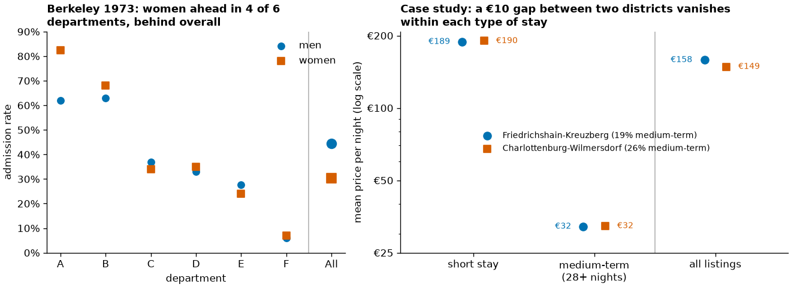
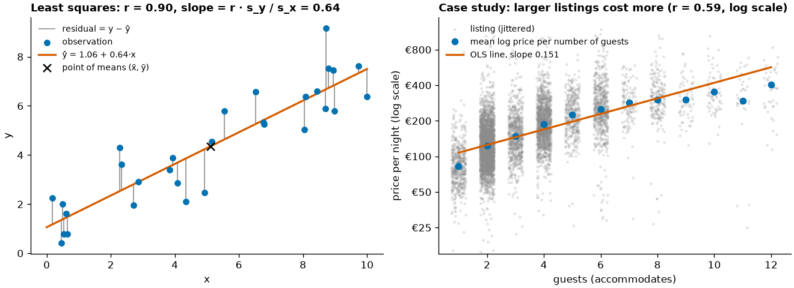
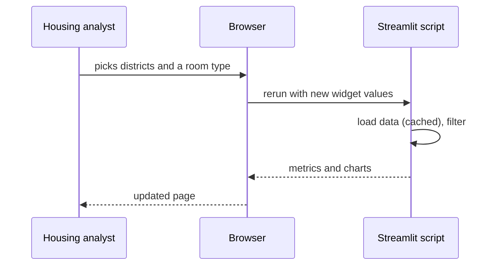

# Relationships, confounding and communicating findings

The last block moves from comparing groups to relationships between two numeric variables. We recap the scatter plot and two correlation coefficients (Pearson and Spearman), then look at **confounding**: a third variable that creates, hides or reverses a relationship, with Simpson's paradox as the extreme case. The least-squares line through a scatter plot is the bridge to regression in Session 6. The page ends with how to communicate findings to a non-technical reader: a one-page report or a small Streamlit dashboard.



## Scatter plots

### Concept

A **scatter plot** places one point per observation at (x, y). Read it for four things: **direction** (up, down, none), **form** (straight, curved, clusters), **strength** (how tightly points follow the form) and **unusual points** (outliers, points with extreme x).

With many observations, points overlap (**overplotting**) and the plot shows only the outline of the data. Remedies: transparency (`alpha`), a random subsample, small jitter for integer values, a 2D histogram or hexbin plot, and binned means.

### Why it matters

A correlation coefficient summarises a scatter plot in one number. Without looking at the plot you cannot tell whether that number describes a straight-line relationship, a curve or two outliers.

### How it works in Python

```python
import matplotlib.pyplot as plt
import numpy as np
import pandas as pd

listings = pd.read_parquet("case-study/data/airbnb/listings.parquet")
short = listings[listings["price"].notna() & listings["minimum_nights"].lt(28)]   # comparable prices
x = short["accommodates"]                                # number of guests: a small count
y = np.log10(short["price"])                             # log10 of the price: price is right-skewed
rng = np.random.default_rng(0)

fig, (left, right) = plt.subplots(1, 2, figsize=(10, 3.8), layout="constrained")
left.scatter(x + rng.uniform(-0.3, 0.3, len(x)), y, s=3, alpha=0.1)   # jitter + transparency
hb = right.hexbin(x, y, gridsize=25, bins="log", cmap="viridis")      # counts per hexagon
fig.colorbar(hb, ax=right, label="listings (log scale)")
for ax in (left, right):
    ax.set(xlabel="guests (accommodates)", ylabel="log10(price per night in EUR)")
print(x.value_counts().head(3).to_dict())   # {2: 2599, 4: 1352, 3: 706}: integer values overlap
```

### In practice

- Gapminder's bubble charts of income against life expectancy (Hans Rosling) made the scatter plot a standard tool of public communication.
- Quality engineering plots process settings against defect rates to find operating windows.
- Real-estate analysts plot price against floor area before fitting any model; the same holds for nightly prices against the number of guests.

> [!TIP]
> Put the variable you think of as the "cause" or predictor on the x-axis and the outcome on the y-axis. It does not prove anything, but it matches how readers read the plot and how regression is written.

## Pearson and Spearman correlation

### Concept

- **Pearson's r** measures how closely points follow a **straight line**, from −1 through 0 to +1. **r²** is the share of the variance of y that a straight line explains.
- **Spearman's ρ** (rho) is Pearson's r computed on the **ranks**. It captures any **monotonic** relationship (always up or always down, not necessarily straight) and resists outliers.

Worked example: for the points (1, 1), (2, 3), (3, 2), (4, 100), Pearson's r is about 0.78, driven by the last point. The ranks of y are 1, 3, 2, 4, and Spearman's ρ = 0.8. Change 100 to 1,000 and Pearson moves to 0.77 while Spearman stays at 0.8, because the ranks do not change.

r is not the slope. r = 0.9 can mean that y rises by 1 cent or by 1,000 euros per unit of x; the slope is regression's job. r also misses curves: a perfect U-shape has r ≈ 0.

### Why it matters

Correlation is the first screen for variables that move together: candidate features, KPI drivers worth investigating, redundant predictors. Choosing the wrong coefficient can make a clear relationship look weak.

### How it works in Python

```python
import numpy as np
import pandas as pd
from scipy import stats

listings = pd.read_parquet("case-study/data/airbnb/listings.parquet")
short = listings[listings["price"].notna() & listings["minimum_nights"].lt(28)]
guests, price = short["accommodates"], short["price"]

print(round(stats.pearsonr(guests, price).statistic, 3))     # 0.408
print(round(stats.spearmanr(guests, price).statistic, 3))    # 0.642
res = stats.pearsonr(guests, np.log(price))
ci = res.confidence_interval()
print(round(res.statistic, 3), round(ci.low, 3), round(ci.high, 3))   # 0.594 0.579 0.61

# Is Pearson driven by a few points? Drop the 5 most expensive listings (up to 10,025 EUR)
keep = ~price.index.isin(price.nlargest(5).index)
print(round(stats.pearsonr(guests[keep], price[keep]).statistic, 3))   # 0.573: five points out of 6,701

# rating and price: no monotonic relationship
rated = short.dropna(subset=["review_scores_rating"])
print(round(stats.spearmanr(rated["review_scores_rating"], rated["price"]).statistic, 3))                           # 0.036
print(round(stats.spearmanr(rated["review_scores_rating"], rated["price"] / rated["accommodates"]).statistic, 3))   # 0.175
```

The three coefficients tell different stories about the same scatter plot. Pearson's r on raw prices is 0.41; Spearman's ρ is 0.64; Pearson on the log price is 0.59. The gap is the worked example in real data: five listings with prices in the thousands (out of 6,701) hold down Pearson's r on the raw scale, and removing them raises it from 0.41 to 0.57. Spearman and the log scale are not fooled by them. Larger listings clearly cost more, and the relationship is strong. Ratings, by contrast, are unrelated to the nightly price (ρ = 0.04), and only weakly related to the price per guest (ρ = 0.18): guests rate value for money, not price.

### In practice

- Finance computes correlation matrices of asset returns for portfolio construction; analysts use rank correlation when returns have heavy tails.
- Psychometrics reports the correlation between two administrations of a test as its test–retest reliability.
- Marketing analysts correlate advertising spend with sales, where both follow the season (see confounding below).

> [!CAUTION]
> **Correlation is not causation.** Larger listings may cost more because hosts charge per guest, because large flats are in expensive central buildings, or because entire homes are both larger and pricier than rooms. The correlation alone cannot tell these apart; adding one guest's bed to a flat does not raise its market price by the slope of the line.

## Confounding and Simpson's paradox

### Concept

A **confounder** is a third variable that is related to both variables of interest and creates or distorts the relationship between them. **Simpson's paradox** is the extreme case: a relationship in the pooled data vanishes or reverses inside every (or most) subgroups.

The classic real case is the 1973 graduate admissions at UC Berkeley (Bickel, Hammel & O'Connell, 1975). Pooled over the six largest departments, 45 % of men and 30 % of women were admitted. Department by department, women were admitted at a higher rate in four of six. Women had applied more often to the departments that rejected most applicants. The department was the confounder.



The listings contain a real, milder version. Among all listings with a price, Friedrichshain-Kreuzberg is €10 more expensive than Charlottenburg-Wilmersdorf on average (€158.5 against €148.5). Within each type of stay the gap disappears: short stays cost €188.6 and €190.1, medium-term listings €32.2 and €32.3, both slightly *higher* in Charlottenburg-Wilmersdorf. The pooled gap comes entirely from the mix: 26 % of the priced listings in Charlottenburg-Wilmersdorf are medium-term offers with their low price field, against 19 % in Friedrichshain-Kreuzberg. Strictly, this is a reversal, but within the groups the differences (€0.1 and €1.5) are far too small to matter; the honest summary is "the gap vanishes", not "the order reverses". We searched all district pairs for a reversal that is large and robust and found none; we report what we found.

The type of stay is not the only confounder. Among short-stay listings, Neukölln is 28 % cheaper than Mitte in a regression of log price on district alone, and 20 % cheaper once room type and number of guests are held fixed: about a third of the raw gap reflects that Neukölln has more private rooms and smaller listings.

### Why it matters

Before acting on any relationship, ask: what else differs between these groups? This question is the reason randomised experiments exist (A/B tests on [page 3](03-comparing-groups-and-tests.md#ab-tests-as-an-application)) and the reason regression adds control variables (Session 6).

### How it works in Python

```python
import numpy as np
import pandas as pd
import statsmodels.formula.api as smf

listings = pd.read_parquet("case-study/data/airbnb/listings.parquet")
priced = listings[listings["price"].notna()].copy()
priced["stay"] = np.where(priced["minimum_nights"].ge(28), "medium-term", "short")
pair = priced[priced["district"].isin(["Friedrichshain-Kreuzberg", "Charlottenburg-Wilm."])]

print(pair.groupby("district")["price"].mean().round(1).to_dict())
# {'Charlottenburg-Wilm.': 148.5, 'Friedrichshain-Kreuzberg': 158.5}   <- pooled: a 10 EUR gap
print(pair.groupby(["district", "stay"])["price"].mean().unstack().round(1))
# stay                      medium-term  short
# district
# Charlottenburg-Wilm.             32.3  190.1
# Friedrichshain-Kreuzberg         32.2  188.6                         <- within each stay type: no gap
print(pair.groupby("district")["stay"].apply(lambda s: (s == "medium-term").mean()).round(2).to_dict())
# {'Charlottenburg-Wilm.': 0.26, 'Friedrichshain-Kreuzberg': 0.19}     <- the mix differs

short = priced[priced["stay"] == "short"].assign(log_price=lambda d: np.log(d["price"]))
raw = smf.ols('log_price ~ C(district, Treatment("Mitte"))', data=short).fit()
adjusted = smf.ols('log_price ~ C(district, Treatment("Mitte")) + C(room_type) + accommodates', data=short).fit()
name = 'C(district, Treatment("Mitte"))[T.Neukölln]'
print(round(np.exp(raw.params[name]) - 1, 3), round(np.exp(adjusted.params[name]) - 1, 3))   # -0.282 -0.195
```

The pooled district comparison mixes two things: the price of comparable listings and the composition of each district's offer. Neither "28 % cheaper" nor "20 % cheaper" is "the" effect of the district; the second answers a different question ("for a listing of the same type and size"). Size and room type may not be the only differences: location within the district, flat quality and the share of professional hosts also vary, and the data cannot rule out further confounders.

### In practice

- Hospital league tables: a specialist hospital that treats sicker patients can have a higher raw mortality rate than a general hospital and still be better for every type of patient; risk adjustment addresses this.
- Kidney-stone treatment (Charig et al., 1986): treatment A had higher success rates for both small and large stones, but treatment B looked better pooled, because A was used more often for the harder large stones.
- Marketing attribution: a channel looks best in aggregate only because it runs in the strongest market.

> [!WARNING]
> Adjusting for a variable is not always right. Adjusting for a variable that is itself caused by the treatment (a **mediator** or a **collider**) can create bias. Draw the causal story before deciding what to control for.

## From correlation to the regression line

### Concept

The **least-squares line** ŷ = b₀ + b₁·x is the straight line that minimises the sum of squared vertical distances (**residuals** y − ŷ) between the points and the line. Its slope and intercept follow directly from the correlation:

b₁ = r · s_y / s_x and b₀ = ȳ − b₁ · x̄,

where s_x and s_y are the standard deviations. The line always passes through the point of means (x̄, ȳ). In simple regression, the **R²** of the line equals r².



Worked example: if r = 0.5, s_x = 2 and s_y = 10, then b₁ = 0.5 × 10 / 2 = 2.5: y rises by 2.5 units per unit of x. The correlation is symmetric in x and y; the slope is not.

### Why it matters

The regression line turns "these variables move together" into "how much y changes per unit of x", in the units of the data, and gives a prediction for new x values. Session 6 builds on it: several predictors, training and test data, error metrics.

### How it works in Python

```python
import numpy as np
import pandas as pd

listings = pd.read_parquet("case-study/data/airbnb/listings.parquet")
short = listings[listings["price"].notna() & listings["minimum_nights"].lt(28)]
x = short["accommodates"]
y = np.log(short["price"])           # natural log: coefficients read as approximate percentages

r = np.corrcoef(x, y)[0, 1]
b1 = r * y.std() / x.std()            # slope from the correlation
b0 = y.mean() - b1 * x.mean()         # line through the point of means
print(round(r, 3), round(b1, 3), round(b0, 3))       # 0.594 0.151 4.526
print(np.polyfit(x, y, deg=1).round(3))              # [0.151 4.526]: numpy agrees
residuals = y - (b0 + b1 * x)
r2 = 1 - (residuals**2).sum() / ((y - y.mean())**2).sum()
print(round(r2, 3), round(r**2, 3))                  # 0.353 0.353: R² = r² in simple regression
print(round(np.exp(b1) - 1, 3), round(np.exp(b0 + b1 * 2), 0), round(np.exp(b0 + b1 * 4), 0))   # 0.163 125.0 169.0
```

With y on the natural-log scale, a slope of 0.151 means: each additional guest goes with a price about e^0.151 − 1 ≈ 16 % higher. The line predicts €125 for a listing for two guests and €169 for four (these are typical, geometric-mean prices, not means). R² = 0.35: the number of guests explains about a third of the variation in log price; room type, location and much else explain the rest (Session 6). The binned means in the figure bend below the line for large listings: the relationship flattens above about eight guests.

### In practice

- Galton (1886) introduced the term "regression" when he fitted a line to the heights of parents and their adult children and found that children of tall parents were, on average, less extreme ("regression towards the mean").
- Laboratory calibration curves map an instrument signal to a known concentration with a least-squares line.
- Hedonic price indices at statistical offices start from regressions of price on product characteristics.

> [!NOTE]
> Workbooks [16](../workbooks/16-correlation-and-simple-regression.ipynb) and [17](../workbooks/17-seaborn-regression.ipynb) show the same bridge in scipy, statsmodels and seaborn (`regplot`, `lmplot`, residual plots).

## Communicating findings: a short report or a Streamlit dashboard

### Concept

A finding for a non-technical reader follows a fixed order:

1. **the finding first**, as a full sentence ("A night in Mitte costs about a fifth more than a comparable night in Neukölln");
2. **one number with its context** (median short-stay price €187 in Mitte and €130 in Neukölln; holding room type and number of guests fixed, Neukölln is about 20 % cheaper);
3. **what it means for the reader's decision** (for a city housing analyst: the raw gap overstates the location premium, because Neukölln offers more private rooms);
4. **one limitation** (listed prices, not paid prices; one snapshot from June 2026; medium-term listings excluded because their price field is not comparable).

A **one-page report** puts three to five such findings on a page, each with one chart. A **dashboard** gives repeated access to the same analysis with the reader's own filters.

**Streamlit** turns a Python script into a web app. The script runs from top to bottom; widgets such as `st.slider` return the current user input, and `st.metric` or `st.plotly_chart` display results. Every time the user changes a widget, the whole script runs again. Expensive steps are therefore **cached** with `@st.cache_data`. The app is started with `streamlit run app.py` and opens at `http://localhost:8501`.



### Why it matters

Most analyses reach decision makers as one chart and a few sentences. A finding that is correct but not understood has no effect. A dashboard avoids repeated one-off requests ("can you rerun this for private rooms in Pankow?") and is one option for the user interface of a deployed model in Session 16.

### How it works in Python

The complete app is [`workbooks/dashboard_app.py`](../workbooks/dashboard_app.py). Its core:

```python
# dashboard core: start the full app with  streamlit run sessions/05-eda-and-statistics/workbooks/dashboard_app.py
import pandas as pd
import plotly.express as px
import streamlit as st

@st.cache_data                     # read the file once, not on every interaction
def load() -> pd.DataFrame:
    listings = pd.read_parquet("case-study/data/airbnb/listings.parquet")
    return listings[listings["price"].notna() & listings["minimum_nights"].lt(28)]

short = load()
st.title("Short-stay listings in Berlin: prices by district")
room_types = st.sidebar.multiselect("Room types", sorted(short["room_type"].unique()), default=["Entire home/apt"])
max_guests = st.sidebar.slider("Guests up to", 1, 16, 4)

sel = short[short["room_type"].isin(room_types) & short["accommodates"].le(max_guests)]
st.metric("Listings", f"{len(sel):,}")
by_district = sel.groupby("district", as_index=False)["price"].median().sort_values("price")
st.plotly_chart(px.bar(by_district, x="price", y="district", orientation="h"))
```

Run outside Streamlit, the script prints warnings and draws nothing; that is expected. Start it with `streamlit run`.

### In practice

- Snowflake acquired Streamlit in 2022 and offers it inside its data platform for internal data apps.
- Hugging Face Spaces hosts thousands of public Streamlit and Gradio demos of machine-learning models.
- The UK Office for National Statistics and Eurostat publish short statistical bulletins that follow the "main points first" structure.

> [!IMPORTANT]
> **Practice (block 3).** How strongly does the price rise with the number of guests (Pearson, Spearman, log scale), and do district price differences survive once room type, size and the type of stay are taken into account? Write a one-page summary for a city housing analyst, or extend the dashboard of prices and listings by district. Notebook: [18-case-study-airbnb-exploration.ipynb](../workbooks/18-case-study-airbnb-exploration.ipynb).

> [!WARNING]
> **Dashboards spread mistakes.** A wrong filter or an unlabelled axis in a dashboard is seen by everyone who opens it, every day. Test the numbers against a notebook, label units, and show the data period and the number of observations on the page.

## Check your understanding

1. Pearson's r between guests and price rises from 0.41 to 0.57 when the five most expensive listings are dropped, while Spearman's ρ is 0.64 either way. Why?
2. Name two variables other than room type and size that could confound the price difference between Mitte and Neukölln.
3. In the Berkeley case, what was the confounder and how did it produce the pooled gap?
4. If r = −0.4, s_x = 5 and s_y = 2, what is the slope of the least-squares line?
5. Write the four-part summary (finding, number, meaning, limitation) for the comparison of entire homes and private rooms.

## Further reading

- Downey, A. B. (2025). *Think Stats* (3rd ed.), chapter 7 "Relationships between variables". <https://allendowney.github.io/ThinkStats/chap07.html>
- Bickel, P. J., Hammel, E. A., & O'Connell, J. W. (1975). Sex bias in graduate admissions: Data from Berkeley. *Science*, 187(4175), 398–404. <https://doi.org/10.1126/science.187.4175.398>
- Pearl, J., Glymour, M., & Jewell, N. P. (2016). *Causal Inference in Statistics: A Primer*, chapter 1 (Simpson's paradox). Wiley.
- Streamlit (2026). *Get started: tutorials*. <https://docs.streamlit.io/get-started/tutorials>
