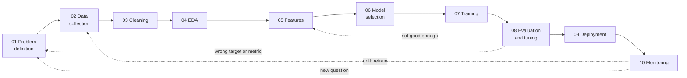
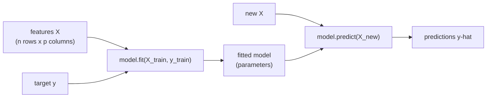

# The ML lifecycle and linear regression

This page opens the machine-learning part of the course. It places every later session in the **machine-learning lifecycle**, a sequence of ten steps from problem definition to monitoring, and introduces the vocabulary of supervised learning: features, target, training and prediction. Then it covers the first model, **linear regression**: the split into training and test data, simple and multiple regression fitted by least squares, residuals, and the three standard error metrics MAE, RMSE and R². The running example explains the length of the description of goods in a Binding Tariff Information decision (on the log scale) by its language, its section of the nomenclature and its year. This target is chosen for practice, not for the leaderboard: it has clear, interpretable effects and needs no text model.

## The ML lifecycle in ten steps

### Concept

A machine-learning project is more than fitting a model. The **lifecycle** describes the steps from a business question to a model that runs and is maintained in production:

| Step | Question | Course sessions |
|---|---|---|
| 01 Problem definition | What do we predict, for whom, measured how? What is the baseline? | S4, S6 |
| 02 Data collection | Which data exist, and may we use them? | S2, S3 |
| 03 Data cleaning and preprocessing | Are the data correct, complete, consistent? | S4 |
| 04 Exploratory data analysis | What is in the data; which relationships are real? | S5 |
| 05 Feature engineering and selection | Which inputs does the model get? | S8, S9, S11, S13, S14 |
| 06 Model selection | Which family of models fits the problem? | S7–S10 |
| 07 Model training | Fit the parameters on training data. | S6, S8, S10–S15 |
| 08 Model evaluation and tuning | How good is it on new data; which settings are best? | S6–S8, S10–S15 |
| 09 Model deployment | Make predictions available to users or systems. | S16 |
| 10 Model monitoring and maintenance | Does it still work as the world changes? | S16 |



The arrows back are the point of the diagram: projects loop. An evaluation that fails sends you back to features or data; monitoring that detects a change sends you back to data collection and retraining.

**Problem definition** fixes three things: the **target** (what is predicted), the **metric** (how success is measured) and the **baseline** (the simplest prediction the model must beat). For the course leaderboard (Session 8 onwards): target = four-digit HS heading of a decision (1,114 classes in the training data), metric = accuracy with macro-F1 alongside, baseline = always the most frequent heading 3926, "other articles of plastics" (accuracy 0.041 on the 2024 test decisions).

### Why it matters

Most failed ML projects fail outside the training step: a target that does not match the business decision, data that are not available at prediction time, or a model nobody maintains. Naming the steps makes these risks visible early. Sessions 3–5 already covered steps 02–04 for the EBTI data.

### How it works in Python

Step 01 in code: state the target, the metric and the baseline before any model.

```python
import numpy as np
import pandas as pd

decisions = pd.read_parquet("case-study/data/train_sample.parquet")

# 01 problem definition for this page: explain log(characters) of a description
target = np.log(decisions["description"].str.len())
metric = "MAE"                                     # mean absolute error, in log units
baseline = np.full(len(target), target.mean())     # predict the mean for every decision
print(round(np.mean(np.abs(target - baseline)), 3))   # 0.511: every model must beat this

# 01 for the leaderboard task: target = heading, baseline = the most frequent heading
print(decisions["heading"].value_counts(normalize=True).head(1).round(3).to_dict())   # {'3926': 0.04}
```

### In practice

- CRISP-DM (1999), developed by a consortium including Daimler-Benz, SPSS and NCR, is the classic six-phase process model for data mining; most lifecycle diagrams descend from it.
- Google's "Rules of Machine Learning" (Zinkevich) advises starting with a simple baseline and a well-defined metric before investing in complex models.
- Sculley et al. (2015) at Google described the "hidden technical debt" of ML systems: the model code is a small part of a system dominated by data collection, feature extraction, serving and monitoring.

> [!IMPORTANT]
> **Practice (block 1, part 1).** Map the heading-classification task of the leaderboard to the ten steps: for each step, write one sentence on what it means for this task and which session covers it. Example for step 02: the data are the published EBTI export; the test set contains only what a trader's request contains (description, country, language, date), so `keywords` and `classification_justification` cannot be features.

## Supervised learning: features, target, training, prediction

### Concept

- An **observation** (row, example) is one unit: a decision, a customer.
- The **features** (inputs, predictors, X) are the information available about it: language, issuing country, date, the description itself.
- The **target** (outcome, label, y) is what we want to predict: the length of a description (this page), the heading (the leaderboard), churn yes/no.
- A **model** is a family of prediction rules with free **parameters**; **training** (fitting) chooses the parameters from labelled examples; **prediction** applies the fitted rule to new observations.

**Supervised learning** learns from examples with a known target. It is **regression** when the target is a number and **classification** when it is a category. **Unsupervised learning** has no target and looks for structure (clusters, Session 11).



Every scikit-learn model follows this interface: `fit(X, y)` learns, `predict(X)` returns predictions, `score(X, y)` returns a default metric (R² for regressors, accuracy for classifiers).

### Why it matters

The vocabulary is shared by every library, paper and job description. Being precise about what counts as a feature also prevents **leakage**: a feature that is not known at prediction time (for example the customs' classification justification, which names the heading in about 70 % of the decisions, when predicting the heading) makes a model look better than it can be (Session 7).

### How it works in Python

```python
import numpy as np
import pandas as pd
from sklearn.linear_model import LinearRegression

decisions = pd.read_parquet("case-study/data/train_sample.parquet")
decisions["year"] = decisions["start_date"].dt.year
decisions["german"] = (decisions["language"] == "de").astype(int)

X = decisions[["year", "german"]]                       # features: a table, one column per feature
y = np.log(decisions["description"].str.len())          # target: one number per decision
model = LinearRegression().fit(X, y)                    # training: choose the parameters
print(model.coef_.round(3))                             # [0.021 0.755]
print(model.predict(X.head(3)).round(2))                # [5.79 5.79 5.79]: three Swedish decisions of 2017
```

### In practice

- Spam filters are supervised classifiers trained on messages that users have marked as spam.
- Real-estate platforms such as Zillow predict sale prices (regression) from features of the property.
- Credit scoring predicts default (classification) from application and account data.

> [!NOTE]
> Statisticians and ML practitioners use different words for the same things: predictor = feature, response = target, fit = train, estimate = learned parameter. ISLP ([workbook 04](../workbooks/04-islp-linear-regression-lab.ipynb)) uses the statistical terms.

## The data split into training and test sets

### Concept

A model is useful if it predicts **new** observations well. To estimate this, hold back part of the labelled data as a **test set**, fit only on the **training set**, and evaluate once on the test set. The score on the training data is optimistic because the model has seen the answers.

`train_test_split` shuffles the rows and splits them, commonly 80/20 or 75/25. A fixed `random_state` makes the split reproducible. For classification, `stratify=y` keeps the class shares equal in both parts. When predictions are about the future, split by time instead (Sessions 7 and 12); the course leaderboard does exactly that (train 2017–2023, test 2024–2026).

### Why it matters

Without a held-out test set, a more complex model always looks better, whether it has learned a pattern or memorised the data ([page 2](02-overfitting-and-robust-regression.md)). The test score is our estimate of performance on next month's decisions.

### How it works in Python

```python
import numpy as np
import pandas as pd
from sklearn.model_selection import train_test_split

decisions = pd.read_parquet("case-study/data/train_sample.parquet")
decisions["log_chars"] = np.log(decisions["description"].str.len())

train, test = train_test_split(decisions, test_size=0.2, random_state=42)
print(len(train), len(test))                                     # 40000 10000
print(round(train["log_chars"].mean(), 3), round(test["log_chars"].mean(), 3))   # 6.285 6.269
```

### In practice

- Kaggle competitions and the course leaderboard keep the test labels hidden, so that nobody can fit to them.
- Regulated applications such as credit scoring validate models on data that were not used for development (out-of-time validation).
- Medical prediction models are judged by external validation: performance on patients from other hospitals.

> [!CAUTION]
> **Touch the test set once.** If you try ten models and keep the one with the best test score, the test score is no longer an honest estimate. Choose models on the training data (cross-validation, Session 7), then evaluate the final choice once.

## Simple and multiple linear regression

### Concept

**Simple linear regression** describes the target as a straight line in one feature: ŷ = b₀ + b₁·x. The **intercept** b₀ is the prediction at x = 0; the **slope** b₁ is the change in ŷ per one-unit increase of x. The **residual** of an observation is y − ŷ, its vertical distance to the line.

**Ordinary least squares (OLS)** chooses the coefficients that minimise the sum of squared residuals. For one feature: b₁ = Σ(x − x̄)(y − ȳ) / Σ(x − x̄)², b₀ = ȳ − b₁·x̄ (the line passes through the point of means; Session 5, [page 4](../../05-eda-and-statistics/theory/04-correlation-and-communication.md#from-correlation-to-the-regression-line)).

Worked example: points (1, 2), (2, 3), (3, 5). x̄ = 2, ȳ = 10/3. Σ(x − x̄)(y − ȳ) = (−1)(−4/3) + 0 + (1)(5/3) = 3; Σ(x − x̄)² = 2. So b₁ = 1.5 and b₀ = 10/3 − 3 = 0.33: ŷ = 0.33 + 1.5x.

**Multiple linear regression** adds features: ŷ = b₀ + b₁x₁ + b₂x₂ + … Each coefficient is the expected change in y for a one-unit change in that feature **while the other features are held fixed**. This is why a coefficient can shrink or change sign when another feature is added. A categorical feature enters as 0/1 **dummy variables**, one per category except a reference category.

A **residual plot** (residuals against fitted values) checks the model: it should show a band without structure around zero.


The right panel shows the description-length model of this page. The band is centred on zero and roughly even in width, but it is not symmetric: the residuals have a long lower tail. Some descriptions are much shorter than the model expects for their language and section (a single line such as a product name), while few are much longer. Because the features are categories, the fitted values also cluster around the typical values of the large languages (German on the right, French and English on the left). The model is a reasonable first approximation, but it misses whatever else makes a description short.

### Why it matters

Linear regression is the reference model for numeric targets: fast, interpretable, and often hard to beat with small data. Its coefficients answer "how much does y change with x, holding the rest fixed?", the form a report needs. Every more flexible model in the course is compared with it.

### How it works in Python

statsmodels gives the statistical view (coefficients with standard errors and confidence intervals); scikit-learn gives the prediction view (fit, predict, score).

```python
import numpy as np
import pandas as pd
import statsmodels.formula.api as smf
from sklearn.linear_model import LinearRegression
from sklearn.model_selection import train_test_split

decisions = pd.read_parquet("case-study/data/train_sample.parquet")
nomenclature = pd.read_parquet("case-study/data/nomenclature.parquet")
decisions = decisions.merge(nomenclature[["heading", "section"]], on="heading")
decisions["log_chars"] = np.log(decisions["description"].str.len())
decisions["year"] = decisions["start_date"].dt.year - 2017          # 0 = 2017
top = decisions["language"].value_counts().index[:8]                 # rare languages -> "other"
decisions["language"] = decisions["language"].where(decisions["language"].isin(top), "other")
train, test = train_test_split(decisions, test_size=0.2, random_state=42)

# statsmodels: formula interface, intercept added automatically, dummies via C()
simple = smf.ols("log_chars ~ year", data=train).fit()
print(simple.params.round(3).to_dict())                  # {'Intercept': 6.212, 'year': 0.025}
fit = smf.ols('log_chars ~ year + C(language, Treatment("de")) + C(section)', data=train).fit()
lang = fit.params.filter(like="language")
print({name[-3:-1]: round(value, 2) for name, value in lang.items() if name[-3:-1] in ("en", "fr", "nl")})
# {'en': -0.89, 'fr': -0.96, 'nl': -0.23}
print(fit.conf_int().loc["year"].round(3).tolist())      # [0.019, 0.024]
print(round(simple.rsquared, 3), round(fit.rsquared, 3))   # 0.006 0.442

# scikit-learn: the same model with explicit dummy columns, prediction interface
X = pd.get_dummies(decisions[["year", "language", "section"]], drop_first=True, dtype=float)
model = LinearRegression().fit(X.loc[train.index], train["log_chars"])
residuals = test["log_chars"] - model.predict(X.loc[test.index])
print(round(residuals.mean(), 3))                         # 0.0: centred on zero on test data
```

Interpretation: the reference language is German. Holding year and section fixed, a French description is on average e^(−0.96) ≈ 0.38 times as long as a German one, that is about 62 % shorter; an English one about 59 % shorter, a Dutch one about 21 % shorter. The year coefficient (about 0.02) means descriptions became roughly 2 % longer per year, at equal language and section. Year alone explains almost nothing (R² 0.006); language and section together explain 44 % of the variance of log length. A coefficient on the log scale reads as a percentage change: e^b − 1.

### In practice

- Hedonic regression: statistical offices regress prices on product characteristics to adjust price indices for quality change (housing, computers).
- Labour economics: wage equations with education and experience as predictors (Mincer equation).
- Marketing mix models regress sales on advertising spend per channel, controlling for season and price.

> [!WARNING]
> **Coefficients are not causal effects.** "Holding fixed" means "comparing observations with equal values in the data", not "changing x in the world". A coefficient can absorb the effect of omitted variables (confounding, Session 5).

## Regression metrics

### Concept

With yᵢ the true values, ŷᵢ the predictions and n observations:

- **MAE** (mean absolute error) = mean of |yᵢ − ŷᵢ|: the typical error, in the units of y.
- **RMSE** (root mean squared error) = √(mean of (yᵢ − ŷᵢ)²): also in units of y, but squares errors first, so large errors weigh more. RMSE ≥ MAE always.
- **R²** = 1 − Σ(yᵢ − ŷᵢ)² / Σ(yᵢ − ȳ)²: the share of the variance of y that the model explains, compared with predicting the mean. 1 is perfect, 0 is no better than the mean, and on test data it can be negative.

Worked example: errors of 1, −1 and 4 give MAE = (1 + 1 + 4) / 3 = 2 and RMSE = √((1 + 1 + 16) / 3) = √6 ≈ 2.45. The single large error moves RMSE more than MAE.

### Why it matters

The metric defines what "good" means. MAE suits costs that grow linearly with the error; RMSE suits settings where large errors are disproportionately bad. R² has no unit and is easy to compare across models on the same data, but not across datasets. Always compare with the baseline.

### How it works in Python

```python
import numpy as np
import pandas as pd
from sklearn.dummy import DummyRegressor
from sklearn.linear_model import LinearRegression
from sklearn.metrics import mean_absolute_error, r2_score, root_mean_squared_error
from sklearn.model_selection import train_test_split

decisions = pd.read_parquet("case-study/data/train_sample.parquet")
nomenclature = pd.read_parquet("case-study/data/nomenclature.parquet")
decisions = decisions.merge(nomenclature[["heading", "section"]], on="heading")
decisions["log_chars"] = np.log(decisions["description"].str.len())
decisions["year"] = decisions["start_date"].dt.year - 2017
top = decisions["language"].value_counts().index[:8]
decisions["language"] = decisions["language"].where(decisions["language"].isin(top), "other")
X = pd.get_dummies(decisions[["year", "language", "section"]], drop_first=True, dtype=float)
X_train, X_test, y_train, y_test = train_test_split(X, decisions["log_chars"], test_size=0.2, random_state=42)

language_cols = ["year"] + [c for c in X if c.startswith("language_")]
models = {"baseline (mean)": (DummyRegressor(strategy="mean"), ["year"]),
          "year + language": (LinearRegression(), language_cols),
          "year + language + section": (LinearRegression(), list(X.columns))}
for name, (model, cols) in models.items():
    model.fit(X_train[cols], y_train)
    pred = model.predict(X_test[cols])
    print(f"{name:26s} MAE {mean_absolute_error(y_test, pred):.3f}  "
          f"RMSE {root_mean_squared_error(y_test, pred):.3f}  R2 {r2_score(y_test, pred):.3f}")
```

```
baseline (mean)            MAE 0.510  RMSE 0.654  R2 -0.000
year + language            MAE 0.390  RMSE 0.512  R2 0.386
year + language + section  MAE 0.373  RMSE 0.490  R2 0.438
```

The language alone explains 39 % of the variance of log length on unseen decisions; the section adds 5 points. An MAE of 0.37 on the log scale means a typical prediction is off by a factor of about e^0.37 ≈ 1.45, that is 45 % too long or too short. The model is far better than the baseline, but descriptions of the same language and section still vary a lot.

### In practice

- Energy companies report forecast errors of electricity load as MAPE or RMSE, depending on whether peak errors are costly.
- Weather services evaluate temperature forecasts with RMSE and MAE against station measurements.
- Real-estate valuation models (automated valuation models) are compared by median absolute percentage error.

> [!CAUTION]
> **R² is not accuracy.** An R² of 0.11 can be the best achievable for a noisy outcome, and an R² of 0.95 can hide large errors for a small but important group. Look at the errors in units, and at the residual plot.

## Check your understanding

1. Name the ten lifecycle steps and the step where the target, metric and baseline are fixed.
2. Why is the error on the training data an optimistic estimate of the error on new data?
3. Compute the least-squares line for the points (0, 1), (1, 3), (2, 5).
4. The coefficient of French (reference: German) is −0.96 on the log scale. Explain in one sentence what it compares, and translate it into a percentage.
5. A model has MAE 0.37 and RMSE 0.50 on the same data. What does the gap tell you about the errors?

## Further reading

- James, G., Witten, D., Hastie, T., Tibshirani, R., & Taylor, J. (2023). *An Introduction to Statistical Learning with Applications in Python*, chapters 2–3. Springer. <https://www.statlearning.com/>
- INRIA (2024). *scikit-learn MOOC*, module "Linear models". <https://inria.github.io/scikit-learn-mooc/>
- Chapman, P., et al. (2000). *CRISP-DM 1.0: Step-by-step data mining guide*. SPSS.
- Sculley, D., et al. (2015). Hidden technical debt in machine learning systems. *Advances in Neural Information Processing Systems 28*. <https://papers.nips.cc/paper/5656-hidden-technical-debt-in-machine-learning-systems>
