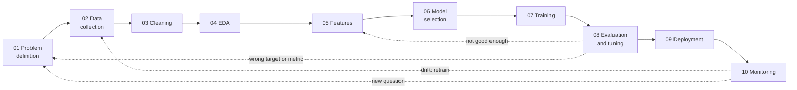
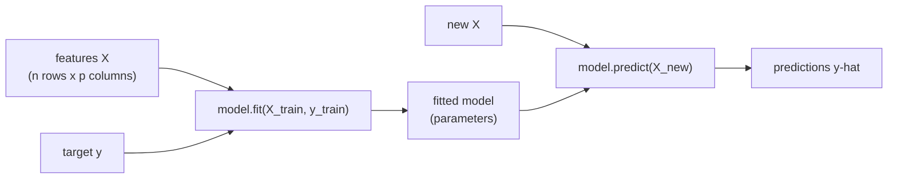
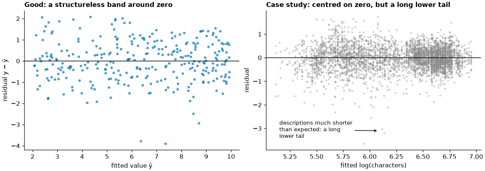

# The ML lifecycle and linear regression

This page opens the machine-learning part of the course. It places every later session in the **machine-learning lifecycle**, a sequence of stages from problem definition to monitoring, and introduces the vocabulary of supervised learning: features, target, training and prediction. Then it covers the first model, **linear regression**: the split into training and test data, simple and multiple regression fitted by least squares, residuals, and the three standard error metrics MAE, RMSE and R². The running example is a question with a real use: **what drives the nightly price of a short-stay Airbnb listing in Berlin?** A host who wants to price a new flat, and a city analyst who wants to know what a night in each district costs, both need the answer in euros. The data are the Inside Airbnb Berlin listings (snapshot of 26 June 2026, CC BY 4.0; `uv run python case-study/prepare_airbnb.py`) restricted, as in Sessions 4 and 5, to the 6,701 listings with a price and a minimum stay below 28 nights.

## The machine learning lifecycle

### Concept

A machine-learning project is more than fitting a model. The **lifecycle** describes the steps from a business question to a model that runs and is maintained in production:

| Step | Question | Course sessions |
|---|---|---|
| 01 Problem definition | What do we predict, for whom, measured how? What is the baseline? | S4, S6 |
| 02 Data collection | Which data exist, and may we use them? | S2, S3 |
| 03 Data cleaning and preprocessing | Are the data correct, complete, consistent? | S4 |
| 04 Exploratory data analysis | What is in the data; which relationships are real? | S5 |
| 05 Feature engineering and selection | Which inputs does the model get? | S8, S9, S11, S13, S14 |
| 06 Model selection | Which family of models fits the problem? | S7–S10 |
| 07 Model training | Fit the parameters on training data. | S6, S8, S10–S15 |
| 08 Model evaluation and tuning | How good is it on new data; which settings are best? | S6–S8, S10–S15 |
| 09 Model deployment | Make predictions available to users or systems. | S16 |
| 10 Model monitoring and maintenance | Does it still work as the world changes? | S16 |



The arrows back are the point of the diagram: projects loop. An evaluation that fails sends you back to features or data; monitoring that detects a change sends you back to data collection and retraining.

**Problem definition** fixes three things: the **target** (what is predicted), the **metric** (how success is measured) and the **baseline** (the simplest prediction the model must beat). For the price model of this page: target = price per night in euros (modelled on the log scale), metric = mean absolute error (MAE) in euros on held-out listings, baseline = the median price of the training listings for every listing (MAE €86). The churn model of block 3 follows the same steps for a yes/no target: target = whether a Telco customer cancels, metric = how well the predicted probabilities separate leavers from stayers (Session 8), baseline = the churn share of 26.5 % for every customer.

### Why it matters

Most failed ML projects fail outside the training step: a target that does not match the business decision, data that are not available at prediction time, or a model nobody maintains. Naming the steps makes these risks visible early. Sessions 3–5 already covered steps 02–04: data collection and SQL on the listings, calendar and reviews (Session 3), cleaning (Session 4) and exploration (Session 5) of the same listings.

### How it works in Python

Step 01 in code: state the target, the metric and the baseline before any model.

```python
import numpy as np
import pandas as pd
from sklearn.model_selection import train_test_split

listings = pd.read_parquet("case-study/data/airbnb/listings.parquet")
short = listings[listings["price"].notna() & listings["minimum_nights"].lt(28)]   # comparable prices (Session 4)
train, test = train_test_split(short, test_size=0.2, random_state=42)

# 01 problem definition: nightly price of a short-stay listing, metric MAE in EUR, baseline = median price
baseline = train["price"].median()
print(baseline, round(np.mean(np.abs(test["price"] - baseline)), 1))   # 156.5 86.4: every model must beat MAE 86 EUR
```

### In practice

- CRISP-DM (1999), developed by a consortium including Daimler-Benz, SPSS and NCR, is the classic six-phase process model for data mining; most lifecycle diagrams descend from it.
- Google's "Rules of Machine Learning" (Zinkevich) advises starting with a simple baseline and a well-defined metric before investing in complex models.
- Sculley et al. (2015) at Google described the "hidden technical debt" of ML systems: the model code is a small part of a system dominated by data collection, feature extraction, serving and monitoring.

> [!IMPORTANT]
> **Practice (block 1, part 1).** What would it take to turn a Berlin price model into a pricing aid for hosts? Map it to the lifecycle: for each stage, write one sentence on what it means for this task and which session covers it. Example for data collection: the data are a public snapshot scraped by Inside Airbnb; `estimated_revenue_l365d` is computed by Inside Airbnb *from* the price, so it cannot be a feature (Session 9 calls this leakage); a new host's flat has no reviews yet, so review features would not be available at prediction time either.

## Supervised learning: features, target, training, prediction

### Concept

- An **observation** (row, example) is one unit: a listing, a customer, a month of reviews.
- The **features** (inputs, predictors, X) are the information available about it: number of guests, room type, location.
- The **target** (outcome, label, y) is what we want to predict: the nightly price (this page), churn yes/no (block 3).
- A **model** is a family of prediction rules with free **parameters**; **training** (fitting) chooses the parameters from labelled examples; **prediction** applies the fitted rule to new observations.

**Supervised learning** learns from examples with a known target. It is **regression** when the target is a number and **classification** when it is a category. **Unsupervised learning** has no target and looks for structure (clusters, Session 11).



Every scikit-learn model follows this interface: `fit(X, y)` learns, `predict(X)` returns predictions, `score(X, y)` returns a default metric (R² for regressors, accuracy for classifiers).

### Why it matters

The vocabulary is shared by every library, paper and job description. Being precise about what counts as a feature also prevents **leakage**: a feature that is not known at prediction time (for example `estimated_revenue_l365d`, which Inside Airbnb computes from the price itself, when predicting the price) makes a model look better than it can be (Session 7).

### How it works in Python

```python
import numpy as np
import pandas as pd
from sklearn.linear_model import LinearRegression

listings = pd.read_parquet("case-study/data/airbnb/listings.parquet")
short = listings[listings["price"].notna() & listings["minimum_nights"].lt(28)].copy()
short["entire_home"] = (short["room_type"] == "Entire home/apt").astype(int)

X = short[["accommodates", "entire_home"]]               # features: a table, one column per feature
y = np.log(short["price"])                                # target: one number per listing (log EUR)
model = LinearRegression().fit(X, y)                      # training: choose the parameters
print(model.coef_.round(3), round(model.intercept_, 3))   # [0.121 0.417] 4.344
print(np.exp(model.predict(X.head(3))).round(0), short["price"].head(3).tolist())
# [149. 272. 189.] [160.71, 193.33, 372.67]: predictions (back in EUR) and true prices of three listings
```

### In practice

- Spam filters are supervised classifiers trained on messages that users have marked as spam.
- Real-estate platforms such as Zillow predict sale prices (regression) from features of the property.
- Credit scoring predicts default (classification) from application and account data.

> [!NOTE]
> Statisticians and ML practitioners use different words for the same things: predictor = feature, response = target, fit = train, estimate = learned parameter. ISLP ([workbook 04](../workbooks/04-islp-linear-regression-lab.ipynb)) uses the statistical terms.

## The data split into training and test sets

### Concept

A model is useful if it predicts **new** observations well. To estimate this, hold back part of the labelled data as a **test set**, fit only on the **training set**, and evaluate once on the test set. The score on the training data is optimistic because the model has seen the answers.

`train_test_split` shuffles the rows and splits them, commonly 80/20 or 75/25. A fixed `random_state` makes the split reproducible. For classification, `stratify=y` keeps the class shares equal in both parts. When predictions are about the future, split by time instead (Sessions 7 and 12); the monthly demand forecast of Session 12 is evaluated that way (train on earlier months, test on later ones). A host with many similar flats is another trap: if some of their listings are in the training set and others in the test set, the test score can be optimistic (grouped splits, Session 7).

### Why it matters

Without a held-out test set, a more complex model always looks better, whether it has learned a pattern or memorised the data ([page 2](02-overfitting-and-robust-regression.md)). The test score is our estimate of performance on listings the model has not seen, such as a host's new flat.

### How it works in Python

```python
import numpy as np
import pandas as pd
from sklearn.model_selection import train_test_split

listings = pd.read_parquet("case-study/data/airbnb/listings.parquet")
short = listings[listings["price"].notna() & listings["minimum_nights"].lt(28)].copy()
short["log_price"] = np.log(short["price"])

train, test = train_test_split(short, test_size=0.2, random_state=42)
print(len(train), len(test))                                     # 5360 1341
print(round(train["log_price"].mean(), 3), round(test["log_price"].mean(), 3))   # 5.067 5.08
print(train["price"].median(), test["price"].median())       # 156.5 159.98: similar, as expected
```

### In practice

- Kaggle competitions and the course leaderboard of Sessions 13–16 keep the test labels hidden, so that nobody can fit to them.
- Regulated applications such as credit scoring validate models on data that were not used for development (out-of-time validation).
- Medical prediction models are judged by external validation: performance on patients from other hospitals.

> [!CAUTION]
> **Touch the test set once.** If you try ten models and keep the one with the best test score, the test score is no longer an honest estimate. Choose models on the training data (cross-validation, Session 7), then evaluate the final choice once.

## Simple and multiple linear regression

### Concept

**Simple linear regression** describes the target as a straight line in one feature: ŷ = b₀ + b₁·x. The **intercept** b₀ is the prediction at x = 0; the **slope** b₁ is the change in ŷ per one-unit increase of x. The **residual** of an observation is y − ŷ, its vertical distance to the line.

**Ordinary least squares (OLS)** chooses the coefficients that minimise the sum of squared residuals. For one feature: b₁ = Σ(x − x̄)(y − ȳ) / Σ(x − x̄)², b₀ = ȳ − b₁·x̄ (the line passes through the point of means; Session 5, [page 4](../../05-eda-and-statistics/theory/04-correlation-and-communication.md#from-correlation-to-the-regression-line)).

Worked example: points (1, 2), (2, 3), (3, 5). x̄ = 2, ȳ = 10/3. Σ(x − x̄)(y − ȳ) = (−1)(−4/3) + 0 + (1)(5/3) = 3; Σ(x − x̄)² = 2. So b₁ = 1.5 and b₀ = 10/3 − 3 = 0.33: ŷ = 0.33 + 1.5x.

**Multiple linear regression** adds features: ŷ = b₀ + b₁x₁ + b₂x₂ + … Each coefficient is the expected change in y for a one-unit change in that feature **while the other features are held fixed**. This is why a coefficient can shrink or change sign when another feature is added. A categorical feature enters as 0/1 **dummy variables**, one per category except a reference category.

A **residual plot** (residuals against fitted values) checks the model: it should show a band without structure around zero.



The right panel shows the price model of this page (log price on guests, room type, distance to the centre and district). The band is centred on zero and roughly even in width, so the log scale has done its job. Both tails are long, though. At the top are listings whose asking price is far above anything comparable (€10,025 for a loft for seven guests, 42 times the fitted price); at the bottom, rooms offered for €9 to €15. These are the extreme prices flagged in Session 4; least squares feels them, which is why [page 2](02-overfitting-and-robust-regression.md#robust-regression-huber) compares it with robust methods. The model is a reasonable first approximation, but it misses whatever else makes a listing cheap or expensive: size in square metres, furnishing, the exact street.

### Why it matters

Linear regression is the reference model for numeric targets: fast, interpretable, and often hard to beat with small data. Its coefficients answer "how much does y change with x, holding the rest fixed?", the form a report needs. Every more flexible model in the course is compared with it.

### How it works in Python

statsmodels gives the statistical view (coefficients with standard errors and confidence intervals); scikit-learn gives the prediction view (fit, predict, score).

```python
import numpy as np
import pandas as pd
import statsmodels.formula.api as smf
from sklearn.linear_model import LinearRegression
from sklearn.model_selection import train_test_split

listings = pd.read_parquet("case-study/data/airbnb/listings.parquet")
short = listings[listings["price"].notna() & listings["minimum_nights"].lt(28)].copy()
short["log_price"] = np.log(short["price"])
short["km_to_centre"] = 111.2 * np.hypot(short["latitude"] - 52.5219,                 # distance to
                                         (short["longitude"] - 13.4132) * np.cos(np.radians(52.52)))  # Alexanderplatz
train, test = train_test_split(short, test_size=0.2, random_state=42)

# statsmodels: formula interface, intercept added automatically, dummies via C()
simple = smf.ols("log_price ~ accommodates", data=train).fit()
print(simple.params.round(3).to_dict())                  # {'Intercept': 4.514, 'accommodates': 0.154}
fit = smf.ols('log_price ~ accommodates + C(room_type) + km_to_centre + C(district, Treatment("Mitte"))',
              data=train).fit()
print(fit.params[["accommodates", "km_to_centre", "C(room_type)[T.Private room]"]].round(3).to_dict())
# {'accommodates': 0.124, 'km_to_centre': -0.02, 'C(room_type)[T.Private room]': -0.398}
print(round(fit.params['C(district, Treatment("Mitte"))[T.Neukölln]'], 3))   # -0.154
print(fit.conf_int().loc["accommodates"].round(3).tolist())   # [0.119, 0.129]
print(round(simple.rsquared, 3), round(fit.rsquared, 3))   # 0.36 0.515

# scikit-learn: the same model with explicit dummy columns, prediction interface
X = pd.get_dummies(short[["accommodates", "km_to_centre", "room_type", "district"]], drop_first=True, dtype=float)
model = LinearRegression().fit(X.loc[train.index], train["log_price"])
residuals = test["log_price"] - model.predict(X.loc[test.index])
print(round(residuals.mean(), 3))                         # 0.012: centred near zero on test data
```

Interpretation: the reference categories are entire homes and the district Mitte. Holding room type, distance and district fixed, each additional guest goes with a price about e^0.124 − 1 ≈ 13 % higher (95 % CI 12.6 % to 13.8 %); alone, without the other features, the guest coefficient is 0.154 (17 %), because larger listings are also more often entire homes. A private room costs e^(−0.398) − 1 ≈ 33 % less than an entire home for the same number of guests; each kilometre from Alexanderplatz about 2 % less; a listing in Neukölln about 14 % less than a comparable one in Mitte. The number of guests alone explains 36 % of the variance of log price; with room type, distance and district, 52 %. A coefficient on the log scale reads as a percentage change: e^b − 1.

### In practice

- Hedonic regression: statistical offices regress prices on product characteristics to adjust price indices for quality change (housing, computers); a price model for listings is a small hedonic model.
- Labour economics: wage equations with education and experience as predictors (Mincer equation).
- Marketing mix models regress sales on advertising spend per channel, controlling for season and price.

> [!WARNING]
> **Coefficients are not causal effects.** "Holding fixed" means "comparing observations with equal values in the data", not "changing x in the world". A coefficient can absorb the effect of omitted variables (confounding, Session 5).

## Regression metrics

### Concept

With yᵢ the true values, ŷᵢ the predictions and n observations:

- **MAE** (mean absolute error) = mean of |yᵢ − ŷᵢ|: the typical error, in the units of y.
- **RMSE** (root mean squared error) = √(mean of (yᵢ − ŷᵢ)²): also in units of y, but squares errors first, so large errors weigh more. RMSE ≥ MAE always.
- **R²** = 1 − Σ(yᵢ − ŷᵢ)² / Σ(yᵢ − ȳ)²: the share of the variance of y that the model explains, compared with predicting the mean. 1 is perfect, 0 is no better than the mean, and on test data it can be negative.

Worked example: errors of 1, −1 and 4 give MAE = (1 + 1 + 4) / 3 = 2 and RMSE = √((1 + 1 + 16) / 3) = √6 ≈ 2.45. The single large error moves RMSE more than MAE.

### Why it matters

The metric defines what "good" means. MAE suits costs that grow linearly with the error; RMSE suits settings where large errors are disproportionately bad. R² has no unit and is easy to compare across models on the same data, but not across datasets. Always compare with the baseline.

### How it works in Python

```python
import numpy as np
import pandas as pd
from sklearn.dummy import DummyRegressor
from sklearn.linear_model import LinearRegression
from sklearn.metrics import mean_absolute_error, r2_score, root_mean_squared_error
from sklearn.model_selection import train_test_split

listings = pd.read_parquet("case-study/data/airbnb/listings.parquet")
short = listings[listings["price"].notna() & listings["minimum_nights"].lt(28)].copy()
short["km_to_centre"] = 111.2 * np.hypot(short["latitude"] - 52.5219,
                                         (short["longitude"] - 13.4132) * np.cos(np.radians(52.52)))
X = pd.get_dummies(short[["accommodates", "room_type", "km_to_centre", "district"]], drop_first=True, dtype=float)
X_train, X_test, y_train, y_test = train_test_split(X, np.log(short["price"]), test_size=0.2, random_state=42)

room = [c for c in X if c.startswith("room_type_")]
models = {"baseline (median)": (DummyRegressor(strategy="median"), ["accommodates"]),
          "guests": (LinearRegression(), ["accommodates"]),
          "+ room type": (LinearRegression(), ["accommodates"] + room),
          "+ distance": (LinearRegression(), ["accommodates", "km_to_centre"] + room),
          "+ district": (LinearRegression(), list(X.columns))}
price_test = np.exp(y_test)
for name, (model, cols) in models.items():
    model.fit(X_train[cols], y_train)
    pred = np.exp(model.predict(X_test[cols]))                     # back to EUR: a typical (median) price
    print(f"{name:18s} MAE {mean_absolute_error(price_test, pred):5.1f}  "
          f"RMSE {root_mean_squared_error(price_test, pred):5.1f}  "
          f"median AE {np.median(np.abs(price_test - pred)):5.1f}  R2(log) {r2_score(y_test, np.log(pred)):.3f}")
```

```
baseline (median)  MAE  86.4  RMSE 175.7  median AE  57.5  R2(log) -0.002
guests             MAE  71.3  RMSE 147.5  median AE  41.4  R2(log) 0.324
+ room type        MAE  65.2  RMSE 143.8  median AE  37.5  R2(log) 0.459
+ distance         MAE  63.6  RMSE 147.8  median AE  36.3  R2(log) 0.486
+ district         MAE  63.0  RMSE 147.6  median AE  35.4  R2(log) 0.501
```

The number of guests alone cuts the typical error from €86 to €71; room type, distance and district bring it to €63, and half of the test listings are predicted within €35 (median absolute error). R² on the log scale rises from 0 to 0.50. The RMSE barely moves (€148) and stays more than twice the MAE: it is dominated by a handful of listings with prices in the thousands, which no model of this kind can predict. Which metric to report depends on the user: a host cares about the typical error (MAE, median AE), a platform that must not misprice expensive listings cares about large errors (RMSE). Predictions are made on the log scale and transformed back with exp, which gives a typical (median-like) price rather than a mean price; for a mean, a correction would be needed.

### In practice

- Energy companies report forecast errors of electricity load as MAPE or RMSE, depending on whether peak errors are costly.
- Weather services evaluate temperature forecasts with RMSE and MAE against station measurements.
- Real-estate valuation models (automated valuation models) are compared by median absolute percentage error.

> [!CAUTION]
> **R² is not accuracy.** An R² of 0.11 can be the best achievable for a noisy outcome, and an R² of 0.95 can hide large errors for a small but important group. Look at the errors in units, and at the residual plot.

## Check your understanding

1. Name the ten lifecycle steps and the step where the target, metric and baseline are fixed.
2. Why is the error on the training data an optimistic estimate of the error on new data?
3. Compute the least-squares line for the points (0, 1), (1, 3), (2, 5).
4. The coefficient of a private room (reference: entire home) is −0.398 on the log scale. Explain in one sentence what it compares, and translate it into a percentage.
5. The full price model has MAE €63 and RMSE €148 on the test listings. What does the gap tell you about the errors, and which number would you show a host?

## Further reading

- James, G., Witten, D., Hastie, T., Tibshirani, R., & Taylor, J. (2023). *An Introduction to Statistical Learning with Applications in Python*, chapters 2–3. Springer. <https://www.statlearning.com/>
- INRIA (2024). *scikit-learn MOOC*, module "Linear models". <https://inria.github.io/scikit-learn-mooc/>
- Chapman, P., et al. (2000). *CRISP-DM 1.0: Step-by-step data mining guide*. SPSS.
- Sculley, D., et al. (2015). Hidden technical debt in machine learning systems. *Advances in Neural Information Processing Systems 28*. <https://papers.nips.cc/paper/5656-hidden-technical-debt-in-machine-learning-systems>
