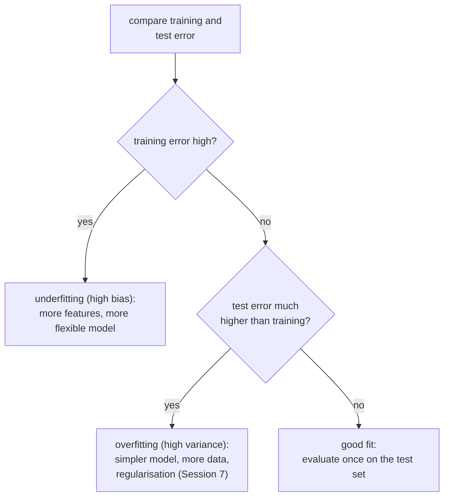
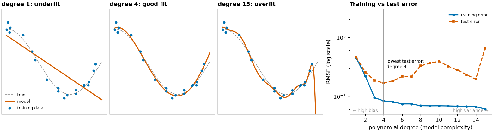
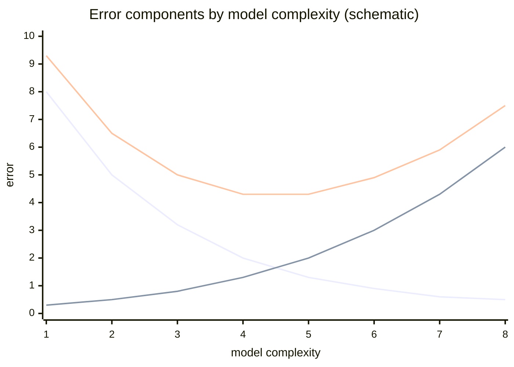
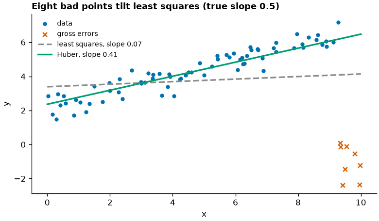

# Underfitting, overfitting and robust regression

A model can fail in two opposite ways: it can be too simple to capture the pattern (**underfitting**) or so flexible that it learns the noise of the training data (**overfitting**). This page shows both with polynomial regression, explains the **bias–variance trade-off** behind them, and shows how to read training and test error together. The second half covers **robust regression**: Huber regression and quantile regression, which limit the influence of outliers that pull least squares off course. Regularisation (ridge, lasso) as a remedy for overfitting follows in Session 7.



## Underfitting and overfitting: model complexity

### Concept

**Model complexity** is the flexibility of the family of rules a model can represent. For polynomial regression it is the **degree**: degree 1 is a straight line, degree 2 a parabola, degree 15 a curve with up to 14 bends. A polynomial of degree d in one feature x is a linear regression on the features x, x², …, x^d, created by `PolynomialFeatures`.

- **Underfitting**: the model is too rigid for the pattern. Training error and test error are both high and close to each other.
- **Overfitting**: the model follows the noise of the training sample. Training error is low, test error is much higher.
- In between lies the complexity with the lowest test error.



The degree-1 line misses the curve (underfit). Degree 4 follows it. Degree 15 bends towards individual points and shoots off at the right edge, where there are few data (overfit). The right panel shows the typical pattern: training error falls steadily with complexity; test error falls, reaches a minimum, and rises again.

### Why it matters

Every flexible model, from decision trees to neural networks, can overfit. The gap between training and test error is the first diagnostic in every later session. Choosing the complexity on the test set itself would make the test score optimistic, which is why Session 7 introduces cross-validation.

### How it works in Python

```python
import numpy as np
from sklearn.linear_model import LinearRegression
from sklearn.metrics import root_mean_squared_error
from sklearn.pipeline import make_pipeline
from sklearn.preprocessing import PolynomialFeatures

rng = np.random.default_rng(0)
x_train = np.sort(rng.uniform(0, 1, 20)).reshape(-1, 1)        # 20 noisy training points
y_train = np.cos(1.5 * np.pi * x_train.ravel()) + rng.normal(0, 0.15, 20)
x_test = rng.uniform(0, 1, 1000).reshape(-1, 1)                # new data from the same source
y_test = np.cos(1.5 * np.pi * x_test.ravel()) + rng.normal(0, 0.15, 1000)

for degree in [1, 2, 4, 8, 15]:
    model = make_pipeline(PolynomialFeatures(degree), LinearRegression()).fit(x_train, y_train)
    train_rmse = root_mean_squared_error(y_train, model.predict(x_train))
    test_rmse = root_mean_squared_error(y_test, model.predict(x_test))
    print(f"degree {degree:2d}  train {train_rmse:.3f}  test {test_rmse:.3f}")
# degree  1  train 0.449  test 0.459
# degree  2  train 0.220  test 0.257
# degree  4  train 0.084  test 0.169
# degree  8  train 0.069  test 0.329
# degree 15  train 0.061  test 0.650
```

On the Berlin listings, model the log price with a polynomial in two features, the number of guests and the distance to Alexanderplatz. Price does not fall linearly with distance (the centre is a plateau, the outskirts flatten out), so some curvature should help. Compare all 5,360 training listings with a training set of only 60:

```python
import numpy as np
import pandas as pd
from sklearn.linear_model import LinearRegression
from sklearn.metrics import root_mean_squared_error
from sklearn.model_selection import train_test_split
from sklearn.pipeline import make_pipeline
from sklearn.preprocessing import PolynomialFeatures, StandardScaler

listings = pd.read_parquet("case-study/data/airbnb/listings.parquet")
short = listings[listings["price"].notna() & listings["minimum_nights"].lt(28)].copy()
short["log_price"] = np.log(short["price"])
short["km_to_centre"] = 111.2 * np.hypot(short["latitude"] - 52.5219,
                                         (short["longitude"] - 13.4132) * np.cos(np.radians(52.52)))
features = ["accommodates", "km_to_centre"]
train, test = train_test_split(short, test_size=0.2, random_state=42)
small = train.sample(60, random_state=0)

for degree in [1, 2, 3, 5, 8]:
    for name, part in [("5,360", train), ("60", small)]:
        model = make_pipeline(StandardScaler(), PolynomialFeatures(degree), LinearRegression())
        model.fit(part[features], part["log_price"])
        print(f"degree {degree}, {name:>5s} rows: train RMSE "
              f"{root_mean_squared_error(part['log_price'], model.predict(part[features])):6.3f}"
              f"  test RMSE {root_mean_squared_error(test['log_price'], model.predict(test[features])):9.3f}")
```

```
degree 1, 5,360 rows: train RMSE  0.468  test RMSE     0.471
degree 1,    60 rows: train RMSE  0.415  test RMSE     0.475
degree 2, 5,360 rows: train RMSE  0.453  test RMSE     0.454
degree 2,    60 rows: train RMSE  0.380  test RMSE     0.466
degree 3, 5,360 rows: train RMSE  0.449  test RMSE     0.452
degree 3,    60 rows: train RMSE  0.373  test RMSE     0.538
degree 5, 5,360 rows: train RMSE  0.447  test RMSE     0.452
degree 5,    60 rows: train RMSE  0.328  test RMSE     2.018
degree 8, 5,360 rows: train RMSE  0.445  test RMSE     0.457
degree 8,    60 rows: train RMSE  0.193  test RMSE  1655.897
```

With 5,360 training listings, a little curvature helps (test RMSE from 0.471 to 0.452 at degree 3) and more does not: from degree 5 on, training and test error stay close and the test error creeps up again. With 60 training listings, the training error falls steadily (to 0.193 at degree 8) while the test error rises from degree 3 on and explodes at degree 8, where the polynomial predicts absurd prices for listings outside the range of the 60 it has seen. Overfitting is a problem of **flexibility relative to the amount of data**. Note also how much remains unexplained: an RMSE of 0.45 on the log scale means typical errors of a factor of about e^0.45 ≈ 1.6. Guests and distance are not enough; room type and district (page 1) help more than any polynomial.

### In practice

- Google Flu Trends (2008–2015) fitted search-term frequencies to past flu data and later overestimated flu prevalence substantially, a widely cited case of a model fitted to past patterns that did not generalise (Lazer et al., 2014).
- Clinical prediction models developed on small cohorts often perform worse at external validation in other hospitals; reporting guidelines such as TRIPOD require validation on separate data.
- Finance: trading strategies backtested over many variants look profitable on past data and fail on new data ("backtest overfitting", Bailey et al., 2014).

> [!IMPORTANT]
> **Practice (block 2, part 1).** In the case-study notebook, compare training and test error for increasing polynomial degree, first on the toy data, then on the Berlin price model with all training listings and with 60. Where does the test error stop improving, and at which degree does the small model break down?

## The bias–variance trade-off

### Concept

The expected test error of a model at a point can be split into three parts:

expected squared error = **bias²** + **variance** + **irreducible noise**.

- **Bias** is the systematic error of the model family: how far the average prediction (over many possible training samples) is from the truth. A straight line fitted to a curve has high bias, however much data it gets.
- **Variance** is how much the prediction changes from one training sample to another. A degree-15 polynomial fitted to 20 points changes drastically when the points change.
- **Noise** is the variation in y that no model using these features can predict.

More complexity lowers bias and raises variance. The best complexity balances the two. More training data lowers variance, so a larger dataset can support a more complex model.



Worked example: suppose the true relationship is a curve and you fit straight lines to 100 different samples. All 100 lines miss the curve in the same way (bias) but are similar to each other (low variance). Fit degree-15 polynomials instead: on average they follow the curve (low bias) but each one wiggles differently (high variance).

### Why it matters

The trade-off explains why "use the most flexible model" is not a strategy, and why the remedies differ: underfitting needs more flexibility or better features; overfitting needs less flexibility, more data or regularisation (Session 7). Ensembles (Session 10) reduce variance by averaging many models.

### How it works in Python

Estimate bias and variance by refitting on many training samples:

```python
import numpy as np
from sklearn.linear_model import LinearRegression
from sklearn.pipeline import make_pipeline
from sklearn.preprocessing import PolynomialFeatures

rng = np.random.default_rng(1)
x_grid = np.linspace(0.05, 0.95, 50).reshape(-1, 1)
truth = np.cos(1.5 * np.pi * x_grid.ravel())

for degree in [1, 4, 12]:
    preds = []
    for _ in range(200):                                       # 200 different training samples
        x = rng.uniform(0, 1, 20).reshape(-1, 1)
        y = np.cos(1.5 * np.pi * x.ravel()) + rng.normal(0, 0.15, 20)
        model = make_pipeline(PolynomialFeatures(degree), LinearRegression()).fit(x, y)
        preds.append(model.predict(x_grid))
    preds = np.array(preds)
    bias2 = np.mean((preds.mean(axis=0) - truth) ** 2)
    variance = np.mean(preds.var(axis=0))
    print(f"degree {degree:2d}  bias^2 {bias2:.3f}  variance {variance:.3f}")
# degree  1  bias^2 0.145  variance 0.029
# degree  4  bias^2 0.000  variance 0.008
# degree 12  bias^2 0.013  variance 7.851
```

### In practice

- Netflix Prize (2006–2009): the winning solutions blended hundreds of models, reducing variance by averaging.
- Weather and climate services run **ensembles** of forecasts with perturbed starting conditions to quantify forecast variance.
- Credit-risk modelling in banks favours simple, stable scorecards partly because regulators require predictions that do not change erratically with new data.

> [!NOTE]
> The decomposition is exact for squared error. For other losses (classification error, log-loss) the idea carries over, but the formula differs.

## Robust regression: Huber

### Concept

Least squares squares the residuals, so a few gross errors (typing errors, unit mix-ups, placeholder values, a nightly price of €10,025) can pull the whole line towards them.



**Huber regression** uses a loss that is quadratic for small residuals and linear for large ones. Residuals smaller than a threshold ε (in units of a robust scale estimate; scikit-learn's default ε = 1.35) are treated as in least squares; larger residuals count only linearly, so a point 10 units away weighs 10 times, not 100 times, as much as a point 1 unit away. statsmodels' `RLM` fits the same loss by iteratively reweighted least squares and reports a **weight** per observation (1 = full weight, near 0 = treated as an outlier).

The **breakdown point** is the share of arbitrary outliers an estimator tolerates. It is 0 % for least squares: one point can move the line arbitrarily far.

### Why it matters

A robust fit shows what the bulk of the data says; comparing it with least squares reveals how much a few points drive the conclusion. This matters when outliers are errors or rare cases you do not want to model.

### How it works in Python

```python
import numpy as np
import statsmodels.api as sm
from sklearn.linear_model import HuberRegressor, LinearRegression

rng = np.random.default_rng(0)
x = rng.uniform(0, 10, 80)
y = 2 + 0.5 * x + rng.normal(0, 0.5, 80)       # true slope 0.5
bad = np.argsort(x)[-8:]                       # 8 points with the largest x ...
y[bad] -= rng.uniform(6, 9, 8)                 # ... get gross errors
X = x.reshape(-1, 1)

print(round(LinearRegression().fit(X, y).coef_[0], 2))   # 0.07: pulled flat by 8 points
print(round(HuberRegressor().fit(X, y).coef_[0], 2))     # 0.41: close to the bulk

rlm = sm.RLM(y, sm.add_constant(x), M=sm.robust.norms.HuberT()).fit()
print(rlm.params.round(2))                     # [2.37 0.4 ]
print(rlm.weights[bad].mean().round(2), np.median(rlm.weights).round(2))   # 0.12 1.0: outliers down-weighted
```

The second line of the output shows the price of robustness: 0.41 instead of 0.5. With ε = 1.35 the 8 outliers still have some influence. Workbooks [07](../workbooks/07-robust-fit-compared.ipynb)–[10](../workbooks/10-statsmodels-m-estimators.ipynb) compare Huber with RANSAC and Theil–Sen, which tolerate more outliers.

### In practice

- RANSAC, a related robust method, was introduced for computer vision (Fischler & Bolles, 1981) and is still used to estimate camera geometry from image matches that contain many false matches.
- The Theil–Sen slope (Sen's slope) is a standard trend estimator in hydrology and climate research, often combined with the Mann–Kendall trend test.
- Sensor and laboratory data, in which occasional faulty readings are expected, are routinely fitted with M-estimators such as Huber's.

> [!WARNING]
> **Outliers are information.** Down-weighting a point is a modelling decision. Inspect the points with low weights: are they errors, or the most important cases (fraud, failures, unusual products)? Report both fits if the conclusion depends on them.

## Robust regression: quantile regression

### Concept

Least squares models the **conditional mean** of y given x. **Quantile regression** models a **conditional quantile**: q = 0.5 gives the **median** line, q = 0.9 the line below which 90 % of observations lie. It minimises the sum of absolute residuals weighted by q above the line and by 1 − q below it (the **pinball loss**). The median line is therefore robust to outliers in y.

Fitting several quantiles shows whether x affects the whole distribution in the same way. Diverging slopes mean the spread of y changes with x (heteroscedasticity), which least squares summarises only as a violation of an assumption.

Worked example: for the values 1, 2, 3, 4, 100, the mean is 22 and the median 3. A constant "model" fitted by least squares predicts 22; one fitted by median regression predicts 3.

### Why it matters

Many decisions concern a typical case or a tail rather than the average: delivery-time promises, capacity planning, risk limits. Quantile regression answers "what happens at the 90th percentile?" directly and needs no assumption about the residual distribution.

### How it works in Python

The listings contain a real version of the gross errors in the figure. A house for five and a loft for seven guests ask €7,999 and €10,025 a night, 15 km from the centre (Session 4 flagged them; they may be typing errors or prices that block bookings). Other high prices are genuine: houseboats for 12 to 16 guests in Treptow-Köpenick, about 16 to 22 km out, ask €1,800 to €4,500. Fit the price in euros (not on the log scale, so that the outliers act fully) on the number of guests and the distance to Alexanderplatz. A host-pricing use case adds a second question: what do the **top 10 %** of comparable listings charge?

```python
import numpy as np
import pandas as pd
import statsmodels.formula.api as smf
from sklearn.linear_model import HuberRegressor
from sklearn.metrics import mean_absolute_error
from sklearn.model_selection import train_test_split

listings = pd.read_parquet("case-study/data/airbnb/listings.parquet")
short = listings[listings["price"].notna() & listings["minimum_nights"].lt(28)].copy()
short["km_to_centre"] = 111.2 * np.hypot(short["latitude"] - 52.5219,
                                         (short["longitude"] - 13.4132) * np.cos(np.radians(52.52)))
train, test = train_test_split(short, test_size=0.2, random_state=42)
print(train.nlargest(2, "price")[["price", "accommodates", "km_to_centre"]].round(1).to_dict("records"))

formula = "price ~ accommodates + km_to_centre"                    # raw EUR, so the outliers act fully
fits = {"OLS (mean)": smf.ols(formula, train).fit(),
        "median (q=0.5)": smf.quantreg(formula, train).fit(q=0.5),
        "q=0.9": smf.quantreg(formula, train).fit(q=0.9),
        "OLS, prices < 1,000": smf.ols(formula, train[train["price"] < 1000]).fit()}
for name, fit in fits.items():
    pred = fit.predict(test)
    print(f"{name:20s} intercept {fit.params['Intercept']:6.1f}  per guest {fit.params['accommodates']:5.1f}"
          f"  per km {fit.params['km_to_centre']:5.2f}  test MAE {mean_absolute_error(test['price'], pred):5.1f}"
          f"  share of test prices below {np.mean(test['price'] <= pred):.2f}")
huber = HuberRegressor(max_iter=1000).fit(train[["accommodates", "km_to_centre"]], train["price"])
print("Huber                intercept", round(huber.intercept_, 1), " per guest", round(huber.coef_[0], 1),
      " per km", round(huber.coef_[1], 2))
```

```
[{'price': 10025.0, 'accommodates': 7, 'km_to_centre': 14.5}, {'price': 7999.2, 'accommodates': 5, 'km_to_centre': 15.6}]
OLS (mean)           intercept   59.6  per guest  38.3  per km -0.61  test MAE  70.7  share of test prices below 0.61
median (q=0.5)       intercept   76.7  per guest  30.7  per km -3.29  test MAE  65.5  share of test prices below 0.49
q=0.9                intercept  117.3  per guest  54.5  per km -4.64  test MAE 123.6  share of test prices below 0.89
OLS, prices < 1,000  intercept   93.7  per guest  30.9  per km -3.59  test MAE  66.9  share of test prices below 0.60
Huber                intercept 81.4  per guest 30.6  per km -3.37
```

The extreme prices flatten the least-squares distance effect to €0.61 per km: in the OLS world, location hardly matters. The two most extreme prices alone do most of the damage, because both lie about 15 km from the centre where few listings are: dropping just these two rows moves the OLS slope to €2.64 per km. The median line (€3.29 per km), the Huber line (€3.37) and least squares without the 25 training prices above €1,000 (€3.59) agree: a night costs about €3.30 to €3.60 less per kilometre from Alexanderplatz, and about €31 more per additional guest. The robust fits also predict better (test MAE €65.5 against €70.7). The 90th-percentile line answers the host's other question: at the upper end of the market, each guest adds €54 and each kilometre costs €4.64; 89 % of the test prices lie below it, close to the intended 90 %. A host who wants to price "like the better listings nearby" would use that line; one who wants a typical price, the median line. Removing or correcting the extreme prices is still the right fix once they are confirmed as errors (Session 4); the robust fits show what happens before you have found them.

### In practice

- Paediatric growth charts report percentiles of height and weight by age; quantile regression is one method used to construct such reference curves (Wei et al., 2006).
- Financial risk: Value at Risk is a quantile of the loss distribution; CAViaR models (Engle & Manganelli, 2004) estimate it with quantile regression.
- Engel's law: quantile regression on Engel's 1857 household data, a standard example since Koenker and Bassett (1982), shows that food expenditure rises with income at every quantile, but more steeply at the upper quantiles ([workbook 12](../workbooks/12-quantile-regression-statsmodels.ipynb)).

> [!IMPORTANT]
> **Practice (block 2, part 2).** Compare least squares with Huber and quantile regression for the nightly price, with and without the extreme prices. Which model would you use to suggest a typical price to a new host, and which to tell them what the most expensive 10 % of comparable listings charge? Add room type to the model: do the conclusions change?

> [!CAUTION]
> Quantile lines fitted separately can cross (the 0.9 line below the 0.5 line for some x), especially at the edges of the data. Check a plot before reporting them.

## Check your understanding

1. A model has training RMSE 0.06 and test RMSE 0.65. Underfitting or overfitting? Name two remedies.
2. Why does the degree-8 polynomial hardly overfit on the 5,360 training listings, although it fails completely on 60?
3. Explain bias and variance with the example of a straight line and a degree-15 polynomial fitted to a curve.
4. What does the Huber loss do with a residual of 10 compared with least squares?
5. Why does a handful of extreme prices flatten the least-squares distance effect from about €3.50 to €0.61 per km, while the median line is not affected? What question does the 90th-percentile line answer?

## Further reading

- James, G., et al. (2023). *An Introduction to Statistical Learning with Applications in Python*, section 2.2 "Assessing model accuracy" (bias–variance trade-off). Springer. <https://www.statlearning.com/>
- scikit-learn developers (2026). *Underfitting vs. overfitting* (example). <https://scikit-learn.org/stable/auto_examples/model_selection/plot_underfitting_overfitting.html>
- Koenker, R., & Hallock, K. F. (2001). Quantile regression. *Journal of Economic Perspectives*, 15(4), 143–156. <https://doi.org/10.1257/jep.15.4.143>
- Huber, P. J., & Ronchetti, E. M. (2009). *Robust Statistics* (2nd ed.). Wiley.
