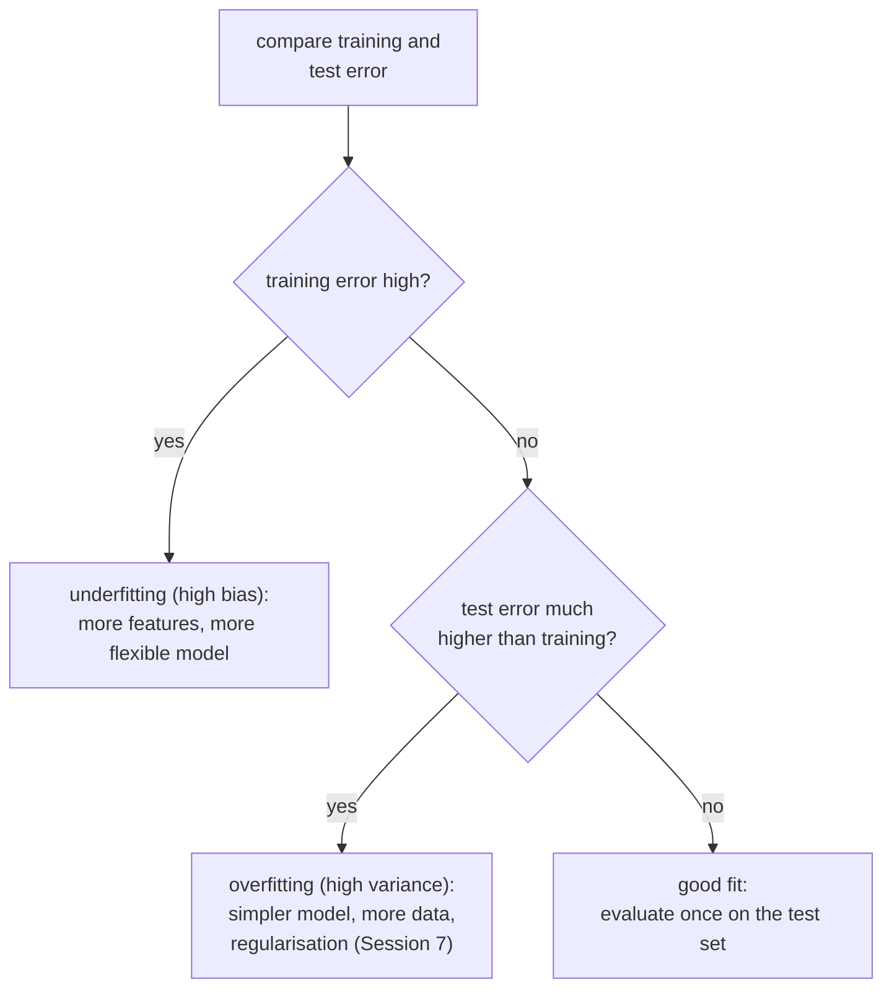
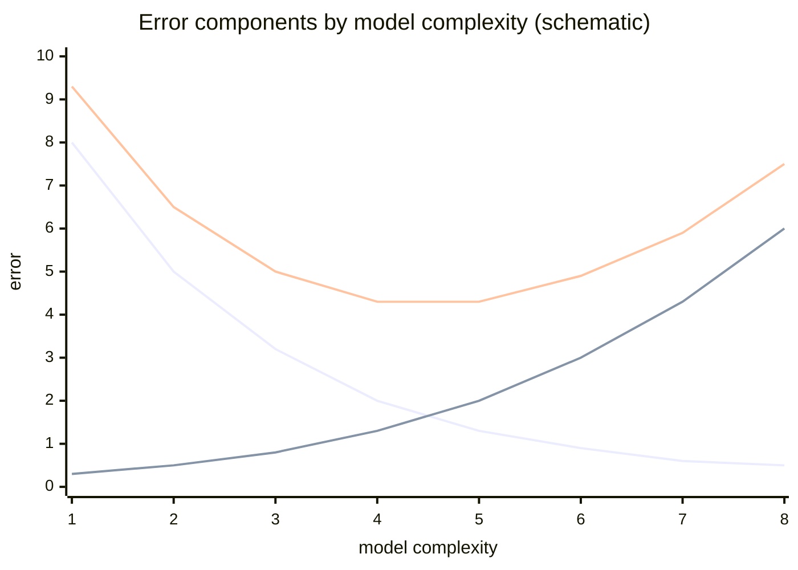

# Underfitting, overfitting and robust regression

A model can fail in two opposite ways: it can be too simple to capture the pattern (**underfitting**) or so flexible that it learns the noise of the training data (**overfitting**). This page shows both with polynomial regression, explains the **bias–variance trade-off** behind them, and shows how to read training and test error together. The second half covers **robust regression**: Huber regression and quantile regression, which limit the influence of outliers that pull least squares off course. Regularisation (ridge, lasso) as a remedy for overfitting follows in Session 7.



## Underfitting and overfitting: model complexity

### Concept

**Model complexity** is the flexibility of the family of rules a model can represent. For polynomial regression it is the **degree**: degree 1 is a straight line, degree 2 a parabola, degree 15 a curve with up to 14 bends. A polynomial of degree d in one feature x is a linear regression on the features x, x², …, x^d, created by `PolynomialFeatures`.

- **Underfitting**: the model is too rigid for the pattern. Training error and test error are both high and close to each other.
- **Overfitting**: the model follows the noise of the training sample. Training error is low, test error is much higher.
- In between lies the complexity with the lowest test error.


The degree-1 line misses the curve (underfit). Degree 4 follows it. Degree 15 bends towards individual points and shoots off at the right edge, where there are few data (overfit). The right panel shows the typical pattern: training error falls steadily with complexity; test error falls, reaches a minimum, and rises again.

### Why it matters

Every flexible model, from decision trees to neural networks, can overfit. The gap between training and test error is the first diagnostic in every later session. Choosing the complexity on the test set itself would make the test score optimistic, which is why Session 7 introduces cross-validation.

### How it works in Python

```python
import numpy as np
from sklearn.linear_model import LinearRegression
from sklearn.metrics import root_mean_squared_error
from sklearn.pipeline import make_pipeline
from sklearn.preprocessing import PolynomialFeatures

rng = np.random.default_rng(0)
x_train = np.sort(rng.uniform(0, 1, 20)).reshape(-1, 1)        # 20 noisy training points
y_train = np.cos(1.5 * np.pi * x_train.ravel()) + rng.normal(0, 0.15, 20)
x_test = rng.uniform(0, 1, 1000).reshape(-1, 1)                # new data from the same source
y_test = np.cos(1.5 * np.pi * x_test.ravel()) + rng.normal(0, 0.15, 1000)

for degree in [1, 2, 4, 8, 15]:
    model = make_pipeline(PolynomialFeatures(degree), LinearRegression()).fit(x_train, y_train)
    train_rmse = root_mean_squared_error(y_train, model.predict(x_train))
    test_rmse = root_mean_squared_error(y_test, model.predict(x_test))
    print(f"degree {degree:2d}  train {train_rmse:.3f}  test {test_rmse:.3f}")
# degree  1  train 0.449  test 0.459
# degree  2  train 0.220  test 0.257
# degree  4  train 0.084  test 0.169
# degree  8  train 0.069  test 0.329
# degree 15  train 0.061  test 0.650
```

On the case study, take the decisions that were invalidated before their normal three-year expiry and model how many days they stayed valid from the start date (in years since 2017). The relationship is not a straight line, because many decisions end on fixed dates (31 December 2020 and 31 December 2021 are the most frequent end dates; Session 4 and the notebook look at them). Compare all 5,700 training decisions with a training set of only 60:

```python
import numpy as np
import pandas as pd
from sklearn.linear_model import LinearRegression
from sklearn.metrics import root_mean_squared_error
from sklearn.model_selection import train_test_split
from sklearn.pipeline import make_pipeline
from sklearn.preprocessing import PolynomialFeatures, StandardScaler

decisions = pd.read_parquet("case-study/data/train_sample.parquet")
early = decisions[decisions["invalidation_reason"].notna()].copy()       # ended before normal expiry
early["days_valid"] = (early["end_date"] - early["start_date"]).dt.days
early = early[early["days_valid"] >= 0]                                  # drop impossible values here
early["start_year"] = (early["start_date"] - pd.Timestamp("2017-01-01")).dt.days / 365.25
train, test = train_test_split(early, test_size=0.2, random_state=42)
small = train.sample(60, random_state=0)

for degree in [1, 3, 8, 12]:
    for name, part in [("5,700", train), ("60", small)]:
        model = make_pipeline(StandardScaler(), PolynomialFeatures(degree), LinearRegression())
        model.fit(part[["start_year"]], part["days_valid"])
        print(f"degree {degree:2d}, {name:>5s} rows: train RMSE "
              f"{root_mean_squared_error(part['days_valid'], model.predict(part[['start_year']])):6.1f}"
              f"  test RMSE {root_mean_squared_error(test['days_valid'], model.predict(test[['start_year']])):6.1f}")
```

```
degree  1, 5,700 rows: train RMSE  322.3  test RMSE  327.5
degree  1,    60 rows: train RMSE  303.4  test RMSE  329.6
degree  3, 5,700 rows: train RMSE  318.5  test RMSE  321.6
degree  3,    60 rows: train RMSE  301.8  test RMSE  328.3
degree  8, 5,700 rows: train RMSE  314.6  test RMSE  317.1
degree  8,    60 rows: train RMSE  285.8  test RMSE  341.1
degree 12, 5,700 rows: train RMSE  313.8  test RMSE  317.9
degree 12,    60 rows: train RMSE  265.6  test RMSE  393.1
```

With 5,700 training decisions, more flexibility helps a little up to degree 8 (test RMSE from 328 to 317 days) and degree 12 does not overfit: training and test errors stay close. With 60 training decisions the same degree 12 lowers the training error to 266 days and raises the test error to 393 days, worse than the straight line. Overfitting is a problem of **flexibility relative to the amount of data**. Note also how little the start date explains: an RMSE of about 320 days against a standard deviation of about 330 days. When a decision ends early depends mostly on events outside the data of the decision.

### In practice

- Google Flu Trends (2008–2015) fitted search-term frequencies to past flu data and later overestimated flu prevalence substantially, a widely cited case of a model fitted to past patterns that did not generalise (Lazer et al., 2014).
- Clinical prediction models developed on small cohorts often perform worse at external validation in other hospitals; reporting guidelines such as TRIPOD require validation on separate data.
- Finance: trading strategies backtested over many variants look profitable on past data and fail on new data ("backtest overfitting", Bailey et al., 2014).

> [!IMPORTANT]
> **Practice (block 2, part 1).** In the case-study notebook, compare training and test error for increasing polynomial degree, first on the toy data, then on the early-invalidation data with all training rows and with a small training set. Where does the test error stop improving?

## The bias–variance trade-off

### Concept

The expected test error of a model at a point can be split into three parts:

expected squared error = **bias²** + **variance** + **irreducible noise**.

- **Bias** is the systematic error of the model family: how far the average prediction (over many possible training samples) is from the truth. A straight line fitted to a curve has high bias, however much data it gets.
- **Variance** is how much the prediction changes from one training sample to another. A degree-15 polynomial fitted to 20 points changes drastically when the points change.
- **Noise** is the variation in y that no model using these features can predict.

More complexity lowers bias and raises variance. The best complexity balances the two. More training data lowers variance, so a larger dataset can support a more complex model.



Worked example: suppose the true relationship is a curve and you fit straight lines to 100 different samples. All 100 lines miss the curve in the same way (bias) but are similar to each other (low variance). Fit degree-15 polynomials instead: on average they follow the curve (low bias) but each one wiggles differently (high variance).

### Why it matters

The trade-off explains why "use the most flexible model" is not a strategy, and why the remedies differ: underfitting needs more flexibility or better features; overfitting needs less flexibility, more data or regularisation (Session 7). Ensembles (Session 10) reduce variance by averaging many models.

### How it works in Python

Estimate bias and variance by refitting on many training samples:

```python
import numpy as np
from sklearn.linear_model import LinearRegression
from sklearn.pipeline import make_pipeline
from sklearn.preprocessing import PolynomialFeatures

rng = np.random.default_rng(1)
x_grid = np.linspace(0.05, 0.95, 50).reshape(-1, 1)
truth = np.cos(1.5 * np.pi * x_grid.ravel())

for degree in [1, 4, 12]:
    preds = []
    for _ in range(200):                                       # 200 different training samples
        x = rng.uniform(0, 1, 20).reshape(-1, 1)
        y = np.cos(1.5 * np.pi * x.ravel()) + rng.normal(0, 0.15, 20)
        model = make_pipeline(PolynomialFeatures(degree), LinearRegression()).fit(x, y)
        preds.append(model.predict(x_grid))
    preds = np.array(preds)
    bias2 = np.mean((preds.mean(axis=0) - truth) ** 2)
    variance = np.mean(preds.var(axis=0))
    print(f"degree {degree:2d}  bias^2 {bias2:.3f}  variance {variance:.3f}")
# degree  1  bias^2 0.145  variance 0.029
# degree  4  bias^2 0.000  variance 0.008
# degree 12  bias^2 0.013  variance 7.851
```

### In practice

- Netflix Prize (2006–2009): the winning solutions blended hundreds of models, reducing variance by averaging.
- Weather and climate services run **ensembles** of forecasts with perturbed starting conditions to quantify forecast variance.
- Credit-risk modelling in banks favours simple, stable scorecards partly because regulators require predictions that do not change erratically with new data.

> [!NOTE]
> The decomposition is exact for squared error. For other losses (classification error, log-loss) the idea carries over, but the formula differs.

## Robust regression: Huber

### Concept

Least squares squares the residuals, so a few gross errors (typing errors, unit mix-ups, placeholder dates) can pull the whole line towards them.


**Huber regression** uses a loss that is quadratic for small residuals and linear for large ones. Residuals smaller than a threshold ε (in units of a robust scale estimate; scikit-learn's default ε = 1.35) are treated as in least squares; larger residuals count only linearly, so a point 10 units away weighs 10 times, not 100 times, as much as a point 1 unit away. statsmodels' `RLM` fits the same loss by iteratively reweighted least squares and reports a **weight** per observation (1 = full weight, near 0 = treated as an outlier).

The **breakdown point** is the share of arbitrary outliers an estimator tolerates. It is 0 % for least squares: one point can move the line arbitrarily far.

### Why it matters

A robust fit shows what the bulk of the data says; comparing it with least squares reveals how much a few points drive the conclusion. This matters when outliers are errors or rare cases you do not want to model.

### How it works in Python

```python
import numpy as np
import statsmodels.api as sm
from sklearn.linear_model import HuberRegressor, LinearRegression

rng = np.random.default_rng(0)
x = rng.uniform(0, 10, 80)
y = 2 + 0.5 * x + rng.normal(0, 0.5, 80)       # true slope 0.5
bad = np.argsort(x)[-8:]                       # 8 points with the largest x ...
y[bad] -= rng.uniform(6, 9, 8)                 # ... get gross errors
X = x.reshape(-1, 1)

print(round(LinearRegression().fit(X, y).coef_[0], 2))   # 0.07: pulled flat by 8 points
print(round(HuberRegressor().fit(X, y).coef_[0], 2))     # 0.41: close to the bulk

rlm = sm.RLM(y, sm.add_constant(x), M=sm.robust.norms.HuberT()).fit()
print(rlm.params.round(2))                     # [2.37 0.4 ]
print(rlm.weights[bad].mean().round(2), np.median(rlm.weights).round(2))   # 0.12 1.0: outliers down-weighted
```

The second line of the output shows the price of robustness: 0.41 instead of 0.5. With ε = 1.35 the 8 outliers still have some influence. Workbooks [07](../workbooks/07-robust-fit-compared.ipynb)–[10](../workbooks/10-statsmodels-m-estimators.ipynb) compare Huber with RANSAC and Theil–Sen, which tolerate more outliers.

### In practice

- RANSAC, a related robust method, was introduced for computer vision (Fischler & Bolles, 1981) and is still used to estimate camera geometry from image matches that contain many false matches.
- The Theil–Sen slope (Sen's slope) is a standard trend estimator in hydrology and climate research, often combined with the Mann–Kendall trend test.
- Sensor and laboratory data, in which occasional faulty readings are expected, are routinely fitted with M-estimators such as Huber's.

> [!WARNING]
> **Outliers are information.** Down-weighting a point is a modelling decision. Inspect the points with low weights: are they errors, or the most important cases (fraud, failures, unusual products)? Report both fits if the conclusion depends on them.

## Robust regression: quantile regression

### Concept

Least squares models the **conditional mean** of y given x. **Quantile regression** models a **conditional quantile**: q = 0.5 gives the **median** line, q = 0.9 the line below which 90 % of observations lie. It minimises the sum of absolute residuals weighted by q above the line and by 1 − q below it (the **pinball loss**). The median line is therefore robust to outliers in y.

Fitting several quantiles shows whether x affects the whole distribution in the same way. Diverging slopes mean the spread of y changes with x (heteroscedasticity), which least squares summarises only as a violation of an assumption.

Worked example: for the values 1, 2, 3, 4, 100, the mean is 22 and the median 3. A constant "model" fitted by least squares predicts 22; one fitted by median regression predicts 3.

### Why it matters

Many decisions concern a typical case or a tail rather than the average: delivery-time promises, capacity planning, risk limits. Quantile regression answers "what happens at the 90th percentile?" directly and needs no assumption about the residual distribution.

### How it works in Python

The case study contains a real version of the gross errors in the figure. Among the decisions that ended early, 77 in the sample have an end date in the year 1900, about 120 years **before** the start date (a placeholder date; they all carry the same invalidation reason code, 55). Fit the number of days valid on the start date, once with these rows included:

```python
import numpy as np
import pandas as pd
import statsmodels.formula.api as smf
from sklearn.linear_model import HuberRegressor
from sklearn.metrics import mean_absolute_error, root_mean_squared_error
from sklearn.model_selection import train_test_split

decisions = pd.read_parquet("case-study/data/train_sample.parquet")
early = decisions[decisions["invalidation_reason"].notna()].copy()
early["days_valid"] = (early["end_date"] - early["start_date"]).dt.days      # includes the placeholders
early["start_year"] = (early["start_date"] - pd.Timestamp("2017-01-01")).dt.days / 365.25
print((early["days_valid"] < 0).sum(), early["days_valid"].min())          # 77 -45175
train, test = train_test_split(early, test_size=0.2, random_state=42)
clean_test = test[test["days_valid"] >= 0]                                 # judge on plausible rows

fits = {"OLS (mean)": smf.ols("days_valid ~ start_year", train).fit(),
        "median (q=0.5)": smf.quantreg("days_valid ~ start_year", train).fit(q=0.5),
        "q=0.9": smf.quantreg("days_valid ~ start_year", train).fit(q=0.9),
        "OLS, clean rows": smf.ols("days_valid ~ start_year", train[train["days_valid"] >= 0]).fit()}
for name, fit in fits.items():
    pred = fit.predict(clean_test)
    print(f"{name:15s} intercept {fit.params['Intercept']:7.1f}  slope {fit.params['start_year']:6.1f}  "
          f"MAE {mean_absolute_error(clean_test['days_valid'], pred):5.0f}  "
          f"RMSE {root_mean_squared_error(clean_test['days_valid'], pred):5.0f}")
huber = HuberRegressor(max_iter=1000).fit(train[["start_year"]], train["days_valid"])
print("Huber           intercept", round(huber.intercept_, 1), " slope", round(huber.coef_[0], 1))
```

```
77 -45175
OLS (mean)      intercept   241.4  slope  -74.0  MAE   533  RMSE   621
median (q=0.5)  intercept   677.6  slope  -45.2  MAE   281  RMSE   328
q=0.9           intercept  1027.0  slope  -14.8  MAE   455  RMSE   552
OLS, clean rows intercept   617.5  slope  -26.0  MAE   283  RMSE   327
Huber           intercept 646.3  slope -37.0
```
The 77 placeholder rows (about 1 % of the training rows) pull the least-squares intercept from 618 to 241 days and nearly triple the slope; its errors on the plausible test rows almost double. The median line (678 days, slope −45) and the Huber line (646 days, slope −37) stay close to the fit on clean rows: both are robust to gross errors in y. The 90th-percentile line answers another question: the longest-lasting early-invalidated decisions run about 1,000 days, almost the full term, and that upper quantile depends little on the start date. Removing the placeholder rows is the right fix here, because they are errors (Session 4); the robust fits show what happens when you have not found them yet.

### In practice

- Paediatric growth charts report percentiles of height and weight by age; quantile regression is one method used to construct such reference curves (Wei et al., 2006).
- Financial risk: Value at Risk is a quantile of the loss distribution; CAViaR models (Engle & Manganelli, 2004) estimate it with quantile regression.
- Engel's law: quantile regression on Engel's 1857 household data, a standard example since Koenker and Bassett (1982), shows that food expenditure rises with income at every quantile, but more steeply at the upper quantiles ([workbook 12](../workbooks/12-quantile-regression-statsmodels.ipynb)).

> [!IMPORTANT]
> **Practice (block 2, part 2).** Compare least squares with Huber and quantile regression on the days valid of early-invalidated decisions, with and without the 77 placeholder rows. Which model would you use to tell a trader how long a typical decision lasts before early invalidation, and which to describe the decisions that last longest?

> [!CAUTION]
> Quantile lines fitted separately can cross (the 0.9 line below the 0.5 line for some x), especially at the edges of the data. Check a plot before reporting them.

## Check your understanding

1. A model has training RMSE 0.06 and test RMSE 0.65. Underfitting or overfitting? Name two remedies.
2. Why does the degree-12 polynomial hardly overfit on the 5,700 training decisions, although it overfits badly on 60?
3. Explain bias and variance with the example of a straight line and a degree-15 polynomial fitted to a curve.
4. What does the Huber loss do with a residual of 10 compared with least squares?
5. Why does the least-squares line of days valid move so much when 77 placeholder rows are added, while the median line hardly moves? What question does each line answer?

## Further reading

- James, G., et al. (2023). *An Introduction to Statistical Learning with Applications in Python*, section 2.2 "Assessing model accuracy" (bias–variance trade-off). Springer. <https://www.statlearning.com/>
- scikit-learn developers (2026). *Underfitting vs. overfitting* (example). <https://scikit-learn.org/stable/auto_examples/model_selection/plot_underfitting_overfitting.html>
- Koenker, R., & Hallock, K. F. (2001). Quantile regression. *Journal of Economic Perspectives*, 15(4), 143–156. <https://doi.org/10.1257/jep.15.4.143>
- Huber, P. J., & Ronchetti, E. M. (2009). *Robust Statistics* (2nd ed.). Wiley.
