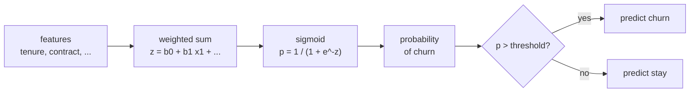
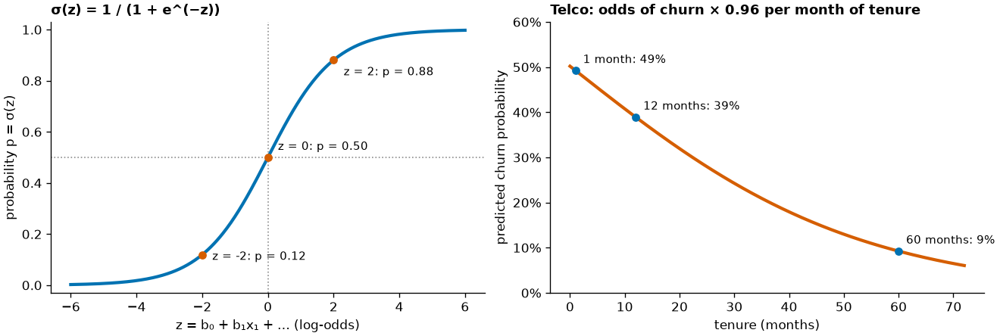

# Logistic regression

Many targets are not numbers but yes/no outcomes: does a customer cancel, does a customs decision concern electrical equipment (chapter 85), is a transaction fraudulent? **Logistic regression** is the standard first model for such **binary** targets. It keeps the weighted sum of linear regression but passes it through the **sigmoid** function, so that the output is a probability between 0 and 1. This page explains the sigmoid, the log-odds scale on which the coefficients live and how to interpret them as odds ratios, how to fit the model with statsmodels and scikit-learn, and a first look at turning probabilities into predicted classes. The example is the IBM Telco customer-churn dataset (7,043 customers, 26.5 % churn). Evaluation of classifiers in depth (precision, recall, ROC) follows in Session 8.



## From a linear model to probabilities: the sigmoid

### Concept

A linear regression on a 0/1 target (the **linear probability model**) can predict values below 0 or above 1, which are not probabilities. Logistic regression computes the same weighted sum

z = b₀ + b₁x₁ + … + bₚxₚ

and maps it to a probability with the **sigmoid** (logistic) function

p = σ(z) = 1 / (1 + e^(−z)).

σ(0) = 0.5; large positive z gives values close to 1, large negative z values close to 0. The curve is steepest at z = 0: a change in z matters most when the outcome is uncertain.



Worked example: with b₀ = 0.008 and b₁ = −0.038 per month of tenure, a customer with 12 months has z = 0.008 − 0.038 × 12 = −0.45 and p = 1 / (1 + e^0.45) ≈ 0.39.

### Why it matters

Probabilities are more useful than labels. A retention team with budget for 500 calls ranks customers by churn probability; a bank sets interest rates by default probability. Logistic regression gives these probabilities with coefficients that can be read and explained.

### How it works in Python

```python
import numpy as np

def sigmoid(z):
    return 1 / (1 + np.exp(-z))

print(sigmoid(np.array([-4, -2, 0, 2, 4])).round(3))   # [0.018 0.119 0.5   0.881 0.982]
b0, b1 = 0.008, -0.0382                                # from the Telco fit below
print(sigmoid(b0 + b1 * np.array([1, 12, 60])).round(2))   # [0.49 0.39 0.09]
```

### In practice

- Credit scoring: traditional scorecards are logistic regression models whose coefficients are converted into points.
- Epidemiology: logistic regression is the standard model for case–control studies of risk factors.
- Online advertising: logistic regression has long been used to predict the probability that an ad is clicked (McMahan et al., 2013, describe Google's large-scale system).

> [!NOTE]
> Despite its name, logistic **regression** is a classification model: it models the probability of a class. The name comes from the regression on the log-odds scale.

## Log-odds and the interpretation of coefficients

### Concept

The **odds** compare the probability of the event with the probability of no event: odds = p / (1 − p). A probability of 0.8 means odds of 0.8 / 0.2 = 4 ("4 to 1"); p = 0.5 means odds of 1.

The **log-odds** (logit) is log(p / (1 − p)). Solving the sigmoid for z shows that z **is** the log-odds:

log(p / (1 − p)) = b₀ + b₁x₁ + … + bₚxₚ.

So logistic regression is a linear model for the log-odds. Interpretation of a coefficient bⱼ:

- bⱼ is the change in **log-odds** per one-unit increase of xⱼ, holding the other features fixed;
- e^bⱼ is the **odds ratio**: the factor by which the odds are multiplied per unit increase;
- the effect on the **probability** is not constant: it depends on where on the sigmoid you are.

Worked example: in a model with tenure as the only feature, b = −0.038, so e^−0.038 = 0.963. Each extra month multiplies the odds of churn by 0.963, a 3.7 % reduction. Twelve extra months multiply them by 0.963¹² ≈ 0.63. For a two-year contract, b = −1.61 and e^−1.61 = 0.20: compared with a month-to-month contract, at equal tenure and charges, the odds of churn are one fifth.

### Why it matters

Odds ratios are the language in which medical, social and business research reports binary outcomes. Reading them correctly prevents the most common mistakes: treating a log-odds coefficient as a change in probability, or an odds ratio of 2 as "twice as likely" when the event is common.

### How it works in Python

```python
import numpy as np

p = np.array([0.1, 0.5, 0.8, 0.9])
odds = p / (1 - p)
print(odds.round(2))               # [0.11 1.   4.   9.  ]
print(np.log(odds).round(2))       # [-2.2   0.    1.39  2.2 ]: log-odds, symmetric around 0

# one coefficient, three readings
b_tenure = -0.0382
print(round(np.exp(b_tenure), 3))          # 0.963: odds ratio per month
print(round(np.exp(12 * b_tenure), 2))     # 0.63: odds ratio per year
```

### In practice

- The Framingham Heart Study reported risk factors for heart disease (age, cholesterol, blood pressure, smoking) with logistic models, and its risk scores are still used.
- Case–control studies of smoking and lung cancer report odds ratios, which approximate relative risks when the disease is rare.
- Churn analyses in telecommunications report which contract types and services raise or lower the odds of cancellation.

> [!CAUTION]
> **Odds ratio is not risk ratio.** With a baseline churn probability of 40 %, an odds ratio of 2 raises it to 57 %, not to 80 %. Translate odds ratios into probabilities for a few typical customers before you report them.

## Fitting with statsmodels and scikit-learn

### Concept

The coefficients are chosen by **maximum likelihood**: the values under which the observed outcomes are most probable. Equivalently, they minimise the **log-loss** (cross-entropy), −mean[y·log p + (1 − y)·log(1 − p)]. There is no closed formula as in least squares; the software finds the minimum iteratively.

- **statsmodels** (`smf.logit`) is the statistical view: coefficients with standard errors, confidence intervals and p-values; formula syntax with `C()` for categorical features.
- **scikit-learn** (`LogisticRegression`) is the prediction view: pipelines, `predict_proba`, `predict`. It adds an L2 **penalty** by default (`C=1.0`), which shrinks coefficients slightly; `C=np.inf` switches it off. Penalties are the subject of Session 7.

Categorical features need **one-hot encoding** (one 0/1 column per category). Dropping one category as the reference (`drop="first"`) makes the coefficients comparable to statsmodels.

### Why it matters

The two libraries answer different questions about the same model: "which effects are reliable?" (statsmodels) and "how well does it predict new customers?" (scikit-learn). Knowing both lets you report a model and deploy it.

### How it works in Python

```python
# requires network access to download the Telco data (about 1 MB)
import numpy as np
import pandas as pd
import statsmodels.formula.api as smf
from sklearn.model_selection import train_test_split

url = ("https://raw.githubusercontent.com/IBM/telco-customer-churn-on-icp4d/"
       "master/data/Telco-Customer-Churn.csv")
telco = pd.read_csv(url)
telco["churn"] = (telco["Churn"] == "Yes").astype(int)
print(telco.shape, round(telco["churn"].mean(), 3))      # (7043, 22) 0.265
train, test = train_test_split(telco, test_size=0.25, stratify=telco["churn"], random_state=0)

fit = smf.logit("churn ~ tenure + MonthlyCharges + SeniorCitizen + C(Contract) + C(InternetService)",
                data=train).fit(disp=0)
table = pd.DataFrame({"coef": fit.params, "odds_ratio": np.exp(fit.params),
                      "p": fit.pvalues}).round(3)
print(table)
#                                     coef  odds_ratio      p
# Intercept                         -0.478       0.620  0.008
# C(Contract)[T.One year]           -0.888       0.412  0.000
# C(Contract)[T.Two year]           -1.611       0.200  0.000
# C(InternetService)[T.Fiber optic]  1.054       2.870  0.000
# C(InternetService)[T.No]          -0.923       0.397  0.000
# tenure                            -0.032       0.968  0.000
# MonthlyCharges                     0.003       1.003  0.459
# SeniorCitizen                      0.418       1.519  0.000
```

Reading: at equal tenure, charges and internet service, a two-year contract multiplies the odds of churn by 0.20 compared with month-to-month; fibre-optic internet multiplies them by 2.9 compared with DSL. Monthly charges add nothing once internet service is in the model (p = 0.46): the two features overlap.

The same model in scikit-learn, as a pipeline:

```python
# requires network access to download the Telco data
import numpy as np
import pandas as pd
from sklearn.compose import ColumnTransformer
from sklearn.linear_model import LogisticRegression
from sklearn.model_selection import train_test_split
from sklearn.pipeline import make_pipeline
from sklearn.preprocessing import OneHotEncoder

url = ("https://raw.githubusercontent.com/IBM/telco-customer-churn-on-icp4d/"
       "master/data/Telco-Customer-Churn.csv")
telco = pd.read_csv(url)
y = (telco["Churn"] == "Yes").astype(int)
train, test, y_train, y_test = train_test_split(telco, y, test_size=0.25, stratify=y, random_state=0)

numeric = ["tenure", "MonthlyCharges", "SeniorCitizen"]
categorical = ["Contract", "InternetService"]
pre = ColumnTransformer([("num", "passthrough", numeric),
                         ("cat", OneHotEncoder(drop="first"), categorical)])
model = make_pipeline(pre, LogisticRegression(C=np.inf, max_iter=5000))   # no penalty
model.fit(train, y_train)

coef = pd.Series(model[-1].coef_[0], index=model[0].get_feature_names_out())
print(coef.round(3).to_dict())
# {'num__tenure': -0.032, 'num__MonthlyCharges': 0.003, 'num__SeniorCitizen': 0.418,
#  'cat__Contract_One year': -0.89, 'cat__Contract_Two year': -1.611,
#  'cat__InternetService_Fiber optic': 1.053, 'cat__InternetService_No': -0.923}
print(model.predict_proba(test.head(3))[:, 1].round(2))   # [0.34 0.1  0.01]: churn probabilities
```

Without a penalty the coefficients match statsmodels up to the precision of the numerical optimiser.

### In practice

- Banks document credit-scoring models with coefficient tables and statistical tests (statsmodels view) and deploy them as scoring pipelines (scikit-learn view).
- Public-health agencies publish adjusted odds ratios with 95 % confidence intervals from logistic models of survey data.
- Many machine-learning teams use logistic regression as the first baseline for any binary prediction task before trying tree ensembles (Session 10).

> [!WARNING]
> **Scale and penalty.** With scikit-learn's default penalty, coefficients depend on the scale of the features: a feature measured in cents is penalised differently from the same feature in euros. Standardise numeric features or switch the penalty off when you want to interpret coefficients.

## A first look at predicted classes

### Concept

A **predicted class** is obtained by comparing the probability with a **threshold**, by default 0.5: churn if p > 0.5. **Accuracy** is the share of correct predictions. It must be compared with the **majority baseline**: always predicting the most common class. In the Telco data, "nobody churns" is right for 73.5 % of customers.

A **confusion matrix** counts the four combinations of true and predicted class: true negatives, false positives, false negatives and true positives. Lowering the threshold catches more churners (fewer false negatives) at the cost of more false alarms (more false positives).

### Why it matters

Accuracy alone hides which errors the model makes. For a retention campaign, missing a churner (false negative) costs a customer; a false alarm costs a phone call. The right threshold depends on these costs (Session 8).

### How it works in Python

```python
# requires network access to download the Telco data
import pandas as pd
import statsmodels.formula.api as smf
from sklearn.metrics import confusion_matrix
from sklearn.model_selection import train_test_split

url = ("https://raw.githubusercontent.com/IBM/telco-customer-churn-on-icp4d/"
       "master/data/Telco-Customer-Churn.csv")
telco = pd.read_csv(url)
telco["churn"] = (telco["Churn"] == "Yes").astype(int)
train, test = train_test_split(telco, test_size=0.25, stratify=telco["churn"], random_state=0)
fit = smf.logit("churn ~ tenure + MonthlyCharges + SeniorCitizen + C(Contract) + C(InternetService)",
                data=train).fit(disp=0)
p = fit.predict(test)

print(round(1 - test["churn"].mean(), 3))                       # 0.735: majority baseline
for threshold in [0.5, 0.3]:
    pred = (p > threshold).astype(int)
    tn, fp, fn, tp = confusion_matrix(test["churn"], pred).ravel()
    counts = {"TN": int(tn), "FP": int(fp), "FN": int(fn), "TP": int(tp)}
    print(threshold, round((pred == test["churn"]).mean(), 3), counts)
# 0.5 0.782 {'TN': 1146, 'FP': 148, 'FN': 236, 'TP': 231}
# 0.3 0.739 {'TN': 945, 'FP': 349, 'FN': 111, 'TP': 356}
```

At threshold 0.5 the model is right for 78 % of customers, 4.7 points above the baseline, and finds 231 of 467 churners. At 0.3 it finds 356 churners but raises 349 false alarms; accuracy falls, yet for a retention campaign this may be the better choice.

### In practice

- Hospital early-warning scores trigger a review when a predicted risk exceeds a threshold chosen to balance missed cases against alarm fatigue.
- Fraud detection systems at card issuers set thresholds so that the number of flagged transactions matches the capacity of the review team.
- Spam filters choose a high threshold because a legitimate e-mail in the spam folder (false positive) is worse than a spam e-mail in the inbox.

> [!IMPORTANT]
> **Practice (block 3).** Predict churn probability for the IBM Telco customers with logistic regression in statsmodels and scikit-learn. Interpret three coefficients as odds ratios, translate one into probabilities for two typical customers, and compare accuracy at thresholds 0.5 and 0.3 with the majority baseline. Notebook: [17-case-study-airbnb-price-and-churn.ipynb](../workbooks/17-case-study-airbnb-price-and-churn.ipynb).

> [!CAUTION]
> **Accuracy on imbalanced data.** When only 1 % of cases are positive, "always negative" has 99 % accuracy and is useless. Session 8 introduces precision, recall, F1 and ROC curves; Session 9 treats class imbalance.

## Check your understanding

1. Compute σ(z) for z = 1 and the odds and log-odds for p = 0.25.
2. A coefficient of 0.7 for "fibre optic" means what for the odds of churn? Give the odds ratio.
3. Why does the effect of a feature on the probability depend on the other features, although the model is linear in the log-odds?
4. What does `C=np.inf` change in scikit-learn's `LogisticRegression`, and why does it make the coefficients equal to statsmodels'?
5. The model has 78 % accuracy. Why is this number not enough to judge it?

## Further reading

- James, G., et al. (2023). *An Introduction to Statistical Learning with Applications in Python*, chapter 4 "Classification" and lab 4.7. Springer. <https://www.statlearning.com/>
- INRIA (2024). *scikit-learn MOOC*: "Linear model for classification". <https://inria.github.io/scikit-learn-mooc/python_scripts/logistic_regression.html>
- Gelman, A., Hill, J., & Vehtari, A. (2020). *Regression and Other Stories*, chapters 13–14 (logistic regression). Cambridge University Press. <https://avehtari.github.io/ROS-Examples/>
- statsmodels developers (2026). *Discrete choice models: Logit*. <https://www.statsmodels.org/stable/discretemod.html>
