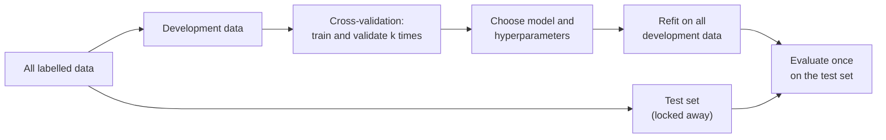
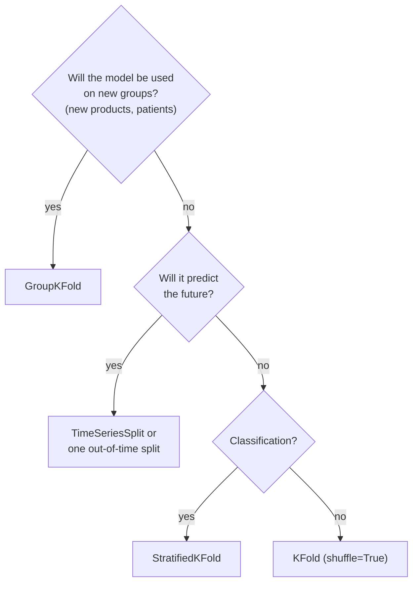

# Data splits, cross-validation and the bootstrap

This page covers the first block of Session 7. In Session 6 you split the data once into a training and a test set and reported one test score. That score answers the question "how well will the model do on new data?" only roughly: another split gives another number. Here we build the tools that make the answer reliable: a clear role for each part of the data, cross-validation that uses every row for validation once, splitters that respect groups and time, and a bootstrap interval that says how uncertain a score is.

The code blocks on this page build on each other: run them in order from the repository root. The Telco churn data (7,043 customers) are downloaded from IBM's GitHub repository; the EBTI decisions come from `case-study/data/` (see [case-study/README.md](../../../case-study/README.md)).



## Training, validation and test data and their roles

**Concept.** Labelled data are used for three different jobs, and each job needs its own rows.

- The **training set** is used to fit the model: the algorithm sees these rows and their labels and chooses the parameters (for example the coefficients of a regression).
- The **validation set** is used to make choices: which model, which features, which settings. We compare candidates by their validation score.
- The **test set** is used once, at the end, to estimate how well the chosen model will perform on new data. It must not influence any choice.

A worked example. A bank has 10,000 past loan applications with known outcomes. It keeps 2,000 applications aside as the test set. Of the remaining 8,000 it uses 6,000 to fit three candidate models and 2,000 to compare them. Model B wins on the validation rows. Only now does the bank score model B on the 2,000 test applications: 81 % accuracy. This number is an honest estimate because no decision depended on the test rows. The validation score of model B (say 83 %) is slightly optimistic: B was chosen *because* it did well on those rows.

**Why it matters.** Each time a score is used to make a decision, the rows behind it stop being "new data". If you choose a model by its test score, the test score is no longer an unbiased estimate; with enough candidates one of them will look good by chance. Keeping the three roles apart is the basic discipline of all model evaluation. In this course the leaderboard (Session 8 onwards) plays the role of the test set: its labels are hidden, so nobody can tune on them.

**How it works in Python.** Two calls of `train_test_split` give a 60/20/20 split. `stratify=y` keeps the share of churners equal in all three parts.

```python
import numpy as np
import pandas as pd
from sklearn.compose import make_column_transformer
from sklearn.linear_model import LogisticRegression
from sklearn.model_selection import train_test_split
from sklearn.pipeline import make_pipeline
from sklearn.preprocessing import OneHotEncoder, StandardScaler

URL = "https://raw.githubusercontent.com/IBM/telco-customer-churn-on-icp4d/master/data/Telco-Customer-Churn.csv"
df = pd.read_csv(URL)
df["TotalCharges"] = pd.to_numeric(df["TotalCharges"], errors="coerce").fillna(0)
y = (df["Churn"] == "Yes").astype(int)               # 1 = customer left
X = df.drop(columns=["customerID", "Churn"])

# 20 % test set, then 25 % of the remaining 80 % as validation set
X_dev, X_test, y_dev, y_test = train_test_split(X, y, test_size=0.2, stratify=y, random_state=0)
X_tr, X_val, y_tr, y_val = train_test_split(X_dev, y_dev, test_size=0.25, stratify=y_dev, random_state=0)
print(len(X_tr), len(X_val), len(X_test))           # 4225 1409 1409

num = ["tenure", "MonthlyCharges", "TotalCharges", "SeniorCitizen"]
cat = [c for c in X.columns if c not in num]
prep = make_column_transformer((StandardScaler(), num), (OneHotEncoder(handle_unknown="ignore"), cat))

# choose the regularisation strength C on the validation set (more on C in theory page 02)
for C in [0.001, 0.01, 1.0]:
    m = make_pipeline(prep, LogisticRegression(C=C, max_iter=1000)).fit(X_tr, y_tr)
    print(C, round(m.score(X_tr, y_tr), 3), round(m.score(X_val, y_val), 3))
# 0.001 0.773 0.767
# 0.01  0.806 0.796
# 1.0   0.807 0.803   <- best validation accuracy

# refit the chosen setting on training + validation data, evaluate ONCE on the test set
final = make_pipeline(prep, LogisticRegression(C=1.0, max_iter=1000)).fit(X_dev, y_dev)
print(round(final.score(X_test, y_test), 3))        # 0.801
```

**In practice.**
- The Netflix Prize (2006–2009) kept a "quiz" set for the public leaderboard and a separate hidden "test" set that decided the winner, so that teams could not win by tuning to the leaderboard.
- The TRIPOD reporting guideline for clinical prediction models (Collins et al., 2015) asks authors to state how data were split for development and validation, and treats a separate external test as stronger evidence than internal validation.
- Kaggle competitions show a public leaderboard during the competition and rank by a private part of the test set at the end. Rankings often move between the two ("shake-up"), which shows how much teams had adapted to the public part.

> [!WARNING]
> Looking at the test score "just to see" and then changing the model turns the test set into a validation set. Decide on the model first, then look at the test score once and report it, even if it is disappointing.

> [!TIP]
> Fix `random_state` in every split and every model that uses randomness. Then a colleague who runs your notebook gets the same numbers.

## Why a single split is unreliable

**Concept.** A test score is computed on a finite, randomly chosen set of rows. Another random split puts other customers into the test set and gives another score. The score is therefore a **random variable**: it has a mean (the quantity we want, the expected performance on new data) and a spread (noise caused by the particular split). The spread shrinks with the size of the test set: for accuracy, the standard error is roughly √(p(1 − p)/n). With p = 0.8 and n = 1,761 test customers this is √(0.16/1761) ≈ 0.0095, about one percentage point. With n = 200 it is almost three points.

**Why it matters.** Model comparisons, hyperparameter choices and project reports all rest on such estimates. If the score moves by two points when only the seed changes, an "improvement" of one point is not evidence. A single split also wastes data: the rows in the test set never help to train, and the rows in the training set never help to evaluate.

**How it works in Python.** The same model, evaluated on 20 random 75/25 splits:

```python
model = make_pipeline(prep, LogisticRegression(max_iter=1000))

acc = []
for seed in range(20):
    a_tr, a_te, b_tr, b_te = train_test_split(X, y, test_size=0.25, random_state=seed)
    acc.append(model.fit(a_tr, b_tr).score(a_te, b_te))
print(np.round([min(acc), np.mean(acc), max(acc)], 3))   # [0.785 0.802 0.822]
print(round(np.std(acc), 3))                             # 0.009
```

The range from 0.785 to 0.822 comes only from chance. The observed standard deviation (0.009) agrees with the formula above.

**In practice.**
- Kaggle "shake-ups": in competitions with small test sets, teams that ranked high on the public leaderboard regularly drop many places on the private leaderboard, because the public part was too small to separate models.
- The ImageNet replication study by Recht et al. (2019) built new test sets for CIFAR-10 and ImageNet and found accuracy drops of 3–15 percentage points on the new samples. The authors attribute the drops mainly to small differences in how the new images were collected, not to adaptive overfitting: a test score is tied to the particular test sample.

> [!CAUTION]
> Never report a difference between two models that is smaller than the spread of the score across splits as an improvement. Report the spread (or an interval) along with the score.

## k-fold and stratified cross-validation

**Concept.** **k-fold cross-validation** divides the rows into *k* parts (**folds**) of roughly equal size. The model is trained *k* times, each time on *k* − 1 folds, and scored on the remaining fold. Every row is used for validation exactly once. The *k* scores are summarised by their mean (the estimate) and their standard deviation (how stable it is). Common choices are *k* = 5 or *k* = 10; **leave-one-out** (*k* = *n*) is the extreme case.


A small example by hand: 10 rows, *k* = 5. Fold 1 = rows 1–2, fold 2 = rows 3–4, and so on. In split 1 the model trains on rows 3–10 and is scored on rows 1–2; in split 2 it trains on rows 1–2 and 5–10 and is scored on rows 3–4. After five splits each row has been predicted once by a model that did not see it.

**Stratified k-fold** chooses the folds so that each has the same class proportions as the full data. With 26.5 % churners, plain k-fold can produce folds with 24.6 % and 28.9 % churn; stratified folds all have 26.5 %. This matters most for rare classes and small data.

**Why it matters.** Cross-validation uses all data for both training and validation, so the estimate has lower variance than one split, and the fold-to-fold spread shows how much to trust it. Comparing training and validation scores in the same run shows over- or underfitting (theory page 02).

**How it works in Python.** `cross_val_score` returns one score per fold; `cross_validate` returns several metrics, fit times and, optionally, training scores. For classifiers, `cv=5` already means stratified 5-fold; pass a splitter object to control shuffling and the seed.

```python
from sklearn.model_selection import KFold, StratifiedKFold, cross_val_score, cross_validate

kf = KFold(n_splits=5, shuffle=True, random_state=0)
scores = cross_val_score(model, X, y, cv=kf, scoring="accuracy")
print(scores.round(3))                                    # [0.797 0.813 0.797 0.796 0.808]
print(round(scores.mean(), 3), round(scores.std(), 3))    # 0.802 0.007

# share of churners in each validation fold
skf = StratifiedKFold(n_splits=5, shuffle=True, random_state=0)
print(np.round([y.iloc[va].mean() for _, va in kf.split(X, y)], 3))    # [0.261 0.269 0.289 0.262 0.246]
print(np.round([y.iloc[va].mean() for _, va in skf.split(X, y)], 3))   # [0.265 0.265 0.265 0.265 0.266]

# several metrics at once, with training scores
res = cross_validate(model, X, y, cv=skf, scoring=["accuracy", "roc_auc", "f1"], return_train_score=True)
for m in ["accuracy", "roc_auc", "f1"]:
    print(m, round(res[f"train_{m}"].mean(), 3), round(res[f"test_{m}"].mean(), 3))
# accuracy 0.807 0.803
# roc_auc  0.849 0.845
# f1       0.603 0.596   (training and validation close: no sign of overfitting)
```

> [!NOTE]
> In scikit-learn the validation scores of `cross_validate` are called `test_...`. They are validation scores in the sense of this page: they come from the development data, not from a locked test set.

**In practice.**
- scikit-learn uses 5-fold cross-validation (stratified for classifiers) as the default in `cross_val_score`, `GridSearchCV` and related tools.
- In genomics and medical imaging, where studies often have only a few hundred patients, k-fold cross-validation is the usual way to report performance; ISLP (James et al., 2023, Ch. 5) recommends *k* = 5 or 10 as a good bias–variance compromise.
- Credit scoring and churn teams typically compare candidate models by cross-validated ROC AUC before a final out-of-time test.

> [!WARNING]
> The *k* models of cross-validation are thrown away. Cross-validation estimates the performance of a *procedure* (this model type with these settings). To use the model, refit it on all development data.

> [!CAUTION]
> Use `shuffle=True` in `KFold` when the rows are sorted (for example by date or by class). Without shuffling, the first fold contains only the oldest rows or only one class. If rows are sorted *because time matters*, do not shuffle: use a time-series split (next section).

## Grouped and time-series splits

**Concept.** k-fold assumes that rows are independent and that the future looks like a random sample of the past. Two common situations break this.

1. **Groups.** Several rows can belong to the same unit: several visits of the same patient, several transactions of the same customer, or, in the case study, renewed decisions that repeat the same description of goods word for word (4.6 % of the training descriptions repeat). If a group appears in both training and validation folds, the model can recognise the group instead of learning a general pattern. **`GroupKFold`** (or `GroupShuffleSplit` for a single split) assigns whole groups to folds, so no group appears on both sides. It needs a `groups` array, here the normalised description text.
2. **Time.** If the model will predict the future, a random split lets it train on decisions issued *after* the ones it is validated on. This hides changes over time (new products such as face masks in 2020, fewer English decisions after Brexit, the HS 2022 revision of the nomenclature), which are called **drift**. **`TimeSeriesSplit`** needs rows sorted by time. Split *i* trains on the first part and validates on the block that follows; the training window grows with each split (right panel of the figure above). A single **out-of-time** split (train 2017–2021, validate 2022–2023) is the simplest version.



**Why it matters.** The splitter must reproduce the situation in which the model will be used. Ordinary k-fold measures performance on groups and periods already seen; the real use often involves new ones. The course leaderboard is split by time (training 2017–2023, test 2024–2026, with test descriptions that repeat a training description removed), so time-based validation is the closest imitation of it.

**How it works in Python.** A text classifier for the heading: TF-IDF features of the description and a linear model (Session 13 explains both; here the model is a black box). Three single splits of the 50,000-decision sample with the same validation size: random, grouped by description, and by time.

```python
from sklearn.feature_extraction.text import TfidfVectorizer
from sklearn.linear_model import SGDClassifier
from sklearn.metrics import accuracy_score, f1_score
from sklearn.model_selection import GroupKFold, GroupShuffleSplit, TimeSeriesSplit

dec = pd.read_parquet("case-study/data/train_sample.parquet").sort_values("start_date", ignore_index=True)
norm = dec["description"].str.lower().str.replace(r"\s+", " ", regex=True).str.strip()   # renewal groups
text_model = make_pipeline(TfidfVectorizer(min_df=2, sublinear_tf=True),
                           SGDClassifier(alpha=1e-5, random_state=0, n_jobs=-1))

is_new = (dec["start_date"].dt.year >= 2022).to_numpy()        # 26 % of the sample
idx = np.arange(len(dec))
splits = {"random": train_test_split(idx, test_size=is_new.mean(), random_state=0),
          "grouped": next(GroupShuffleSplit(1, test_size=is_new.mean(), random_state=0).split(idx, groups=norm)),
          "by time": (idx[~is_new], idx[is_new])}
for name, (tr, va) in splits.items():
    text_model.fit(dec["description"].iloc[tr], dec["heading"].iloc[tr])
    pred = text_model.predict(dec["description"].iloc[va])
    seen = norm.iloc[va].isin(set(norm.iloc[tr])).mean()         # validation texts also in training
    print(f"{name:8s} seen {seen:.3f}  accuracy {accuracy_score(dec['heading'].iloc[va], pred):.3f}  "
          f"macro-F1 {f1_score(dec['heading'].iloc[va], pred, average='macro'):.3f}")
# random   seen 0.018  accuracy 0.806  macro-F1 0.574
# grouped  seen 0.000  accuracy 0.806  macro-F1 0.567
# by time  seen 0.007  accuracy 0.768  macro-F1 0.511

# the splitters for cross-validation: whole groups per fold, or past -> future
print(len(list(GroupKFold(5).split(idx, groups=norm))), len(list(TimeSeriesSplit(5).split(idx))))   # 5 5
for tr, va in TimeSeriesSplit(5).split(idx):
    print(dec["start_date"].iloc[tr].max().date(), "->", dec["start_date"].iloc[va].max().date(), len(tr), len(va))
# 2017-12-22 -> 2019-02-18 8335 8333
# ...
# 2022-09-30 -> 2023-12-30 41667 8333
```

The honest finding has two parts. Grouping by description changes little in the sample, because a random sample of 50,000 contains few renewal pairs (1.8 % of the validation texts also occur in training). On the full training set the effect is larger: in a run with the same model, 6.2 % of the validation texts also occurred in training and accuracy fell from 0.904 (random) to 0.897 (grouped). The time split matters more: training on 2017–2021 and validating on 2022–2023 costs about 4 points of accuracy and 6 points of macro-F1 (0.855 accuracy on the full training set), because new products and wordings appear. The leaderboard is a time split, so the time-based estimate is the one to trust. The [case-study workbook](../workbooks/19-case-study-validation.ipynb) repeats the comparison with cross-validation.

**In practice.**
- Medical imaging: the CheXNet study (Rajpurkar et al., 2017) split the ChestX-ray14 images by patient so that no patient appeared in both training and test data; otherwise a model can recognise the patient rather than the disease.
- Credit risk models in banks are routinely validated out-of-time: trained on older loans and tested on more recent ones.
- Demand and energy-load forecasting use rolling-origin evaluation, the forecasting name for the same scheme (Session 12).

> [!WARNING]
> `TimeSeriesSplit` uses the row order. Sort by date first (`sort_values("date", ignore_index=True)`); otherwise the "past" and "future" are arbitrary.

> [!CAUTION]
> Grouping and time can both apply. For the leaderboard the test descriptions are both new (no exact repeat of a training description) and later in time, so the closest imitation is a time split from which renewed descriptions are removed. Decide which situation matters for your project and say so in the validation plan.

## Bootstrap confidence interval of a metric

**Concept.** The **bootstrap** (Efron, 1979; recap in Session 5) estimates the uncertainty of a statistic from one sample: draw *n* rows **with replacement** from the *n* rows, recompute the statistic, and repeat about 1,000 times. The spread of the recomputed values approximates the sampling variability. For a model, the predictions stay fixed and only the test rows are resampled. The 2.5 % and 97.5 % percentiles of the bootstrap values form a 95 % **percentile confidence interval** for the test metric.

A tiny example by hand. Five test decisions with correct (1) and wrong (0) predictions: [1, 1, 0, 1, 1], accuracy 0.8. One bootstrap sample draws positions 2, 2, 3, 5, 1 → [1, 1, 0, 1, 1] → 0.8; another draws 3, 3, 4, 1, 3 → [0, 0, 1, 1, 0] → 0.4. Repeating this many times gives a distribution of accuracies; with only five rows it is very wide, which is the honest answer.

**Why it matters.** A score without an interval cannot tell whether a difference between two models, or between a validation score and the leaderboard, is larger than chance. The bootstrap works for any metric, including macro-F1 and ROC AUC, for which no simple formula exists.

**How it works in Python.** Train on the decisions of 2017–2021, validate on 2022–2023 (13,199 decisions of the sample), and bootstrap accuracy and macro-F1:

```python
tr, va = splits["by time"]
text_model.fit(dec["description"].iloc[tr], dec["heading"].iloc[tr])
y_true, y_pred = dec["heading"].iloc[va].to_numpy(), text_model.predict(dec["description"].iloc[va])
print(round(accuracy_score(y_true, y_pred), 3), round(f1_score(y_true, y_pred, average="macro"), 3))   # 0.768 0.511

rng = np.random.default_rng(0)
boot_acc, boot_f1 = [], []
for _ in range(300):                                        # resample validation decisions with replacement
    i = rng.integers(0, len(y_true), len(y_true))
    boot_acc.append(accuracy_score(y_true[i], y_pred[i]))
    boot_f1.append(f1_score(y_true[i], y_pred[i], average="macro"))
print(np.percentile(boot_acc, [2.5, 97.5]).round(3))        # [0.76  0.775]
print(np.percentile(boot_f1, [2.5, 97.5]).round(3))         # [0.5   0.534]
```

With 13,199 validation decisions the accuracy interval is about ±0.007. The macro-F1 interval is more than twice as wide: it averages over hundreds of headings, many with only a handful of validation decisions, so a few decisions more or less of a rare heading move it. A model that scores 0.515 instead of 0.511 macro-F1 on this set is not demonstrably better.

> [!NOTE]
> Two related summaries are easy to confuse. The **standard deviation across CV folds** describes how much the score varies between training sets and validation folds. The **bootstrap interval on a test set** describes the uncertainty from the finite test sample for one fitted model. Both are useful; say which one you report.

**In practice.**
- Diagnostic accuracy studies in medicine report sensitivity, specificity and AUC with 95 % confidence intervals; bootstrap intervals are common for AUC.
- Machine translation research uses paired bootstrap resampling (Koehn, 2004) to test whether one system's BLEU score is better than another's on the same test set.

> [!WARNING]
> Resample the *test rows*, not the training rows, when you want the uncertainty of a test score. Refitting the model inside every bootstrap round answers a different question (the variability of the training procedure) and is far slower.

> [!CAUTION]
> The bootstrap assumes that the test rows are independent. If they come in groups (renewed decisions with the same description, many decisions of one trader), resample whole groups (a **cluster bootstrap**), otherwise the interval is too narrow.

## Check your understanding

1. You tried 30 models and picked the one with the best validation score. Why is that validation score an optimistic estimate, and what number should you report instead?
2. A 5-fold cross-validation gives accuracies 0.81, 0.79, 0.80, 0.82, 0.78. A colleague's new model gets 0.805 on one split. Is it better? What would you ask for?
3. For each case, choose a splitter and justify it: (a) predicting next month's churn; (b) a heading classifier for next year's BTI requests; (c) classifying 500 tumour images from 120 patients.
4. Why can `StratifiedKFold` not be used with the headings of the sample, and what does that tell you about the rarest headings?
5. Describe in three steps how to compute a 95 % bootstrap interval for macro-F1 on a test set.

## Further reading

- James, G., Witten, D., Hastie, T., Tibshirani, R. & Taylor, J. (2023). *An Introduction to Statistical Learning with Applications in Python*, Chapter 5 "Resampling Methods". Springer. https://www.statlearning.com/
- scikit-learn developers (2025). *Cross-validation: evaluating estimator performance*. User guide. https://scikit-learn.org/stable/modules/cross_validation.html
- Raschka, S. (2018). *Model Evaluation, Model Selection, and Algorithm Selection in Machine Learning*. arXiv:1811.12808. https://arxiv.org/abs/1811.12808
- INRIA (2024). *scikit-learn MOOC, Module 2: Selecting the best model* (cross-validation framework). https://inria.github.io/scikit-learn-mooc/
