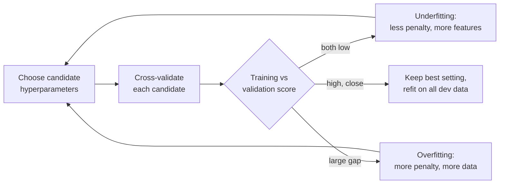
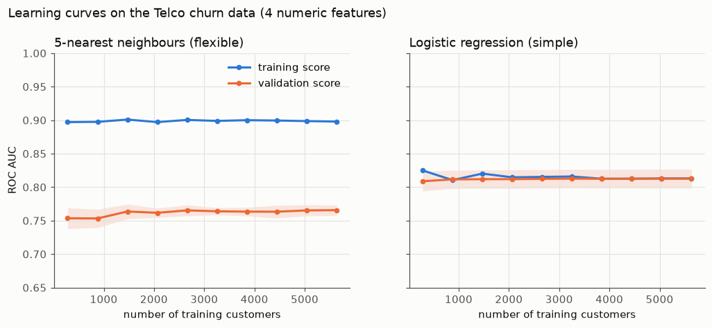
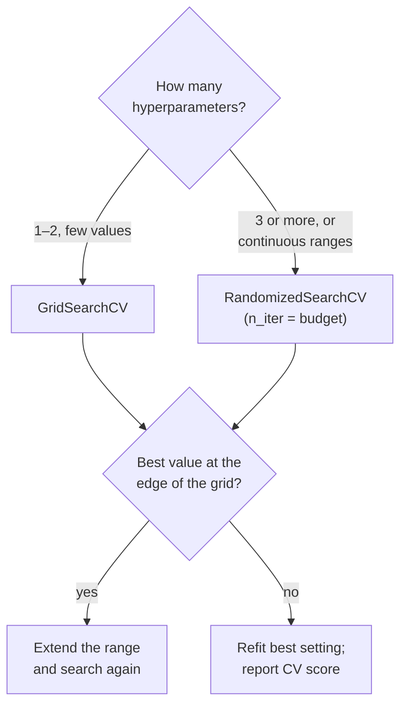

# Regularisation, learning curves and hyperparameter tuning

This page covers the second block of Session 7. Most models have settings that are not learned from the data but chosen by us: the penalty of a regularised regression, the number of neighbours of k-NN, the depth of a tree. The page separates these settings (hyperparameters) from the learned parameters, introduces ridge and lasso regression as the standard example of a model whose complexity is controlled by one number, shows how validation and learning curves diagnose underfitting and overfitting, and ends with the systematic search for good settings with `GridSearchCV` and `RandomizedSearchCV`.

The code blocks build on each other; run them in order from the repository root. They use the diabetes data that ship with scikit-learn (442 patients, 10 standardised measurements, target: disease progression after one year) and the Telco churn data.



## Parameters and hyperparameters

**Concept.** **Parameters** are learned from the data during `fit`: the coefficients and intercept of a linear or logistic regression, the split points of a tree. **Hyperparameters** are set *before* training and control how learning happens: the penalty strength `alpha` of ridge regression, `C` of logistic regression, the number of neighbours `n_neighbors` of k-NN, the polynomial degree. Hyperparameters are chosen by comparing **validation** scores, never training scores, because the training score almost always prefers the most flexible setting.

Example: for k-NN (Session 8) with *k* = 1 the training accuracy is close to 100 %, because each training point is its own nearest neighbour. Choosing *k* by training accuracy would always give *k* = 1, the most overfitted model.

**Why it matters.** The same algorithm can underfit or overfit depending on its hyperparameters. Treating them as part of the model to be validated, and choosing them by a reproducible procedure, separates a sound workflow from tuning by hand until the test score looks good.

**How it works in Python.** Every scikit-learn estimator lists its hyperparameters with `get_params()`; learned parameters end with an underscore after `fit`.

```python
import numpy as np
import pandas as pd
from sklearn.compose import make_column_transformer
from sklearn.datasets import load_diabetes
from sklearn.linear_model import Lasso, LinearRegression, LogisticRegression, Ridge
from sklearn.model_selection import KFold, StratifiedKFold, cross_val_score
from sklearn.pipeline import make_pipeline
from sklearn.preprocessing import OneHotEncoder, StandardScaler

URL = "https://raw.githubusercontent.com/IBM/telco-customer-churn-on-icp4d/master/data/Telco-Customer-Churn.csv"
df = pd.read_csv(URL)
df["TotalCharges"] = pd.to_numeric(df["TotalCharges"], errors="coerce").fillna(0)
y = (df["Churn"] == "Yes").astype(int)
X = df.drop(columns=["customerID", "Churn"])
num = ["tenure", "MonthlyCharges", "TotalCharges", "SeniorCitizen"]
cat = [c for c in X.columns if c not in num]
prep = make_column_transformer((StandardScaler(), num), (OneHotEncoder(handle_unknown="ignore"), cat))
model = make_pipeline(prep, LogisticRegression(max_iter=1000))

print(model.get_params()["logisticregression__C"])   # 1.0  -> a hyperparameter, chosen by us
model.fit(X, y)
print(model[-1].coef_.shape)                         # (1, 45) -> parameters, learned from the data
```

**In practice.**
- Gradient boosting models (Session 10) have a dozen hyperparameters (learning rate, depth, number of trees); industry teams tune them systematically and log every trial, for example with MLflow (Session 16).
- AutoML systems such as auto-sklearn (Feurer et al., 2015) treat the choice of algorithm itself as one more hyperparameter and search over it with cross-validation.

> [!WARNING]
> "Default settings" are also a choice. Report which hyperparameters you used, including defaults, so that results can be reproduced.

## Regularisation with ridge and lasso

**Concept.** Ordinary least squares chooses the coefficients b that minimise the sum of squared residuals. With many features, correlated features or few rows, the coefficients become large and unstable and the model overfits. **Regularisation** adds a penalty for large coefficients:

- **Ridge** regression minimises Σ(yᵢ − ŷᵢ)² + α Σ bⱼ². The penalty shrinks all coefficients towards zero but rarely makes them exactly zero (Hoerl & Kennard, 1970).
- **Lasso** regression minimises (1/2n) Σ(yᵢ − ŷᵢ)² + α Σ |bⱼ|. The absolute-value penalty sets some coefficients exactly to zero, so the lasso also **selects features** (Tibshirani, 1996).
- The penalty strength **α** (`alpha`) is a hyperparameter. α = 0 gives ordinary least squares; a very large α forces all coefficients to zero (the model predicts the mean). Between the two lies a trade-off: more penalty means less variance but more bias.
- Logistic regression in scikit-learn is regularised by default. Its hyperparameter is **C = 1/α**: a *small* C means a *strong* penalty.

Worked example with one feature: suppose least squares gives b = 4 on a standardised feature. With a ridge penalty and α chosen so that the shrinkage factor is 1/(1 + α/Σx²) = 0.8, the ridge coefficient is 3.2: pulled towards zero, but not zero. A lasso penalty subtracts a fixed amount instead (soft thresholding): with a threshold of 1 the coefficient becomes 3; a coefficient smaller than the threshold, say 0.6, becomes exactly 0.

> [!IMPORTANT]
> The penalty treats all coefficients alike, so the features must be on the same scale. Always put a `StandardScaler` before `Ridge`, `Lasso` or `LogisticRegression` in a pipeline.

**Why it matters.** Regularisation is the main tool to control the complexity of linear models without removing features by hand. It stabilises coefficients when features are correlated (for example `tenure` and `TotalCharges` in the Telco data), it lets you use many features (polynomial terms, one-hot columns, word counts in Session 13), and the lasso gives sparse, easier-to-read models.

**How it works in Python.**

```python
Xd, yd = load_diabetes(return_X_y=True, as_frame=True)       # 442 patients, 10 features
cv = KFold(5, shuffle=True, random_state=0)

for name, reg in [("OLS", LinearRegression()), ("ridge a=10", Ridge(alpha=10)), ("lasso a=1", Lasso(alpha=1))]:
    m = make_pipeline(StandardScaler(), reg).fit(Xd, yd)
    print(name, m[-1].coef_.round(1), round(cross_val_score(m, Xd, yd, cv=cv, scoring="r2").mean(), 3))
# OLS        [ -0.5 -11.4  24.7  15.4 -37.7  22.7   4.8   8.4  35.7   3.2] 0.489
# ridge a=10 [ -0.3 -10.9  24.6  15.1 -11.3   1.8  -6.6   5.6  25.3   3.5] 0.489
# lasso a=1  [ -0.   -9.3  24.8  14.1  -4.8  -0.  -10.6   0.   24.4   2.6] 0.49

# the lasso removes more features as alpha grows
for a in [0.1, 1, 5, 10, 20]:
    m = make_pipeline(StandardScaler(), Lasso(alpha=a)).fit(Xd, yd)
    print(a, (m[-1].coef_ != 0).sum(), "non-zero coefficients")
# 0.1 9 | 1 7 | 5 5 | 10 4 | 20 3
```

The serum measurements s1 and s2 (columns 5 and 6) are strongly correlated. Least squares gives them large coefficients of opposite sign (−37.7 and 22.7) that cancel each other; ridge shrinks both and the lasso drops s2. The cross-validated R² hardly changes: the penalty buys stability and simplicity at no cost in accuracy here. `RidgeCV` and `LassoCV` choose α by built-in cross-validation; ISLP Lab 6 (workbook 08) does the same with `ElasticNetCV`.

**In practice.**
- Genetics: lasso-type models are used to build polygenic risk scores from hundreds of thousands of genetic variants, where most effects are expected to be zero.
- Credit scoring: regularised logistic regression is a standard way to keep scorecard coefficients stable when many correlated customer attributes are available.
- Text classification (Session 13): logistic regression with an L2 penalty on tens of thousands of word features is a strong baseline; without the penalty it would overfit badly.

> [!WARNING]
> Coefficients of a regularised model are biased towards zero. Do not read them as unbiased effect sizes with standard errors; for inference, use the unpenalised models and tests of Sessions 5 and 6.

> [!CAUTION]
> Choosing α by its test score is the same mistake as choosing a model by its test score. Choose α by cross-validation on the development data.

## Validation curves and learning curves

**Concept.** Two plots diagnose underfitting and overfitting.

- A **validation curve** shows the training score and the cross-validated validation score as a function of **one hyperparameter**. Where both are low, the model underfits (too simple). Where the training score is high and the validation score much lower, it overfits (too flexible). The best setting is where the validation score peaks.
- A **learning curve** shows the same two scores as a function of the **number of training rows**. If the curves meet at a low level, more data will not help: the model is too simple (high bias). If a large gap remains and the validation curve is still rising, more data (or a simpler model) will help (high variance).




**Why it matters.** The two curves tell you *what to do next*. A gap means: regularise more, simplify or collect more data. Two low curves mean: add features or use a more flexible model. Without them, students often try random changes. The curves also make the bias–variance trade-off of Session 6 visible on real data.

**How it works in Python.**

```python
from sklearn.model_selection import learning_curve, validation_curve
from sklearn.neighbors import KNeighborsClassifier
from sklearn.preprocessing import PolynomialFeatures

# validation curve: ridge penalty on 65 polynomial features (all squares and products)
alphas = np.logspace(-3, 4, 8)
poly_ridge = make_pipeline(PolynomialFeatures(degree=2, include_bias=False), StandardScaler(), Ridge())
tr, va = validation_curve(poly_ridge, Xd, yd, param_name="ridge__alpha", param_range=alphas, cv=cv, scoring="r2")
for a, t, v in zip(alphas, tr.mean(1), va.mean(1)):
    print(f"alpha={a:g}  train={t:.3f}  valid={v:.3f}")
# alpha=0.001  train=0.606  valid=0.414   <- overfitting: gap of 0.19
# ...
# alpha=100    train=0.565  valid=0.475   <- best validation score
# alpha=1000   train=0.404  valid=0.356
# alpha=10000  train=0.108  valid=0.094   <- underfitting: both low

# learning curve: 5-NN on four numeric Telco features
knn = make_pipeline(StandardScaler(), KNeighborsClassifier(n_neighbors=5))
sizes, tr, va = learning_curve(knn, X[num], y, train_sizes=[0.05, 0.25, 1.0],
                               cv=StratifiedKFold(5, shuffle=True, random_state=0), scoring="roc_auc")
print(sizes, tr.mean(1).round(3), va.mean(1).round(3))
# [ 281 1408 5634] [0.897 0.902 0.898] [0.754 0.765 0.766]   <- persistent gap: high variance
```

The degree-2 ridge model never beats plain linear regression (R² 0.489 above): the extra terms add flexibility that the 442 patients cannot support. A validation curve makes such conclusions visible. The figure script is [figures/make_figures.py](figures/make_figures.py).

**In practice.**
- Banko and Brill (2001) plotted learning curves for a word-disambiguation task up to one billion words and showed that simple learners kept improving with more data, which influenced the move towards large training corpora in language technology.
- Teams deciding whether to pay for more labelled data (for example annotation of medical images) use learning curves to estimate the benefit of additional labels before buying them.

> [!WARNING]
> A learning curve on 50,000 rows is expensive: `learning_curve` fits the model `len(train_sizes) × k` times. Start with a sample and three to five sizes.

> [!TIP]
> Use a log scale for penalties such as α and C. The interesting range usually spans several orders of magnitude (0.001 to 1,000), not 1 to 10.

## Hyperparameter tuning with GridSearchCV and RandomizedSearchCV

**Concept.** Tuning is the systematic search for good hyperparameters by cross-validation.

- **`GridSearchCV`** tries every combination in a grid and cross-validates each. Five values of `C` × two values of `class_weight` × 5 folds = 50 fits.
- **`RandomizedSearchCV`** draws `n_iter` combinations from distributions, for example `scipy.stats.loguniform(1e-3, 1e2)` for `C`, which spreads the draws evenly over orders of magnitude. Its cost is fixed by `n_iter`, whatever the number of hyperparameters. Bergstra and Bengio (2012) showed that random search finds settings as good as a grid with far fewer trials when only a few hyperparameters matter, which is the usual case.
- Both refit the best setting on all data passed to `fit` (`best_estimator_`), report `best_params_` and `best_score_`, and store every trial in `cv_results_`.
- Wrapping preprocessing and model in a `Pipeline` lets the search tune both. Hyperparameters of a step are addressed as `step__name`, for example `logisticregression__C`.



**Why it matters.** Systematic search is reproducible, uses the validation data correctly and makes the effort visible (how many settings were tried). Inspecting `cv_results_` also shows how *flat* the optimum is: if many settings score within one standard deviation of the best, the exact choice does not matter.

**How it works in Python.**

```python
from scipy.stats import loguniform
from sklearn.model_selection import GridSearchCV, RandomizedSearchCV

skf = StratifiedKFold(5, shuffle=True, random_state=0)
grid = GridSearchCV(model, {"logisticregression__C": [0.001, 0.01, 0.1, 1, 10],
                            "logisticregression__class_weight": [None, "balanced"]},
                    cv=skf, scoring="roc_auc")
grid.fit(X, y)
print(grid.best_params_, round(grid.best_score_, 4))
# {'logisticregression__C': 1, 'logisticregression__class_weight': None} 0.8454

rand = RandomizedSearchCV(model, {"logisticregression__C": loguniform(1e-3, 1e2),
                                  "logisticregression__class_weight": [None, "balanced"]},
                          n_iter=20, cv=skf, scoring="roc_auc", random_state=0)
rand.fit(X, y)
best = rand.best_params_
print(round(best["logisticregression__C"], 2), best["logisticregression__class_weight"], round(rand.best_score_, 4))
# 1.31 None 0.8454

res = pd.DataFrame(rand.cv_results_).sort_values("rank_test_score")
print(res[["param_logisticregression__C", "mean_test_score", "std_test_score"]].head(3).round(4).to_string())
# three best C values (about 1.3, 11.5, 15.2) all have mean AUC 0.8453-0.8454 with std of about 0.014
```

The best three settings differ by 0.0001 AUC, far less than the fold-to-fold standard deviation (0.014). For this model `C` hardly matters as long as it is not very small. That is a finding worth reporting.

**In practice.**
- Bergstra and Bengio (2012) compared grid and random search for neural networks and found that random search reached equal or better settings with a fraction of the trials.
- Hyperparameter tuning services in cloud platforms (for example Google Vertex AI Vizier, Amazon SageMaker automatic model tuning) offer random and Bayesian search; open-source tools such as Optuna do the same locally.

> [!WARNING]
> `best_score_` is an **optimistic** estimate: it is the maximum of many noisy scores. Report it as a validation score, and get an unbiased estimate from nested cross-validation or a held-out test set (theory page 03).

> [!CAUTION]
> If the best value lies at the edge of your grid (for example `C=10` when the grid ends at 10), the optimum may be outside. Extend the range before you conclude.

## Practice: tuning on the case study

In the [case-study workbook](../workbooks/19-case-study-validation.ipynb), part B, you tune the ridge penalty for the regression of helpful votes and the `C` of the review classifier, and you compare a random `StratifiedKFold` with a `TimeSeriesSplit` on the reviews. Ask: does the choice of splitter change the score, the chosen hyperparameter, or both?

## Check your understanding

1. Name two parameters and two hyperparameters of a logistic regression pipeline with a `StandardScaler`.
2. Why must features be standardised before ridge or lasso regression, but not before ordinary least squares?
3. A validation curve shows a training R² of 0.95 and a validation R² of 0.40 at the smallest penalty. What is the diagnosis and what would you try?
4. A learning curve shows training and validation AUC both at 0.70 and flat. Will collecting more data help?
5. A grid search over 200 settings reports `best_score_ = 0.91`. Why will the score on new data probably be lower?

## Further reading

- James, G., Witten, D., Hastie, T., Tibshirani, R. & Taylor, J. (2023). *An Introduction to Statistical Learning with Applications in Python*, Chapter 6 "Linear Model Selection and Regularization". Springer. https://www.statlearning.com/
- scikit-learn developers (2025). *Tuning the hyper-parameters of an estimator* and *Validation curves: plotting scores to evaluate models*. https://scikit-learn.org/stable/modules/grid_search.html · https://scikit-learn.org/stable/modules/learning_curve.html
- Bergstra, J. & Bengio, Y. (2012). Random search for hyper-parameter optimization. *Journal of Machine Learning Research*, 13, 281–305. https://jmlr.org/papers/v13/bergstra12a.html
- INRIA (2024). *scikit-learn MOOC, Module 3: Hyperparameter tuning*. https://inria.github.io/scikit-learn-mooc/
