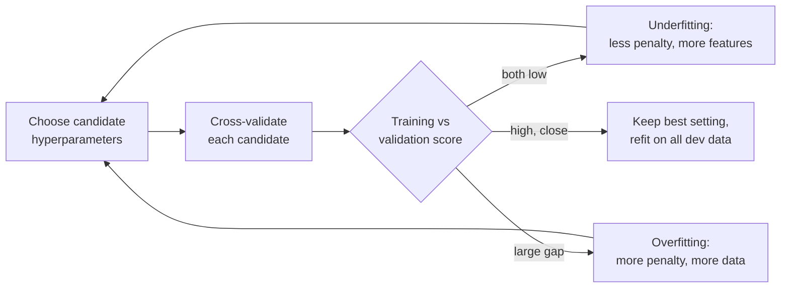
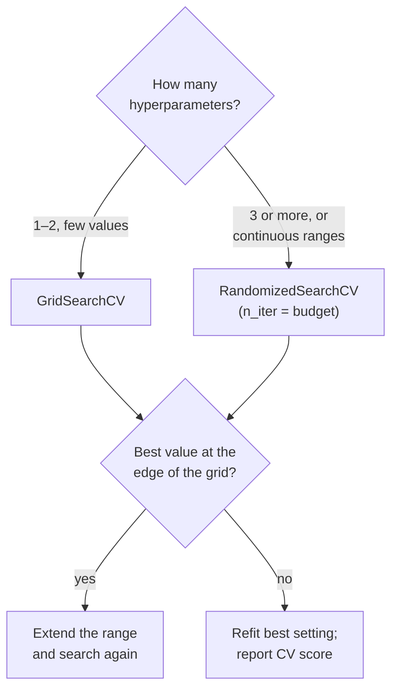

# Regularisation, learning curves and hyperparameter tuning

This page covers the second block of Session 7. Most models have settings that are not learned from the data but chosen by us: the penalty of a regularised regression, the number of neighbours of k-NN, the depth of a tree. The page separates these settings (hyperparameters) from the learned parameters, introduces ridge and lasso regression as the standard example of a model whose complexity is controlled by one number, shows how validation and learning curves diagnose underfitting and overfitting, and ends with the systematic search for good settings with `GridSearchCV` and `RandomizedSearchCV`.

The code blocks build on each other; run them in order from the repository root. They use one practical question throughout: **what is a Berlin Airbnb listing worth per night?** The data are the Inside Airbnb listings for Berlin (snapshot of 26 June 2026, `uv run python case-study/prepare_airbnb.py`), restricted as on theory page 01 to 6,675 short-term listings with a price between €10 and €1,000. The target is the log of the nightly price. With size, location, room type, reviews and 257 amenity indicators (dishwasher, elevator, balcony, ...), the model has 480 input columns: a natural case for regularisation. Cross-validation keeps each host's listings in one fold (`GroupKFold`, theory page 01). The regularisation of logistic regression is practised on the Telco churn data in the optional churn workbook.



## Parameters and hyperparameters

**Concept.** **Parameters** are learned from the data during `fit`: the coefficients and intercept of a linear or logistic regression, the split points of a tree. **Hyperparameters** are set *before* training and control how learning happens: the penalty strength `alpha` of ridge regression, `C` of logistic regression, the number of neighbours `n_neighbors` of k-NN, the polynomial degree. Hyperparameters are chosen by comparing **validation** scores, never training scores, because the training score almost always prefers the most flexible setting.

Example: for k-NN (Session 8) with *k* = 1 the training accuracy is close to 100 %, because each training point is its own nearest neighbour. Choosing *k* by training accuracy would always give *k* = 1, the most overfitted model.

**Why it matters.** The same algorithm can underfit or overfit depending on its hyperparameters. Treating them as part of the model to be validated, and choosing them by a reproducible procedure, separates a sound workflow from tuning by hand until the test score looks good.

**How it works in Python.** Every scikit-learn estimator lists its hyperparameters with `get_params()`; learned parameters end with an underscore after `fit`. The first block builds the data for the whole page.

```python
import json

import numpy as np
import pandas as pd
from sklearn.compose import make_column_transformer
from sklearn.impute import SimpleImputer
from sklearn.linear_model import Lasso, LinearRegression, Ridge
from sklearn.model_selection import GroupKFold, cross_validate
from sklearn.pipeline import make_pipeline
from sklearn.preprocessing import MultiLabelBinarizer, OneHotEncoder, StandardScaler

lst = pd.read_parquet("case-study/data/airbnb/listings.parquet")
bnb = lst[(lst["minimum_nights"] < 28) & lst["price"].between(10, 1000)].reset_index(drop=True)
bnb["dist_km"] = np.hypot((bnb["latitude"] - 52.5219) * 111.2, (bnb["longitude"] - 13.4132) * 68.0)

mlb = MultiLabelBinarizer()                                   # amenities: list as text -> one 0/1 column each
amen = pd.DataFrame(mlb.fit_transform(bnb["amenities"].map(json.loads)),
                    columns=["am_" + a for a in mlb.classes_])
amen = amen.loc[:, amen.sum() >= 20]                          # amenities listed by at least 20 listings
num = ["accommodates", "bedrooms", "beds", "bathrooms", "dist_km", "minimum_nights",
       "availability_365", "number_of_reviews", "review_scores_rating"]
cat = ["room_type", "district", "neighbourhood", "property_type"]
X = pd.concat([bnb[num + cat], amen], axis=1)
y = np.log(bnb["price"])                                      # log of the nightly price in EUR
hosts = bnb["host_id"]
prep = make_column_transformer(
    (make_pipeline(SimpleImputer(strategy="median", add_indicator=True), StandardScaler()), num),
    (OneHotEncoder(handle_unknown="ignore"), cat),
    (StandardScaler(), list(amen.columns)))
cv = GroupKFold(5)                                            # whole hosts per fold (theory page 01)

model = make_pipeline(prep, Ridge())
print(model.get_params()["ridge__alpha"])          # 1.0  -> a hyperparameter, chosen by us
model.fit(X, y)
print(amen.shape[1], model[-1].coef_.shape)        # 257 (480,) -> parameters, learned from the data
```

> [!NOTE]
> The list of amenities (those with at least 20 listings) is chosen on all rows before cross-validation. It does not look at prices, so this shortcut leaks almost nothing; Session 9 shows how to learn such a list inside the pipeline.

**In practice.**
- Gradient boosting models (Session 10) have a dozen hyperparameters (learning rate, depth, number of trees); industry teams tune them systematically and log every trial, for example with MLflow (Session 16).
- AutoML systems such as auto-sklearn (Feurer et al., 2015) treat the choice of algorithm itself as one more hyperparameter and search over it with cross-validation.

> [!WARNING]
> "Default settings" are also a choice. Report which hyperparameters you used, including defaults, so that results can be reproduced.

## Regularisation with ridge and lasso

**Concept.** Ordinary least squares chooses the coefficients b that minimise the sum of squared residuals. With many features, correlated features or few rows, the coefficients become large and unstable and the model overfits. **Regularisation** adds a penalty for large coefficients:

- **Ridge** regression minimises Σ(yᵢ − ŷᵢ)² + α Σ bⱼ². The penalty shrinks all coefficients towards zero but rarely makes them exactly zero (Hoerl & Kennard, 1970).
- **Lasso** regression minimises (1/2n) Σ(yᵢ − ŷᵢ)² + α Σ |bⱼ|. The absolute-value penalty sets some coefficients exactly to zero, so the lasso also **selects features** (Tibshirani, 1996).
- The penalty strength **α** (`alpha`) is a hyperparameter. α = 0 gives ordinary least squares; a very large α forces all coefficients to zero (the model predicts the mean). Between the two lies a trade-off: more penalty means less variance but more bias.
- Logistic regression in scikit-learn is regularised by default. Its hyperparameter is **C = 1/α**: a *small* C means a *strong* penalty.

Worked example with one feature: suppose least squares gives b = 4 on a standardised feature. With a ridge penalty and α chosen so that the shrinkage factor is 1/(1 + α/Σx²) = 0.8, the ridge coefficient is 3.2: pulled towards zero, but not zero. A lasso penalty subtracts a fixed amount instead (soft thresholding): with a threshold of 1 the coefficient becomes 3; a coefficient smaller than the threshold, say 0.6, becomes exactly 0.

> [!IMPORTANT]
> The penalty treats all coefficients alike, so the features must be on the same scale. Always put a `StandardScaler` before `Ridge`, `Lasso` or `LogisticRegression` in a pipeline.

**Why it matters.** Regularisation is the main tool to control the complexity of linear models without removing features by hand. It stabilises coefficients when features are correlated (for example `accommodates`, `bedrooms` and `beds`, or amenities that come together such as oven, stove and baking sheet), it lets you use many features (amenity indicators, one-hot columns for 135 neighbourhoods, word counts in Session 13), and the lasso gives sparse, easier-to-read models.

**How it works in Python.**

```python
for name, reg in [("OLS", LinearRegression()), ("ridge a=10", Ridge(alpha=10)),
                  ("lasso a=0.001", Lasso(alpha=0.001, max_iter=5000)),
                  ("lasso a=0.01", Lasso(alpha=0.01, max_iter=5000))]:
    m = make_pipeline(prep, reg)
    res = cross_validate(m, X, y, cv=cv, groups=hosts, scoring="r2", return_train_score=True)
    coef = m.fit(X, y)[-1].coef_
    print(f"{name:13s} train {res['train_score'].mean():.3f}  valid {res['test_score'].mean():.3f}  "
          f"largest |b| {np.abs(coef).max():.2f}  non-zero {(coef != 0).sum()}")
# OLS           train 0.705  valid 0.597  largest |b| 2.16  non-zero 480
# ridge a=10    train 0.694  valid 0.605  largest |b| 0.55  non-zero 480
# lasso a=0.001 train 0.672  valid 0.602  largest |b| 0.74  non-zero 271
# lasso a=0.01  train 0.602  valid 0.562  largest |b| 0.27  non-zero 80

names = model[0].get_feature_names_out()
lasso = make_pipeline(prep, Lasso(alpha=0.01, max_iter=5000)).fit(X, y)
b_amen = pd.Series(lasso[-1].coef_, index=names).filter(like="__am_")
print((b_amen != 0).sum(), b_amen.sort_values().tail(3).round(3).to_dict())
# 67 {'standardscaler__am_Safe': 0.028, 'standardscaler__am_Elevator': 0.032, 'standardscaler__am_Dishwasher': 0.039}
```

Least squares gives some columns large coefficients (up to 2.16 on the log scale, a factor of e^2.16 ≈ 8.7 per standard deviation): rare neighbourhood and property-type dummies with a handful of listings, which the model fits almost exactly. Ridge with α = 10 shrinks the largest coefficient to 0.55 and gains a little validation R² (0.597 → 0.605). The lasso with α = 0.001 keeps 271 of 480 columns at almost the same score; with α = 0.01 it keeps 80 columns, 67 of them amenities, led by dishwasher, elevator and safe. (Most one-hot columns drop out because the pipeline does not scale them: a rare 0/1 column has a small spread, so the same penalty weighs more heavily on it.) Each coefficient is small: one standard deviation more "dishwasher" raises the predicted price by about 4 %. On data of this size the penalty buys stability and a shorter model rather than accuracy; the next section shows when it buys accuracy as well. `RidgeCV` and `LassoCV` choose α by built-in cross-validation; ISLP Lab 6 (workbook 08) does the same with `ElasticNetCV`.

**In practice.**
- Genetics: lasso-type models are used to build polygenic risk scores from hundreds of thousands of genetic variants, where most effects are expected to be zero.
- Credit scoring: regularised logistic regression is a standard way to keep scorecard coefficients stable when many correlated customer attributes are available.
- Text classification (Session 13): logistic regression with an L2 penalty on tens of thousands of word features is a strong baseline; without the penalty it would overfit badly.

> [!WARNING]
> Coefficients of a regularised model are biased towards zero. Do not read them as unbiased effect sizes with standard errors; for inference, use the unpenalised models and tests of Sessions 5 and 6.

> [!CAUTION]
> Choosing α by its test score is the same mistake as choosing a model by its test score. Choose α by cross-validation on the development data.

## Validation curves and learning curves

**Concept.** Two plots diagnose underfitting and overfitting.

- A **validation curve** shows the training score and the cross-validated validation score as a function of **one hyperparameter**. Where both are low, the model underfits (too simple). Where the training score is high and the validation score much lower, it overfits (too flexible). The best setting is where the validation score peaks.
- A **learning curve** shows the same two scores as a function of the **number of training rows**. If the curves meet at a low level, more data will not help: the model is too simple (high bias). If a large gap remains and the validation curve is still rising, more data (or a simpler model) will help (high variance).


**Why it matters.** The two curves tell you *what to do next*. A gap means: regularise more, simplify or collect more data. Two low curves mean: add features or use a more flexible model. Without them, students often try random changes. The curves also make the bias–variance trade-off of Session 6 visible on real data.

**How it works in Python.**

```python
from sklearn.ensemble import HistGradientBoostingRegressor
from sklearn.model_selection import learning_curve, validation_curve

# validation curve: the ridge penalty, once with all listings and once with 1,000 of them
alphas = np.logspace(-2, 4, 7)
small = np.random.default_rng(0).choice(len(X), 1000, replace=False)     # a city with 1,000 listings
for label, rows in [("all 6,675 listings", np.arange(len(X))), ("1,000 listings", small)]:
    tr, va = validation_curve(make_pipeline(prep, Ridge()), X.iloc[rows], y.iloc[rows], groups=hosts.iloc[rows],
                              param_name="ridge__alpha", param_range=alphas, cv=cv, scoring="r2")
    print(label, [f"{a:g}: {t:.2f}/{v:.2f}" for a, t, v in zip(alphas, tr.mean(1), va.mean(1))])
# all 6,675 listings ['0.01: 0.71/0.60', '0.1: 0.71/0.60', '1: 0.70/0.60', '10: 0.69/0.60', '100: 0.67/0.59',
#                     '1000: 0.63/0.56', '10000: 0.52/0.48']
# 1,000 listings     ['0.01: 0.84/0.02', '0.1: 0.84/0.13', '1: 0.83/0.27', '10: 0.79/0.36', '100: 0.73/0.42',
#                     '1000: 0.61/0.46', '10000: 0.29/0.23']   <- train/valid R²

# learning curve: ridge versus gradient boosting (Session 10)
for label, est in [("ridge", make_pipeline(prep, Ridge(alpha=10))),
                   ("gradient boosting", make_pipeline(prep, HistGradientBoostingRegressor(random_state=0)))]:
    sizes, tr, va = learning_curve(est, X, y, groups=hosts, cv=cv, train_sizes=[0.1, 0.5, 1.0], scoring="r2")
    print(label, sizes, tr.mean(1).round(3), va.mean(1).round(3))
# ridge             [ 534 2670 5340] [0.864 0.737 0.694] [-0.124  0.55   0.605]
# gradient boosting [ 534 2670 5340] [0.967 0.918 0.85 ] [ 0.455  0.589  0.638]
```

With all listings the penalty hardly matters: 480 columns are few for 6,675 rows, and the validation R² stays near 0.60 from α = 0.01 to 30. With 1,000 listings the same model without penalty memorises the training data (R² 0.84) and predicts new hosts no better than the mean (0.02); a strong penalty (α of several hundred; the finer grid of the figure peaks near 460) lifts the validation R² to about 0.46. The fewer rows per column, the more the penalty matters. The learning curves say what to do next. For ridge, the gap closes as listings are added and both curves level off near 0.6–0.7: more listings of the same kind will help little, better features might. For gradient boosting the gap stays large and the validation curve is still rising: this model would profit from more data, and it already beats ridge at every size. The figure script is [figures/make_figures.py](figures/make_figures.py).

**In practice.**
- Banko and Brill (2001) plotted learning curves for a word-disambiguation task up to one billion words and showed that simple learners kept improving with more data, which influenced the move towards large training corpora in language technology.
- Teams deciding whether to pay for more labelled data (for example annotation of medical images) use learning curves to estimate the benefit of additional labels before buying them.

> [!WARNING]
> A learning curve on 50,000 rows is expensive: `learning_curve` fits the model `len(train_sizes) × k` times. Start with a sample and three to five sizes.

> [!TIP]
> Use a log scale for penalties such as α and C. The interesting range usually spans several orders of magnitude (0.001 to 1,000), not 1 to 10.

## Hyperparameter tuning with GridSearchCV and RandomizedSearchCV

**Concept.** Tuning is the systematic search for good hyperparameters by cross-validation.

- **`GridSearchCV`** tries every combination in a grid and cross-validates each. Six values of the ridge penalty `alpha` × 5 folds = 30 fits; five values of `C` × two values of `class_weight` would already be 50.
- **`RandomizedSearchCV`** draws `n_iter` combinations from distributions, for example `scipy.stats.loguniform(0.01, 0.3)` for a learning rate, which spreads the draws evenly over orders of magnitude. Its cost is fixed by `n_iter`, whatever the number of hyperparameters. Bergstra and Bengio (2012) showed that random search finds settings as good as a grid with far fewer trials when only a few hyperparameters matter, which is the usual case.
- Both refit the best setting on all data passed to `fit` (`best_estimator_`), report `best_params_` and `best_score_`, and store every trial in `cv_results_`.
- Wrapping preprocessing and model in a `Pipeline` lets the search tune both. Hyperparameters of a step are addressed as `step__name`, for example `ridge__alpha` or `logisticregression__C`. When the splitter needs groups, pass them to `fit`: `search.fit(X, y, groups=hosts)`.



**Why it matters.** Systematic search is reproducible, uses the validation data correctly and makes the effort visible (how many settings were tried). Inspecting `cv_results_` also shows how *flat* the optimum is: if many settings score within one standard deviation of the best, the exact choice does not matter.

**How it works in Python.** A grid for the single ridge penalty, and a random search over four hyperparameters of gradient boosting (Session 10 explains them; here they are just knobs):

```python
from scipy.stats import loguniform, randint
from sklearn.model_selection import GridSearchCV, RandomizedSearchCV

grid = GridSearchCV(make_pipeline(prep, Ridge()), {"ridge__alpha": [0.1, 1, 3, 10, 30, 100]}, cv=cv, scoring="r2")
grid.fit(X, y, groups=hosts)
print(grid.best_params_, round(grid.best_score_, 3))           # {'ridge__alpha': 10} 0.605
print(pd.DataFrame(grid.cv_results_)[["param_ridge__alpha", "mean_test_score", "std_test_score"]]
      .round(3).to_string(index=False))
# alpha 0.1: 0.598 (sd 0.017) | 1: 0.602 | 3: 0.604 | 10: 0.605 (sd 0.015) | 30: 0.600 | 100: 0.588

gbm = make_pipeline(prep, HistGradientBoostingRegressor(random_state=0))
space = {"histgradientboostingregressor__learning_rate": loguniform(0.01, 0.3),
         "histgradientboostingregressor__max_leaf_nodes": randint(4, 64),
         "histgradientboostingregressor__min_samples_leaf": randint(5, 100),
         "histgradientboostingregressor__l2_regularization": loguniform(1e-3, 10)}
rand = RandomizedSearchCV(gbm, space, n_iter=15, cv=cv, scoring="r2", random_state=0, n_jobs=-1)
rand.fit(X, y, groups=hosts)                                    # 15 settings x 5 folds = 75 fits, about 30 s
print(round(rand.best_score_, 3), {k.split("__")[1]: round(float(v), 3) for k, v in rand.best_params_.items()})
# 0.641 {'l2_regularization': 0.037, 'learning_rate': 0.172, 'max_leaf_nodes': 12.0, 'min_samples_leaf': 14.0}
res = pd.DataFrame(rand.cv_results_).sort_values("rank_test_score")
print(res["mean_test_score"].round(3).tolist())
# [0.641, 0.636, 0.616, 0.612, 0.609, 0.608, 0.599, 0.585, 0.571, 0.56, 0.554, 0.547, 0.525, 0.522, 0.484]
```

The ridge optimum is flat: every α from 1 to 30 scores within 0.005 of the best, far less than the fold-to-fold standard deviation (about 0.015). For this model α hardly matters as long as it is not very large, which is a finding worth reporting. The boosting search is different: the 15 settings range from 0.48 to 0.64, so these hyperparameters matter, and the two best settings (0.641 and 0.636) are again within one standard deviation of each other (0.019). The default setting scored 0.638 in the learning curve above: on this problem the defaults of `HistGradientBoostingRegressor` are already good, and the search mainly shows that some regions of the space are clearly worse. The optional churn workbook tunes the regularisation `C` of the Telco logistic regression in the same way.

**In practice.**
- Bergstra and Bengio (2012) compared grid and random search for neural networks and found that random search reached equal or better settings with a fraction of the trials.
- Hyperparameter tuning services in cloud platforms (for example Google Vertex AI Vizier, Amazon SageMaker automatic model tuning) offer random and Bayesian search; open-source tools such as Optuna do the same locally.

> [!WARNING]
> `best_score_` is an **optimistic** estimate: it is the maximum of many noisy scores. Report it as a validation score, and get an unbiased estimate from nested cross-validation or a held-out test set (theory page 03).

> [!CAUTION]
> If the best value lies at the edge of your grid (for example `C=10` when the grid ends at 10), the optimum may be outside. Extend the range before you conclude.

## Practice: tuning on the case studies

In the [Airbnb validation workbook](../workbooks/20-case-study-airbnb-price-validation.ipynb), part B, you tune the ridge and lasso penalties of the Berlin price model, draw its validation and learning curves and run a randomised search, all with host-grouped folds. Ask: does the choice of splitter change the score, the chosen hyperparameter, or both? The optional [churn workbook](../workbooks/19-case-study-churn-validation.ipynb) tunes `C` of the Telco logistic regression of Session 6 in the same way.

## Check your understanding

1. Name two parameters and two hyperparameters of the ridge price pipeline (imputer, scaler, one-hot encoder, ridge).
2. Why must features be standardised before ridge or lasso regression, but not before ordinary least squares?
3. With 1,000 listings, the unpenalised price model has a training R² of 0.84 and a validation R² of 0.02. What is the diagnosis, and why is it much milder with 6,675 listings?
4. A learning curve shows training and validation R² both at 0.62 and flat. Will collecting more listings help? What would you try instead?
5. A grid search over 200 settings reports `best_score_ = 0.91`. Why will the score on new data probably be lower?

## Further reading

- James, G., Witten, D., Hastie, T., Tibshirani, R. & Taylor, J. (2023). *An Introduction to Statistical Learning with Applications in Python*, Chapter 6 "Linear Model Selection and Regularization". Springer. https://www.statlearning.com/
- scikit-learn developers (2025). *Tuning the hyper-parameters of an estimator* and *Validation curves: plotting scores to evaluate models*. https://scikit-learn.org/stable/modules/grid_search.html · https://scikit-learn.org/stable/modules/learning_curve.html
- Bergstra, J. & Bengio, Y. (2012). Random search for hyper-parameter optimization. *Journal of Machine Learning Research*, 13, 281–305. https://jmlr.org/papers/v13/bergstra12a.html
- INRIA (2024). *scikit-learn MOOC, Module 3: Hyperparameter tuning*. https://inria.github.io/scikit-learn-mooc/
