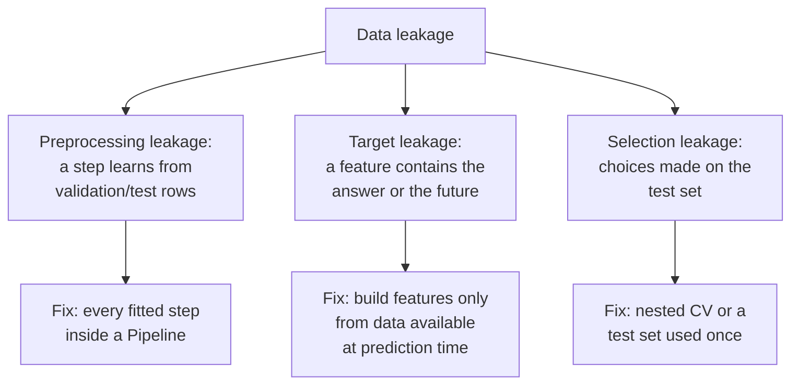
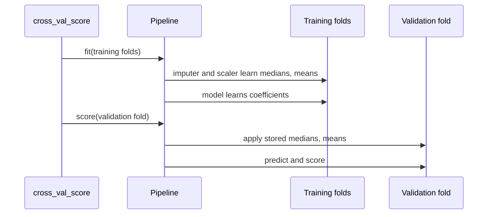
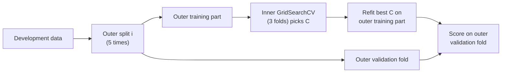

# Data leakage, pipelines, nested cross-validation and the final test

This page covers the third block of Session 7. The tools of the first two blocks give honest estimates only if the validation data stay truly unseen. **Data leakage** breaks this: information from the validation or test rows, or information that will not exist at prediction time, slips into training, and the scores become too good to be true. The page shows the two main forms of leakage, the scikit-learn `Pipeline` as the standard remedy, nested cross-validation for an unbiased estimate after tuning, and the final test on held-out data that closes a project.

The code blocks build on each other; run them in order from the repository root.



## Data leakage: preprocessing outside the cross-validation

**Concept.** Many preparation steps *learn* something from the data: a `StandardScaler` learns means and standard deviations, a `SimpleImputer` learns medians, a feature selector learns which columns are related to the target, a `CountVectorizer` learns a vocabulary. If such a step is fitted on **all** rows before the data are split, the validation folds have influenced the training. The model is then evaluated on rows that were not truly unseen.

How much this matters depends on the step. Scaling with the overall mean instead of the training mean changes little when the data are large. A step that looks at the **target** (feature selection, target encoding, oversampling of rare classes in Session 9) can change the result completely, as the example below shows.

Worked example: 200 rows, 5,000 columns of pure noise, random labels. No model can do better than 50 % accuracy. But among 5,000 random columns, some will by chance be correlated with the labels *in these 200 rows*. If we select the 20 most correlated columns using all rows, and then cross-validate, the model finds those chance correlations again in every validation fold, because the validation rows helped to pick them.

**Why it matters.** Leakage is one of the most common reasons why published or deployed models perform worse than reported. Kapoor and Narayanan (2023) reviewed studies in 17 scientific fields and found leakage in hundreds of papers, often leading to strongly over-optimistic claims.

**How it works in Python.** First the extreme case on pure noise, then the Berlin price model of theory pages 01 and 02.

```python
import numpy as np
import pandas as pd
from sklearn.compose import make_column_transformer
from sklearn.feature_selection import SelectKBest, f_classif
from sklearn.impute import SimpleImputer
from sklearn.linear_model import LogisticRegression, Ridge
from sklearn.metrics import mean_absolute_error, r2_score
from sklearn.model_selection import GroupKFold, KFold, cross_val_predict, cross_val_score
from sklearn.pipeline import make_pipeline
from sklearn.preprocessing import OneHotEncoder, StandardScaler, TargetEncoder

# pure noise: 200 rows, 5,000 random features, random labels -> true accuracy is 0.5
rng = np.random.default_rng(0)
X_noise, y_noise = rng.normal(size=(200, 5000)), rng.integers(0, 2, 200)

# WRONG: pick the 20 features most related to y using ALL rows, then cross-validate
X_sel = SelectKBest(f_classif, k=20).fit_transform(X_noise, y_noise)
print(cross_val_score(LogisticRegression(), X_sel, y_noise, cv=5).mean().round(2))      # 0.8

# RIGHT: the selector is part of the pipeline and is refitted inside every training fold
leak_free = make_pipeline(SelectKBest(f_classif, k=20), LogisticRegression())
print(cross_val_score(leak_free, X_noise, y_noise, cv=5).mean().round(2))               # 0.51
```

The Berlin price model: 6,675 short-stay listings priced between €10 and €1,000 (theory page 01), the log of the nightly price as target, size, distance to Alexanderplatz, reviews and availability as numbers, room type, district and property type as categories, and the 138 neighbourhoods (Ortsteile). The helper reports R² on the log scale and the mean absolute error in euros, both from cross-validated predictions.

```python
lst = pd.read_parquet("case-study/data/airbnb/listings.parquet")
bnb = lst[(lst["minimum_nights"] < 28) & lst["price"].between(10, 1000)].reset_index(drop=True)
bnb["dist_km"] = np.hypot((bnb["latitude"] - 52.5219) * 111.2, (bnb["longitude"] - 13.4132) * 68.0)
num = ["accommodates", "bedrooms", "beds", "bathrooms", "dist_km", "minimum_nights",
       "availability_365", "number_of_reviews", "review_scores_rating"]
cat = ["room_type", "district", "property_type"]
y = np.log(bnb["price"])
hosts = bnb["host_id"]
X = bnb[num + cat + ["neighbourhood"]].assign(host=hosts.astype(str))
random5, grouped5 = KFold(5, shuffle=True, random_state=0), GroupKFold(5)
num_prep = make_pipeline(SimpleImputer(strategy="median", add_indicator=True), StandardScaler())

def cv_scores(model, X, cv, groups=None):
    pred = cross_val_predict(model, X, y, cv=cv, groups=groups)
    return f"R² {r2_score(y, pred):.3f}  MAE € {mean_absolute_error(bnb['price'], np.exp(pred)):.1f}"

# (a) imputer and scaler fitted on ALL rows, then cross-validated
X_scaled = pd.DataFrame(num_prep.fit_transform(X[num])).add_prefix("z").join(X[cat + ["neighbourhood"]])
one_hot = make_column_transformer((OneHotEncoder(handle_unknown="ignore"), cat + ["neighbourhood"]),
                                  remainder="passthrough")
print(cv_scores(make_pipeline(one_hot, Ridge(alpha=10)), X_scaled, random5))     # R² 0.611  MAE € 50.6
inside = make_column_transformer((num_prep, num), (OneHotEncoder(handle_unknown="ignore"), cat + ["neighbourhood"]))
print(cv_scores(make_pipeline(inside, Ridge(alpha=10)), X, random5))             # R² 0.611  MAE € 50.6

# (b) a hand-made target encoding: mean log price of the neighbourhood, from ALL rows
X_nb = X.assign(nb_price=y.groupby(X["neighbourhood"]).transform("mean"))
leaky_nb = make_column_transformer((num_prep, num + ["nb_price"]), (OneHotEncoder(handle_unknown="ignore"), cat))
print(cv_scores(make_pipeline(leaky_nb, Ridge(alpha=10)), X_nb, random5))       # R² 0.614  MAE € 50.6
# the same encoding learned inside the pipeline, from the training folds only
nb_inside = make_column_transformer((num_prep, num), (OneHotEncoder(handle_unknown="ignore"), cat),
                                    (TargetEncoder(cv=KFold(5, shuffle=True, random_state=0)), ["neighbourhood"]))
print(cv_scores(make_pipeline(nb_inside, Ridge(alpha=10)), X, random5))          # R² 0.605  MAE € 51.0
```

Scaling with all rows changes nothing visible: means and standard deviations of 6,675 listings hardly move when one fold is added. The neighbourhood means are a step that looks at the target: fitted on all rows, every listing's own price has gone into the mean of its neighbourhood. With about 50 listings per neighbourhood the effect is still small here (0.614 against 0.605 for the same encoding learned inside the pipeline; `TargetEncoder` is explained in the next section and in Session 9). The next section shows the same mistake where the groups are small.

**In practice.**
- Kapoor and Narayanan (2023) traced a series of over-optimistic results in civil-war prediction to leakage, including imputation fitted on the full dataset; after correction, the complex models did not beat a logistic regression.
- The scikit-learn documentation has a page "Common pitfalls and recommended practices" whose first topic is preprocessing outside the cross-validation, with the same feature-selection example. The INRIA workbook [16-data-leakage-feature-selection.ipynb](../workbooks/16-data-leakage-feature-selection.ipynb) walks through it step by step.

> [!CAUTION]
> Any step that looks at the target (feature selection by correlation with y, target encoding, resampling such as SMOTE in Session 9) must be fitted inside the cross-validation. Fitted on all rows, it produces scores that cannot be trusted at all.

## Data leakage: target leakage

**Concept.** **Target leakage** means that a feature contains information about the target that will not be available when the model is used. Typical sources:

- a feature *computed from the target*, for example a customer's average rating that includes the rating being predicted;
- a feature *recorded after the event*, for example "reason for cancellation" in a churn table, or "antibiotic prescribed" when predicting an infection;
- an identifier or timestamp that happens to correlate with the label in the collected data.

The model learns the shortcut, cross-validation confirms it (the shortcut is present in every fold), and the model fails in use, where the shortcut is missing.

**Why it matters.** No splitter can detect target leakage: the leak is inside the rows. It can only be found by asking, for every feature, *"would I know this value at the moment of prediction?"* A tempting feature for the price model is the **host's average price**: hosts with expensive flats tend to have more expensive flats. Computed from all listings, it contains the listing's own price, and 43.5 % of the listings belong to hosts with a single listing, for whom the "host average" *is* the target. A first-time host has no average at all.

**How it works in Python.**

```python
# the host's mean log price from ALL listings, including the listing being predicted
X_host = X_nb.assign(host_price=y.groupby(X["host"]).transform("mean"))
leaky_host = make_column_transformer((num_prep, num + ["nb_price", "host_price"]),
                                     (OneHotEncoder(handle_unknown="ignore"), cat))
print(cv_scores(make_pipeline(leaky_host, Ridge(alpha=10)), X_host, random5))           # R² 0.869  MAE € 27.7
print(cv_scores(make_pipeline(leaky_host, Ridge(alpha=10)), X_host, grouped5, hosts))   # R² 0.866  MAE € 27.8
```

Cross-validation now reports an error of €28 instead of €51, and host-grouped folds do not help (0.866): the leak sits inside each row, so it travels with the row into whichever fold it lands in. For a new host the column would be empty. The leak would have been found by the question above, or by its symptom: one new feature that halves the error is a warning sign. Session 9 meets a second kind, the revenue estimate of Inside Airbnb, which is computed from the price and the occupancy that a demand model is meant to predict.

**In practice.**
- KDD Cup 2008 (breast cancer detection): the patient identifier was predictive of the label because of how the data had been assembled; Kaufman et al. (2012) use it as a textbook case of leakage.
- Hospital data: a feature such as "antibiotic prescribed" or "chest X-ray ordered" can reveal the diagnosis a model is supposed to predict, because it is recorded after the doctor suspected it.
- Churn data: fields like "reason for leaving" or "contract end date" are filled only for customers who have already left.
- Marketplace data: an average price, rating or revenue per seller computed from all rows contains the row being predicted, and it does not exist for a new seller.

> [!WARNING]
> A suspiciously large jump in validation score from one new feature is a warning sign, not a success. Check when and how that feature is recorded before you celebrate.

## Preprocessing inside a Pipeline

**Concept.** A scikit-learn **`Pipeline`** chains steps: zero or more transformers (imputer, scaler, encoder, selector, vectoriser) and a final model. Calling `fit` on the pipeline fits each step on the training data and passes the transformed data on; calling `predict` or `score` only *applies* the fitted steps to new data. When a pipeline is passed to `cross_val_score`, `GridSearchCV` or `cross_validate`, the whole pipeline is refitted on the training folds of every split, so the validation fold never influences any step.



**Why it matters.** The pipeline turns "remember to fit the scaler only on the training part" from a rule that people forget into code that cannot get it wrong. It also packages preparation and model into one object that can be saved and deployed (Session 16), so the same steps are applied to new data in production. Session 8 extends it with `ColumnTransformer` for mixed numeric and categorical columns.

**How it works in Python.** The fix for both columns above is `TargetEncoder` *inside* the pipeline: in every split it learns the neighbourhood and host means from the training folds only, and it cross-fits them within the training folds as well (Session 9 explains how). Steps are named automatically by `make_column_transformer` and `make_pipeline` (lower-case class names), which is how a search addresses their hyperparameters.

```python
encoded = make_column_transformer((num_prep, num), (OneHotEncoder(handle_unknown="ignore"), cat),
                                  (TargetEncoder(cv=KFold(5, shuffle=True, random_state=0)), ["neighbourhood", "host"]))
pipe = make_pipeline(encoded, Ridge(alpha=10))
print(list(pipe.named_steps))                                   # ['columntransformer', 'ridge']
print(cv_scores(pipe, X, random5))                              # R² 0.645  MAE € 48.0
```

The error rises from €28 to €48: most of the leak is gone. But not all of it. With random folds, 55 % of the validation listings have a host whose other listings sit in the training folds, so the encoder still knows that host's prices. That is the **second leaking workflow: the same host in training and validation**. A first-time host is never in the training data, and only grouped folds reproduce that:

```python
print(cv_scores(pipe, X, grouped5, hosts))                      # R² 0.574  MAE € 52.1

no_host = make_column_transformer((num_prep, num), (OneHotEncoder(handle_unknown="ignore"), cat),
                                  (TargetEncoder(cv=KFold(5, shuffle=True, random_state=0)), ["neighbourhood"]))
print(cv_scores(make_pipeline(no_host, Ridge(alpha=10)), X, grouped5, hosts))   # R² 0.587  MAE € 51.9
```

| Workflow | Cross-validated R² | MAE € |
|---|---|---|
| Host and neighbourhood means from all rows, random folds | 0.869 | 27.7 |
| The same, host-grouped folds | 0.866 | 27.8 |
| Target encoding inside the Pipeline, random folds | 0.645 | 48.0 |
| Target encoding inside the Pipeline, host-grouped folds | 0.574 | 52.1 |
| Without the host column, host-grouped folds | 0.587 | 51.9 |

Each leak needs its own fix: the pipeline removes the target from the features, the grouped folds remove the host's other listings from training. Once both are fixed, the host column is worth nothing for a new host (an unknown host gets the overall mean), and the simpler model without it is slightly better. The [Airbnb validation workbook](../workbooks/20-case-study-airbnb-price-validation.ipynb), part C, repeats the comparison with gradient boosting.

> [!TIP]
> If a step needs the target or learns anything from the data (medians, means, categories, a vocabulary), it belongs in the pipeline. If it is a fixed rule that looks at one row at a time (for example the distance to Alexanderplatz from the coordinates, or `np.log` of the price), it can be applied before splitting.

**In practice.**
- Production machine learning systems serialise the fitted pipeline (for example with `joblib` or `skops`) rather than the model alone, so that the serving code cannot apply different preprocessing; this "training–serving skew" is a known source of failures described in Google's *Rules of Machine Learning* (Zinkevich).
- The INRIA scikit-learn MOOC uses pipelines from its first module onwards for exactly this reason.

> [!WARNING]
> Manual `fit_transform` on the training data and `transform` on the test data is correct for one split, but breaks as soon as you cross-validate or tune: you would have to repeat it by hand for every fold. Use a pipeline.

## Nested cross-validation

**Concept.** After a grid search, `best_score_` is no longer an unbiased estimate: we picked the setting that did best on those very folds. The bias grows with the number of settings tried and shrinks with the size of the data. **Nested cross-validation** separates the two tasks:

- an **inner loop** (a `GridSearchCV` on the training part of each outer split) chooses the hyperparameters;
- an **outer loop** (`cross_val_score` around the search) scores the complete procedure, tuning included, on folds that the search has never seen.

The result estimates how well *the tuning procedure* performs on new data, not one fixed model. With 5 outer and 3 inner folds and 5 settings, the model is fitted 5 × (3 × 5 + 1) = 80 times.



**Why it matters.** When tuning is extensive or the data are small, nested CV gives the number to report. Varma and Simon (2006) showed in simulations on gene-expression data that non-nested estimates after tuning can suggest substantial predictive accuracy where none exists. When data are plentiful, a held-out test set used once (next section) serves the same purpose more cheaply.

**How it works in Python.** Tune the ridge penalty of the model without the host column with host-grouped inner folds, and score the whole search with host-grouped outer folds. `params={"groups": hosts}` hands the host of each row on to the inner search.

```python
from sklearn.model_selection import GridSearchCV

tuned = GridSearchCV(make_pipeline(no_host, Ridge()), {"ridge__alpha": [0.1, 1, 10, 100]},
                     cv=GroupKFold(3), scoring="r2")
nested = cross_val_score(tuned, X, y, cv=grouped5, groups=hosts, params={"groups": hosts}, scoring="r2")
print(nested.round(3), nested.mean().round(3))      # [0.553 0.58  0.597 0.578 0.619] 0.585

tuned.fit(X, y, groups=hosts)
print(tuned.best_params_, round(tuned.best_score_, 3))   # {'ridge__alpha': 10} 0.588
```

With 6,675 listings and four settings, the nested estimate (0.585) is almost the same as `best_score_` (0.588): little optimism to remove, as expected for a flat optimum (theory page 02). With 200 patients and 500 settings the difference can be large.

**In practice.**
- Small-sample biomedical studies (gene expression, neuroimaging) use nested cross-validation to avoid reporting over-optimistic accuracy after model selection (Varma & Simon, 2006; Cawley & Talbot, 2010).
- Benchmarks of automated machine learning systems evaluate each system's whole tuning procedure on outer folds, because each system tunes internally.

> [!WARNING]
> Nested CV does not give you a final model. Its purpose is the estimate. To obtain the model, run the inner search once on all development data and use `best_estimator_`.

## The final test on held-out data

**Concept.** The last step of every project is a single evaluation of the final, chosen model on data that played no part in any decision: the **held-out test set**. Everything before it (feature choices, model choice, tuning) uses only the development data and cross-validation. The test score, with a bootstrap interval, is the number you report. The held-out data must match the use: for a price suggestion for new hosts, hosts that the model has never seen; when the model will predict the future, the *latest* period (an **out-of-time** test).

**Why it matters.** The final test protects against all forms of selection on the development data at once, including choices you did not notice you were making. A clear gap between validation and test scores is itself a finding: it points to leakage, drift or an unsuitable validation scheme.

**How it works in Python.** Lock away 20 % of the hosts, tune on the other 80 % with host-grouped folds, evaluate once, and bootstrap the MAE by host (theory page 01):

```python
from sklearn.model_selection import GroupShuffleSplit

dev, test = next(GroupShuffleSplit(n_splits=1, test_size=0.2, random_state=0).split(X, y, groups=hosts))
print(len(dev), len(test), hosts.iloc[test].nunique())          # 5421 1254 748

search = GridSearchCV(make_pipeline(no_host, Ridge()), {"ridge__alpha": [0.1, 1, 10, 100]},
                      cv=grouped5, scoring="r2")
search.fit(X.iloc[dev], y.iloc[dev], groups=hosts.iloc[dev])     # refits the best alpha on all development hosts
print(search.best_params_, round(search.best_score_, 3))         # {'ridge__alpha': 10} 0.599

pred = search.predict(X.iloc[test])                             # the one and only look at the test hosts
abs_err = np.abs(bnb["price"].iloc[test].to_numpy() - np.exp(pred))
print(round(r2_score(y.iloc[test], pred), 3), round(abs_err.mean(), 1))   # 0.544 51.8

by_host = pd.DataFrame({"host": hosts.iloc[test].to_numpy(), "err": abs_err}).groupby("host")["err"]
sums, counts = by_host.sum().to_numpy(), by_host.count().to_numpy()
rng = np.random.default_rng(0)
boot = []
for _ in range(1000):
    pick = rng.integers(0, len(sums), len(sums))
    boot.append(sums[pick].sum() / counts[pick].sum())
print(np.percentile(boot, [2.5, 97.5]).round(1))                 # [46.3 57.5]
```

The test R² (0.544) is lower than the grouped cross-validation on the development hosts (0.599), while the MAE (€51.8) is in the range that grouped cross-validation reported (€51.9). R² depends on how much the prices of the particular 748 test hosts vary, the MAE in euros less so; the cluster-bootstrap interval of €46 to €58 is the honest summary. The leaking workflows of this page promised €28 and €48; neither is close. In the course leaderboard (Sessions 13–16) the hidden test labels play the same role: you submit predictions, you never see the labels.

**In practice.**
- Regulated industries require independent validation on held-out data before a model is approved; in banking, model risk guidance such as the US Federal Reserve's SR 11-7 asks for outcome analysis and back-testing by a function independent of the developers.
- Clinical prediction models are expected to undergo external validation on patients from other hospitals or later years (TRIPOD guideline), which often reveals a drop in performance.

> [!CAUTION]
> If you evaluate on the test set, change something and evaluate again, the test set has become a validation set. If that happens, say so in your report and, if possible, hold back a fresh test set.

## Check your understanding

1. Why does fitting a `StandardScaler` on all rows usually matter little, while fitting `SelectKBest` on all rows can matter a lot?
2. Give one example of target leakage in a churn table and one in the Airbnb listings. How would you detect them?
3. What exactly happens to a `Pipeline` in each split of `cross_val_score`?
4. In nested cross-validation, which loop chooses the hyperparameters and which loop produces the number you report?
5. Your random cross-validation of a price model gives an MAE of €28, the held-out hosts give €52. List three possible explanations.
6. Target encoding of `host_id` inside a pipeline with host-grouped folds scores slightly *worse* than leaving the column out. Why?

## Further reading

- Kapoor, S. & Narayanan, A. (2023). Leakage and the reproducibility crisis in machine-learning-based science. *Patterns*, 4(9), 100804. https://doi.org/10.1016/j.patter.2023.100804
- scikit-learn developers (2025). *Common pitfalls and recommended practices*. https://scikit-learn.org/stable/common_pitfalls.html
- Kaufman, S., Rosset, S., Perlich, C. & Stitelman, O. (2012). Leakage in data mining: formulation, detection, and avoidance. *ACM Transactions on Knowledge Discovery from Data*, 6(4), 15. https://doi.org/10.1145/2382577.2382579
- Cawley, G. C. & Talbot, N. L. C. (2010). On over-fitting in model selection and subsequent selection bias in performance evaluation. *Journal of Machine Learning Research*, 11, 2079–2107. https://jmlr.org/papers/v11/cawley10a.html
