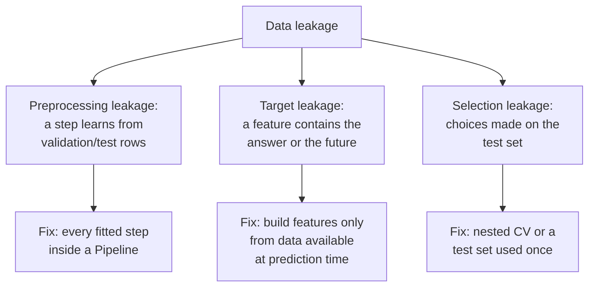
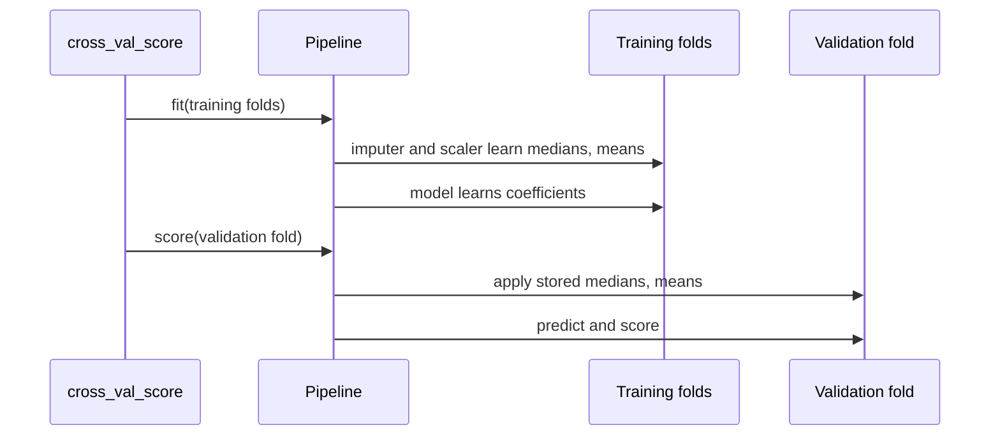
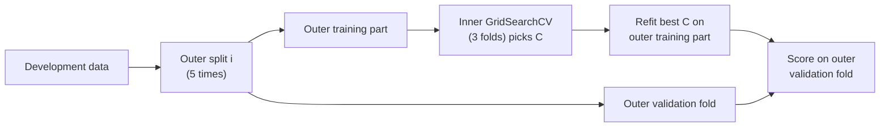

# Data leakage, pipelines, nested cross-validation and the final test

This page covers the third block of Session 7. The tools of the first two blocks give honest estimates only if the validation data stay truly unseen. **Data leakage** breaks this: information from the validation or test rows, or information that will not exist at prediction time, slips into training, and the scores become too good to be true. The page shows the two main forms of leakage, the scikit-learn `Pipeline` as the standard remedy, nested cross-validation for an unbiased estimate after tuning, and the final test on held-out data that closes a project.

The code blocks build on each other; run them in order from the repository root.



## Data leakage: preprocessing outside the cross-validation

**Concept.** Many preparation steps *learn* something from the data: a `StandardScaler` learns means and standard deviations, a `SimpleImputer` learns medians, a feature selector learns which columns are related to the target, a `CountVectorizer` learns a vocabulary. If such a step is fitted on **all** rows before the data are split, the validation folds have influenced the training. The model is then evaluated on rows that were not truly unseen.

How much this matters depends on the step. Scaling with the overall mean instead of the training mean changes little when the data are large. A step that looks at the **target** (feature selection, target encoding, oversampling of rare classes in Session 9) can change the result completely, as the example below shows.

Worked example: 200 rows, 5,000 columns of pure noise, random labels. No model can do better than 50 % accuracy. But among 5,000 random columns, some will by chance be correlated with the labels *in these 200 rows*. If we select the 20 most correlated columns using all rows, and then cross-validate, the model finds those chance correlations again in every validation fold, because the validation rows helped to pick them.

**Why it matters.** Leakage is one of the most common reasons why published or deployed models perform worse than reported. Kapoor and Narayanan (2023) reviewed studies in 17 scientific fields and found leakage in hundreds of papers, often leading to strongly over-optimistic claims.

**How it works in Python.**

```python
import numpy as np
import pandas as pd
from sklearn.feature_extraction.text import CountVectorizer
from sklearn.feature_selection import SelectKBest, chi2, f_classif
from sklearn.linear_model import LogisticRegression
from sklearn.model_selection import StratifiedKFold, cross_val_score
from sklearn.pipeline import make_pipeline

# pure noise: 200 rows, 5,000 random features, random labels -> true accuracy is 0.5
rng = np.random.default_rng(0)
X_noise, y_noise = rng.normal(size=(200, 5000)), rng.integers(0, 2, 200)

# WRONG: pick the 20 features most related to y using ALL rows, then cross-validate
X_sel = SelectKBest(f_classif, k=20).fit_transform(X_noise, y_noise)
print(cross_val_score(LogisticRegression(), X_sel, y_noise, cv=5).mean().round(2))      # 0.8

# RIGHT: the selector is part of the pipeline and is refitted inside every training fold
leak_free = make_pipeline(SelectKBest(f_classif, k=20), LogisticRegression())
print(cross_val_score(leak_free, X_noise, y_noise, cv=5).mean().round(2))               # 0.51

# the same mistake on 1,000 real reviews: word counts, keep the 100 words most related to the label
rev = pd.read_parquet("case-study/data/train_sample.parquet").sort_values("date", ignore_index=True)
small = rev.sample(1000, random_state=0)
text = small["title"].fillna("") + " " + small["text"].fillna("")
skf = StratifiedKFold(5, shuffle=True, random_state=0)
clf = LogisticRegression(max_iter=2000, class_weight="balanced")

counts = CountVectorizer(min_df=2).fit_transform(text)                     # vocabulary from all rows
leaky = SelectKBest(chi2, k=100).fit_transform(counts, small["label"])     # selection uses all labels
print(cross_val_score(clf, leaky, small["label"], cv=skf, scoring="f1_macro").mean().round(3))   # 0.643

pipe = make_pipeline(CountVectorizer(min_df=2), SelectKBest(chi2, k=100), clf)
print(cross_val_score(pipe, text, small["label"], cv=skf, scoring="f1_macro").mean().round(3))   # 0.575
```

On real reviews the leaking workflow overstates macro-F1 by almost seven points. The INRIA workbook [16-data-leakage-feature-selection.ipynb](../workbooks/16-data-leakage-feature-selection.ipynb) walks through the same mistake step by step.

**In practice.**
- Kapoor and Narayanan (2023) traced a series of over-optimistic results in civil-war prediction to leakage, including imputation fitted on the full dataset; after correction, the complex models did not beat a logistic regression.
- The scikit-learn documentation has a page "Common pitfalls and recommended practices" whose first topic is preprocessing outside the cross-validation, with the same feature-selection example.

> [!CAUTION]
> Any step that looks at the target (feature selection by correlation with y, target encoding, resampling such as SMOTE in Session 9) must be fitted inside the cross-validation. Fitted on all rows, it produces scores that cannot be trusted at all.

## Data leakage: target leakage

**Concept.** **Target leakage** means that a feature contains information about the target that will not be available when the model is used. Typical sources:

- a feature *computed from the target*, for example an average rating that includes the rating of the review being predicted;
- a feature *recorded after the event*, for example "reason for cancellation" in a churn table, or "antibiotic prescribed" when predicting an infection;
- an identifier or timestamp that happens to correlate with the label in the collected data.

The model learns the shortcut, cross-validation confirms it (the shortcut is present in every fold), and the model fails in use, where the shortcut is missing.

**Why it matters.** No splitter can detect target leakage: the leak is inside the rows. It can only be found by asking, for every feature, *"would I know this value at the moment of prediction?"* The case study has a real example. The product table contains `train_avg_rating`, the mean star rating of the product over the training period. For a training review, this mean includes the review's own rating. For a test review from 2022, it does not.

**How it works in Python.** Add `train_avg_rating` to the seven simple text features:

```python
from sklearn.model_selection import TimeSeriesSplit
from sklearn.preprocessing import StandardScaler

def simple_features(d):
    t = d["title"].fillna("") + " " + d["text"].fillna("")
    return pd.DataFrame({
        "log_len": np.log1p(t.str.len()), "n_excl": t.str.count("!"), "n_quest": t.str.count(r"\?"),
        "n_neg": t.str.lower().str.count(r"\b(?:not|no|never|don't|didn't|doesn't|waste|return)\b"),
        "verified": d["verified_purchase"].astype(int), "log_helpful": np.log1p(d["helpful_vote"]),
        "n_images": d["n_images"]})

prod = pd.read_parquet("case-study/data/products.parquet", columns=["parent_asin", "train_avg_rating"])
d = rev.merge(prod, on="parent_asin", how="left")
Xs, yr = simple_features(d), d["label"]
l1 = make_pipeline(StandardScaler(), LogisticRegression(max_iter=1000, class_weight="balanced"))

print(cross_val_score(l1, Xs, yr, cv=skf, scoring="f1_macro").mean().round(3))                 # 0.485
X_leak = Xs.assign(avg_rating=d["train_avg_rating"])
print(cross_val_score(l1, X_leak, yr, cv=skf, scoring="f1_macro").mean().round(3))             # 0.524
print(cross_val_score(l1, X_leak, yr, cv=TimeSeriesSplit(5), scoring="f1_macro").mean().round(3))  # 0.522
```

Both random and time-based cross-validation report an improvement of almost four points, because the leak is present in every training review. In a trial run of the leaderboard (see the case-study README), a model with this feature scored 0.55 in time-based CV but only 0.41 on the 2022 test reviews, *worse* than without it. Session 9 builds the leak-free version: the mean rating of *earlier* reviews of the same product.

**In practice.**
- KDD Cup 2008 (breast cancer detection): the patient identifier was predictive of the label because of how the data had been assembled; Kaufman et al. (2012) use it as a textbook case of leakage.
- Hospital data: a feature such as "antibiotic prescribed" or "chest X-ray ordered" can reveal the diagnosis a model is supposed to predict, because it is recorded after the doctor suspected it.
- Churn data: fields like "reason for leaving" or "contract end date" are filled only for customers who have already left.

> [!WARNING]
> A suspiciously large jump in validation score from one new feature is a warning sign, not a success. Check when and how that feature is recorded before you celebrate.

## Preprocessing inside a Pipeline

**Concept.** A scikit-learn **`Pipeline`** chains steps: zero or more transformers (imputer, scaler, encoder, selector, vectoriser) and a final model. Calling `fit` on the pipeline fits each step on the training data and passes the transformed data on; calling `predict` or `score` only *applies* the fitted steps to new data. When a pipeline is passed to `cross_val_score`, `GridSearchCV` or `cross_validate`, the whole pipeline is refitted on the training folds of every split, so the validation fold never influences any step.



**Why it matters.** The pipeline turns "remember to fit the scaler only on the training part" from a rule that people forget into code that cannot get it wrong. It also packages preparation and model into one object that can be saved and deployed (Session 16), so the same steps are applied to new data in production. Session 8 extends it with `ColumnTransformer` for mixed numeric and categorical columns.

**How it works in Python.** Steps are named automatically by `make_pipeline` (lower-case class names), which is how a search addresses their hyperparameters:

```python
from sklearn.impute import SimpleImputer

l1_pipe = make_pipeline(SimpleImputer(strategy="median"), StandardScaler(),
                        LogisticRegression(max_iter=1000, class_weight="balanced"))
print(list(l1_pipe.named_steps))      # ['simpleimputer', 'standardscaler', 'logisticregression']

l1_pipe.fit(Xs.iloc[:40000], yr.iloc[:40000])          # every step learns from these rows only
print(l1_pipe.named_steps["standardscaler"].mean_[:3].round(2))   # [4.84 0.65 0.04]: means of log_len, n_excl, n_quest
print(round(l1_pipe.score(Xs.iloc[40000:], yr.iloc[40000:]), 3))  # 0.658: accuracy on the newest 10,000 reviews
```

> [!TIP]
> If a step needs the target or learns anything from the data, it belongs in the pipeline. If it is a fixed rule that looks at one row at a time (for example `np.log1p` of a count, or the length of a text), it can be applied before splitting.

**In practice.**
- Production machine learning systems serialise the fitted pipeline (for example with `joblib` or `skops`) rather than the model alone, so that the serving code cannot apply different preprocessing; this "training–serving skew" is a known source of failures described in Google's *Rules of Machine Learning* (Zinkevich).
- The INRIA scikit-learn MOOC uses pipelines from its first module onwards for exactly this reason.

> [!WARNING]
> Manual `fit_transform` on the training data and `transform` on the test data is correct for one split, but breaks as soon as you cross-validate or tune: you would have to repeat it by hand for every fold. Use a pipeline.

## Nested cross-validation

**Concept.** After a grid search, `best_score_` is no longer an unbiased estimate: we picked the setting that did best on those very folds. The bias grows with the number of settings tried and shrinks with the size of the data. **Nested cross-validation** separates the two tasks:

- an **inner loop** (a `GridSearchCV` on the training part of each outer split) chooses the hyperparameters;
- an **outer loop** (`cross_val_score` around the search) scores the complete procedure, tuning included, on folds that the search has never seen.

The result estimates how well *the tuning procedure* performs on new data, not one fixed model. With 5 outer and 3 inner folds and 5 settings, the model is fitted 5 × (3 × 5 + 1) = 80 times.



**Why it matters.** When tuning is extensive or the data are small, nested CV gives the number to report. Varma and Simon (2006) showed in simulations on gene-expression data that non-nested estimates after tuning can suggest substantial predictive accuracy where none exists. When data are plentiful, a held-out test set used once (next section) serves the same purpose more cheaply.

**How it works in Python.**

```python
from sklearn.compose import make_column_transformer
from sklearn.model_selection import GridSearchCV
from sklearn.preprocessing import OneHotEncoder

URL = "https://raw.githubusercontent.com/IBM/telco-customer-churn-on-icp4d/master/data/Telco-Customer-Churn.csv"
df = pd.read_csv(URL)
df["TotalCharges"] = pd.to_numeric(df["TotalCharges"], errors="coerce").fillna(0)
y = (df["Churn"] == "Yes").astype(int)
X = df.drop(columns=["customerID", "Churn"])
num = ["tenure", "MonthlyCharges", "TotalCharges", "SeniorCitizen"]
cat = [c for c in X.columns if c not in num]
model = make_pipeline(make_column_transformer((StandardScaler(), num), (OneHotEncoder(handle_unknown="ignore"), cat)),
                      LogisticRegression(max_iter=1000))

inner = StratifiedKFold(3, shuffle=True, random_state=1)
outer = StratifiedKFold(5, shuffle=True, random_state=2)
tuned = GridSearchCV(model, {"logisticregression__C": [0.001, 0.01, 0.1, 1, 10]}, cv=inner, scoring="roc_auc")
nested = cross_val_score(tuned, X, y, cv=outer, scoring="roc_auc")
print(nested.round(3), nested.mean().round(4))     # [0.853 0.83  0.842 0.857 0.844] 0.8452
```

With 7,043 customers and five settings, the nested estimate (0.8452) is almost the same as `best_score_` (0.8454, theory page 02): little optimism to remove. With 200 patients and 500 settings the difference can be large.

**In practice.**
- Small-sample biomedical studies (gene expression, neuroimaging) use nested cross-validation to avoid reporting over-optimistic accuracy after model selection (Varma & Simon, 2006; Cawley & Talbot, 2010).
- Benchmarks of automated machine learning systems evaluate each system's whole tuning procedure on outer folds, because each system tunes internally.

> [!WARNING]
> Nested CV does not give you a final model. Its purpose is the estimate. To obtain the model, run the inner search once on all development data and use `best_estimator_`.

## The final test on held-out data

**Concept.** The last step of every project is a single evaluation of the final, chosen model on data that played no part in any decision: the **held-out test set**. Everything before it (feature choices, model choice, tuning, threshold) uses only the development data and cross-validation. The test score, with a bootstrap interval, is the number you report. When the model will predict the future, the held-out data should be the *latest* period (an **out-of-time** test), as in the leaderboard.

**Why it matters.** The final test protects against all forms of selection on the development data at once, including choices you did not notice you were making. A clear gap between validation and test scores is itself a finding: it points to leakage, drift or an unsuitable validation scheme.

**How it works in Python.** Development data: reviews up to 2020; test: reviews of 2021. Tune `C` with a time-based split on the development data, then evaluate once:

```python
from sklearn.metrics import f1_score

dev, test = d[d["date"] < "2021-01-01"], d[d["date"] >= "2021-01-01"]
X_dev, y_dev = simple_features(dev), dev["label"]
X_test, y_test = simple_features(test), test["label"]
print(len(dev), len(test))                           # 42112 7888

search = GridSearchCV(l1, {"logisticregression__C": [0.01, 0.1, 1, 10]},
                      cv=TimeSeriesSplit(5), scoring="f1_macro")
search.fit(X_dev, y_dev)                              # refits the best C on all development data
print(search.best_params_, round(search.best_score_, 3))   # {'logisticregression__C': 0.01} 0.487

y_pred = search.predict(X_test)                       # the one and only look at the test set
print(round(f1_score(y_test, y_pred, average="macro"), 3))  # 0.488

rng = np.random.default_rng(0)
yt = y_test.to_numpy()
boot = [f1_score(yt[i], y_pred[i], average="macro")
        for i in (rng.integers(0, len(yt), len(yt)) for _ in range(500))]
print(np.percentile(boot, [2.5, 97.5]).round(3))      # [0.476 0.5  ]
```

Validation (0.487) and test (0.488) agree within the interval: the validation scheme imitates the use well. The leaderboard from Session 8 is the course's shared held-out test: you submit predictions, you never see the labels.

**In practice.**
- Regulated industries require independent validation on held-out data before a model is approved; in banking, model risk guidance such as the US Federal Reserve's SR 11-7 asks for outcome analysis and back-testing by a function independent of the developers.
- Clinical prediction models are expected to undergo external validation on patients from other hospitals or later years (TRIPOD guideline), which often reveals a drop in performance.

> [!CAUTION]
> If you evaluate on the test set, change something and evaluate again, the test set has become a validation set. If that happens, say so in your report and, if possible, hold back a fresh test set.

## Check your understanding

1. Why does fitting a `StandardScaler` on all rows usually matter little, while fitting `SelectKBest` on all rows can matter a lot?
2. Give one example of target leakage in a churn table and one in the review data. How would you detect them?
3. What exactly happens to a `Pipeline` in each split of `cross_val_score`?
4. In nested cross-validation, which loop chooses the hyperparameters and which loop produces the number you report?
5. Your time-based validation gives macro-F1 0.55, the leaderboard gives 0.41. List three possible explanations.

## Further reading

- Kapoor, S. & Narayanan, A. (2023). Leakage and the reproducibility crisis in machine-learning-based science. *Patterns*, 4(9), 100804. https://doi.org/10.1016/j.patter.2023.100804
- scikit-learn developers (2025). *Common pitfalls and recommended practices*. https://scikit-learn.org/stable/common_pitfalls.html
- Kaufman, S., Rosset, S., Perlich, C. & Stitelman, O. (2012). Leakage in data mining: formulation, detection, and avoidance. *ACM Transactions on Knowledge Discovery from Data*, 6(4), 15. https://doi.org/10.1145/2382577.2382579
- Cawley, G. C. & Talbot, N. L. C. (2010). On over-fitting in model selection and subsequent selection bias in performance evaluation. *Journal of Machine Learning Research*, 11, 2079–2107. https://jmlr.org/papers/v11/cawley10a.html
