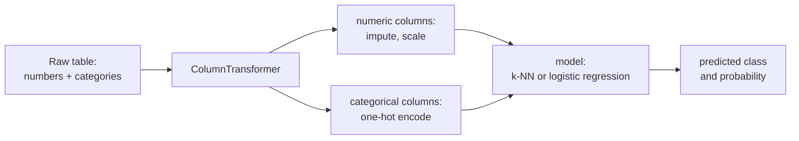
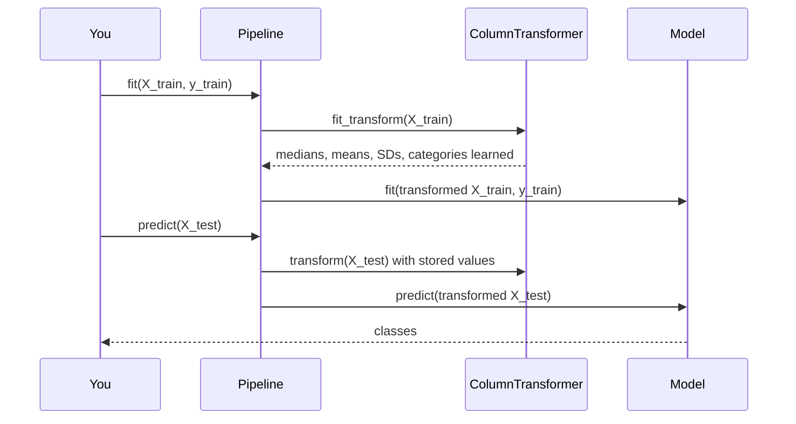
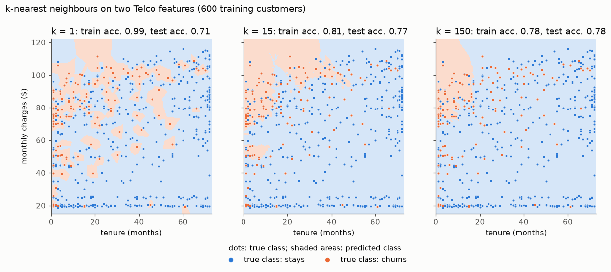

# Classification, preprocessing pipelines and k-nearest neighbours

This page covers the first block of Session 8. In Session 6 you fitted a logistic regression for churn; in Session 7 you learned to validate models honestly. Now we treat classification systematically: what a classification task is and which baselines a model must beat, how to turn a real table with text categories and numbers into model input, how `Pipeline` and `ColumnTransformer` keep that preparation leak-free, and a second classifier, k-nearest neighbours, whose decision boundary makes underfitting and overfitting visible.

The code blocks build on each other; run them in order from the repository root. They use the IBM Telco churn data (7,043 customers, 26.5 % churners), downloaded from IBM's GitHub repository.



## Classification tasks and baselines

**Concept.** A **classification** task predicts a category, the **class**, from features. With two classes (churn yes/no, spam/not spam) it is **binary**; with more (neg/neu/pos sentiment) it is **multiclass**. By convention the class of interest, usually the rarer one, is called the **positive** class and coded 1; here, "churns".

Before any model, define **baselines**: simple predictions that a model must beat to be worth its cost.

- The **majority-class** baseline predicts the most frequent class for everyone. With 26.5 % churners, "nobody churns" is right for 73.5 % of customers. Accuracy below 0.735 is worse than doing nothing.
- A **hand-made rule** encodes domain knowledge, for example "customers on a month-to-month contract in their first year will churn". It is cheap, explainable and often surprisingly strong.

Worked example: of 10 customers, 3 churn. "Nobody churns" is correct for 7 of 10: accuracy 0.7, yet it finds none of the churners. A rule that flags 4 customers, 2 of whom churn, is correct for 2 churners + 5 of the 7 loyal customers = 7 customers as well: accuracy 0.7 again, but it finds 2 of 3 churners. Accuracy alone does not separate the two; theory page 02 introduces metrics that do.

**Why it matters.** Without a baseline a number such as "79 % accuracy" means nothing. In imbalanced problems a model can look good while only predicting the majority class. Baselines also set expectations for the business: how much better than the current rule of thumb is the model?

**How it works in Python.** `DummyClassifier` implements the majority-class baseline with the usual `fit`/`predict`/`score` interface:

```python
import numpy as np
import pandas as pd
from sklearn.dummy import DummyClassifier
from sklearn.metrics import accuracy_score, recall_score
from sklearn.model_selection import train_test_split

URL = "https://raw.githubusercontent.com/IBM/telco-customer-churn-on-icp4d/master/data/Telco-Customer-Churn.csv"
telco = pd.read_csv(URL)
telco["TotalCharges"] = pd.to_numeric(telco["TotalCharges"], errors="coerce")   # 11 blanks -> NaN
y = (telco["Churn"] == "Yes").astype(int)
X = telco.drop(columns=["customerID", "Churn"])
X_train, X_test, y_train, y_test = train_test_split(X, y, test_size=0.25, stratify=y, random_state=0)

dummy = DummyClassifier(strategy="most_frequent").fit(X_train, y_train)
print(round(dummy.score(X_test, y_test), 3))                       # 0.735: "nobody churns"

rule = ((X_test["Contract"] == "Month-to-month") & (X_test["tenure"] < 12)).astype(int)
print(round(accuracy_score(y_test, rule), 3), round(recall_score(y_test, rule), 3))   # 0.756 0.555
```

The rule beats the majority baseline slightly in accuracy and, unlike it, finds 55.5 % of the churners.

**In practice.**
- Telecom and subscription businesses have long used rule-based churn flags (contract type, tenure, complaints) in customer relationship management systems; a churn model is judged against these rules.
- E-mail spam filtering started with hand-written rules (SpamAssassin's scored rule sets) before learned classifiers were added on top; the rules remain a baseline.
- The course leaderboard lists "always positive" (macro-F1 0.26) as its baseline; every submission should beat it.

> [!WARNING]
> On imbalanced data, a high accuracy can mean nothing more than "predicts the majority class". Always report the majority-class baseline next to your model.

## Preparing inputs: one-hot and ordinal encoding, scaling

**Concept.** Most models need numbers. The Telco table has 4 numeric columns and 15 text columns such as `Contract` ("Month-to-month", "One year", "Two year") or `PaymentMethod`.

- **One-hot encoding** turns a column with *m* categories into *m* columns of 0/1, one per category. "One year" becomes (0, 1, 0). It imposes no order and suits **nominal** categories (payment method, internet service).
- **Ordinal encoding** maps the categories to integers 0, 1, 2, … in a given order. It suits **ordinal** categories with a meaningful order (contract length, education level, clothing sizes) and keeps one column. Used on nominal categories, it invents an order and distances that do not exist.
- **Scaling.** Distance-based models (k-NN) and penalised models (ridge, lasso, logistic regression) are sensitive to units: tenure ranges 0–72, total charges 0–8,700. **Standardisation** (`StandardScaler`) subtracts the training mean and divides by the training standard deviation, so every numeric feature has mean 0 and SD 1. Tree-based models (Session 10) do not need scaling.

Worked example of standardisation: tenure values 2, 10, 30 have mean 14 and SD (population) ≈ 11.8; the standardised values are (2 − 14)/11.8 ≈ −1.02, −0.34 and 1.36.

**Why it matters.** Encoding choices change what the model can learn. Unscaled features let the one with the largest numbers dominate a distance. A category that appears only in the test data (a new payment method) crashes a naive encoder; `handle_unknown="ignore"` encodes it as all zeros instead.

**How it works in Python.**

```python
from sklearn.preprocessing import OneHotEncoder, OrdinalEncoder, StandardScaler

oh = OneHotEncoder(sparse_output=False).fit(X_train[["Contract"]])
print(oh.get_feature_names_out())          # ['Contract_Month-to-month' 'Contract_One year' 'Contract_Two year']
print(oh.transform(X_test[["Contract"]].head(3)))
# [[1. 0. 0.]   month-to-month
#  [1. 0. 0.]   month-to-month
#  [0. 0. 1.]]  two year

order = [["Month-to-month", "One year", "Two year"]]
ordinal = OrdinalEncoder(categories=order).fit(X_train[["Contract"]])
print(ordinal.transform(pd.DataFrame({"Contract": ["Two year", "Month-to-month"]})).ravel())   # [2. 0.]

scaler = StandardScaler().fit(X_train[["tenure"]])
print(scaler.mean_.round(1), scaler.scale_.round(1))          # [32.1] [24.5]: training mean and SD of tenure
print(scaler.transform(pd.DataFrame({"tenure": [0, 72]})).ravel().round(2))   # [-1.31  1.63] in SD units
```

The INRIA workbooks [01-categorical-encoding.ipynb](../workbooks/01-categorical-encoding.ipynb) and [02-scaling-in-pipelines.ipynb](../workbooks/02-scaling-in-pipelines.ipynb) treat both steps in depth on the adult census data.

**In practice.**
- Credit scoring: categorical attributes such as employment type or housing status are one-hot encoded (or grouped into bins) before a logistic regression scorecard is fitted.
- Survey and HR analytics: ordinal answers (Likert scales, education levels) are often ordinal-encoded to keep their order.

> [!CAUTION]
> Fit encoders and scalers on the **training data only**. The scaler's mean and SD are learned parameters; fitting them on all rows leaks information from the test set (Session 7). The next section makes this automatic.

> [!TIP]
> A column with thousands of categories (product id, user id) explodes into thousands of one-hot columns. Session 9 shows alternatives such as target encoding, which must be fitted inside the cross-validation.

## Pipeline and ColumnTransformer

**Concept.** A **`ColumnTransformer`** applies different preparation to different columns and concatenates the results: for example, impute and scale the numeric columns, one-hot encode the categorical ones. A **`Pipeline`** puts the model after it. Fitting the pipeline fits every step on the training data only; predicting applies the stored steps to new data. Because the pipeline is a single estimator, `cross_val_score` and `GridSearchCV` refit the whole preparation inside every fold (Session 7, theory page 03).



**Why it matters.** Real tables mix numbers and categories and contain missing values. A pipeline keeps preparation and model together, so that exactly the same steps are applied to training data, test data and, later, new customers in production (Session 16). It prevents leakage by construction and makes the whole workflow tunable: `columntransformer__num__simpleimputer__strategy` is a hyperparameter like any other.

**How it works in Python.**

```python
from sklearn.compose import ColumnTransformer
from sklearn.impute import SimpleImputer
from sklearn.linear_model import LogisticRegression
from sklearn.pipeline import make_pipeline

numeric = ["tenure", "MonthlyCharges", "TotalCharges", "SeniorCitizen"]
categorical = [c for c in X.columns if c not in numeric]        # 15 text columns
pre = ColumnTransformer([
    ("num", make_pipeline(SimpleImputer(strategy="median"), StandardScaler()), numeric),
    ("cat", OneHotEncoder(handle_unknown="ignore"), categorical),
])
logreg = make_pipeline(pre, LogisticRegression(max_iter=1000))
logreg.fit(X_train, y_train)                                    # every step learns from X_train only

print(round(logreg.score(X_test, y_test), 3))                   # 0.792 accuracy
print(logreg[:-1].transform(X_test).shape)                      # (1761, 45): 4 numeric + 41 one-hot columns
print(logreg.predict_proba(X_test)[:3, 1].round(2))             # [0.48 0.12 0.  ]: churn probabilities
```

The INRIA workbook [03-column-transformer.ipynb](../workbooks/03-column-transformer.ipynb) builds the same structure step by step.

**In practice.**
- Customer analytics teams deploy fitted pipelines that score the whole customer base every week; the pipeline guarantees that the scoring data are prepared like the training data.
- Hospitals and research groups share fitted prediction pipelines so that other sites can validate them on their own patients without re-implementing the preparation.

> [!WARNING]
> `TotalCharges` contains 11 blank strings for new customers. `pd.to_numeric(..., errors="coerce")` turns them into `NaN`; without the `SimpleImputer` in the pipeline, logistic regression and k-NN raise an error.

## k-nearest neighbours and the decision boundary

**Concept.** **k-nearest neighbours** (k-NN) classifies a new case by looking at the *k* training cases closest to it (by Euclidean distance on the prepared features) and predicting their majority class. The share of churners among the *k* neighbours is its predicted probability. k-NN learns no coefficients; "fitting" just stores the training data.

The **decision boundary** is the line (or surface) in feature space where the prediction switches from one class to the other. Its shape depends on *k*:

- *k* = 1: every training point is its own neighbour. Training accuracy is close to 100 %, the boundary is jagged and follows every noisy point: **overfitting**.
- very large *k*: the prediction becomes the majority class almost everywhere; the boundary is smooth and misses real structure: **underfitting**.
- in between, the boundary is smooth but still follows the pattern; the validation score is highest.

*k* is a hyperparameter (Session 7): choose it by cross-validation.

Worked example: a new customer with standardised (tenure, monthly charges) = (−1.0, 0.8). Her five nearest training customers churned, stayed, churned, churned, stayed: 3 of 5 churned, so 5-NN predicts "churns" with probability 0.6.



**Why it matters.** k-NN is the simplest model that can draw any boundary, which makes it the clearest illustration of the trade-off between flexibility and stability. It also shows why scaling matters: without it, distances are dominated by `TotalCharges`. Its weaknesses (slow prediction on large data, poor performance with many irrelevant features) explain why other models are usually preferred in production.

**How it works in Python.** The same preprocessing, a different final step:

```python
from sklearn.neighbors import KNeighborsClassifier

for k in [1, 5, 15, 50, 150, 500]:
    knn = make_pipeline(pre, KNeighborsClassifier(n_neighbors=k)).fit(X_train, y_train)
    print(k, round(knn.score(X_train, y_train), 3), round(knn.score(X_test, y_test), 3))
# k    train  test
# 1    0.997  0.726   <- memorises the training data: overfitting
# 5    0.84   0.756
# 15   0.815  0.775
# 50   0.804  0.784   <- best test accuracy, close to logistic regression (0.792)
# 150  0.797  0.778
# 500  0.795  0.776   <- smoother, slowly underfitting
```

In a real project, *k* would be chosen by cross-validation on the training data (`GridSearchCV` with `{"kneighborsclassifier__n_neighbors": [...]}`), not by the test score shown here for illustration. The scikit-learn workbook [04-knn-decision-boundary.ipynb](../workbooks/04-knn-decision-boundary.ipynb) draws boundaries on the iris data; the figure above is made by [figures/make_figures.py](figures/make_figures.py).

**In practice.**
- Recommender systems use neighbour methods: Amazon's item-to-item collaborative filtering (Linden, Smith & York, 2003) recommends products similar to those a customer bought.
- Similarity search over embeddings (Sessions 14 and 15) is a nearest-neighbour search: retrieve the documents closest to a query.
- Anomaly detection (Session 11) often uses the distance to the *k*-th nearest neighbour as an outlier score.

> [!WARNING]
> k-NN has to compare each new case with all stored training cases. With hundreds of thousands of reviews and many features, prediction becomes slow; use it on small tables or with approximate nearest-neighbour indexes.

> [!CAUTION]
> With many one-hot or irrelevant features, all points become roughly equally far apart (the "curse of dimensionality") and k-NN degrades. Select or reduce features first, or prefer logistic regression.

## Practice

In the [Telco case-study workbook](../workbooks/05-case-study-churn-pipelines.ipynb), part A, you build the preprocessing pipeline for the Telco data and compare the churn rule, k-NN (with *k* chosen by cross-validation) and logistic regression with cross-validated scores.

## Check your understanding

1. Why is a classifier with 74 % accuracy on the Telco data not necessarily useful?
2. For each column, choose one-hot or ordinal encoding and justify: `PaymentMethod`, `Contract`, `InternetService`, a satisfaction score from 1 to 5.
3. What does `handle_unknown="ignore"` do, and when do you need it?
4. Explain what happens to the `StandardScaler` inside a pipeline when you call `cross_val_score(pipeline, X, y, cv=5)`.
5. A 1-NN model has a training accuracy of 99.7 %. Why does that not tell you anything about its quality, and how would you choose *k* instead?

## Further reading

- James, G., Witten, D., Hastie, T., Tibshirani, R. & Taylor, J. (2023). *An Introduction to Statistical Learning with Applications in Python*, Sections 2.2 (k-nearest neighbours) and 4.7 (lab). Springer. https://www.statlearning.com/
- INRIA (2024). *scikit-learn MOOC, Module 1: The predictive modeling pipeline* (categorical encoding, ColumnTransformer). https://inria.github.io/scikit-learn-mooc/
- scikit-learn developers (2025). *Pipelines and composite estimators* and *Preprocessing data*. https://scikit-learn.org/stable/modules/compose.html · https://scikit-learn.org/stable/modules/preprocessing.html
