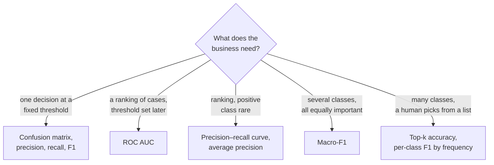
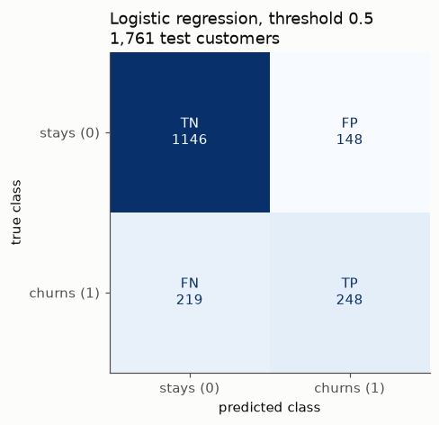
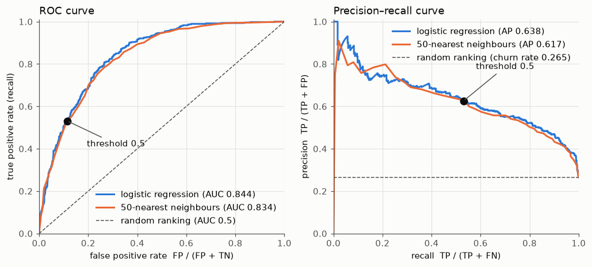

# Evaluation metrics for classification

This page covers the second block of Session 8. Accuracy, the share of correct predictions, hides *which* errors a classifier makes, and on imbalanced data it can reward a model that never finds the cases we care about. The page introduces the confusion matrix and the metrics derived from it (precision, recall, F1, macro-F1 for several classes), the views needed for a task with more than a thousand classes (per-class results, confusions between neighbouring classes, top-k accuracy), and two curves that evaluate a classifier over all possible thresholds: the ROC curve with its AUC and the precision–recall curve.

The code blocks build on each other; run them in order from the repository root. The first block rebuilds the Telco pipelines of theory page 01.



## Confusion matrix and accuracy

**Concept.** A **confusion matrix** counts the four outcomes of a binary prediction. With churn as the positive class:

| | predicted: stays (0) | predicted: churns (1) |
|---|---|---|
| **truly stays (0)** | true negative (TN) | false positive (FP) |
| **truly churns (1)** | false negative (FN) | true positive (TP) |

**Accuracy** = (TP + TN) / (TP + TN + FP + FN) is the share of correct predictions. A **false positive** (type I error) is a loyal customer wrongly flagged; a **false negative** (type II error) is a churner missed.



Worked example from the figure: accuracy = (1,146 + 248) / 1,761 = 0.792. But of the 467 churners, 219 (47 %) are missed.

**Why it matters.** Different errors have different costs. A retention campaign wastes money on false positives and loses customers through false negatives; a cancer screening test must above all avoid false negatives. The confusion matrix shows both errors separately and is the starting point of every other metric on this page.

**How it works in Python.**

```python
import numpy as np
import pandas as pd
from sklearn.compose import ColumnTransformer
from sklearn.impute import SimpleImputer
from sklearn.linear_model import LogisticRegression
from sklearn.metrics import accuracy_score, confusion_matrix
from sklearn.model_selection import train_test_split
from sklearn.neighbors import KNeighborsClassifier
from sklearn.pipeline import make_pipeline
from sklearn.preprocessing import OneHotEncoder, StandardScaler

URL = "https://raw.githubusercontent.com/IBM/telco-customer-churn-on-icp4d/master/data/Telco-Customer-Churn.csv"
telco = pd.read_csv(URL)
telco["TotalCharges"] = pd.to_numeric(telco["TotalCharges"], errors="coerce")
y = (telco["Churn"] == "Yes").astype(int)
X = telco.drop(columns=["customerID", "Churn"])
X_train, X_test, y_train, y_test = train_test_split(X, y, test_size=0.25, stratify=y, random_state=0)
numeric = ["tenure", "MonthlyCharges", "TotalCharges", "SeniorCitizen"]
categorical = [c for c in X.columns if c not in numeric]
pre = ColumnTransformer([
    ("num", make_pipeline(SimpleImputer(strategy="median"), StandardScaler()), numeric),
    ("cat", OneHotEncoder(handle_unknown="ignore"), categorical),
])
logreg = make_pipeline(pre, LogisticRegression(max_iter=1000)).fit(X_train, y_train)
knn = make_pipeline(pre, KNeighborsClassifier(n_neighbors=50)).fit(X_train, y_train)

pred = logreg.predict(X_test)                         # threshold 0.5
print(confusion_matrix(y_test, pred))
# [[1146  148]      rows = truth (stays, churns), columns = prediction
#  [ 219  248]]
tn, fp, fn, tp = confusion_matrix(y_test, pred).ravel()
print(round((tp + tn) / (tp + tn + fp + fn), 3), round(accuracy_score(y_test, pred), 3))   # 0.792 0.792
```

`ConfusionMatrixDisplay.from_estimator(model, X_test, y_test)` draws the matrix; the scikit-learn workbook [07-confusion-matrix.ipynb](../workbooks/07-confusion-matrix.ipynb) shows it with and without normalisation.

**In practice.**
- Medical screening reports the four cells as sensitivity (TP rate) and specificity (TN rate) of a test, for example for mammography or rapid antigen tests.
- Fraud teams at card issuers monitor the false-positive count closely, because every flagged transaction may block a legitimate customer or require an analyst's review.

> [!WARNING]
> scikit-learn puts the **truth in rows** and the **prediction in columns**, with classes in sorted order (0 before 1). Some textbooks and tools use the transposed layout. Always label the axes.

## Precision, recall and F1

**Concept.**

- **Precision** = TP / (TP + FP): of the customers we flag, how many really churn? It measures how much of our effort is well spent.
- **Recall** (sensitivity, true positive rate) = TP / (TP + FN): of the customers who churn, how many do we flag? It measures how many cases we find.
- **F1** = 2 · precision · recall / (precision + recall), the harmonic mean. It is high only if both are high; a model with precision 1.0 and recall 0.01 has F1 ≈ 0.02.

Worked example from the confusion matrix: precision = 248 / (248 + 148) = 0.626; recall = 248 / (248 + 219) = 0.531; F1 = 2 · 0.626 · 0.531 / (0.626 + 0.531) = 0.575.

Precision and recall pull in opposite directions. Flagging more customers (a lower threshold) finds more churners (higher recall) but also flags more loyal ones (lower precision).

**Why it matters.** The two numbers answer two different business questions. A retention team with a limited budget cares about precision (do not waste offers); a regulator or a hospital may care first about recall (do not miss cases). F1 is a compromise when both matter and no costs are known; theory page 03 replaces it with actual costs when they are known.

**How it works in Python.**

```python
from sklearn.metrics import classification_report, f1_score, precision_score, recall_score

for name, m in [("logistic regression", logreg), ("50-NN", knn)]:
    p = m.predict(X_test)
    print(name, [round(f(y_test, p), 3) for f in (precision_score, recall_score, f1_score)])
# logistic regression [0.626, 0.531, 0.575]
# 50-NN               [0.6, 0.552, 0.575]

print(classification_report(y_test, pred, target_names=["stays", "churns"], digits=3))
# per-class precision, recall, F1, support, plus macro and weighted averages
```

The two models have the same F1 but a different balance: k-NN finds slightly more churners at the cost of more false alarms.

**In practice.**
- Information retrieval and web search are evaluated by precision and recall of the returned documents; the Text REtrieval Conference (TREC, run by the US National Institute of Standards and Technology since 1992) established these measures as a standard.
- Content moderation systems report precision (how many removed posts really violated the rules) and recall (how many violating posts were found) separately, because both errors carry public criticism.

> [!CAUTION]
> Precision, recall and F1 depend on which class is called positive. `precision_score` uses `pos_label=1` by default. For string labels such as "Yes"/"No" set `pos_label="Yes"`, or you will get an error or the wrong class.

## Macro-F1 for several classes

**Concept.** With more than two classes, precision, recall and F1 are computed **per class**, treating that class as positive and all others as negative (one-vs-rest). They are then averaged:

- **Macro-F1**: the unweighted mean of the per-class F1 scores. Every class counts equally, however rare.
- **Weighted F1**: weighted by the number of true cases per class; dominated by the large classes.
- **Micro-F1**: pools all decisions; for single-label problems it equals accuracy.

Worked example with ten customs decisions: six of heading 3926 (plastic articles), two of 6403 (leather footwear) and two of 6404 (textile footwear). The model gets all six 3926 right, one of two 6403 and one of two 6404; the two errors are predicted as 3926. Per-class F1: 3926 0.86, 6403 0.67, 6404 0.67. Macro-F1 = (0.86 + 0.67 + 0.67)/3 = 0.73; accuracy = 8/10 = 0.80.

**Why it matters.** The course leaderboard has more than 1,100 headings with a **long tail**: the most frequent heading covers 4 % of the decisions, and about half of the headings in the sample have fewer than ten decisions. Accuracy is dominated by the few hundred frequent headings; macro-F1 gives a heading with 3 decisions the same weight as one with 2,000. Always predicting 3926 gives accuracy 0.04 and macro-F1 close to 0. A model that is good on frequent headings and useless on rare ones can reach high accuracy and a modest macro-F1, which is exactly what the reference models of the leaderboard show (word TF-IDF on the full training set: accuracy 0.872, macro-F1 0.682 on 2024).

**How it works in Python.**

```python
y_true = ["3926"] * 6 + ["6403", "6403", "6404", "6404"]
y_pred = ["3926"] * 6 + ["3926", "6403", "3926", "6404"]
print(f1_score(y_true, y_pred, average=None, labels=["3926", "6403", "6404"]).round(2))   # [0.86 0.67 0.67]
print(round(f1_score(y_true, y_pred, average="macro"), 2))                               # 0.73
print(round(accuracy_score(y_true, y_pred), 2))                                          # 0.8

decisions = pd.read_parquet("case-study/data/train_sample.parquet")
always_3926 = ["3926"] * len(decisions)
print(round(accuracy_score(decisions["heading"], always_3926), 3))                       # 0.04
print(round(f1_score(decisions["heading"], always_3926, average="macro"), 4))           # 0.0001
```

**In practice.**
- Shared tasks in text classification, such as SemEval-2017 Task 4 (Rosenthal et al., 2017), use macro-averaged measures so that rare classes count.
- Automatic coding of occupations, causes of death or economic activities by statistical offices deals with hundreds of codes and a long tail; evaluations report accuracy together with per-class or macro-averaged results.

> [!WARNING]
> `f1_score` on string labels without `average=` raises an error for more than two classes. Always pass `average="macro"` (or the average you intend) and say which one you report. With very many classes macro-F1 also depends on which classes appear at all in the evaluation set; compare macro-F1 values only on the same set.

## Many classes: per-class metrics, neighbouring headings and top-k accuracy

**Concept.** With a thousand classes a single number hides where a model fails. Three views help:

- **Per-class precision and recall**, sorted or grouped by class frequency, show whether errors concentrate in the rare classes.
- A **confusion matrix restricted to a few related classes** shows which classes are mixed up. In the HS nomenclature, neighbouring headings are often very similar: 6403 is footwear with uppers of leather, 6404 footwear with uppers of textile materials, 6402 footwear with uppers of rubber or plastics.
- **Top-k accuracy** counts a prediction as correct if the true class is among the k classes with the highest scores. It measures a model that proposes candidates to a human, which is how a classification tool for customs officers or traders would be used.

**Why it matters.** Errors between 6403 and 6404 are understandable (the material of the upper decides), errors between footwear and plastics are not. Knowing where the errors are tells you what to improve: more data for rare headings, better features for neighbouring ones.

**How it works in Python.** A text classifier (TF-IDF of the description and a linear model with logistic loss; Session 13 explains both, here it is a black box), trained on the decisions of 2017–2021 in the sample and evaluated on 2022–2023. Fitting takes about 15 seconds.

```python
from sklearn.feature_extraction.text import TfidfVectorizer
from sklearn.linear_model import SGDClassifier
from sklearn.metrics import precision_recall_fscore_support

past = decisions["start_date"].dt.year <= 2021
train, valid = decisions[past], decisions[~past]
text_clf = make_pipeline(TfidfVectorizer(min_df=2, sublinear_tf=True),
                         SGDClassifier(loss="log_loss", alpha=1e-6, random_state=0, n_jobs=-1))
text_clf.fit(train["description"], train["heading"])
proba = text_clf.predict_proba(valid["description"])
y_val = valid["heading"].to_numpy()
y_hat = text_clf.classes_[proba.argmax(axis=1)]
print(round(accuracy_score(y_val, y_hat), 3), round(f1_score(y_val, y_hat, average="macro"), 3))   # 0.749 0.492

# per-class F1 grouped by the number of training decisions of the heading
labels = np.unique(y_val)
_, _, f1_per_class, support = precision_recall_fscore_support(y_val, y_hat, labels=labels, zero_division=0)
n_train = train["heading"].value_counts().reindex(labels, fill_value=0)
groups = pd.cut(n_train, [-1, 9, 49, 199, 10**6], labels=["<10", "10-49", "50-199", "200+"])
print(pd.DataFrame({"f1": f1_per_class, "n": support}).groupby(groups.values, observed=True)
      .agg(headings=("f1", "size"), mean_f1=("f1", "mean"), decisions=("n", "sum")).round(2))
#         headings  mean_f1  decisions
# <10          326     0.27        835
# 10-49        257     0.61       2073
# 50-199       123     0.77       4653
# 200+          35     0.78       5638

# footwear: which neighbouring headings are confused?
shoes = ["6402", "6403", "6404", "6405"]
print(pd.crosstab(pd.Series(y_val, name="true"), pd.Series(y_hat, name="predicted")).reindex(
    index=shoes, columns=shoes, fill_value=0))
# predicted  6402  6403  6404  6405
# true
# 6402         45     0     1     0
# 6403          0   113     0     0
# 6404          1     5    91     7
# 6405          0     0     1    70

# top-k accuracy: is the true heading among the k best-scored candidates?
order = np.argsort(-proba, axis=1)
for k in [1, 3, 5]:
    top_k = text_clf.classes_[order[:, :k]]
    print(k, round((top_k == y_val[:, None]).any(axis=1).mean(), 3))
# 1 0.749
# 3 0.824
# 5 0.848
```

Three findings. Headings with fewer than ten training decisions reach a mean F1 of 0.27, against about 0.78 for frequent ones: the long tail is where macro-F1 is lost. Within footwear most errors are understandable: 6404 (textile uppers) is sometimes predicted as 6403 (leather uppers) or 6405 (other footwear), and leather footwear is never mistaken for plastic articles. And if the model may propose three candidates, the true heading is among them for 82 % of the decisions instead of 75 %. `sklearn.metrics.top_k_accuracy_score` computes the same, but only when every validation heading also occurs in training; here about 1 % do not.

**In practice.**
- Search engines and recommender systems are evaluated by top-k measures (precision at k, recall at k), because users look at a short list.
- Tools for automatic coding of free text into classifications (for example of occupations or economic activities at statistical offices) usually propose a few candidate codes for a human coder to confirm.

> [!TIP]
> Group per-class results by class frequency, as above. A list of 1,000 F1 values is unreadable; four groups show at once whether the problem is the tail.

## The ROC curve and AUC

**Concept.** Most classifiers output a score or probability; a **threshold** turns it into a class (by default 0.5). Each threshold gives one pair of

- **true positive rate** (TPR, recall) = TP / (TP + FN), and
- **false positive rate** (FPR) = FP / (FP + TN), the share of loyal customers wrongly flagged.

The **ROC curve** (receiver operating characteristic) plots TPR against FPR for all thresholds, from "flag nobody" (0, 0) to "flag everybody" (1, 1). The **area under the curve** (ROC AUC) summarises the ranking quality in one number. It equals the probability that a randomly chosen churner gets a higher score than a randomly chosen non-churner. 0.5 is random guessing; 1.0 is a perfect ranking. AUC does not depend on any threshold.

Worked example: four customers with scores 0.9 (churns), 0.6 (stays), 0.4 (churns), 0.2 (stays). Of the 2 × 2 = 4 (churner, non-churner) pairs, the churner has the higher score in 3: (0.9 > 0.6), (0.9 > 0.2), (0.4 > 0.2); not in (0.4 < 0.6). AUC = 3/4 = 0.75.



**Why it matters.** AUC compares models independently of the threshold, which is often decided later by the business (theory page 03). It is also insensitive to the class proportions, which makes it comparable across datasets.

**How it works in Python.** ROC and AUC need **scores**, not predicted classes: use `predict_proba(X)[:, 1]` (or `decision_function`).

```python
from sklearn.metrics import roc_auc_score, roc_curve

proba_lr = logreg.predict_proba(X_test)[:, 1]
proba_knn = knn.predict_proba(X_test)[:, 1]
print(round(roc_auc_score(y_test, proba_lr), 3), round(roc_auc_score(y_test, proba_knn), 3))   # 0.844 0.834

fpr, tpr, thresholds = roc_curve(y_test, proba_lr)
i = np.argmin(np.abs(thresholds - 0.5))
print(round(fpr[i], 3), round(tpr[i], 3))     # about 0.114 0.531: the dot on the curve at threshold 0.5

print(roc_auc_score([1, 0, 1, 0], [0.9, 0.6, 0.4, 0.2]))   # 0.75, the worked example
```

`RocCurveDisplay.from_estimator(model, X_test, y_test)` draws the curve. The scikit-learn workbook [08-roc-curve.ipynb](../workbooks/08-roc-curve.ipynb) extends ROC to several classes (one-vs-rest).

**In practice.**
- ROC analysis comes from signal detection for radar in the Second World War and is standard in diagnostic medicine for comparing tests (Hanley & McNeil, 1982).
- Credit scoring reports the Gini coefficient, which is 2 · AUC − 1, as the standard measure of a scorecard's discriminatory power.

> [!CAUTION]
> Passing predicted classes instead of probabilities to `roc_auc_score` gives a single-point "curve" and a misleading AUC. Use `predict_proba(X)[:, 1]`.

> [!WARNING]
> When the positive class is very rare (fraud, 0.1 %), the FPR is computed over a huge number of negatives, so even many false alarms look like a small FPR. The ROC curve can then look excellent while precision is poor. Use the precision–recall curve as well.

## The precision–recall curve

**Concept.** The **precision–recall (PR) curve** plots precision against recall for all thresholds. At high thresholds few customers are flagged, mostly correctly (high precision, low recall); lowering the threshold moves to the right (more recall, lower precision). A random ranking has precision equal to the share of positives (here 0.265) at every recall. **Average precision** (AP) summarises the curve as a weighted mean of the precisions, using the recall increases as weights.

**Why it matters.** The PR curve focuses on the positive class and does not use the true negatives at all. When positives are rare and the business works through a ranked list (call the top 500 customers, review the top 100 transactions), precision at a given recall is the number that matters. The baseline of the PR curve also makes the difficulty of the task visible: an AP of 0.64 with a baseline of 0.265 is a clear gain.

**How it works in Python.**

```python
from sklearn.metrics import average_precision_score, precision_recall_curve

print(round(average_precision_score(y_test, proba_lr), 3), round(average_precision_score(y_test, proba_knn), 3))   # 0.638 0.617
print(round(y_test.mean(), 3))                         # 0.265: AP of a random ranking

precision, recall, thr = precision_recall_curve(y_test, proba_lr)
ok = recall[:-1] >= 0.8                                # thresholds that find at least 80 % of churners
best = np.argmax(np.where(ok, precision[:-1], 0))
print(round(thr[best], 3), round(precision[best], 3), round(recall[best], 3))
# 0.268 0.524 0.807: to find 80 % of churners, almost every second flagged customer is a false alarm
```

`PrecisionRecallDisplay.from_estimator` draws the curve; the scikit-learn workbook [09-precision-recall-curve.ipynb](../workbooks/09-precision-recall-curve.ipynb) covers the multiclass case.

**In practice.**
- Fraud detection and anti-money-laundering systems are evaluated by precision at the alert volume analysts can handle, because the positive class is a fraction of a percent.
- Object detection benchmarks such as PASCAL VOC and COCO rank models by mean average precision (mAP) computed from precision–recall curves.

> [!NOTE]
> Which metric fits? If the business question is "rank customers by risk", report ROC AUC and AP. If it is "who gets an offer this month", report precision and recall at the chosen threshold, ideally with the cost of errors (theory page 03).

## Practice

In the [Telco case-study workbook](../workbooks/05-case-study-churn-pipelines.ipynb), part B, you evaluate the churn models with confusion matrices and ROC curves and explain which metric fits the business question.

## Check your understanding

1. Compute precision, recall and F1 from TP = 50, FP = 30, FN = 20, TN = 900. What is the accuracy, and why is it misleading here?
2. A model has precision 0.9 and recall 0.2. Describe in words what it does. When would that be acceptable?
3. Why does macro-F1 punish a model that never predicts the rare headings, while accuracy hardly notices? Why is top-3 accuracy a sensible metric for a tool that assists customs officers?
4. Explain the meaning of AUC = 0.84 in one sentence without using the word "curve".
5. For a fraud model with 0.1 % positives, why can ROC AUC be 0.98 while precision at 50 % recall is only 0.10?

## Further reading

- Google for Developers (2025). *Machine Learning Crash Course: Classification* (thresholds, confusion matrix, ROC and AUC). https://developers.google.com/machine-learning/crash-course/classification
- Saito, T. & Rehmsmeier, M. (2015). The precision-recall plot is more informative than the ROC plot when evaluating binary classifiers on imbalanced datasets. *PLOS ONE*, 10(3), e0118432. https://doi.org/10.1371/journal.pone.0118432
- scikit-learn developers (2025). *Metrics and scoring: quantifying the quality of predictions*. https://scikit-learn.org/stable/modules/model_evaluation.html
- Amazon Machine Learning University. *MLU-Explain: Precision and Recall; ROC and AUC* (interactive). https://mlu-explain.github.io/
