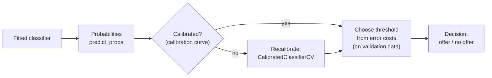
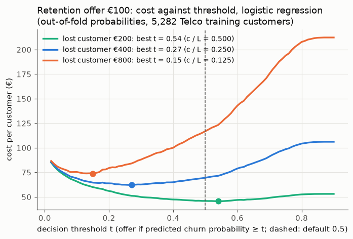
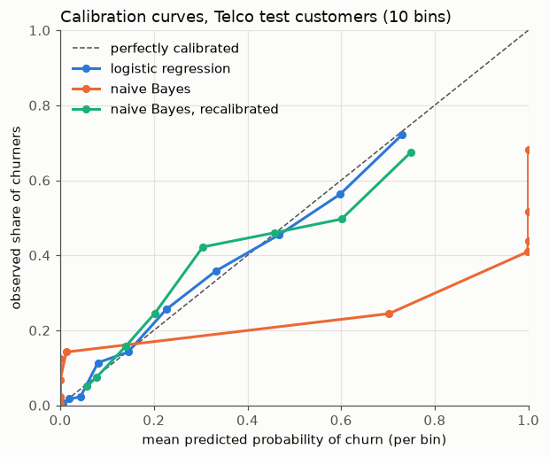

# Decision thresholds and calibration

This page covers the third block of Session 8. The retention team of the telecom company has to decide each month which customers receive a retention offer. The churn model of the first two blocks produces probabilities; the team needs a list of names. This page answers two practical questions: where to draw the line (a **decision threshold** chosen from the costs of the two kinds of error), and whether the probabilities behind the line can be trusted (**calibration**).

The code blocks build on each other; run them in order from the repository root. The first block rebuilds the Telco pipeline of theory page 01.



## Decision thresholds from the costs of errors

**Concept.** `predict` uses a threshold of 0.5: flag a customer if the predicted churn probability is at least 0.5. That choice assumes that a false positive and a false negative cost the same, which is rarely true. Suppose

- every flagged customer receives a retention offer costing **c = €100**, and the offer keeps a churner;
- every churner who is not flagged is lost, costing **L = €400** in future margin.

If a customer has churn probability *p*, flagging costs €100 for sure; not flagging costs €400 with probability *p*, so €400 · *p* on average. Flagging is cheaper when 400 · *p* > 100, that is when **p > c / L = 0.25**. The cost-optimal threshold is 0.25, not 0.5. This simple rule holds only if the probabilities are **calibrated** (next section); in practice we also check it empirically: compute the total cost for a grid of thresholds on **validation** data and take the minimum.



**Why it matters.** The threshold turns a model score into a decision that can be justified to the business. Moving it changes precision and recall along the curves of theory page 02; the costs decide where on the curve to operate. A model with a good AUC but a badly chosen threshold can cost more than a simple rule.

**How it works in Python.** Out-of-fold probabilities from `cross_val_predict` on the training data give an honest validation set for choosing the threshold; the test set is used only to check the choice.

```python
import numpy as np
import pandas as pd
from sklearn.compose import ColumnTransformer
from sklearn.impute import SimpleImputer
from sklearn.linear_model import LogisticRegression
from sklearn.model_selection import StratifiedKFold, cross_val_predict, train_test_split
from sklearn.pipeline import make_pipeline
from sklearn.preprocessing import OneHotEncoder, StandardScaler

URL = "https://raw.githubusercontent.com/IBM/telco-customer-churn-on-icp4d/master/data/Telco-Customer-Churn.csv"
telco = pd.read_csv(URL)
telco["TotalCharges"] = pd.to_numeric(telco["TotalCharges"], errors="coerce")
y = (telco["Churn"] == "Yes").astype(int)
X = telco.drop(columns=["customerID", "Churn"])
X_train, X_test, y_train, y_test = train_test_split(X, y, test_size=0.25, stratify=y, random_state=0)
numeric = ["tenure", "MonthlyCharges", "TotalCharges", "SeniorCitizen"]
categorical = [c for c in X.columns if c not in numeric]
pre = ColumnTransformer([
    ("num", make_pipeline(SimpleImputer(strategy="median"), StandardScaler()), numeric),
    ("cat", OneHotEncoder(handle_unknown="ignore"), categorical),
])
logreg = make_pipeline(pre, LogisticRegression(max_iter=1000))

OFFER, LOST = 100, 400                         # € per offer, € per lost churner

def cost(y_true, proba, t):
    flagged = proba >= t
    return OFFER * flagged.sum() + LOST * (~flagged & (np.asarray(y_true) == 1)).sum()

# choose the threshold on out-of-fold probabilities of the TRAINING data
oof = cross_val_predict(logreg, X_train, y_train, method="predict_proba",
                        cv=StratifiedKFold(5, shuffle=True, random_state=0))[:, 1]
ts = np.round(np.arange(0.05, 0.96, 0.05), 2)
costs = [cost(y_train, oof, t) for t in ts]
t_best = ts[np.argmin(costs)]
print(t_best, min(costs), cost(y_train, oof, 0.5))     # 0.25 329800 367500  (5,282 training customers)

# check once on the test set
proba = logreg.fit(X_train, y_train).predict_proba(X_test)[:, 1]
print(cost(y_test, proba, t_best), cost(y_test, proba, 0.5))   # 109200 127200
print(LOST * y_test.sum(), OFFER * len(y_test))               # 186800 176100: "no offers" and "offers to all"
```

The cost-based threshold saves €18,000 on 1,761 test customers compared with the default 0.5, and €77,600 compared with doing nothing. The empirical optimum (0.25) agrees with the formula *c / L*, a sign that the probabilities are well calibrated.

scikit-learn automates the search with **`TunedThresholdClassifierCV`**, which cross-validates the threshold for any scoring function:

```python
from sklearn.metrics import make_scorer
from sklearn.model_selection import TunedThresholdClassifierCV

def gain(y_true, y_pred):                       # higher is better, so return minus the cost
    y_true = np.asarray(y_true)
    return -(OFFER * (y_pred == 1).sum() + LOST * ((y_true == 1) & (y_pred == 0)).sum())

tuned = TunedThresholdClassifierCV(logreg, scoring=make_scorer(gain), cv=5, random_state=0)
tuned.fit(X_train, y_train)
print(round(tuned.best_threshold_, 3))          # 0.295 (searched on a fine grid, cross-validated)
print(cost(y_test, proba, tuned.best_threshold_))   # 109500, close to the manual choice
```

The scikit-learn workbooks [10-tuned-decision-threshold.ipynb](../workbooks/10-tuned-decision-threshold.ipynb) and [11-cost-sensitive-learning.ipynb](../workbooks/11-cost-sensitive-learning.ipynb) treat the same idea on diabetes and credit data.

**In practice.**
- Banks choose the cut-off of a credit score from the expected loss of a default and the expected profit of a good loan; the cut-off is revised when interest rates or loss rates change.
- Medical screening programmes set the positivity threshold of a test (for example the PSA level for prostate cancer or the faecal immunochemical test cut-off for bowel cancer) by weighing missed cancers against unnecessary follow-up examinations; different countries choose different cut-offs for the same test.

> [!CAUTION]
> Choosing the threshold on the test set is tuning on the test set (Session 7). Use out-of-fold predictions on the training data or a separate validation set, then evaluate once.

> [!TIP]
> Costs are often uncertain. Plot the total cost against the threshold: if the curve is flat around the optimum, the exact choice matters little; if it is steep, the cost assumptions deserve a second look with the business owner.

## Calibration of predicted probabilities

**Concept.** A classifier is **calibrated** if its probabilities mean what they say: among all customers who receive a churn probability of about 0.3, about 30 % actually churn. A **calibration curve** (reliability diagram) groups the test cases into bins by predicted probability and plots the mean predicted probability (x-axis) against the observed share of positives (y-axis). A calibrated model lies on the diagonal.

Two summary numbers:

- the **Brier score**, the mean squared difference between the predicted probability and the outcome (0 or 1); lower is better; always predicting the base rate 0.265 gives 0.265 · 0.735 ≈ 0.195;
- the **log-loss**, which punishes confident wrong predictions very strongly.

Logistic regression is usually well calibrated, because it is fitted by maximising the likelihood of the observed outcomes. Other models are not: **naive Bayes** (a classifier that multiplies per-feature probabilities as if features were independent) pushes probabilities towards 0 and 1, and boosted trees and some neural networks can be over- or under-confident. Models trained with re-weighted classes (Session 9) are systematically miscalibrated. **Recalibration** fits a mapping from the model's scores to calibrated probabilities on held-out data: **Platt scaling** (a logistic curve, `method="sigmoid"`) or **isotonic regression** (a monotone step function, `method="isotonic"`), both in `CalibratedClassifierCV`.



**Why it matters.** The cost rule *p > c / L*, expected-revenue calculations ("expected churners next month = sum of probabilities") and risk communication to customers or patients all assume calibrated probabilities. A model can rank well (high AUC) and still be badly calibrated; AUC does not detect it.

**How it works in Python.**

```python
from sklearn.calibration import CalibratedClassifierCV, calibration_curve
from sklearn.metrics import brier_score_loss, roc_auc_score
from sklearn.naive_bayes import GaussianNB

nb = make_pipeline(pre, GaussianNB()).fit(X_train, y_train)
nb_cal = CalibratedClassifierCV(make_pipeline(pre, GaussianNB()), method="isotonic", cv=5).fit(X_train, y_train)

for name, m in [("logistic regression", logreg), ("naive Bayes", nb), ("naive Bayes, recalibrated", nb_cal)]:
    q = m.predict_proba(X_test)[:, 1]
    frac, mean_p = calibration_curve(y_test, q, n_bins=5, strategy="quantile")
    print(f"{name:26s} Brier {brier_score_loss(y_test, q):.3f}  mean p {q.mean():.3f}")
    print("   predicted", mean_p.round(2), " observed", frac.round(2))
# logistic regression        Brier 0.138  mean p 0.265
#    predicted [0.01 0.06 0.19 0.4  0.66]  observed [0.01 0.07 0.2  0.41 0.64]
# naive Bayes                Brier 0.278  mean p 0.471
#    predicted [0.   0.   0.36 1.   1.  ]  observed [0.07 0.05 0.19 0.42 0.6 ]
# naive Bayes, recalibrated  Brier 0.150  mean p 0.266
#    predicted [0.06 0.08 0.17 0.38 0.68]  observed [0.05 0.08 0.2  0.44 0.59]
```

Naive Bayes predicts "certain churn" (p ≈ 1) for many customers of whom only about half churn; its mean probability (0.47) is far above the true churn rate (0.265). Recalibration repairs this. The scikit-learn workbook [12-calibration-curve.ipynb](../workbooks/12-calibration-curve.ipynb) compares more models.

**In practice.**
- Weather forecasting: the US National Weather Service's probability-of-precipitation forecasts have been studied for calibration since the 1970s (Murphy & Winkler, 1977); "30 % chance of rain" is meant to come true about 30 % of the time.
- Clinical risk scores (for example cardiovascular risk calculators) are checked for calibration in each new population; a score developed in one country often over- or under-predicts risk in another and is recalibrated before use.

> [!WARNING]
> Recalibrate on data the model was not trained on. `CalibratedClassifierCV(cv=5)` does this internally with cross-validation; never fit the calibration mapping on the test set.

**The case study: a model trained with class weights.** Session 9 shows that weighting the rare class (`class_weight="balanced"`) is one way to find more churners. It changes the probabilities, not the ranking:

```python
weighted = make_pipeline(pre, LogisticRegression(max_iter=1000, class_weight="balanced")).fit(X_train, y_train)
weighted_cal = CalibratedClassifierCV(make_pipeline(pre, LogisticRegression(max_iter=1000, class_weight="balanced")),
                                      method="sigmoid", cv=5).fit(X_train, y_train)
t_rule = OFFER / LOST                                  # 0.25, valid only for calibrated probabilities
for name, m in [("logistic regression", logreg), ("class weights", weighted), ("class weights, recalibrated", weighted_cal)]:
    q = m.predict_proba(X_test)[:, 1]
    print(f"{name:28s} AUC {roc_auc_score(y_test, q):.3f}  Brier {brier_score_loss(y_test, q):.3f}  "
          f"expected churners {q.sum():.0f}  cost at c/L {cost(y_test, q, t_rule)}")
# logistic regression          AUC 0.844  Brier 0.138  expected churners 466  cost at c/L 109200
# class weights                AUC 0.844  Brier 0.165  expected churners 725  cost at c/L 116400
# class weights, recalibrated  AUC 0.844  Brier 0.138  expected churners 465  cost at c/L 108700
```

The test set has 467 churners. The weighted model ranks the customers exactly as well (same AUC) but predicts 725 churners, and the rule *p > c / L* applied to its probabilities costs €7,200 more than the same rule on calibrated probabilities. After recalibration the rule works again. A threshold tuned on out-of-fold predictions (`TunedThresholdClassifierCV` above) also compensates, because it looks at the costs, not at the probabilities; it finds 0.52 for the weighted model.

> [!NOTE]
> For three or more classes calibration is checked per class (one-vs-rest) or for the **confidence**, the highest predicted probability of a case: among cases with a confidence of about 0.4, is the prediction right about 40 % of the time? Session 14 uses the confidence of a text classifier to decide which cases it settles on its own and which it passes to a person.

## Practice

In the [threshold and calibration workbook](../workbooks/13-case-study-churn-threshold-and-calibration.ipynb) you choose the churn threshold from the cost of a retention offer against the value of a lost customer, test how sensitive the choice is to the cost assumptions, and check whether the predicted probabilities of several churn models can be trusted.

## Check your understanding

1. A retention offer costs €50 and a lost customer costs €500. Which threshold follows from *p > c / L*? What assumption does this rule make?
2. Why should the cost-optimal threshold be chosen on out-of-fold predictions rather than on the test set?
3. A model has ROC AUC 0.85 and a Brier score of 0.30 (worse than predicting the base rate). How can both be true?
4. What does `CalibratedClassifierCV(method="isotonic", cv=5)` fit, and on which data?
5. A model trained with `class_weight="balanced"` predicts 725 churners among 1,761 customers, of whom 467 churn. Is its ROC AUC necessarily worse than that of the unweighted model? What happens if you apply the rule *p > c / L* to its probabilities?

## Further reading

- scikit-learn developers (2025). *Tuning the decision threshold for class prediction* and *Probability calibration*. https://scikit-learn.org/stable/modules/classification_threshold.html · https://scikit-learn.org/stable/modules/calibration.html
- Van Calster, B., McLernon, D. J., van Smeden, M., Wynants, L. & Steyerberg, E. W. (2019). Calibration: the Achilles heel of predictive analytics. *BMC Medicine*, 17, 230. https://doi.org/10.1186/s12916-019-1466-7
- Elkan, C. (2001). The foundations of cost-sensitive learning. *Proceedings of IJCAI 2001*, 973–978. https://cseweb.ucsd.edu/~elkan/rescale.pdf
