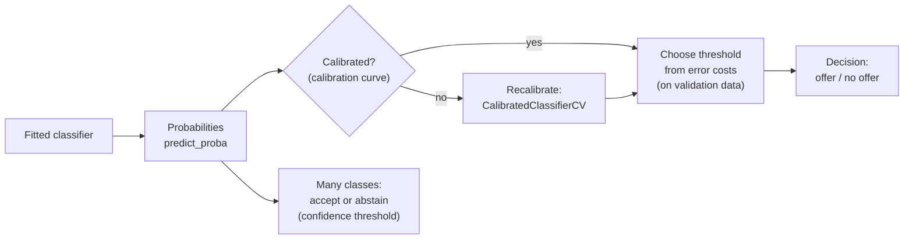
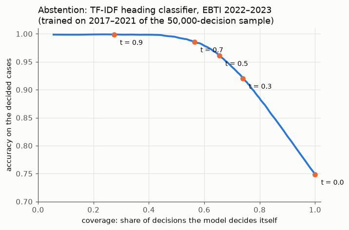

# Decision thresholds, calibration and the first leaderboard submission

This page covers the third block of Session 8. A classifier produces probabilities; a business needs decisions. The page shows how to turn probabilities into decisions with a threshold chosen from the costs of the two kinds of error, how a threshold on the model's confidence lets a classifier with a thousand classes **abstain** and pass uncertain cases to a human, how to check whether the probabilities themselves can be trusted (calibration), and how to make the first submission to the course leaderboard with a logistic regression on the simple description features of Session 2.

The code blocks build on each other; run them in order from the repository root. The first block rebuilds the Telco pipeline of theory page 01.



## Decision thresholds from the costs of errors

**Concept.** `predict` uses a threshold of 0.5: flag a customer if the predicted churn probability is at least 0.5. That choice assumes that a false positive and a false negative cost the same, which is rarely true. Suppose

- every flagged customer receives a retention offer costing **c = €100**, and the offer keeps a churner;
- every churner who is not flagged is lost, costing **L = €400** in future margin.

If a customer has churn probability *p*, flagging costs €100 for sure; not flagging costs €400 with probability *p*, so €400 · *p* on average. Flagging is cheaper when 400 · *p* > 100, that is when **p > c / L = 0.25**. The cost-optimal threshold is 0.25, not 0.5. This simple rule holds only if the probabilities are **calibrated** (next section); in practice we also check it empirically: compute the total cost for a grid of thresholds on **validation** data and take the minimum.

**Why it matters.** The threshold turns a model score into a decision that can be justified to the business. Moving it changes precision and recall along the curves of theory page 02; the costs decide where on the curve to operate. A model with a good AUC but a badly chosen threshold can cost more than a simple rule.

**How it works in Python.** Out-of-fold probabilities from `cross_val_predict` on the training data give an honest validation set for choosing the threshold; the test set is used only to check the choice.

```python
import numpy as np
import pandas as pd
from sklearn.compose import ColumnTransformer
from sklearn.impute import SimpleImputer
from sklearn.linear_model import LogisticRegression
from sklearn.model_selection import StratifiedKFold, cross_val_predict, train_test_split
from sklearn.pipeline import make_pipeline
from sklearn.preprocessing import OneHotEncoder, StandardScaler

URL = "https://raw.githubusercontent.com/IBM/telco-customer-churn-on-icp4d/master/data/Telco-Customer-Churn.csv"
telco = pd.read_csv(URL)
telco["TotalCharges"] = pd.to_numeric(telco["TotalCharges"], errors="coerce")
y = (telco["Churn"] == "Yes").astype(int)
X = telco.drop(columns=["customerID", "Churn"])
X_train, X_test, y_train, y_test = train_test_split(X, y, test_size=0.25, stratify=y, random_state=0)
numeric = ["tenure", "MonthlyCharges", "TotalCharges", "SeniorCitizen"]
categorical = [c for c in X.columns if c not in numeric]
pre = ColumnTransformer([
    ("num", make_pipeline(SimpleImputer(strategy="median"), StandardScaler()), numeric),
    ("cat", OneHotEncoder(handle_unknown="ignore"), categorical),
])
logreg = make_pipeline(pre, LogisticRegression(max_iter=1000))

OFFER, LOST = 100, 400                         # € per offer, € per lost churner

def cost(y_true, proba, t):
    flagged = proba >= t
    return OFFER * flagged.sum() + LOST * (~flagged & (np.asarray(y_true) == 1)).sum()

# choose the threshold on out-of-fold probabilities of the TRAINING data
oof = cross_val_predict(logreg, X_train, y_train, method="predict_proba",
                        cv=StratifiedKFold(5, shuffle=True, random_state=0))[:, 1]
ts = np.round(np.arange(0.05, 0.96, 0.05), 2)
costs = [cost(y_train, oof, t) for t in ts]
t_best = ts[np.argmin(costs)]
print(t_best, min(costs), cost(y_train, oof, 0.5))     # 0.25 329800 367500  (5,282 training customers)

# check once on the test set
proba = logreg.fit(X_train, y_train).predict_proba(X_test)[:, 1]
print(cost(y_test, proba, t_best), cost(y_test, proba, 0.5))   # 109200 127200
print(LOST * y_test.sum(), OFFER * len(y_test))               # 186800 176100: "no offers" and "offers to all"
```

The cost-based threshold saves €18,000 on 1,761 test customers compared with the default 0.5, and €77,600 compared with doing nothing. The empirical optimum (0.25) agrees with the formula *c / L*, a sign that the probabilities are well calibrated.

scikit-learn automates the search with **`TunedThresholdClassifierCV`**, which cross-validates the threshold for any scoring function:

```python
from sklearn.metrics import make_scorer
from sklearn.model_selection import TunedThresholdClassifierCV

def gain(y_true, y_pred):                       # higher is better, so return minus the cost
    y_true = np.asarray(y_true)
    return -(OFFER * (y_pred == 1).sum() + LOST * ((y_true == 1) & (y_pred == 0)).sum())

tuned = TunedThresholdClassifierCV(logreg, scoring=make_scorer(gain), cv=5, random_state=0)
tuned.fit(X_train, y_train)
print(round(tuned.best_threshold_, 3))          # 0.295 (searched on a fine grid, cross-validated)
print(cost(y_test, proba, tuned.best_threshold_))   # 109500, close to the manual choice
```

The scikit-learn workbooks [10-tuned-decision-threshold.ipynb](../workbooks/10-tuned-decision-threshold.ipynb) and [11-cost-sensitive-learning.ipynb](../workbooks/11-cost-sensitive-learning.ipynb) treat the same idea on diabetes and credit data.

**In practice.**
- Banks choose the cut-off of a credit score from the expected loss of a default and the expected profit of a good loan; the cut-off is revised when interest rates or loss rates change.
- Medical screening programmes set the positivity threshold of a test (for example the PSA level for prostate cancer or the faecal immunochemical test cut-off for bowel cancer) by weighing missed cancers against unnecessary follow-up examinations; different countries choose different cut-offs for the same test.

> [!CAUTION]
> Choosing the threshold on the test set is tuning on the test set (Session 7). Use out-of-fold predictions on the training data or a separate validation set, then evaluate once.

> [!TIP]
> Costs are often uncertain. Plot the total cost against the threshold: if the curve is flat around the optimum, the exact choice matters little; if it is steep, the cost assumptions deserve a second look with the business owner.

## Abstention: routing uncertain decisions to a human

**Concept.** With more than two classes there is no single threshold between "yes" and "no". There is, however, a natural decision: **accept** the model's prediction, or **abstain** and pass the case to a person. A simple rule uses the model's **confidence**, the highest predicted probability of a case: accept if it is at least *t*, abstain otherwise. Two numbers describe the result for each *t*:

- **coverage**: the share of cases the model decides on its own;
- **accuracy on the covered cases** (sometimes called selective accuracy).

Raising *t* lowers coverage and, if the confidences are informative, raises accuracy. The **coverage–accuracy curve** shows the whole trade-off, and the costs decide where to operate, as for churn: a wrong classification can lead to wrongly paid duties or a dispute; a case passed to a customs officer costs working time.



**Why it matters.** A model that is right three times out of four is not acceptable for binding decisions, but it can still do useful work: settle the clear cases and leave the hard ones to experts. This is how classification assistants in customs administrations and tariff tools for traders are usually designed. Abstention also makes the errors visible: the cases the model passes on are where it would have been wrong most often.

**How it works in Python.** The text classifier of theory page 02, trained on 2017–2021 and applied to 2022–2023 in the sample (about 15 seconds):

```python
from sklearn.feature_extraction.text import TfidfVectorizer
from sklearn.linear_model import SGDClassifier

decisions = pd.read_parquet("case-study/data/train_sample.parquet")
past = decisions["start_date"].dt.year <= 2021
train_d, valid_d = decisions[past], decisions[~past]
text_clf = make_pipeline(TfidfVectorizer(min_df=2, sublinear_tf=True),
                         SGDClassifier(loss="log_loss", alpha=1e-6, random_state=0, n_jobs=-1))
text_clf.fit(train_d["description"], train_d["heading"])
proba_h = text_clf.predict_proba(valid_d["description"])
pred_h = text_clf.classes_[proba_h.argmax(axis=1)]
confidence = proba_h.max(axis=1)
correct = pred_h == valid_d["heading"].to_numpy()

for t in [0.0, 0.3, 0.5, 0.7, 0.9]:
    accept = confidence >= t
    print(f"t = {t:.1f}  coverage {accept.mean():.3f}  accuracy on accepted {correct[accept].mean():.3f}")
# t = 0.0  coverage 1.000  accuracy on accepted 0.749
# t = 0.3  coverage 0.739  accuracy on accepted 0.920
# t = 0.5  coverage 0.654  accuracy on accepted 0.961
# t = 0.7  coverage 0.565  accuracy on accepted 0.986
# t = 0.9  coverage 0.274  accuracy on accepted 0.999
```

At *t* = 0.5 the model decides about two thirds of the 13,199 decisions with 96 % accuracy and passes one third to a person. As with the churn threshold, *t* must be chosen on validation data and checked once on test data; the leaderboard itself has no abstention (every test decision needs a heading).

**In practice.**
- Document-processing systems (for example invoice or form extraction) route fields with low confidence to manual verification; the threshold is set from the cost of an error and the capacity of the verification team.
- Automatic coding of free-text answers into official classifications (occupations, economic activities) at statistical offices accepts high-confidence codes automatically and sends the rest to human coders.

> [!WARNING]
> Abstention needs confidences that rank the cases well; it does not need them to be calibrated. If you also want to promise an accuracy ("at least 95 % on the accepted cases"), estimate it on validation data, because the confidences of a model are not automatically equal to its accuracy (next section).

## Calibration of predicted probabilities

**Concept.** A classifier is **calibrated** if its probabilities mean what they say: among all customers who receive a churn probability of about 0.3, about 30 % actually churn. A **calibration curve** (reliability diagram) groups the test cases into bins by predicted probability and plots the mean predicted probability (x-axis) against the observed share of positives (y-axis). A calibrated model lies on the diagonal.

Two summary numbers:

- the **Brier score**, the mean squared difference between the predicted probability and the outcome (0 or 1); lower is better; always predicting the base rate 0.265 gives 0.265 · 0.735 ≈ 0.195;
- the **log-loss**, which punishes confident wrong predictions very strongly.

Logistic regression is usually well calibrated, because it is fitted by maximising the likelihood of the observed outcomes. Other models are not: **naive Bayes** (a classifier that multiplies per-feature probabilities as if features were independent) pushes probabilities towards 0 and 1, and boosted trees and some neural networks can be over- or under-confident. Models trained with re-weighted classes (Session 9) are systematically miscalibrated. **Recalibration** fits a mapping from the model's scores to calibrated probabilities on held-out data: **Platt scaling** (a logistic curve, `method="sigmoid"`) or **isotonic regression** (a monotone step function, `method="isotonic"`), both in `CalibratedClassifierCV`.


**Why it matters.** The cost rule *p > c / L*, expected-revenue calculations ("expected churners next month = sum of probabilities") and risk communication to customers or patients all assume calibrated probabilities. A model can rank well (high AUC) and still be badly calibrated; AUC does not detect it.

**How it works in Python.**

```python
from sklearn.calibration import CalibratedClassifierCV, calibration_curve
from sklearn.metrics import brier_score_loss
from sklearn.naive_bayes import GaussianNB

nb = make_pipeline(pre, GaussianNB()).fit(X_train, y_train)
nb_cal = CalibratedClassifierCV(make_pipeline(pre, GaussianNB()), method="isotonic", cv=5).fit(X_train, y_train)

for name, m in [("logistic regression", logreg), ("naive Bayes", nb), ("naive Bayes, recalibrated", nb_cal)]:
    q = m.predict_proba(X_test)[:, 1]
    frac, mean_p = calibration_curve(y_test, q, n_bins=5, strategy="quantile")
    print(f"{name:26s} Brier {brier_score_loss(y_test, q):.3f}  mean p {q.mean():.3f}")
    print("   predicted", mean_p.round(2), " observed", frac.round(2))
# logistic regression        Brier 0.138  mean p 0.265
#    predicted [0.01 0.06 0.19 0.4  0.66]  observed [0.01 0.07 0.2  0.41 0.64]
# naive Bayes                Brier 0.278  mean p 0.471
#    predicted [0.   0.   0.36 1.   1.  ]  observed [0.07 0.05 0.19 0.42 0.6 ]
# naive Bayes, recalibrated  Brier 0.150  mean p 0.266
#    predicted [0.06 0.08 0.17 0.38 0.68]  observed [0.05 0.08 0.2  0.44 0.59]
```

Naive Bayes predicts "certain churn" (p ≈ 1) for many customers of whom only about half churn; its mean probability (0.47) is far above the true churn rate (0.265). Recalibration repairs this. The scikit-learn workbook [12-calibration-curve.ipynb](../workbooks/12-calibration-curve.ipynb) compares more models.

**In practice.**
- Weather forecasting: the US National Weather Service's probability-of-precipitation forecasts have been studied for calibration since the 1970s (Murphy & Winkler, 1977); "30 % chance of rain" is meant to come true about 30 % of the time.
- Clinical risk scores (for example cardiovascular risk calculators) are checked for calibration in each new population; a score developed in one country often over- or under-predicts risk in another and is recalibrated before use.

> [!WARNING]
> Recalibrate on data the model was not trained on. `CalibratedClassifierCV(cv=5)` does this internally with cross-validation; never fit the calibration mapping on the test set.

> [!NOTE]
> For three or more classes calibration is checked per class (one-vs-rest) or for the **confidence**: among cases with a highest probability of about 0.4, is the prediction right about 40 % of the time? The text classifier of the abstention section is **under-confident**: its mean confidence on 2022–2023 is 0.62 while its accuracy is 0.75 (`print(confidence.mean().round(2), correct.mean().round(2))`). Its confidences rank the cases well, which is all abstention needs, but they understate how often it is right.

## The first leaderboard submission (round L1)

**Concept.** The course leaderboard ([case study](../../../case-study/README.md)) asks for the four-digit HS heading of each test decision. Training data are the decisions of 2017–2023; the test set contains the decisions of 2024 (public leaderboard) and 2025–2026 (private leaderboard), with only what a trader's request contains: description, language, issuing country and start date. The metric is **accuracy**, with **macro-F1** reported alongside. Round L1 uses the simplest reasonable model: logistic regression on the simple description features of Session 2 (length in characters and words, number of lines and digits, share of capital letters, whether the description quotes its own code), plus the language and the issuing country.

A submission is a CSV file with the columns `id,heading` (heading as a four-digit string, leading zeros kept) and exactly one row per test decision.

**Why it matters.** The leaderboard is the course's shared held-out test (Session 7): nobody sees the labels, so nobody can tune on them. L1 sets the baseline that every later round (tree-based models in Session 10, TF-IDF in Session 13) must beat, and it trains the workflow: fit on the training data, predict the test file, write a valid submission, record the validation score next to the leaderboard score. The simple features describe the *form* of a description, not its content, so L1 is deliberately weak: it shows why the text itself is needed.

**How it works in Python.** The 50,000-decision sample (a logistic regression with about 1,000 classes on all 309,529 decisions needs several GB of memory). Each fit takes about a minute.

```python
from sklearn.metrics import accuracy_score, f1_score

def upper_share(text):
    letters = [c for c in text if c.isalpha()]
    return sum(c.isupper() for c in letters) / len(letters) if letters else 0.0

def simple_features(d):
    t = d["description"]
    return pd.DataFrame({
        "log_chars": np.log(t.str.len()), "log_words": np.log1p(t.str.split().str.len()),
        "n_lines": t.map(lambda x: sum(1 for line in x.splitlines() if line.strip())),
        "has_code": t.str.contains("<CODE>", regex=False).astype(int),
        "n_digits": t.str.count(r"[0-9]"), "upper_share": t.map(upper_share),
        "language": d["language"], "country": d["issuing_country"]}, index=d.index)

train = pd.read_parquet("case-study/data/train_sample.parquet")
test = pd.read_parquet("case-study/data/test.parquet")
X_tr, y_tr, X_te = simple_features(train), train["heading"], simple_features(test)
numeric = ["log_chars", "log_words", "n_lines", "has_code", "n_digits", "upper_share"]
l1 = make_pipeline(
    ColumnTransformer([("num", StandardScaler(), numeric),
                       ("cat", OneHotEncoder(handle_unknown="infrequent_if_exist", min_frequency=20),
                        ["language", "country"])]),
    LogisticRegression(max_iter=300))

past = (train["start_date"].dt.year <= 2021).to_numpy()          # validate by time: 2022-2023
pred = l1.fit(X_tr[past], y_tr[past]).predict(X_tr[~past])
print(round(accuracy_score(y_tr[~past], pred), 3), round(f1_score(y_tr[~past], pred, average="macro"), 4))
# 0.103 0.0065   (always 3926: 0.040 0.0001)

l1.fit(X_tr, y_tr)
submission = pd.DataFrame({"id": test["id"], "heading": l1.predict(X_te)})
assert len(submission) == len(test) and submission["id"].is_unique
submission.to_csv("submission.csv", index=False)
print(submission["heading"].value_counts(normalize=True).head(3).round(3).to_dict())
# {'3926': 0.213, '9503': 0.122, '2106': 0.117}
```

The model predicts only about a hundred of the most frequent headings, mostly 3926, 9503, 2106 and 6307. Upload `submission.csv` to the course leaderboard and delete the local file afterwards. The lecturer, who holds the hidden labels, scores it from the repository root:

```bash
uv run python case-study/score.py submission.csv
# public_accuracy 0.1109  public_macro_f1 0.0055  (2024)
# private_accuracy 0.1098  private_macro_f1 0.0048  (2025-2026)
```

The validation accuracy on 2022–2023 (0.103) predicted the leaderboard (0.111) well. The reference value in the case-study README (0.076) uses fewer features. Either way, nine of ten decisions are wrong: form and origin of a description do not determine the product. The [leaderboard workbook](../workbooks/13-case-study-leaderboard-l1.ipynb) contains the full workflow with a validation report and exercises.

**In practice.**
- Kaggle and Codabench competitions follow the same protocol: a hidden test set, a fixed submission format, a public leaderboard during the competition and a private one for the final ranking.
- Shared tasks in natural language processing (for example the SemEval series) release unlabelled test data and evaluate submitted predictions centrally, which makes results of different teams comparable.

> [!WARNING]
> Do not use `keywords`, `classification_justification`, `cn_code` or `chapter` in a submission: the test set does not have them, and they are written by customs during or after the classification. In Session 7 a model trained with the justification looked excellent in validation (0.96) and was worse than the honest model on new descriptions.

> [!CAUTION]
> Every leaderboard submission you choose by its public score is a small step of tuning on the test set. Choose models by your own validation score; use the leaderboard to check, not to search.

## Check your understanding

1. A retention offer costs €50 and a lost customer costs €500. Which threshold follows from *p > c / L*? What assumption does this rule make?
2. Why should the cost-optimal threshold be chosen on out-of-fold predictions rather than on the test set?
3. A model has ROC AUC 0.85 and a Brier score of 0.30 (worse than predicting the base rate). How can both be true?
4. What does `CalibratedClassifierCV(method="isotonic", cv=5)` fit, and on which data?
5. Your L1 model scores 0.10 accuracy in time-based validation and 0.11 on the public leaderboard. A teammate's model scores 0.96 in random CV and 0.71 on the leaderboard. What would you check first?
6. A heading classifier decides 65 % of the cases at 96 % accuracy and passes the rest to customs officers. What information do you need to decide whether the threshold is set well?

## Further reading

- scikit-learn developers (2025). *Tuning the decision threshold for class prediction* and *Probability calibration*. https://scikit-learn.org/stable/modules/classification_threshold.html · https://scikit-learn.org/stable/modules/calibration.html
- Van Calster, B., McLernon, D. J., van Smeden, M., Wynants, L. & Steyerberg, E. W. (2019). Calibration: the Achilles heel of predictive analytics. *BMC Medicine*, 17, 230. https://doi.org/10.1186/s12916-019-1466-7
- Elkan, C. (2001). The foundations of cost-sensitive learning. *Proceedings of IJCAI 2001*, 973–978. https://cseweb.ucsd.edu/~elkan/rescale.pdf
- Course case study and leaderboard rules: [case-study/README.md](../../../case-study/README.md)
