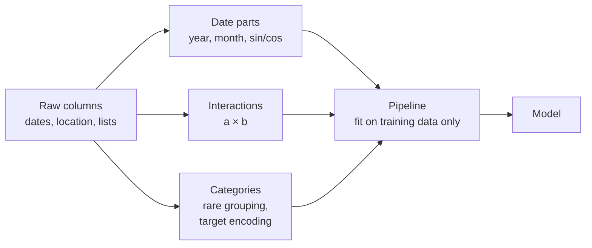
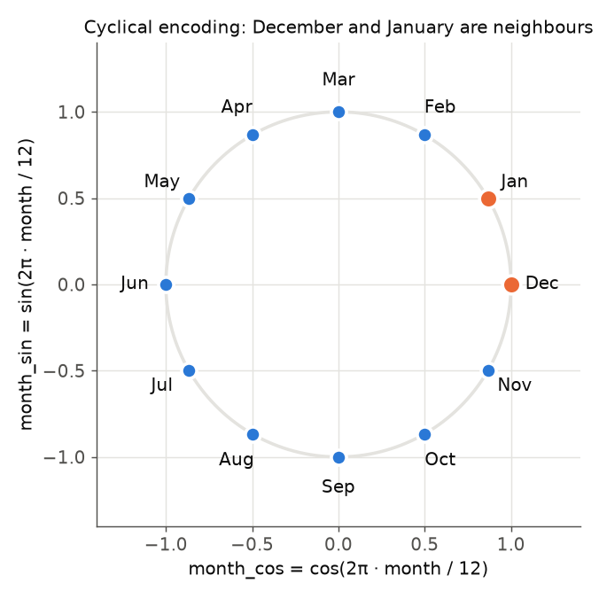
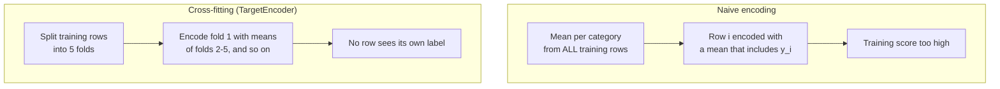
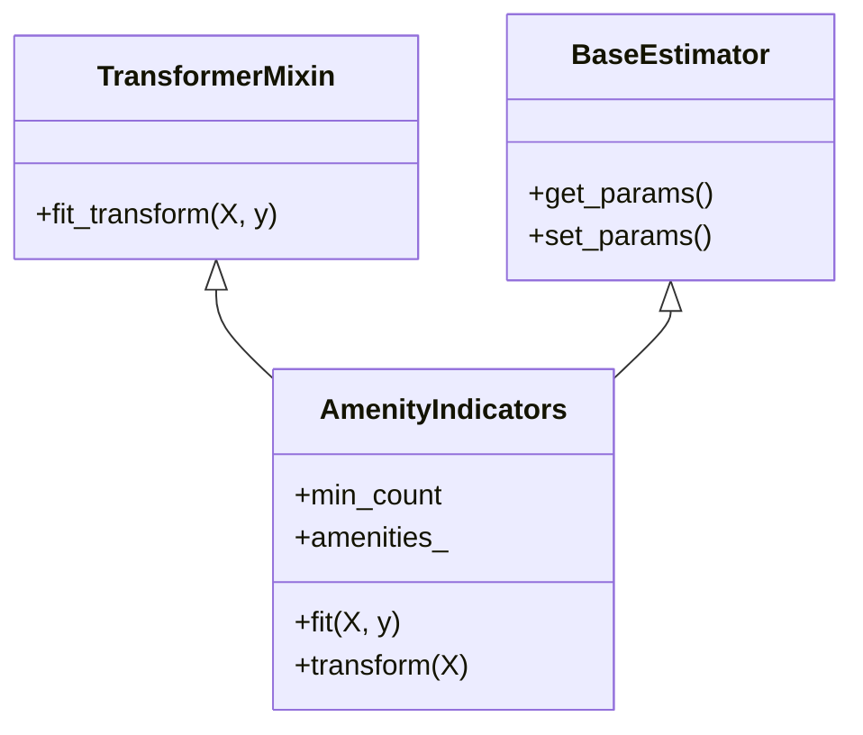

# Features from dates, interactions and categories

A **feature** is one input column of a model. Feature engineering means constructing new input columns from the raw data so that a model can use information it could not see before. This page covers the first block of Session 9: features from dates and times, interactions between features, categories with many levels (rare-category grouping and target encoding) and custom transformers that put all of this into a scikit-learn pipeline. The running question is practical: **what drives the nightly price of a Berlin Airbnb listing, and which constructed features help a price model?** The data are the Inside Airbnb listings for Berlin (snapshot of 26 June 2026), restricted as in Session 7 to 6,675 short-term listings with a price between €10 and €1,000; the target is the log of the price. Session 8 introduced one-hot encoding, scaling and the `ColumnTransformer`; this page builds on them.

> [!NOTE]
> The code blocks on this page build on each other. Run them in order from the repository root, for example in a notebook started with `uv run jupyter lab`. They need `case-study/data/airbnb/` (`uv run python case-study/prepare_airbnb.py`). The data were collected from public listing pages and contain no host names; `host_id` serves only to keep a host's listings together in cross-validation.



## 1. Features from dates and times

### Concept

A timestamp such as `2019-12-24 18:05` is one value, but it carries several kinds of information: the **year** (long-term trend), the **month** and **day of the week** (seasonal patterns), the **hour** (daily rhythm), and the **time elapsed** since some event (how long a host has been on the platform, days since a listing's last review). A model cannot extract these parts on its own; we compute them as separate columns.

Some parts are **cyclical**: month 12 is followed by month 1, and hour 23 by hour 0. If we use the month as a number from 1 to 12, a linear model sees December and January as far apart. A **cyclical encoding** places each value on a circle with two columns:

- `month_sin = sin(2π · month / 12)`
- `month_cos = cos(2π · month / 12)`

Worked example: for January, 2π · 1/12 = 0.52 rad, so sin = 0.50 and cos = 0.87. For December, 2π · 12/12 = 2π, so sin = 0.00 and cos = 1.00. The two points are close on the circle, as they should be. Tree-based models (Session 10) can split a plain month number into ranges and usually do not need the sine and cosine; linear models and k-nearest neighbours do.



### Why it matters

Behaviour follows calendars: sales peak before holidays, call centres have busy Mondays, and city trips to Berlin peak in summer. A raw timestamp, stored as nanoseconds since 1970, mixes all these effects into one large number. Without date features a model either ignores time or picks up the trend in an uncontrolled way.

### How it works in Python

```python
import json

import numpy as np
import pandas as pd

lst = pd.read_parquet("case-study/data/airbnb/listings.parquet")
bnb = lst[(lst["minimum_nights"] < 28) & lst["price"].between(10, 1000)].reset_index(drop=True)
y = np.log(bnb["price"])                                   # target: log of the nightly price in EUR
hosts = bnb["host_id"]

dates = pd.DataFrame({
    "host_years": bnb["hosts_time_as_host_years"],                            # time on the platform
    "listing_age_days": (bnb["last_scraped"] - bnb["first_review"]).dt.days,  # first review: proxy for the start
    "days_since_last_review": (bnb["last_scraped"] - bnb["last_review"]).dt.days,
})
print(dates.median().round(0).to_dict())
# {'host_years': 6.0, 'listing_age_days': 1077.0, 'days_since_last_review': 20.0}
print(dates.corrwith(y, method="spearman").round(3).to_dict())
# {'host_years': -0.027, 'listing_age_days': -0.05, 'days_since_last_review': 0.055}

# demand by calendar month: share of all reviews 2023-2025 written in each month
reviews = pd.read_parquet("case-study/data/airbnb/reviews_monthly.parquet")   # listing_id, month, n_reviews
per_month = reviews.groupby("month")["n_reviews"].sum()
recent = per_month["2023-01-01":"2025-12-01"]
share = recent.groupby(recent.index.month).sum() / recent.sum()
print(share.round(3).to_dict())
# {1: 0.053, 2: 0.058, 3: 0.069, 4: 0.081, 5: 0.092, 6: 0.101, 7: 0.102, 8: 0.093, 9: 0.103, 10: 0.098, 11: 0.076, 12: 0.072}
cyc = pd.DataFrame({"month": share.index})
cyc["month_sin"] = np.sin(2 * np.pi * cyc["month"] / 12)     # cyclical encoding
cyc["month_cos"] = np.cos(2 * np.pi * cyc["month"] / 12)
print(cyc.round(2).iloc[[0, 6, 11]].to_string(index=False))
#  month  month_sin  month_cos
#      1        0.5       0.87
#      7       -0.5      -0.87
#     12       -0.0       1.00
```

An honest first result: the elapsed-time features say almost nothing about the price. Rank correlations with the log price are between −0.05 and +0.06; a host who has been on Airbnb for ten years does not charge more than a newcomer. Dates matter for a different question: **demand**. Reviews, a proxy for stays, follow the calendar: January has 5.3 % of the year's reviews, June, July and September about 10 % each. A model of bookings or reviews per month needs the month, and a linear model needs it in the cyclical form, so that December (0.0, 1.00) and January (0.5, 0.87) are neighbours. Checking such simple group summaries before adding a feature is good practice. Page 2 builds demand features from the review history.

scikit-learn offers the same idea inside a pipeline: a `FunctionTransformer` (Section 5) can compute the sine and cosine, and `SplineTransformer(extrapolation="periodic")` builds smooth periodic features. The workbook [01-time-related-feature-engineering.ipynb](../workbooks/01-time-related-feature-engineering.ipynb) compares these encodings on a bike-sharing demand dataset.

### In practice

- In the Kaggle *Rossmann Store Sales* competition (2015), forecasts of daily sales for about 1,100 German drugstores relied on calendar features such as day of week, month, holidays and the days until and since promotions.
- The M5 forecasting competition on Walmart sales (Makridakis et al., 2022) provided calendar data with events and the days on which food-stamp (SNAP) payments are made, because these dates shift demand.
- The scikit-learn example on bike-sharing demand in Washington, D.C. shows that hour-of-day features with a periodic encoding reduce the error of a linear model considerably.

> [!WARNING]
> **Only dates known at prediction time.** A price suggestion for a new listing cannot use `first_review` or `last_review`: a new listing has no reviews yet. The features above are fine for describing existing listings, but a model meant for new hosts must leave them out (or set them to "no review yet"). For timestamps with a time of day, also convert to local time (`dt.tz_convert(...)`) before building hour features about human behaviour.

> [!CAUTION]
> A `year` feature lets a model learn a trend, but tree-based models cannot extrapolate it: for a future year they predict like for the last year they saw. Berlin's monthly reviews grew from 4,865 in July 2019 to 13,132 in July 2025; a forest trained up to 2025 would forecast 2026 at the 2025 level. That is often acceptable, but be aware of it when the target drifts (Session 16).

## 2. Interactions between features

### Concept

An **interaction** exists when the effect of one feature depends on the value of another. A model with only additive terms, such as a linear or logistic regression, assumes that each feature adds its own effect regardless of the others. We can give it an interaction by adding the **product** of two features as a new column.

Worked example: a shop records whether a customer is a member and whether a discount was shown. The purchase rates are:

| | no discount | discount |
|---|---|---|
| not a member | 0.17 | 0.19 |
| member | 0.20 | 0.72 |

The discount barely helps non-members (+0.02) but helps members a lot (+0.52). An additive model can only fit one "discount effect" for everybody. With the extra column `member × discount`, which is 1 only in the lower-right cell, the model can fit all four cells.

### Why it matters

Linear models are popular because they are fast and interpretable, but they miss interactions unless we add them. Tree-based models find interactions automatically, because a split on one feature followed by a split on another is an interaction. Adding the right interactions can bring a linear model close to a tree model, while keeping it explainable.

### How it works in Python

```python
from sklearn.linear_model import LinearRegression, LogisticRegression
from sklearn.pipeline import make_pipeline
from sklearn.preprocessing import PolynomialFeatures

rng = np.random.default_rng(0)
n = 2000
toy = pd.DataFrame({"member": rng.integers(0, 2, n), "discount": rng.integers(0, 2, n)})
# true purchase probability: 0.7 for members with a discount, 0.2 for everybody else
toy["buy"] = rng.binomial(1, np.where((toy.member == 1) & (toy.discount == 1), 0.7, 0.2))

cells = pd.DataFrame({"member": [0, 0, 1, 1], "discount": [0, 1, 0, 1]})
plain = LogisticRegression().fit(toy[["member", "discount"]], toy["buy"])
inter = make_pipeline(PolynomialFeatures(degree=2, interaction_only=True, include_bias=False),
                      LogisticRegression()).fit(toy[["member", "discount"]], toy["buy"])
cells["observed"] = toy.groupby(["member", "discount"])["buy"].mean().to_numpy()
cells["plain"] = plain.predict_proba(cells[["member", "discount"]])[:, 1]
cells["interaction"] = inter.predict_proba(cells[["member", "discount"]])[:, 1]
print(cells.round(2).to_string(index=False))
#  member  discount  observed  plain  interaction
#       0         0      0.17   0.09         0.17
#       0         1      0.19   0.29         0.20
#       1         0      0.20   0.28         0.20
#       1         1      0.72   0.63         0.71
print(inter[0].get_feature_names_out())   # ['member' 'discount' 'member discount']
```

The additive model is wrong in every cell: it underestimates the members with a discount and overestimates the others. With the product column the predictions match the observed rates.

On the Berlin listings, a natural candidate is **room type × size**: an extra guest place should be worth more in an entire flat (another bedroom) than in a private room (another bed in the same room). On the log scale the size enters as log(guests), so its coefficient is an elasticity: the percentage change in price for a one-percent increase in guests.

```python
from sklearn.model_selection import GroupKFold, cross_val_score

bnb["dist_km"] = np.hypot((bnb["latitude"] - 52.5219) * 111.2, (bnb["longitude"] - 13.4132) * 68.0)
base = pd.get_dummies(bnb["room_type"], dtype=int).drop(columns="Private room")    # private room = reference
base["log_guests"] = np.log(bnb["accommodates"])
base["dist_km"] = bnb["dist_km"]
with_inter = base.assign(log_guests_x_entire=base["log_guests"] * base["Entire home/apt"])
cv = GroupKFold(5)                                        # whole hosts per fold (Session 7)
for name, Xi in [("additive", base), ("+ interaction", with_inter)]:
    print(name, cross_val_score(LinearRegression(), Xi, y, cv=cv, groups=hosts, scoring="r2").mean().round(3))
# additive 0.496
# + interaction 0.498
print(dict(zip(with_inter.columns, LinearRegression().fit(with_inter, y).coef_.round(3))))
# {'Entire home/apt': 0.213, 'Hotel room': 0.473, 'Shared room': -0.891, 'log_guests': 0.401,
#  'dist_km': -0.023, 'log_guests_x_entire': 0.127}
```

The interaction exists: the guest elasticity is 0.40 for private rooms and 0.40 + 0.13 = 0.53 for entire flats, so doubling the guests raises the predicted price by 2^0.40 − 1 ≈ 32 % for a room and by 2^0.53 − 1 ≈ 44 % for a flat. But the cross-validated R² rises only from 0.496 to 0.498. The log scale already absorbs much of it: an effect that is multiplicative in euros is additive in log euros. On the euro scale the same interaction is worth more (R² 0.376 → 0.388 in our runs). Domain knowledge suggests which products are worth trying; `PolynomialFeatures(interaction_only=True)` creates all pairwise products, which grows quickly (p features give p·(p−1)/2 products).

### In practice

- Google's *Wide & Deep* model for app recommendations in Google Play (Cheng et al., 2016) combined a linear model on hand-made cross-product features, such as "installed app × shown app", with a neural network.
- Factorization machines (Rendle, 2010) were designed to estimate pairwise interactions in very sparse data such as click logs, and became a standard method for click-through-rate prediction.

> [!WARNING]
> **Too many interactions.** With 50 features, all pairwise products give 1,225 new columns, most of them noise. The model then overfits (Session 6). Add interactions that you can justify, or use a model that finds them itself (Session 10). Scale the features before multiplying them, or the products have very different ranges.

## 3. High-cardinality categories: grouping rare categories

### Concept

The **cardinality** of a categorical feature is its number of distinct values. `room_type` has 4 values and `district` (Bezirk) 12: manageable. `neighbourhood` has 135 values in the price table and `property_type` 59 ("Entire rental unit", "Private room in condo", "Campsite", ...). Many levels are rare: 67 neighbourhoods and 35 property types have fewer than 20 listings, and 12 property types occur only once. One-hot encoding (Session 8) would create one column per level, many of them almost empty. Retail data with product or store identifiers, or postcodes, have thousands of levels; the problem is the same, only larger.

**Grouping rare categories** replaces every category that appears fewer than *k* times in the training data by one shared level, often called `"infrequent"` or `"other"`. The frequent categories keep their own column. Categories that appear only in new data are mapped to the same shared level.

### Why it matters

A column with a single 1 among 6,675 rows cannot teach a model anything reliable, but it costs memory and invites overfitting: the model fits that one listing's price exactly. Grouping keeps the information of the frequent categories, gives the model a stable estimate for "rare property type", and handles unseen categories at prediction time without errors. Frequency itself can be a feature: how common a property type is says something about the listing.

### How it works in Python

```python
from sklearn.preprocessing import OneHotEncoder

for col in ["neighbourhood", "property_type"]:
    counts = bnb[col].value_counts()
    print(col, bnb[col].nunique(), (counts < 20).sum(), (counts == 1).sum())
# neighbourhood 135 67 3      levels, levels with fewer than 20 listings, levels seen once
# property_type 59 35 12

for k in [None, 20, 100]:
    enc = OneHotEncoder(min_frequency=k, handle_unknown="infrequent_if_exist")
    print(k, [enc.fit(bnb[[c]]).transform(bnb[[c]]).shape[1] for c in ["neighbourhood", "property_type"]])
# None [135, 59]   one column per level
# 20 [69, 25]      levels with fewer than 20 listings share one column
# 100 [22, 10]
```

`min_frequency` sets the threshold *k* (an integer count, or a fraction of rows); `max_categories` keeps only the most frequent levels. With `handle_unknown="infrequent_if_exist"` a property type that appears for the first time in new data is encoded like a rare one. A **count encoding** (`bnb["property_type"].map(counts)`) adds the frequency as one numeric feature; it must also be computed on the training data only.

### In practice

- Retail and e-commerce data have product, brand and seller identifiers with thousands of levels; grouping the long tail is a routine step before modelling.
- In German official statistics, the Federal Statistical Office (Destatis) publishes many tables only with grouped categories so that rare groups do not reveal individuals; the statistical reason (too few observations per cell) is the same.

> [!WARNING]
> The threshold is a hyperparameter. Choose it with cross-validation (Session 7), not by looking at the test data. And compute the counts inside the pipeline: an encoder that was fitted on all data has already seen the test rows.

## 4. Target encoding and its leakage risk

### Concept

**Target encoding** (also called mean encoding) replaces each category by the mean of the target in the training rows of that category. For the log price, the neighbourhood Alexanderplatz with 557 listings and a mean log price of 5.24 gets the value 5.24 (about €188 a night). One numeric column replaces 135 dummy columns, and it orders the neighbourhoods by price.

For a **multiclass** target, target encoding creates one column per class: the share of each class among the rows of the category. With the 1,114 EBTI headings that would be 1,114 columns per encoded feature, as many as the one-hot encoding we wanted to avoid; one then encodes against a coarser target. For a numeric target such as the price, one column suffices.

Two problems arise.

1. **Small categories give noisy means.** A neighbourhood with a single listing at €42 a night (log price 3.75) gets 3.75, although one listing says little about the area. **Smoothing** shrinks the mean of a small category towards the overall mean ȳ:

   encoding = (n · ȳ_category + m · ȳ) / (n + m)

   With the overall mean log price ȳ = 5.06 (about €158) and *m* = 10: the one-listing neighbourhood gets (1 · 3.75 + 10 · 5.06)/11 = 4.94 (about €140); Alexanderplatz gets (557 · 5.24 + 10 · 5.06)/567 = 5.23, almost unchanged. The small category moves most towards the average.

2. **Target leakage.** **Leakage** means that information that will not be available at prediction time enters the training data. If a row's own target is part of the mean that encodes it, the feature partly *is* the target. For a category with one row, the encoding equals the target exactly. A model learns to trust the feature, and its training score is far too optimistic.

The remedy is **cross-fitting**: split the training data into *k* folds; encode the rows of each fold with means computed from the other *k*−1 folds only. No row ever sees its own label. scikit-learn's `TargetEncoder` does this automatically in `fit_transform` (5 folds by default) and uses smoothing (`smooth="auto"`, an empirical Bayes estimate of *m*). For new data, `transform` uses means from the whole training set.



### Why it matters

Target encoding is often the best way to use a high-cardinality category in linear and tree models; benchmarks such as Pargent et al. (2022) found regularised target encoding among the most reliable encoders. But the naive version is one of the most common sources of leakage in practice, and the damage is invisible on the training data.

### How it works in Python

The host identifier makes the leak visible. Many hosts have several listings with similar prices, so a naive encoding of `host_id` looks like an excellent feature. We hold out 30 % of the **hosts** (Session 7), so the test rows imitate new hosts, and compare the naive encoding with `TargetEncoder`:

```python
from sklearn.model_selection import GroupShuffleSplit, KFold
from sklearn.preprocessing import TargetEncoder

tr, te = next(GroupShuffleSplit(1, test_size=0.3, random_state=0).split(bnb, groups=hosts))   # te: new hosts
r2 = lambda target, feature: round(np.corrcoef(target, feature)[0, 1] ** 2, 3)   # R² of a fit on this column

for col in ["host_id", "neighbourhood"]:
    naive = y.iloc[tr].groupby(bnb[col].iloc[tr]).mean()              # mean log price per category, own row included
    f_tr = bnb[col].iloc[tr].map(naive)
    f_te = bnb[col].iloc[te].map(naive).fillna(y.iloc[tr].mean())     # unseen categories: overall mean
    enc = TargetEncoder(target_type="continuous", cv=KFold(5, shuffle=True, random_state=0))
    e_tr = enc.fit_transform(bnb[[col]].iloc[tr], y.iloc[tr]).ravel() # cross-fitted on the training rows
    e_te = enc.transform(bnb[[col]].iloc[te]).ravel()
    print(col, "naive:", r2(y.iloc[tr], f_tr), r2(y.iloc[te], f_te),
          "| cross-fitted:", r2(y.iloc[tr], e_tr), r2(y.iloc[te], e_te))
# host_id naive: 0.823 0.0 | cross-fitted: 0.317 0.0
# neighbourhood naive: 0.128 0.043 | cross-fitted: 0.075 0.045
```

Read the numbers as "R² on training rows, R² on new hosts". The naive encoding of `host_id` explains 82 % of the variance of the log price on the training rows and nothing on new hosts: for them every value is the overall mean. Most of the 82 % is the leak (hosts with one listing are encoded with their own price); the cross-fitted training R² of 0.32 is the part that is real for *known* hosts, whose other listings sit in other folds. A price tool for hosts already on the platform could use it; a tool for new hosts cannot. For `neighbourhood` the naive training R² (0.128) promises three times what the feature delivers on new hosts (0.043); the cross-fitted value (0.075) is closer, but still too high. The reason is the subject of Session 7: `TargetEncoder` cross-fits with random folds, so listings of the same host, often in the same neighbourhood, end up on both sides. Location matters for price, but distance to the centre and the district already carry most of it (Section 5).

The workbooks [03-target-encoder.ipynb](../workbooks/03-target-encoder.ipynb) and [04-target-encoder-cross-fitting.ipynb](../workbooks/04-target-encoder-cross-fitting.ipynb) show both points on a wine-review dataset.

### In practice

- Micci-Barreca (2001) proposed smoothed target statistics for high-cardinality attributes such as ZIP codes and IP addresses in fraud-detection models.
- CatBoost, the gradient boosting library from Yandex (Session 10), encodes categories with *ordered target statistics*: each row is encoded only with the labels of rows that come before it in a random order, a variant of the same idea (Prokhorenkova et al., 2018).

> [!CAUTION]
> `TargetEncoder.fit(X, y).transform(X)` is **not** the same as `fit_transform(X, y)`. The first encodes the training rows with means that include their own labels (the naive leak); only `fit_transform` cross-fits. Inside a `Pipeline`, scikit-learn calls `fit_transform` during training and `transform` during prediction, which is correct.

> [!WARNING]
> Cross-fitting protects against the row's own target, not against **groups** or the **future**: a host's other listings, or a renewed EBTI decision with the same description, can sit in another fold and carry almost the same target. Validate with groups or by time (Session 7), and for anything with a timestamp, aggregate with past data only (page 2).

## 5. Custom transformers in scikit-learn pipelines

### Concept

A **transformer** in scikit-learn is an object with two methods: `fit(X, y)` learns what it needs from the training data, and `transform(X)` applies it to any data. `StandardScaler` learns means and standard deviations; `OneHotEncoder` learns the list of categories. When no built-in transformer does what we need, we write our own in one of two ways:

- `FunctionTransformer(func)` wraps a function that needs nothing from the training data, such as "compute the distance to the city centre from latitude and longitude" or "take the sine of the month". Its `fit` does nothing.
- A small class that inherits from `BaseEstimator` and `TransformerMixin` is needed when something must be learned in `fit`, such as the list of amenities that are frequent enough to get their own column.

Put inside a `Pipeline` or `ColumnTransformer`, both are fitted on the training folds only, exactly like the built-in ones.



### Why it matters

Feature code written outside the pipeline, for example in a notebook cell that modifies the whole data frame, is easily applied to training and test data together, and is easily forgotten when the model is deployed. Inside the pipeline the same code runs during cross-validation, on the test set and in production (Session 16), and it is saved together with the model.

### How it works in Python

The amenities of a listing are stored as one text, a list such as `["Wifi", "Kitchen", "Dishwasher", ...]`; the 6,675 listings of the price table use 2,153 different amenity names. The class below learns in `fit` which amenities at least `min_count` training listings have and turns each into a 0/1 column. The distance to Alexanderplatz needs nothing from the training data, so a `FunctionTransformer` suffices.

```python
from sklearn.base import BaseEstimator, TransformerMixin
from sklearn.compose import ColumnTransformer
from sklearn.ensemble import HistGradientBoostingRegressor
from sklearn.pipeline import make_pipeline
from sklearn.preprocessing import FunctionTransformer


def km_to_centre(X):
    """Distance in km from (latitude, longitude) to Alexanderplatz; uses each row only."""
    return pd.DataFrame({"dist_km": np.hypot((X["latitude"] - 52.5219) * 111.2,
                                             (X["longitude"] - 13.4132) * 68.0)}, index=X.index)


class AmenityIndicators(BaseEstimator, TransformerMixin):
    """One 0/1 column per amenity listed by at least min_count training listings."""

    def __init__(self, min_count=50):
        self.min_count = min_count

    def fit(self, X, y=None):
        counts = X.iloc[:, 0].map(json.loads).explode().value_counts()
        self.amenities_ = sorted(counts[counts >= self.min_count].index)    # learned from training rows only
        return self

    def transform(self, X):
        lists = X.iloc[:, 0].map(lambda s: set(json.loads(s)))
        return pd.DataFrame({f"am_{a}": lists.map(lambda x, a=a: a in x).astype(int) for a in self.amenities_},
                            index=X.index)

    def get_feature_names_out(self, input_features=None):
        return np.array([f"am_{a}" for a in self.amenities_], dtype=object)


features = ColumnTransformer([
    ("dist", FunctionTransformer(km_to_centre, feature_names_out=lambda tf, names: ["dist_km"]),
     ["latitude", "longitude"]),
    ("amen", AmenityIndicators(min_count=50), ["amenities"]),
    ("nbhd", TargetEncoder(target_type="continuous", cv=KFold(5, shuffle=True, random_state=0)), ["neighbourhood"]),
    ("cat", OneHotEncoder(handle_unknown="ignore", sparse_output=False), ["room_type", "district"]),
    ("num", "passthrough", ["accommodates", "bedrooms", "beds", "bathrooms", "number_of_reviews",
                            "review_scores_rating"]),
], verbose_feature_names_out=False)
model = make_pipeline(features, HistGradientBoostingRegressor(random_state=0))
X = bnb.drop(columns=["price"])
print(cross_val_score(model, X, y, cv=cv, groups=hosts, scoring="r2").mean().round(3))   # 0.609
names = model.fit(X, y)[0].get_feature_names_out()
print(len(names), list(names[:3]))            # 214 ['dist_km', 'am_Air conditioning', 'am_BBQ grill']

for k in [10, 2000]:                          # the threshold is a hyperparameter
    model.set_params(columntransformer__amen__min_count=k)
    print(k, cross_val_score(model, X, y, cv=cv, groups=hosts, scoring="r2").mean().round(3))
# 10 0.607
# 2000 0.597
model.set_params(columntransformer__amen__min_count=50, columntransformer__nbhd="drop")
print(cross_val_score(model, X, y, cv=cv, groups=hosts, scoring="r2").mean().round(3))   # 0.617 without neighbourhood
```

Everything that learns from data (the amenity list, the neighbourhood means, the categories of the one-hot encoder) is fitted again inside each cross-validation fold. The model reaches a host-grouped R² of 0.61 on the log price. The amenity threshold matters little between 10 and 50 listings; with 2,000 only the common amenities remain and the score drops to 0.597. The honest surprise is the last line: **dropping** the target-encoded neighbourhood *raises* the score to 0.617. With distance and district in the model, the 135 neighbourhood means add more noise than information, and the encoding's random cross-fitting folds share hosts (Section 4). A constructed feature has to earn its place in validation, however plausible it is. The mechanism matters here, not the score: Session 10 compares this kind of model with the linear price model.

### In practice

- Feature-engine (Galli, 2021), an open-source library under the BSD licence, provides transformers for rare-label grouping, date features and cyclical encoding with the same `fit`/`transform` interface; it shows how far the pattern carries.
- Deployed models at many companies are stored as one pipeline object (for example with `joblib`, Session 16), so that the serving code calls only `predict` and cannot apply a different feature recipe by mistake.

> [!TIP]
> Name the learned attributes with a trailing underscore (`amenities_`), set them only in `fit`, and store constructor arguments unchanged in `__init__`. Then `clone`, `GridSearchCV` and `get_params` work with your class as with any built-in transformer.

> [!WARNING]
> A `FunctionTransformer` must not compute anything across rows, such as `x - x.mean()`: that mean would come from whichever data are passed in, the test set included. Anything that needs statistics of the data belongs in `fit`.

## Practice

**What drives nightly prices in Berlin, and which constructed features help a price model?** In [05-case-study-airbnb-features.ipynb](../workbooks/05-case-study-airbnb-features.ipynb): build the distance to the centre, amenity indicators, review-date features and one interaction of your choice (for example room type × guests); group rare property types; target-encode the neighbourhood with cross-fitting and compare it with a naive encoding; and measure the gain of each feature group with host-grouped cross-validation, for a linear model and for gradient boosting.

## Check your understanding

1. Why does a logistic regression need a cyclical encoding of the month, while a decision tree usually does not?
2. In the member-discount table, what single extra column lets an additive model fit all four cells, and what values does it take? Why did the room type × guests interaction add so little on the log scale?
3. A neighbourhood has 3 listings with a mean log price of 5.6; the overall mean is 5.06. What is its smoothed target encoding with *m* = 10, and roughly what nightly price does it correspond to?
4. Why does a naive target encoding of `host_id` explain 82 % of the log-price variance on the training rows but nothing for new hosts? For which kind of price tool would a (cross-fitted) host encoding still be legitimate?
5. When do you need a class that inherits from `BaseEstimator` and `TransformerMixin` instead of a `FunctionTransformer`?

## Further reading

- scikit-learn developers (2025). *Target Encoder's internal cross fitting*. scikit-learn example gallery. https://scikit-learn.org/stable/auto_examples/preprocessing/plot_target_encoder_cross_val.html
- scikit-learn developers (2025). *Time-related feature engineering*. scikit-learn example gallery. https://scikit-learn.org/stable/auto_examples/applications/plot_cyclical_feature_engineering.html
- Pargent, F., Pfisterer, F., Thomas, J. & Bischl, B. (2022). Regularized target encoding outperforms traditional methods in supervised machine learning with high cardinality features. *Computational Statistics*, 37, 2671–2692. https://doi.org/10.1007/s00180-022-01207-6
- Kuhn, M. & Johnson, K. (2019). *Feature Engineering and Selection: A Practical Approach for Predictive Models*. CRC Press. Free online: https://bookdown.org/max/FES/
