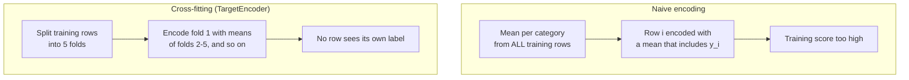
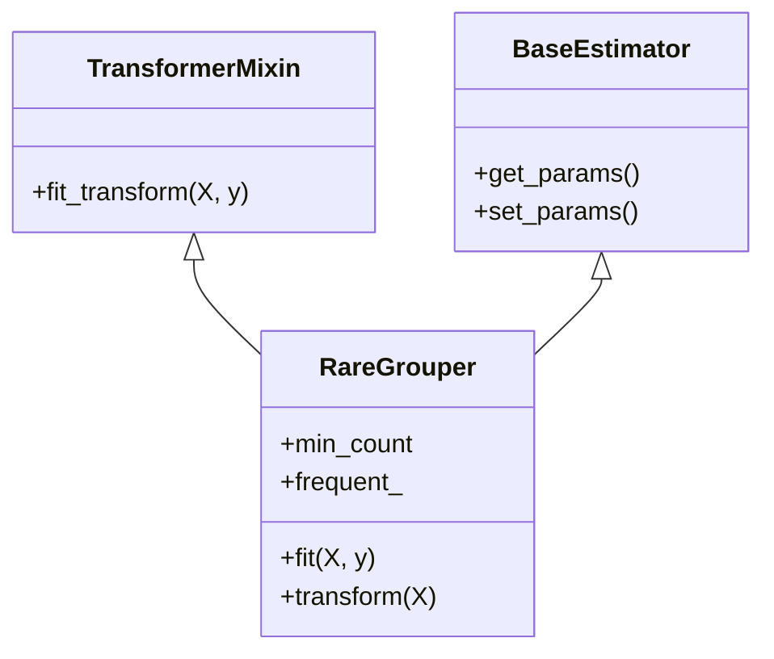

# Features from dates, interactions and categories

A **feature** is one input column of a model. Feature engineering means constructing new input columns from the raw data so that a model can use information it could not see before. This page covers the first block of Session 9: features from dates and times, interactions between features, categories with many levels (rare-category grouping and target encoding) and custom transformers that put all of this into a scikit-learn pipeline. The running example is the table of Binding Tariff Information (BTI) decisions of the case study, where the task is to predict the four-digit HS heading of a product from its description; for quick demonstrations we also use the simpler binary question "is this decision in chapter 85 (electrical machinery and equipment)?", which covers 14.7 % of the decisions. Session 8 introduced one-hot encoding, scaling and the `ColumnTransformer`; this page builds on them.

> [!NOTE]
> The code blocks on this page build on each other. Run them in order from the repository root, for example in a notebook started with `uv run jupyter lab`. They use `case-study/data/train_sample.parquet` (50,000 decisions from 2017–2023).


## 1. Features from dates and times

### Concept

A timestamp such as `2019-12-24 18:05` is one value, but it carries several kinds of information: the **year** (long-term trend), the **month** and **day of the week** (seasonal patterns), the **hour** (daily rhythm), and the **time elapsed** since some event (age of an account, days since the previous decision on the same product). A model cannot extract these parts on its own; we compute them as separate columns.

Some parts are **cyclical**: month 12 is followed by month 1, and hour 23 by hour 0. If we use the month as a number from 1 to 12, a linear model sees December and January as far apart. A **cyclical encoding** places each value on a circle with two columns:

- `month_sin = sin(2π · month / 12)`
- `month_cos = cos(2π · month / 12)`

Worked example: for January, 2π · 1/12 = 0.52 rad, so sin = 0.50 and cos = 0.87. For December, 2π · 12/12 = 2π, so sin = 0.00 and cos = 1.00. The two points are close on the circle, as they should be. Tree-based models (Session 10) can split a plain month number into ranges and usually do not need the sine and cosine; linear models and k-nearest neighbours do.


### Why it matters

Behaviour follows calendars: sales peak before holidays, call centres have busy Mondays, and the mix of goods that traders ask customs about changes over the years. A raw timestamp, stored as nanoseconds since 1970, mixes all these effects into one large number. Without date features a model either ignores time or picks up the trend in an uncontrolled way.

### How it works in Python

```python
import numpy as np
import pandas as pd

decisions = pd.read_parquet("case-study/data/train_sample.parquet")
d = decisions["start_date"]                           # start of validity, datetime64 column
dates = pd.DataFrame({
    "year": d.dt.year,
    "month": d.dt.month,
    "dayofweek": d.dt.dayofweek,                      # Monday = 0, Sunday = 6
    "days_since_2017": (d - pd.Timestamp("2017-01-01")).dt.days,   # elapsed time, a trend feature
})
dates["month_sin"] = np.sin(2 * np.pi * dates["month"] / 12)      # cyclical encoding
dates["month_cos"] = np.cos(2 * np.pi * dates["month"] / 12)
print(dates.round(2).sample(3, random_state=1).to_string())
#        year  month  dayofweek  days_since_2017  month_sin  month_cos
# 26247  2020      5          4             1244       0.50      -0.87
# 35067  2021      9          4             1727      -1.00      -0.00
# 34590  2021      8          4             1699      -0.87      -0.50

# Is there a trend? Share of heading 6307 (other made-up textile articles, incl. face masks) per year
print(decisions["heading"].eq("6307").groupby(dates["year"]).mean().round(3).to_dict())
# {2017: 0.019, 2018: 0.025, 2019: 0.031, 2020: 0.029, 2021: 0.037, 2022: 0.026, 2023: 0.028}
print(dates["dayofweek"].value_counts(normalize=True).sort_index().round(2).to_dict())
# {0: 0.4, 1: 0.11, 2: 0.09, 3: 0.19, 4: 0.2, 5: 0.0, 6: 0.0}
```

The share of heading 6307 doubled from 1.9 % in 2017 to 3.7 % in 2021 and fell back afterwards, so `year` carries some information about the label. The day of the week mostly describes how offices work: 40 % of all decisions become valid on a Monday, almost none at weekends. The share of chapter 85 hardly differs between weekdays (14–16 %), so the weekday is a weak feature for the heading. Checking such simple group means before adding a feature is good practice.

scikit-learn offers the same idea inside a pipeline: a `FunctionTransformer` (Section 5) can compute the sine and cosine, and `SplineTransformer(extrapolation="periodic")` builds smooth periodic features. The workbook [01-time-related-feature-engineering.ipynb](../workbooks/01-time-related-feature-engineering.ipynb) compares these encodings on a bike-sharing demand dataset.

### In practice

- In the Kaggle *Rossmann Store Sales* competition (2015), forecasts of daily sales for about 1,100 German drugstores relied on calendar features such as day of week, month, holidays and the days until and since promotions.
- The M5 forecasting competition on Walmart sales (Makridakis et al., 2022) provided calendar data with events and the days on which food-stamp (SNAP) payments are made, because these dates shift demand.
- The scikit-learn example on bike-sharing demand in Washington, D.C. shows that hour-of-day features with a periodic encoding reduce the error of a linear model considerably.

> [!WARNING]
> **Only dates known at prediction time.** The test decisions have `start_date`, but not `end_date`: the end of validity is decided together with the classification, and some decisions are invalidated early for reasons linked to the code. A feature such as "validity in days" therefore cannot be used for the heading task. For timestamps with a time of day, also convert to local time (`dt.tz_convert(...)`) before building hour features about human behaviour.

> [!CAUTION]
> A `year` feature lets a model learn a trend, but tree-based models cannot extrapolate it: for the test years 2024–2026 they treat every decision like one from 2023, the last year they saw. That is often acceptable, but be aware of it when the target drifts (Session 16).

## 2. Interactions between features

### Concept

An **interaction** exists when the effect of one feature depends on the value of another. A model with only additive terms, such as a linear or logistic regression, assumes that each feature adds its own effect regardless of the others. We can give it an interaction by adding the **product** of two features as a new column.

Worked example: a shop records whether a customer is a member and whether a discount was shown. The purchase rates are:

| | no discount | discount |
|---|---|---|
| not a member | 0.17 | 0.19 |
| member | 0.20 | 0.72 |

The discount barely helps non-members (+0.02) but helps members a lot (+0.52). An additive model can only fit one "discount effect" for everybody. With the extra column `member × discount`, which is 1 only in the lower-right cell, the model can fit all four cells.

### Why it matters

Linear models are popular because they are fast and interpretable, but they miss interactions unless we add them. Tree-based models find interactions automatically, because a split on one feature followed by a split on another is an interaction. Adding the right interactions can bring a linear model close to a tree model, while keeping it explainable.

### How it works in Python

```python
from sklearn.linear_model import LogisticRegression
from sklearn.pipeline import make_pipeline
from sklearn.preprocessing import PolynomialFeatures

rng = np.random.default_rng(0)
n = 2000
toy = pd.DataFrame({"member": rng.integers(0, 2, n), "discount": rng.integers(0, 2, n)})
# true purchase probability: 0.7 for members with a discount, 0.2 for everybody else
toy["buy"] = rng.binomial(1, np.where((toy.member == 1) & (toy.discount == 1), 0.7, 0.2))

cells = pd.DataFrame({"member": [0, 0, 1, 1], "discount": [0, 1, 0, 1]})
plain = LogisticRegression().fit(toy[["member", "discount"]], toy["buy"])
inter = make_pipeline(PolynomialFeatures(degree=2, interaction_only=True, include_bias=False),
                      LogisticRegression()).fit(toy[["member", "discount"]], toy["buy"])
cells["observed"] = toy.groupby(["member", "discount"])["buy"].mean().to_numpy()
cells["plain"] = plain.predict_proba(cells[["member", "discount"]])[:, 1]
cells["interaction"] = inter.predict_proba(cells[["member", "discount"]])[:, 1]
print(cells.round(2).to_string(index=False))
#  member  discount  observed  plain  interaction
#       0         0      0.17   0.09         0.17
#       0         1      0.19   0.29         0.20
#       1         0      0.20   0.28         0.20
#       1         1      0.72   0.63         0.71
print(inter[0].get_feature_names_out())   # ['member' 'discount' 'member discount']
```

The additive model is wrong in every cell: it underestimates the members with a discount and overestimates the others. With the product column the predictions match the observed rates.

On the decisions, candidate interactions are, for example, `language × description length` (a long German description and a long French one mean different things, because German compounds pack several words into one) or `issuing country × year` (the United Kingdom stops after 2020). Domain knowledge suggests which products are worth trying; `PolynomialFeatures(interaction_only=True)` creates all pairwise products, which grows quickly (p features give p·(p−1)/2 products).

### In practice

- Google's *Wide & Deep* model for app recommendations in Google Play (Cheng et al., 2016) combined a linear model on hand-made cross-product features, such as "installed app × shown app", with a neural network.
- Factorization machines (Rendle, 2010) were designed to estimate pairwise interactions in very sparse data such as click logs, and became a standard method for click-through-rate prediction.

> [!WARNING]
> **Too many interactions.** With 50 features, all pairwise products give 1,225 new columns, most of them noise. The model then overfits (Session 6). Add interactions that you can justify, or use a model that finds them itself (Session 10). Scale the features before multiplying them, or the products have very different ranges.

## 3. High-cardinality categories: grouping rare categories

### Concept

The **cardinality** of a categorical feature is its number of distinct values. `issuing_country` has 29 values in the sample and `language` 23: manageable. A category with thousands of values arises when we take a word from the text as a category. Here we use the **first word** of the description in lower case, which is often the product name ("lampe", "smartphone") but also often boilerplate ("es handelt sich um…", "bei der Ware…"). It has 9,832 distinct values in the 50,000-decision sample. One-hot encoding (Session 8) would create one column per word; 6,170 of them would contain a single 1.

**Grouping rare categories** replaces every category that appears fewer than *k* times in the training data by one shared level, often called `"infrequent"` or `"other"`. The frequent categories keep their own column. Categories that appear only in new data are mapped to the same shared level.

### Why it matters

A column with one 1 in 50,000 rows cannot teach a model anything reliable, but it costs memory and invites overfitting. Grouping keeps the information of the frequent categories, gives the model a stable estimate for "rare word", and handles unseen categories at prediction time without errors. Frequency itself can be a feature: how common the first word is says something about the description style.

### How it works in Python

```python
from sklearn.preprocessing import OneHotEncoder

df = decisions.copy()
df["first_word"] = df["description"].str.lower().str.extract(r"([^\W\d_]+)", expand=False).fillna("")
counts = df["first_word"].value_counts()
print(df["first_word"].nunique(), (counts == 1).sum())          # 9832 levels, 6170 seen once
print(counts.head(5).to_dict())
# {'es': 3458, 'bei': 2575, 'een': 2031, 'angaben': 1676, 'sog': 1654}

for k in [None, 20, 100]:
    enc = OneHotEncoder(min_frequency=k, handle_unknown="infrequent_if_exist")
    n_cols = enc.fit(df[["first_word"]]).transform(df[["first_word"]]).shape[1]
    print(k, n_cols)
# None 9832    one column per word
# 20 243       words seen fewer than 20 times share one column
# 100 43
```

`min_frequency` sets the threshold *k* (an integer count, or a fraction of rows); `max_categories` keeps only the most frequent levels. With `handle_unknown="infrequent_if_exist"` a word that appears for the first time in the test data is encoded like a rare word. A **count encoding** (`df["first_word"].map(counts)`) adds the frequency as one numeric feature; it must also be computed on the training data only.

### In practice

- Retail and e-commerce data have product, brand and seller identifiers with thousands of levels; grouping the long tail is a routine step before modelling.
- In German official statistics, the Federal Statistical Office (Destatis) publishes many tables only with grouped categories so that rare groups do not reveal individuals; the statistical reason (too few observations per cell) is the same.

> [!WARNING]
> The threshold is a hyperparameter. Choose it with cross-validation (Session 7), not by looking at the test data. And compute the counts inside the pipeline: an encoder that was fitted on all data has already seen the test rows.

## 4. Target encoding and its leakage risk

### Concept

**Target encoding** (also called mean encoding) replaces each category by the mean of the target in the training rows of that category. For the binary target "decision is in chapter 85", the first word "lampe" with 8 chapter-85 decisions out of 19 gets the value 8/19 = 0.42. One numeric column replaces thousands of dummy columns, and it orders the categories by their relation to the target.

For a **multiclass** target, target encoding creates one column per class: the share of each class among the rows of the category. With 1,114 headings that is 1,114 columns per encoded feature, as many as the one-hot encoding we wanted to avoid. In practice one encodes against a coarser target (the 97 chapters) or a binary sub-question, as here.

Two problems arise.

1. **Small categories give noisy means.** A word seen twice, both times in chapter 85, gets 1.0. **Smoothing** shrinks the mean of a small category towards the overall mean ȳ:

   encoding = (n · ȳ_category + m · ȳ) / (n + m)

   With an overall chapter-85 share ȳ = 0.15 and *m* = 10: word A (n = 2, mean 1.0) gets (2 · 1.0 + 10 · 0.15)/12 = 0.29; "lampe" (n = 19, mean 0.42) gets (19 · 0.42 + 10 · 0.15)/29 = 0.33. The small category moves most towards the average.

2. **Target leakage.** **Leakage** means that information that will not be available at prediction time enters the training data. If a row's own label is part of the mean that encodes it, the feature partly *is* the label. For a category with one row, the encoding equals the label exactly. A model learns to trust the feature, and its training score is far too optimistic.

The remedy is **cross-fitting**: split the training data into *k* folds; encode the rows of each fold with means computed from the other *k*−1 folds only. No row ever sees its own label. scikit-learn's `TargetEncoder` does this automatically in `fit_transform` (5 folds by default) and uses smoothing (`smooth="auto"`, an empirical Bayes estimate of *m*). For new data, `transform` uses means from the whole training set.



### Why it matters

Target encoding is often the best way to use a high-cardinality category in linear and tree models; benchmarks such as Pargent et al. (2022) found regularised target encoding among the most reliable encoders. But the naive version is one of the most common sources of leakage in practice, and the damage is invisible on the training data.

### How it works in Python

The decision reference `bti_reference` makes the leak visible: every one of the 50,000 sample decisions has its own reference. A naive encoding of it therefore copies the label.

```python
from sklearn.metrics import roc_auc_score
from sklearn.model_selection import KFold, train_test_split
from sklearn.preprocessing import TargetEncoder

y = df["chapter"].eq("85").astype(int)                          # binary target: chapter 85 (target only, never an input)
tr, te = train_test_split(df.index, test_size=0.3, random_state=0, stratify=y)

for col in ["bti_reference", "first_word"]:
    naive = y[tr].groupby(df.loc[tr, col]).mean()               # mean target per category, own row included
    f_tr = df.loc[tr, col].map(naive)
    f_te = df.loc[te, col].map(naive).fillna(y[tr].mean())      # unseen categories: overall mean
    enc = TargetEncoder(target_type="binary", cv=KFold(5, shuffle=True, random_state=0))
    e_tr = enc.fit_transform(df.loc[tr, [col]], y[tr]).ravel()  # cross-fitted on the training rows
    e_te = enc.transform(df.loc[te, [col]]).ravel()
    print(col, "naive:", round(roc_auc_score(y[tr], f_tr), 3), round(roc_auc_score(y[te], f_te), 3),
          "| cross-fitted:", round(roc_auc_score(y[tr], e_tr), 3), round(roc_auc_score(y[te], e_te), 3))
# bti_reference naive: 1.0 0.5 | cross-fitted: 0.492 0.5
# first_word naive: 0.975 0.902 | cross-fitted: 0.901 0.902
```

Read the numbers as "training AUC, test AUC". The naive encoding of `bti_reference` separates chapter-85 decisions from the others perfectly on the training rows (AUC 1.0) and is useless on new rows (0.5, chance level). The cross-fitted version is honest: its training AUC already shows that the feature carries no information. For `first_word`, the naive training AUC of 0.975 promises more than the 0.902 that the feature delivers on new data; the cross-fitted training AUC (0.901) is a fair estimate. The first word is a strong feature: words such as "smartphone" or "lampe" point to chapters directly.

The workbooks [03-target-encoder.ipynb](../workbooks/03-target-encoder.ipynb) and [04-target-encoder-cross-fitting.ipynb](../workbooks/04-target-encoder-cross-fitting.ipynb) show both points on a wine-review dataset.

### In practice

- Micci-Barreca (2001) proposed smoothed target statistics for high-cardinality attributes such as ZIP codes and IP addresses in fraud-detection models.
- CatBoost, the gradient boosting library from Yandex (Session 10), encodes categories with *ordered target statistics*: each row is encoded only with the labels of rows that come before it in a random order, a variant of the same idea (Prokhorenkova et al., 2018).

> [!CAUTION]
> `TargetEncoder.fit(X, y).transform(X)` is **not** the same as `fit_transform(X, y)`. The first encodes the training rows with means that include their own labels (the naive leak); only `fit_transform` cross-fits. Inside a `Pipeline`, scikit-learn calls `fit_transform` during training and `transform` during prediction, which is correct.

> [!WARNING]
> Cross-fitting protects against the row's own label, not against the future, nor against **renewals**: a decision renewed in a later year has the same description and the same heading, so with a random split the "new" row's twin sits in the training data. Encode with past data only (page 2) and validate with a time-based split (Session 7).

## 5. Custom transformers in scikit-learn pipelines

### Concept

A **transformer** in scikit-learn is an object with two methods: `fit(X, y)` learns what it needs from the training data, and `transform(X)` applies it to any data. `StandardScaler` learns means and standard deviations; `OneHotEncoder` learns the list of categories. When no built-in transformer does what we need, we write our own in one of two ways:

- `FunctionTransformer(func)` wraps a function that needs nothing from the training data, such as "compute the text length" or "take the sine of the month". Its `fit` does nothing.
- A small class that inherits from `BaseEstimator` and `TransformerMixin` is needed when something must be learned in `fit`, such as the list of frequent words.

Put inside a `Pipeline` or `ColumnTransformer`, both are fitted on the training folds only, exactly like the built-in ones.



### Why it matters

Feature code written outside the pipeline, for example in a notebook cell that modifies the whole data frame, is easily applied to training and test data together, and is easily forgotten when the model is deployed. Inside the pipeline the same code runs during cross-validation, on the test set and in production (Session 16), and it is saved together with the model.

### How it works in Python

```python
from sklearn.base import BaseEstimator, TransformerMixin
from sklearn.compose import ColumnTransformer
from sklearn.ensemble import HistGradientBoostingClassifier
from sklearn.model_selection import StratifiedKFold, cross_val_score
from sklearn.pipeline import make_pipeline
from sklearn.preprocessing import FunctionTransformer


def date_features(X):
    """Year and cyclical month of a data frame with one datetime column 'start_date'."""
    month = X["start_date"].dt.month
    return pd.DataFrame({"year": X["start_date"].dt.year,
                         "month_sin": np.sin(2 * np.pi * month / 12),
                         "month_cos": np.cos(2 * np.pi * month / 12)}, index=X.index)


class RareGrouper(BaseEstimator, TransformerMixin):
    """Replace categories seen fewer than min_count times in the training data by 'other'."""

    def __init__(self, min_count=20):
        self.min_count = min_count

    def fit(self, X, y=None):
        counts = X.iloc[:, 0].value_counts()
        self.frequent_ = set(counts[counts >= self.min_count].index)
        self.feature_names_in_ = np.asarray(X.columns, dtype=object)   # learned from training data
        return self

    def transform(self, X):
        col = X.iloc[:, 0]
        return col.where(col.isin(self.frequent_), "other").to_frame()

    def get_feature_names_out(self, input_features=None):
        return self.feature_names_in_                 # one output column per input column


features = ColumnTransformer([
    ("dates", FunctionTransformer(date_features,         # names of the three output columns:
                                  feature_names_out=lambda tf, names: ["year", "month_sin", "month_cos"]),
     ["start_date"]),
    ("word", make_pipeline(RareGrouper(min_count=20),
                           TargetEncoder(target_type="binary",
                                         cv=KFold(5, shuffle=True, random_state=0))), ["first_word"]),
    ("meta", OneHotEncoder(min_frequency=20, handle_unknown="infrequent_if_exist", sparse_output=False),
     ["language", "issuing_country"]),
])
model = make_pipeline(features, HistGradientBoostingClassifier(random_state=0))
X = df[["start_date", "first_word", "language", "issuing_country"]]
cv = StratifiedKFold(5, shuffle=True, random_state=0)
scores = cross_val_score(model, X, y, cv=cv, scoring="roc_auc")
print(scores.mean().round(3))                                # 0.826
print(model.fit(X, y)[0].get_feature_names_out()[:4])
# ['dates__year' 'dates__month_sin' 'dates__month_cos' 'word__first_word']
```

Everything that learns from data (the list of frequent words, the target means, the categories of the one-hot encoder) is fitted again inside each cross-validation fold. The model sees no text apart from the first word, so its cross-validated ROC AUC of 0.83 is modest. The grouping threshold matters: with `min_count=5` the same pipeline reaches 0.878, without grouping (`min_count=1`) 0.868. Too coarse a grouping throws away informative words, too fine a grouping leaves noisy categories; the threshold is a hyperparameter to tune (Session 7). Adding the text statistics of page 2 raises the score to about 0.93 in our runs; the full text follows in Sessions 13 and 14. The mechanism matters here, not the score.

### In practice

- Feature-engine (Galli, 2021), an open-source library under the BSD licence, provides transformers for rare-label grouping, date features and cyclical encoding with the same `fit`/`transform` interface; it shows how far the pattern carries.
- Deployed models at many companies are stored as one pipeline object (for example with `joblib`, Session 16), so that the serving code calls only `predict` and cannot apply a different feature recipe by mistake.

> [!TIP]
> Name the learned attributes with a trailing underscore (`frequent_`), set them only in `fit`, and store constructor arguments unchanged in `__init__`. Then `clone`, `GridSearchCV` and `get_params` work with your class as with any built-in transformer.

> [!WARNING]
> A `FunctionTransformer` must not compute anything across rows, such as `x - x.mean()`: that mean would come from whichever data are passed in, the test set included. Anything that needs statistics of the data belongs in `fit`.

## Practice

Build date, interaction and target-encoded features for the decisions in [05-case-study-decision-features.ipynb](../workbooks/05-case-study-decision-features.ipynb): add year and cyclical month features, one interaction of your choice (for example language × description length), the first word grouped and target-encoded with cross-fitting, and compare the ROC AUC for the chapter-85 question with and without each group of features, using a time-based validation (fit 2017–2021, validate 2022–2023).

## Check your understanding

1. Why does a logistic regression need a cyclical encoding of the month, while a decision tree usually does not?
2. In the member-discount table, what single extra column lets an additive model fit all four cells, and what values does it take?
3. A first word occurs in 3 decisions, all in chapter 85; the overall chapter-85 share is 0.15. What is its smoothed target encoding with *m* = 10?
4. Why does a naive target encoding of `bti_reference` give a training AUC of 1.0 but a test AUC of 0.5? And why would a multiclass target encoding of the first word against the 1,114 headings be impractical?
5. When do you need a class that inherits from `BaseEstimator` and `TransformerMixin` instead of a `FunctionTransformer`?

## Further reading

- scikit-learn developers (2025). *Target Encoder's internal cross fitting*. scikit-learn example gallery. https://scikit-learn.org/stable/auto_examples/preprocessing/plot_target_encoder_cross_val.html
- scikit-learn developers (2025). *Time-related feature engineering*. scikit-learn example gallery. https://scikit-learn.org/stable/auto_examples/applications/plot_cyclical_feature_engineering.html
- Pargent, F., Pfisterer, F., Thomas, J. & Bischl, B. (2022). Regularized target encoding outperforms traditional methods in supervised machine learning with high cardinality features. *Computational Statistics*, 37, 2671–2692. https://doi.org/10.1007/s00180-022-01207-6
- Kuhn, M. & Johnson, K. (2019). *Feature Engineering and Selection: A Practical Approach for Predictive Models*. CRC Press. Free online: https://bookdown.org/max/FES/
