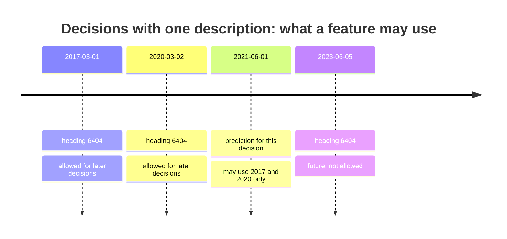
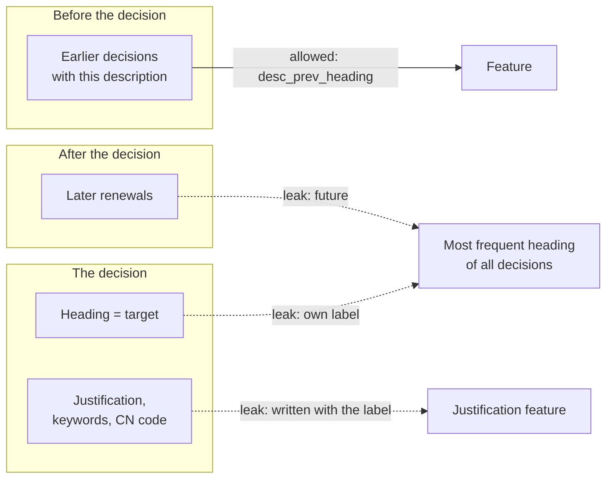

# Aggregates from earlier decisions, target leakage and text statistics

Many useful features do not sit in the row we predict on. They come from other rows, grouped by a key and summarised: how often the same description was decided before, which heading it received then, how many decisions a country issued last year. This page covers the second block of Session 9: how to compute such **aggregates** only from data that existed at the time of each prediction, how simple statistics of a text become numeric features, and how features leak the target when the past-only rule is broken. The case-study examples are **repeated descriptions** (the same text decided more than once: parallel decisions for variants of one product, and renewals after the three-year validity) and the column `classification_justification`, which customs writes when it classifies the product.

> [!NOTE]
> The code blocks on this page build on each other. Run them in order from the repository root. The first block reads the full training table (309,529 decisions), because the history of a description needs all earlier decisions, not only those in the 50,000-decision sample.

## 1. Aggregates computed only from past data

### Concept

An **aggregate feature** summarises many rows into one value per prediction row, for example a count, a mean, the most recent value or the time since the first event. In the case study, the same description of goods sometimes comes back: a trader may ask for several decisions on the same day (for variants of one product), and a BTI decision is valid for three years, after which traders may ask for a new one. Grouping the decisions by their description gives aggregates such as "number of earlier decisions with this exact description" and "heading of the most recent earlier decision with this description".

The rule for a correct aggregate is: **use only rows that were known at the moment of the prediction**. A decision that starts on 1 March 2020 may use the decisions that started before 1 March 2020, never those that started afterwards. Such features are called **point-in-time correct** or **as-of** features. For rows sorted in time, the **expanding** count and the **shifted** value give exactly this:

Worked example: one description decided four times.

| start date | heading | earlier decisions | prev_n | prev_heading | most frequent heading of all four |
|---|---|---|---|---|---|
| 2017-03-01 | 6404 | – | 0 | missing | 6404 |
| 2020-03-02 | 6404 | 6404 | 1 | 6404 | 6404 |
| 2021-06-01 | 6402 | 6404, 6404 | 2 | 6404 | 6404 |
| 2023-06-05 | 6404 | 6404, 6404, 6402 | 3 | 6402 | 6404 |

The last column uses all rows, including the row's own heading and later ones. For the decision of June 2021 (heading 6402, perhaps after a change of the legal interpretation) it says 6404, which is only known from the future majority.



### Why it matters

At prediction time the model only knows the past. If the training features contain information from the future, the model learns a relationship that does not exist when it is used. Its validation score looks good; its real performance is worse.

### How it works in Python

The grouped `cumcount` counts earlier rows; the grouped `shift(1)` takes the value of the previous row of the same group:

```python
import numpy as np
import pandas as pd

train = pd.read_parquet("case-study/data/train.parquet",
                        columns=["bti_reference", "start_date", "language", "description", "heading",
                                 "classification_justification"])
train = train.sort_values(["start_date", "bti_reference"]).reset_index(drop=True)   # time order is essential

g = train.groupby("description")
train["desc_prev_n"] = g.cumcount()                        # earlier decisions with the same description
train["desc_prev_heading"] = g["heading"].shift(1)         # heading of the most recent one (missing if none)
train["days_since_prev"] = (train["start_date"] - g["start_date"].shift(1)).dt.days

renewed = train["desc_prev_n"] > 0
print(round(renewed.mean(), 3))                                          # 0.037: 3.7 % repeat a description
print(round((train["desc_prev_heading"] == train["heading"])[renewed].mean(), 3))   # 0.987 same heading
gap = train.loc[renewed, "days_since_prev"]
print(round((gap == 0).mean(), 3), round((gap >= 900).mean(), 3))      # 0.624 0.162
```

3.7 % of the training decisions repeat a description that was decided before, and in 98.7 % of these cases the previous heading is the heading again. Most repeats (62 %) start on the same day as the previous decision: parallel decisions for variants of one product. 16 % come about 2.5 years or more later: renewals. For those rows the past-only aggregate is close to a perfect predictor, and it is legitimate: at the time of the new decision, the old one was public. The same logic in SQL (Session 3) is a window function: `LAG(heading) OVER (PARTITION BY description ORDER BY start_date)`. When the history lives in a separate table with its own timestamps, `pd.merge_asof(left, right, on="start_date", by="key", allow_exact_matches=False)` joins, for each row, the latest history row strictly before it.

### In practice

- Uber's machine-learning platform Michelangelo introduced a shared feature store in which aggregates such as "average meal preparation time of a restaurant over the last week" are computed once and reused for training and serving (Hermann & Del Balso, 2017).
- Open-source feature stores such as Feast offer *point-in-time joins* as a core operation: for each training row, they look up feature values as they were at that row's timestamp.
- Customs officers do the same by hand: before classifying a product, they search the EBTI database for earlier decisions on similar goods, which is exactly a past-only lookup.

> [!WARNING]
> **Sort before you accumulate.** `cumcount` and `shift` follow the current row order. If the table is not sorted by date, the "earlier" decisions are arbitrary rows. Decisions with the same start date are an edge case; sort by a second key (here `bti_reference`) so the result is reproducible.

> [!TIP]
> The first decision of a description has no history. Leave `desc_prev_heading` missing and keep the count `desc_prev_n = 0` as a separate feature: models can learn "no history yet" from it.

## 2. Simple text statistics as features

### Concept

Until TF-IDF and embeddings (Sessions 13 and 14), a model cannot read a description. But simple counts already carry some signal: descriptions of machines quote technical data with many digits, German descriptions are long and use long compound words, and some descriptions quote the tariff text of their own code (replaced by `<CODE>` in the case-study data). A **text statistic** is any number computed from a string without a vocabulary:

- length in characters (log-transformed, because a few texts are very long)
- number of digits and number of lines
- share of capital letters
- mean word length (long German compounds such as "Kunststoffbehälter")
- whether the text contains the placeholder `<CODE>`

Worked example: the text `"Damenschuh aus Leder,\nGröße 38, <CODE>"` has 36 characters (log1p = 3.61), 2 digits, 2 lines, 6 words with a mean length of 6.0 characters and contains `<CODE>`.

### Why it matters

These features are cheap, transparent and available for every decision, including those in the test set. They form the inputs of the first leaderboard model (L1 in Session 8) together with language and country, and they are a complement to text components in the tree model of Session 10. The L1 model reaches only 7.6 % accuracy on the public leaderboard: statistics *about* a text cannot tell a shoe from a lamp. That is the point of the baseline: it shows how much the words themselves are needed.

### How it works in Python

```python
def text_stats(description):
    """Simple statistics of the description of goods, one row per decision."""
    d = description.fillna("")
    n_chars = d.str.len()
    return pd.DataFrame({
        "log_chars": np.log1p(n_chars),
        "n_digits": d.str.count(r"\d"),
        "n_lines": d.str.count("\n") + 1,
        "upper_share": d.str.count(r"[A-ZÄÖÜ]") / n_chars.clip(lower=1),
        "mean_word_len": n_chars / d.str.split().str.len().clip(lower=1),
        "has_code": d.str.contains("<CODE>", regex=False).astype(int),
    }, index=description.index)


print(text_stats(pd.Series(["Damenschuh aus Leder,\nGröße 38, <CODE>"])).round(2).to_string())
sample = pd.read_parquet("case-study/data/train_sample.parquet")
stats = text_stats(sample["description"])
print(stats.groupby(sample["language"]).mean().loc[["de", "fr", "en"]].round(2).to_string())
chapters = sample["chapter"].isin(["30", "39", "61", "85"])
print(stats[chapters].groupby(sample.loc[chapters, "chapter"]).mean().round(2).to_string())
```

The statistics differ more between languages than between product groups: German descriptions are long, have many lines and digits; English ones are short and written largely in capitals (customs offices in the United Kingdom used upper case). Between chapters, machines (85) have the most digits, pharmaceuticals (30) quote their own code most often. Inside a pipeline, wrap the function in a `FunctionTransformer` (page 1, Section 5); because it uses only the row itself, it needs no fitting and cannot leak.

### In practice

- Readability formulas such as Flesch reading ease, built from word and sentence lengths, are used by public bodies to check that official texts are understandable; they are text statistics in the same sense.
- Spam filters used counts of capital letters, exclamation marks and links long before they used word models.

> [!WARNING]
> A statistic that differs between groups is not automatically useful. Because the statistics mainly measure the language and the writing habits of an office, a model on them partly learns "which country wrote this", not "what is the product". Compare with a model on language and country alone before crediting the statistics.

## 3. Target leakage through aggregates and late information

### Concept

**Target leakage** is the use of information that is not available at prediction time and is related to the target. The case study has two typical forms:

1. **Information written with or after the label.** `classification_justification` explains why customs chose the code and names the heading in about 70 % of the training decisions. `keywords`, `cn_code`, `chapter`, `status`, `end_date` and `invalidation_reason` are also set with or after the classification. The test decisions do not have them; a trader's request does not contain them.
2. **Aggregates that include the row's own label or future rows.** "Most frequent heading of all decisions with this description" contains the decision's own heading and those of later renewals.

The result is a feature that is much more strongly related to the target in the training data than it will ever be at prediction time.



### Why it matters

Leakage is dangerous because it is silent: every number in the notebook improves. It only shows on truly new data, on the leaderboard or after deployment.

How to detect it:

- A single feature that predicts "too well", or a feature importance (Session 10) far above all others.
- A large gap between the validation score and the score on data that were collected later.
- Asking for each feature: *at which moment would this value be known, and from which rows is it computed?*
- Checking whether the validation data are built **like the test data**. The leaderboard's test set contains no description that also occurs in the training data (they were removed); a validation set that keeps such rows rewards a lookup that will never fire on the test set.

### How it works in Python

First, the justification:

```python
just = train["classification_justification"].fillna("")
names_heading = [h in j for h, j in zip(train["heading"], just)]
print(round(np.mean(names_heading), 3))                   # 0.699: the heading appears in the text
first_number = just.str.extract(r"\b(\d{4})\b", expand=False)
print(round((first_number == train["heading"]).mean(), 3))   # 0.639: "read" the label from the text
```

A rule that takes the first four-digit number of the justification gets 64 % of the headings right, without any model. Any classifier given this column looks excellent in validation and fails on the test set, where the column does not exist. In the practice notebook, a linear text classifier fitted on 2017–2021 reaches 0.766 accuracy on 2022–2023 with the description alone; with description plus justification it reaches 0.939 when validated with the justification, and 0.735 when validated without it, as on the test set: worse than not using the column at all.

Second, the description lookup. We imitate the leaderboard: decisions up to 2021 are the past, those of 2022–2023 are predicted. The lookup predicts the heading of an earlier decision with the same description and abstains otherwise. Three versions: **leaky** (most frequent heading of all decisions with the description, own row included), **past only** (the expanding version of Section 1, which may use earlier 2022–2023 decisions) and **as of 1 January 2022** (only decisions before the cut-off, as for the leaderboard test set). Finally, we drop the validation rows whose description already occurs before 2022, because the test set was built that way.

```python
cut = pd.Timestamp("2022-01-01")
past, val = train[train["start_date"] < cut], train[train["start_date"] >= cut]
most_frequent = train.groupby("description")["heading"].agg(lambda h: h.value_counts().index[0])
as_of = past.groupby("description")["heading"].last()
like_test = ~val["description"].isin(past["description"])        # as the leaderboard test set
lookups = {"leaky (all rows)": val["description"].map(most_frequent),
           "past only (expanding)": val["desc_prev_heading"],
           "as of 2022-01-01": val["description"].map(as_of)}
for name, pred in lookups.items():
    for rows_name, rows in [("all 2022-2023", slice(None)), ("test-like", like_test)]:
        p, y = pred[rows], val.loc[rows, "heading"]
        print(f"{name:22s} {rows_name:14s} answered {p.notna().mean():.3f}  correct {(p == y).mean():.3f}")
```

| Lookup | Validation rows | Answered | Correct (of all rows) | Interpretation |
|---|---|---|---|---|
| leaky | all 2022–2023 | 1.000 | 1.000 | every decision "knows" its own heading |
| past only | all 2022–2023 | 0.042 | 0.042 | honest, but includes renewals within 2022–2023 |
| as of 2022 | all 2022–2023 | 0.021 | 0.021 | renewals of 2017–2021 decisions |
| past only | test-like | 0.021 | 0.021 | only renewals inside the validation period remain |
| as of 2022 | test-like | 0.000 | 0.000 | on data built like the test set, the lookup never fires |

The leaky lookup is a perfect "model" on the training data and useless in reality. The past-only lookup is legitimate and almost always right when it answers, but it answers for 2–4 % of the decisions, and on data built like the leaderboard's test set it never answers, because the test set contains no description seen in training. A validation set that keeps the repeated descriptions would credit this feature with a gain the leaderboard cannot deliver. That is also why random splits are too optimistic on this data (Session 7): a repeated description lands in the validation fold while its twin, often decided on the same day, sits in the training folds.

### In practice

- In the KDD Cup 2008 on breast-cancer detection, patient identifiers turned out to be predictive of the label because of how the data had been assembled; Rosset et al. (2010) and Kaufman et al. (2012) describe this and similar competition leaks.
- In credit-default prediction, features such as "number of collection letters" or "account status" are often recorded after the default happened and leak the label if the cut-off date is not respected.
- Kapoor and Narayanan (2023) reviewed published machine-learning studies in 17 scientific fields and found data leakage, including features with information from the future, among the main reasons for irreproducible results.

> [!CAUTION]
> **The case-study rule.** For the heading task, never use `classification_justification`, `keywords`, `cn_code`, `chapter`, `status`, `end_date` or `invalidation_reason` as model inputs. They may be used to explore and read the data (the English keywords are useful for that), and as targets of other questions, but not as features.

> [!WARNING]
> Out-of-fold encoding (page 1) removes the row's own label but still uses future rows and renewals of the same description. With a time-based split this matters; prefer past-only aggregates for anything that has a timestamp.

## Practice

In [06-case-study-justification-leakage.ipynb](../workbooks/06-case-study-justification-leakage.ipynb): show how much of the heading can be read from `classification_justification`, train a model with and without a justification feature and compare the validation scores, then build the past-only description lookup, compare it with the leaky version on a time-based validation that imitates the leaderboard (including the removal of repeated descriptions), and decide which features may enter the leaderboard model.

## Check your understanding

1. A description was decided in 2018 (heading 9405), 2021 (9405) and 2023 (8513). What are `desc_prev_n` and `desc_prev_heading` for each of the three decisions?
2. Why is `classification_justification` a leak for the heading task, although it is a column of the training data?
3. In the table of five lookups, which row describes what the lookup will do on the leaderboard, and why?
4. Why does `shift(1)` within groups give wrong results if the decisions are not sorted by date?
5. Name one text statistic that you expect to differ between chapter 85 and chapter 61, and how you would check it.

## Further reading

- Kaufman, S., Rosset, S., Perlich, C. & Stitelman, O. (2012). Leakage in data mining: formulation, detection, and avoidance. *ACM Transactions on Knowledge Discovery from Data*, 6(4), 15. https://doi.org/10.1145/2382577.2382579
- Kapoor, S. & Narayanan, A. (2023). Leakage and the reproducibility crisis in machine-learning-based science. *Patterns*, 4(9), 100804. https://doi.org/10.1016/j.patter.2023.100804
- pandas developers (2025). *pandas.merge_asof*. pandas API reference. https://pandas.pydata.org/docs/reference/api/pandas.merge_asof.html
- Feast authors (2025). *Point-in-time joins*. Feast documentation. https://docs.feast.dev/getting-started/concepts/point-in-time-joins
