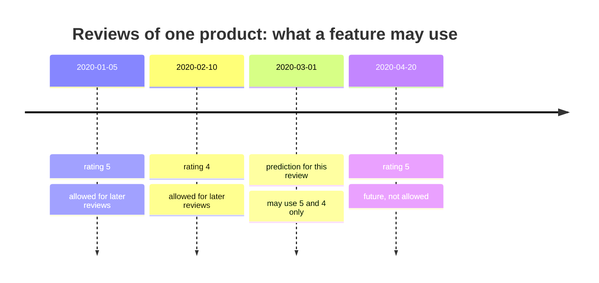
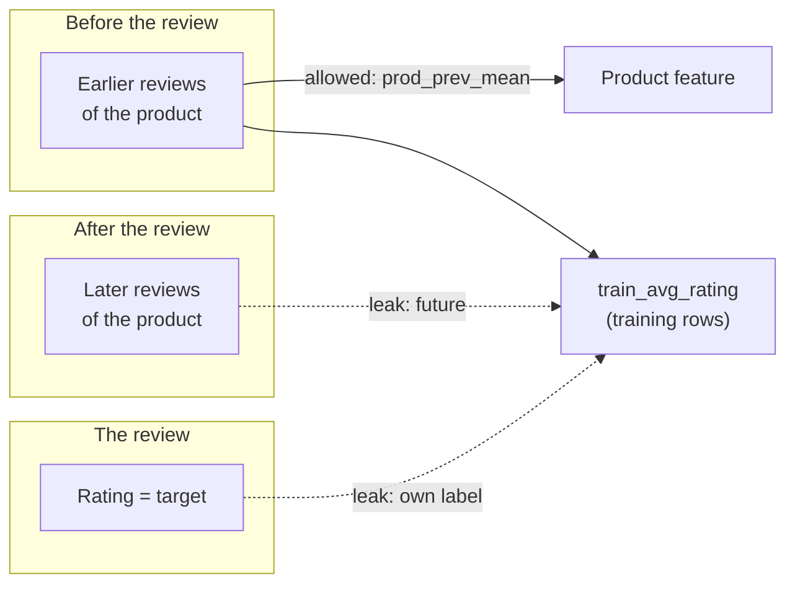

# Aggregates from joined tables, target leakage and text statistics

Many useful features do not sit in the table we predict on. They come from a second table, joined on a key and summarised: the average rating of a product, the number of earlier reviews of a user, the age of a product listing. This page covers the second block of Session 9: how to compute such **aggregates** only from data that existed at the time of each prediction, how simple statistics of a text become numeric features, and how aggregates leak the target when the past-only rule is broken. The case-study example is the column `train_avg_rating` in `products.parquet`, which contains the review's own rating for training rows.

> [!NOTE]
> The code blocks on this page build on each other. Run them in order from the repository root. The first block reads the full training table (434,373 reviews, about 70 MB), because the history of a product needs all its earlier reviews, not only those in the 50,000-review sample.

## 1. Aggregates from joined tables, computed only from past data

### Concept

An **aggregate feature** summarises many rows of a related table into one value per prediction row, for example the mean, count, minimum or time since the first event. In the case study, each review belongs to a product (`parent_asin`), and each product has many reviews. "Average rating of the product" is an aggregate over the product's reviews.

The rule for a correct aggregate is: **use only rows that were known at the moment of the prediction**. A review written on 1 March 2020 may use the reviews of the same product written before 1 March 2020, never those written afterwards. Such features are called **point-in-time correct** or **as-of** features. For a review sorted in time, the **expanding mean** of earlier reviews is

prev_mean = (sum of the ratings before this review) / (number of reviews before this review).

Worked example for product A with four reviews in time order:

| date | rating | earlier ratings | prev_n | prev_mean | mean of all reviews of A |
|---|---|---|---|---|---|
| 2020-01-05 | 5 | – | 0 | missing | 3.75 |
| 2020-02-10 | 4 | 5 | 1 | 5.00 | 3.75 |
| 2020-03-01 | 1 | 5, 4 | 2 | 4.50 | 3.75 |
| 2020-04-20 | 5 | 5, 4, 1 | 3 | 3.33 | 3.75 |

The last column, the mean of all reviews, is what `train_avg_rating` contains. For the review of 1 March (rating 1) it uses that review's own rating and one later rating.



### Why it matters

At prediction time the model only knows the past. If the training features contain information from the future, the model learns a relationship that does not exist when it is used. Its validation score looks good; its real performance is worse. In the case study the test reviews are from 2022 and 2023, and their product averages are computed from training reviews only (all before 2022), so for the test rows the provided `train_avg_rating` is a legitimate past aggregate. For the training rows it is not.

### How it works in Python

The grouped cumulative sum, minus the current rating, divided by the grouped count gives the expanding mean of earlier reviews in one pass:

```python
import numpy as np
import pandas as pd

train = pd.read_parquet("case-study/data/train.parquet",
                        columns=["review_id", "parent_asin", "user_id", "rating", "date"])
train = train.sort_values(["date", "review_id"]).reset_index(drop=True)   # time order is essential

g = train.groupby("parent_asin")["rating"]
train["prod_prev_n"] = g.cumcount()                                       # reviews before this one
train["prod_prev_mean"] = ((g.cumsum() - train["rating"]) / train["prod_prev_n"]).where(
    train["prod_prev_n"] > 0)                                             # missing for the first review
train["user_prev_n"] = train.groupby("user_id").cumcount()                # earlier reviews of the same user
train["days_since_first_review"] = (                                      # age of the product listing
    train["date"] - train.groupby("parent_asin")["date"].transform("min")).dt.days

print(train[["prod_prev_n", "prod_prev_mean", "user_prev_n", "days_since_first_review"]]
      .describe().round(2).loc[["mean", "50%", "max"]])
#       prod_prev_n  prod_prev_mean  user_prev_n  days_since_first_review
# mean       129.13            4.14         0.15                   663.14
# 50%         13.00            4.33         0.00                   278.00
# max       2996.00            5.00        99.00                  7358.00
```

`days_since_first_review` uses `transform("min")` over all reviews of a product; that is still past information, because the first review of a product is never later than the current one. The same logic in SQL (Session 3) is a window function: `AVG(rating) OVER (PARTITION BY parent_asin ORDER BY date ROWS BETWEEN UNBOUNDED PRECEDING AND 1 PRECEDING)`. When the history lives in a separate table with its own timestamps, `pd.merge_asof(left, right, on="date", by="key", allow_exact_matches=False)` joins, for each row, the latest history row strictly before it.

Then join the features to the sample that we model on:

```python
reviews = pd.read_parquet("case-study/data/train_sample.parquet")
products = pd.read_parquet("case-study/data/products.parquet",
                           columns=["parent_asin", "train_avg_rating", "train_n_reviews"])
cols = ["review_id", "prod_prev_n", "prod_prev_mean", "user_prev_n", "days_since_first_review"]
df = reviews.merge(products, on="parent_asin", how="left").merge(train[cols], on="review_id", how="left")
print(len(df), round(df["prod_prev_mean"].isna().mean(), 3))   # 50000 0.129: 12.9 % are first reviews
```

### In practice

- Uber's machine-learning platform Michelangelo introduced a shared feature store in which aggregates such as "average meal preparation time of a restaurant over the last week" are computed once and reused for training and serving (Hermann & Del Balso, 2017).
- Open-source feature stores such as Feast offer *point-in-time joins* as a core operation: for each training row, they look up feature values as they were at that row's timestamp.
- Credit bureaus such as SCHUFA in Germany compute scores from the payment history up to the date of a request; a score for a past loan application must be recomputed as of that date, not with today's history.

> [!WARNING]
> **Sort before you accumulate.** `cumsum` and `cumcount` follow the current row order. If the table is not sorted by date, the "earlier" reviews are arbitrary rows. Reviews with the same timestamp are an edge case; sort by a second key (here `review_id`) so the result is reproducible.

> [!TIP]
> The first review of each product has no history. Leave the mean missing (`NaN`) and keep the count `prod_prev_n = 0` as a separate feature: tree models can learn "no history yet" from it. Do not fill the missing mean with the overall mean of all training reviews, which itself includes later reviews; if you need a fill value, use the mean up to that date or let the pipeline impute it.

## 2. Simple text statistics as features

### Concept

Until TF-IDF and embeddings (Sessions 13 and 14), a model cannot read a review. But simple counts already carry signal: unhappy customers write longer texts with more negations ("does not work", "never again"); happy customers use more exclamation marks. A **text statistic** is any number computed from a string without a vocabulary:

- length in characters (often log-transformed, because a few texts are very long) and in words
- counts of `!` and `?`
- share of capital letters
- count of negation words (`not`, `no`, `never`, `don't`, ...)
- number of words in the title

Worked example: the text `"Does NOT work. Never again!"` has 27 characters, 5 words, 1 exclamation mark, 0 question marks, 5 capital letters out of 27 characters (share 0.19) and 2 negations ("not", "never").

### Why it matters

These features are cheap, transparent and available for every review, including those in the test set. They form the baseline of the leaderboard (logistic regression on seven simple features: 0.49 macro-F1) and are a good complement to aggregates such as the product's past mean; Section 3 uses them together. They also illustrate that feature engineering is about measurable hypotheses: "angry customers use more negations" can be checked in a group table.

### How it works in Python

```python
NEGATIONS = r"\b(?:not|no|never|don't|doesn't|didn't|isn't|wasn't|won't|can't)\b"


def text_stats(frame):
    """Seven numeric statistics of the review text and title, one row per review."""
    text, title = frame["text"].fillna(""), frame["title"].fillna("")
    n_chars = text.str.len()
    return pd.DataFrame({
        "log_chars": np.log1p(n_chars),
        "n_words": text.str.split().str.len(),
        "n_exclaim": text.str.count("!"),
        "n_question": text.str.count(r"\?"),
        "upper_share": text.str.count(r"[A-Z]") / n_chars.clip(lower=1),
        "n_negations": text.str.lower().str.count(NEGATIONS),
        "title_words": title.str.split().str.len(),
    }, index=frame.index)


print(text_stats(pd.DataFrame({"text": ["Does NOT work. Never again!"], "title": ["Broken"]})).round(2).to_string())
#    log_chars  n_words  n_exclaim  n_question  upper_share  n_negations  title_words
# 0       3.33        5          1           0         0.19            2            1
print(text_stats(df).groupby(df["label"]).mean().round(2).to_string())
#        log_chars  n_words  n_exclaim  n_question  upper_share  n_negations  title_words
# label
# neg         4.76    36.27       0.34        0.06         0.04         1.06         4.45
# neu         4.86    43.26       0.16        0.05         0.03         0.97         4.77
# pos         4.53    34.17       0.50        0.02         0.04         0.44         4.00
```

Negative and neutral reviews contain more than twice as many negations as positive ones, and neutral reviews are the longest: they often weigh pros and cons. Exclamation marks are most frequent in positive reviews. Inside a pipeline, wrap the function in a `FunctionTransformer` (page 1, Section 5); because it uses only the row itself, it needs no fitting and cannot leak.

### In practice

- Mudambi and Schuff (2010) found in Amazon reviews that review length (word count) is associated with how helpful readers rate a review, more strongly for some product types than for others.
- Ghose and Ipeirotis (2011) used readability scores and the share of spelling errors of Amazon reviews as features to predict review helpfulness and product sales.
- Readability formulas such as Flesch reading ease, built from word and sentence lengths, are used by public bodies to check that official texts are understandable; they are text statistics in the same sense.

> [!WARNING]
> A regular expression is a hypothesis, not a fact. `\bno\b` also matches "no problems at all", which is positive. Look at a few matched examples before trusting a count, and expect that the bag-of-words methods of Session 13 will capture such context far better.

> [!NOTE]
> Text statistics computed on the *whole* review are fine. A feature such as "the text contains the word *stars*" followed by a digit can leak the rating ("5 stars!"). This is real information in the text, available at prediction time, so it is not leakage in the strict sense, but it is worth knowing why a model performs well.

## 3. Target leakage through aggregates

### Concept

**Target leakage** is the use of information that is not available at prediction time and is related to the target. Aggregates leak in two ways:

1. **The row's own target is in the aggregate.** `train_avg_rating` for a training review includes that review's rating. For the 5.3 % of reviews whose product has only one training review, the feature *equals* the rating.
2. **Future rows are in the aggregate.** Even without the own row, later reviews of the same product tell the model how the product will be judged, information that a prediction in 2020 cannot have.

The result is a feature that is much more strongly related to the target in the training data than it will ever be at prediction time.



### Why it matters

Leakage is dangerous because it is silent: every number in the notebook improves. It only shows on truly new data, on the leaderboard or after deployment. The case-study README reports a trial run in which a model with `train_avg_rating` reached 0.55 macro-F1 in time-based cross-validation but 0.41 on the public leaderboard.

How to detect it:

- A single feature that predicts "too well", or a feature importance (Session 10) far above all others.
- A large gap between the validation score and the score on data that were collected later.
- Asking for each feature: *at which moment would this value be known, and from which rows is it computed?*

### How it works in Python

First, look at the relation of each version of the product rating to the review's own rating:

```python
print(df[["rating", "train_avg_rating", "prod_prev_mean"]].corr().round(3).loc["rating"].to_dict())
# {'rating': 1.0, 'train_avg_rating': 0.528, 'prod_prev_mean': 0.305}
print(round((df["train_n_reviews"] == 1).mean(), 3))      # 0.053: feature equals the label
print(df.groupby("label")[["train_avg_rating", "prod_prev_mean"]].mean().round(2))
#        train_avg_rating  prod_prev_mean
# label
# neg                3.26            3.70
# neu                3.73            3.96
# pos                4.25            4.28
```

The leaky feature correlates 0.53 with the rating, the past-only feature 0.31. Negative reviews "pull down" the average they are part of: their products have a leaky average of 3.26, but only 3.70 before the review was written.

To measure the effect on a model, we imitate the leaderboard: fit on reviews up to 2020, validate on 2021. For the 2021 rows we can compute the product rating in two ways: leaky, as in `train_avg_rating`, or **as of 1 January 2021**, from earlier reviews only, which is how the test rows of the leaderboard are built. The model also uses the text statistics of Section 2.

```python
from sklearn.ensemble import HistGradientBoostingClassifier
from sklearn.metrics import f1_score

cut = pd.Timestamp("2021-01-01")
asof = train[train["date"] < cut].groupby("parent_asin")["rating"].mean().rename("asof_mean")
df = df.merge(asof, on="parent_asin", how="left")         # product mean known on 1 January 2021
base = pd.concat([text_stats(df),                          # text features from Section 2
                  df[["verified_purchase", "helpful_vote", "n_images"]].astype(float)], axis=1)
fit, val = df["date"] < cut, df["date"] >= cut


def macro_f1(fit_col=None, val_col=None):
    """Fit on reviews up to 2020 and return macro-F1 on 2021, with an optional product feature."""
    X_fit, X_val = base[fit].copy(), base[val].copy()
    if fit_col:
        X_fit["product_rating"] = df.loc[fit, fit_col]
        X_val["product_rating"] = df.loc[val, val_col]
    model = HistGradientBoostingClassifier(class_weight="balanced", random_state=0)
    model.fit(X_fit, df.loc[fit, "label"])
    return round(f1_score(df.loc[val, "label"], model.predict(X_val), average="macro"), 3)


print("no product rating             ", macro_f1())                                       # 0.443
print("leaky, validated leaky        ", macro_f1("train_avg_rating", "train_avg_rating"))  # 0.538
print("leaky, validated as of 2021   ", macro_f1("train_avg_rating", "asof_mean"))         # 0.442
print("past mean, validated past     ", macro_f1("prod_prev_mean", "prod_prev_mean"))      # 0.474
print("past mean, validated as of 2021", macro_f1("prod_prev_mean", "asof_mean"))          # 0.462
```

Read the five lines from top to bottom:

| Training feature | Validation feature | Macro-F1 2021 | Interpretation |
|---|---|---|---|
| none | none | 0.443 | baseline with text and metadata |
| leaky | leaky | 0.538 | looks like a large gain |
| leaky | as of 2021 | 0.442 | the gain disappears on realistic data |
| past mean | past mean | 0.474 | a smaller, honest gain |
| past mean | as of 2021 | 0.462 | the gain survives on realistic data |

The leaky feature promises +0.095 and delivers nothing: the model learned to rely on a value that, at prediction time, no longer contains the review's own rating. The past-only feature gives a modest but real improvement. The small drop from 0.474 to 0.462 is expected: on 1 January 2021 the history of a product is shorter than at the review date later in the year.

### In practice

- In the KDD Cup 2008 on breast-cancer detection, patient identifiers turned out to be predictive of the label because of how the data had been assembled; Rosset et al. (2010) and Kaufman et al. (2012) describe this and similar competition leaks.
- In credit-default prediction, features such as "number of collection letters" or "account status" are often recorded after the default happened and leak the label if the cut-off date is not respected.
- Kapoor and Narayanan (2023) reviewed published machine-learning studies in 17 scientific fields and found data leakage, including features with information from the future, among the main reasons for irreproducible results.

> [!CAUTION]
> **The case-study rule.** For training rows, never use `train_avg_rating` or `train_n_reviews` from `products.parquet`. Use `prod_prev_mean` and `prod_prev_n`, computed from earlier reviews. For the test rows (2022–2023), `train_avg_rating` and `train_n_reviews` are the correct as-of values, because every training review is older than every test review.

> [!WARNING]
> Out-of-fold encoding (page 1) removes the row's own label but still uses future rows of the same product. With a time-based split this matters; prefer the expanding mean for anything that has a timestamp.

## Practice

In [06-case-study-product-rating-leakage.ipynb](../workbooks/06-case-study-product-rating-leakage.ipynb): show that `products.train_avg_rating` contains the review's own rating for training rows (look at products with one review and at the correlation), replace it with the expanding mean of earlier reviews of the same product, and compare the two versions with a time-based validation that imitates the leaderboard.

## Check your understanding

1. A product has reviews with ratings 5, 2, 4 (in this order). What is `prod_prev_mean` for each of the three reviews?
2. Why is `train_avg_rating` legitimate for the test rows of the leaderboard but not for the training rows?
3. In the table of five validation scores, which row would you report to your manager, and why not the second one?
4. Why does `cumsum` give wrong results if the reviews are not sorted by date?
5. Name one text statistic that you expect to be higher for neutral reviews, and how you would check it.

## Further reading

- Kaufman, S., Rosset, S., Perlich, C. & Stitelman, O. (2012). Leakage in data mining: formulation, detection, and avoidance. *ACM Transactions on Knowledge Discovery from Data*, 6(4), 15. https://doi.org/10.1145/2382577.2382579
- Kapoor, S. & Narayanan, A. (2023). Leakage and the reproducibility crisis in machine-learning-based science. *Patterns*, 4(9), 100804. https://doi.org/10.1016/j.patter.2023.100804
- pandas developers (2025). *pandas.merge_asof*. pandas API reference. https://pandas.pydata.org/docs/reference/api/pandas.merge_asof.html
- Feast authors (2025). *Point-in-time joins*. Feast documentation. https://docs.feast.dev/getting-started/concepts/point-in-time-joins
