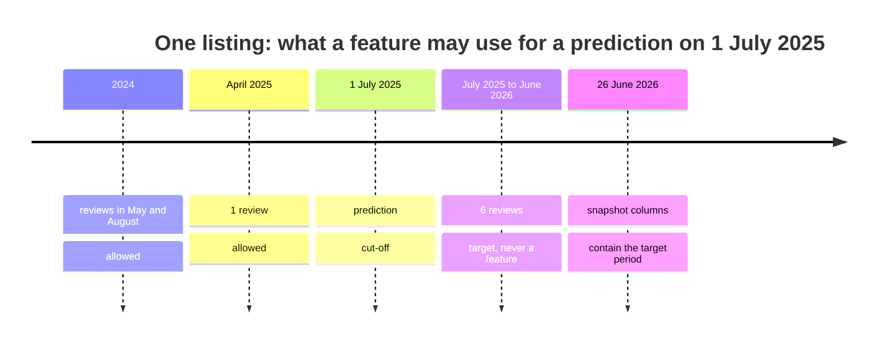
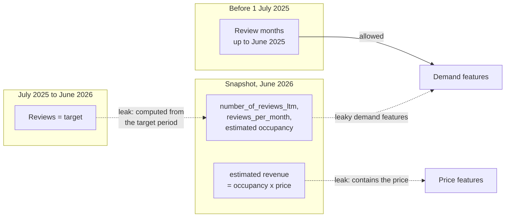

# Aggregates from joined tables, target leakage and text statistics

Many useful features do not sit in the row we predict on. They come from another table, grouped by a key and summarised: how many reviews a listing received in the last twelve months, how long ago its last review was, what similar listings in the neighbourhood cost. This page covers the second block of Session 9: how to compute such **aggregates** only from data that existed at the time of each prediction, how features **leak the target** when that rule is broken, and how simple statistics of a text become numeric features. The examples use the Inside Airbnb data for Berlin: the listings table and the monthly review counts per listing, a proxy for stays (snapshot of 26 June 2026).

> [!NOTE]
> The code blocks on this page build on each other. Run them in order from the repository root. They need `case-study/data/airbnb/` (`uv run python case-study/prepare_airbnb.py`). Review counts are a proxy for demand: not every guest writes a review, and the share who do may change over time.

## 1. Aggregates computed only from past data

### Concept

An **aggregate feature** summarises many rows of a joined table into one value per prediction row, for example a count, a mean, the most recent value or the time since the first event. The table `reviews_monthly` has one row per listing and month (226,557 rows since 2009). Grouped by listing it gives features such as "reviews in the last 12 months", "reviews in the last 3 months" or "months since the last review".

A practical question that needs them: **which listings will be busy next year?** A city office that monitors short-term rentals, or a cleaning company planning staff, wants to know this in advance. We place ourselves on 1 July 2025 and predict the number of reviews from July 2025 to June 2026.

The rule for a correct aggregate is: **use only rows that were known at the moment of the prediction**. A prediction made on 1 July 2025 may use the review months up to June 2025, never those from July 2025 onwards, because they are the target. Such features are called **point-in-time correct** or **as-of** features.

Worked example: one listing with reviews in five months.

| month | reviews | used for a prediction on 1 July 2025? |
|---|---|---|
| 2024-05 | 2 | yes (but not in "last 12 months") |
| 2024-08 | 3 | yes |
| 2025-04 | 1 | yes (also in "last 3 months") |
| 2025-09 | 4 | no: this is the target period |
| 2026-02 | 2 | no: this is the target period |

As of 1 July 2025: `rev_total` = 6, `rev_last12` = 4, `rev_last3` = 1, months since the last review ≈ 3. Target: 6 reviews. A "total number of reviews" taken from the June 2026 snapshot would say 12 and contain the target.



### Why it matters

At prediction time the model only knows the past. If the training features contain information from the future, the model learns a relationship that does not exist when it is used. Its validation score looks good; its real performance is worse.

### How it works in Python

Filter the joined table to the past, then group by the key:

```python
import json

import numpy as np
import pandas as pd
from sklearn.ensemble import HistGradientBoostingRegressor
from sklearn.model_selection import GroupKFold, cross_val_score

listings = pd.read_parquet("case-study/data/airbnb/listings.parquet")
reviews = pd.read_parquet("case-study/data/airbnb/reviews_monthly.parquet")   # one row per listing and month

cutoff = pd.Timestamp("2025-07-01")                                  # the moment of prediction
past = reviews[reviews["month"] < cutoff]                            # what was known then
future = reviews[(reviews["month"] >= cutoff) & (reviews["month"] < "2026-07-01")]

g = past.groupby("listing_id")
feat = pd.DataFrame({
    "rev_total": g["n_reviews"].sum(),
    "rev_last12": past[past["month"] >= cutoff - pd.DateOffset(months=12)].groupby("listing_id")["n_reviews"].sum(),
    "rev_last3": past[past["month"] >= cutoff - pd.DateOffset(months=3)].groupby("listing_id")["n_reviews"].sum(),
    "months_since_first": (cutoff - g["month"].min()).dt.days / 30.44,
    "months_since_last": (cutoff - g["month"].max()).dt.days / 30.44,
}).fillna({"rev_last12": 0, "rev_last3": 0})
demand = listings.set_index("id").join(feat, how="inner")            # listings with a review before the cut-off
demand["target"] = future.groupby("listing_id")["n_reviews"].sum().reindex(demand.index).fillna(0)
print(len(demand), demand["target"].median(), round((demand["target"] == 0).mean(), 3))   # 8775 3.0 0.371

y_d = np.log1p(demand["target"])                                     # log(1 + reviews in the next 12 months)
past_only = ["rev_total", "rev_last12", "rev_last3", "months_since_first", "months_since_last", "accommodates"]
gbm = HistGradientBoostingRegressor(random_state=0)
cv = GroupKFold(5)                                                   # whole hosts per fold (Session 7)
print(cross_val_score(gbm, demand[past_only], y_d, cv=cv, groups=demand["host_id"], scoring="r2").mean().round(3))
# 0.823
naive = np.log1p(demand["rev_last12"])                               # baseline: "next year = last year"
print(round(1 - ((y_d - naive) ** 2).sum() / ((y_d - y_d.mean()) ** 2).sum(), 3))            # 0.757
```

8,775 listings of the snapshot had at least one review before July 2025; 37 % of them received none in the following year. The past-only model explains 82 % of the variance of log(1 + reviews), against 76 % for the rule "next year = last year". The SQL version of such a feature (Session 3) is a filtered `GROUP BY`, or a window function such as `SUM(n_reviews) OVER (PARTITION BY listing_id ORDER BY month ROWS BETWEEN 12 PRECEDING AND 1 PRECEDING)`. When the history lives in a table with its own timestamps, `pd.merge_asof(left, right, on="date", by="key", allow_exact_matches=False)` joins, for each row, the latest history row strictly before it.

Two honest caveats. First, the snapshot only contains listings that still exist in June 2026; listings that left Airbnb during the year are missing, so the share of "no reviews next year" is underestimated (**survivorship bias**). Second, the second kind of aggregate, a summary of the **target** over a group (for example the median price of the neighbourhood), is target encoding (page 1): it must be computed on the training folds only.

### In practice

- Uber's machine-learning platform Michelangelo introduced a shared feature store in which aggregates such as "average meal preparation time of a restaurant over the last week" are computed once and reused for training and serving (Hermann & Del Balso, 2017).
- Open-source feature stores such as Feast offer *point-in-time joins* as a core operation: for each training row, they look up feature values as they were at that row's timestamp.
- Inside Airbnb itself derives "estimated occupancy" from review counts with stated assumptions (a review rate and an average length of stay); such derived columns are aggregates too, and Section 3 shows why they need care.

> [!WARNING]
> **Filter before you aggregate.** Write the cut-off as a variable and filter the joined table first (`reviews["month"] < cutoff`). Aggregating the whole table and "remembering" to ignore the recent part is how future rows slip in. For rolling features with `groupby(...).rolling(...)` or `cumsum`, sort by time first and shift by one period.

> [!TIP]
> A listing without any past review has no history. Keep such rows with a count of 0 and a separate indicator "no review yet" instead of dropping them; a model can learn from "no history".

## 2. Simple text statistics as features

### Concept

Until TF-IDF and embeddings (Sessions 13 and 14), a model cannot read a text. But simple counts already carry signal. A **text statistic** is any number computed from a string without a vocabulary, or with a short, fixed list of words chosen in advance. For the listing title (`name`, written by the host):

- length in characters, share of capital letters, number of digits
- whether the title mentions the floor area ("m²", "qm", "sqm"), luxury words ("luxury", "premium", "design"), or "cozy"-type words ("cozy", "cosy", "gemütlich", "small", "little")
- for the amenities list: the number of amenities

Worked example: the title `"Bright 2-room flat, 65 m², Mitte"` has 32 characters, 3 digits, 3 capital letters (share 0.09) and mentions the area.

### Why it matters

These features are cheap, transparent and available for every listing, including a new one: the host writes the title before the first guest arrives. They are also a first test of whether text helps at all before investing in a text model. Their limit is equally clear: statistics *about* a text cannot tell a loft from a shared room, which is why Session 13 uses the words themselves.

### How it works in Python

The price table of Sessions 7 and 9 and a compact feature set first, then the text statistics:

```python
bnb = listings[(listings["minimum_nights"] < 28) & listings["price"].between(10, 1000)].reset_index(drop=True)
bnb["dist_km"] = np.hypot((bnb["latitude"] - 52.5219) * 111.2, (bnb["longitude"] - 13.4132) * 68.0)
y = np.log(bnb["price"])
hosts = bnb["host_id"]
cols = ["accommodates", "bedrooms", "beds", "bathrooms", "dist_km", "room_type", "district",
        "review_scores_rating", "number_of_reviews", "minimum_nights", "availability_365"]
base = pd.get_dummies(bnb[cols], columns=["room_type", "district"], dtype=int)


def title_stats(title):
    """Statistics of the listing title, one row per listing (no vocabulary is learned)."""
    t = title.fillna("")
    return pd.DataFrame({
        "title_len": t.str.len(),
        "title_upper": t.str.count(r"[A-Z]") / t.str.len().clip(lower=1),
        "title_digits": t.str.count(r"\d"),
        "says_sqm": t.str.contains(r"m²|m2|qm|sqm", case=False).astype(int),
        "says_luxury": t.str.contains(r"luxur|premium|design", case=False).astype(int),
        "says_cozy": t.str.contains(r"cozy|cosy|gemütlich|small|little", case=False).astype(int),
    }, index=title.index)


text = title_stats(bnb["name"]).assign(n_amenities=bnb["amenities"].map(lambda s: len(json.loads(s))))
for col in ["says_sqm", "says_luxury", "says_cozy"]:
    print(col, int(text[col].sum()), bnb.groupby(text[col])["price"].median().round(0).to_dict())
# says_sqm 430 {0: 152.0, 1: 253.0}
# says_luxury 340 {0: 153.0, 1: 232.0}
# says_cozy 734 {0: 161.0, 1: 130.0}
for name, X in [("base", base), ("+ title and amenity count", pd.concat([base, text], axis=1))]:
    print(name, cross_val_score(gbm, X, y, cv=cv, groups=hosts, scoring="r2").mean().round(3))
# base 0.599
# + title and amenity count 0.613
```

Hosts who state the floor area or use luxury words ask for much higher prices (median €253 and €232 against about €152); "cozy" titles ask less (€130), often a polite word for small. Added to the price model, the seven statistics raise the host-grouped R² from 0.599 to 0.613. Part of this is size information that the size columns miss (`bedrooms` is missing for 21 % of the priced listings), part is the host's own positioning. Inside a pipeline, wrap the function in a `FunctionTransformer` (page 1, Section 5); because it uses only the row itself, it needs no fitting and cannot leak.

### In practice

- Readability formulas such as Flesch reading ease, built from word and sentence lengths, are used by public bodies to check that official texts are understandable; they are text statistics in the same sense.
- Spam filters used counts of capital letters, exclamation marks and links long before they used word models.

> [!WARNING]
> A statistic that differs between groups is not automatically useful, and it is not a cause. "Luxury" in the title does not make a flat more expensive; it marks flats that their hosts consider expensive. For a price model that is fine; for advice to hosts ("write *luxury* and earn more") it is not.

## 3. Target leakage through aggregates and late information

### Concept

**Target leakage** is the use of information that is not available at prediction time and is related to the target. Three typical forms:

1. **Columns derived from the target.** Inside Airbnb estimates each listing's occupancy from its reviews and computes `estimated_revenue_l365d` as occupancy × price. For a price model, a revenue feature contains the price.
2. **Aggregates that include the target period.** The snapshot columns `number_of_reviews_ltm` (reviews in the last twelve months), `reviews_per_month` and `estimated_occupancy_l365d` were computed in June 2026. For the demand question of Section 1 they cover exactly the period to be predicted. Even `availability_365` (free nights in the coming year, measured in June 2026) describes a time after the cut-off.
3. **Information written with or after the label**, such as a "reason for cancellation" in a churn table, or the written justification that accompanies an expert's decision (Session 13 meets one in the customs case study).

The result is a feature that is much more strongly related to the target in the training data than it will ever be at prediction time.



### Why it matters

Leakage is dangerous because it is silent: every number in the notebook improves. It only shows on truly new data, after deployment.

How to detect it:

- A feature, or a combination of features, that predicts "too well", or a permutation importance (Session 10) far above all others. Revenue alone explains less of the log price than the number of guests; only together with occupancy does it reveal the price, and permutation importance on held-out hosts shows it immediately (practice notebook).
- A large gap between the validation score and the score on data collected later.
- Asking for each feature: *at which moment would this value be known, and from which rows is it computed?* Read the data dictionary: Inside Airbnb documents how its derived columns are computed.

### How it works in Python

```python
occupied = bnb["estimated_occupancy_l365d"] > 0
ratio = bnb.loc[occupied, "estimated_revenue_l365d"] / bnb.loc[occupied, "estimated_occupancy_l365d"]
print(round(occupied.mean(), 3), round((np.abs(ratio / bnb.loc[occupied, "price"] - 1) < 0.01).mean(), 3))
# 0.871 1.0   <- for every listing with occupancy, revenue / occupancy is exactly the price
leaky = base.assign(revenue=bnb["estimated_revenue_l365d"], occupancy=bnb["estimated_occupancy_l365d"])
print(cross_val_score(gbm, leaky, y, cv=cv, groups=hosts, scoring="r2").mean().round(3))      # 0.874

snapshot_cols = ["number_of_reviews_ltm", "reviews_per_month", "estimated_occupancy_l365d"]
print(cross_val_score(gbm, demand[past_only + snapshot_cols], y_d, cv=cv, groups=demand["host_id"],
                      scoring="r2").mean().round(3))                                         # 0.999
print(round((demand["number_of_reviews_ltm"] == demand["target"]).mean(), 3))                # 0.842
print(cross_val_score(gbm, demand[past_only + ["availability_365", "minimum_nights"]], y_d, cv=cv,
                      groups=demand["host_id"], scoring="r2").mean().round(3))               # 0.851
```

| Question | Features | Host-grouped R² | Verdict |
|---|---|---|---|
| price | size, location, room type, reviews | 0.599 | honest |
| price | + estimated revenue and occupancy | 0.874 | leak: revenue ÷ occupancy is the price |
| demand next year | past-only review aggregates + size | 0.823 | honest |
| demand next year | + snapshot review columns | 0.999 | leak: `number_of_reviews_ltm` equals the target for 84 % of the listings |
| demand next year | + availability and minimum stay of June 2026 | 0.851 | subtle leak: measured after the cut-off |

The revenue feature lifts the price model from 0.60 to 0.87; a new listing has no revenue history, and an existing one has its revenue only *because* of its price. The snapshot review columns make the demand model almost perfect, because they count the very reviews we want to predict. The last row is the instructive one: availability looks like a harmless property of the listing, but in June 2026 it partly reflects whether the listing is still active, which is what the model is asked to predict. Three points of R² for a subtle leak is enough to change a model choice.

### In practice

- In the KDD Cup 2008 on breast-cancer detection, patient identifiers turned out to be predictive of the label because of how the data had been assembled; Rosset et al. (2010) and Kaufman et al. (2012) describe this and similar competition leaks.
- In credit-default prediction, features such as "number of collection letters" or "account status" are often recorded after the default happened and leak the label if the cut-off date is not respected.
- Kapoor and Narayanan (2023) reviewed published machine-learning studies in 17 scientific fields and found data leakage, including features with information from the future, among the main reasons for irreproducible results.

> [!CAUTION]
> **The case-study rules.** For a price model, never use `estimated_revenue_l365d` or `estimated_occupancy_l365d`. For any question with a cut-off date, build features from `reviews_monthly` filtered to the past, not from the snapshot columns `number_of_reviews_ltm`, `reviews_per_month` or `last_review`. The same check (does this column exist when the prediction is made?) applies to every project table.

> [!WARNING]
> Out-of-fold encoding (page 1) removes the row's own target but still uses future rows and other listings of the same host. With grouped or time-based validation this matters; prefer past-only aggregates for anything that has a timestamp.

## Practice

**Which listings will be busy next year, and which features would only look good?** In [06-case-study-airbnb-leakage.ipynb](../workbooks/06-case-study-airbnb-leakage.ipynb): build past-only demand features from `reviews_monthly` for a cut-off date, compare them with the leaky snapshot columns, detect the revenue leak in a price model with a "too good to be true" check and permutation importance, add title statistics, and decide which features may enter the price and demand models.

## Check your understanding

1. A listing has reviews in March 2025 (2), May 2025 (1) and August 2025 (3). For a prediction on 1 July 2025, what are `rev_total`, `rev_last3` and the target if the target is "reviews in the next 12 months"?
2. Why is `estimated_revenue_l365d` a leak for the price model, although it is a column of the same snapshot as the price?
3. In the table of five models, which row describes what a demand model would achieve when it is used in July 2025, and why?
4. Why is `availability_365` in the June 2026 snapshot a problem for a prediction made in July 2025, but not for a price model built on the snapshot itself?
5. Name one title statistic that you expect to differ between entire flats and private rooms, and how you would check it.

## Further reading

- Kaufman, S., Rosset, S., Perlich, C. & Stitelman, O. (2012). Leakage in data mining: formulation, detection, and avoidance. *ACM Transactions on Knowledge Discovery from Data*, 6(4), 15. https://doi.org/10.1145/2382577.2382579
- Kapoor, S. & Narayanan, A. (2023). Leakage and the reproducibility crisis in machine-learning-based science. *Patterns*, 4(9), 100804. https://doi.org/10.1016/j.patter.2023.100804
- Inside Airbnb (2026). *Data assumptions* (how occupancy and revenue are estimated). https://insideairbnb.com/data-assumptions/
- Feast authors (2025). *Point-in-time joins*. Feast documentation. https://docs.feast.dev/getting-started/concepts/point-in-time-joins
