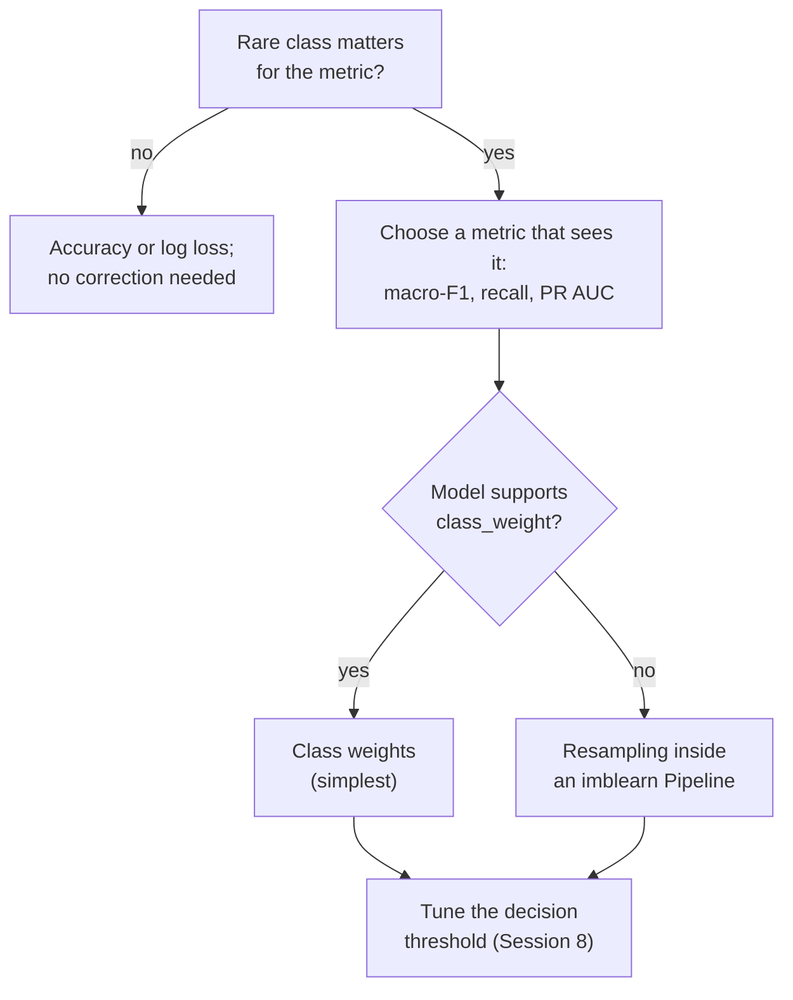
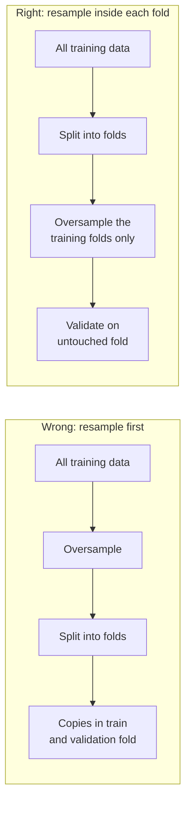

# Class imbalance: resampling and class weights

A classification problem is **imbalanced** when some classes are much rarer than others. The retention team of the telecom company (Session 8) meets the problem directly: 1,869 of the 7,043 IBM Telco customers (26.5 %) left, a model trained on these data predicts "stays" most of the time, and the customers the team most wants to find are the ones the model misses. Fraud, machine failures and rare diseases are far more extreme (often well below 1 %), but the methods and the lessons are the same.

This page covers the third block of Session 9: why accuracy misleads on such data, the two simplest remedies (random undersampling and oversampling), synthetic oversampling with SMOTE, class weights as an alternative, and the rule that resampling happens only on the training folds of a cross-validation, which the pipelines of the imbalanced-learn library enforce. Session 8 introduced precision, recall, F1, macro-F1 and cost-based thresholds; they are the measures used here.

> [!NOTE]
> The code blocks on this page build on each other. Run them in order from the repository root. They need the package `imbalanced-learn` (imported as `imblearn`), which is part of the course environment.



## 1. Class imbalance and why accuracy misleads

### Concept

**Accuracy** is the share of correct predictions. On imbalanced data a model can reach a high accuracy while ignoring the rare class: "nobody churns" is right for 73.5 % of the Telco customers. **Recall** of the rare class and **macro-F1** (the unweighted mean of the per-class F1 values, Session 8) expose this, because the rare class counts as much as the frequent one. With many classes the effect is spread over a long tail of rare classes; Session 13 meets a task with more than 1,000 classes.

A learning algorithm that minimises the average loss over all rows behaves similarly: a rare class contributes few rows to the loss, so the model gains little by getting it right.

Worked example with 100 cases in three classes (80 of A, 15 of B, 5 of C) and the rule "always A":

| | precision | recall | F1 |
|---|---|---|---|
| A | 80/100 = 0.80 | 80/80 = 1.00 | 0.89 |
| B | – (never predicted) | 0/15 = 0 | 0 |
| C | – | 0/5 = 0 | 0 |

Accuracy is 0.80, macro-F1 is 0.89/3 = 0.30.

### Why it matters

Imbalanced problems are the rule in practice: fraud, machine failures, diseases, churn and complaints are all rare compared with normal cases, and in classification problems with many classes most classes are rare. A metric that rewards ignoring them leads to models that look good in a report and fail at the job they were built for.

### How it works in Python

```python
import numpy as np
import pandas as pd
from sklearn.compose import make_column_transformer
from sklearn.linear_model import LogisticRegression
from sklearn.metrics import accuracy_score, f1_score, recall_score
from sklearn.model_selection import StratifiedKFold, cross_val_predict
from sklearn.pipeline import make_pipeline
from sklearn.preprocessing import OneHotEncoder, StandardScaler

URL = "https://raw.githubusercontent.com/IBM/telco-customer-churn-on-icp4d/master/data/Telco-Customer-Churn.csv"
telco = pd.read_csv(URL)
telco["TotalCharges"] = pd.to_numeric(telco["TotalCharges"], errors="coerce").fillna(0)
y_churn = (telco["Churn"] == "Yes").astype(int)                   # 1 = customer left
X_churn = telco.drop(columns=["customerID", "Churn"])
cat_cols = X_churn.select_dtypes("object").columns.tolist()          # 15 categorical columns
print(y_churn.value_counts().to_dict(), round(y_churn.mean(), 3))  # {0: 5174, 1: 1869} 0.265

prep = make_column_transformer((OneHotEncoder(handle_unknown="ignore", sparse_output=False), cat_cols),
                               remainder=StandardScaler())
cv = StratifiedKFold(5, shuffle=True, random_state=0)


def report(name, pred):
    print(f"{name:20s} accuracy {accuracy_score(y_churn, pred):.3f}  recall of churners {recall_score(y_churn, pred):.3f}  "
          f"macro-F1 {f1_score(y_churn, pred, average='macro'):.3f}")


report("nobody churns", np.zeros(len(y_churn), dtype=int))
plain = make_pipeline(prep, LogisticRegression(max_iter=2000))
report("logistic regression", cross_val_predict(plain, X_churn, y_churn, cv=cv))     # threshold 0.5
# nobody churns        accuracy 0.735  recall of churners 0.000  macro-F1 0.424
# logistic regression  accuracy 0.803  recall of churners 0.546  macro-F1 0.733
```

The logistic regression is 80 % accurate, only 7 points above "nobody churns", and at the default threshold it finds 55 % of the churners: almost every second customer who leaves is missed.

### In practice

- In the credit-card fraud dataset of the Université Libre de Bruxelles and Worldline (Dal Pozzolo et al., 2015), 492 of 284,807 transactions are fraudulent (0.17 %). A model that never flags fraud is 99.8 % accurate.
- Coding tasks with large nomenclatures, such as assigning ICD diagnosis codes to clinical notes or occupation codes to survey answers, have a long tail of rare codes; their evaluations report micro- and macro-averaged scores side by side.

> [!WARNING]
> Before correcting imbalance, ask whether the rare classes matter for the decision. If you need well-calibrated probabilities, for example to forecast the number of churners or to tell a patient their risk, any correction distorts them (van den Goorbergh et al., 2022). Then fit without correction and choose the decision threshold from the costs instead (Session 8).

## 2. Random undersampling and oversampling

### Concept

**Resampling** changes the class proportions of the *training* data before the model is fitted.

- **Random undersampling** deletes randomly chosen rows of the frequent classes until each class has as many rows as the rarest one (or a chosen ratio). In the churn data, full undersampling keeps the 1,869 churners and 1,869 of the 5,174 loyal customers: 3,738 of 7,043 rows.
- **Random oversampling** duplicates randomly chosen rows of the rare classes until they are as frequent as the largest class: 5,174 churners, 3,305 of them copies, 10,348 rows in total.

Both make the classes equally important in the training loss. Undersampling throws away information but makes training faster; oversampling keeps all information but repeats rows, which encourages flexible models to memorise them.

### Why it matters

A model trained on balanced data predicts the rare classes much more often. It finds more of them (higher recall) at the price of more false alarms (lower precision). Whether that improves F1 or macro-F1 depends on how separable the rare classes are, and on what the decision rule was before.

### How it works in Python

```python
from collections import Counter

from imblearn.over_sampling import RandomOverSampler
from imblearn.under_sampling import RandomUnderSampler

for sampler in [RandomUnderSampler(random_state=0), RandomOverSampler(random_state=0)]:
    X_res, y_res = sampler.fit_resample(X_churn, y_churn)          # samplers have fit_resample, not transform
    print(type(sampler).__name__, dict(Counter(y_res)))
# RandomUnderSampler {0: 1869, 1: 1869}
# RandomOverSampler {0: 5174, 1: 5174}
```

`sampling_strategy` controls the target proportions, for example `RandomOverSampler(sampling_strategy=0.5)` raises the churners to half the number of loyal customers. With many classes, a dictionary such as `{class: max(count, 20)}` lifts every rare class to at least 20 rows, a gentler choice than full balancing. The samplers are only used in `fit_resample` on training data; they have no `transform` method, so they cannot be applied to test data by accident. Random samplers work on any column type, text and categories included, because they only copy or drop whole rows.

### In practice

- Large advertising platforms subsample the very frequent "no click" events before training click-through models; He et al. (2014) describe negative downsampling for Facebook's ad-click prediction and how to correct the predicted probabilities afterwards.
- In medical imaging studies with few positive cases, oversampling of the positive images during training is a common default.

> [!WARNING]
> Undersampling to the size of a very small class leaves too few rows for the others. With 492 frauds among 284,807 card transactions (Section 1), full undersampling would train on 984 rows. Use a partial ratio, oversampling, or class weights instead.

## 3. Synthetic oversampling (SMOTE)

### Concept

**SMOTE** (Synthetic Minority Over-sampling Technique; Chawla et al., 2002) creates *new* minority rows instead of copying existing ones. For each new row it

1. picks a minority row **x**,
2. finds its *k* nearest minority neighbours (default *k* = 5) and picks one of them, **x_nn**,
3. places the new row at a random point on the line between them: **x_new = x + λ · (x_nn − x)**, with λ drawn uniformly between 0 and 1.

Worked example in two features: x = (2, 3), x_nn = (4, 7), λ = 0.25 gives x_new = (2 + 0.25 · 2, 3 + 0.25 · 4) = (2.5, 4.0).


### Why it matters

Synthetic rows fill the region of the minority class instead of stacking copies on single points, so a flexible model is less tempted to memorise individual rows. SMOTE became the best-known imbalance method; many variants (Borderline-SMOTE, ADASYN, SMOTE-NC for categorical features) build on it.

### How it works in Python

Plain `SMOTE` needs numeric features. The churn table mixes numbers (tenure, charges) with categories (contract, internet service, payment method); `SMOTENC` interpolates the numeric columns and gives each synthetic row the most frequent category among the neighbours:

```python
from imblearn.over_sampling import SMOTENC

X_sm, y_sm = SMOTENC(categorical_features=cat_cols, random_state=0).fit_resample(X_churn, y_churn)
print(dict(Counter(y_sm)), len(X_sm) - len(X_churn))                 # {0: 5174, 1: 5174} 3305 invented customers
print(X_sm.iloc[-1][["tenure", "MonthlyCharges", "TotalCharges", "Contract", "InternetService"]].to_dict())
```

The last line prints one invented customer: a plausible combination of a short tenure, interpolated charges and categories taken from real churners. SMOTE needs at least *k* + 1 rows per class: with `k_neighbors=5`, a class with 5 rows or fewer raises an error. In a task with many rare classes, SMOTE therefore cannot be applied to the rarest ones without grouping them or lowering *k*. And SMOTE works on numbers: it cannot interpolate between two texts, only between numeric representations of them, and a synthetic point corresponds to no real document. Because SMOTE uses distances, scale the numeric features first: unscaled, `TotalCharges` (up to about 8,700) dominates `tenure` (up to 72). For purely categorical data use `SMOTEN`.

### In practice

- Chawla et al. (2002) evaluated SMOTE on, among others, a mammography dataset for detecting calcifications, in which the positive class is a small minority.
- Later studies are more sceptical: Elor and Averbuch-Elor (2022) compared SMOTE and other balancing methods across many datasets and found that strong classifiers such as gradient boosting rarely profit from them compared with tuning the decision threshold.

> [!CAUTION]
> SMOTE invents data. In high dimensions (for example thousands of TF-IDF columns) "between two neighbours" has little meaning, and synthetic rows can fall into regions that belong to another class. Always compare against class weights and against no correction.

## 4. Class weights as an alternative

### Concept

A **class weight** multiplies the loss of every row of a class by a constant. With weights the training data stay unchanged, but an error on a rare row counts more. The common choice `class_weight="balanced"` gives each class the weight

w_c = n / (K · n_c),

with *n* rows, *K* classes and *n_c* rows in class *c*. Every class then contributes the same total weight. For the churn data (n = 7,043, K = 2): churners get 7,043 / (2 · 1,869) = 1.88, loyal customers 7,043 / (2 · 5,174) = 0.68. In the card-fraud data of Section 1 (492 frauds among 284,807 transactions) a fraud gets 284,807 / (2 · 492) ≈ 289: every fraud then counts like 289 normal transactions, and a few unusual frauds can pull the model around.

For a model that minimises a weighted loss, weighting is closely related to oversampling (a weight of 1.88 acts like 1.88 copies of the row), but it needs no extra rows, no randomness and no new library.

### Why it matters

Class weights are supported by most scikit-learn classifiers (`LogisticRegression`, `SGDClassifier`, `RandomForestClassifier`, `HistGradientBoostingClassifier`) and by XGBoost, LightGBM and CatBoost (Session 10). They are usually the first thing to try. Custom weights can also express costs: if missing a churner costs five times as much as a wasted retention call, choose weights in that ratio.

### How it works in Python

```python
from sklearn.utils.class_weight import compute_class_weight

print(compute_class_weight("balanced", classes=np.array([0, 1]), y=y_churn).round(3))   # [0.681 1.884]

weighted = make_pipeline(prep, LogisticRegression(max_iter=2000, class_weight="balanced"))
report("balanced weights", cross_val_predict(weighted, X_churn, y_churn, cv=cv))
# balanced weights     accuracy 0.748  recall of churners 0.803  macro-F1 0.719
```

With balanced weights the model finds 80 % of the churners instead of 55 %, but its accuracy falls by 5 points and its macro-F1 by 0.014: more churners are found at the price of many more false alarms. Weights are not a free improvement; they must be validated like any other setting, and with very large weights (the fraud example) they can make a model worse.

### In practice

- King and Zeng (2001) showed for rare events in political science (wars, coups) that logistic regression underestimates their probability, and proposed weighting and correction methods that are still used.
- XGBoost's documentation recommends the parameter `scale_pos_weight` (the ratio of negative to positive rows) for imbalanced binary problems such as fraud and churn.

> [!WARNING]
> Weighted models produce shifted probabilities. Use them for ranking and for decisions at a tuned threshold, not as calibrated probabilities, or recalibrate them on validation data (Session 8).

## 5. Resampling inside the cross-validation only

### Concept

Resampling is part of *training*. It must be applied to the training folds of each cross-validation split, never to the validation fold and never to the test data. Two reasons:

1. **The validation data must look like reality.** Real customers churn at 26.5 %; a balanced validation set (50 %) makes every churn alarm look twice as likely to be right and gives a misleading estimate of precision.
2. **Oversampling before splitting leaks.** If a duplicated (or SMOTE-interpolated) row lands in the training fold and its original in the validation fold, the model is tested on rows it has already seen.



### Why it matters

The effect is not small. With a random forest, which can memorise individual rows, oversampling before cross-validation inflates the apparent F1 of the churn class:

### How it works in Python

```python
from imblearn.pipeline import make_pipeline as make_imb_pipeline
from sklearn.ensemble import RandomForestClassifier
from sklearn.model_selection import cross_val_score

rf = RandomForestClassifier(n_estimators=200, random_state=0, n_jobs=-1)
X_dummies = pd.get_dummies(X_churn, dtype=int)                                     # the forest needs numbers

X_over, y_over = RandomOverSampler(random_state=0).fit_resample(X_dummies, y_churn)  # WRONG: before the split
wrong = cross_val_score(rf, X_over, y_over, cv=cv, scoring="f1").mean()

pipe = make_imb_pipeline(RandomOverSampler(random_state=0), rf)                     # RIGHT: inside each fold
right = cross_val_score(pipe, X_dummies, y_churn, cv=cv, scoring="f1").mean()
print(round(wrong, 3), round(right, 3))              # 0.899 0.577
```

0.899 is an illusion: the forest recognises copies of churners it has seen in training. 0.577 is the honest estimate, only a little above the forest without any correction (0.545 in our run).

### In practice

- Santos et al. (2018) reviewed studies that combined oversampling with cross-validation and showed that oversampling before the split leads to over-optimistic results; they found this mistake in published work.
- The imbalanced-learn user guide has a page on common pitfalls whose main example is data leakage from resampling before splitting, with the pipeline solution shown in the next section.

> [!CAUTION]
> The same rule applies to the test set: never resample, deduplicate by label or reweight the data you evaluate on. Resampling is a training technique, not a data-cleaning step.

## 6. Pipelines with imbalanced-learn

### Concept

scikit-learn's `Pipeline` only knows transformers (`fit`/`transform`) and a final estimator. A sampler changes the number of rows, which a transformer may not do. imbalanced-learn therefore provides its own `Pipeline` (`imblearn.pipeline.Pipeline` and `make_pipeline`) that accepts samplers as steps. It calls `fit_resample` on samplers **only during `fit`**; during `predict` and `score` the samplers are skipped. Combined with `cross_validate` or `GridSearchCV`, every training fold is resampled and every validation fold stays untouched.

### Why it matters

With one pipeline object, comparing methods is a loop over candidates, and the sampling ratio or SMOTE's *k* can be tuned like any hyperparameter (`smote__k_neighbors`). The pipeline also documents the decision: whoever loads the model can see that it was trained with SMOTE.

### How it works in Python

Five strategies for the churn model, plus the alternative of Session 8: no correction, but a lower decision threshold.

```python
from imblearn.over_sampling import SMOTE
from sklearn.metrics import average_precision_score, precision_score, roc_auc_score


def logreg(class_weight=None):
    return LogisticRegression(max_iter=2000, class_weight=class_weight)


candidates = {
    "no correction": make_imb_pipeline(prep, logreg()),
    "undersampling": make_imb_pipeline(prep, RandomUnderSampler(random_state=0), logreg()),
    "oversampling": make_imb_pipeline(prep, RandomOverSampler(random_state=0), logreg()),
    "SMOTE": make_imb_pipeline(prep, SMOTE(random_state=0), logreg()),
    "class weights": make_imb_pipeline(prep, logreg("balanced")),
}


def scores(name, proba, threshold=0.5):
    pred = (proba >= threshold).astype(int)
    return {"method": name, "accuracy": accuracy_score(y_churn, pred), "precision": precision_score(y_churn, pred),
            "recall": recall_score(y_churn, pred), "f1": f1_score(y_churn, pred),
            "roc_auc": roc_auc_score(y_churn, proba), "pr_auc": average_precision_score(y_churn, proba)}


rows, probas = [], {}
for name, model in candidates.items():
    probas[name] = cross_val_predict(model, X_churn, y_churn, cv=cv, method="predict_proba")[:, 1]  # samplers: training folds only
    rows.append(scores(name, probas[name]))
rows.append(scores("threshold 0.3", probas["no correction"], threshold=0.3))        # no correction, lower threshold
print(pd.DataFrame(rows).set_index("method").round(3).to_string())
#                accuracy  precision  recall     f1  roc_auc  pr_auc
# method
# no correction     0.803      0.656   0.546  0.596    0.845   0.653
# undersampling     0.748      0.516   0.805  0.628    0.844   0.644
# oversampling      0.746      0.514   0.805  0.627    0.845   0.651
# SMOTE             0.754      0.523   0.800  0.633    0.845   0.652
# class weights     0.748      0.516   0.803  0.628    0.845   0.651
# threshold 0.3     0.766      0.542   0.769  0.636    0.845   0.653
```


An honest result. Every correction does what it promises: the recall of churners rises from 0.55 to about 0.80, at the price of precision (0.66 → 0.52) and accuracy (0.80 → 0.75). F1 of the churn class rises a little (0.60 → about 0.63). But ROC AUC and PR AUC do not change: the corrections do not make the model *rank* customers better, they only move the point at which it says "churn". Lowering the threshold of the uncorrected model to 0.3 reaches the same place (F1 0.636) without resampling, without invented customers and with probabilities that keep their meaning. SMOTE is not better than simply copying churners. For the churn task, the recommendation is: no resampling, choose the threshold from the costs of a missed churner and a wasted retention offer (Session 8).

### In practice

- The imbalanced-learn library (Lemaître, Nogueira & Aridas, 2017) is a scikit-learn-contrib project under the MIT licence and the standard Python implementation of these methods; its examples compare samplers in pipelines as above.
- The KEEL repository distributes imbalanced benchmark datasets with predefined five-fold partitions, so that resampling methods are compared on identical test folds that no method has touched.

> [!TIP]
> Report per-class precision and recall next to F1 or macro-F1. "With class weights we find 80 % of the churners instead of 55 %, but only half of the customers we call would have left" tells a retention team what the model does; "F1 rose by 0.03" does not.

## Practice

**Which strategy catches Telco churners best, and at what cost?** In [13-case-study-imbalance.ipynb](../workbooks/13-case-study-imbalance.ipynb) you compare undersampling, oversampling, SMOTE (SMOTENC), class weights and a tuned threshold inside imbalanced-learn pipelines, with a logistic regression and a random forest; you report precision, recall, F1 and PR AUC, and the cost of a retention campaign with the costs of Session 8.

## Check your understanding

1. A test set has 95 % of class A and 5 % of class B. What accuracy and what macro-F1 does the rule "always A" reach?
2. Compute the balanced class weights for 900 rows of class A and 100 rows of class B.
3. SMOTE combines x = (1, 1) and its neighbour x_nn = (3, 5) with λ = 0.5. Where is the new point?
4. Why did oversampling before cross-validation give an F1 of 0.90 instead of 0.58 with a random forest?
5. Why did all corrections leave the ROC AUC of the churn model unchanged, and what does that suggest about the alternative of moving the threshold? Why can SMOTE with `k_neighbors=5` not be applied to a class with 4 rows?

## Further reading

- Lemaître, G., Nogueira, F. & Aridas, C. K. (2017). Imbalanced-learn: a Python toolbox to tackle the curse of imbalanced datasets in machine learning. *Journal of Machine Learning Research*, 18(17), 1–5. https://jmlr.org/papers/v18/16-365.html
- imbalanced-learn developers (2025). *Common pitfalls and recommended practices*. imbalanced-learn user guide. https://imbalanced-learn.org/stable/common_pitfalls.html
- Chawla, N. V., Bowyer, K. W., Hall, L. O. & Kegelmeyer, W. P. (2002). SMOTE: synthetic minority over-sampling technique. *Journal of Artificial Intelligence Research*, 16, 321–357. https://doi.org/10.1613/jair.953
- van den Goorbergh, R., van Smeden, M., Timmerman, D. & Van Calster, B. (2022). The harm of class imbalance corrections for risk prediction models. *Journal of the American Medical Informatics Association*, 29(9), 1525–1534. https://doi.org/10.1093/jamia/ocac093
