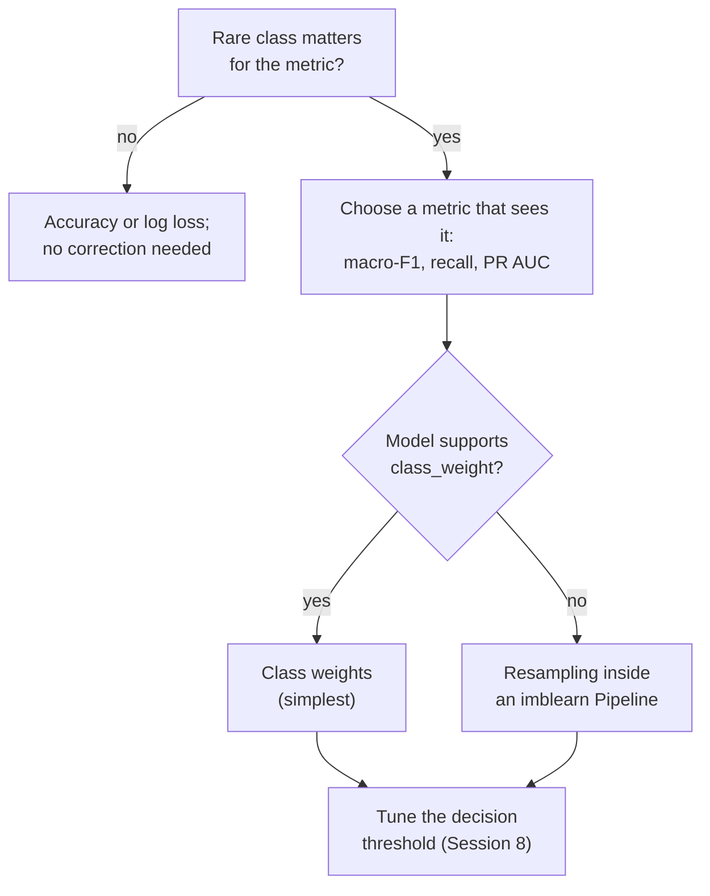
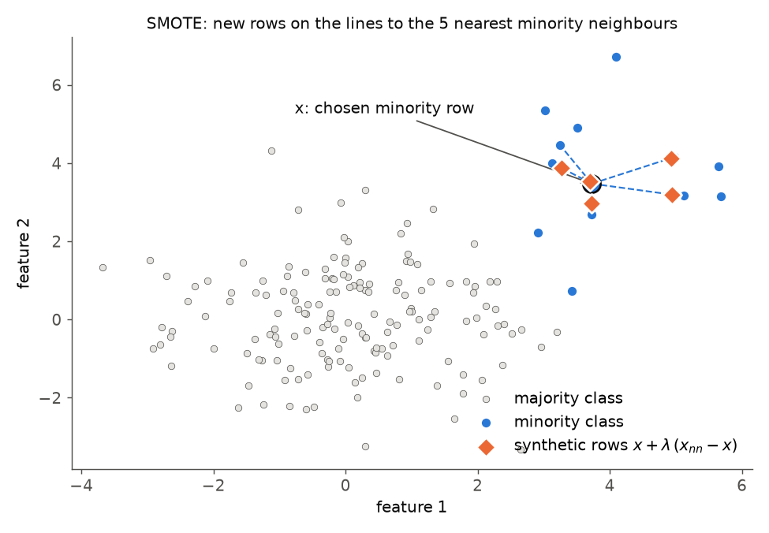
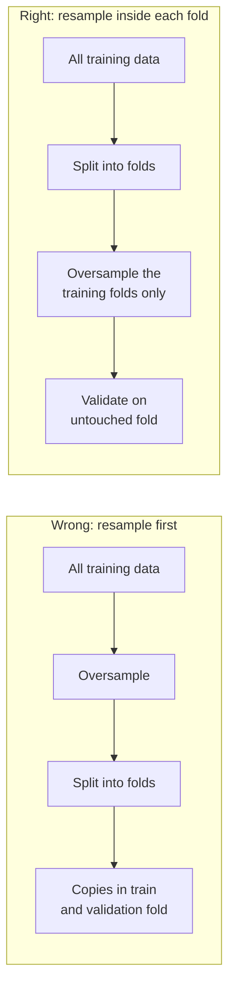
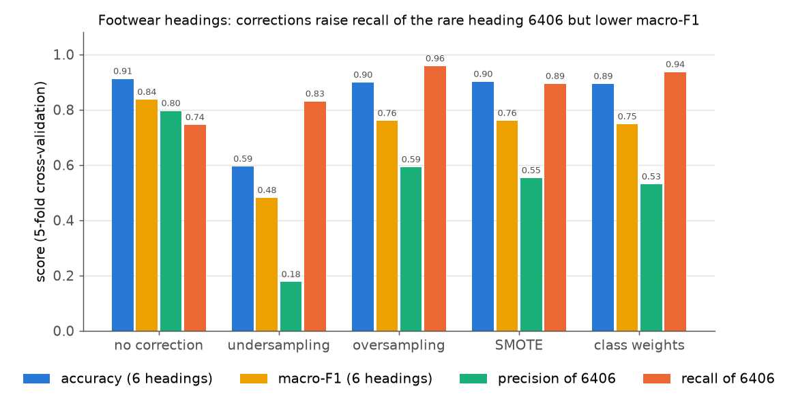

# Class imbalance: resampling and class weights

A classification problem is **imbalanced** when some classes are much rarer than others. The case study is an extreme case: 1,114 headings, of which the most frequent (3926, other articles of plastics) has 4.2 % of the decisions, while 115 headings occur only once in the 50,000-decision sample. This page covers the third block of Session 9: why accuracy misleads on such data, the two simplest remedies (random undersampling and oversampling), synthetic oversampling with SMOTE, class weights as an alternative, and the rule that resampling happens only on the training folds of a cross-validation, which the pipelines of the imbalanced-learn library enforce. Session 8 introduced precision, recall, F1 and macro-F1; they are the measures used here.

Two tasks serve as examples. The **long tail** of the full heading task (Sections 1, 4 and 6) uses a linear classifier on the TF-IDF matrix of the descriptions (Session 13 explains TF-IDF; here it is a black box that turns text into numbers). The **footwear task** (Sections 2, 3, 5 and 6) is a small, classic imbalanced problem: among the 1,819 sample decisions of chapter 64, predict one of six headings, where 6401 (waterproof footwear) has 9 decisions and 6406 (parts of footwear) 47, against 612 for 6403 (leather uppers).

> [!NOTE]
> The code blocks on this page build on each other. Run them in order from the repository root. They need the package `imbalanced-learn` (imported as `imblearn`), which is part of the course environment.



## 1. Class imbalance and why accuracy misleads

### Concept

**Accuracy** is the share of correct predictions. On imbalanced data a model can reach a high accuracy while ignoring the rare classes. With many classes, the effect is spread over the long tail: a classifier that is good on the 100 most frequent headings and never predicts the rare ones can have a high accuracy and a low **macro-F1** (the unweighted mean of the per-class F1 values), because each of the hundreds of rare headings counts as much as 3926.

A learning algorithm that minimises the average loss over all rows behaves similarly: a rare class contributes few rows to the loss, so the model gains little by getting it right.

Worked example with 100 decisions in three headings (80 of A, 15 of B, 5 of C) and the rule "always A":

| | precision | recall | F1 |
|---|---|---|---|
| A | 80/100 = 0.80 | 80/80 = 1.00 | 0.89 |
| B | – (never predicted) | 0/15 = 0 | 0 |
| C | – | 0/5 = 0 | 0 |

Accuracy is 0.80, macro-F1 is 0.89/3 = 0.30.

### Why it matters

Imbalanced problems are the rule in practice: fraud, machine failures, diseases, churn and complaints are all rare compared with normal cases, and in classification problems with many classes most classes are rare. A metric that rewards ignoring them leads to models that look good in a report. The leaderboard therefore reports macro-F1 next to accuracy.

### How it works in Python

```python
import numpy as np
import pandas as pd
from sklearn.feature_extraction.text import TfidfVectorizer
from sklearn.linear_model import SGDClassifier
from sklearn.metrics import accuracy_score, f1_score

decisions = pd.read_parquet("case-study/data/train_sample.parquet")
counts = decisions["heading"].value_counts()
print(len(counts), counts.head(3).to_dict(), (counts == 1).sum(), (counts < 20).sum())
# 934 {'3926': 2009, '9503': 1424, '6307': 1374} 115 588
print(round(counts.head(10).sum() / len(decisions), 3))           # 0.236: ten headings, a quarter of the rows

fit = (decisions["start_date"] < "2022-01-01").to_numpy()          # fit 2017-2021, validate 2022-2023
val, y = ~fit, decisions["heading"].to_numpy()
tfidf = TfidfVectorizer(ngram_range=(1, 2), min_df=2, sublinear_tf=True)
X_fit = tfidf.fit_transform(decisions.loc[fit, "description"])
X_val = tfidf.transform(decisions.loc[val, "description"])


def report(name, pred):
    print(f"{name:16s} accuracy {accuracy_score(y[val], pred):.3f}  "
          f"macro-F1 {f1_score(y[val], pred, average='macro', zero_division=0):.3f}")


report("always 3926", np.repeat("3926", val.sum()))
linear = SGDClassifier(loss="hinge", alpha=1e-5, random_state=0, n_jobs=-1).fit(X_fit, y[fit])
report("linear model", linear.predict(X_val))
# always 3926      accuracy 0.040  macro-F1 0.000
# linear model     accuracy 0.766  macro-F1 0.498
```

588 of the 934 headings in the sample have fewer than 20 decisions. The linear model is right for 77 % of the 2022–2023 decisions, but its macro-F1 is only 0.50: on many rare headings it is often wrong or never right.

### In practice

- In the credit-card fraud dataset of the Université Libre de Bruxelles and Worldline (Dal Pozzolo et al., 2015), 492 of 284,807 transactions are fraudulent (0.17 %). A model that never flags fraud is 99.8 % accurate.
- Coding tasks with large nomenclatures, such as assigning ICD diagnosis codes to clinical notes or occupation codes to survey answers, have the same long tail as the HS headings; their evaluations report micro- and macro-averaged scores side by side.

> [!WARNING]
> Before correcting imbalance, ask whether the rare classes matter for the decision. If you need well-calibrated probabilities, for example to decide when a customs officer should check a prediction, any correction distorts them (van den Goorbergh et al., 2022). Then fit without correction and choose the decision threshold from the costs instead (Session 8).

## 2. Random undersampling and oversampling

### Concept

**Resampling** changes the class proportions of the *training* data before the model is fitted.

- **Random undersampling** deletes randomly chosen rows of the frequent classes until each class has as many rows as the rarest one (or a chosen ratio). In the footwear task the rarest heading has 9 decisions, so full undersampling keeps 6 × 9 = 54 of 1,819 rows.
- **Random oversampling** duplicates randomly chosen rows of the rare classes until they are as frequent as the largest class: 6 × 612 = 3,672 rows, many of them exact copies.

Both make the classes equally important in the training loss. Undersampling throws away information but makes training faster; oversampling keeps all information but repeats rows, which encourages flexible models to memorise them.

### Why it matters

A model trained on balanced data predicts the rare classes much more often. It finds more of them (higher recall) at the price of more false alarms (lower precision). Whether that improves macro-F1 depends on how separable the rare classes are.

### How it works in Python

The footwear decisions are turned into 50 dense numbers each: character n-gram TF-IDF compressed with truncated SVD (Sessions 11 and 13).

```python
from collections import Counter

from imblearn.over_sampling import RandomOverSampler
from imblearn.under_sampling import RandomUnderSampler
from sklearn.decomposition import TruncatedSVD

shoes = decisions[decisions["chapter"] == "64"].reset_index(drop=True)
y_shoes = shoes["heading"]
print(y_shoes.value_counts().to_dict())
# {'6403': 612, '6404': 590, '6402': 312, '6405': 249, '6406': 47, '6401': 9}
char_tfidf = TfidfVectorizer(analyzer="char_wb", ngram_range=(3, 5), min_df=3, sublinear_tf=True)
X_shoes = pd.DataFrame(TruncatedSVD(50, random_state=0).fit_transform(char_tfidf.fit_transform(shoes["description"])),
                       columns=[f"svd{i}" for i in range(50)])

for sampler in [RandomUnderSampler(random_state=0), RandomOverSampler(random_state=0)]:
    X_res, y_res = sampler.fit_resample(X_shoes, y_shoes)   # samplers have fit_resample, not transform
    print(type(sampler).__name__, dict(sorted(Counter(y_res).items())))
# RandomUnderSampler {'6401': 9, '6402': 9, '6403': 9, '6404': 9, '6405': 9, '6406': 9}
# RandomOverSampler {'6401': 612, '6402': 612, '6403': 612, '6404': 612, '6405': 612, '6406': 612}
```

`sampling_strategy` controls the target proportions, for example `RandomOverSampler(sampling_strategy={"6401": 100})` raises only 6401 to 100 rows. For the long tail of the full task, a dictionary that lifts every heading to at least 20 rows is a gentler choice than full balancing (Section 6). The samplers are only used in `fit_resample` on training data; they have no `transform` method, so they cannot be applied to test data by accident.

### In practice

- Large advertising platforms subsample the very frequent "no click" events before training click-through models; He et al. (2014) describe negative downsampling for Facebook's ad-click prediction and how to correct the predicted probabilities afterwards.
- In medical imaging studies with few positive cases, oversampling of the positive images during training is a common default.

> [!WARNING]
> Undersampling to the size of a very small class leaves too few rows for the others: here 54 rows for six headings. Use a partial ratio, oversampling, or class weights instead.

## 3. Synthetic oversampling (SMOTE)

### Concept

**SMOTE** (Synthetic Minority Over-sampling Technique; Chawla et al., 2002) creates *new* minority rows instead of copying existing ones. For each new row it

1. picks a minority row **x**,
2. finds its *k* nearest minority neighbours (default *k* = 5) and picks one of them, **x_nn**,
3. places the new row at a random point on the line between them: **x_new = x + λ · (x_nn − x)**, with λ drawn uniformly between 0 and 1.

Worked example in two features: x = (2, 3), x_nn = (4, 7), λ = 0.25 gives x_new = (2 + 0.25 · 2, 3 + 0.25 · 4) = (2.5, 4.0).



### Why it matters

Synthetic rows fill the region of the minority class instead of stacking copies on single points, so a flexible model is less tempted to memorise individual rows. SMOTE became the best-known imbalance method; many variants (Borderline-SMOTE, ADASYN, SMOTE-NC for categorical features) build on it.

### How it works in Python

```python
from imblearn.over_sampling import SMOTE

X_sm, y_sm = SMOTE(k_neighbors=5, random_state=0).fit_resample(X_shoes, y_shoes)
print(dict(sorted(Counter(y_sm).items())))           # every heading now has 612 rows
new_rows = X_sm.iloc[len(X_shoes):]                  # synthetic rows are appended at the end
print(len(new_rows))                                 # 1853 invented decisions
```

SMOTE needs at least *k* + 1 rows per class: with `k_neighbors=5`, a heading with 5 decisions or fewer raises an error. In the full heading task 333 headings of the sample have 5 or fewer decisions, so SMOTE cannot even be applied to the long tail without grouping or a smaller *k*. And SMOTE works on numbers: it cannot interpolate between two descriptions, only between their 50 SVD coordinates. A synthetic "decision" is a point in that space that corresponds to no text. For categorical features use `SMOTENC` or `SMOTEN`; because SMOTE uses distances, scale the features first.

### In practice

- Chawla et al. (2002) evaluated SMOTE on, among others, a mammography dataset for detecting calcifications, in which the positive class is a small minority.
- Later studies are more sceptical: Elor and Averbuch-Elor (2022) compared SMOTE and other balancing methods across many datasets and found that strong classifiers such as gradient boosting rarely profit from them compared with tuning the decision threshold.

> [!CAUTION]
> SMOTE invents data. In high dimensions (for example thousands of TF-IDF columns) "between two neighbours" has little meaning, and synthetic rows can fall into regions that belong to another class. Always compare against class weights and against no correction.

## 4. Class weights as an alternative

### Concept

A **class weight** multiplies the loss of every row of a class by a constant. With weights the training data stay unchanged, but an error on a rare row counts more. The common choice `class_weight="balanced"` gives each class the weight

w_c = n / (K · n_c),

with *n* rows, *K* classes and *n_c* rows in class *c*. Every class then contributes the same total weight. For the footwear task (n = 1,819, K = 6): 6401 gets 1,819 / (6 · 9) = 33.7, 6406 gets 6.45, 6403 gets 0.50.

For a model that minimises a weighted loss, weighting is closely related to oversampling (a weight of 33.7 acts like 33.7 copies of the row), but it needs no extra rows, no randomness and no new library.

### Why it matters

Class weights are supported by most scikit-learn classifiers (`LogisticRegression`, `SGDClassifier`, `RandomForestClassifier`, `HistGradientBoostingClassifier`) and by XGBoost, LightGBM and CatBoost (Session 10). They are usually the first thing to try. Custom weights can also express costs: if a wrong heading in one chapter is twice as costly as in another, choose weights in that ratio.

### How it works in Python

```python
from sklearn.utils.class_weight import compute_class_weight

classes = np.sort(y_shoes.unique())
print(dict(zip(classes.tolist(), compute_class_weight("balanced", classes=classes, y=y_shoes).round(2).tolist())))
# {'6401': 33.69, '6402': 0.97, '6403': 0.5, '6404': 0.51, '6405': 1.22, '6406': 6.45}

weighted = SGDClassifier(loss="hinge", alpha=1e-5, class_weight="balanced", random_state=0, n_jobs=-1)
report("balanced weights", weighted.fit(X_fit, y[fit]).predict(X_val))
# balanced weights accuracy 0.738  macro-F1 0.469
```

On the full heading task, balanced weights make the linear model *worse* on both measures (accuracy 0.766 → 0.738, macro-F1 0.498 → 0.469). With 934 classes, a heading seen once gets a weight of about 40, so single, possibly unusual decisions pull the model around. Weights are not a free improvement; they must be validated like any other setting.

### In practice

- King and Zeng (2001) showed for rare events in political science (wars, coups) that logistic regression underestimates their probability, and proposed weighting and correction methods that are still used.
- XGBoost's documentation recommends the parameter `scale_pos_weight` (the ratio of negative to positive rows) for imbalanced binary problems such as fraud and churn.

> [!WARNING]
> Weighted models produce shifted probabilities. Use them for ranking and for decisions at a tuned threshold, not as calibrated probabilities, or recalibrate them on validation data (Session 8).

## 5. Resampling inside the cross-validation only

### Concept

Resampling is part of *training*. It must be applied to the training folds of each cross-validation split, never to the validation fold and never to the test data. Two reasons:

1. **The validation data must look like reality.** Real footwear decisions are 0.5 % heading 6401; a balanced validation set gives a misleading estimate of precision.
2. **Oversampling before splitting leaks.** If a duplicated (or SMOTE-interpolated) row lands in the training fold and its original in the validation fold, the model is tested on rows it has already seen.



### Why it matters

The effect is not small. With a random forest, which can memorise individual rows, oversampling before cross-validation inflates the apparent macro-F1 on the footwear task:

### How it works in Python

```python
from imblearn.pipeline import make_pipeline as make_imb_pipeline
from sklearn.ensemble import RandomForestClassifier
from sklearn.model_selection import StratifiedKFold, cross_val_score

cv = StratifiedKFold(5, shuffle=True, random_state=0)
rf = RandomForestClassifier(n_estimators=100, random_state=0, n_jobs=-1)

X_over, y_over = RandomOverSampler(random_state=0).fit_resample(X_shoes, y_shoes)   # WRONG: before the split
wrong = cross_val_score(rf, X_over, y_over, cv=cv, scoring="f1_macro").mean()

pipe = make_imb_pipeline(RandomOverSampler(random_state=0), rf)                    # RIGHT: inside each fold
right = cross_val_score(pipe, X_shoes, y_shoes, cv=cv, scoring="f1_macro").mean()
print(round(wrong, 3), round(right, 3))              # 0.971 0.816
```

0.971 is an illusion: the forest recognises copies of 6401 and 6406 decisions it has seen in training. 0.816 is the honest estimate (still somewhat optimistic, because the random folds put same-day parallel decisions with identical descriptions into training and validation; Session 7).

### In practice

- Santos et al. (2018) reviewed studies that combined oversampling with cross-validation and showed that oversampling before the split leads to over-optimistic results; they found this mistake in published work.
- The imbalanced-learn user guide has a page on common pitfalls whose main example is data leakage from resampling before splitting, with the pipeline solution shown in the next section.

> [!CAUTION]
> The same rule applies to the test set and the leaderboard: never resample, deduplicate by label or reweight the data you evaluate on. Resampling is a training technique, not a data-cleaning step.

## 6. Pipelines with imbalanced-learn

### Concept

scikit-learn's `Pipeline` only knows transformers (`fit`/`transform`) and a final estimator. A sampler changes the number of rows, which a transformer may not do. imbalanced-learn therefore provides its own `Pipeline` (`imblearn.pipeline.Pipeline` and `make_pipeline`) that accepts samplers as steps. It calls `fit_resample` on samplers **only during `fit`**; during `predict` and `score` the samplers are skipped. Combined with `cross_validate` or `GridSearchCV`, every training fold is resampled and every validation fold stays untouched.

### Why it matters

With one pipeline object, comparing methods is a loop over candidates, and the sampling ratio or SMOTE's *k* can be tuned like any hyperparameter (`smote__k_neighbors`). The pipeline also documents the decision: whoever loads the model can see that it was trained with SMOTE.

### How it works in Python

```python
from sklearn.linear_model import LogisticRegression
from sklearn.metrics import precision_recall_fscore_support
from sklearn.model_selection import cross_val_predict
from sklearn.preprocessing import StandardScaler


def logreg(class_weight=None):
    return LogisticRegression(max_iter=2000, class_weight=class_weight)


candidates = {
    "no correction": make_imb_pipeline(StandardScaler(), logreg()),
    "undersampling": make_imb_pipeline(StandardScaler(), RandomUnderSampler(random_state=0), logreg()),
    "oversampling": make_imb_pipeline(StandardScaler(), RandomOverSampler(random_state=0), logreg()),
    "SMOTE": make_imb_pipeline(StandardScaler(), SMOTE(random_state=0), logreg()),
    "class weights": make_imb_pipeline(StandardScaler(), logreg("balanced")),
}
labels = sorted(y_shoes.unique())
rows = []
for name, model in candidates.items():
    pred = cross_val_predict(model, X_shoes, y_shoes, cv=cv)   # sampler runs on the training folds only
    p, r, f, _ = precision_recall_fscore_support(y_shoes, pred, labels=labels, zero_division=0)
    rows.append({"method": name, "accuracy": accuracy_score(y_shoes, pred), "macro_f1": f.mean(),
                 "6406_precision": p[5], "6406_recall": r[5], "6401_recall": r[0]})
print(pd.DataFrame(rows).set_index("method").round(3).to_string())
#                accuracy  macro_f1  6406_precision  6406_recall  6401_recall
# method
# no correction     0.911     0.836           0.795        0.745        0.444
# undersampling     0.594     0.481           0.176        0.830        0.556
# oversampling      0.898     0.759           0.592        0.957        0.556
# SMOTE             0.901     0.760           0.553        0.894        0.556
# class weights     0.893     0.747           0.530        0.936        0.556
```



An honest result: on the footwear task **every correction lowers macro-F1**. The corrections do what they promise for the rare headings: the recall of 6406 rises from 0.75 to about 0.9 and that of 6401 from 4 to 5 of 9 decisions. But the precision of 6406 falls from 0.80 to about 0.55, and the frequent headings lose more than the rare ones gain. Undersampling to 54 training rows is a disaster. The text components already separate the headings well, so the model does not ignore the rare classes in the first place. With a random forest instead of the logistic regression (practice notebook) the picture is mixed: SMOTE raises macro-F1 slightly (0.831 → 0.843), oversampling leaves it unchanged, class weights and undersampling lower it.

On the long tail of the full task the picture is similar (Section 4 and the practice notebook): balanced weights lose 0.03 macro-F1; gently oversampling every heading to at least 20 training rows gains 0.009 macro-F1 at unchanged accuracy (0.766, 0.507); grouping headings with fewer than 5 training rows into one "rare" class loses (0.758, 0.463), because a prediction "rare" is never a correct heading. Better features (Session 13) do far more for the rare headings than any of these methods.

### In practice

- The imbalanced-learn library (Lemaître, Nogueira & Aridas, 2017) is a scikit-learn-contrib project under the MIT licence and the standard Python implementation of these methods; its examples compare samplers in pipelines as above.
- The KEEL repository distributes imbalanced benchmark datasets with predefined five-fold partitions, so that resampling methods are compared on identical test folds that no method has touched.

> [!TIP]
> Report per-class precision and recall next to macro-F1. "Recall of parts of footwear (6406) rose from 0.75 to 0.94, but only half of the decisions predicted as 6406 are correct" tells a customs office what the model does; "macro-F1 fell by 0.09" does not.

## Practice

In [12-case-study-imbalance.ipynb](../workbooks/12-case-study-imbalance.ipynb): on the full heading task, compare no correction, class weights, oversampling of rare headings to a minimum count and grouping of rare headings by accuracy and macro-F1 with a time-based validation; on the footwear task, compare undersampling, oversampling, SMOTE and class weights inside imbalanced-learn pipelines with a linear model and a random forest, and report the per-class precision and recall.

## Check your understanding

1. A test set has 95 % of class A and 5 % of class B. What accuracy and what macro-F1 does the rule "always A" reach?
2. Compute the balanced class weights for 900 rows of class A and 100 rows of class B.
3. SMOTE combines x = (1, 1) and its neighbour x_nn = (3, 5) with λ = 0.5. Where is the new point?
4. Why did oversampling before cross-validation give 0.97 instead of 0.82 macro-F1 with a random forest?
5. Why can SMOTE with `k_neighbors=5` not be applied to a heading with 4 decisions, and what does a synthetic "decision" correspond to?

## Further reading

- Lemaître, G., Nogueira, F. & Aridas, C. K. (2017). Imbalanced-learn: a Python toolbox to tackle the curse of imbalanced datasets in machine learning. *Journal of Machine Learning Research*, 18(17), 1–5. https://jmlr.org/papers/v18/16-365.html
- imbalanced-learn developers (2025). *Common pitfalls and recommended practices*. imbalanced-learn user guide. https://imbalanced-learn.org/stable/common_pitfalls.html
- Chawla, N. V., Bowyer, K. W., Hall, L. O. & Kegelmeyer, W. P. (2002). SMOTE: synthetic minority over-sampling technique. *Journal of Artificial Intelligence Research*, 16, 321–357. https://doi.org/10.1613/jair.953
- van den Goorbergh, R., van Smeden, M., Timmerman, D. & Van Calster, B. (2022). The harm of class imbalance corrections for risk prediction models. *Journal of the American Medical Informatics Association*, 29(9), 1525–1534. https://doi.org/10.1093/jamia/ocac093
