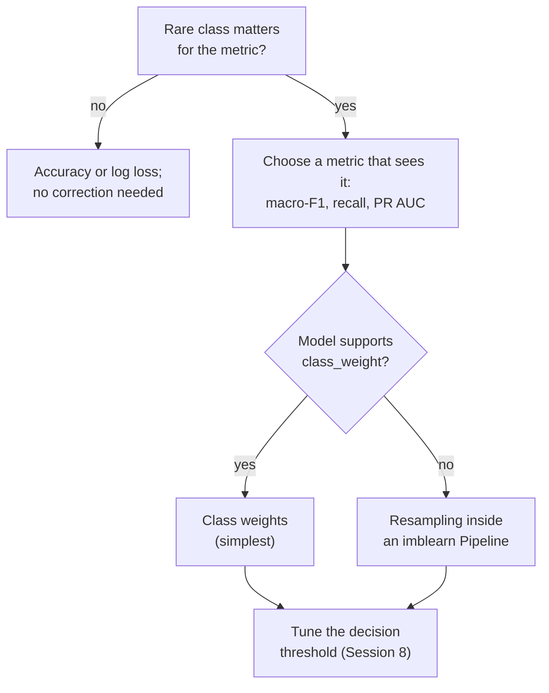
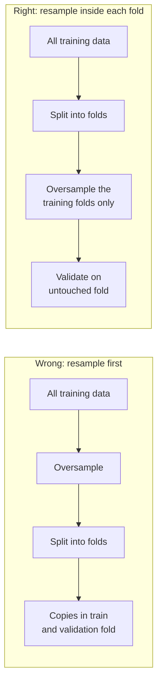

# Class imbalance: resampling and class weights

A classification problem is **imbalanced** when one class is much rarer than the others. In the case study, 7.5 % of the training reviews are neutral (3 stars), 19 % negative and 73 % positive. This page covers the third block of Session 9: why accuracy misleads on such data, the two simplest remedies (random undersampling and oversampling), synthetic oversampling with SMOTE, class weights as an alternative, and the rule that resampling happens only on the training folds of a cross-validation, which the pipelines of the imbalanced-learn library enforce. Session 8 introduced precision, recall, F1 and macro-F1; they are the measures used here.

> [!NOTE]
> The code blocks on this page build on each other. Run them in order from the repository root. They need the package `imbalanced-learn` (imported as `imblearn`), which is part of the course environment.



## 1. Class imbalance and why accuracy misleads

### Concept

**Accuracy** is the share of correct predictions. On imbalanced data a model can reach a high accuracy by always predicting the majority class. A model that calls every review "positive" is right for 73 % of the training reviews, but it never finds a negative or neutral one.

A learning algorithm that minimises the average loss over all rows behaves similarly: the rare class contributes few rows to the loss, so the model gains little by getting it right. With weak features, the cheapest solution is to ignore it.

Worked example with 100 reviews (73 positive, 19 negative, 8 neutral) and the rule "always positive":

| | precision | recall | F1 |
|---|---|---|---|
| positive | 73/100 = 0.73 | 73/73 = 1.00 | 0.84 |
| negative | – (never predicted) | 0/19 = 0 | 0 |
| neutral | – | 0/8 = 0 | 0 |

Accuracy is 0.73, macro-F1 (the unweighted mean of the three F1 values) is 0.84/3 = 0.28.

### Why it matters

Imbalanced problems are the rule in practice: fraud, machine failures, diseases, churn and complaints are all rare compared with normal cases, and the rare cases are the reason the model is built. A metric that rewards ignoring them leads to useless models that look good in a report. The leaderboard therefore uses macro-F1, in which the neutral class counts as much as the positive class.

### How it works in Python

```python
import numpy as np
import pandas as pd
from sklearn.dummy import DummyClassifier
from sklearn.linear_model import LogisticRegression
from sklearn.metrics import accuracy_score, classification_report, f1_score
from sklearn.model_selection import StratifiedKFold, cross_val_predict
from sklearn.pipeline import make_pipeline
from sklearn.preprocessing import StandardScaler

reviews = pd.read_parquet("case-study/data/train_sample.parquet")
text = reviews["text"].fillna("")
NEGATIONS = r"\b(?:not|no|never|don't|doesn't|didn't|isn't|wasn't|won't|can't)\b"
X = pd.DataFrame({                                   # simple text and metadata features (page 2)
    "log_chars": np.log1p(text.str.len()),
    "n_exclaim": text.str.count("!"),
    "n_question": text.str.count(r"\?"),
    "n_negations": text.str.lower().str.count(NEGATIONS),
    "upper_share": text.str.count(r"[A-Z]") / text.str.len().clip(lower=1),
    "title_words": reviews["title"].fillna("").str.split().str.len(),
    "verified": reviews["verified_purchase"].astype(int),
    "log_helpful": np.log1p(reviews["helpful_vote"]),
    "n_images": reviews["n_images"],
})
y = reviews["label"]
print(y.value_counts().to_dict())                    # {'pos': 36652, 'neg': 9609, 'neu': 3739}

cv = StratifiedKFold(5, shuffle=True, random_state=0)
for name, model in [("always pos", DummyClassifier(strategy="most_frequent")),
                    ("logistic", make_pipeline(StandardScaler(), LogisticRegression(max_iter=1000)))]:
    pred = cross_val_predict(model, X, y, cv=cv)
    print(name, round(accuracy_score(y, pred), 3), round(f1_score(y, pred, average="macro"), 3))
# always pos 0.733 0.282
# logistic 0.731 0.318

print(classification_report(y, pred, digits=3, zero_division=0))   # the logistic regression
#               precision    recall  f1-score   support
#          neg      0.386     0.063     0.108      9609
#          neu      0.000     0.000     0.000      3739
#          pos      0.742     0.980     0.844     36652
#     accuracy                          0.731     50000
#    macro avg      0.376     0.348     0.318     50000
```

The logistic regression is slightly *less* accurate than the constant rule. It predicts "neutral" for not a single review and finds only 6 % of the negative ones. Accuracy hides this completely; the per-class recall and macro-F1 show it.

### In practice

- In the credit-card fraud dataset of the Université Libre de Bruxelles and Worldline (Dal Pozzolo et al., 2015), 492 of 284,807 transactions are fraudulent (0.17 %). A model that never flags fraud is 99.8 % accurate.
- Hospital readmission and rare-disease screening models are judged by sensitivity (recall) and positive predictive value (precision), not by accuracy, for the same reason.

> [!WARNING]
> Before correcting imbalance, ask whether the rare class matters for the decision. If you need well-calibrated probabilities, for example to estimate expected costs, any correction distorts them (van den Goorbergh et al., 2022). Then fit without correction and choose the decision threshold from the costs instead (Session 8).

## 2. Random undersampling and oversampling

### Concept

**Resampling** changes the class proportions of the *training* data before the model is fitted.

- **Random undersampling** deletes randomly chosen rows of the majority classes until each class has as many rows as the rarest one (or a chosen ratio). With 36,652 positive, 9,609 negative and 3,739 neutral reviews, full undersampling keeps 3 × 3,739 = 11,217 rows.
- **Random oversampling** duplicates randomly chosen rows of the minority classes until they are as frequent as the majority class: 3 × 36,652 = 109,956 rows, many of them exact copies.

Both make the classes equally important in the training loss. Undersampling throws away information but makes training faster; oversampling keeps all information but repeats rows, which encourages flexible models to memorise them.

### Why it matters

A model trained on balanced data predicts the rare classes much more often. It finds more of them (higher recall) at the price of more false alarms (lower precision). On a metric like macro-F1 that is usually a good trade, because a rare class with recall 0 contributes an F1 of 0.

### How it works in Python

```python
from collections import Counter

from imblearn.over_sampling import RandomOverSampler
from imblearn.under_sampling import RandomUnderSampler

for sampler in [RandomUnderSampler(random_state=0), RandomOverSampler(random_state=0)]:
    X_res, y_res = sampler.fit_resample(X, y)        # samplers have fit_resample, not transform
    print(type(sampler).__name__, dict(sorted(Counter(y_res).items())))
# RandomUnderSampler {'neg': 3739, 'neu': 3739, 'pos': 3739}
# RandomOverSampler {'neg': 36652, 'neu': 36652, 'pos': 36652}
```

`sampling_strategy` controls the target proportions, for example `RandomUnderSampler(sampling_strategy={"pos": 15000})` keeps 15,000 positive reviews and all others. The samplers are only used in `fit_resample` on training data; they have no `transform` method, so they cannot be applied to test data by accident.

### In practice

- Large advertising platforms subsample the very frequent "no click" events before training click-through models; He et al. (2014) describe negative downsampling for Facebook's ad-click prediction and how to correct the predicted probabilities afterwards.
- In medical imaging studies with few positive cases, oversampling of the positive images during training is a common default.

> [!WARNING]
> Undersampling to the size of a very small class can leave too few rows for the other classes: with 50 fraud cases, a fully balanced data set has 100 rows. Use a partial ratio (`sampling_strategy=0.2` for binary problems) or class weights instead.

## 3. Synthetic oversampling (SMOTE)

### Concept

**SMOTE** (Synthetic Minority Over-sampling Technique; Chawla et al., 2002) creates *new* minority rows instead of copying existing ones. For each new row it

1. picks a minority row **x**,
2. finds its *k* nearest minority neighbours (default *k* = 5) and picks one of them, **x_nn**,
3. places the new row at a random point on the line between them: **x_new = x + λ · (x_nn − x)**, with λ drawn uniformly between 0 and 1.

Worked example in two features: x = (2, 3), x_nn = (4, 7), λ = 0.25 gives x_new = (2 + 0.25 · 2, 3 + 0.25 · 4) = (2.5, 4.0).


### Why it matters

Synthetic rows fill the region of the minority class instead of stacking copies on single points, so a flexible model is less tempted to memorise individual rows. SMOTE became the best-known imbalance method; many variants (Borderline-SMOTE, ADASYN, SMOTE-NC for categorical features) build on it.

### How it works in Python

```python
from imblearn.over_sampling import SMOTE

X_sm, y_sm = SMOTE(k_neighbors=5, random_state=0).fit_resample(X, y)
print(dict(sorted(Counter(y_sm).items())))           # {'neg': 36652, 'neu': 36652, 'pos': 36652}
new_rows = X_sm.iloc[len(X):]                        # synthetic rows are appended at the end
print(round((~new_rows["log_chars"].isin(X["log_chars"])).mean(), 2))   # 0.89: new values
```

The last line shows a side effect: 89 % of the synthetic rows have a text length that no real review has. For continuous features this is the intention; for counts and binary flags it is not. imbalanced-learn casts integer columns of a data frame back to integers, so `verified` stays 0 or 1, but the result is a rounded interpolation, not a real category. For categorical features use `SMOTENC` or `SMOTEN`, which do not interpolate categories. Because SMOTE uses distances, scale the features first (a `StandardScaler` before SMOTE in the pipeline).

### In practice

- Chawla et al. (2002) evaluated SMOTE on, among others, a mammography dataset for detecting calcifications, in which the positive class is a small minority.
- Later studies are more sceptical: Elor and Averbuch-Elor (2022) compared SMOTE and other balancing methods across many datasets and found that strong classifiers such as gradient boosting rarely profit from them compared with tuning the decision threshold.

> [!CAUTION]
> SMOTE invents data. In high dimensions (for example thousands of TF-IDF columns) "between two neighbours" has little meaning, and synthetic rows can fall into regions that belong to another class. Always compare against class weights and against no correction with a tuned threshold.

## 4. Class weights as an alternative

### Concept

A **class weight** multiplies the loss of every row of a class by a constant. With weights the training data stay unchanged, but an error on a rare row counts more. The common choice `class_weight="balanced"` gives each class the weight

w_c = n / (K · n_c),

with *n* rows, *K* classes and *n_c* rows in class *c*. Every class then contributes the same total weight. For the 50,000 sample reviews: neutral 50,000 / (3 · 3,739) = 4.46, negative 50,000 / (3 · 9,609) = 1.73, positive 50,000 / (3 · 36,652) = 0.45.

For a model that minimises a weighted loss, weighting is closely related to oversampling (a weight of 4.46 acts like 4.46 copies of the row), but it needs no extra rows, no randomness and no new library.

### Why it matters

Class weights are supported by most scikit-learn classifiers (`LogisticRegression`, `SVC`, `RandomForestClassifier`, `HistGradientBoostingClassifier`) and by XGBoost, LightGBM and CatBoost (Session 10). They are usually the first thing to try. Custom weights can also express costs: if a missed neutral review costs twice as much as a missed negative one, choose weights in that ratio.

### How it works in Python

```python
from sklearn.utils.class_weight import compute_class_weight

classes = np.array(["neg", "neu", "pos"])
weights = compute_class_weight("balanced", classes=classes, y=y)
print(dict(zip(classes.tolist(), weights.round(2).tolist())))   # {'neg': 1.73, 'neu': 4.46, 'pos': 0.45}

weighted = make_pipeline(StandardScaler(), LogisticRegression(max_iter=1000, class_weight="balanced"))
pred = cross_val_predict(weighted, X, y, cv=cv)
print(round(accuracy_score(y, pred), 3), round(f1_score(y, pred, average="macro"), 3))   # 0.617 0.435
```

Accuracy falls from 0.731 to 0.617, macro-F1 rises from 0.318 to 0.435. The model now predicts neutral and negative reviews and gets many of them wrong, but finds far more of them.

### In practice

- King and Zeng (2001) showed for rare events in political science (wars, coups) that logistic regression underestimates their probability, and proposed weighting and correction methods that are still used.
- XGBoost's documentation recommends the parameter `scale_pos_weight` (the ratio of negative to positive rows) for imbalanced binary problems such as fraud and churn.

> [!WARNING]
> Weighted models produce shifted probabilities: a weighted churn model predicts churn probabilities that are too high on average. Use them for ranking and for decisions at a tuned threshold, not as calibrated risks, or recalibrate them on validation data (Session 8).

## 5. Resampling inside the cross-validation only

### Concept

Resampling is part of *training*. It must be applied to the training folds of each cross-validation split, never to the validation fold and never to the test data. Two reasons:

1. **The validation data must look like reality.** Real reviews are 7.5 % neutral; a balanced validation set gives a misleading estimate of precision.
2. **Oversampling before splitting leaks.** If a duplicated (or SMOTE-interpolated) row lands in the training fold and its original in the validation fold, the model is tested on rows it has already seen.



### Why it matters

The effect is not small. With a random forest, which can memorise individual rows, oversampling before cross-validation more than doubles the apparent macro-F1 on the case study:

### How it works in Python

```python
from imblearn.pipeline import make_pipeline as make_imb_pipeline
from sklearn.ensemble import RandomForestClassifier
from sklearn.model_selection import cross_val_score

rf = RandomForestClassifier(n_estimators=100, random_state=0, n_jobs=-1)

X_over, y_over = RandomOverSampler(random_state=0).fit_resample(X, y)        # WRONG: before the split
wrong = cross_val_score(rf, X_over, y_over, cv=cv, scoring="f1_macro").mean()

pipe = make_imb_pipeline(RandomOverSampler(random_state=0), rf)              # RIGHT: inside each fold
right = cross_val_score(pipe, X, y, cv=cv, scoring="f1_macro").mean()
print(round(wrong, 3), round(right, 3))              # 0.839 0.409
```

0.839 is an illusion: the forest recognises copies of neutral reviews it has seen in training. 0.409 is the honest estimate.

### In practice

- Santos et al. (2018) reviewed studies that combined oversampling with cross-validation and showed that oversampling before the split leads to over-optimistic results; they found this mistake in published work.
- The imbalanced-learn user guide has a page on common pitfalls whose main example is data leakage from resampling before splitting, with the pipeline solution shown in the next section.

> [!CAUTION]
> The same rule applies to the test set and the leaderboard: never resample, deduplicate by label or reweight the data you evaluate on. Resampling is a training technique, not a data-cleaning step.

## 6. Pipelines with imbalanced-learn

### Concept

scikit-learn's `Pipeline` only knows transformers (`fit`/`transform`) and a final estimator. A sampler changes the number of rows, which a transformer may not do. imbalanced-learn therefore provides its own `Pipeline` (`imblearn.pipeline.Pipeline` and `make_pipeline`) that accepts samplers as steps. It calls `fit_resample` on samplers **only during `fit`**; during `predict` and `score` the samplers are skipped. Combined with `cross_validate` or `GridSearchCV`, every training fold is resampled and every validation fold stays untouched.

### Why it matters

With one pipeline object, comparing methods is a loop over candidates, and the sampling ratio or SMOTE's *k* can be tuned like any hyperparameter (`smote__k_neighbors`). The pipeline also documents the decision: whoever loads the model can see that it was trained with SMOTE.

### How it works in Python

```python
from imblearn.pipeline import make_pipeline as make_imb_pipeline
from sklearn.metrics import precision_recall_fscore_support


def logreg(class_weight=None):
    return LogisticRegression(max_iter=1000, class_weight=class_weight)


candidates = {
    "no correction": make_imb_pipeline(StandardScaler(), logreg()),
    "undersampling": make_imb_pipeline(StandardScaler(), RandomUnderSampler(random_state=0), logreg()),
    "oversampling": make_imb_pipeline(StandardScaler(), RandomOverSampler(random_state=0), logreg()),
    "SMOTE": make_imb_pipeline(StandardScaler(), SMOTE(random_state=0), logreg()),
    "class weights": make_imb_pipeline(StandardScaler(), logreg("balanced")),
}
rows = []
for name, model in candidates.items():
    pred = cross_val_predict(model, X, y, cv=cv)      # sampler runs on the training folds only
    p, r, f, _ = precision_recall_fscore_support(y, pred, labels=["neg", "neu", "pos"], zero_division=0)
    rows.append({"method": name, "accuracy": accuracy_score(y, pred), "macro_f1": f.mean(),
                 "neu_precision": p[1], "neu_recall": r[1], "neu_f1": f[1]})
print(pd.DataFrame(rows).set_index("method").round(3).to_string())
#                accuracy  macro_f1  neu_precision  neu_recall  neu_f1
# method
# no correction     0.731     0.318          0.000       0.000   0.000
# undersampling     0.616     0.435          0.132       0.406   0.200
# oversampling      0.618     0.436          0.131       0.399   0.197
# SMOTE             0.614     0.436          0.131       0.406   0.198
# class weights     0.617     0.435          0.130       0.397   0.196
```


All four corrections lift macro-F1 from 0.32 to about 0.44 and the neutral recall from 0 to about 0.40, while neutral precision stays low (0.13): most reviews predicted as neutral are not neutral. For a linear model the four methods are practically equivalent, so the simplest one, class weights, is the sensible choice. Differences between methods appear with flexible models (Session 10) and are small compared with the effect of better features (Session 13).

### In practice

- The imbalanced-learn library (Lemaître, Nogueira & Aridas, 2017) is a scikit-learn-contrib project under the MIT licence and the standard Python implementation of these methods; its examples compare samplers in pipelines as above.
- The KEEL repository distributes imbalanced benchmark datasets with predefined five-fold partitions, so that resampling methods are compared on identical test folds that no method has touched.

> [!TIP]
> Report per-class precision and recall next to macro-F1. "Neutral recall rose from 0 to 0.40 at a precision of 0.13" tells a product manager what the model does; "macro-F1 rose by 0.12" does not.

## Practice

In [12-case-study-imbalance.ipynb](../workbooks/12-case-study-imbalance.ipynb): compare undersampling, oversampling, SMOTE and class weights for the rare neutral class of the reviews by macro-F1, inside imbalanced-learn pipelines with a time-respecting validation, using the features of the first two blocks. Repeat the comparison with a gradient boosting model and report the per-class precision and recall.

## Check your understanding

1. A test set has 95 % negative and 5 % positive cases. What accuracy and what macro-F1 does the rule "always negative" reach?
2. Compute the balanced class weights for 900 rows of class A and 100 rows of class B.
3. SMOTE combines x = (1, 1) and its neighbour x_nn = (3, 5) with λ = 0.5. Where is the new point?
4. Why did oversampling before cross-validation give 0.84 instead of 0.41 macro-F1 with a random forest?
5. What does an imbalanced-learn `Pipeline` do with a sampler step when you call `predict`?

## Further reading

- Lemaître, G., Nogueira, F. & Aridas, C. K. (2017). Imbalanced-learn: a Python toolbox to tackle the curse of imbalanced datasets in machine learning. *Journal of Machine Learning Research*, 18(17), 1–5. https://jmlr.org/papers/v18/16-365.html
- imbalanced-learn developers (2025). *Common pitfalls and recommended practices*. imbalanced-learn user guide. https://imbalanced-learn.org/stable/common_pitfalls.html
- Chawla, N. V., Bowyer, K. W., Hall, L. O. & Kegelmeyer, W. P. (2002). SMOTE: synthetic minority over-sampling technique. *Journal of Artificial Intelligence Research*, 16, 321–357. https://doi.org/10.1613/jair.953
- van den Goorbergh, R., van Smeden, M., Timmerman, D. & Van Calster, B. (2022). The harm of class imbalance corrections for risk prediction models. *Journal of the American Medical Informatics Association*, 29(9), 1525–1534. https://doi.org/10.1093/jamia/ocac093
