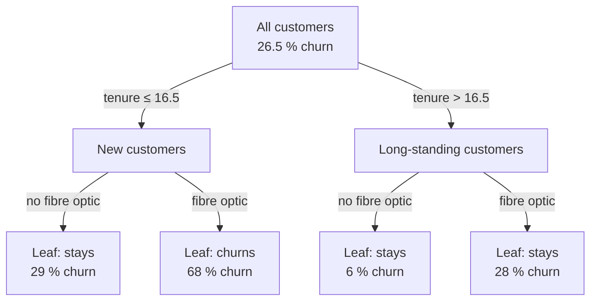
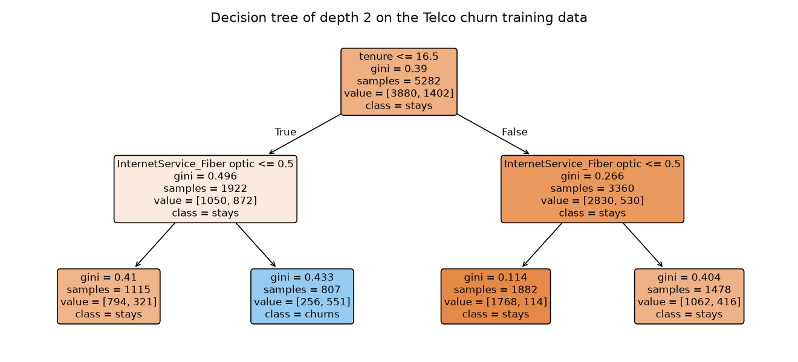
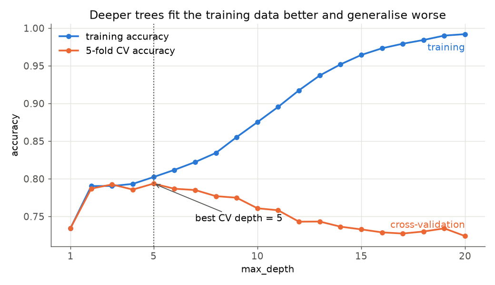

# Decision trees

A **decision tree** predicts by asking a sequence of yes/no questions about the features, such as "is the tenure shorter than 17 months?" and "does the customer have fibre-optic internet?". This page covers the first block of Session 10: how a tree chooses a split, Gini impurity computed by hand, how a tree grows, why deep trees overfit, and how limiting the depth or pruning controls this. Trees are the building block of every model in this session: random forests, gradient boosting, XGBoost, LightGBM and CatBoost all combine many of them. The examples use the IBM Telco customer churn data (7,043 customers, 26.5 % churn) introduced in Session 8.

> [!NOTE]
> The code blocks on this page build on each other. Run them in order. The Telco data are read from GitHub, so the first Telco block needs an internet connection.



## 1. Splits and Gini impurity computed by hand

### Concept

A tree starts with all training rows in one **node**, the **root**. A **split** divides a node into two **child nodes** with a rule on one feature: for a numeric feature "x ≤ threshold", for a categorical feature "x in a set of categories". A node is **pure** if all its rows have the same class.

To choose a split, the tree needs a number that says how mixed a node is. The **Gini impurity** of a node with class shares p₁, …, p_K is

G = 1 − (p₁² + p₂² + … + p_K²).

It is the probability that two rows drawn at random from the node (with replacement) belong to different classes. A pure node has G = 0; a node with two classes in equal shares has G = 1 − (0.5² + 0.5²) = 0.5.

The quality of a split is the **weighted impurity** of its children, each weighted by its share of rows. The tree tries every feature and every threshold (all midpoints between sorted distinct values) and picks the split with the lowest weighted impurity, that is the largest decrease from the parent.

**Worked example.** Ten customers, four of whom churned:

| contract | month | month | month | month | month | month | year | year | year | year |
|---|---|---|---|---|---|---|---|---|---|---|
| tenure | 1 | 2 | 3 | 5 | 20 | 30 | 8 | 25 | 40 | 60 |
| churn | 1 | 1 | 1 | 0 | 1 | 0 | 0 | 0 | 0 | 0 |

- Parent node: 4 of 10 churn, G = 1 − (0.4² + 0.6²) = 1 − 0.52 = **0.48**.
- Split "contract = month": the six monthly customers have 4 churners, G = 1 − ((4/6)² + (2/6)²) = 0.444; the four yearly customers are pure, G = 0. Weighted: 0.6 · 0.444 + 0.4 · 0 = **0.267**.
- Split "tenure < 4": the three shortest-tenure customers all churned (G = 0); the other seven contain one churner, G = 1 − ((1/7)² + (6/7)²) = 0.245. Weighted: 0.3 · 0 + 0.7 · 0.245 = **0.171**.

"tenure < 4" reduces the impurity most and is the better first split.

### Why it matters

Every tree-based model of this session repeats this one operation thousands of times. Computing it once by hand shows what the algorithm optimises, and two practical consequences: trees need no scaling of the features (only the order of values matters), and they handle non-linear effects and interactions without feature engineering.

### How it works in Python

```python
import numpy as np
import pandas as pd
from sklearn.tree import DecisionTreeClassifier, export_text

toy = pd.DataFrame({"contract": ["month"] * 6 + ["year"] * 4,
                    "tenure":   [1, 2, 3, 5, 20, 30, 8, 25, 40, 60],
                    "churn":    [1, 1, 1, 0, 1, 0, 0, 0, 0, 0]})


def gini(y):
    """1 - sum of squared class shares: 0 = pure node, 0.5 = 50/50 (two classes)."""
    p = np.bincount(y, minlength=2) / len(y)
    return 1 - (p ** 2).sum()


def split_gini(mask, y):
    """Weighted Gini impurity of the two children defined by a boolean mask."""
    return mask.mean() * gini(y[mask]) + (~mask).mean() * gini(y[~mask])


y_toy = toy["churn"].to_numpy()
print(round(gini(y_toy), 3))                                                   # 0.48
print(round(split_gini(toy["contract"].eq("month").to_numpy(), y_toy), 3))     # 0.267
for t in [2.5, 4, 12.5, 25]:
    print(t, round(split_gini(toy["tenure"].lt(t).to_numpy(), y_toy), 3))
# 2.5 0.3 | 4 0.171 | 12.5 0.4 | 25 0.267   -> best: tenure < 4

stump = DecisionTreeClassifier(max_depth=1).fit(toy[["tenure"]], toy["churn"])  # a tree with one split
print(export_text(stump, feature_names=["tenure"]))
# |--- tenure <= 4.00
# |   |--- class: 1
# |--- tenure >  4.00
# |   |--- class: 0
print(stump.tree_.impurity.round(3))     # [0.48  0.    0.245]: root, left child, right child
```

scikit-learn chooses the same split. It writes the threshold as the midpoint between the neighbouring values 3 and 5 (≤ 4.0), and `tree_.impurity` stores exactly the impurities we computed by hand.

### In practice

- Clinical decision rules such as the Ottawa ankle rules, which tell emergency staff when an X-ray is needed, have the form of shallow decision trees and were derived from patient data (Stiell et al., 1992).
- CART (Classification and Regression Trees; Breiman, Friedman, Olshen & Stone, 1984), the algorithm behind scikit-learn's trees, became the standard method for building interpretable rule sets from data in medicine and credit risk.

> [!WARNING]
> Do not confuse **Gini impurity** with the Gini coefficient of income inequality or with the "Gini" of credit scoring (2 · AUC − 1). They share a name, not a formula. scikit-learn also offers `criterion="entropy"` (information gain), which usually picks very similar splits.

> [!CAUTION]
> Forgetting the weights is the classic error: a tiny pure child with one row would otherwise look like a perfect split. The weighting by child size prevents splits that isolate single rows from looking good, but only partially, which is why deep trees still overfit (Section 3).

## 2. How a tree grows and how to read it

### Concept

A tree is grown **recursively**: split the root, then apply the same procedure to each child, and so on. The **depth** of a node is the number of splits from the root to it. A node that is not split further is a **leaf**; it predicts the majority class of its training rows, and `predict_proba` returns the class shares in the leaf. Growth stops when a node is pure or when a limit is reached: `max_depth` (maximum depth), `min_samples_leaf` (minimum rows per leaf), `min_samples_split` or `max_leaf_nodes`.

The algorithm is **greedy**: each split is the best one at that moment, without looking ahead. A split that is weak now but would allow two excellent splits below it is not found. This makes trees fast to grow, but not optimal.

### Why it matters

A small tree is a readable model: each path from the root to a leaf is an if-then rule that can be explained to a manager or a customer. That is why depth-2 or depth-3 trees are used to describe segments, even when a more accurate model is used for predictions.

### How it works in Python

```python
from sklearn.model_selection import train_test_split

URL = ("https://raw.githubusercontent.com/IBM/telco-customer-churn-on-icp4d/"
       "master/data/Telco-Customer-Churn.csv")
df = pd.read_csv(URL)
df["TotalCharges"] = pd.to_numeric(df["TotalCharges"], errors="coerce").fillna(0)   # 11 blanks
y = (df["Churn"] == "Yes").astype(int)
X = df.drop(columns=["customerID", "Churn"])
cat = X.select_dtypes(exclude="number").columns.tolist()
X_oh = pd.get_dummies(X, columns=cat, drop_first=True, dtype=int)   # scikit-learn trees need numbers
X_tr, X_te, y_tr, y_te = train_test_split(X_oh, y, test_size=0.25, stratify=y, random_state=0)
print(X_oh.shape, round(y.mean(), 3))                              # (7043, 30) 0.265

small = DecisionTreeClassifier(max_depth=2, random_state=0).fit(X_tr, y_tr)
print(export_text(small, feature_names=list(X_oh.columns), show_weights=True))
# |--- tenure <= 16.50
# |   |--- InternetService_Fiber optic <= 0.50
# |   |   |--- weights: [794.00, 321.00] class: 0
# |   |--- InternetService_Fiber optic >  0.50
# |   |   |--- weights: [256.00, 551.00] class: 1
# |--- tenure >  16.50
# |   |--- InternetService_Fiber optic <= 0.50
# |   |   |--- weights: [1768.00, 114.00] class: 0
# |   |--- InternetService_Fiber optic >  0.50
# |   |   |--- weights: [1062.00, 416.00] class: 0
```

The `weights` are the numbers of stayers and churners in each leaf. Read the second leaf: new customers (tenure ≤ 16.5 months) with fibre-optic internet churn in 551 of 807 cases (68 %); the tree predicts churn for them. All other leaves predict "stays", although the first and fourth leaves still have churn rates of 29 % and 28 %. `sklearn.tree.plot_tree(small, feature_names=..., filled=True)` draws the same tree:



### In practice

- Telecom and subscription companies use shallow trees to describe churn segments for retention campaigns ("new fibre-optic customers on monthly contracts"), because the rules translate directly into target groups.
- Telephone triage systems such as NHS Pathways, used by the NHS 111 service in England, are organised as sequences of yes/no questions, although designed by clinicians rather than learned from data.

> [!WARNING]
> The first split is not "the most important variable" in a causal sense. Correlated features (tenure and total charges) can replace each other, and a small change in the data can change the first split. Interpret a single tree as a description of the training data, not as a causal model.

## 3. Tree depth, overfitting of deep trees and pruning

### Concept

**Depth is a hyperparameter.** A shallow tree has few leaves and can only express coarse rules: it may **underfit** (high bias). A deep tree can isolate small groups of customers, eventually single rows; it **overfits** (high variance): it fits the noise of the training data, and a small change in the data produces a very different tree. Without limits, a tree grows until all leaves are pure, and its training accuracy approaches 100 %.

Two ways to control complexity:

- **Pre-pruning** (early stopping): limit the growth with `max_depth`, `min_samples_leaf` or `max_leaf_nodes`.
- **Post-pruning**: grow a full tree, then cut back branches that add little. scikit-learn implements **minimal cost-complexity pruning** (as in CART). For a value α ≥ 0 it keeps the subtree T that minimises

  R_α(T) = R(T) + α · |T|,

  where R(T) is the total impurity of the leaves (weighted by their size) and |T| the number of leaves. α is a price per leaf: α = 0 keeps the full tree, larger α gives smaller trees. `cost_complexity_pruning_path` lists the α values at which branches disappear.

Both kinds of limits are chosen by cross-validation on the training data (Session 7), never on the test set.

### Why it matters

A deep tree's training score is meaningless as an estimate of performance. The figure shows the pattern on the churn data: training accuracy rises steadily with depth, while cross-validated accuracy peaks at a depth of about 5 and then falls.



### How it works in Python

```python
for depth in [1, 2, 3, 5, 8, None]:
    tree = DecisionTreeClassifier(max_depth=depth, random_state=0).fit(X_tr, y_tr)
    print(depth, tree.get_n_leaves(), round(tree.score(X_tr, y_tr), 3), round(tree.score(X_te, y_te), 3))
# depth leaves train test
# 1      2    0.735 0.735   both leaves predict "stays": the majority rate
# 2      4    0.79  0.79
# 3      8    0.79  0.79
# 5     32    0.802 0.78
# 8    168    0.834 0.784
# None 1054   0.997 0.72    memorises the training data
```

The unlimited tree with 1,054 leaves classifies 99.7 % of the training customers correctly but only 72 % of the test customers, worse than the depth-2 tree. Now choose the limits properly, with cross-validation on the training data only:

```python
from sklearn.model_selection import GridSearchCV, cross_val_score

search = GridSearchCV(DecisionTreeClassifier(random_state=0),
                      {"max_depth": range(1, 16), "min_samples_leaf": [1, 5, 20, 50]},
                      cv=5, scoring="roc_auc").fit(X_tr, y_tr)
print(search.best_params_, round(search.best_score_, 3))   # {'max_depth': 5, 'min_samples_leaf': 50} 0.828

# post-pruning: grow fully, then cut back with a price alpha per leaf
path = DecisionTreeClassifier(random_state=0).cost_complexity_pruning_path(X_tr, y_tr)
print(len(path.ccp_alphas))                                # 415 candidate alphas
for alpha in [0.0, 0.0005, 0.001, 0.002, 0.005, 0.01]:
    pruned = DecisionTreeClassifier(ccp_alpha=alpha, random_state=0)
    cv_acc = cross_val_score(pruned, X_tr, y_tr, cv=5).mean()
    print(alpha, pruned.fit(X_tr, y_tr).get_n_leaves(), round(cv_acc, 3))
# alpha leaves cv_accuracy: 0.0 1054 0.727 | 0.0005 54 0.783 | 0.001 17 0.791
#                           0.002 11 0.789 | 0.005 6 0.789  | 0.01 4 0.787
```

Pruning with α = 0.001 reduces the tree from 1,054 to 17 leaves and raises the cross-validated accuracy from 0.727 to 0.791. Even small α values remove most of the branches, because most of them only separate a handful of training rows. The workbook [04-cost-complexity-pruning.ipynb](../workbooks/04-cost-complexity-pruning.ipynb) plots the whole path.

### In practice

- In credit scoring, regulators and model validators expect simple, stable rules; trees used directly for decisions are typically limited to a few levels and a minimum number of applicants per leaf.
- Breiman et al. (1984) introduced cost-complexity pruning with cross-validation in the CART book; it is still the default pruning method in R's `rpart` package and in scikit-learn.

> [!WARNING]
> **Instability.** Even a well-pruned tree changes noticeably when a few training rows change. This high variance is the main weakness of single trees and the motivation for the ensembles of the next page, which average many trees.

> [!TIP]
> `min_samples_leaf` is often the most useful single limit: it guarantees that every prediction is based on at least that many customers, which also makes the class shares in the leaves (the predicted probabilities) less noisy.

## Practice

Fit and visualise a decision tree on the churn data in [05-churn-decision-tree.ipynb](../workbooks/05-churn-decision-tree.ipynb): compute the Gini impurity of the best first split by hand and compare it with scikit-learn, plot training and cross-validated scores against depth, prune with `ccp_alpha`, and draw the final tree with `plot_tree`.

## Check your understanding

1. A node has 30 churners and 70 stayers. What is its Gini impurity?
2. A split produces a left child with 20 rows (G = 0.1) and a right child with 80 rows (G = 0.4). What is the weighted impurity?
3. Why do decision trees not need feature scaling, while k-nearest neighbours does?
4. The unlimited tree has a training accuracy of 0.997 and a test accuracy of 0.72. Which two hyperparameters would you tune first, and with which data?
5. What happens to the number of leaves when `ccp_alpha` increases, and why?

## Further reading

- James, G., Witten, D., Hastie, T., Tibshirani, R. & Taylor, J. (2023). *An Introduction to Statistical Learning with Applications in Python*, Chapter 8: Tree-Based Methods. Springer. Free PDF: https://www.statlearning.com/
- scikit-learn developers (2025). *Decision Trees*. scikit-learn user guide, section 1.10. https://scikit-learn.org/stable/modules/tree.html
- Breiman, L., Friedman, J. H., Olshen, R. A. & Stone, C. J. (1984). *Classification and Regression Trees*. Wadsworth.
- Amazon Machine Learning University (2021). *MLU-Explain: Decision Trees*. Interactive article. https://mlu-explain.github.io/decision-tree/
