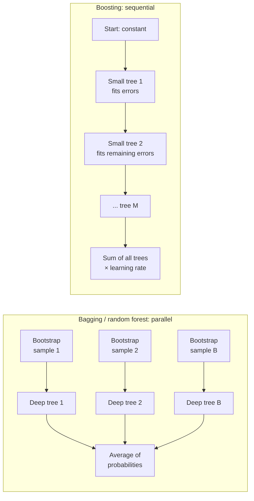
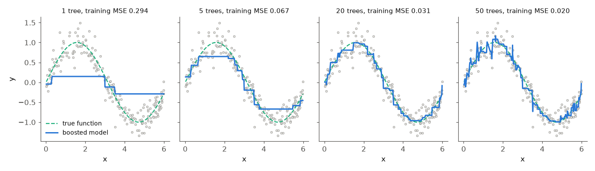

# Bagging, random forests and gradient boosting

A single deep tree has low bias but high variance: it fits the training data closely and changes a lot when the data change. An **ensemble** combines many models into one prediction. This page covers the first half of the second block of Session 10: **bagging** and **random forests**, which average many deep trees trained on resampled data to reduce variance, and **gradient boosting**, which adds small trees one after another, each correcting the errors of the current model, to reduce bias. Page 3 continues with the three boosting libraries XGBoost, LightGBM and CatBoost and the settings that matter in practice.

> [!NOTE]
> The code blocks on this page build on each other. The first block repeats the Telco preparation of page 1 (one-hot encoded features, a fixed stratified split), so all scores are comparable with page 1.



## 1. Bagging and random forests

### Concept

**Bagging** (bootstrap aggregating; Breiman, 1996) trains B models, each on a **bootstrap sample**: n rows drawn *with replacement* from the n training rows. Some rows appear several times, others not at all. The ensemble predicts the average of the B predicted probabilities (or a majority vote).

Why averaging helps: if B predictions each have variance σ² and were independent, their average would have variance σ²/B. Trees trained on bootstrap samples of the same data are not independent; with pairwise correlation ρ the variance of the average is

ρ · σ² + (1 − ρ) · σ² / B.

More trees shrink the second term, but the first term remains. To reduce it, the trees must be less similar.

A **random forest** (Breiman, 2001) does exactly that: at every split, each tree may choose only among a random subset of `max_features` features (for classification often √p of the p features). A strong feature can then not dominate the top of every tree, the trees become more diverse, ρ falls, and averaging helps more.

**Out-of-bag (OOB) estimate.** A bootstrap sample leaves out about (1 − 1/n)ⁿ ≈ e⁻¹ ≈ 37 % of the rows. Each row can therefore be predicted by the trees that did not see it. The accuracy of these predictions, the **OOB score**, is a validation estimate that comes for free.

Worked example: with 10 training rows, the chance that a given row is *not* drawn in 10 draws with replacement is (9/10)¹⁰ = 0.35; with 1,000 rows it is (999/1000)¹⁰⁰⁰ = 0.368.

### Why it matters

Random forests are accurate with almost no tuning, robust to outliers and irrelevant features, and cannot overfit by adding more trees (the average just stabilises). They are a strong default and the baseline any tabular model should beat.

### How it works in Python

```python
import numpy as np
import pandas as pd
from sklearn.ensemble import BaggingClassifier, RandomForestClassifier
from sklearn.metrics import roc_auc_score
from sklearn.model_selection import train_test_split
from sklearn.tree import DecisionTreeClassifier

URL = ("https://raw.githubusercontent.com/IBM/telco-customer-churn-on-icp4d/"
       "master/data/Telco-Customer-Churn.csv")
df = pd.read_csv(URL)
df["TotalCharges"] = pd.to_numeric(df["TotalCharges"], errors="coerce").fillna(0)
y = (df["Churn"] == "Yes").astype(int)
X = df.drop(columns=["customerID", "Churn"])
cat = X.select_dtypes(exclude="number").columns.tolist()
X_oh = pd.get_dummies(X, columns=cat, drop_first=True, dtype=int)
X_tr, X_te, y_tr, y_te = train_test_split(X_oh, y, test_size=0.25, stratify=y, random_state=0)


def auc(model):
    """Test ROC AUC of a fitted binary classifier."""
    return round(roc_auc_score(y_te, model.predict_proba(X_te)[:, 1]), 3)


deep = DecisionTreeClassifier(random_state=0).fit(X_tr, y_tr)
bag = BaggingClassifier(DecisionTreeClassifier(), n_estimators=200, random_state=0, n_jobs=-1).fit(X_tr, y_tr)
rf = RandomForestClassifier(n_estimators=200, min_samples_leaf=5, max_features="sqrt",
                            oob_score=True, random_state=0, n_jobs=-1).fit(X_tr, y_tr)
print(auc(deep), auc(bag), auc(rf))                                # 0.658 0.814 0.844
print(round(rf.oob_score_, 3), round(rf.score(X_te, y_te), 3))      # 0.802 0.798: OOB vs test accuracy

for n in [10, 50, 100, 300]:                                       # more trees: the OOB score levels off
    m = RandomForestClassifier(n_estimators=n, min_samples_leaf=5, oob_score=True,
                               random_state=0, n_jobs=-1).fit(X_tr, y_tr)
    print(n, round(m.oob_score_, 3))
# 10 0.789 | 50 0.801 | 100 0.802 | 300 0.804
```

One deep tree reaches a test ROC AUC of 0.658. Averaging 200 such trees (bagging) raises it to 0.814; decorrelating them (random forest) to 0.844. The OOB accuracy (0.802) is close to the test accuracy (0.798). After about 50–100 trees, more trees add little. (With 10 trees scikit-learn warns that some rows have no OOB prediction: every tree happened to include them.)

### In practice

- Random forests are a standard method for land-cover classification from satellite images; Belgiu and Drăguţ (2016) review their use in remote sensing.
- In genomics, random forests are widely used for classification from gene-expression data, where there are many more features than samples.
- The Microsoft Kinect body-part recognition (Shotton et al., 2011) classified each depth-image pixel with a randomised decision forest in real time.

> [!WARNING]
> Like every tree model, a random forest cannot extrapolate: beyond the range of the training data it predicts the value of the outermost leaves. For a trend in time (decision volumes, prices), a forest forecasts a flat line.

## 2. Gradient boosting

### Concept

**Boosting** builds the ensemble *sequentially*. For a regression target:

1. Start with a constant prediction F₀ (the mean of y).
2. Compute the **residuals** r = y − F_{m−1}(x): what the current model still gets wrong.
3. Fit a small tree h_m (depth 2–6) to the residuals.
4. Update F_m(x) = F_{m−1}(x) + η · h_m(x), with a **learning rate** η between 0 and 1.
5. Repeat M times.

For squared error, the residuals are the negative **gradient** of the loss with respect to the prediction, hence **gradient boosting** (Friedman, 2001). For classification, the model works in **log-odds**; each tree fits the gradient of the log loss, which is y − p (observed class minus predicted probability), and the probability is p = 1 / (1 + e^(−F)).

Worked example (one row, regression): y = 10, F₀ = 6, so r₁ = 4. Suppose tree 1 predicts 4 for this row; with η = 0.5, F₁ = 6 + 0.5 · 4 = 8. Now r₂ = 2; tree 2 predicts 2, F₂ = 8 + 0.5 · 2 = 9. The prediction approaches the target in shrinking steps.

The learning rate trades speed for accuracy: small η needs more trees but usually generalises better. Unlike bagging, boosting mainly reduces **bias**, and because every tree fits the remaining errors, too many trees eventually fit noise: boosting can overfit, so the number of trees must be controlled (early stopping, page 3).



### Why it matters

Gradient-boosted trees are the most accurate standard method for tabular data in many benchmarks and competitions. The loop below is the whole idea; XGBoost, LightGBM and CatBoost add regularisation, speed, and handling of missing values and categories.

### How it works in Python

```python
from sklearn.tree import DecisionTreeRegressor

# gradient boosting by hand for a regression target: each small tree fits the current residuals
rng = np.random.default_rng(0)
x = np.sort(rng.uniform(0, 6, 200)).reshape(-1, 1)
target = np.sin(x[:, 0]) + rng.normal(0, 0.2, 200)      # noise with variance 0.04

pred = np.full(200, target.mean())                       # step 0: predict the mean
lr = 0.3                                                 # learning rate
for step in range(1, 51):
    residual = target - pred                             # what the model still gets wrong
    tree = DecisionTreeRegressor(max_depth=2).fit(x, residual)
    pred += lr * tree.predict(x)
    if step in (1, 5, 20, 50):
        print(step, round(np.mean((target - pred) ** 2), 3))
# 1 0.294 | 5 0.067 | 20 0.031 | 50 0.02
```

The training error falls from 0.294 after one tree to 0.020 after 50. The noise has variance 0.04, so an error below 0.04 means the model has started to fit noise. scikit-learn's implementations do the same for classification:

```python
from sklearn.ensemble import GradientBoostingClassifier, HistGradientBoostingClassifier
from sklearn.linear_model import LogisticRegression
from sklearn.pipeline import make_pipeline
from sklearn.preprocessing import StandardScaler

gb = GradientBoostingClassifier(n_estimators=200, learning_rate=0.05, max_depth=3, random_state=0).fit(X_tr, y_tr)
hgb = HistGradientBoostingClassifier(max_iter=200, learning_rate=0.05, max_depth=3, random_state=0).fit(X_tr, y_tr)
logreg = make_pipeline(StandardScaler(), LogisticRegression(max_iter=1000)).fit(X_tr, y_tr)
print(auc(gb), auc(hgb), auc(logreg))                    # 0.846 0.844 0.844
```

`HistGradientBoostingClassifier` bins each feature into at most 255 intervals before searching splits, the same trick as LightGBM; it is much faster on large data, handles missing values natively and supports `categorical_features` and `class_weight`. On the churn data, boosting (0.846), the random forest (0.844) and a well-specified logistic regression (0.844) are practically equal. The churn effects are few, strong and mostly monotone, so there is little for a flexible model to add. On the Berlin Airbnb prices with all listing features, many of them weak (122 amenities, reviews, availability), LightGBM prices about €3 a night more accurately than ridge regression on the same features (page 4, Section 4).

### In practice

- Gradient-boosted trees are widely used for ranking web search results; LambdaMART, a boosted-tree ranker, was part of the winning entry of the 2010 Yahoo! Learning to Rank Challenge (Burges, 2010).
- Grinsztajn, Oyallon and Varoquaux (2022) compared tree ensembles and deep learning on 45 medium-sized tabular datasets and found tree-based models, including gradient boosting, ahead in most of them.
- In the M5 competition on forecasting Walmart sales, most top solutions used LightGBM, a gradient boosting library (Makridakis et al., 2022); Session 12 returns to this.

> [!WARNING]
> Boosting needs **small** trees (depth 3–8 or a limited number of leaves) and a moderate learning rate. Deep trees with a high learning rate overfit within a few rounds. This is the opposite of random forests, which use deep trees.

> [!CAUTION]
> Trees in boosting depend on each other, so they cannot be trained in parallel; only the split search within each tree is parallelised. Training time grows linearly with the number of trees.

## Practice

The second half of this block (page 3) ends with the practice task: train and tune gradient boosting models on the churn data and compare them. The INRIA MOOC workbooks [06-ensemble-bagging.ipynb](../workbooks/06-ensemble-bagging.ipynb), [07-ensemble-random-forest.ipynb](../workbooks/07-ensemble-random-forest.ipynb) and [08-ensemble-gradient-boosting.ipynb](../workbooks/08-ensemble-gradient-boosting.ipynb) repeat the concepts of this page step by step.

## Check your understanding

1. What share of the training rows does a bootstrap sample of 10,000 draws from 10,000 rows leave out, approximately?
2. Why does a random forest consider only a random subset of features at each split?
3. In the worked boosting example, what would F₂ be with a learning rate of 1.0? Why is a smaller learning rate usually better?
4. Bagging reduces variance, boosting mainly reduces bias. Explain this with the depth of the trees each method uses.
5. Why can a random forest not forecast a growing trend?

## Further reading

- James, G., Witten, D., Hastie, T., Tibshirani, R. & Taylor, J. (2023). *An Introduction to Statistical Learning with Applications in Python*, Sections 8.2 (bagging, random forests, boosting) and 8.3 (lab). Springer. https://www.statlearning.com/
- Breiman, L. (2001). Random forests. *Machine Learning*, 45, 5–32. https://doi.org/10.1023/A:1010933404324
- Friedman, J. H. (2001). Greedy function approximation: a gradient boosting machine. *Annals of Statistics*, 29(5), 1189–1232. https://doi.org/10.1214/aos/1013203451
- Grinsztajn, L., Oyallon, E. & Varoquaux, G. (2022). Why do tree-based models still outperform deep learning on typical tabular data? *NeurIPS Datasets and Benchmarks*. https://arxiv.org/abs/2207.08815
