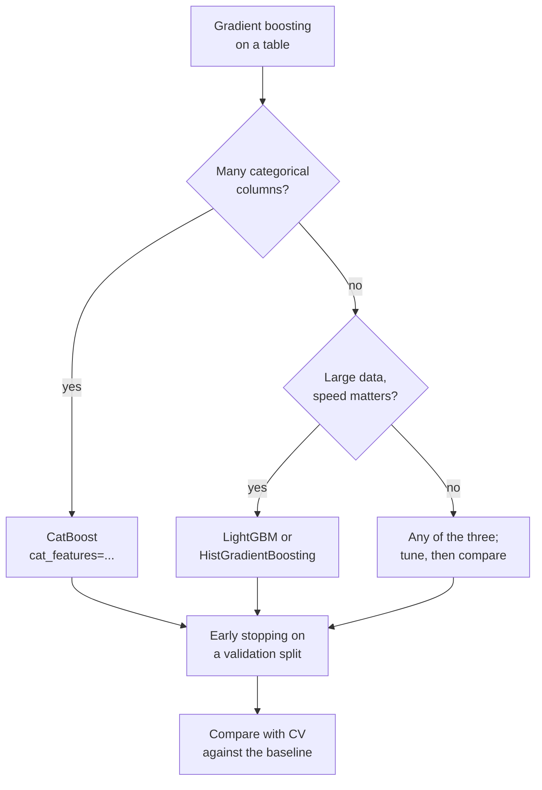

# XGBoost, LightGBM and CatBoost in practice

Three open-source libraries implement fast, regularised gradient boosting and dominate tabular machine learning: **XGBoost**, **LightGBM** and **CatBoost**. This page covers the second half of the second block of Session 10: what distinguishes the three libraries, how they handle categorical features, how class weights and early stopping work, and how to tune them without overfitting the validation data. It ends with the practice task on the churn data. Page 2 explained the underlying algorithm.

> [!NOTE]
> The code blocks on this page build on each other. All three libraries are part of the course environment. **On macOS**, XGBoost and LightGBM need the OpenMP runtime: run `brew install libomp` once, otherwise `import xgboost` fails with a message about `libomp.dylib`.



## 1. XGBoost, LightGBM and CatBoost

### Concept

All three libraries fit the gradient boosting model of page 2, with additions:

| | XGBoost | LightGBM | CatBoost |
|---|---|---|---|
| Origin | Chen & Guestrin (2016), University of Washington | Ke et al. (2017), Microsoft | Prokhorenkova et al. (2018), Yandex |
| Tree growth | level-wise (depth by depth) by default | **leaf-wise**: always splits the leaf with the largest gain | **symmetric** (oblivious) trees: the same split on a whole level |
| Main complexity parameter | `max_depth` | `num_leaves` | `depth` |
| Split search | histogram (default) or exact | histogram | histogram |
| Categories | `enable_categorical=True` with pandas `category` dtype | pandas `category` dtype | `cat_features=[...]`, ordered target statistics |
| scikit-learn class | `XGBClassifier` | `LGBMClassifier` | `CatBoostClassifier` |

Common additions to plain gradient boosting:

- **Regularisation** of the leaf values (L1 and L2 penalties, `reg_alpha`, `reg_lambda`) and a minimum gain or minimum number of rows per leaf (`min_child_weight`, `min_child_samples`).
- **Row and column subsampling** per tree (`subsample`, `colsample_bytree`), borrowed from random forests: each tree sees a random part of the data, which reduces variance (*stochastic gradient boosting*).
- **Missing values** are handled natively: each split learns in which direction missing values go.

All three have scikit-learn interfaces (`fit`, `predict`, `predict_proba`), so they work in `Pipeline`, `cross_val_score` and `GridSearchCV`.

### Why it matters

These libraries are the standard tools for tabular prediction in industry and in competitions. Knowing their main parameters and their few differences is enough for most projects; which of the three wins on a given dataset is an empirical question, answered by cross-validation.

### How it works in Python

The libraries can use the categorical columns directly, without one-hot encoding:

```python
import numpy as np
import pandas as pd
from catboost import CatBoostClassifier
from lightgbm import LGBMClassifier
from sklearn.metrics import roc_auc_score
from sklearn.model_selection import train_test_split
from xgboost import XGBClassifier

URL = ("https://raw.githubusercontent.com/IBM/telco-customer-churn-on-icp4d/"
       "master/data/Telco-Customer-Churn.csv")
df = pd.read_csv(URL)
df["TotalCharges"] = pd.to_numeric(df["TotalCharges"], errors="coerce").fillna(0)
y = (df["Churn"] == "Yes").astype(int)
X = df.drop(columns=["customerID", "Churn"])
cat = X.select_dtypes(exclude="number").columns.tolist()          # 16 categorical columns
X_cat = X.astype({c: "category" for c in cat})                     # pandas category dtype
Xc_tr, Xc_te, y_tr, y_te = train_test_split(X_cat, y, test_size=0.25, stratify=y, random_state=0)

models = {
    "xgboost": XGBClassifier(n_estimators=300, learning_rate=0.05, max_depth=3, enable_categorical=True),
    "lightgbm": LGBMClassifier(n_estimators=300, learning_rate=0.05, num_leaves=8, verbose=-1),
    "catboost": CatBoostClassifier(n_estimators=300, learning_rate=0.05, depth=4, cat_features=cat,
                                   verbose=0, allow_writing_files=False),
}
for name, model in models.items():
    # CatBoost takes the original string columns; the other two take category dtype
    data_tr, data_te = (X.loc[Xc_tr.index], X.loc[Xc_te.index]) if name == "catboost" else (Xc_tr, Xc_te)
    model.fit(data_tr, y_tr)
    print(name, round(roc_auc_score(y_te, model.predict_proba(data_te)[:, 1]), 3))
# xgboost 0.843
# lightgbm 0.842
# catboost 0.848
```

The split is the same as on pages 1 and 2 (same `random_state`, same rows), so the scores are comparable: all three libraries land between 0.842 and 0.848, next to the random forest (0.844) and the logistic regression (0.844). On a small dataset with a few strong effects, the choice of library matters much less than the features.

### In practice

- Chen and Guestrin (2016) report that XGBoost was used in 17 of the 29 winning solutions published on Kaggle's blog in 2015.
- CatBoost was developed at Yandex, where gradient-boosted trees had long been used for search ranking; its paper (Prokhorenkova et al., 2018) motivates ordered boosting with the target leakage of naive category encodings.
- LightGBM's speed on large data made it the most common model in the M5 forecasting competition on Walmart sales (Makridakis et al., 2022).

> [!WARNING]
> Comparing libraries at their default settings says little: defaults differ in the number of trees, depth and learning rate. Compare after tuning each, or with equal settings as above, and report the variation across folds.

## 2. Categorical features

### Concept

scikit-learn's `DecisionTreeClassifier` needs numbers, so categories are one-hot encoded: each dummy column allows only splits of the form "category A versus all others". The boosting libraries can split a categorical feature **natively** into two *groups* of categories:

- **LightGBM and XGBoost** sort the categories of a node by their gradient statistics (roughly, by their current mean residual) and search the best cut in that order, as for a numeric feature. This finds splits such as {Month-to-month} versus {One year, Two year} in one step.
- **CatBoost** replaces each category by an **ordered target statistic**: the rows are put in a random order, and each row's category is encoded with the (smoothed) mean target of the *earlier* rows with the same category. A row never sees its own label, the same principle as the cross-fitted target encoding of Session 9.

For a column with 3 levels, the difference is small. For a column with hundreds or thousands of levels (store, product, postcode), one-hot encoding creates very wide, sparse data; native handling or target encoding usually works better.

### Why it matters

Real tables are full of categorical columns. Handling them natively saves preprocessing code, and the training–serving pipeline stays shorter. But each library expects categories in a specific form; getting it wrong silently changes the model.

### How it works in Python

```python
from sklearn.model_selection import StratifiedKFold, cross_val_score

cv = StratifiedKFold(5, shuffle=True, random_state=0)
X_oh = pd.get_dummies(X, columns=cat, drop_first=True, dtype=int)
params = dict(n_estimators=300, learning_rate=0.05, num_leaves=8, verbose=-1, n_jobs=1)
for name, data in [("one-hot", X_oh), ("native categories", X_cat)]:
    scores = cross_val_score(LGBMClassifier(**params), data, y, cv=cv, scoring="roc_auc")
    print(name, data.shape[1], round(scores.mean(), 3))
# one-hot 30 0.845
# native categories 19 0.845
```

On the Telco data, both encodings give the same score; the categorical columns have at most four levels. The workbook [11-gradient-boosting-categorical.ipynb](../workbooks/11-gradient-boosting-categorical.ipynb) compares one-hot, ordinal and native encodings on a dataset with more levels.

> [!CAUTION]
> Pass categories with the **same categories in training and test data**. `astype("category")` on the test set alone can number the levels differently. Convert once on the whole feature table before splitting (the list of levels is not a leak), or use `pd.Categorical(values, categories=train_levels)`. String columns passed to XGBoost or LightGBM raise an error or are rejected; CatBoost needs `cat_features`.

## 3. Class weights

### Concept

As in Session 9, a **class weight** multiplies the loss of each row of a class. The libraries use different parameter names:

| Library | Parameter | Typical value |
|---|---|---|
| scikit-learn, LightGBM | `class_weight="balanced"` | n / (K · n_c) |
| XGBoost (binary) | `scale_pos_weight` | (number of negatives) / (number of positives) |
| CatBoost | `auto_class_weights="Balanced"` | n / (K · n_c) |

For the churn training data with 3,880 stayers and 1,402 churners, `scale_pos_weight` = 3,880 / 1,402 = 2.77.

### Why it matters

Weights move the predicted probabilities of the minority class upwards. The model then predicts churn more often: recall rises, precision falls. The **ranking** of customers changes hardly at all, so ROC AUC stays nearly the same. Weights are therefore a way of moving the decision rule, comparable to lowering the threshold (Session 8).

### How it works in Python

```python
from sklearn.metrics import precision_score, recall_score

ratio = (y_tr == 0).sum() / (y_tr == 1).sum()
print(round(ratio, 2))                                            # 2.77
for w in [1, ratio]:
    m = XGBClassifier(n_estimators=200, learning_rate=0.05, max_depth=3, enable_categorical=True,
                      scale_pos_weight=w).fit(Xc_tr, y_tr)
    p = m.predict(Xc_te)
    print(round(w, 2), round(precision_score(y_te, p), 3), round(recall_score(y_te, p), 3),
          round(roc_auc_score(y_te, m.predict_proba(Xc_te)[:, 1]), 3))
# weight precision recall AUC
# 1      0.67      0.518  0.845
# 2.77   0.518     0.79   0.845
```

Without weights the model finds 52 % of the churners, and 67 % of its alarms are correct. With weight 2.77 it finds 79 % of the churners, but only 52 % of its alarms are correct. ROC AUC is identical: the weights changed the operating point, not the ranking.

> [!WARNING]
> Weighted models give shifted probabilities. If the business needs calibrated churn probabilities (for an expected-loss calculation), fit without weights and choose the threshold from the costs, or recalibrate.

## 4. Early stopping

### Concept

The number of trees is the most important boosting hyperparameter: too few underfit, too many overfit. **Early stopping** decides it automatically. A **validation set** is split off the *training* data. After each boosting round, the library computes the loss on the validation set; when it has not improved for a given number of rounds (`early_stopping_rounds`), training stops and the model keeps the trees up to the best round (`best_iteration`).

### Why it matters

Early stopping saves computation and removes one hyperparameter from the search. It is the usual way to set the number of trees, especially with a high learning rate, and the standard way to stop training neural networks as well.

### How it works in Python

```python
import lightgbm

# hold out 20 % of the TRAINING data; the test set stays untouched
Xf_tr, Xf_va, yf_tr, yf_va = train_test_split(Xc_tr, y_tr, test_size=0.2, stratify=y_tr, random_state=1)

xgb = XGBClassifier(n_estimators=300, learning_rate=0.3, max_depth=4, enable_categorical=True,
                    eval_metric="logloss", early_stopping_rounds=20)
xgb.fit(Xf_tr, yf_tr, eval_set=[(Xf_va, yf_va)], verbose=False)
curve = xgb.evals_result()["validation_0"]["logloss"]
print(xgb.best_iteration, round(min(curve), 3), len(curve))   # 25 0.383 46: best round, its loss, rounds run
print(round(roc_auc_score(y_te, xgb.predict_proba(Xc_te)[:, 1]), 3))   # 0.841

lgbm = LGBMClassifier(n_estimators=1000, learning_rate=0.05, num_leaves=8, verbose=-1)
lgbm.fit(Xf_tr, yf_tr, eval_X=Xf_va, eval_y=yf_va,       # LightGBM < 4.7: eval_set=[(Xf_va, yf_va)]
         callbacks=[lightgbm.early_stopping(50, verbose=False)])
print(lgbm.best_iteration_, round(roc_auc_score(y_te, lgbm.predict_proba(Xc_te)[:, 1]), 3))   # 207 0.843
```

With the high learning rate 0.3, XGBoost's validation log loss reaches its minimum of 0.383 at round 25 (26 trees, counting from 0) and rises afterwards; training stopped 20 rounds later. LightGBM with the smaller learning rate 0.05 needs 208 trees. Both reach a test AUC similar to the fixed 300-tree models. CatBoost accepts `eval_set` and `early_stopping_rounds` in `fit`; `HistGradientBoostingClassifier` has `early_stopping=True` with an internal `validation_fraction`. The workbook [10-gradient-boosting-early-stopping.ipynb](../workbooks/10-gradient-boosting-early-stopping.ipynb) plots the curves.

> [!CAUTION]
> Never use the test set as `eval_set`. The number of trees is then chosen on the test data, and the test score is no longer an independent estimate. For time-ordered data (the BTI decisions), the validation set must be *later* than the training rows.

## 5. Tuning

### Concept

The parameters that matter most, roughly in this order:

1. **Number of trees and learning rate** together: fix a small learning rate (0.03–0.1) and set the number of trees by early stopping or search.
2. **Tree complexity**: `max_depth` (XGBoost, CatBoost `depth`) or `num_leaves` (LightGBM), and the minimum rows per leaf (`min_child_samples`, `min_child_weight`).
3. **Subsampling**: `subsample` (rows per tree) and `colsample_bytree` (features per tree), typically 0.5–1.0.
4. **Regularisation**: `reg_lambda`, `reg_alpha`.

With many parameters, **randomised search** (`RandomizedSearchCV`, Session 7) is more efficient than a grid: it samples combinations from distributions, for example a log-uniform learning rate. The best cross-validated score of the search is optimistic, because it is the maximum over many tries; report the score on held-out data (or nested CV) next to it.

### Why it matters

Untuned boosting with too many leaves or too high a learning rate can be worse than a random forest. A modest search usually gains a little; on the churn data, very little. Knowing *when* tuning is not worth it is also a result.

### How it works in Python

```python
from scipy.stats import loguniform, randint, uniform
from sklearn.model_selection import RandomizedSearchCV

search = RandomizedSearchCV(
    LGBMClassifier(n_estimators=200, subsample_freq=1, n_jobs=1, verbose=-1, random_state=0),
    {"learning_rate": loguniform(0.01, 0.3),     # sampled on a log scale
     "num_leaves": randint(4, 64),
     "min_child_samples": randint(5, 100),
     "subsample": uniform(0.5, 0.5)},           # uniform between 0.5 and 1.0
    n_iter=20, scoring="roc_auc", cv=StratifiedKFold(5, shuffle=True, random_state=0), random_state=0,
).fit(Xc_tr, y_tr)
print({k: round(float(v), 3) for k, v in search.best_params_.items()})
# {'learning_rate': 0.034, 'min_child_samples': 6.0, 'num_leaves': 5.0, 'subsample': 0.55}
print(round(search.best_score_, 3), round(roc_auc_score(y_te, search.predict_proba(Xc_te)[:, 1]), 3))
# 0.85 0.847: best CV score and held-out test score
```

The search prefers very small trees (5 leaves) and a low learning rate, which fits the observation that the churn effects are simple. The held-out score (0.847) is close to the cross-validated one (0.850); the gain over the untuned LightGBM (0.842) is small.

> [!TIP]
> Set `n_jobs=1` in the LightGBM or XGBoost estimator when the search itself runs in parallel (`RandomizedSearchCV(..., n_jobs=-1)`). Both libraries use all CPU cores by default, and two levels of parallelism slow each other down or, on some systems, hang.

### In practice

- The LightGBM parameter-tuning guide recommends a small `learning_rate` with many iterations for accuracy, and names `num_leaves`, `min_data_in_leaf` and `max_depth` as the main parameters against overfitting.
- Optuna (Akiba et al., 2019), an open-source hyperparameter optimisation framework from Preferred Networks, provides a step-wise tuner for LightGBM that searches these parameters one group after another.

> [!WARNING]
> Early stopping inside `RandomizedSearchCV` is tricky: the validation set for early stopping would have to be split off each training fold. Either fix the number of trees in the search (as above) or search with a fixed learning rate and use early stopping only for the final fit.

> [!CAUTION]
> **Many classes, few rows per class.** A multiclass booster fits one tree per class and round. For a class with few rows, the second derivative of the loss (the hessian) in a leaf is close to zero, and the Newton step of the leaf value, gradient divided by hessian, explodes. On the case study, with the 97 chapters as classes and 150 text components as features, LightGBM with the default `min_sum_hessian_in_leaf=0.001` reached only about 15 % validation accuracy, and `HistGradientBoostingClassifier` with the default `l2_regularization=0` only 13 %; with `min_sum_hessian_in_leaf=1.0`, respectively `l2_regularization=1.0`, both reached 75 %. If a multiclass booster is worse than a constant prediction, suspect this first.

## Practice

Train and tune gradient boosting models on the churn data and compare them in [15-churn-gradient-boosting.ipynb](../workbooks/15-churn-gradient-boosting.ipynb): XGBoost, LightGBM and CatBoost with the same cross-validation folds, native categories, class weights, early stopping and a small randomised search. Report ROC AUC, precision and recall at the default threshold, and training time in one table.

## Check your understanding

1. What is the main difference between level-wise (XGBoost) and leaf-wise (LightGBM) tree growth, and which parameter controls the size of a LightGBM tree?
2. How does CatBoost encode a category without leaking the row's own label?
3. With 900 stayers and 300 churners, what is `scale_pos_weight`? Why does ROC AUC barely change when you set it?
4. Why must the early-stopping validation set be split off the training data, not the test data?
5. A search reports `best_score_` = 0.850 and the test score is 0.847. Why is the first number usually the higher one?

## Further reading

- Chen, T. & Guestrin, C. (2016). XGBoost: a scalable tree boosting system. *Proceedings of KDD 2016*, 785–794. https://doi.org/10.1145/2939672.2939785
- Ke, G. et al. (2017). LightGBM: a highly efficient gradient boosting decision tree. *Advances in Neural Information Processing Systems 30*. https://papers.nips.cc/paper_files/paper/2017/hash/6449f44a102fde848669bdd9eb6b76fa-Abstract.html
- Prokhorenkova, L., Gusev, G., Vorobev, A., Dorogush, A. V. & Gulin, A. (2018). CatBoost: unbiased boosting with categorical features. *Advances in Neural Information Processing Systems 31*. https://arxiv.org/abs/1706.09516
- LightGBM developers (2025). *Parameters Tuning*. LightGBM documentation. https://lightgbm.readthedocs.io/en/stable/Parameters-Tuning.html
